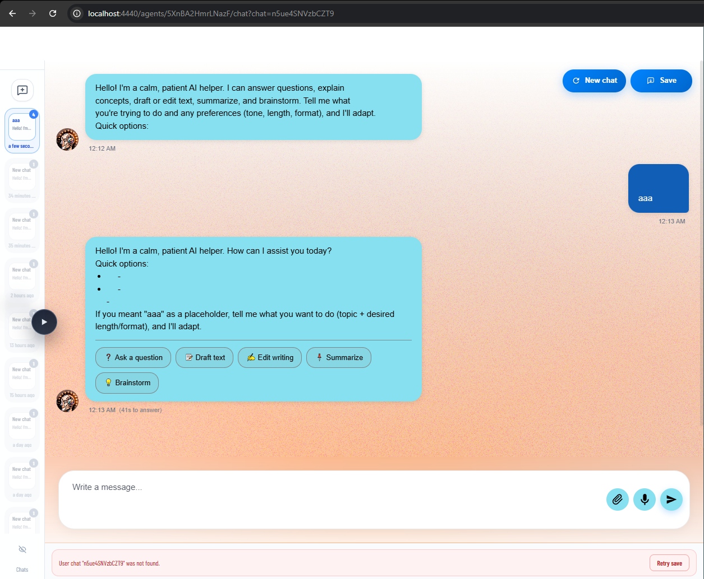
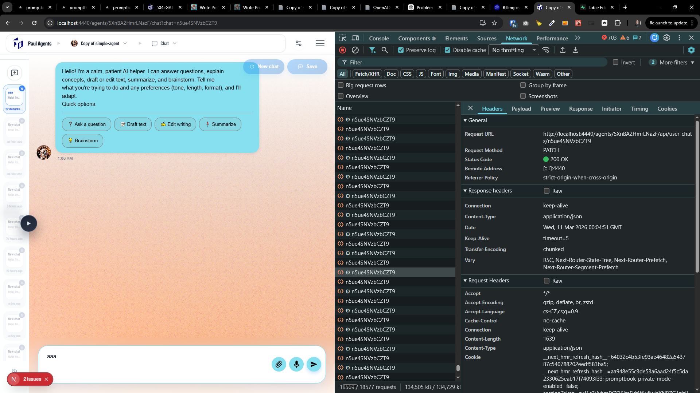
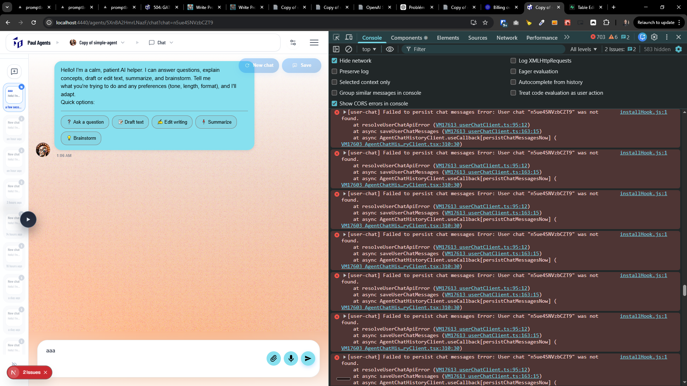

[x] ~$0.3271 an hour by OpenAI Codex `gpt-5.3-codex` - not working

---

[x] ~$1.03 2 hours by OpenAI Codex `gpt-5.3-codex`

[✨🧒] My chats are not saved

-   I see my chat during the chatting but after refreshing the page it vanishes
-   It often changes how many chats I have in my chats left tray
-   They can suddenly disappear without any apparent reason
-   The problem doesn’t occur during the chatting in one thread itself, but it occurs when I refresh the page or when I have multiple chats and I switch between them, then some of them can disappear, sometimes disappear only one, sometimes all of them, and I see "No chats yet" in the left tray.
-   Once the chat is lost, it is lost forever, I cannot see it again, and I have to start a new chat with the agent, and I lose all the history of the previous chat, which is very bad experience.
-   Every chat has its own id `https://pavol-hejny.ptbk.io/agents/5XnBA2HmrLNazF/chat?chat=NhK39CyRyguBxT`, the `NhK39CyRyguBxT` is the id of the chat
-   Chats should be immutable, once they are created, they are append-only, they should not be changed or deleted, and they should be stored in the database permanently, so the user can see the full history of his chats with the agent, and he can refresh the page or switch between chats without losing any of them.
-   When the user navigates to the chat with the specific id, he should see the full history of that chat, and it should not matter whether he is refreshing the page or switching between chats, he should always see the full history of that chat.
-   Despite I have chatted with the agent, I see no history of it in the "My chats" sidebar panel, and after refreshing the page, the chat is lost and I see "No chats yet"
-   Do theese things
    1.  Try to fix this issue
    2.  When there is some problem with saving, indicate it simmilar to the book editor fail save
-   Keep in mind the DRY _(don't repeat yourself)_ principle, share thi notification warning when the chat saving fails with the book editor save failure notification, they should look the same and be reused
-   Do a proper analysis of the current functionality before you start implementing.
-   You are working with the [Agents Server](apps/agents-server)
-   If you need to do the database for the fix migration, do it

---

[x] ~$1.70 2 hours by OpenAI Codex `gpt-5.3-codex`

[✨🧒] Fix loading of my previous chats

-   I have some previous chats with the agent, they are saved and shown in my chats panel BUT when I try to load them, they are not loaded, I see just empty fresh chat without any history
-   But in a panel I clearly see that the chat is existing and I see number of messages in it, but when I click on it, I see just empty chat
-   Every chat has its own id `https://pavol-hejny.ptbk.io/agents/5XnBA2HmrLNazF/chat?chat=NhK39CyRyguBxT`, the `NhK39CyRyguBxT` is the id of the chat
-   Chats are append-only, once they are created, they should not be changed or deleted, just adding new messages, and they should be stored in the database
-   Keep in mind the DRY _(don't repeat yourself)_ principle.
-   Do a proper analysis of the current functionality before you start implementing.
-   You are working with the [Agents Server](apps/agents-server)

---

[ ] !!!!!!

[✨🧒] Fix loading of my chats

-   I have some previous chats with the agent, they are saved and shown in my chats panel BUT when I try to load them, they are not loaded, I see just empty fresh chat without any history
-   But in a panel I clearly see that the chat is existing and I see number of messages in it, but when I click on it, I see just empty chat
-   Every chat has its own id `https://pavol-hejny.ptbk.io/agents/5XnBA2HmrLNazF/chat?chat=n5ue4SNVzbCZT9`, the `n5ue4SNVzbCZT9` is the id of the chat
-   Chats are append-only, once they are created, they should not be changed or deleted, just adding new messages, and they should be stored in the database
-   Also the route endpoint `http://localhost:4440/agents/5XnBA2HmrLNazF/api/user-chats/n5ue4SNVzbCZT9` is constantly bombarded without any reason
-   The message 'User chat "n5ue4SNVzbCZT9" was not found.' is shown in UI constantly blinks
-   Keep in mind the DRY _(don't repeat yourself)_ principle.
-   Do a proper analysis of the current functionality before you start implementing.
-   Do also analysis of the database structure and how the chats are stored in the database, and how they are loaded, and try to find out why they are not loaded correctly, and fix it.
-   You are working with the [Agents Server](apps/agents-server)

```
installHook.js:1 [user-chat] Failed to persist chat messages Error: User chat "n5ue4SNVzbCZT9" was not found.
    at resolveUserChatApiError (VM17613 userChatClient.ts:95:12)
    at async saveUserChatMessages (VM17613 userChatClient.ts:163:15)
    at async AgentChatHistoryClient.useCallback[persistChatMessagesNow] (VM17603 AgentChatHistoryClient.tsx:310:30)
```





**Expected behavior:**

-   When I navigate to the chat with the specific id, I should see the full history of that chat, and it should not matter whether I am refreshing the page or switching between chats, I should always see the full history of that chat.
-   The loading of the chat should be smooth and seamless, without any errors or blinks, and I should see the full history of the chat immediately when I navigate to it.
-   It shount bombarded with the requests to the server, minimize the number of requests to the server
-   I can switch between chats and refresh the page without losing any of them, and I can see the full history of each chat when I navigate to it.

---

[-]

[✨🧒] bar

-   @@@
-   Keep in mind the DRY _(don't repeat yourself)_ principle.
-   Do a proper analysis of the current functionality before you start implementing.
-   You are working with the [Agents Server](apps/agents-server)
-   If you need to do the database migration, do it
-   Add the changes into the [changelog](changelog/_current-preversion.md)

---

[-]

[✨🧒] bar

-   @@@
-   Keep in mind the DRY _(don't repeat yourself)_ principle.
-   Do a proper analysis of the current functionality before you start implementing.
-   You are working with the [Agents Server](apps/agents-server)
-   If you need to do the database migration, do it
-   Add the changes into the [changelog](changelog/_current-preversion.md)
