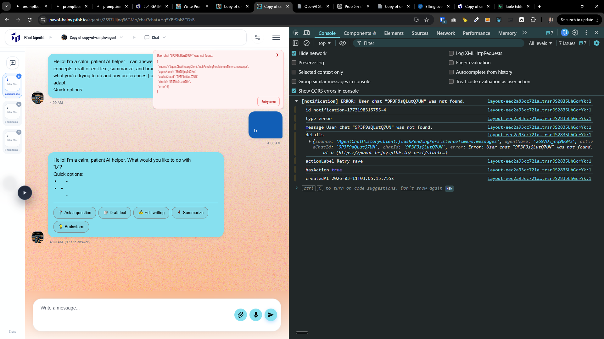
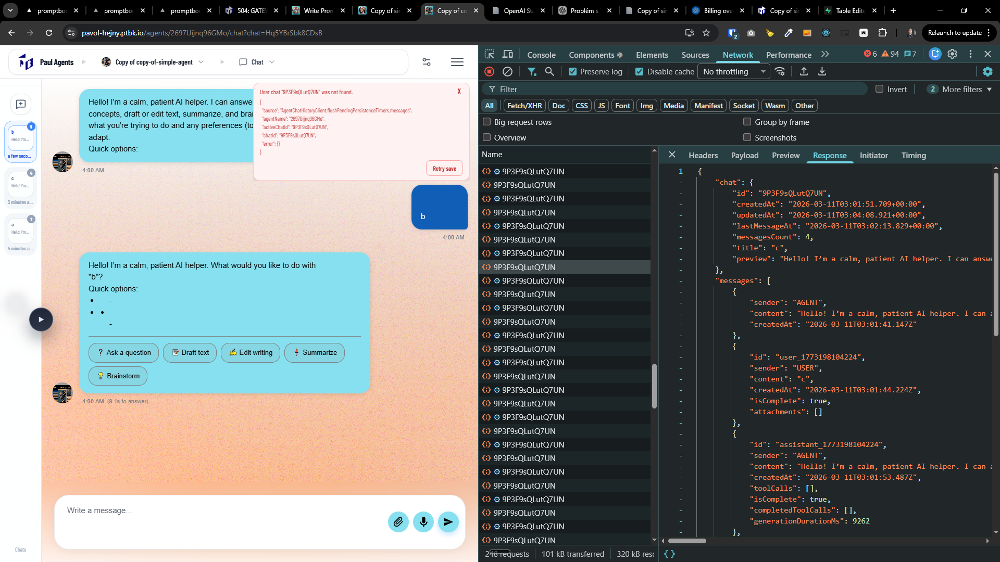
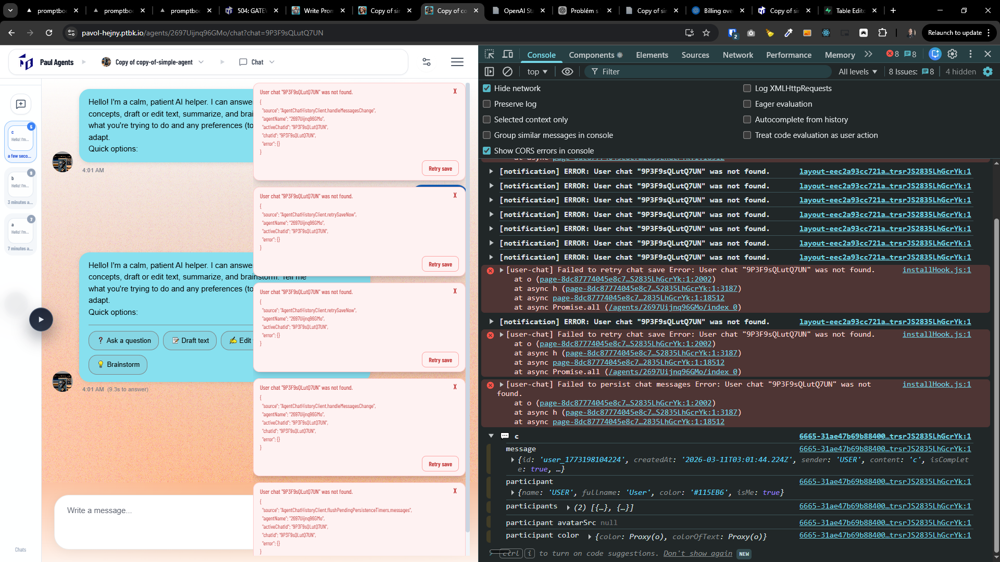
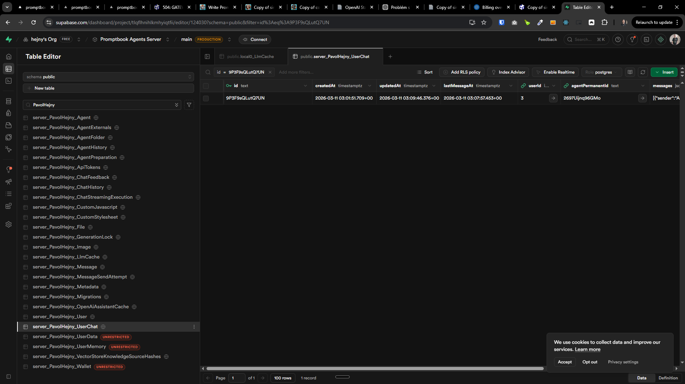
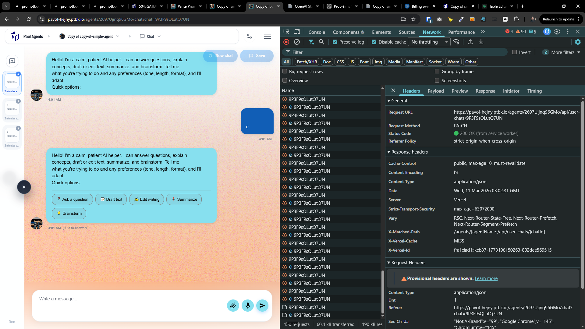
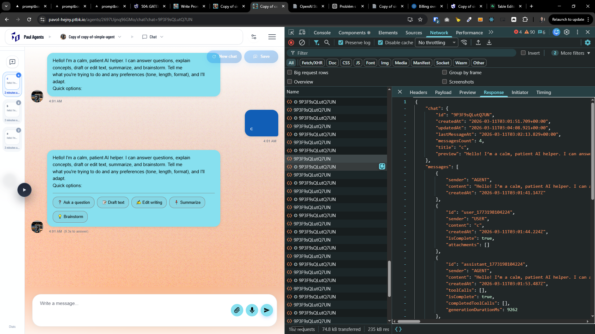

[ ]

[✨🧒] In the chat, there is constant error message, fix it

-   This error shouldn’t appear
-   Also improve the information in the error message, why is it happening, is it DB issue, or something else, provide more details in the error message, so it can be easily debugged and fixed
-   You are working with the [Agents Server](apps/agents-server)

```
[notification] ERROR: User chat "9P3F9sQLutQ7UN" was not found.
layout-eec2a93cc721ab32.js?dpl=dpl_F2PbGoCwUmktrsrJS2835LhGcrYk:1 id notification-1773198315755-4
layout-eec2a93cc721ab32.js?dpl=dpl_F2PbGoCwUmktrsrJS2835LhGcrYk:1 type error
layout-eec2a93cc721ab32.js?dpl=dpl_F2PbGoCwUmktrsrJS2835LhGcrYk:1 message User chat "9P3F9sQLutQ7UN" was not found.
layout-eec2a93cc721ab32.js?dpl=dpl_F2PbGoCwUmktrsrJS2835LhGcrYk:1 details {source: 'AgentChatHistoryClient.flushPendingPersistenceTimers.messages', agentName: '2697Uijnq96GMo', activeChatId: '9P3F9sQLutQ7UN', chatId: '9P3F9sQLutQ7UN', error: Error: User chat "9P3F9sQLutQ7UN" was not found.
    at o (https://pavol-hejny.ptbk.io/_next/static…}
layout-eec2a93cc721ab32.js?dpl=dpl_F2PbGoCwUmktrsrJS2835LhGcrYk:1 actionLabel Retry save
layout-eec2a93cc721ab32.js?dpl=dpl_F2PbGoCwUmktrsrJS2835LhGcrYk:1 hasAction true
layout-eec2a93cc721ab32.js?dpl=dpl_F2PbGoCwUmktrsrJS2835LhGcrYk:1 createdAt 2026-03-11T03:05:15.755Z
```

```json
{
    "source": "AgentChatHistoryClient.flushPendingPersistenceTimers.messages",
    "agentName": "2697Uijnq96GMo",
    "activeChatId": "9P3F9sQLutQ7UN",
    "chatId": "9P3F9sQLutQ7UN",
    "error": {}
}
```





**The database record exists:**

```sql
INSERT INTO "public"."server_PavolHejny_UserChat" ("id", "createdAt", "updatedAt", "lastMessageAt", "userId", "agentPermanentId", "messages", "draftMessage") VALUES ('9P3F9sQLutQ7UN', '2026-03-11 03:01:51.709+00', '2026-03-11 03:11:26.299+00', '2026-03-11 03:07:57.453+00', '3', '2697Uijnq96GMo', '[{"sender": "AGENT", "content": "Hello! I’m a calm, patient AI helper. I can answer questions, explain concepts, draft or edit text, summarize, and brainstorm. Tell me what you’re trying to do and any preferences (tone, length, format), and I’ll adapt.\\n\\nQuick options:\\n[❓ Ask a question](?message=I%20have%20a%20question%20about%20___)\\n[📝 Draft text](?message=Please%20draft%20a%20message%20about%20___)\\n[✍️ Edit writing](?message=Please%20edit%20this%20text%20for%20clarity%20and%20tone%3A%20___)\\n[📌 Summarize](?message=Please%20summarize%20this%3A%20___)\\n[💡 Brainstorm](?message=Brainstorm%2010%20ideas%20for%20___)", "createdAt": "2026-03-11T03:01:41.147Z"}, {"id": "user_1773198104224", "sender": "USER", "content": "c", "createdAt": "2026-03-11T03:01:44.224Z", "isComplete": true, "attachments": []}, {"id": "assistant_1773198104224", "sender": "AGENT", "content": "Hello! I’m a calm, patient AI helper. I can answer questions, explain concepts, draft or edit text, summarize, and brainstorm. Tell me what you’re trying to do and any preferences (tone, length, format), and I’ll adapt.\\n\\nQuick options:  \\n[❓ Ask a question](?message=I%20have%20a%20question%20about%20___)  \\n[📝 Draft text](?message=Please%20draft%20a%20message%20about%20___)  \\n[✍️ Edit writing](?message=Please%20edit%20this%20text%20for%20clarity%20and%20tone%3A%20___)  \\n[📌 Summarize](?message=Please%20summarize%20this%3A%20___)  \\n[💡 Brainstorm](?message=Brainstorm%2010%20ideas%20for%20___)", "createdAt": "2026-03-11T03:01:53.487Z", "toolCalls": [], "isComplete": true, "completedToolCalls": [], "generationDurationMs": 9262}, {"sender": "AGENT", "content": "Hello! I’m a calm, patient AI helper. I can answer questions, explain concepts, draft or edit text, summarize, and brainstorm. Tell me what you’re trying to do and any preferences (tone, length, format), and I’ll adapt.\\n\\nQuick options:\\n[❓ Ask a question](?message=I%20have%20a%20question%20about%20___)\\n[📝 Draft text](?message=Please%20draft%20a%20message%20about%20___)\\n[✍️ Edit writing](?message=Please%20edit%20this%20text%20for%20clarity%20and%20tone%3A%20___)\\n[📌 Summarize](?message=Please%20summarize%20this%3A%20___)\\n[💡 Brainstorm](?message=Brainstorm%2010%20ideas%20for%20___)", "createdAt": "2026-03-11T03:02:13.829Z"}, {"sender": "AGENT", "content": "Hello! I’m a calm, patient AI helper. I can answer questions, explain concepts, draft or edit text, summarize, and brainstorm. Tell me what you’re trying to do and any preferences (tone, length, format), and I’ll adapt.\\n\\nQuick options:\\n[❓ Ask a question](?message=I%20have%20a%20question%20about%20___)\\n[📝 Draft text](?message=Please%20draft%20a%20message%20about%20___)\\n[✍️ Edit writing](?message=Please%20edit%20this%20text%20for%20clarity%20and%20tone%3A%20___)\\n[📌 Summarize](?message=Please%20summarize%20this%3A%20___)\\n[💡 Brainstorm](?message=Brainstorm%2010%20ideas%20for%20___)", "createdAt": "2026-03-11T03:07:57.453Z"}]', null), ('Hq5YBrSbk8CDsB', '2026-03-11 03:00:11.849+00', '2026-03-11 03:08:08.816+00', '2026-03-11 03:05:16.104+00', '3', '2697Uijnq96GMo', '[{"sender": "AGENT", "content": "Hello! I’m a calm, patient AI helper. I can answer questions, explain concepts, draft or edit text, summarize, and brainstorm. Tell me what you’re trying to do and any preferences (tone, length, format), and I’ll adapt.\\n\\nQuick options:\\n[❓ Ask a question](?message=I%20have%20a%20question%20about%20___)\\n[📝 Draft text](?message=Please%20draft%20a%20message%20about%20___)\\n[✍️ Edit writing](?message=Please%20edit%20this%20text%20for%20clarity%20and%20tone%3A%20___)\\n[📌 Summarize](?message=Please%20summarize%20this%3A%20___)\\n[💡 Brainstorm](?message=Brainstorm%2010%20ideas%20for%20___)", "createdAt": "2026-03-11T03:00:01.466Z"}, {"id": "user_1773198003866", "sender": "USER", "content": "b", "createdAt": "2026-03-11T03:00:03.866Z", "isComplete": true, "attachments": []}, {"id": "assistant_1773198003866", "sender": "AGENT", "content": "Hello! I’m a calm, patient AI helper. What would you like to do with “b”?\\n\\nQuick options:\\n- [❓ Ask a question](?message=I%20have%20a%20question%20about%20b%3A%20___)\\n- [📝 Draft text](?message=Please%20draft%20a%20message%20that%20includes%20the%20letter%20b%20about%20___)\\n- [✍️ Edit writing](?message=Please%20edit%20this%20text%20for%20clarity%20and%20tone%3A%20b%20___)\\n- [📌 Summarize](?message=Please%20summarize%20this%3A%20b%20___)\\n- [💡 Brainstorm](?message=Brainstorm%2010%20ideas%20starting%20with%20b%20for%20___)", "createdAt": "2026-03-11T03:00:12.997Z", "toolCalls": [], "isComplete": true, "completedToolCalls": [], "generationDurationMs": 9131}, {"sender": "AGENT", "content": "Hello! I’m a calm, patient AI helper. I can answer questions, explain concepts, draft or edit text, summarize, and brainstorm. Tell me what you’re trying to do and any preferences (tone, length, format), and I’ll adapt.\\n\\nQuick options:\\n[❓ Ask a question](?message=I%20have%20a%20question%20about%20___)\\n[📝 Draft text](?message=Please%20draft%20a%20message%20about%20___)\\n[✍️ Edit writing](?message=Please%20edit%20this%20text%20for%20clarity%20and%20tone%3A%20___)\\n[📌 Summarize](?message=Please%20summarize%20this%3A%20___)\\n[💡 Brainstorm](?message=Brainstorm%2010%20ideas%20for%20___)", "createdAt": "2026-03-11T03:00:28.812Z"}, {"sender": "AGENT", "content": "Hello! I’m a calm, patient AI helper. I can answer questions, explain concepts, draft or edit text, summarize, and brainstorm. Tell me what you’re trying to do and any preferences (tone, length, format), and I’ll adapt.\\n\\nQuick options:\\n[❓ Ask a question](?message=I%20have%20a%20question%20about%20___)\\n[📝 Draft text](?message=Please%20draft%20a%20message%20about%20___)\\n[✍️ Edit writing](?message=Please%20edit%20this%20text%20for%20clarity%20and%20tone%3A%20___)\\n[📌 Summarize](?message=Please%20summarize%20this%3A%20___)\\n[💡 Brainstorm](?message=Brainstorm%2010%20ideas%20for%20___)", "createdAt": "2026-03-11T03:00:41.537Z"}, {"sender": "AGENT", "content": "Hello! I’m a calm, patient AI helper. I can answer questions, explain concepts, draft or edit text, summarize, and brainstorm. Tell me what you’re trying to do and any preferences (tone, length, format), and I’ll adapt.\\n\\nQuick options:\\n[❓ Ask a question](?message=I%20have%20a%20question%20about%20___)\\n[📝 Draft text](?message=Please%20draft%20a%20message%20about%20___)\\n[✍️ Edit writing](?message=Please%20edit%20this%20text%20for%20clarity%20and%20tone%3A%20___)\\n[📌 Summarize](?message=Please%20summarize%20this%3A%20___)\\n[💡 Brainstorm](?message=Brainstorm%2010%20ideas%20for%20___)", "createdAt": "2026-03-11T03:00:48.462Z"}, {"sender": "AGENT", "content": "Hello! I’m a calm, patient AI helper. I can answer questions, explain concepts, draft or edit text, summarize, and brainstorm. Tell me what you’re trying to do and any preferences (tone, length, format), and I’ll adapt.\\n\\nQuick options:\\n[❓ Ask a question](?message=I%20have%20a%20question%20about%20___)\\n[📝 Draft text](?message=Please%20draft%20a%20message%20about%20___)\\n[✍️ Edit writing](?message=Please%20edit%20this%20text%20for%20clarity%20and%20tone%3A%20___)\\n[📌 Summarize](?message=Please%20summarize%20this%3A%20___)\\n[💡 Brainstorm](?message=Brainstorm%2010%20ideas%20for%20___)", "createdAt": "2026-03-11T03:01:34.653Z"}, {"sender": "AGENT", "content": "Hello! I’m a calm, patient AI helper. I can answer questions, explain concepts, draft or edit text, summarize, and brainstorm. Tell me what you’re trying to do and any preferences (tone, length, format), and I’ll adapt.\\n\\nQuick options:\\n[❓ Ask a question](?message=I%20have%20a%20question%20about%20___)\\n[📝 Draft text](?message=Please%20draft%20a%20message%20about%20___)\\n[✍️ Edit writing](?message=Please%20edit%20this%20text%20for%20clarity%20and%20tone%3A%20___)\\n[📌 Summarize](?message=Please%20summarize%20this%3A%20___)\\n[💡 Brainstorm](?message=Brainstorm%2010%20ideas%20for%20___)", "createdAt": "2026-03-11T03:02:06.755Z"}, {"sender": "AGENT", "content": "Hello! I’m a calm, patient AI helper. I can answer questions, explain concepts, draft or edit text, summarize, and brainstorm. Tell me what you’re trying to do and any preferences (tone, length, format), and I’ll adapt.\\n\\nQuick options:\\n[❓ Ask a question](?message=I%20have%20a%20question%20about%20___)\\n[📝 Draft text](?message=Please%20draft%20a%20message%20about%20___)\\n[✍️ Edit writing](?message=Please%20edit%20this%20text%20for%20clarity%20and%20tone%3A%20___)\\n[📌 Summarize](?message=Please%20summarize%20this%3A%20___)\\n[💡 Brainstorm](?message=Brainstorm%2010%20ideas%20for%20___)", "createdAt": "2026-03-11T03:05:16.104Z"}]', null), ('SxGbufVGpCkdy5', '2026-03-11 02:57:58.099+00', '2026-03-11 03:01:46.993+00', '2026-03-11 03:01:29.926+00', '3', '2697Uijnq96GMo', '[{"sender": "AGENT", "content": "Hello! I’m a calm, patient AI helper. I can answer questions, explain concepts, draft or edit text, summarize, and brainstorm. Tell me what you’re trying to do and any preferences (tone, length, format), and I’ll adapt.\\n\\nQuick options:\\n[❓ Ask a question](?message=I%20have%20a%20question%20about%20___)\\n[📝 Draft text](?message=Please%20draft%20a%20message%20about%20___)\\n[✍️ Edit writing](?message=Please%20edit%20this%20text%20for%20clarity%20and%20tone%3A%20___)\\n[📌 Summarize](?message=Please%20summarize%20this%3A%20___)\\n[💡 Brainstorm](?message=Brainstorm%2010%20ideas%20for%20___)", "createdAt": "2026-03-11T02:57:46.924Z"}, {"id": "user_1773197866938", "sender": "USER", "content": "a", "createdAt": "2026-03-11T02:57:46.937Z", "isComplete": true, "attachments": []}, {"id": "assistant_1773197866938", "sender": "AGENT", "content": "Hello! I’m a calm, patient AI helper. I can answer questions, explain concepts, draft or edit text, summarize, and brainstorm. Tell me what you’re trying to do and any preferences (tone, length, format), and I’ll adapt.\\n\\nQuick options:\\n- [❓ Ask a question](?message=I%20have%20a%20question%20about%20___)\\n- [📝 Draft text](?message=Please%20draft%20a%20message%20about%20___)\\n- [✍️ Edit writing](?message=Please%20edit%20this%20text%20for%20clarity%20and%20tone%3A%20___)\\n- [📌 Summarize](?message=Please%20summarize%20this%3A%20___)\\n- [💡 Brainstorm](?message=Brainstorm%2010%20ideas%20for%20___)\\n\\nIf you meant something specific by “a,” please share a bit more context (for example: a topic, a sentence to edit, or a goal).", "createdAt": "2026-03-11T02:58:00.396Z", "toolCalls": [], "isComplete": true, "completedToolCalls": [], "generationDurationMs": 13458}, {"sender": "AGENT", "content": "Hello! I’m a calm, patient AI helper. I can answer questions, explain concepts, draft or edit text, summarize, and brainstorm. Tell me what you’re trying to do and any preferences (tone, length, format), and I’ll adapt.\\n\\nQuick options:\\n[❓ Ask a question](?message=I%20have%20a%20question%20about%20___)\\n[📝 Draft text](?message=Please%20draft%20a%20message%20about%20___)\\n[✍️ Edit writing](?message=Please%20edit%20this%20text%20for%20clarity%20and%20tone%3A%20___)\\n[📌 Summarize](?message=Please%20summarize%20this%3A%20___)\\n[💡 Brainstorm](?message=Brainstorm%2010%20ideas%20for%20___)", "createdAt": "2026-03-11T02:59:56.015Z"}, {"sender": "AGENT", "content": "Hello! I’m a calm, patient AI helper. I can answer questions, explain concepts, draft or edit text, summarize, and brainstorm. Tell me what you’re trying to do and any preferences (tone, length, format), and I’ll adapt.\\n\\nQuick options:\\n[❓ Ask a question](?message=I%20have%20a%20question%20about%20___)\\n[📝 Draft text](?message=Please%20draft%20a%20message%20about%20___)\\n[✍️ Edit writing](?message=Please%20edit%20this%20text%20for%20clarity%20and%20tone%3A%20___)\\n[📌 Summarize](?message=Please%20summarize%20this%3A%20___)\\n[💡 Brainstorm](?message=Brainstorm%2010%20ideas%20for%20___)", "createdAt": "2026-03-11T03:00:34.109Z"}, {"sender": "AGENT", "content": "Hello! I’m a calm, patient AI helper. I can answer questions, explain concepts, draft or edit text, summarize, and brainstorm. Tell me what you’re trying to do and any preferences (tone, length, format), and I’ll adapt.\\n\\nQuick options:\\n[❓ Ask a question](?message=I%20have%20a%20question%20about%20___)\\n[📝 Draft text](?message=Please%20draft%20a%20message%20about%20___)\\n[✍️ Edit writing](?message=Please%20edit%20this%20text%20for%20clarity%20and%20tone%3A%20___)\\n[📌 Summarize](?message=Please%20summarize%20this%3A%20___)\\n[💡 Brainstorm](?message=Brainstorm%2010%20ideas%20for%20___)", "createdAt": "2026-03-11T03:00:44.009Z"}, {"sender": "AGENT", "content": "Hello! I’m a calm, patient AI helper. I can answer questions, explain concepts, draft or edit text, summarize, and brainstorm. Tell me what you’re trying to do and any preferences (tone, length, format), and I’ll adapt.\\n\\nQuick options:\\n[❓ Ask a question](?message=I%20have%20a%20question%20about%20___)\\n[📝 Draft text](?message=Please%20draft%20a%20message%20about%20___)\\n[✍️ Edit writing](?message=Please%20edit%20this%20text%20for%20clarity%20and%20tone%3A%20___)\\n[📌 Summarize](?message=Please%20summarize%20this%3A%20___)\\n[💡 Brainstorm](?message=Brainstorm%2010%20ideas%20for%20___)", "createdAt": "2026-03-11T03:01:29.926Z"}]', null);
```



**Also the route endpoint is constantly bombarded without any apparent reason or user action:**

-   This is probably related to the error

```bash
curl 'https://pavol-hejny.ptbk.io/agents/2697Uijnq96GMo/api/user-chats/9P3F9sQLutQ7UN' \
  -X 'PATCH' \
  -H 'x-anonymous-username: anonymous-w6y2ivg5P6dKWV' \
  -H 'sec-ch-ua-platform: "Windows"' \
  -H 'Referer: https://pavol-hejny.ptbk.io/agents/2697Uijnq96GMo/chat?chat=9P3F9sQLutQ7UN' \
  -H 'sec-ch-ua: "Not:A-Brand";v="99", "Google Chrome";v="145", "Chromium";v="145"' \
  -H 'sec-ch-ua-mobile: ?0' \
  -H 'User-Agent: Mozilla/5.0 (Windows NT 10.0; Win64; x64) AppleWebKit/537.36 (KHTML, like Gecko) Chrome/145.0.0.0 Safari/537.36' \
  -H 'DNT: 1' \
  -H 'content-type: application/json' \
  --data-raw $'{"messages":[{"sender":"AGENT","content":"Hello\u0021 I’m a calm, patient AI helper. I can answer questions, explain concepts, draft or edit text, summarize, and brainstorm. Tell me what you’re trying to do and any preferences (tone, length, format), and I’ll adapt.\\n\\nQuick options:\\n[❓ Ask a question](?message=I%20have%20a%20question%20about%20___)\\n[📝 Draft text](?message=Please%20draft%20a%20message%20about%20___)\\n[✍️ Edit writing](?message=Please%20edit%20this%20text%20for%20clarity%20and%20tone%3A%20___)\\n[📌 Summarize](?message=Please%20summarize%20this%3A%20___)\\n[💡 Brainstorm](?message=Brainstorm%2010%20ideas%20for%20___)","createdAt":"2026-03-11T03:01:41.147Z"},{"id":"user_1773198104224","createdAt":"2026-03-11T03:01:44.224Z","sender":"USER","content":"c","isComplete":true,"attachments":[]},{"id":"assistant_1773198104224","createdAt":"2026-03-11T03:01:53.487Z","sender":"AGENT","content":"Hello\u0021 I’m a calm, patient AI helper. I can answer questions, explain concepts, draft or edit text, summarize, and brainstorm. Tell me what you’re trying to do and any preferences (tone, length, format), and I’ll adapt.\\n\\nQuick options:  \\n[❓ Ask a question](?message=I%20have%20a%20question%20about%20___)  \\n[📝 Draft text](?message=Please%20draft%20a%20message%20about%20___)  \\n[✍️ Edit writing](?message=Please%20edit%20this%20text%20for%20clarity%20and%20tone%3A%20___)  \\n[📌 Summarize](?message=Please%20summarize%20this%3A%20___)  \\n[💡 Brainstorm](?message=Brainstorm%2010%20ideas%20for%20___)","isComplete":true,"toolCalls":[],"completedToolCalls":[],"generationDurationMs":9262}]}'
```



