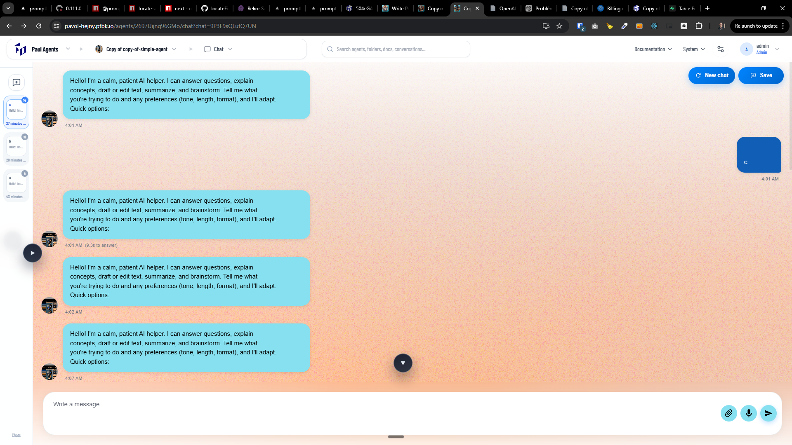

[x] ~$0.5045 20 minutes by OpenAI Codex `gpt-5.3-codex`

[✨🧒] In the chat, when I load the chat, the initial message appears.

-   Every time I switch chat, a new initial message appears.
-   The initial message should be ONLY the first message in a chat thread.
-   Once the chat started, the initial message should not be added anymore, even if I switch between chats or refresh the page, the initial message should be only once in the chat history, and it should not be duplicated.
-   Initial message is reserverd only for the first message in the one chat
-   Keep in mind the DRY _(don't repeat yourself)_ principle.
-   Do a proper analysis of the current functionality of chats, my chats and `INITIAL MESSAGE` commitment before you start implementing.
-   You are working with the [Agents Server](apps/agents-server)

