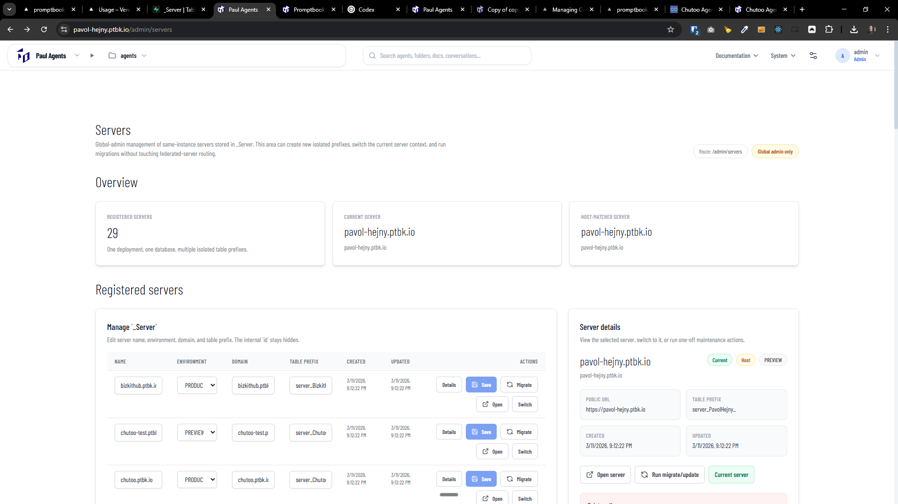
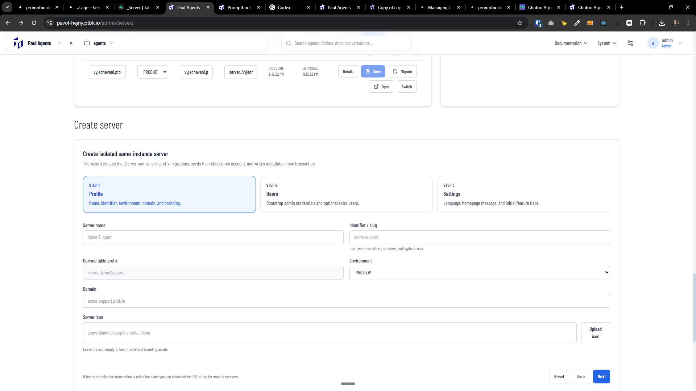

[x] ~$0.00 an hour by OpenAI Codex `gpt-5.4`

[✨🥇] Servers dashboard: Allow to manage running servers withing the instance from admin UI

-   Allow to manage table `_Server` from admin UI
-   This is a spetial-permition feature, only a hlobal admin can do it - `admin` logged via `ADMIN_PASSWORD` env var
    -   No other feature is locked for admins defined in `User` table, just this one, because it can manage other servers, so it is a super-admin feature
    -   Also be aware that `_Server` table in only table without prefix and migrations
-   Implement a new “Servers” area in the administration UI where logged-in admin users can list and create isolated servers (Discord-like “servers”) running under the same Agents Server instance (one deployment, one DB, multiple table prefixes).
-   This is NOT federated servers: federated servers are about interoperability across separate servers/instances; the feature here is about spawning additional isolated servers within the same deployment via prefixes and the `_Server` configuration.

-   Administration UI

    -   Add new navigation item “System -> Servers” in the admin dashboard.
    -   Servers list should allow to edit `name`, `environment`, `domain`, `tablePrefix` and show `createdAt` and `updatedAt`. The `id` should be hidden
    -   Allow to add new servers
    -   From the list, allow: open/switch-to server, view details, run “migrate/update” action
    -   Explicitly disallow deleting servers in UI for now (or only allow deleting own servers if we later add it); user requirement: “You cannot delete another server from another server but you can create a new one.”
    -   There should be clear which server is currently one, for the others there should be switch button
    -   Allow to delete only the current server, but not the others, add red button to the bottm "Dedete this server" and add a confirmation dialog with "Are you sure you want to delete this server? This action cannot be undone." with need to type the server name to confirm.
        -   BUT on the background just delete server from `_Server` table and **do not delete the tables with prefix**

-   Create server wizard

    -   Add a simple multi-step form/wizard to create a server.
    -   Reuse all the existing components and styles from the admin UI, metadata etc. to keep it consistent and DRY
    -   Required fields:
        -   server name
        -   server icon (upload or keep default)
        -   admin username + admin password for the new server (these credentials are for the spawned server’s internal admin account, not necessarily the creating user).
            -   Allow to create extra users for the server as well, but at least one admin user must be created during the wizard.
    -   Other basic stuff:
        -   initial settings (language, homepage settings, feature flags)
    -   Validation:
        -   server identifier/slug must be unique and safe for prefix usage;
        -   password policy (use the existing password validation logic)
    -   When this is submitted, it should create entry in the `_Server` table, run all the migrations for the new server prefix, and populate the new server from a form data (e.g., create the admin user with provided credentials, set initial settings, etc.). After successful creation, it should navigate to the new server’s dashboard.
    -   Do this in a transaction, so if any step fails (e.g., migration error), the whole creation is rolled back and no partial server is left.
        -   Do not create some extra migration script for this, just use current migration mechanism or create shared common code for running migrations on demand for a given prefix, so it is consistent with the regular migration process and we **do not duplicate logic**.
        -   If migration fails, show the error message and allow to download the SQL dump of the creating transaction for backup and manual server creation with info to contact "support@ptbk.io".

-   Keep in mind the DRY _(don't repeat yourself)_ principle.
-   Do a proper analysis of the current functionality before you start implementing.
-   You are working with the [Agents Server](apps/agents-server)
-   Add the changes into the [changelog](changelog/_current-preversion.md)

---

[ ]

[✨🥇] Enhance servers dashboard /admin/servers

-   Do several improvements to the servers dashboard:
    1. Registered servers should have one-column layout, Server details are completelly unnecessary because all the information about the server is already visible in the table
    2. Registered servers should be shown in more table-like layout to easily distinguish different servers and their details and columns should be aligned
    3. Format the dates in moment.js
    4. Remove the Swich button and completely remove the ability to switch between servers via the state in the session - domain should determine the server
    5. Change button "open" to "switch" and do not open the server in the new tab, also do not navigate to the homepage but to the dashboard of the server on that server
    6. Create server should be opened in some modal after clicking on a button "Create new server"
    7. Remove texts "Global-admin management of same-instance servers stored in \_Server. This area can create new isolated prefixes, switch the current server context, and run migrations without touching federated-server routing.", "Route: /admin/servers", "Manage `_Server`", "Edit server name, environment, domain, and table prefix. The internal `id` stays hidden." from the top of the page, it is not needed
    8. Change text "\_Server" to "servers" across the page, it is more user-friendly and less technical, do not expose the technical details about the implementation in the UI
    9. When I have changes in the table or form, do not allow to refresh the page or navigate away without confirmation, because I can lose the changes, add a confirmation dialog "You have unsaved changes, are you sure you want to leave this page?" when I try to refresh or navigate away with unsaved changes
-   Keep in mind the DRY _(don't repeat yourself)_ principle.
-   Do a proper analysis of the current functionality before you start implementing.
-   You are working with the [Agents Server](apps/agents-server)
-   If you need to do the database migration, do it

---

[-]

[✨🥇] baz

-   @@@
-   Keep in mind the DRY _(don't repeat yourself)_ principle.
-   Do a proper analysis of the current functionality before you start implementing.
-   You are working with the [Agents Server](apps/agents-server)
-   If you need to do the database migration, do it
-   Add the changes into the [changelog](changelog/_current-preversion.md)

---

[-]

[✨🥇] baz

-   @@@
-   Keep in mind the DRY _(don't repeat yourself)_ principle.
-   Do a proper analysis of the current functionality before you start implementing.
-   You are working with the [Agents Server](apps/agents-server)
-   If you need to do the database migration, do it
-   Add the changes into the [changelog](changelog/_current-preversion.md)
