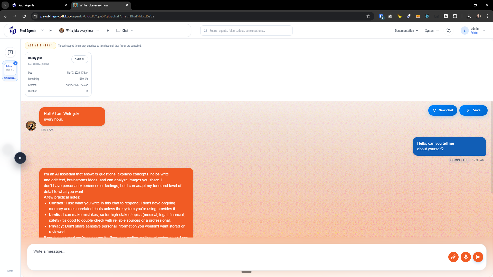

[x] ~$0.00 2 hours by OpenAI Codex `gpt-5.4`

[✨🧂] USE TIMEOUT commitment method (thread-scoped timers)

```book
Email reply agent

USE BROWSER  Login to LinkedIn, check messages and reply to everything that from HR managers with a polite and professional message that also tries to get more info about the job position and company. Do not reply to messages that are not from HR managers.
USE TIMEOUT Check LinkedIn messages every hour

CLOSED

```

-   Implement new commitment method `USE TIMEOUT` that behaves kinda like `setTimeout` (two argument `milliseconds: number; message?: string`) and is scoped to a single chat thread (not to the agent globally).
-   When the agent has commitment `USE TIMEOUT`, it has tool `set_timeout` the toolcall resolves immediately with a short response like `The timer was set.` and returns a unique `timeoutId` (used only for cancellation + UI).
-   After the timeout elapses, the agent is woken up by injecting a new user-like event/message into the same chat thread, so it continues with full previous context as if the user manually typed at that time.
    -   Agent should have clear context info if he is prompted by the user or woken up by the timeout (e.g. `⏱️ Timeout elapsed after 60000ms`) and also have access to the `timeoutId` in the context of the wake-up message, so it can correlate with the original timeout call if needed.
    -   Agent can set multiple timeouts in the same thread, and they should all fire independently with their own `timeoutId`.
        -   For example, the agent can set a timeout for 1 minute `Check emails` and another timeout for 1 hour `Check calendar`, and when the first timeout fires after 1 minute, the agent can check emails and then decide to cancel the second timeout if it is no longer relevant.
    -   When the agent is woken up by the timeout, it should continue its work and can call tools, send messages, or even set another timeout, etc. It should be able to do everything it could do if it was woken up by a normal user message.
    -   The injected message should explicitly say it is a timeout wake-up (e.g. `⏱️ Timeout elapsed after 60000ms, <message>`) and include `timeoutId`.
    -   Self-learning should work the same way for the timeout wake-up messages as for normal user messages, so if the agent learns something from the timeout wake-up message, it should be able to apply that learning in the future.
    -   Same for user memory, wallet, using browser, etc. The agent should be able to do everything it could do if it was woken up by a normal user message.
    -   The agent should be able to "message itself in the future" by scheduling a timeout and then, on wake-up, continuing work / calling tools / sending emails / committing, etc.
-   Split into two operational categories (same API, different implementation path):
    -   Short-running (seconds–~minutes): can be handled in-process (best effort) but must still be thread-scoped and visible/cancellable in UI.
    -   Long-running (~hours–days): must be persisted in DB and reliably executed even if user reloads, switches devices, or no client is focused.
-   UI requirements:
    -   In the chat thread where the timer is set, show a small persistent indication that one or more timers are active for this thread ("particle" / chip / badge).
    -   Show a list of active timers for the thread (at least: due time / remaining time, created time, timeout duration, timeoutId) with a **Cancel** action.
    -   User can cancel timers (idempotent cancel); user cannot edit/update existing timers.
    -   When timer fires, the UI should show the wake-up message in the transcript.
-   Server/runtime requirements:
    -   Store timeouts by `chatId` (thread id) and `timeoutId` and ensure multi-device consistency.
    -   Ensure that timeout execution is not coupled to browser focus and happens at the scheduled time.
    -   You should be able to see and manage timeouts in Task manager `/admin/task-manager`
    -   Define behavior for edge cases:
        -   If agent is currently running/streaming in same thread when timeout fires, queue the wake-up message to run after the current run finishes (no concurrent runs in one thread).
        -   If a timeout fires while the chat is archived/deleted drop it.
        -   On server restart, long-running timers must resume.
        -   Add minimal rate limits / caps per thread to prevent abuse.
            -   Create a admin page to set the rate limits / caps for the timeouts, for example max 5 active timers per thread, max 10 timers fired per day per thread, etc. There should be a default rate limit / cap that is applied if the admin does not set it, for example max 5 active timers per thread and max 10 timers fired per day per thread. You are for now only implementing the timeouts rate limits / caps, but in future it could be extended to other tools and commitments as well, so keep that in mind when designing the implementation.
-   Create dabase migration if needed
-   Background execution:
    -   Add a background scheduler/worker that periodically claims due timers (with locking) and enqueues a wake-up message into the correct chat processing pipeline.
    -   Ensure exactly-once or effectively-once delivery semantics (at least avoid double fire).
-   Commitments & protocol:
    -   Expose `USE TIMEOUT` in the commitments list for agents (similar to other `USE ...` commitments).
    -   The tool schema should be minimal: `{ milliseconds: number }`.
    -   The tool response should include `{ status: 'set', timeoutId, dueAt }` while the assistant-visible text is just `The timer was set.`
-   Observability:
    -   Log lifecycle events (set/cancel/fired/failed) and link them to `chatId` + `timeoutId`.
    -   Surface failures to the user in the same thread (system message) if a timer could not be executed, use standard error handling and warnings to the user and logging for that.
-   Keep in mind the DRY _(don't repeat yourself)_ principle.
-   Do a proper analysis of the current functionality before you start implementing.
-   You are working with the [Agents Server](apps/agents-server)
-   Files/areas to touch (non-exhaustive):
    -   `apps/agents-server` tool/commitment definitions + validation
    -   chat thread runtime / message injection pipeline
    -   UI chat thread components (timer indicator + cancel UI)
    -   DB schema + migrations + background worker/scheduler
-   If you need to do the database migration, do it
-   Add the changes into the [changelog](changelog/_current-preversion.md)

---

[-]

[✨🧂] brr

-   @@@
-   Keep in mind the DRY _(don't repeat yourself)_ principle.
-   Do a proper analysis of the current functionality before you start implementing.
-   You are working with the [Agents Server](apps/agents-server)
-   If you need to do the database migration, do it
-   Add the changes into the [changelog](changelog/_current-preversion.md)

---

[x] ~$0.7944 27 minutes by OpenAI Codex `gpt-5.4`

[✨🧂] Ehnance how timeouts are shown in the chat

-   `USE TIMEOUT` commitment is working perfectly, but the UI for showing the active timeouts is awful
-   When there is no active timeout, there should be no indication in the UI
-   When there is one active timeout, there should be a small badge/button on top-right corner of the chat simmilar to "New chat" and "Save" buttons with clock icon and timer "49m" (do not show seconds until 3 minutes remaining, then show "2m 59s", "2m 58s", etc. and when there is less than 1 minute remaining show "59s", "58s", etc.) Same with larger timeouts, for example "1h 49m", "2h 3m", etc. Do not show the exact due time, but only the remaining time in a user-friendly format.
-   When there are multiple active timeouts, show the most recent one (the one with the closest due time) in the badge/button, but when I click on it, it should show a list of all active timeouts for this chat with their remaining time and a cancel button for each timeout. The list can be a dropdown or a modal, but it should be easy to see all active timeouts and their remaining time.
-   But overall, the UI should be clean and not too intrusive, it should not take too much space or distract from the chat messages, but still be easily accessible and visible when there are active timeouts but not dominant things in the UI.
-   Also indicate running timeouts in the my chats left sidebar, it should be clear that that chat is "living"
-   Keep in mind the DRY _(don't repeat yourself)_ principle.
-   Try to reuse existing UI components and styles as much as possible and fit into the current design system, and patterns of the Agents Server UI.
-   Do a proper analysis of the current functionality before you start implementing.
-   You are working with the [Agents Server](apps/agents-server)
-   You are not changing the functionality of the timeouts, just the UI for showing the active timeouts and their remaining time, so you are not changing the backend or how the timeouts work, just how they are shown in the UI.



---

[-]

[✨🧂] brr

-   @@@
-   Keep in mind the DRY _(don't repeat yourself)_ principle.
-   Do a proper analysis of the current functionality before you start implementing.
-   You are working with the [Agents Server](apps/agents-server)
-   If you need to do the database migration, do it
-   Add the changes into the [changelog](changelog/_current-preversion.md)

