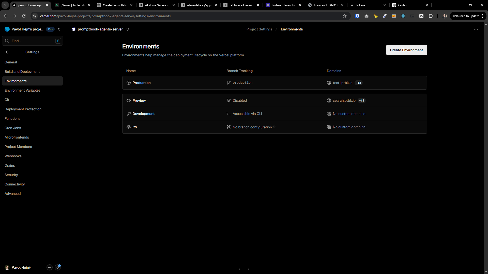
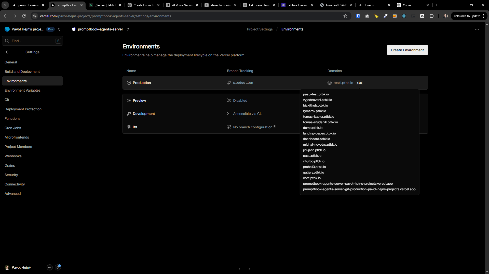
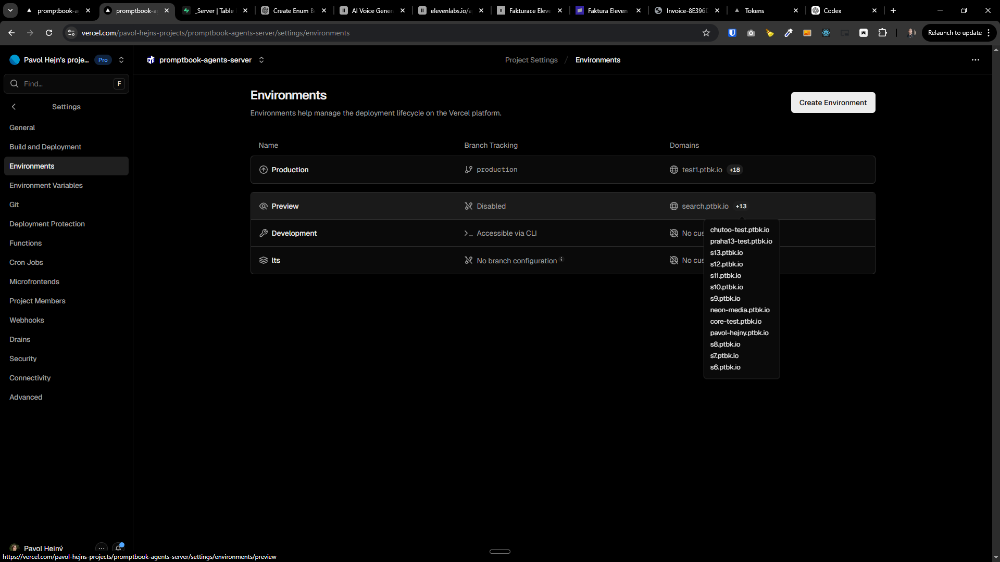
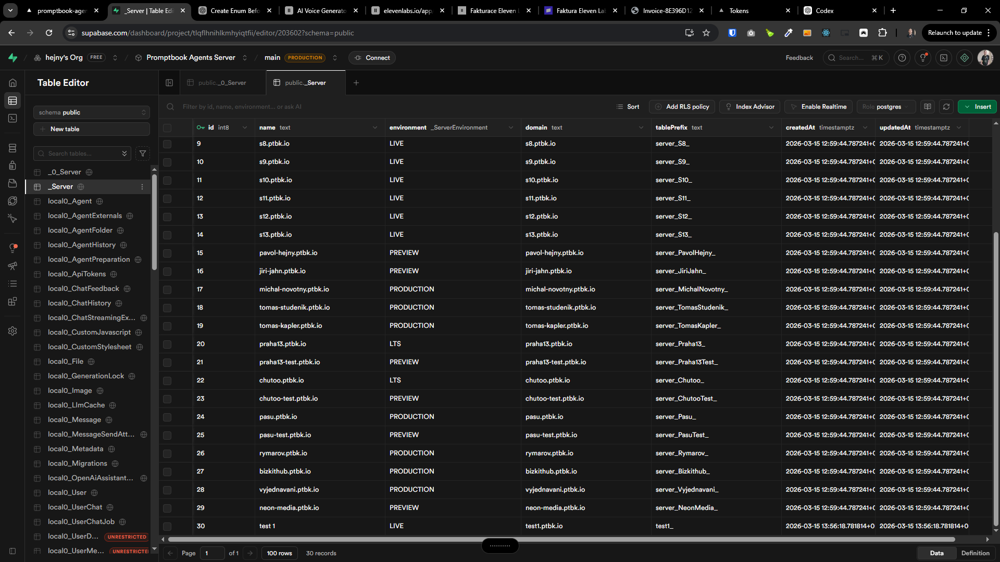

[x] ~$0.00 40 minutes by OpenAI Codex `gpt-5.4`

[🗄️🌐] Change env variable `SERVERS` to `_Server` database table

-   Problem: server environments are currently identified via env value `SERVERS` in DB / code, which is not scalable or flexible for managing lot of servers and their associated Vercel domains. For every change we need to update env vars and redeploy.
-   Change env variable `SERVERS` to `_Server` database table across the system
-   `_Server` table schema:
    -   `id` (primary key, auto-increment)
    -   `name` (string, unique) - e.g. "production-eu-west", "preview-1", etc.
    -   `environment` (enum: "PRODUCTION", "PREVIEW") - for grouping servers
    -   `domain` (string) - the Vercel domain associated with this server
    -   `tablePrefix` (string) - prefix for DB tables
    -   `createdAt`, `updatedAt` timestamps
-   Add ability to filter/select migrations by environment category as whole group:
    -   `production` (all production servers)
    -   `preview` (all preview servers)
    -   existing ability to target individual servers must remain.
-   Update/sync script: propagate mapping from `_Server` records to Vercel domains (so that Vercel domain configuration reflects servers known in DB).
    -   Register this script in `terminals.json`
-   Safety:
    -   Add dry-run mode for the sync script.
    -   Add logging suitable for CI (structured output).
-   Acceptance criteria:
    -   Running migrations filtered by `production` runs only production migrations.
    -   Running migrations filtered by `preview` runs only preview migrations.
    -   `_Server` is the single source of truth in DB and code.
    -   Sync script updates Vercel domains so that all `_Server` records are represented as domains, and removed servers are either deleted or flagged.
-   You are working with the [Agents Server](apps/agents-server)
-   You don’t need to keep backward compatibility
-   You are working with migration tooling and scripts
-   You are working with Vercel API for domain management
-   Add the changes into the [changelog](changelog/_current-preversion.md)

---

[x]

[🗄️🌐] Synchronization script should be mapping `_Server` records to Vercel domains and environments

-   Primary source of truth for server environments should be the `_Server` database table _(be aware this table is only unprefixed table)_, which contains records for each server environment with fields like `name`, `environment`, `domain`, and `tablePrefix`.
-   Vercel domains and which domain is running on which environment should be automatically managed based on the `_Server` records. For each record in `_Server`, there should be a corresponding Vercel domain configured to point to the correct server environment.
-   The script should do the synchronization

**This is the mapping logic:**

'LTS' -> branch `lts`, Vercel environment "lts"
'PRODUCTION' -> branch `production`, Vercel environment "Production"
'PREVIEW' -> branch `preview`, Vercel environment "Preview"
'LIVE' -> branch `main`, Vercel environment "Development"

**Existing script:**

-   The script already exist but it was created before the 4 environments were defined, and does not do the mapping propperly

```bash
$ npx tsx ./scripts/sync-vercel-domains.ts
{"level":"info","event":"server_registry_loaded","timestamp":"2026-03-15T14:23:51.952Z","count":30,"dryRun":false}
{"level":"info","event":"vercel_project_domains_loaded","timestamp":"2026-03-15T14:23:51.954Z","count":31,"ignoredCount":0,"dryRun":false}
{"level":"warn","event":"domain_flagged_removed_from_registry","timestamp":"2026-03-15T14:23:51.954Z","domain":"search.ptbk.io","dryRun":false}
{"level":"info","event":"sync_completed","timestamp":"2026-03-15T14:23:51.954Z","desiredCount":30,"addedCount":0,"verifyCount":0,"flaggedCount":1,"ignoredCount":0,"deleteRemoved":false,"dryRun":false}
```

**Context for synchronization:**

-   It should work for both creating new rows in `_Server` and updating existing ones (e.g., if the domain or environment changes, it should update the Vercel configuration accordingly) or deleting rows (e.g., if a server is removed from `_Server`, it should remove or disable the corresponding Vercel domain).
-   You are working with table [`_Server` in the database](apps/agents-server/src/database/_Server.sql)
    -   No other table in the database is relevant for this task
-   You are working with the [Vercel domains sync script](scripts/sync-vercel-domains.ts)
-   You are working with the [Agents Server](apps/agents-server)
-   You are working with migration tooling and scripts
-   You are working with Vercel API for domain management
-   Do a proper analysis of the current script and system of domains and environments of agents server before you start implementing.





