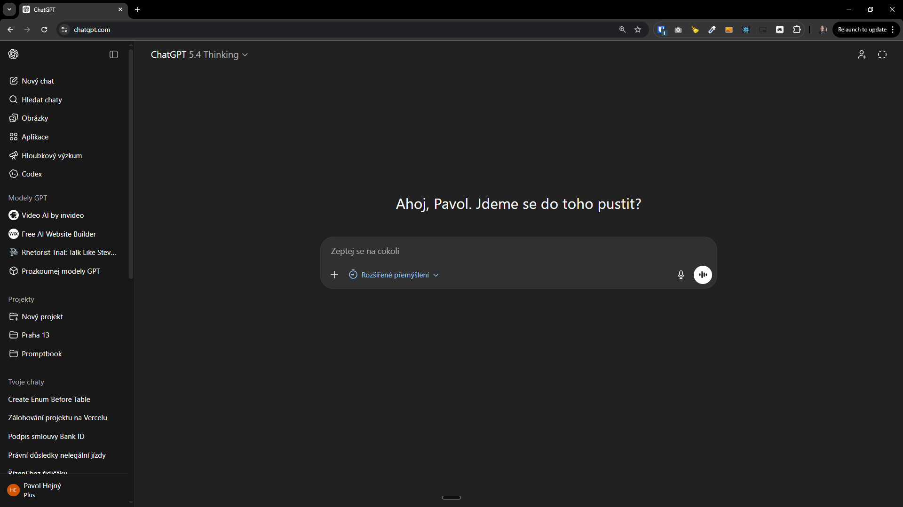
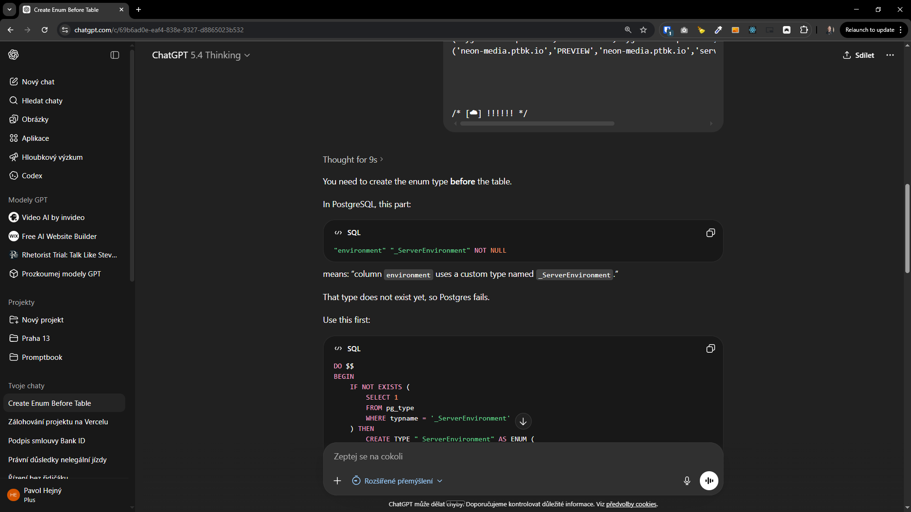
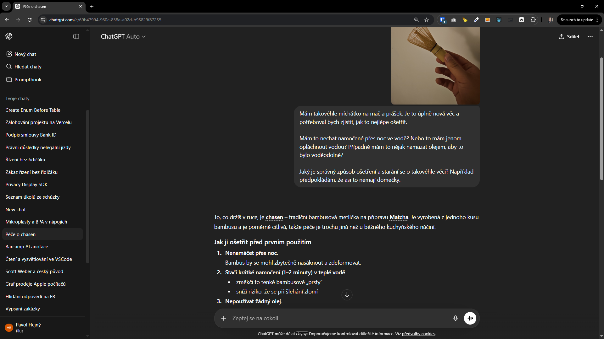
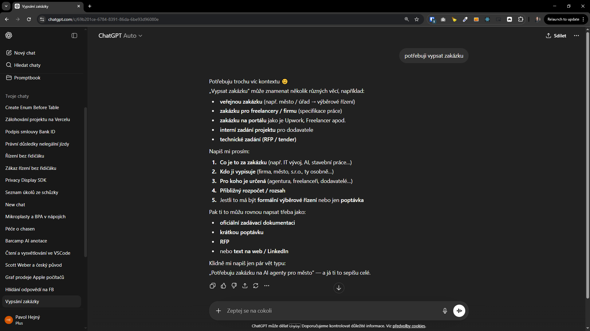
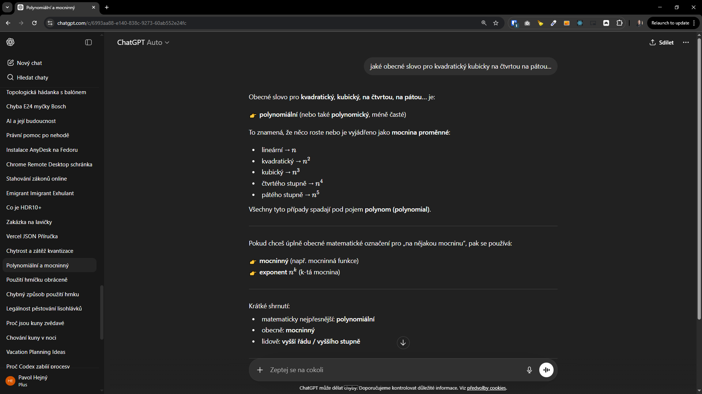

[x] ~$0.00 33 minutes by OpenAI Codex `gpt-5.4`

---

[x] ~$0.9664 23 minutes by OpenAI Codex `gpt-5.3-codex`

[🗨️🧱] Alternative ChatGPT-like chat UI for agent pages

-   **The `/agents/[agentId]/chat/chatgpt-like` page already exists but does not look like ChatGPT at all**
-   Create an additional agent chat page that visually mimics the ChatGPT UI (left chats tray + main conversation area + input composer), while keeping the existing Promptbook top header bar.
-   Normal chat page is in `/agents/[agentId]/chat` or similar, this new page can be at `/agents/[agentId]/chat/chatgpt-like`
-   This is a UI-only alternative: it must reuse the existing chat data model, API, websocket/streaming behavior, message rendering pipeline, permissions, and features (tools, attachments, sources/knowledge chips, TTS, feedback, etc.) without changing backend behavior.
-   The new page must show the same conversation thread(s) and allow continuing the same chat with the same agent as the existing chat pages.
-   Add navigation entry to the agent page switcher/menu so users can open this “ChatGPT-like” view alongside: profile, book, split, chat, text, and create-new-agent.
-   Follow DRY: extract reusable layout primitives and message components instead of duplicating existing chat UI logic.

    -   The data and backed logic should be completely shared between the existing chat page and the new ChatGPT-like page, only the layout and styling should be different. Components decide what should be shared and what should be separate component.
        -   You should not change the existing chat page `/agents/[agentId]/chat` in any way

-   UI requirements (ChatGPT-like look & feel)

    -   Keep Promptbook header bar at the top (existing).
    -   Under the header, full-height app layout:
        -   Left sidebar (“chat tray”)
            -   Shows list of chats for the current agent (same source as existing “My chats” / chat list).
            -   Supports creating a new chat, selecting an existing chat, and shows active chat highlight.
            -   Responsive behavior:
                -   Desktop: persistent sidebar.
                -   Mobile: hidden by default with a hamburger / drawer interaction.
        -   Main area (“chat”)
            -   Centered conversation column with max width similar to ChatGPT.
            -   Message bubbles/rows styled like ChatGPT (user messages right aligned, assistant left; subtle backgrounds;).
            -   Composer at bottom with rounded input, send button, and attachment button (if attachments supported in current chat).
            -   Streaming response UX should remain identical functionally (partial tokens, auto-scroll rules), just restyled.
    -   Dark mode: if app supports dark mode, this page must respect it and match ChatGPT-like dark styling.

-   Feature parity (must be supported if already supported in existing chat)

    -   Message markdown rendering (code blocks, tables, links).
    -   Tool call / “ongoing” indicators and their current interactions.
    -   Sources / knowledge chips.
    -   File attachments in chat, including previews.
    -   Message actions (copy, regenerate/retry, feedback thumbs, TTS play) if present.
    -   Error states and retries.

-   URL/routing

    -   Add a new route for this UI under agent pages, e.g. `/agents/[agentId]/chat/chatgpt-like`
    -   Route must accept chat id in query/route same as existing chat page, so deep links open the same conversation.

-   Engineering notes

    -   Identify and reuse the existing chat state management (selected chat id, message list, send message, streaming).
    -   Prefer implementing this as a new layout wrapper around existing chat components.
    -   Create/extend CSS variables or design tokens to apply ChatGPT-like spacing/typography without affecting other pages.
    -   Ensure no breaking changes to existing pages.

-   Acceptance criteria

    -   The same chat opened in the existing chat page and in the ChatGPT-like page shows identical messages in identical order.
    -   Sending a message from either UI continues the same conversation (messages appear in both UIs after refresh/reopen).
    -   Switching chats in the sidebar like ChatGPT updates the conversation in the main area and URL accordingly.
    -   All existing chat-only features continue to work and are accessible in this view.
    -   Mobile UX: drawer works, composer stays accessible, scrolling works while streaming.
    -   You should not change the existing chat page `/agents/[agentId]/chat` in any way

-   Update docs/changelog

    -   Add the change into the [changelog](changelog/_current-preversion.md)

-   You are working with the [Agents Server](apps/agents-server)

