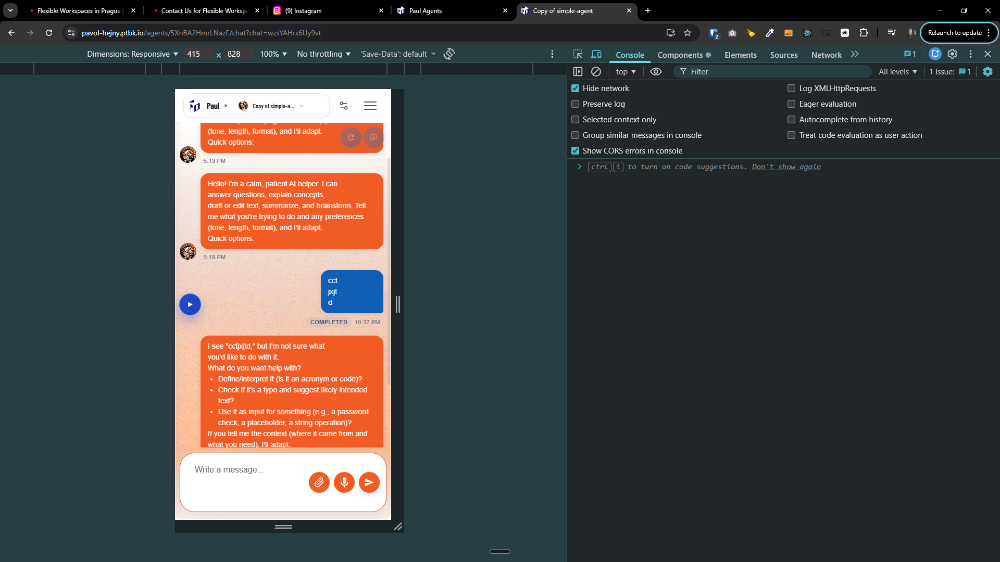
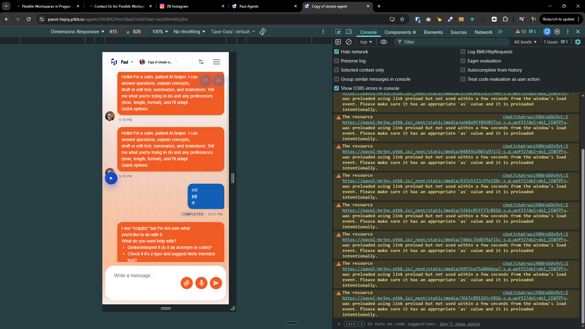

[x] ~$0.5000 19 minutes by OpenAI Codex `gpt-5.4`

[📱💬] Mobile: chat tray (sidebar) open icon must not obstruct message list / composer

-   On mobile layout, the floating icon/button used to open the chats tray sidebar sometimes overlaps important UI (message content or the “write a message” composer). This feels visually broken and harms usability.
-   Goal: Ensure the “open chats tray” affordance is always reachable but never obscures interactive/important chat UI elements.
-   Implement with simplicity: prefer a single robust placement strategy over many special-cases.
-   Must consider device safe areas (iOS notch/home indicator) and the on-screen keyboard:
    -   When the keyboard opens, recompute safe placement so the button never overlaps the composer.
    -   Ensure it respects CSS env(safe-area-inset-\*) where applicable.
-   You are working with the [Agents Server](apps/agents-server) with mobile layout in mind.

