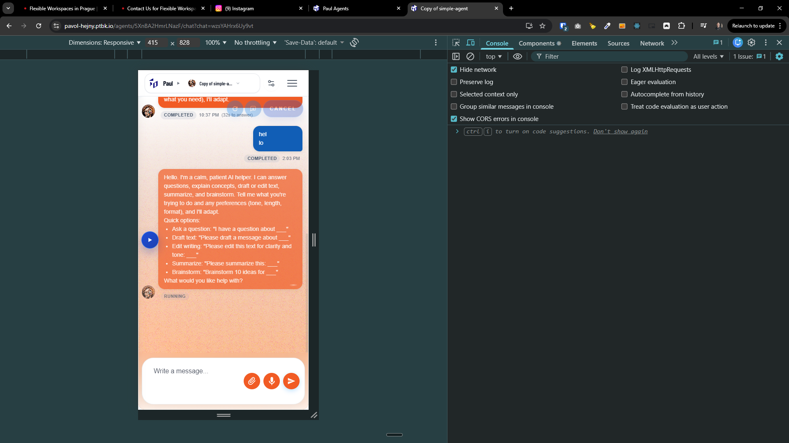

[x] ~$0.7162 17 minutes by OpenAI Codex `gpt-5.4`

[⏱️✅] Switch agent message status to complete ASAP

-   In the Agents Server chat UI, the agent reply is visibly finished (all tokens rendered) but the message status stays as "RUNNING" for ~10 seconds before switching to "COMPLETED".
-   Goal: As soon as we know the output stream is finished, update the message status from "incomplete" to "complete" immediately (target < 250ms after last visible token), without waiting for any extra timers / delayed markers.
-   Do a root-cause analysis and fix the underlying reason rather than masking it with UI heuristics.
-   Define precise semantics (align server + client):
    -   `RUNNING` / `isComplete=false` = still receiving tokens OR stream open OR a tool-call is in progress.
    -   `COMPLETED` / `isComplete=true` = stream closed OR explicit final event received (whichever happens first).
    -   `FAILED` / `isComplete=true` = Some problem occurred
-   Acceptance criteria:
    -   On a normal chat without tool calls, status becomes `complete` within 250ms after the last token appears.
    -   On chats with tool calls, status becomes `complete` within 250ms after the final assistant token is rendered.
    -   No regression:
        -   aborted streams still show `FAILED`.
        -   server/model errors show `FAILED`.
        -   long-running tool steps keep an `RUNNING` indicator without falsely marking completion.
-   You are working with [Agents Server](apps/agents-server)

