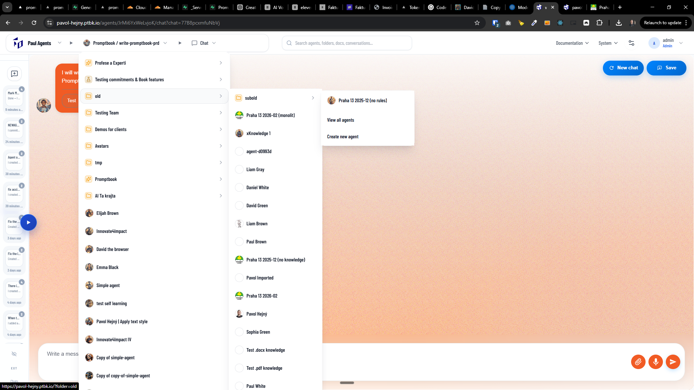

[x] ~$0.8485 32 minutes by OpenAI Codex `gpt-5.3-codex`

[🖱️📂] Fix accidental clicking into hover-opened menu, unite menu items and subitems behavoiur

-   Overview: Prevent the hover-opened menu from blocking clicks on page content while preserving fast, discoverable menu access; guarantee perfect UX for both: (1) intentionally opening and using the menu, (2) moving the mouse across the top and clicking page content without accidental clicks being captured by the menu.

-   Problem(s) summary:

    -   Currently the app opens menu items on hover immediatelly leaves them interactive; but the closing of the menu has some delay; when a user moves the mouse from the top toward the page content, the menu is being opened on hover and captures clicks that are intended for the page content, resulting in accidental clicks inside the menu and a frustrated UX when users try to click content under a transient menu.
    -   This results in accidental clicks inside the menu and a frustrated UX when users try to click content under a transient menu.
    -   Context: Agents Server menu structure and behavior referenced in common project notes for the app.
    -   Menu has the breadcrumns Server -> Agents -> Profile/Chat/Book, and menu items "Documentation" and "System". Theese should behave the same way in terms of hover and click interactions and also be implemented by shared code just with different content.
    -   There is also a submenu under Profile/Chat/Book/More, "More" is not behaving like the main menu items, it is only click-to-open and not hover-to-open, but it should be unified with the main menu items in terms of behavior and implementation.
    -   There should be one shared implementation for hover and click interactions for all menu items, subitems, subsubitems, with the same behavior and configuration.

-   Goals (success criteria):

    -   Hover should remain a lightweight preview that does not block page interactions unless the user commits to the menu.
        -   It should have some delay before opening to prevent accidental triggers
        -   When clicking on the menu item, it should open the menu immediately and make it interactive.
    -   Click-to-open should be fully interactive and stable for users who intentionally open and use the menu.
    -   Quick mouse movement from top to page should never result in accidental menu clicks.
    -   The behavior should be consistent across all menu items and subitems, including the "More" submenu.

-   You are working with the [Agents Server](apps/agents-server)

