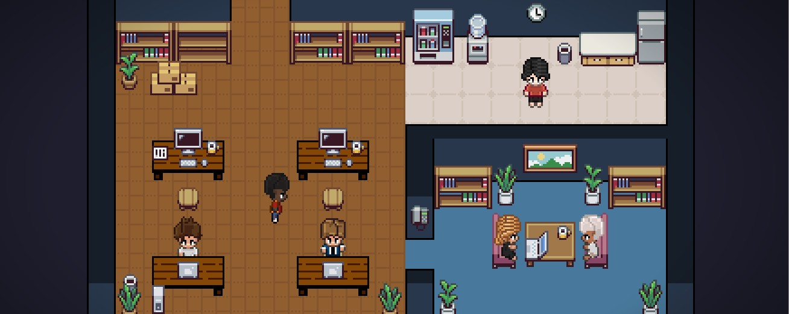

[x] ~$0.00 32 minutes by OpenAI Codex `gpt-5.4`

[🏢🤖] Agent office visualization

A fun 3D / isometric "office" view for the Agents Server home page that visualizes agents as virtual colleagues around desks, in meeting rooms, and moving through corridors; positions and activities reflect agent capabilities, current work, teams, and statuses.

-   Goals

    -   Provide a third homepage view (besides list/folder and graph) called "Office" that is engaging and informative.
    -   Map agent metadata (capabilities, team, current tasks, running/scheduled state, profile image, icon, last activity) to visual signals: desk location, screen content, animations (talking, walking), room assignment.
    -   low-poly 3D, 2D isometric
    -   Allow clicking an agent to open the agent profile / chat panel and quick actions (message, open book, stop/start).

-   Non-goals

    -   This PRD does not require building a full-blown game engine or realtime multi-user sync. Start with a client-side visualization and map server state via existing APIs.
    -   Do not change any agent data models or APIs for this feature; work with the existing metadata and status fields.

-   Success criteria

    -   Office view added to the home page with toggle between List / Graph / Office.
    -   At least three visual agent states implemented: idle (sitting), working (at screen with relevant preview), in-meeting (clustered in a meeting room), moving (walking animation).
    -   Office performs acceptably on typical dev machines and mobile browsers with graceful degradation.
    -   Clicking an agent opens the same agent profile UX as other views.

-   UX / interactions

    -   Top-left view toggle: List | Graph | Office.
    -   Camera controls: pan, zoom, reset. Provide an auto-arrange / focus-on-team button.
    -   Tooltips on hover with agent name, short summary, last activity, and quick buttons.
    -   Rooms represent teams or projects.

-   Data model & mapping

    -   For now, office only shows agents, folders, teams, capabilities... not edit or modify them.
    -   Show also federated agents from connected servers as "remote colleagues" with a distinct visual style (e.g., different colored desks or nameplates) to indicate they are from another server.
        -   Special case of federated server is the core server which can be visualized as the "head office" with a cluster of important agents "Adam", "Teacher",...
    -   Input from existing Agents API: id, name, profileImage, teamId, status (running/scheduled/idle/errored), currentTask (short text), capabilities (tags), folderId, lastActiveAt, isPublic/private.
    -   Map to visualization: team -> room, status -> posture/animation, currentTask -> screen preview text or icon, capabilities -> desk decoration badges.

-   Implementation notes

    -   Primary target: apps/agents-server (frontend). Add a new route /home?view=office or a component in the home page.
    -   Suggested libraries: PixiJS for rendering; Do not implement fallback, this is just additional feature and it is ok if it is not available on mobile / low-end devices in the first iteration, we can add it later if needed.

-   You are working with the [Agents Server](apps/agents-server)

---

[x] ~$1.31 28 minutes by OpenAI Codex `gpt-5.3-codex`

[🏢🤖] Enhance Agent office visualization in `/?view=office`

-   Take inspiration from [pixel-agents](https://github.com/pablodelucca/pixel-agents)
-   You are working with the [Agents Server](apps/agents-server)
-   Keep in mind the DRY _(don't repeat yourself)_ principle.
-   Do a proper analysis of the current functionality before you start implementing.

---

[x] ~$2.41 an hour by OpenAI Codex `gpt-5.3-codex`

[🏢🤖] Add "Pixel office" visualization in homepage of agents server `/?view=pixel-office`

-   Use [pixel-agents](https://github.com/pablodelucca/pixel-agents)
-   You are working with the [Agents Server](apps/agents-server)
-   Keep in mind the DRY _(don't repeat yourself)_ principle.

