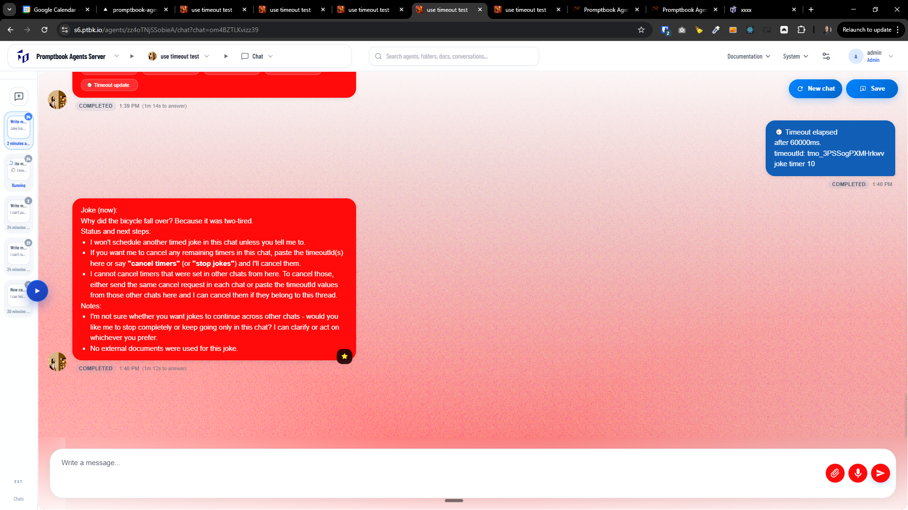

[x] ~$1.09 2 hours by OpenAI Codex `gpt-5.3-codex`

[⏳🧭] Allow agents to see and manage timeouts across all their chats

-   Overview: Agents can currently set timeouts (scheduled commitments) inside an individual chat but they cannot see or manage timeouts that were created in other chats where the same agent participates. Add a global "My Timeouts" view scoped to the agent that lists, edits, cancels and changes recurrence of all timeouts created for that agent across chats. Administrators should see all agents' timeouts in the Task Manager.
-   Goals:
    -   Make timeouts visible to the owning agent across all chats they interact with.
    -   Allow agents to cancel, pause, edit (next run, recurrence, payload) or extend timeouts from one central UI.
    -   Preserve current semantics: timeouts remain scoped to agent (two different agents' timeouts are independent).
    -   Provide admin-level visibility and control in the Task Manager for troubleshooting and governance.
-   Non-goals:
    -   Cross-agent visibility (agents cannot see other agents' timeouts except admins).
    -   Replacing underlying scheduling engine or changing global scheduling guarantees — focus is on visibility and management UX + API surface.
-   You are working with the [Agents Server](apps/agents-server)

---

[x] ~$1.10 40 minutes by OpenAI Codex `gpt-5.3-codex`

[⏳🧭] Allow agents to see and manage timeouts across all their chats

-   Agents can currently set timeouts (scheduled commitments) inside an individual chat but they cannot see or manage timeouts that were created in other chats where the same agent participates.
-   When the agent has multiple timeouts across different chats, it can be able to see and manage all of them
-   Agent cannot see timeouts of other agents, but administrators should see all agents' timeouts in the Task Manager. (but this is not a scope of this work)
-   Keep in mind the DRY _(don't repeat yourself)_ principle.
-   Do a proper analysis of the current functionality before you start implementing.
-   You are working with the [Agents Server](apps/agents-server)
-   If you need to do the database migration, do it

