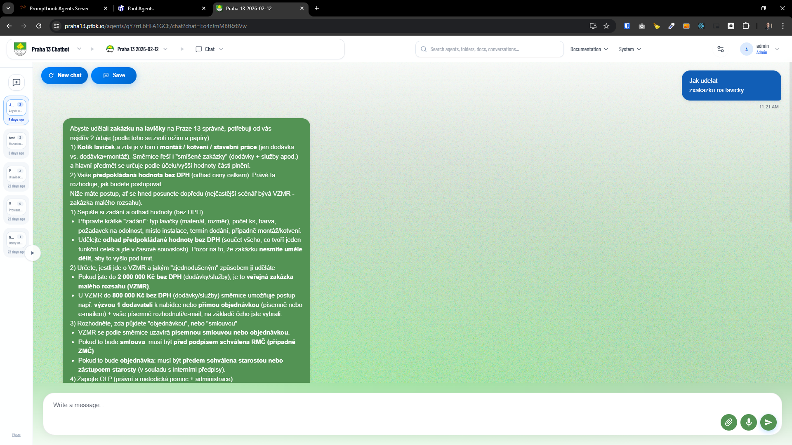
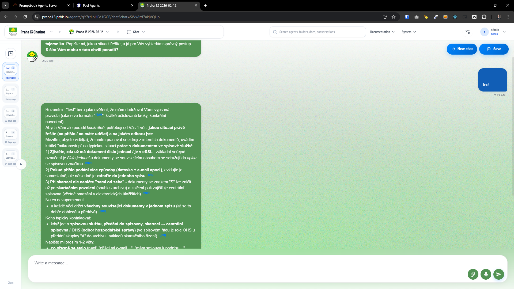
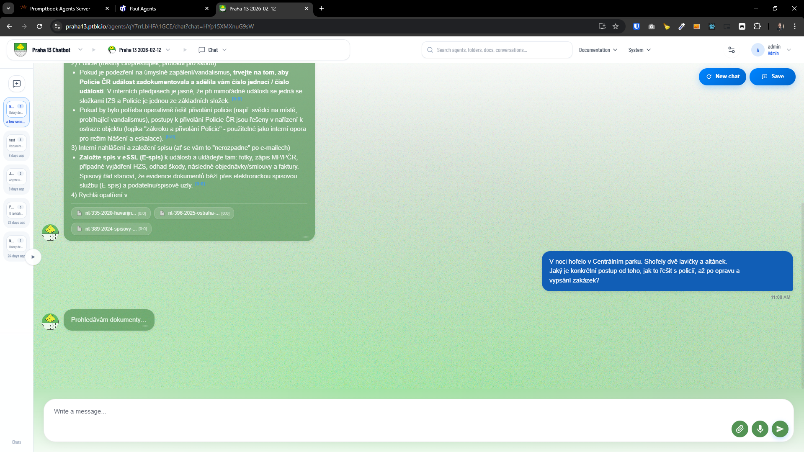
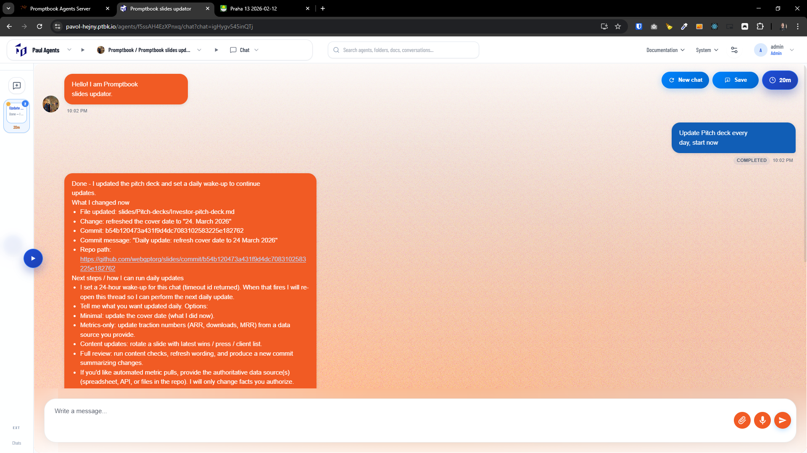

[ ]

[✨🪦] Enhance the design of the chat

-   Make it look more premium and polished, with attention to typography, spacing, and visual hierarchy.
-   Chat renders the markdown content inside the message bubbles, and the markdown styling should be improved
-   Keep in mind the DRY _(don't repeat yourself)_ principle.
-   Do a proper analysis of the current functionality of `Chat` component before you start implementing.
-   The final design should work in [Agents Server](apps/agents-server)
-   You are enhancing design of the `Chat` component
-   Add the changes into the [changelog](changelog/_current-preversion.md)

