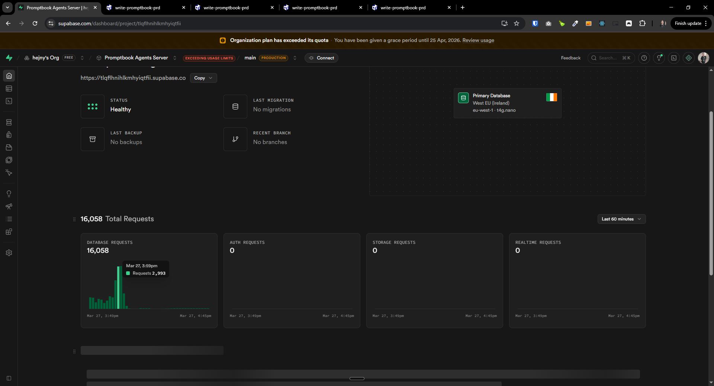

[x] ~$0.6701 19 minutes by OpenAI Codex `gpt-5.3-codex`

[✨⏺] Fix the agent server crashing due to Supabase issues

-   It often happens that the agent server crashes. Review how the Supabase is used in the agent server and try to fix this problem. The problem is fixed when the database is manually restarted on the Supabase but this shouldn't be the case. The application shouldn't crash the Supabase or overwhelm the Supabase in the first place at all.
-   It is working but suddently everything starts to be laggy, suddenly spike of requests, then I see unhealthy status in the Supabase and then the server crashes because it can't connect to the database. - - Restarting the database on Supabase fixes the issue but it happens again after some time.
-   This is a critical issue because it makes the agent server unusable in all environments
-   Do a proper analysis of the current functionality before you start implementing.
-   You are working with the [Agents Server](apps/agents-server)
-   If you need to do the database migration to fix the issue, do it
-   Add the changes into the [changelog](changelog/_current-preversion.md)

---

[-]

[✨⏺] brr

-   @@@
-   Keep in mind the DRY _(don't repeat yourself)_ principle.
-   Do a proper analysis of the current functionality before you start implementing.
-   You are working with the [Agents Server](apps/agents-server)
-   If you need to do the database migration, do it
-   Add the changes into the [changelog](changelog/_current-preversion.md)

---

[-]

[✨⏺] brr

-   @@@
-   Keep in mind the DRY _(don't repeat yourself)_ principle.
-   Do a proper analysis of the current functionality before you start implementing.
-   You are working with the [Agents Server](apps/agents-server)
-   If you need to do the database migration, do it
-   Add the changes into the [changelog](changelog/_current-preversion.md)

---

[-]

[✨⏺] brr

-   @@@
-   Keep in mind the DRY _(don't repeat yourself)_ principle.
-   Do a proper analysis of the current functionality before you start implementing.
-   You are working with the [Agents Server](apps/agents-server)
-   If you need to do the database migration, do it
-   Add the changes into the [changelog](changelog/_current-preversion.md)

