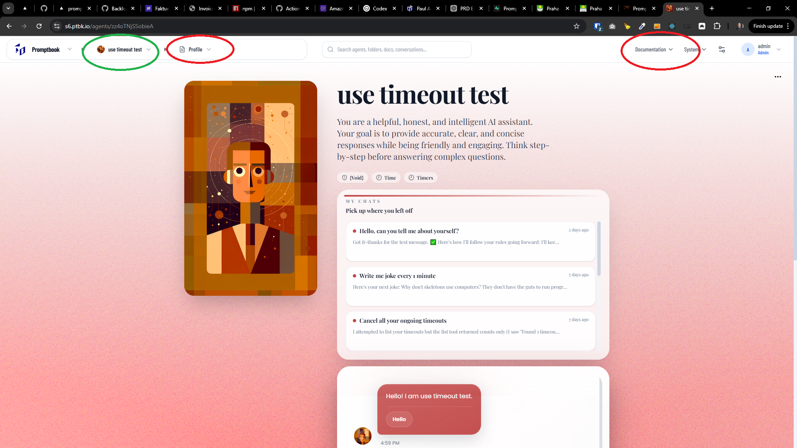
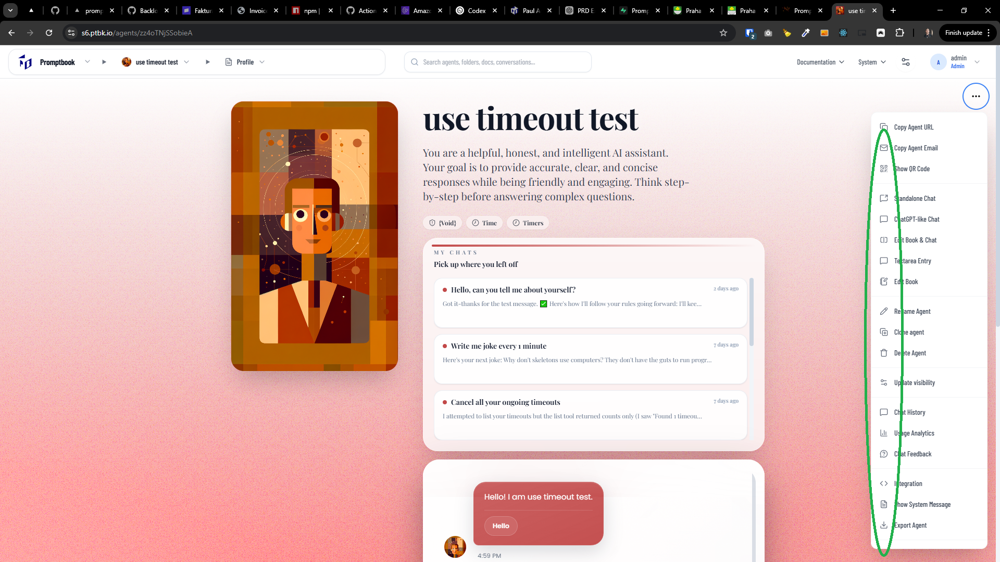
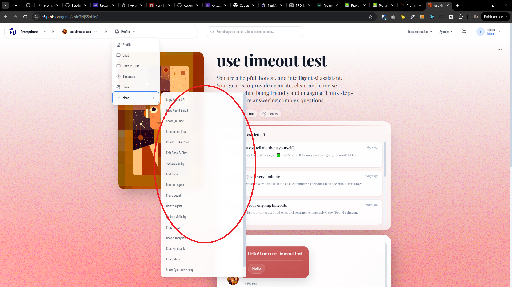

[x] ~$0.2255 18 minutes by OpenAI Codex `gpt-5.3-codex`

[✨🔷] I cannot click on the subitems in the menu, because they are closed as soon as I try to open them, fix it

-   Keep in mind the DRY _(don't repeat yourself)_ principle.
-   Do a proper analysis of the current functionality before you start implementing.
-   You are working with the [Agents Server](apps/agents-server)

---

[x] ~$0.4298 18 minutes by OpenAI Codex `gpt-5.4`

[✨🔷] Fix the menu navigation UX

-   I cannot navigate on the menu subitems only by hovering, i need to click, but hovering should be enough
-   On the right side of the header bar, navigating throught agents and folders works perfectly by hovering, but on the Profile / chat / ... and also on left side on "System" not
-   Keep in mind the DRY _(don't repeat yourself)_ principle.
-   Do a proper analysis of the current functionality before you start implementing.
-   You are working with the [Agents Server](apps/agents-server)

---

[x] ~$0.6751 18 minutes by OpenAI Codex `gpt-5.4`

[✨🔷] Add icons to the more item subitems in the agent navigational breadcrumbs

-   The icons already exists but they are shown only in the same menu opened from agent profile
-   Keep in mind the DRY _(don't repeat yourself)_ principle.
-   Do a proper analysis of the current functionality before you start implementing.
-   You are working with the [Agents Server](apps/agents-server)

---

[-]

[✨🔷] qux

-   @@@
-   Keep in mind the DRY _(don't repeat yourself)_ principle.
-   Do a proper analysis of the current functionality before you start implementing.
-   You are working with the [Agents Server](apps/agents-server)
-   If you need to do the database migration, do it
-   Add the changes into the [changelog](changelog/_current-preversion.md)

