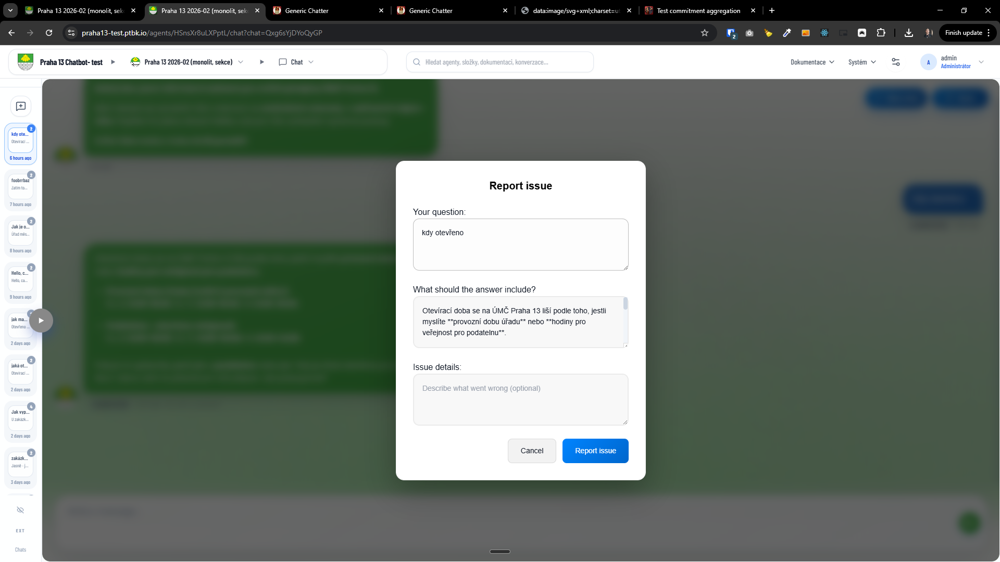

[x] ~$0.5167 31 minutes by OpenAI Codex `gpt-5.3-codex`

[🪐🧩] Agents Server: Feedback UI variants (none / stars / report issue)

-   We want a single configurable “feedback mode” in the Agents Server UI that controls what the user can do after a chat response:
    -   Variant 1: **Feedback off** (no stars shown)
    -   Variant 2: **Stars** (existing behavior)
    -   Variant 3: **Report issue** (new, replaces stars with a lightweight issue report flow)
-   You are working with [Agents Server](apps/agents-server)
-   Current behavior: stars can already be toggled on/off (Variant 1 should represent the “off” state)
-   Reuse the same saving logic, if needed do a db migration

---

[ ]

[🪐🧩] Report issue modal in Agents server should be translated

-   You are working with [Agents Server](apps/agents-server)

