[x] ~$1.21 an hour by OpenAI Codex `gpt-5.4`

---

[x] ~$3.28 an hour by OpenAI Codex `gpt-5.4`

[✨⛅️] Agents server is crashing, fix it and optimize the performance

-   For some reason the agent server is extremely overloaded and crashing. The number of DB requests is extremely high despite the fact that there is not much traffic and the server is doing almost nothing.
-   Everything takes a lot of time, even simple requests. The server is barely usable in this state.
-   Supabase often shows unhealthy status and then the server crashes because it can't connect to the database.
-   Restarting the database on Supabase fixes the issue but it happens again after some time.
-   Do a proper and complex analysis of the current functionality before you start implementing.
-   Analyze the:
    -   Database queries and their frequency
    -   Cron jobs
    -   Potential infinite / recursive loops _(for example when resolving agent source)_
    -   Analyze how the planned agent events are implemented _(the `USE TIMEOUT` commitment)_
    -   Everything that can cause the overload and crashes
-   Do a:
    1. Deep analysis of the current functionality to find the root cause / multiple causes of the problem, even the potential ones
    2. Implement the fixes to solve the problem
    3. Write down the things you found in the analysis and the fixes you implemented into [this file](prompts/2026-03-1560-agents-server-optimize.notes-1.md)
    4. Write down the things you found but can not fix right now but can be fixed in the future into [this file](prompts/2026-03-1560-agents-server-optimize.notes-1.md)
-   Also chatting with agents on the Agents Server should be faster
    -   Now the response time for agent messages is quite extremely long.
    -   The preparation of agents takes unacceptably long time, we need to optimize it and make it faster
    -   Also the message response takes a long time, we need to optimize the whole flow and make it faster
-   You are working with the [Agents Server](apps/agents-server)
-   You are not changing the functionality or adding new features, you are optimizing the existing functionality and fixing the crashes, so the server is stable and performant
-   If you need to do the database migration to fix the problem or get more information about it, do it
-   If you can not fix it now but you did some analysis and have a plan how to fix it, write the plan into [this file](prompts/2026-03-1560-agents-server-optimize.notes-1.md)
-   Add the changes into the [changelog](changelog/_current-preversion.md)

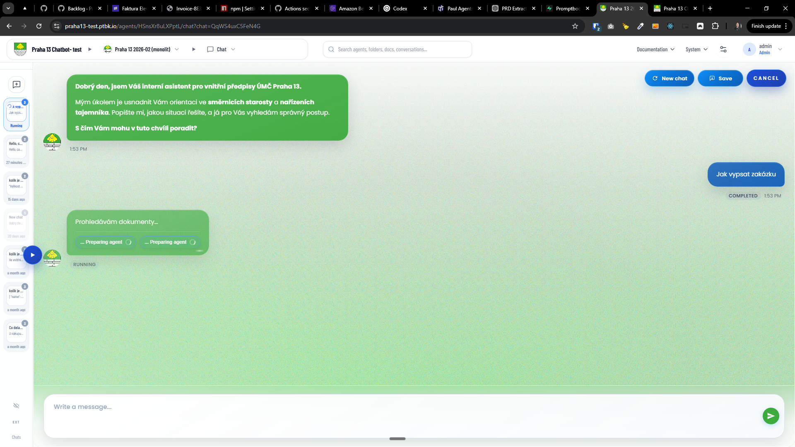
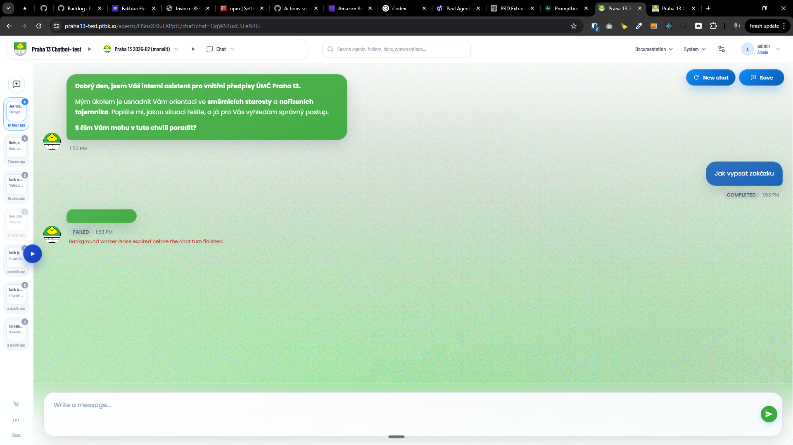
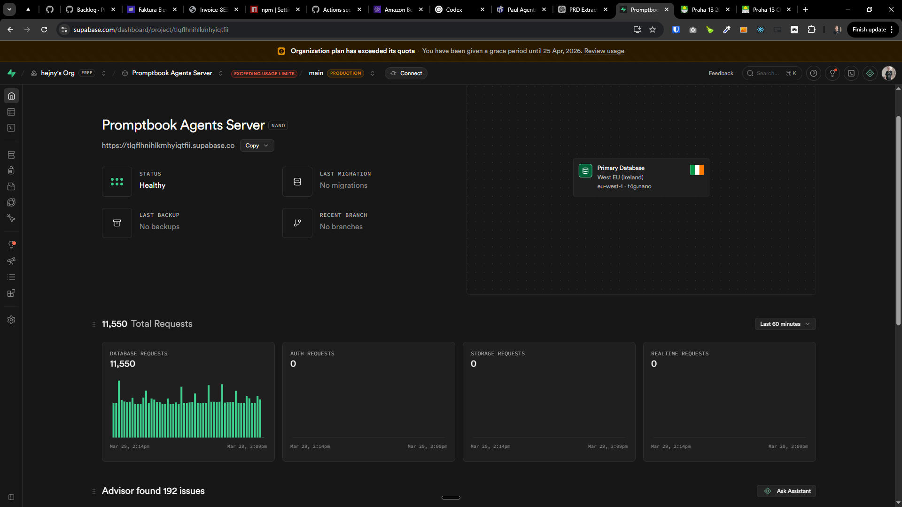
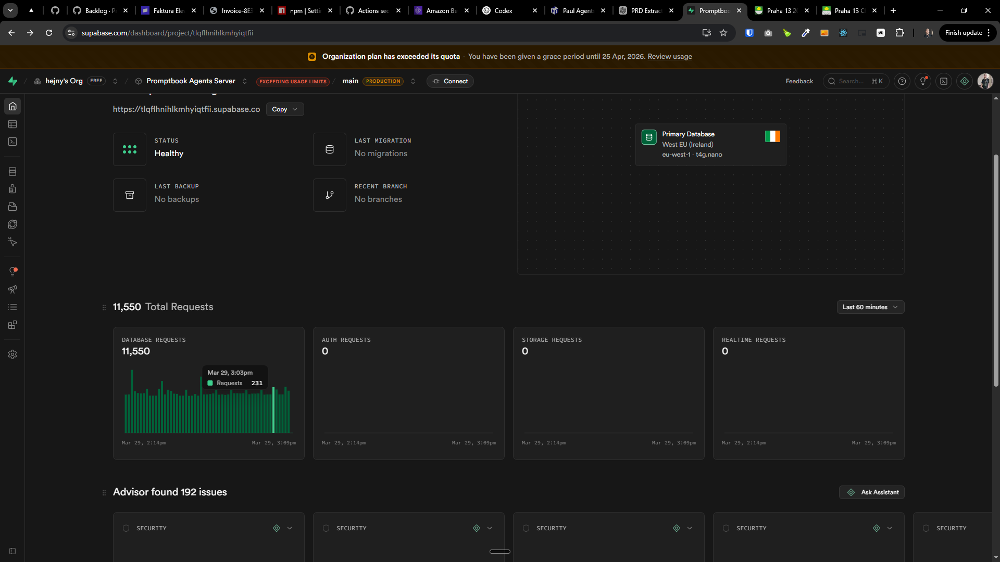
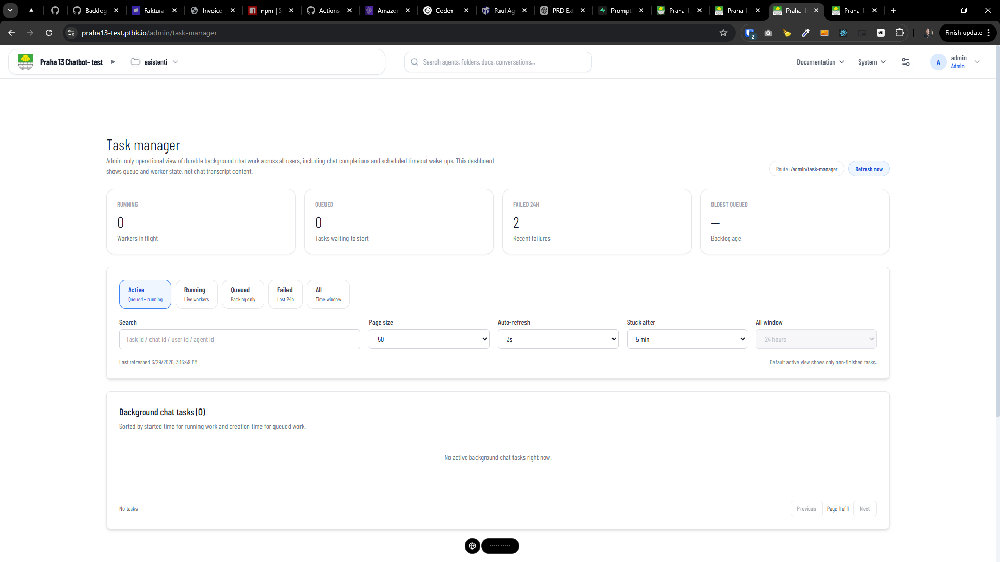
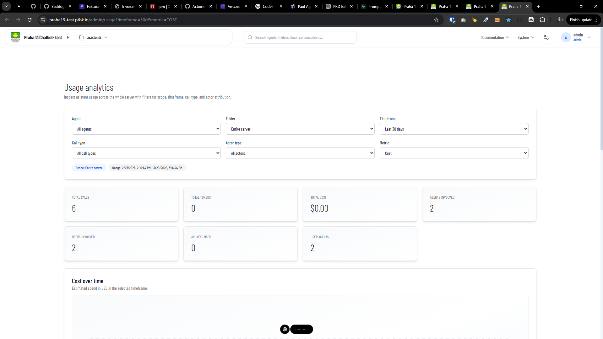
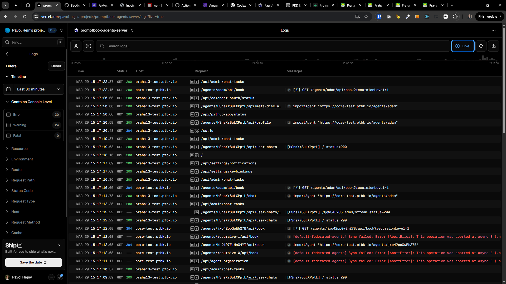
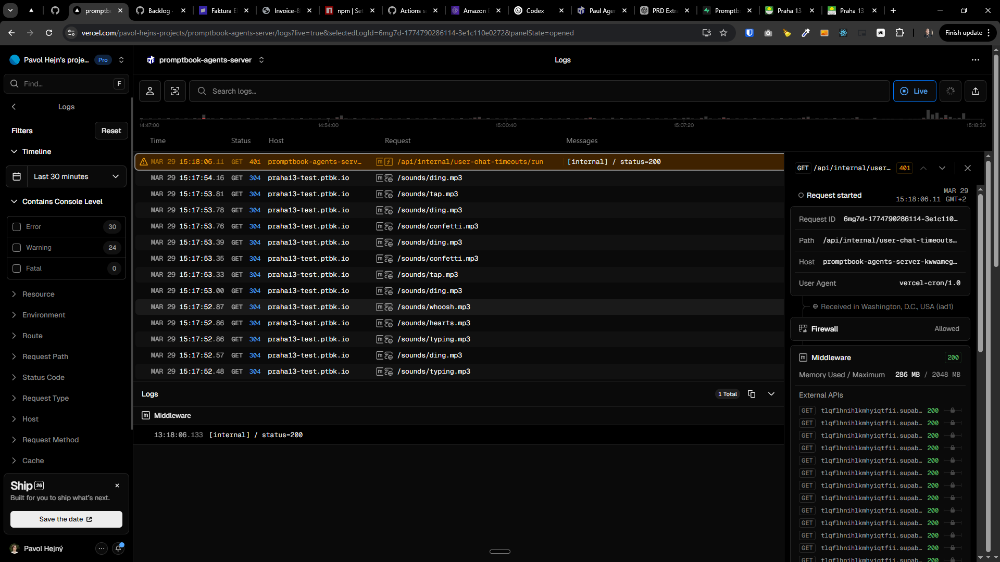
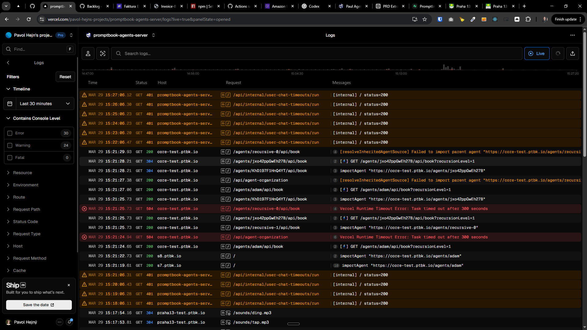
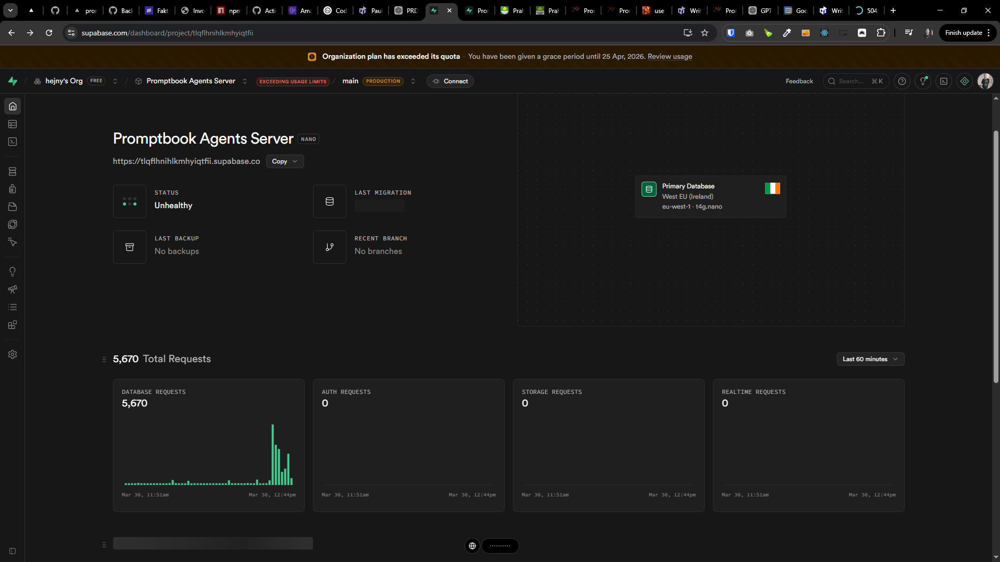
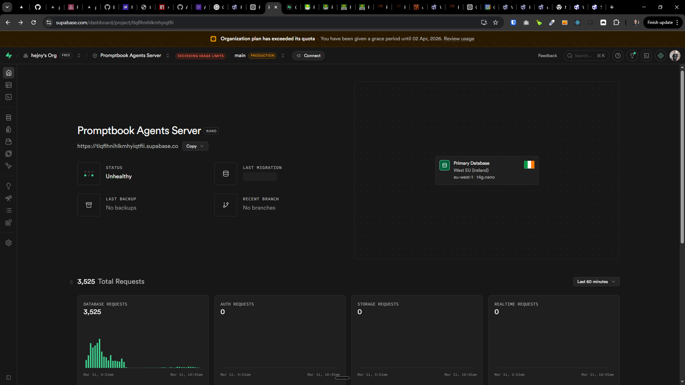

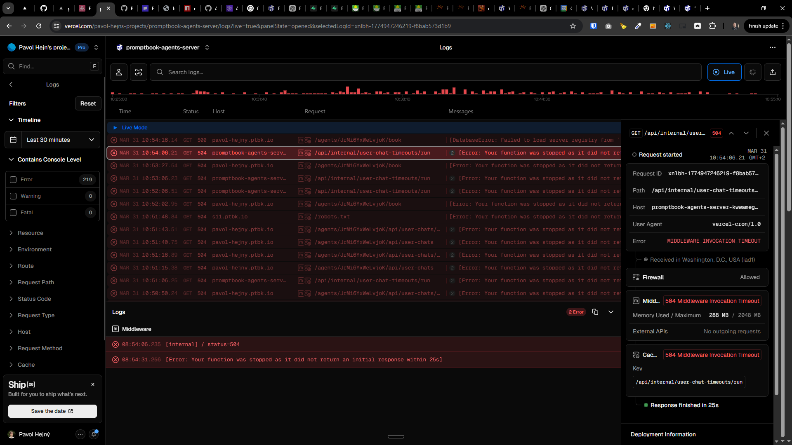
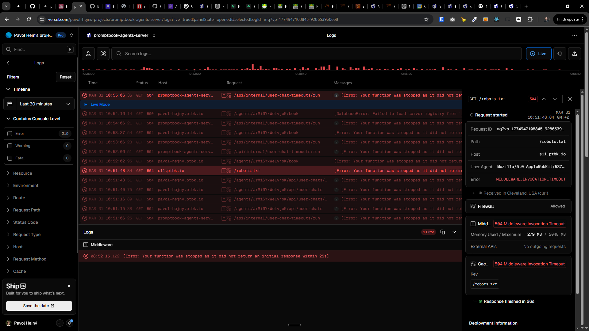
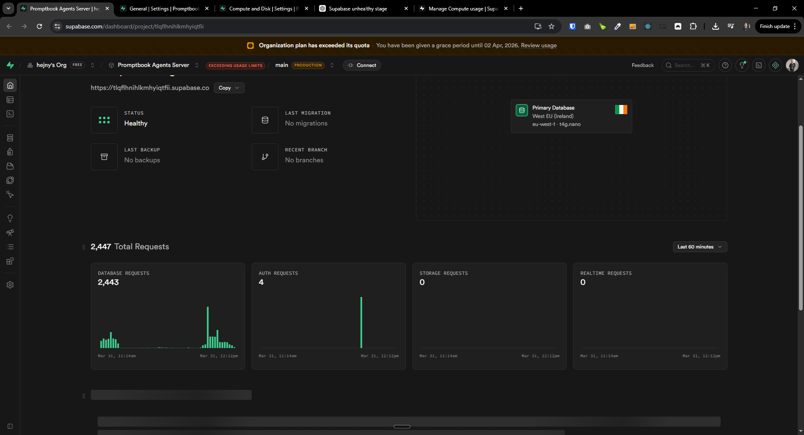

<!-- 11:11 -->

---

[x] ~$1.51 an hour by OpenAI Codex `gpt-5.3-codex`

---

[x]

[✨⛅️] Agents server does not start the tasks

-   Tasks are stucked forever in queued status and they are not starting
-   When the user is activelly looking at the chat, task of the answering from agent should start ASAP
-   For the background chats, there should be some cron job that starts the tasks once in a 2 minutes (add this time to the metadata configuration of the agents server)
-   Do a proper and complex analysis of the current functionality before you start implementing.
-   You are working with the [Agents Server](apps/agents-server) with the chats and tasks

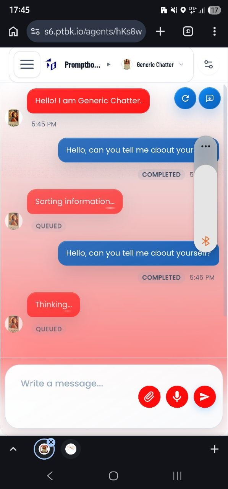
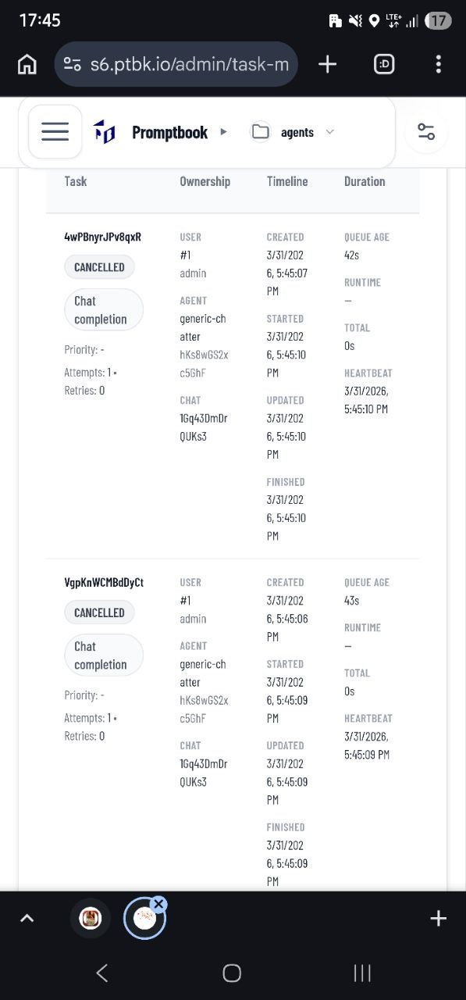
