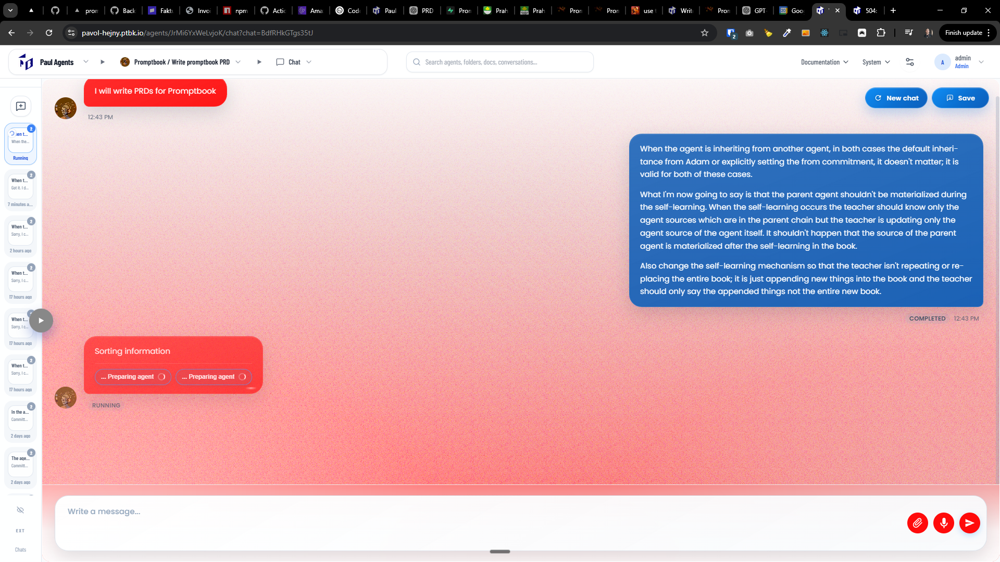
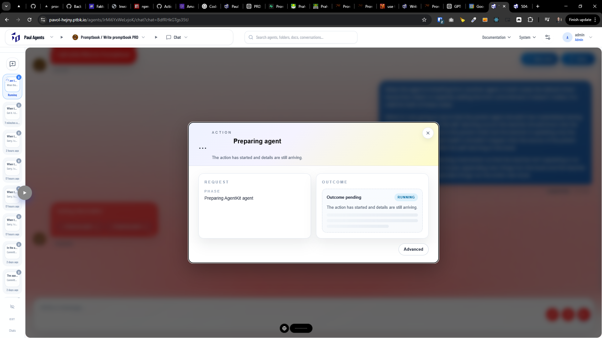

[x] ~$0.5082 30 minutes by OpenAI Codex `gpt-5.4`

[✨☛] Chatting with agents on the Agents Server should be faster

-   Now the response time for agent messages is quite extremely long.
-   The preparation of agents takes unacceptably long time, we need to optimize it and make it faster
-   Also the message response takes a long time, we need to optimize the whole flow and make it faster
-   Keep in mind the DRY _(don't repeat yourself)_ principle.
-   Do a proper analysis of the current functionality before you start implementing. Analyze the bottlenecks and find the areas where we can optimize the performance. Do this deeply and thoroughly, do not just guess or assume, but actually analyze the code and find the root causes of the performance issues.
-   You are working with the [Agents Server](apps/agents-server)
-   If you need to do the database migration to fix the problem or get more information about it, do it
-   If you can not fix it now but you did some analysis and have a plan how to fix it, write the plan into [this file](2026-03-1580-agents-server-optimize.notes.md)
-   Add the changes into the [changelog](changelog/_current-preversion.md)

---

[-]

[✨☛] baz

-   @@@
-   Keep in mind the DRY _(don't repeat yourself)_ principle.
-   Do a proper analysis of the current functionality before you start implementing.
-   You are working with the [Agents Server](apps/agents-server)
-   If you need to do the database migration, do it
-   Add the changes into the [changelog](changelog/_current-preversion.md)

---

[-]

[✨☛] baz

-   @@@
-   Keep in mind the DRY _(don't repeat yourself)_ principle.
-   Do a proper analysis of the current functionality before you start implementing.
-   You are working with the [Agents Server](apps/agents-server)
-   If you need to do the database migration, do it
-   Add the changes into the [changelog](changelog/_current-preversion.md)

---

[-]

[✨☛] baz

-   @@@
-   Keep in mind the DRY _(don't repeat yourself)_ principle.
-   Do a proper analysis of the current functionality before you start implementing.
-   You are working with the [Agents Server](apps/agents-server)
-   If you need to do the database migration, do it
-   Add the changes into the [changelog](changelog/_current-preversion.md)

