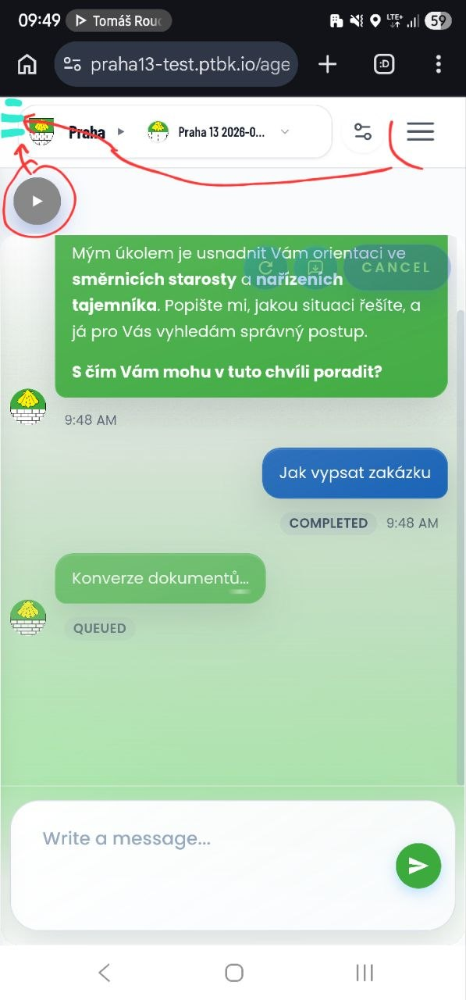
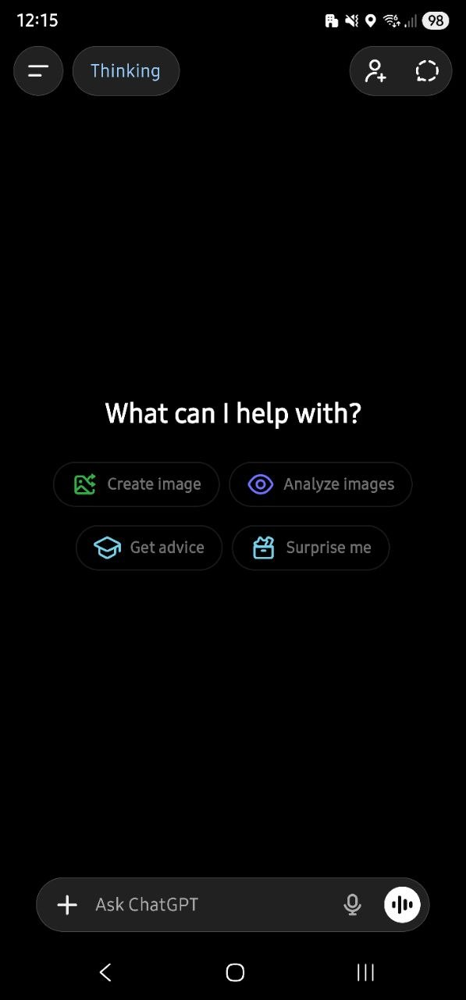
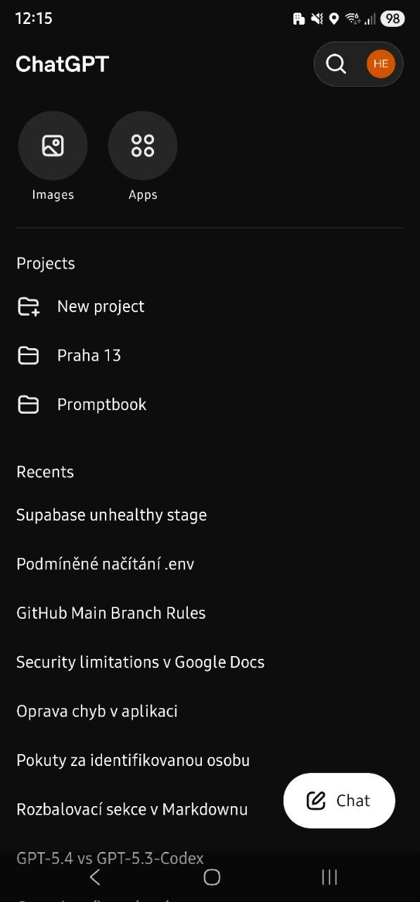
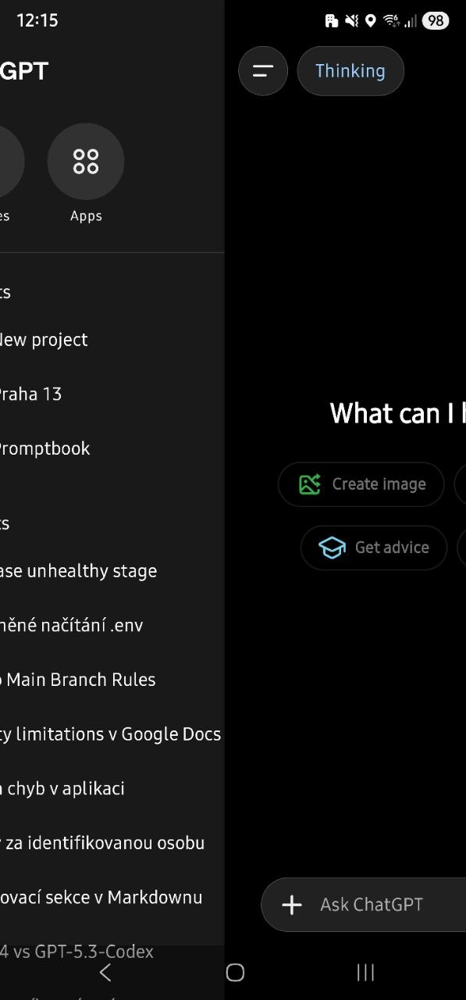
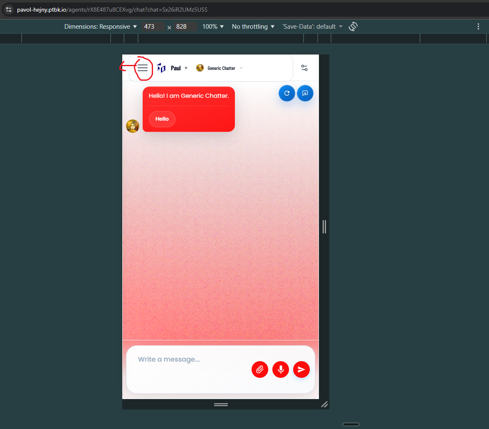
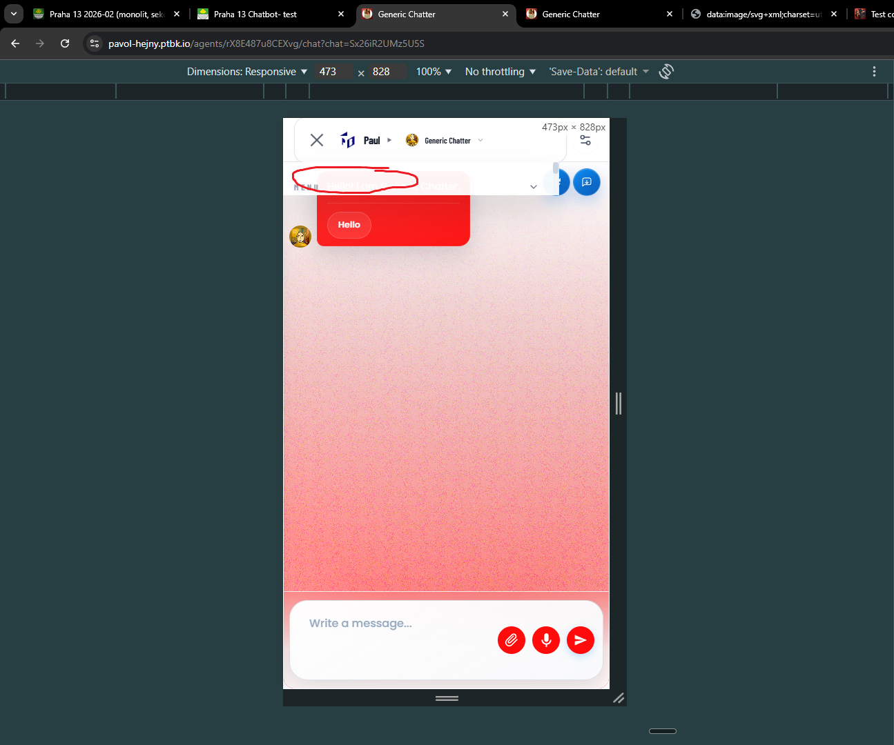

[x] ~$1.60 34 minutes by OpenAI Codex `gpt-5.4`

---

[x] ~$1.18 38 minutes by OpenAI Codex `gpt-5.3-codex`

[✨🔯] Unite the app menu and my chats menu

-   There should be one unified menu system for the entire app, including both the main app menu (with items like "Documentation", "System", etc.) and the chat-specific menu My chats under hamburger on the left side of the header
-   This is relevant only for mobile view, on desktop the menu is working fine and should not be changed
-   The menu hamburger should be on mobile on left on every page of agents server
-   This side menu should be openable both by clicking on the hamburger icon and by swiping from the left edge of the screen (this is a common mobile pattern for side menus)
-   The menu will have standard items like "Documentation", "System", etc. and in some pages (like chat page or agent profile page) it will also have the "My chats" item that will open the list of chats in the same side menu
-   Redesign it to be great both in UI and UX way
-   Keep in mind the DRY _(don't repeat yourself)_ principle.
-   Do a proper analysis of the current functionality before you start implementing. Also look how menu hoisting is implemented in book part of the agents server app
-   You are working with the [Agents Server](apps/agents-server) in the chat

---

[ ]

[✨🔯] Enhance the menu on the mobile

-   Move menu hanburger to the left corner of the page
-   Opened menu is weirdly cropped and its content not visible at all
    -   The desired UI and UX is same as app panel
    -   This side menu should be openable both by clicking on the hamburger icon and by swiping from the left edge of the screen (this is a common mobile pattern for side menus)
    -   Opening and closing should work by swiping
    -   The opened menu should take full height of the page
    -   My chats in this menu should be the most important part
-   Do a proper analysis of the current functionality before you start implementing.
-   You are working with the [Agents Server](apps/agents-server) on mobile version

---

[-]

[✨🔯] foo

-   @@@
-   Keep in mind the DRY _(don't repeat yourself)_ principle.
-   Do a proper analysis of the current functionality before you start implementing.
-   You are working with the [Agents Server](apps/agents-server)
-   If you need to do the database migration, do it
-   Add the changes into the [changelog](changelog/_current-preversion.md)

---

[-]

[✨🔯] foo

-   @@@
-   Keep in mind the DRY _(don't repeat yourself)_ principle.
-   Do a proper analysis of the current functionality before you start implementing.
-   You are working with the [Agents Server](apps/agents-server)
-   If you need to do the database migration, do it
-   Add the changes into the [changelog](changelog/_current-preversion.md)
