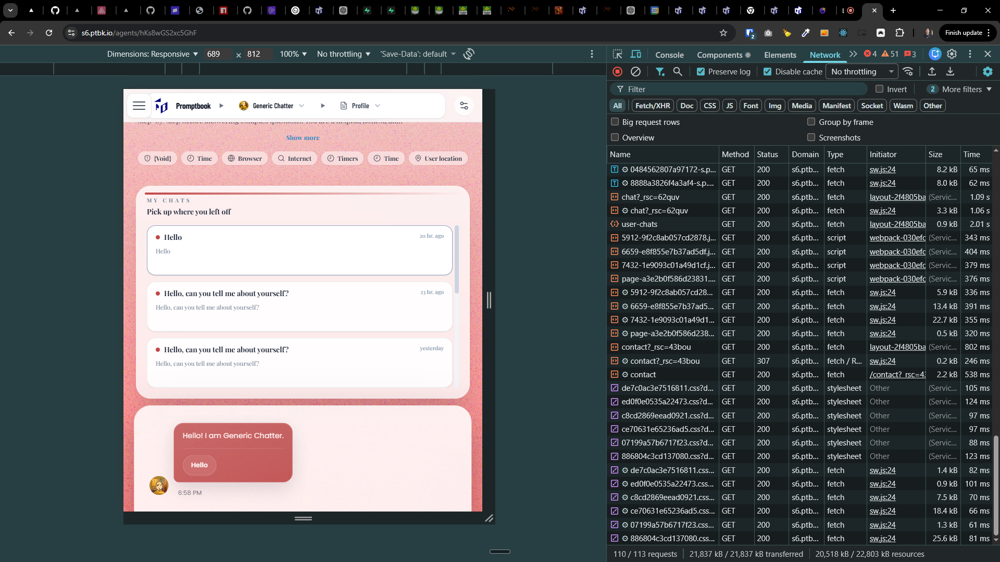
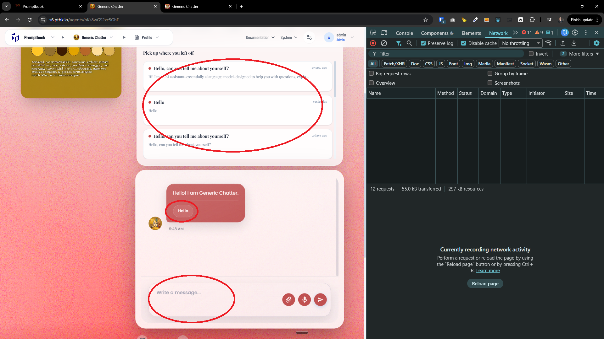

[x] ~$0.6962 36 minutes by OpenAI Codex `gpt-5.3-codex`

[🚧🧭] Fix Agents Server links not navigating _(Next.js routing)_

-   You are working with [Agents Server](apps/agents-server)
-   Problem: In the Agents Server UI, clicking links sometimes does nothing; expected behavior is that link clicks navigate/react normally (client-side routing).
-   For example, clicking on my chats in https://s6.ptbk.io/agents/hKs8wGS2xc5GhF does nothing 

---

[x] ~$1.19 35 minutes by OpenAI Codex `gpt-5.4`

---

[x] ~$1.19 an hour by OpenAI Codex `gpt-5.3-codex`

[🚧🧭] Navigation from agent profile page is not working

-   In the agent profile page _(for example https://pavol-hejny.ptbk.io/agents/rN4iPc2CHEPVgZ)_ the clicking on
    -   My chats
    -   Quick button
    -   Writing a message and send
    -   All of theese should lead to the chat page _(for example https://pavol-hejny.ptbk.io/agents/rN4iPc2CHEPVgZ/chat)_ with sended message from input or opened chat
-   It will do something, the chat is faded and indicates thats something is happening, but it does not navigate to the chat page, it stays on the profile page
-   But it does nothing, fix it
-   Do a proper analysis of the current functionality before you start implementing.
-   You are working with [Agents Server](apps/agents-server)

---

[x] ~$0.00 5 minutes by OpenAI Codex `gpt-5.3-codex`

---

[x] ~$0.5017 37 minutes by OpenAI Codex `gpt-5.3-codex`

[🚧🧭] Navigation should have better UX

-   Sometimes it takes a while to navigate to the chat page, and it is not clear that something is happening, we should have better UX for this, for example a color gradient loading bar on top edge of the screen simmilar to mobile app or YouTube
-   It should be obvious that something is happening when user clicks on the link, and it should be clear that the page is loading
-   Do a proper analysis of the current functionality before you start implementing.
-   You are working with [Agents Server](apps/agents-server)

