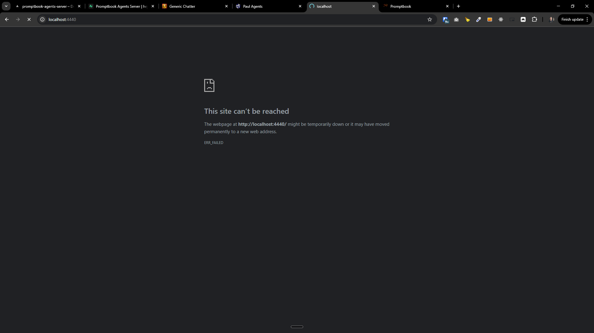

[x] ~$0.1926 15 minutes by OpenAI Codex `gpt-5.3-codex`

[✨🙌] Local development of Agents server isnt working

-   The `npx next dev` command loads up indefinitely and the browser does not load the page
-   The build on Vercel works fine and the page loads as expected _(maybe bit slower then expected but loads)_, so this is only a local development issue

```bash
$ npx next dev --port 4440

...

  ├ chunks/1902-6c00c0ddb76957dc.js                                          44.4 kB
  ├ chunks/87c73c54-095cf9a90cf9ee03.js                                      54.1 kB
  └ other shared chunks (total)                                              3.48 kB


ƒ Middleware                                                                  144 kB

ƒ  (Dynamic)  server-rendered on demand

 ⚠ Warning: Found multiple lockfiles. Selecting C:\Users\me\work\ai\promptbook\package-lock.json.
   Consider removing the lockfiles at:
   * C:\Users\me\work\ai\promptbook\apps\agents-server\package-lock.json

   ▲ Next.js 15.4.11
   - Local:        http://localhost:4440
   - Network:      http://172.22.16.1:4440
   - Environments: .env
   - Experiments (use with caution):
     ✓ externalDir

 ✓ Starting...
 ✓ Ready in 22.6s
 ○ Compiling /middleware ...
 ✓ Compiled /middleware in 11.2s (533 modules)
importAgent "https://core-test.ptbk.io/agents/adam"
<w> [webpack.cache.PackFileCacheStrategy] Serializing big strings (126kiB) impacts deserialization performance (consider using Buffer instead and decode when needed)
importAgent "https://core-test.ptbk.io/agents/adam"
importAgent "https://core-test.ptbk.io/agents/adam"
importAgent "https://core-test.ptbk.io/agents/adam"
importAgent "https://core-test.ptbk.io/agents/adam"
importAgent "https://core-test.ptbk.io/agents/adam"
importAgent "https://core-test.ptbk.io/agents/adam"
importAgent "https://core-test.ptbk.io/agents/adam"
importAgent "https://core-test.ptbk.io/agents/adam"
importAgent "https://core-test.ptbk.io/agents/adam"
importAgent "https://core-test.ptbk.io/agents/adam"
importAgent "https://core-test.ptbk.io/agents/adam"
importAgent "https://core-test.ptbk.io/agents/adam"
importAgent "https://core-test.ptbk.io/agents/adam"
importAgent "https://core-test.ptbk.io/agents/adam"
importAgent "https://core-test.ptbk.io/agents/adam"
importAgent "https://core-test.ptbk.io/agents/adam"
importAgent "https://core-test.ptbk.io/agents/adam"
importAgent "https://core-test.ptbk.io/agents/adam"
importAgent "https://core-test.ptbk.io/agents/adam"
importAgent "https://core-test.ptbk.io/agents/adam"
importAgent "https://core-test.ptbk.io/agents/adam"
importAgent "https://core-test.ptbk.io/agents/adam"
importAgent "https://core-test.ptbk.io/agents/adam"
importAgent "https://core-test.ptbk.io/agents/adam"
importAgent "https://core-test.ptbk.io/agents/adam"
importAgent "https://core-test.ptbk.io/agents/adam"
importAgent "https://core-test.ptbk.io/agents/adam"
importAgent "https://core-test.ptbk.io/agents/adam"
importAgent "https://core-test.ptbk.io/agents/adam"
importAgent "https://core-test.ptbk.io/agents/adam"
importAgent "https://core-test.ptbk.io/agents/adam"
importAgent "https://core-test.ptbk.io/agents/adam"
importAgent "https://core-test.ptbk.io/agents/adam"
importAgent "https://core-test.ptbk.io/agents/adam"
importAgent "https://core-test.ptbk.io/agents/adam"
importAgent "https://core-test.ptbk.io/agents/adam"
importAgent "https://core-test.ptbk.io/agents/adam"
importAgent "https://core-test.ptbk.io/agents/adam"
[AgentReferenceResolver] Failed to load agents from https://gallery.ptbk.io/api/agents TimeoutError: The operation was aborted due to timeout
    at ServerAgentReferenceResolver.fetchRemoteAgents (src\utils\agentReferenceResolver\createServerAgentReferenceResolver.ts:371:35)
    at ServerAgentReferenceResolver.ensureRemoteLookup (src\utils\agentReferenceResolver\createServerAgentReferenceResolver.ts:348:27)
    at ServerAgentReferenceResolver.lookupFederatedAgentById (src\utils\agentReferenceResolver\createServerAgentReferenceResolver.ts:320:38)
    at ServerAgentReferenceResolver.resolveReferenceUrl (src\utils\agentReferenceResolver\createServerAgentReferenceResolver.ts:262:38)
    at ServerAgentReferenceResolver.resolveCommitmentContent (src\utils\agentReferenceResolver\createServerAgentReferenceResolver.ts:158:40)
    at resolveParentAgentUrlFromCommitments (src\utils\resolveInheritedAgentSource.ts:179:41)
    at resolveInheritedAgentSource (src\utils\resolveInheritedAgentSource.ts:321:41)
    at resolveCustomDomainMetadataForAgent (src\utils\customDomainRouting.ts:254:66)
    at resolveCustomDomainAgent (src\utils\customDomainRouting.ts:310:47)
    at async middleware (src\middleware.ts:182:37)
  369 |
  370 |         try {
> 371 |             const response = await fetch(endpoint, {
      |                                   ^
  372 |                 signal: AbortSignal.timeout(FEDERATED_AGENT_LOOKUP_TIMEOUT_MS),
  373 |             });
  374 |             if (!response.ok) { {

}
importAgent "https://core-test.ptbk.io/agents/KhD197F1HnQ4YT"
importAgent "https://core-test.ptbk.io/agents/adam"
[AgentReferenceResolver] Failed to load agents from https://gallery.ptbk.io/api/agents TimeoutError: The operation was aborted due to timeout
    at ServerAgentReferenceResolver.fetchRemoteAgents (src\utils\agentReferenceResolver\createServerAgentReferenceResolver.ts:371:35)
    at ServerAgentReferenceResolver.ensureRemoteLookup (src\utils\agentReferenceResolver\createServerAgentReferenceResolver.ts:348:27)
    at ServerAgentReferenceResolver.lookupFederatedAgentById (src\utils\agentReferenceResolver\createServerAgentReferenceResolver.ts:320:38)
    at ServerAgentReferenceResolver.resolveReferenceUrl (src\utils\agentReferenceResolver\createServerAgentReferenceResolver.ts:262:38)
    at ServerAgentReferenceResolver.resolveCommitmentContent (src\utils\agentReferenceResolver\createServerAgentReferenceResolver.ts:158:40)
    at resolveParentAgentUrlFromCommitments (src\utils\resolveInheritedAgentSource.ts:179:41)
    at resolveInheritedAgentSource (src\utils\resolveInheritedAgentSource.ts:321:41)
    at resolveCustomDomainMetadataForAgent (src\utils\customDomainRouting.ts:254:66)
    at resolveCustomDomainAgent (src\utils\customDomainRouting.ts:310:47)
    at async middleware (src\middleware.ts:182:37)
  369 |
  370 |         try {
> 371 |             const response = await fetch(endpoint, {
      |                                   ^
  372 |                 signal: AbortSignal.timeout(FEDERATED_AGENT_LOOKUP_TIMEOUT_MS),
    at resolveCustomDomainMetadataForAgent (src\utils\customDomainRouting.ts:254:66)
    at resolveCustomDomainAgent (src\utils\customDomainRouting.ts:310:47)
    at async middleware (src\middleware.ts:182:37)
  369 |
  370 |         try {
> 371 |             const response = await fetch(endpoint, {
      |                                   ^
  372 |                 signal: AbortSignal.timeout(FEDERATED_AGENT_LOOKUP_TIMEOUT_MS),
    at async middleware (src\middleware.ts:182:37)
  369 |
  370 |         try {
> 371 |             const response = await fetch(endpoint, {
      |                                   ^
  372 |                 signal: AbortSignal.timeout(FEDERATED_AGENT_LOOKUP_TIMEOUT_MS),
  373 |             });
  374 |             if (!response.ok) { {
> 371 |             const response = await fetch(endpoint, {
      |                                   ^
  372 |                 signal: AbortSignal.timeout(FEDERATED_AGENT_LOOKUP_TIMEOUT_MS),
  373 |             });
  374 |             if (!response.ok) { {
  373 |             });
  374 |             if (!response.ok) { {

}
importAgent "https://core-test.ptbk.io/agents/KhD197F1HnQ4YT"
importAgent "https://core-test.ptbk.io/agents/adam"

}
importAgent "https://core-test.ptbk.io/agents/KhD197F1HnQ4YT"
importAgent "https://core-test.ptbk.io/agents/adam"
importAgent "https://core-test.ptbk.io/agents/jxo42ppGwEh27B"
importAgent "https://core-test.ptbk.io/agents/adam"
importAgent "https://core-test.ptbk.io/agents/jxo42ppGwEh27B"
importAgent "https://core-test.ptbk.io/agents/jxo42ppGwEh27B
```

-   Keep in mind the DRY _(don't repeat yourself)_ principle.
-   Do a proper analysis of the current functionality before you start implementing.
-   You are working with the [Agents Server](apps/agents-server)
-   If you need to do the database migration, do it



---

[-]

[✨🙌] baz

-   @@@
-   Keep in mind the DRY _(don't repeat yourself)_ principle.
-   Do a proper analysis of the current functionality before you start implementing.
-   You are working with the [Agents Server](apps/agents-server)
-   If you need to do the database migration, do it
-   Add the changes into the [changelog](changelog/_current-preversion.md)

---

[-]

[✨🙌] baz

-   @@@
-   Keep in mind the DRY _(don't repeat yourself)_ principle.
-   Do a proper analysis of the current functionality before you start implementing.
-   You are working with the [Agents Server](apps/agents-server)
-   If you need to do the database migration, do it
-   Add the changes into the [changelog](changelog/_current-preversion.md)

---

[-]

[✨🙌] baz

-   @@@
-   Keep in mind the DRY _(don't repeat yourself)_ principle.
-   Do a proper analysis of the current functionality before you start implementing.
-   You are working with the [Agents Server](apps/agents-server)
-   If you need to do the database migration, do it
-   Add the changes into the [changelog](changelog/_current-preversion.md)

