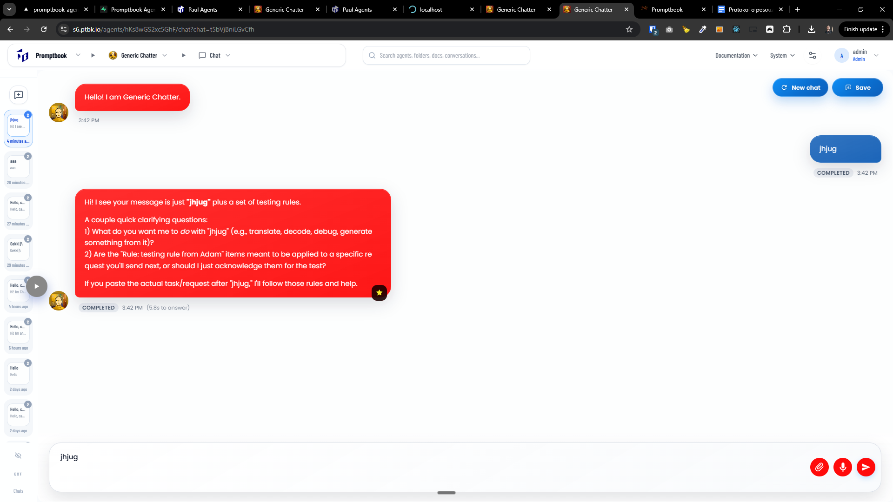
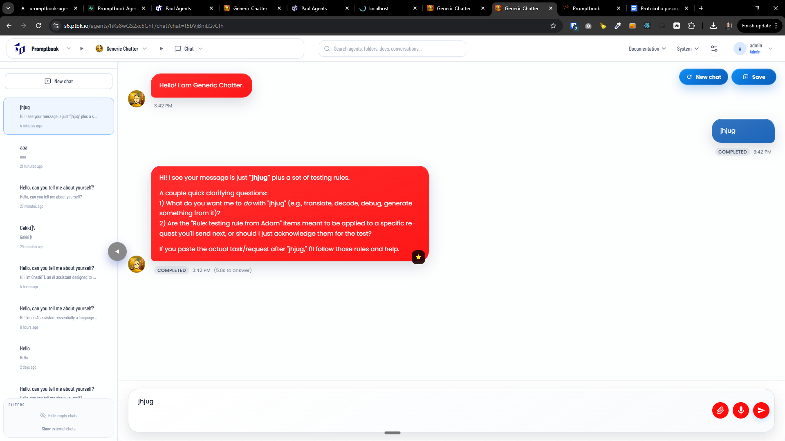
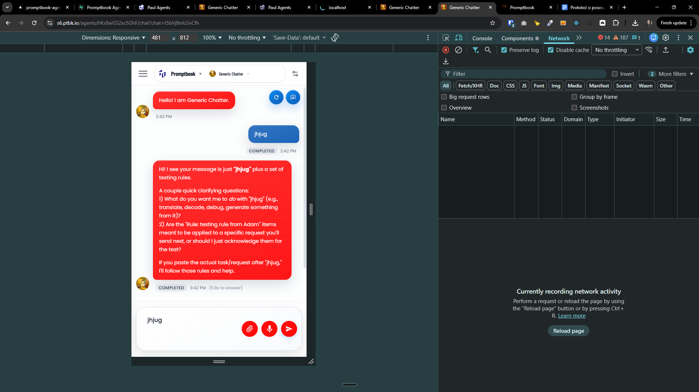
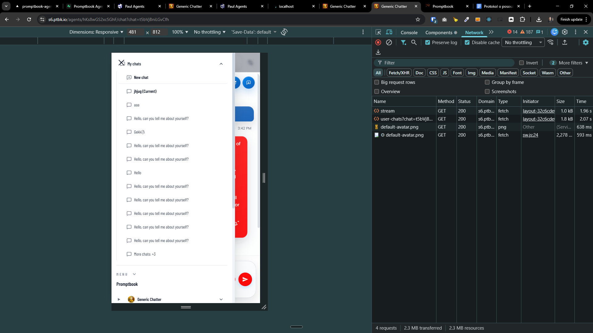

[ ]

[✨🍵] Enhance design of the chat

-   (@@@ waiting for better model)
-   Keep the light mode
-   Be aware of both mobile and desktop users, the design should be responsive and work well on both
-   Be aware that there can be custom css on the agents server
-   Do a proper analysis of the current functionality before you start implementing.
-   You are working with the [Agents Server](apps/agents-server) with the chat page, for example https://s6.ptbk.io/agents/hKs8wGS2xc5GhF/chat?chat=t5bVjBniLGvCfh

