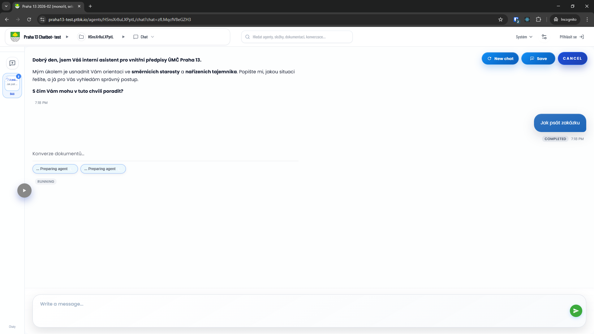
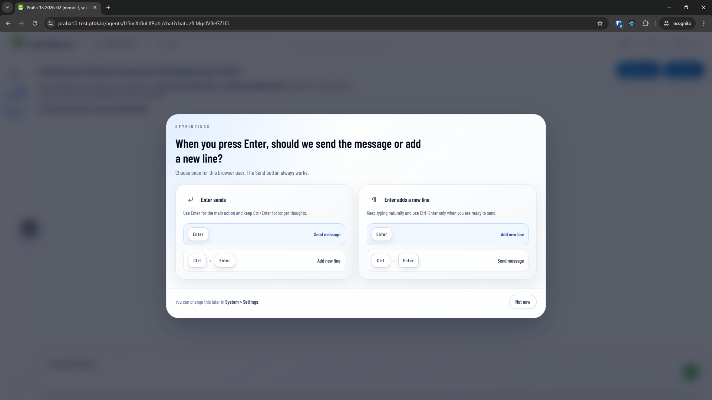
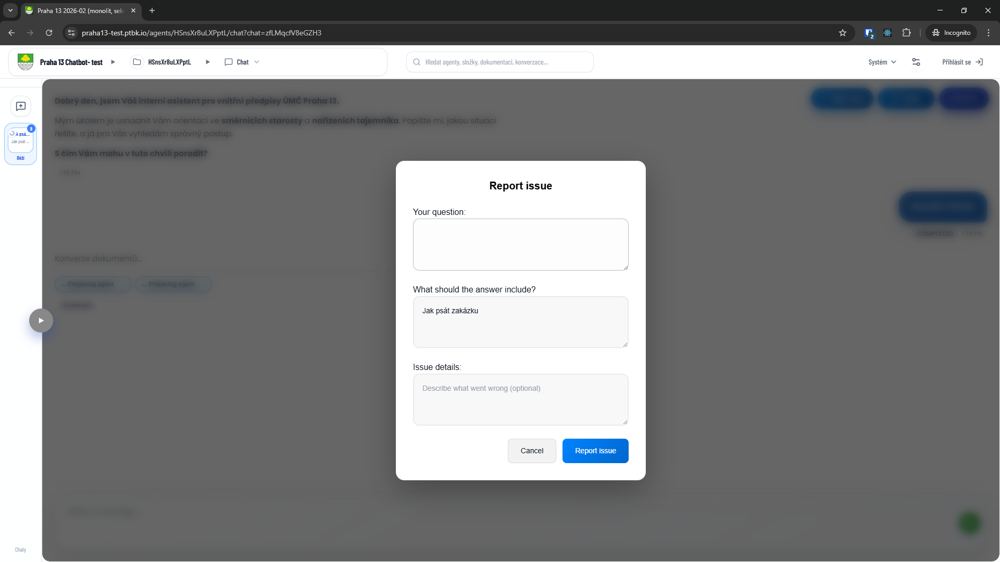
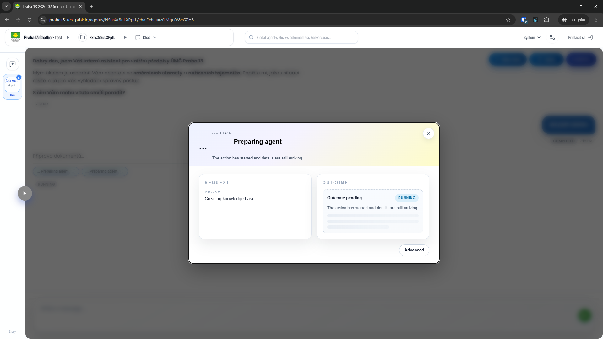
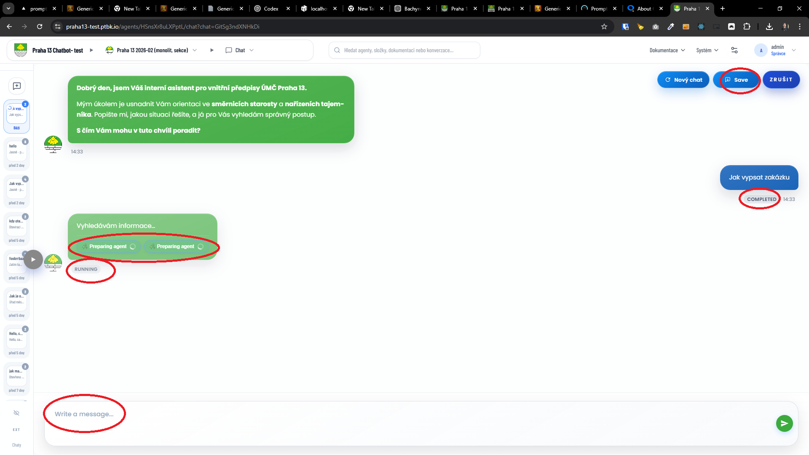
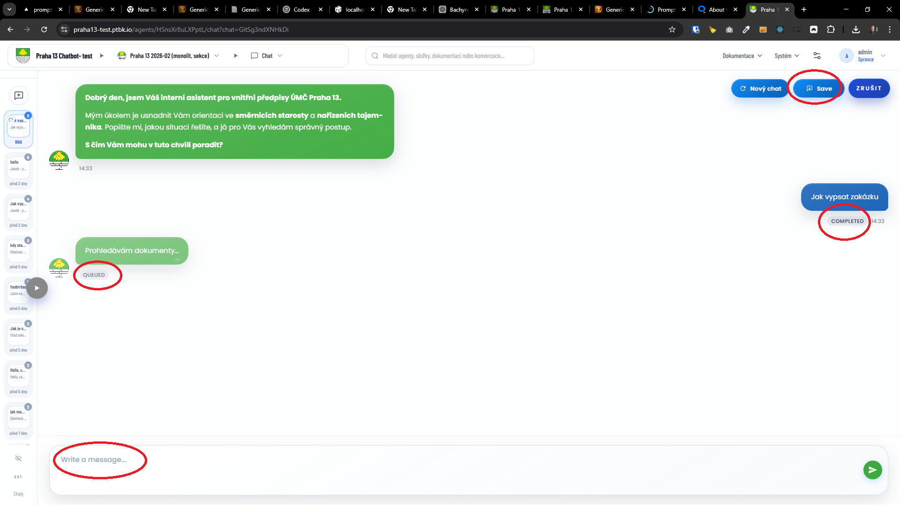

[x] By Github Copilot, manually

---

[x] ~$0.00 16 minutes by GitHub Copilot `claude-sonnet-4.6`

[✨👋] Go through the Agent server and complete the translations.

-   There are a lot of missing translations in the Agents Server, go through the whole UI and find all missing translations and add them to the translation files
-   For example feedback and report issue modal in chat is missing the translation
-   You are working with the [Agents Server](apps/agents-server)

---

[ ] !!

[✨👋] Go through the Agent server and complete the translations.

-   There are some missing translations in the Agents Server chatting page:
    -   
    -   
    -   "Write a message..." placeholder in the chat input is missing translation
    -   "COMPLETED" / "QUEUED" / "RUNNING" / "FAILED" status in the chat message is missing translation
    -   Chips under the messages like "preparing agent" or "tool calls" are missing translation
    -   Also corresponding popup modals from theese chips are missing translation
    -   "Save" the entire chat button is missing translation
-   You are working with the [Agents Server](apps/agents-server)
