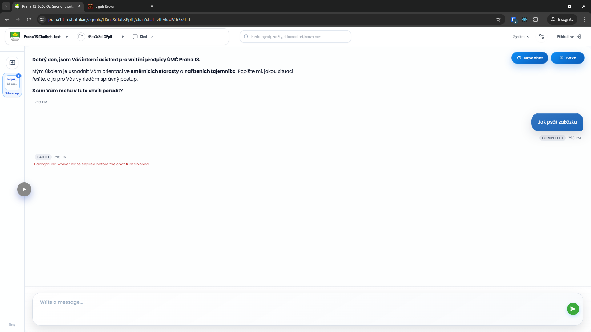
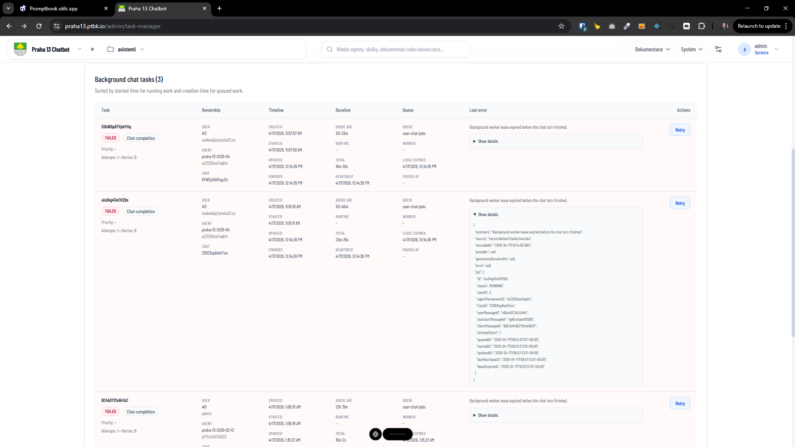

[x] $2.30 an hour by OpenAI Codex `gpt-5.4`

[✨🤼] Fix the long running tasks

**Chats sometimes fails with:**

```text
Background worker lease expired before the chat turn finished.
```

```json
{
    "summary": "Background worker lease expired before the chat turn finished.",
    "source": "reconcileUserChatActiveJobs",
    "recordedAt": "2026-04-17T10:14:36.168Z",
    "provider": null,
    "generationDurationMs": null,
    "error": null,
    "job": {
        "id": "uiuSkg45vCK2Qe",
        "status": "RUNNING",
        "userId": 3,
        "agentPermanentId": "wZ2DS8ozFeqkhi",
        "chatId": "S38E8sp6whFiuv",
        "userMessageId": "v8bvbXC3HJUvHh",
        "assistantMessageId": "vgWzw1pehK1DB5",
        "clientMessageId": "dQEfeXKd9ZYKmV9k8Y",
        "attemptCount": 1,
        "queuedAt": "2026-04-17T09:51:10.187+00:00",
        "startedAt": "2026-04-17T09:51:11.239+00:00",
        "updatedAt": "2026-04-17T09:57:11.511+00:00",
        "lastHeartbeatAt": "2026-04-17T09:57:11.511+00:00",
        "leaseExpiresAt": "2026-04-17T10:07:11.511+00:00"
    }
}
```

-   This happen especially when the agent was doing some long running task like searching big vector stoew and more of the tasks are running, so it seems that the background worker is not able to handle all the tasks and some of them are expiring
-   The task should run on the background and take as much time as it needs, without expiring, and the agent should be able to send messages to the user while doing the long running task, and also send the final response when the task is finished
-   We are running on Vercel infrastructure, try to figure out best way to handle this on Vercel
-   Keep in mind the DRY _(don't repeat yourself)_ principle.
-   Do a proper and deep analysis of the current functionality before you start implementing.
-   You are working with the [Agents Server](apps/agents-server)
-   If you need to do the database migration, do it
-   Add the changes into the [changelog](changelog/_current-preversion.md)




---

[-]

[✨🤼] baz

-   @@@
-   Keep in mind the DRY _(don't repeat yourself)_ principle.
-   Do a proper analysis of the current functionality before you start implementing.
-   You are working with the [Agents Server](apps/agents-server)
-   If you need to do the database migration, do it
-   Add the changes into the [changelog](changelog/_current-preversion.md)

---

[-]

[✨🤼] baz

-   @@@
-   Keep in mind the DRY _(don't repeat yourself)_ principle.
-   Do a proper analysis of the current functionality before you start implementing.
-   You are working with the [Agents Server](apps/agents-server)
-   If you need to do the database migration, do it
-   Add the changes into the [changelog](changelog/_current-preversion.md)

---

[-]

[✨🤼] baz

-   @@@
-   Keep in mind the DRY _(don't repeat yourself)_ principle.
-   Do a proper analysis of the current functionality before you start implementing.
-   You are working with the [Agents Server](apps/agents-server)
-   If you need to do the database migration, do it
-   Add the changes into the [changelog](changelog/_current-preversion.md)

