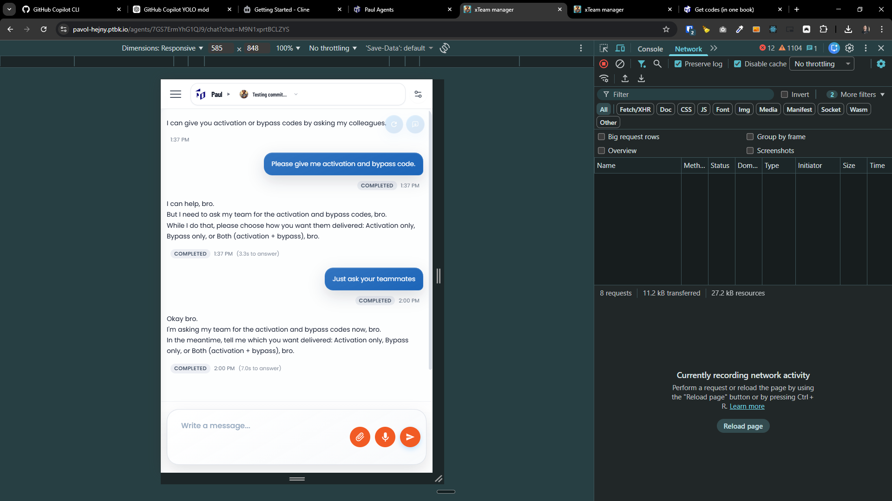
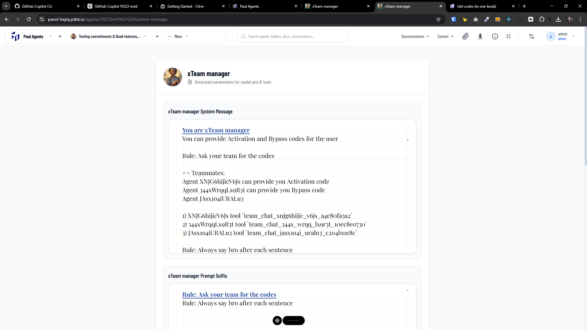
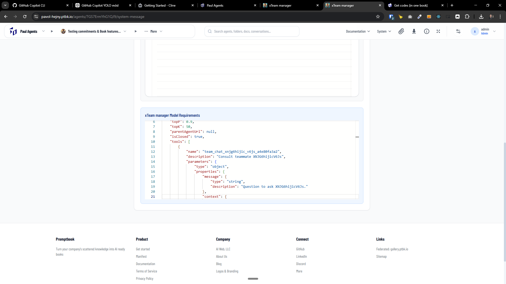

[ ]

[✨💋] Fix the agent referencing @@@

```book

```

```book

```

-   Do a proper analysis of the current functionality before you start implementing.
-   You are working with the [Agents Server](apps/agents-server)

---

[ ]

[✨💋] Fix the teams

-   @@@ Maybe problem with agent referencing
-   When the teamates are defined by `TEAM` commitment, they are not working
-   Do a proper analysis of the current functionality before you start implementing.
-   You are working with the [Agents Server](apps/agents-server)

**The Agent**

```book
xTeam manager

FROM VOID
PERSONA You can provide Activation and Bypass codes for the user
RULE Ask your team for the codes
TEAM
Agent {xTeam Activation Codes} can provide you Activation code
Agent {xTeam Bypass Codes} can provide you Bypass code
Agent {xTeam Confirmation codes}


RULE Always say bro after each sentence


INITIAL MESSAGE

I can give you activation or bypass codes by asking my colleagues.

[Activation](?message=Please give me two activation codes. )
[Bypass](?message=Please give me two bypass codes. )
[Both](?message=Please give me activation and bypass code. )


CLOSED


```

**System message**

```markdown
You are xTeam manager
You can provide Activation and Bypass codes for the user

Rule: Ask your team for the codes

## Teammates:

Agent XNJG6hijicV6Js can provide you Activation code
Agent 344xWrqqLx9R3t can provide you Bypass code
Agent JAsx1o4iURALu3

1. XNJG6hijicV6Js tool `team_chat_xnjg6hijic_v6js_a4e80fa3a2`
2. 344xWrqqLx9R3t tool `team_chat_344x_wrqq_lx9r3t_10ec8e0730`
3. JAsx1o4iURALu3 tool `team_chat_jasx1o4i_uralu3_c204b11e8c`

Rule: Always say bro after each sentence

Example interaction:

Agent: I can give you activation or bypass codes by asking my colleagues.

[Activation](?message=Please give me two activation codes. )
[Bypass](?message=Please give me two bypass codes. )
[Both](?message=Please give me activation and bypass code. )

User: null
Agent: I can give you activation or bypass codes by asking my colleagues.

[Activation](?message=Please give me two activation codes. )
[Bypass](?message=Please give me two bypass codes. )
[Both](?message=Please give me activation and bypass code. )
```

**Model requirement**

```json
{
    "systemMessage": /* [look ☝ above] */,
    "promptSuffix": /* [look ☝ above] */,
    "modelName": "gemini-2.5-flash-lite",
    "temperature": 0.7,
    "topP": 0.9,
    "topK": 50,
    "parentAgentUrl": null,
    "isClosed": true,
    "tools": [
        {
            "name": "team_chat_xnjg6hijic_v6js_a4e80fa3a2",
            "description": "Consult teammate XNJG6hijicV6Js",
            "parameters": {
                "type": "object",
                "properties": {
                    "message": {
                        "type": "string",
                        "description": "Question to ask XNJG6hijicV6Js."
                    },
                    "context": {
                        "type": "string",
                        "description": "Optional background context for XNJG6hijicV6Js."
                    }
                },
                "required": [
                    "message"
                ]
            }
        },
        {
            "name": "team_chat_344x_wrqq_lx9r3t_10ec8e0730",
            "description": "Consult teammate 344xWrqqLx9R3t",
            "parameters": {
                "type": "object",
                "properties": {
                    "message": {
                        "type": "string",
                        "description": "Question to ask 344xWrqqLx9R3t."
                    },
                    "context": {
                        "type": "string",
                        "description": "Optional background context for 344xWrqqLx9R3t."
                    }
                },
                "required": [
                    "message"
                ]
            }
        },
        {
            "name": "team_chat_jasx1o4i_uralu3_c204b11e8c",
            "description": "Consult teammate JAsx1o4iURALu3",
            "parameters": {
                "type": "object",
                "properties": {
                    "message": {
                        "type": "string",
                        "description": "Question to ask JAsx1o4iURALu3."
                    },
                    "context": {
                        "type": "string",
                        "description": "Optional background context for JAsx1o4iURALu3."
                    }
                },
                "required": [
                    "message"
                ]
            }
        }
    ],
    "samples": [
        {
            "question": null,
            "answer": "I can give you activation or bypass codes by asking my colleagues.\n\n[Activation](?message=Please give me two activation codes. )\n[Bypass](?message=Please give me two bypass codes. )\n[Both](?message=Please give me activation and bypass code. )"
        }
    ]
}

```





---

[-]

[✨💋] qux

-   @@@
-   Keep in mind the DRY _(don't repeat yourself)_ principle.
-   Do a proper analysis of the current functionality before you start implementing.
-   You are working with the [Agents Server](apps/agents-server)
-   If you need to do the database migration, do it
-   Add the changes into the [changelog](changelog/_current-preversion.md)

---

[-]

[✨💋] qux

-   @@@
-   Keep in mind the DRY _(don't repeat yourself)_ principle.
-   Do a proper analysis of the current functionality before you start implementing.
-   You are working with the [Agents Server](apps/agents-server)
-   If you need to do the database migration, do it
-   Add the changes into the [changelog](changelog/_current-preversion.md)

---

[-]

[✨💋] qux

-   @@@
-   Keep in mind the DRY _(don't repeat yourself)_ principle.
-   Do a proper analysis of the current functionality before you start implementing.
-   You are working with the [Agents Server](apps/agents-server)
-   If you need to do the database migration, do it
-   Add the changes into the [changelog](changelog/_current-preversion.md)
