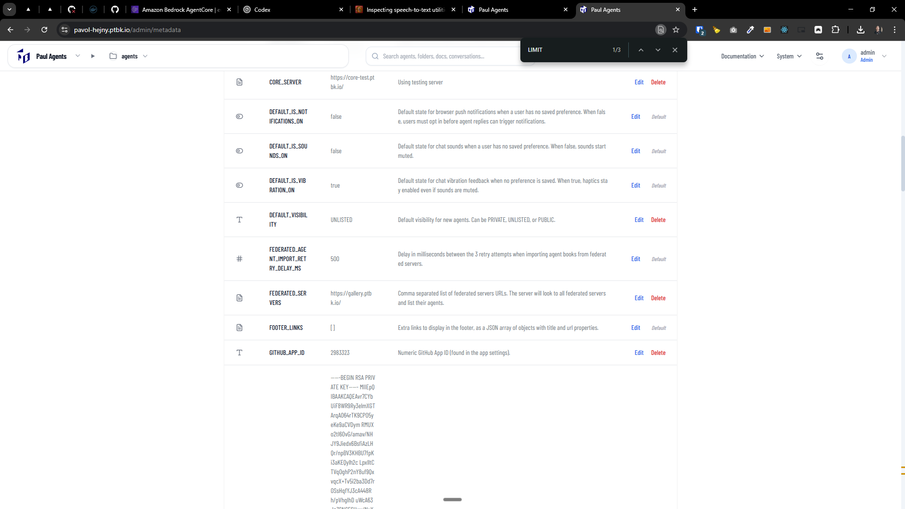

[x] ~$1.16 an hour by OpenAI Codex `gpt-5.4`

[⏲⏲] Create rate limits page in the Agents Server

-   Now all the limits are either in the metadata like `TOOL_USAGE_LIMITS`, `MAX_FILE_UPLOAD_SIZE_MB`, `FEDERATED_AGENT_IMPORT_RETRY_DELAY_MS` or hardcoded as constants in the code, we need to create a proper page in the UI where the admin of the server can see all the limits and also change them if needed, for example to increase the limits if they have more resources available, or to decrease the limits if they want to save some resources, etc.
-   This should be a new page alongside the existing metadata page in `/admin/metadata`
-   Deprecate the old metadata records like `TOOL_USAGE_LIMITS`, do not delete the record but in the UI is should be clear that this record is deprecated and the limits should be managed through the new limits page
-   Keep in mind the DRY _(don't repeat yourself)_ principle.
-   Do a proper analysis of the current functionality before you start implementing.
-   You are working with the [Agents Server](apps/agents-server)
-   Create a separate database table for limits
-   Add the changes into the [changelog](changelog/_current-preversion.md)

---

[-]

[⏲⏲] brr

-   @@@
-   Keep in mind the DRY _(don't repeat yourself)_ principle.
-   Do a proper analysis of the current functionality before you start implementing.
-   You are working with the [Agents Server](apps/agents-server)
-   If you need to do the database migration, do it
-   Add the changes into the [changelog](changelog/_current-preversion.md)

---

[-]

[⏲⏲] brr

-   @@@
-   Keep in mind the DRY _(don't repeat yourself)_ principle.
-   Do a proper analysis of the current functionality before you start implementing.
-   You are working with the [Agents Server](apps/agents-server)
-   If you need to do the database migration, do it
-   Add the changes into the [changelog](changelog/_current-preversion.md)

---

[-]

[⏲⏲] brr

-   @@@
-   Keep in mind the DRY _(don't repeat yourself)_ principle.
-   Do a proper analysis of the current functionality before you start implementing.
-   You are working with the [Agents Server](apps/agents-server)
-   If you need to do the database migration, do it
-   Add the changes into the [changelog](changelog/_current-preversion.md)

