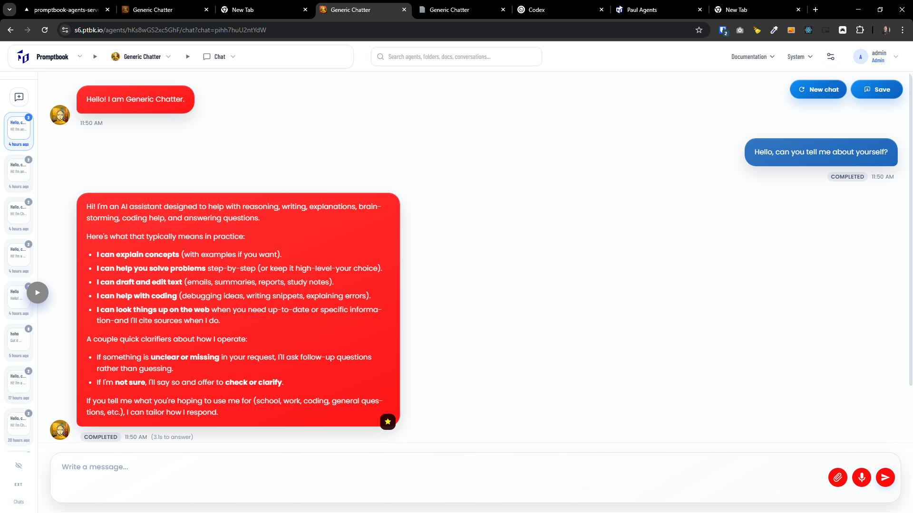
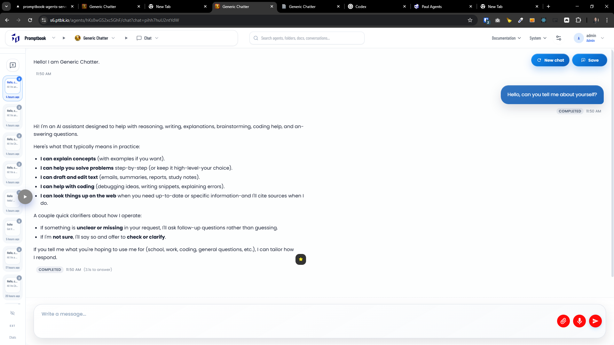
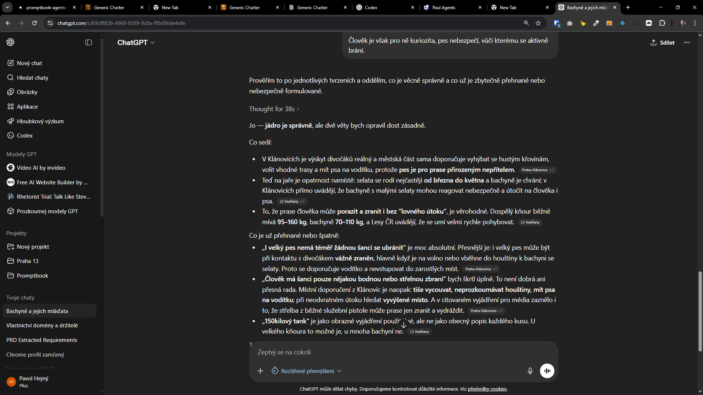

[x] ~$1.21 an hour by OpenAI Codex `gpt-5.3-codex`

[🧩📌] Add chat visual mode toggle (BUBBLE vs ARTICLE) in Agents Server

-   You are working with [Agents Server](apps/agents-server)
-   Problem: Currently, user and agent messages render with the same “bubble” look, so it’s hard to visually distinguish agent responses from the user.
-   Add two chat visual modes, selected by the control panel:
    -   BUBBLE_MODE (current behavior): both user and agent messages appear as bubbles
    -   ARTICLE_MODE: user messages still appear as regular bubbles, but agent messages render as seamless/borderless “article” blocks (ChatGPT-like)
-   API/props requirement for Article mode: the chat component must accept a prop for chat visual mode (must be an uppercase constant with underscores), e.g. `CHAT_VISUAL_MODE` with possible values `BUBBLE_MODE` and `ARTICLE_MODE` (exact naming TBD)
-   Control panel + metadata requirement:
    -   Add setting in the control panel named **Chat visual mode**
    -   Default value comes from chat/agent metadata (metadata already exists for other controls like language)
    -   Users can override the default in the control panel between the two modes
-   Persistence expectation:
    -   Clarify whether the selected visual mode should persist per user/session/chat (TBD)
-   UI/UX details:
    -   In ARTICLE_MODE, agent messages should have no visible bubble border/background and should flow like regular text blocks
    -   Ensure message spacing/typography remains readable and consistent with current theme
-   Rendering rules:
    -   User messages: always bubble-style in both modes
    -   Agent messages: bubble-style only in BUBBLE_MODE; seamless in ARTICLE_MODE
-   Backwards compatibility:
    -   Existing chats should default to BUBBLE_MODE unless metadata specifies ARTICLE_MODE
-   QA/testing:
    -   Visual regression checks for both modes
    -   Verify streaming messages render correctly in ARTICLE_MODE (no late border/bubble flash)
    -   Verify mobile layout
-   Documentation:
    -   Add a note to the relevant chat UI docs / README if such a document exists (file TBD)
-   Acceptance criteria:
    -   Control panel toggle changes rendering immediately without page reload
    -   Metadata “Chat visual mode” sets the default correctly
    -   Agent messages are borderless in ARTICLE_MODE while user bubbles remain

---

[x] ~$0.4056 43 minutes by OpenAI Codex `gpt-5.3-codex`

[🧩📌] The `ARTICLE_MODE` should be visually better

-   Now it is just message bubble without color
-   It should be not be in the invisible chat bubble but more like regular article in the web
-   On mobile full width
-   On desktop take some max width and be centered, with some padding on the sides but text always start from the left edge of the message, not centered
-   Action buttons, like feedback, report issue, read, copy,... should be on the bottom and always visible, not hidden and visible on hover
-   Hover should be on the butons itself
-   You are changing only Article mode, Bubble mode should stay the same
-   Make some good common abstraction to not to much duplicate the code for the two modes, but also not to make it too complex and hard to understand
-   Do a proper analysis of the current functionality before you start implementing.
-   You are working with the [Agents Server](apps/agents-server) with the chat page and with `Chat` component

