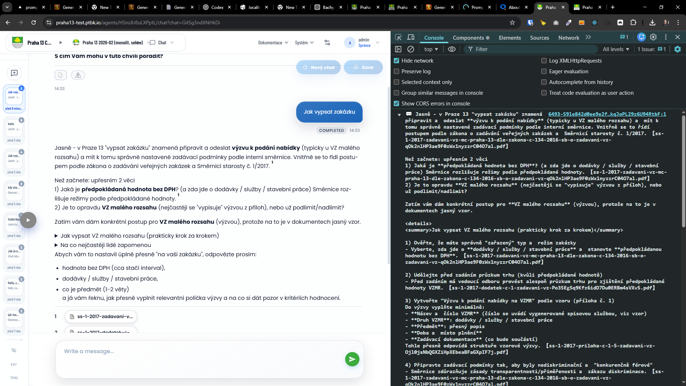
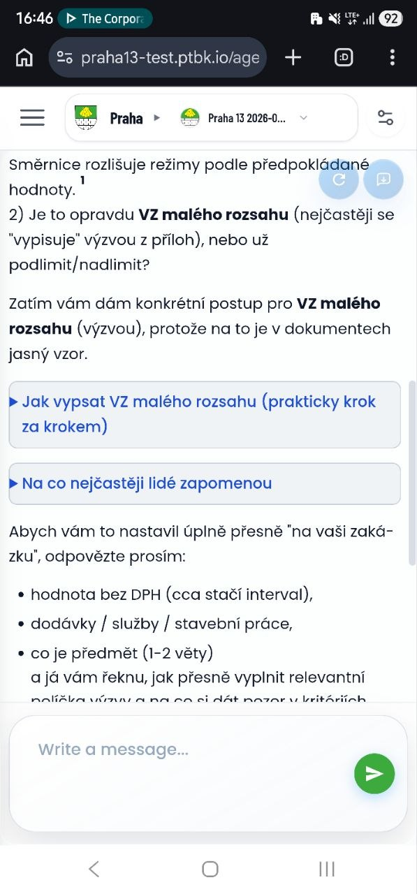
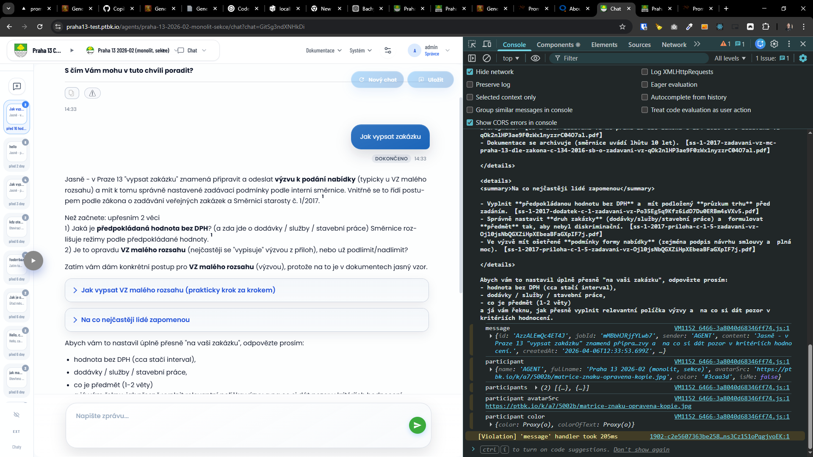
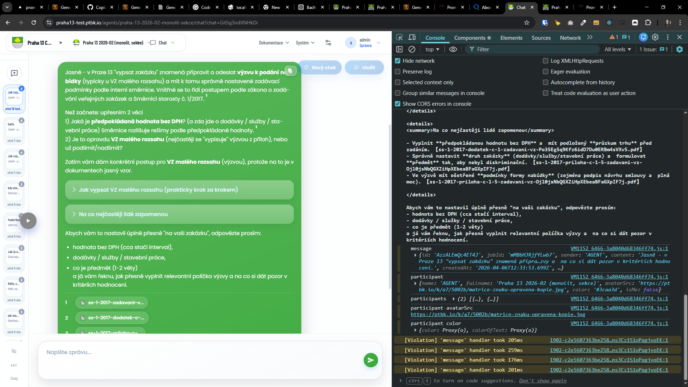
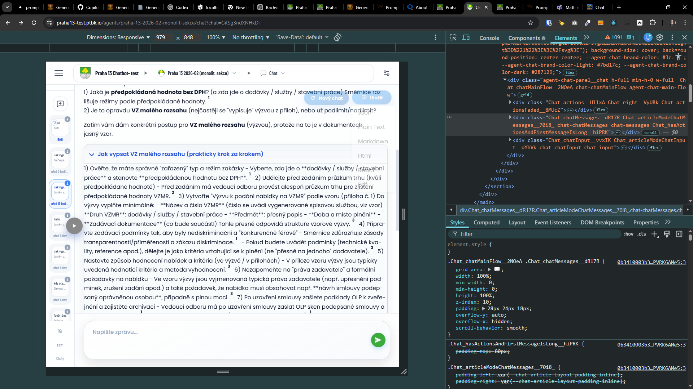

[x] ~$0.00 29 minutes by GitHub Copilot `claude-sonnet-4.6`

[✨🔣] Fix clicking on `
` section in chat message markdown

-   Messages in chat can contain markdown with `
` sections (e.g. for tool response details). Currently, clicking to expand/collapse the `
` does not work (no expansion, no error, just unresponsive).
-   The content is clearly there and the `
` element is rendered, but the click handler to toggle it is not functioning.
-   Nothing happens when I click on the "Show details" summary, it does not expand to show the details content. This makes it impossible to see important information that is hidden in the details section.
-   Maybe something is preventing the click event from reaching the `
` element, or the event handler is not properly attached.
-   But overall make the clicking on the `
` summary work as expected, and enhance the user experience by allowing users to easily access the hidden details content in chat messages.
-   Keep in mind the DRY _(don't repeat yourself)_ principle.
-   Do a proper analysis of the current functionality before you start implementing.
-   You are working with the [Agents Server](apps/agents-server)

---

[x] ~$0.00 17 minutes by GitHub Copilot `claude-sonnet-4.6`

---

[x] ~$0.00 14 minutes by GitHub Copilot `gpt-5.4`

[✨🔣] Fix clicking on `
` section in chat message markdown

-   Messages in chat can contain markdown with `
` sections (e.g. for tool response details). Currently, clicking to expand/collapse the `
` does not work
-   It just blinks but does not expand
-   The content is clearly there and the `
` element is rendered, but the click handler to toggle it is not functioning.
-   Also visually enhance the `
` summary to make it more obvious that it is clickable and can be expanded, for example by adding a hover effect or an icon indicating it can be expanded. Enhance paddings, margins, and overall styling to make it more premium and user-friendly.
-   Keep in mind the DRY _(don't repeat yourself)_ principle.
-   Do a proper analysis of the current functionality before you start implementing.
-   You are working with the [Agents Server](apps/agents-server)

---

[x] ~$0.00 15 minutes by GitHub Copilot `gpt-5.4`

[✨🔣] Fix clicking on `
` section in chat message markdown

-   Messages in chat can contain markdown with `
` sections (e.g. for tool response details). Currently, clicking to expand/collapse the `
` does not work
-   It just blinks but does not expand
-   The content is clearly there and rendered in the `
` element is rendered, but the click handler to toggle it is not functioning.
-   On mobile it just blinks rapidly but does not expand, on desktop it does not even blink, it just does nothing
-   It is problem both in article and bubble mode
-   Keep in mind the DRY _(don't repeat yourself)_ principle.
-   Do a proper analysis of the current functionality before you start implementing.
-   You are working with the [Agents Server](apps/agents-server)

---

[ ]

[✨🔣] Format `
` as markdown

-   The content inside `
` is currently rendered as plain text, it should be rendered as markdown, so it can contain code blocks, lists, links, etc. and be properly formatted.
-   You are working with the [Agents Server](apps/agents-server) with markdown and chat component

---

[-]

[✨🔣] bar

-   @@@
-   Keep in mind the DRY _(don't repeat yourself)_ principle.
-   Do a proper analysis of the current functionality before you start implementing.
-   You are working with the [Agents Server](apps/agents-server)
-   If you need to do the database migration, do it
-   Add the changes into the [changelog](changelog/_current-preversion.md)

---

[-]

[✨🔣] bar

-   @@@
-   Keep in mind the DRY _(don't repeat yourself)_ principle.
-   Do a proper analysis of the current functionality before you start implementing.
-   You are working with the [Agents Server](apps/agents-server)
-   If you need to do the database migration, do it
-   Add the changes into the [changelog](changelog/_current-preversion.md)

