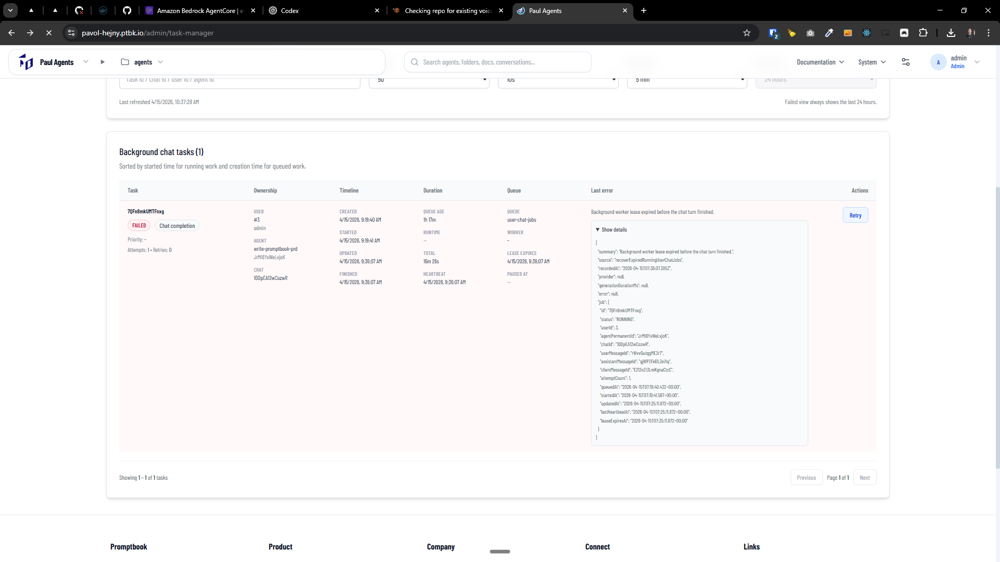

[x] ~$0.00 23 minutes by GitHub Copilot `gpt-5.4`

[✨😴] Fix "Background worker lease expired before the chat turn finished."

```json
{
    "summary": "Background worker lease expired before the chat turn finished.",
    "source": "recoverExpiredRunningUserChatJobs",
    "recordedAt": "2026-04-07T21:02:28.678Z",
    "provider": null,
    "generationDurationMs": null,
    "error": null,
    "job": {
        "id": "79UKryj9jD5STh",
        "status": "RUNNING",
        "userId": 2,
        "agentPermanentId": "HSnsXr8uLXPptL",
        "chatId": "5A9WsHUxYwvrmk",
        "userMessageId": "1n371v5YiSJsQA",
        "assistantMessageId": "RDJmL96jqSVdmz",
        "clientMessageId": "uuNMx1bh8torr756qN",
        "attemptCount": 1,
        "queuedAt": "2026-04-07T20:42:17.023+00:00",
        "startedAt": "2026-04-07T20:42:18.188+00:00",
        "updatedAt": "2026-04-07T20:50:41.204+00:00",
        "lastHeartbeatAt": "2026-04-07T20:50:41.204+00:00",
        "leaseExpiresAt": "2026-04-07T21:00:41.204+00:00"
    }
}
```

-   This error happend especially when the agent was doing some long running task and more of the tasks are running
-   Keep in mind the DRY _(don't repeat yourself)_ principle.
-   Do a proper analysis of the current functionality before you start implementing.
-   You are working with the [Agents Server](apps/agents-server)
-   If you need to do the database migration, do it
-   Add the changes into the [changelog](changelog/_current-preversion.md)

---

[x] ~$0.6533 an hour by OpenAI Codex `gpt-5.4`

[✨😴] Fix "Background worker lease expired before the chat turn finished."

```json
{
    "summary": "Background worker lease expired before the chat turn finished.",
    "source": "recoverExpiredRunningUserChatJobs",
    "recordedAt": "2026-04-15T07:36:07.305Z",
    "provider": null,
    "generationDurationMs": null,
    "error": null,
    "job": {
        "id": "7QFn8mkUMTFnxg",
        "status": "RUNNING",
        "userId": 3,
        "agentPermanentId": "JrMi6YxWeLvjoK",
        "chatId": "1DDpEA12wCozwR",
        "userMessageId": "rWvvGutqgME3r7",
        "assistantMessageId": "gjWPZFeDLZeiXq",
        "clientMessageId": "E212nZi3LmKgnaCtcC",
        "attemptCount": 1,
        "queuedAt": "2026-04-15T07:19:40.432+00:00",
        "startedAt": "2026-04-15T07:19:41.567+00:00",
        "updatedAt": "2026-04-15T07:25:11.872+00:00",
        "lastHeartbeatAt": "2026-04-15T07:25:11.872+00:00",
        "leaseExpiresAt": "2026-04-15T07:35:11.872+00:00"
    }
}
```

-   This error happend especially when the agent was doing some long running task and more of the tasks are running
-   It also happens when multiple things are running at the same time, for example when the agent is doing some long running task and at the same time there are some other tasks running, for example some other agent is doing some long running task, or there are some other background jobs running, etc.
-   The logged error message is not very useful, it does not contain any useful information about what is going on, so we need to improve the logging and error handling in this part of the code, so we can better understand what is going on when this error happens again
-   This is probbably some issue with limits, do not increase the limits but log which limits are being hit and which tasks are running when this error happens, so we can better understand what is going on and how to fix it
-   Keep in mind the DRY _(don't repeat yourself)_ principle.
-   Do a proper analysis of the current functionality before you start implementing.
-   You are working with the [Agents Server](apps/agents-server)
-   If you need to do the database migration, do it
-   Add the changes into the [changelog](changelog/_current-preversion.md)



---

[-]

[✨😴] bar

-   @@@
-   Keep in mind the DRY _(don't repeat yourself)_ principle.
-   Do a proper analysis of the current functionality before you start implementing.
-   You are working with the [Agents Server](apps/agents-server)
-   If you need to do the database migration, do it
-   Add the changes into the [changelog](changelog/_current-preversion.md)

---

[-]

[✨😴] bar

-   @@@
-   Keep in mind the DRY _(don't repeat yourself)_ principle.
-   Do a proper analysis of the current functionality before you start implementing.
-   You are working with the [Agents Server](apps/agents-server)
-   If you need to do the database migration, do it
-   Add the changes into the [changelog](changelog/_current-preversion.md)

