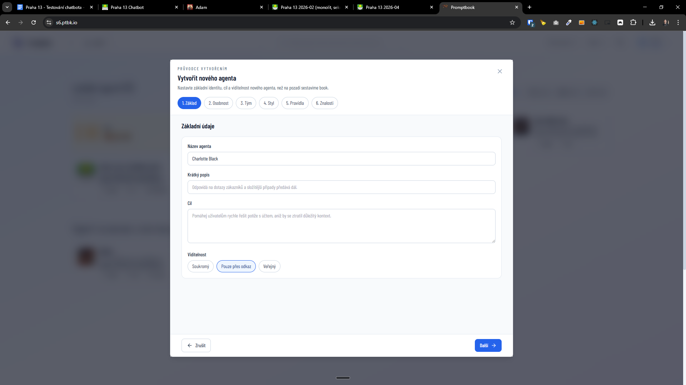

[x] ~$0.00 40 minutes by GitHub Copilot `gpt-5.4`

[✨🦽] The Wizard create new agent modal should have s link to book

-   Agent server can have two type of agent creation - the Book editor and the Wizard. The Wizard is a simplified agent creation flow that doesn't require users to understand the concept of books, but there should be still a link to the top-right corner of the Wizard modal that would allow users to open the book editor
-   When the Wizzard is partially filled and the user clicks on the book editor link, the book should be pre-filled with the content from the Wizzard, so the user can continue editing the agent in the book editor without losing the progress made in the Wizzard.
-   Keep in mind the DRY _(don't repeat yourself)_ principle.
-   Do a proper analysis of the current functionality before you start implementing.
-   You are working with the [Agents Server](apps/agents-server)

---

[-]

[✨🦽] brr

-   @@@
-   Keep in mind the DRY _(don't repeat yourself)_ principle.
-   Do a proper analysis of the current functionality before you start implementing.
-   You are working with the [Agents Server](apps/agents-server)
-   If you need to do the database migration, do it
-   Add the changes into the [changelog](changelog/_current-preversion.md)

---

[-]

[✨🦽] brr

-   @@@
-   Keep in mind the DRY _(don't repeat yourself)_ principle.
-   Do a proper analysis of the current functionality before you start implementing.
-   You are working with the [Agents Server](apps/agents-server)
-   If you need to do the database migration, do it
-   Add the changes into the [changelog](changelog/_current-preversion.md)

---

[-]

[✨🦽] brr

-   @@@
-   Keep in mind the DRY _(don't repeat yourself)_ principle.
-   Do a proper analysis of the current functionality before you start implementing.
-   You are working with the [Agents Server](apps/agents-server)
-   If you need to do the database migration, do it
-   Add the changes into the [changelog](changelog/_current-preversion.md)

