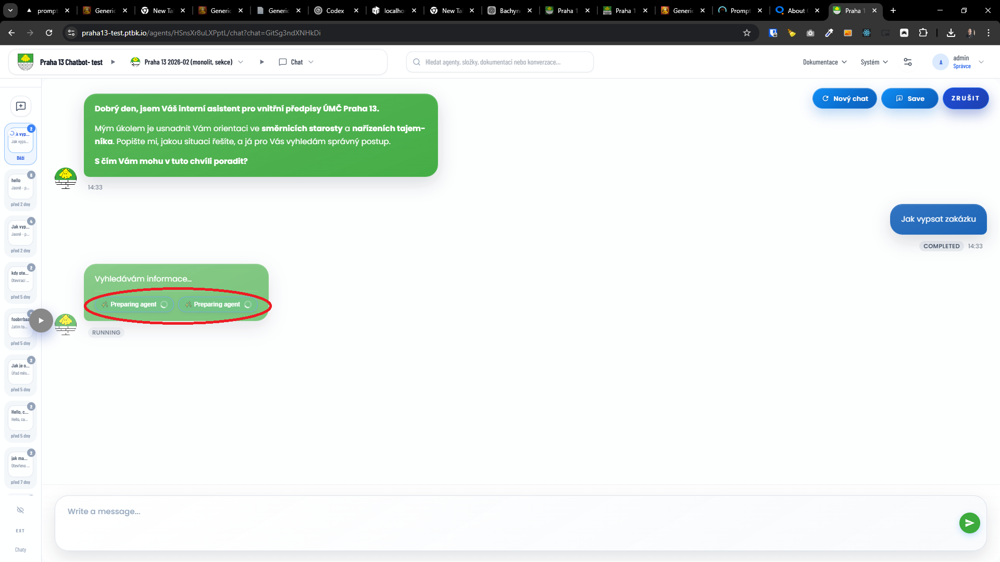

[x] ~$0.00 36 minutes by GitHub Copilot `claude-sonnet-4.6`

[✨🧠] Deduplicate the “preparing agent” chip in chat

-   Fix an issue where the chat UI shows duplicate “preparing agent” chips (likely caused by multiple concurrent state updates / re-renders while streaming or switching chats).
-   When a chat message lifecycle enters the “preparing agent” phase, the chip must be unique per chat/thread (not per render).
-   The chip should appear once when the first “preparing agent” event happens, and be removed/replaced correctly when the chat transitions to the next phase (agent running / first tokens / completed).
-   Ensure switching between chats does not re-add the chip if it already exists for that thread.
-   The fix must be implemented without breaking existing chip behaviors (including ongoing/running indicators).
-   You are working with the [Agents Server](apps/agents-server)
-   Add/update integration test coverage under the Agents Server test suite to cover:
    -   Initial load shows exactly one chip.
    -   Switching chat shows exactly one chip for the new thread and zero duplicates within the same thread.
    -   During streaming / repeated state updates, the chip is deduplicated.

