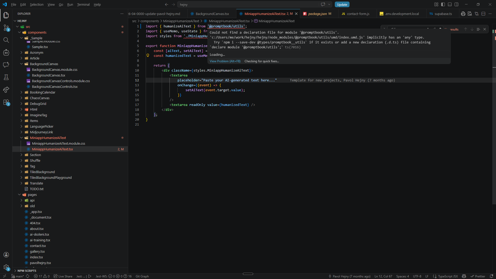

[x] ~$0.00 an hour by GitHub Copilot `gpt-5.4`

[✨𓀘] Fix type definitions in published packages

```typescript
import { humanizeAiText } from '@promptbook/utils';

/*
Could not find a declaration file for module '@promptbook/utils'. 'c:/Users/me/work/hejny/hejny/node_modules/@promptbook/utils/umd/index.umd.js' implicitly has an 'any' type.
  Try `npm i --save-dev @types/promptbook__utils` if it exists or add a new declaration (.d.ts) file containing `declare module '@promptbook/utils';`ts(7016)
*/
```

-   All `@promptbook/*` packages should have proper type definitions build in, no extra type definitions needed, so that they can be used in TypeScript projects without any issues.
-   Do a proper analysis of the current functionality before you start implementing.
-   Analyze the build process of the packages and identify why the type definitions are not being generated or included properly.
-   For example here is external project where it causes issues: `C:/Users/me/work/hejny/hejny/src/components/MiniappHumanizeAiText/MiniappHumanizeAiText.tsx`



---

[-]

[✨𓀘] foo

-   @@@
-   Keep in mind the DRY _(don't repeat yourself)_ principle.
-   Do a proper analysis of the current functionality before you start implementing.
-   Add the changes into the [changelog](./changelog/_current-preversion.md)

---

[-]

[✨𓀘] foo

-   @@@
-   Keep in mind the DRY _(don't repeat yourself)_ principle.
-   Do a proper analysis of the current functionality before you start implementing.
-   Add the changes into the [changelog](./changelog/_current-preversion.md)

---

[-]

[✨𓀘] foo

-   @@@
-   Keep in mind the DRY _(don't repeat yourself)_ principle.
-   Do a proper analysis of the current functionality before you start implementing.
-   Add the changes into the [changelog](./changelog/_current-preversion.md)

