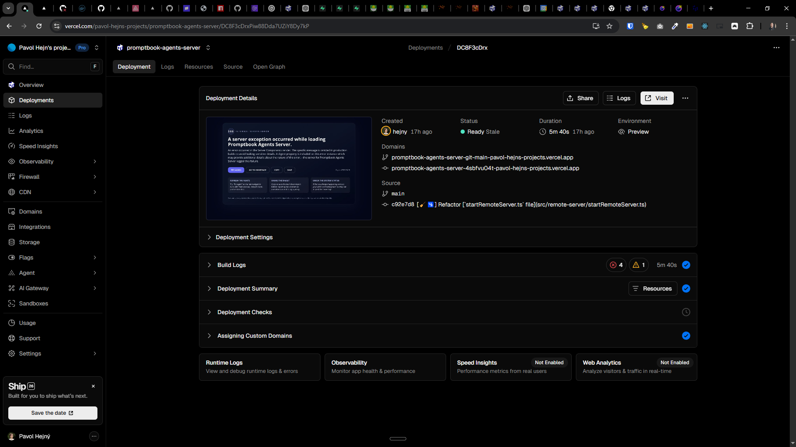

[x] ~$0.00 14 minutes by OpenAI Codex `gpt-5.4`

[✨🐇] The build on Vercel tooks more than 5 minutes, optimize it and make it faster

```log
10:28:10.559 Warning: You're seeing the last 10000 lines of logs. Any lines before that were automatically truncated.
10:28:10.559       '    at ez (/vercel/path0/node_modules/next/dist/compiled/next-server/app-page.runtime.prod.js:5:46422)'
10:28:10.559   },
10:28:10.559   [Symbol(kResourceStore)]: eg {
10:28:10.559     type: 20,
10:28:10.559     status: 14,
10:28:10.559     flushScheduled: false,
10:28:10.559     fatalError: null,
10:28:10.559     destination: null,
10:28:10.559     bundlerConfig: {
10:28:10.559       '/vercel/path0/node_modules/next/dist/client/components/client-page.js': [Object],
10:28:10.559       '/vercel/path0/node_modules/next/dist/esm/client/components/client-page.js': [Object],
10:28:10.559       '/vercel/path0/node_modules/next/dist/client/components/client-segment.js': [Object],
10:28:10.559       '/vercel/path0/node_modules/next/dist/esm/client/components/client-segment.js': [Object],
10:28:10.559       '/vercel/path0/node_modules/next/dist/client/components/http-access-fallback/error-boundary.js': [Object],
10:28:10.559       '/vercel/path0/node_modules/next/dist/esm/client/components/http-access-fallback/error-boundary.js': [Object],
10:28:10.559       '/vercel/path0/node_modules/next/dist/client/components/layout-router.js': [Object],
10:28:10.559       '/vercel/path0/node_modules/next/dist/esm/client/components/layout-router.js': [Object],
10:28:10.559       '/vercel/path0/node_modules/next/dist/client/components/metadata/async-metadata.js': [Object],
10:28:10.559       '/vercel/path0/node_modules/next/dist/esm/client/components/metadata/async-metadata.js': [Object],
10:28:10.559       '/vercel/path0/node_modules/next/dist/client/components/metadata/metadata-boundary.js': [Object],
10:28:10.559       '/vercel/path0/node_modules/next/dist/esm/client/components/metadata/metadata-boundary.js': [Object],
10:28:10.559       '/vercel/path0/node_modules/next/dist/client/components/render-from-template-context.js': [Object],
10:28:10.559       '/vercel/path0/node_modules/next/dist/esm/client/components/render-from-template-context.js': [Object],
10:28:10.559       '/vercel/path0/node_modules/next/dist/lib/metadata/generate/icon-mark.js': [Object],
10:28:10.559       '/vercel/path0/node_modules/next/dist/esm/lib/metadata/generate/icon-mark.js': [Object],
10:28:10.559       '/vercel/path0/apps/agents-server/src/app/global-error.tsx': [Object],
10:28:10.559       '/vercel/path0/node_modules/next/dist/client/app-dir/link.js': [Object],
10:28:10.559       '/vercel/path0/node_modules/next/dist/esm/client/app-dir/link.js': [Object],
10:28:10.559       '/vercel/path0/apps/agents-server/public/favicon.ico': [Object],
10:28:10.559       '/vercel/path0/apps/agents-server/src/components/LayoutWrapper/LayoutWrapper.tsx': [Object],
10:28:10.559       '/vercel/path0/node_modules/next/font/google/target.css?{"path":"src/app/layout.tsx","import":"Barlow_Condensed","arguments":[{"subsets":["latin"],"weight":["300","400","500","600","700"],"display":"swap","fallback":["Arial","Helvetica","sans-serif"],"variable":"--font-barlow-condensed"}],"variableName":"barlowCondensed"}': [Object],
10:28:10.559       '/vercel/path0/node_modules/next/font/google/target.css?{"path":"src/app/layout.tsx","import":"Poppins","arguments":[{"subsets":["latin"],"weight":["400","500","600","700","800"],"display":"swap","fallback":["Arial","Helvetica","sans-serif"],"variable":"--font-poppins"}],"variableName":"poppins"}': [Object],
10:28:10.559       '/vercel/path0/apps/agents-server/src/app/globals.css': [Object],
10:28:10.559       '/vercel/path0/apps/agents-server/src/app/error.tsx': [Object],
10:28:10.559       '/vercel/path0/apps/agents-server/src/app/agents/[agentName]/AgentProfileWrapper.tsx': [Object],
10:28:10.559       '/vercel/path0/apps/agents-server/src/app/agents/[agentName]/DeferredAgentProfileChat.tsx': [Object],
10:28:10.559       '/vercel/path0/apps/agents-server/src/components/AgentProfile/AgentProfile.tsx': [Object],
10:28:10.559       '/vercel/path0/apps/agents-server/src/components/DeletedAgentBanner.tsx': [Object],
10:28:10.559       '/vercel/path0/apps/agents-server/src/app/admin/api-tokens/ApiTokensClient.tsx': [Object],
10:28:10.559       '/vercel/path0/apps/agents-server/src/components/ForbiddenPage/ForbiddenPage.tsx': [Object],
10:28:10.559       '/vercel/path0/apps/agents-server/src/app/admin/backup/BackupClient.tsx': [Object],
10:28:10.560       '/vercel/path0/apps/agents-server/src/app/admin/browser-test/BrowserTestClient.tsx': [Object],
10:28:10.560       '/vercel/path0/apps/agents-server/src/app/admin/chat-feedback/ChatFeedbackClient.tsx': [Object],
10:28:10.560       '/vercel/path0/apps/agents-server/src/app/admin/chat-history/ChatHistoryClient.tsx': [Object],
10:28:10.560       '/vercel/path0/apps/agents-server/src/app/admin/custom-css/CustomCssClient.tsx': [Object],
10:28:10.560       '/vercel/path0/apps/agents-server/src/app/admin/custom-js/CustomJsClient.tsx': [Object],
10:28:10.560       '/vercel/path0/apps/agents-server/src/app/admin/error-simulation/ErrorSimulationClient.tsx': [Object],
10:28:10.560       '/vercel/path0/apps/agents-server/src/app/admin/files/FilesGalleryClient.tsx': [Object],
10:28:10.560       '/vercel/path0/apps/agents-server/src/app/admin/image-generator-test/ImageGeneratorTestClient.tsx': [Object],
10:28:10.560       '/vercel/path0/apps/agents-server/src/app/admin/images/ImagesGalleryClient.tsx': [Object],
10:28:10.560       '/vercel/path0/apps/agents-server/src/app/admin/messages/MessagesClient.tsx': [Object],
10:28:10.560       '/vercel/path0/apps/agents-server/src/app/admin/messages/send-email/SendEmailClient.tsx': [Object],
10:28:10.560       '/vercel/path0/apps/agents-server/src/app/admin/metadata/MetadataClient.tsx': [Object],
10:28:10.560       '/vercel/path0/apps/agents-server/src/app/admin/search-engine-test/SearchEngineTestClient.tsx': [Object],
10:28:10.560       '/vercel/path0/apps/agents-server/src/app/admin/servers/ServersClient.tsx': [Object],
10:28:10.560       '/vercel/path0/apps/agents-server/src/app/admin/task-manager/TaskManagerClient.tsx': [Object],
10:28:10.560       '/vercel/path0/apps/agents-server/src/app/admin/tool-limits/ToolLimitsClient.tsx': [Object],
10:28:10.560       '/vercel/path0/apps/agents-server/src/app/admin/usage/UsageClient.tsx': [Object],
10:28:10.560       '/vercel/path0/apps/agents-server/src/app/admin/users/[userId]/UserDetailClient.tsx': [Object],
10:28:10.560       '/vercel/path0/apps/agents-server/src/components/UsersList/UsersList.tsx': [Object],
10:28:10.560       '/vercel/path0/apps/agents-server/src/app/admin/voice-input-test/VoiceInputTestClient.tsx': [Object],
10:28:10.560       '/vercel/path0/apps/agents-server/src/components/Homepage/AgentsList.tsx': [Object],
10:28:10.560       '/vercel/path0/apps/agents-server/src/components/Homepage/ExternalAgentsSectionClient.tsx': [Object],
10:28:10.560       '/vercel/path0/src/_packages/components.index.ts': [Object],
10:28:10.560       '/vercel/path0/apps/agents-server/src/components/DocsToolbar/DocsToolbar.tsx': [Object],
10:28:10.560       '/vercel/path0/apps/agents-server/src/app/experiments/story/page.tsx': [Object],
10:28:10.560       '/vercel/path0/apps/agents-server/src/app/search/SearchPageClient.tsx': [Object],
10:28:10.560       '/vercel/path0/apps/agents-server/src/app/system/profile/UserProfileClient.tsx': [Object],
10:28:10.560       '/vercel/path0/apps/agents-server/src/app/system/settings/KeybindingsSettingsClient.tsx': [Object],
10:28:10.560       '/vercel/path0/apps/agents-server/src/app/system/user-memory/UserMemoryClient.tsx': [Object],
10:28:10.560       '/vercel/path0/apps/agents-server/src/app/system/user-wallet/UserWalletClient.tsx': [Object],
10:28:10.560       '/vercel/path0/apps/agents-server/src/app/system/utilities/mocked-chats/MockedChatsEditorClient.tsx': [Object],
10:28:10.560       '/vercel/path0/apps/agents-server/src/app/system/utilities/mocked-chats/view/MockedChatsViewerClient.tsx': [Object],
10:28:10.560       '/vercel/path0/src/book-components/Chat/MarkdownContent/MarkdownContent.tsx': [Object],
10:28:10.560       '/vercel/path0/apps/agents-server/src/components/Homepage/RecycleBinList.tsx': [Object],
10:28:10.560       '/vercel/path0/apps/agents-server/src/app/swagger/SwaggerPageClient.tsx': [Object],
10:28:10.560       '/vercel/path0/apps/agents-server/src/app/agents/[agentName]/book+chat/AgentBookAndChat.tsx': [Object],
10:28:10.560       '/vercel/path0/apps/agents-server/src/app/agents/[agentName]/book/BookEditorWrapper.tsx': [Object],
10:28:10.560       '/vercel/path0/apps/agents-server/src/app/agents/[agentName]/chat/AgentChatHistoryClient.tsx': [Object],
10:28:10.560       '/vercel/path0/apps/agents-server/src/app/agents/[agentName]/export-as-transpiled-code/AgentCodePageClient.tsx': [Object],
10:28:10.560       '/vercel/path0/apps/agents-server/src/app/agents/[agentName]/history/RestoreVersionButton.tsx': [Object],
10:28:10.560       '/vercel/path0/apps/_common/components/CodePreview/CodePreview.tsx': [Object],
10:28:10.560       '/vercel/path0/apps/agents-server/src/app/agents/[agentName]/integration/ApiKeyIntegrationSections.tsx': [Object],
10:28:10.560       '/vercel/path0/apps/agents-server/src/app/agents/[agentName]/integration/CalendarIntegrationSection.tsx': [Object],
10:28:10.560       '/vercel/path0/apps/agents-server/src/app/agents/[agentName]/integration/PromptbookSdkTabs.tsx': [Object],
10:28:10.560       '/vercel/path0/apps/agents-server/src/app/agents/[agentName]/integration/WebsiteIntegrationTabs.tsx': [Object],
10:28:10.560       '/vercel/path0/apps/agents-server/src/app/agents/[agentName]/system-message/SystemMessageBookEditor.tsx': [Object],
10:28:10.560       '/vercel/path0/apps/agents-server/src/app/agents/[agentName]/textarea/AgentTextareaClient.tsx': [Object],
10:28:10.560       '/vercel/path0/apps/agents-server/src/app/agents/[agentName]/timeouts/AgentTimeoutsClient.tsx': [Object],
10:28:10.560       '/vercel/path0/apps/agents-server/src/app/embed/page.tsx': [Object]
10:28:10.560     },
10:28:10.560     cache: Map(1) { [Function: E] => [WeakMap] },
10:28:10.560     cacheController: AbortController { signal: AbortSignal { aborted: true } },
10:28:10.560     nextChunkId: 30,
10:28:10.560     pendingChunks: 0,
10:28:10.560     hints: Set(16) {
10:28:10.560       'L[font]/_next/static/media/0484562807a97172-s.p.woff2?dpl=dpl_DC8F3cDrxPiw88Dda7UZiY8Dy7kP',
10:28:10.560       'L[font]/_next/static/media/1f54c84255ccf44e-s.p.woff2?dpl=dpl_DC8F3cDrxPiw88Dda7UZiY8Dy7kP',
10:28:10.560       'L[font]/_next/static/media/3667c091265cf81b-s.p.woff2?dpl=dpl_DC8F3cDrxPiw88Dda7UZiY8Dy7kP',
10:28:10.560       'L[font]/_next/static/media/437e5f23c97e320c-s.p.woff2?dpl=dpl_DC8F3cDrxPiw88Dda7UZiY8Dy7kP',
10:28:10.560       'L[font]/_next/static/media/5fb5c05ff73c0616-s.p.woff2?dpl=dpl_DC8F3cDrxPiw88Dda7UZiY8Dy7kP',
10:28:10.560       'L[font]/_next/static/media/7db6c35d839a711c-s.p.woff2?dpl=dpl_DC8F3cDrxPiw88Dda7UZiY8Dy7kP',
10:28:10.560       'L[font]/_next/static/media/8888a3826f4a3af4-s.p.woff2?dpl=dpl_DC8F3cDrxPiw88Dda7UZiY8Dy7kP',
10:28:10.560       'L[font]/_next/static/media/b957ea75a84b6ea7-s.p.woff2?dpl=dpl_DC8F3cDrxPiw88Dda7UZiY8Dy7kP',
10:28:10.560       'L[font]/_next/static/media/eafabf029ad39a43-s.p.woff2?dpl=dpl_DC8F3cDrxPiw88Dda7UZiY8Dy7kP',
10:28:10.560       'L[font]/_next/static/media/eeb8a9ff846037ce-s.p.woff2?dpl=dpl_DC8F3cDrxPiw88Dda7UZiY8Dy7kP',
10:28:10.560       'L[style]/_next/static/css/de7c0ac3e7516811.css?dpl=dpl_DC8F3cDrxPiw88Dda7UZiY8Dy7kP',
10:28:10.560       'L[style]/_next/static/css/ed0f0e0535a22473.css?dpl=dpl_DC8F3cDrxPiw88Dda7UZiY8Dy7kP',
10:28:10.560       'L[style]/_next/static/css/2de9726a3c08d309.css?dpl=dpl_DC8F3cDrxPiw88Dda7UZiY8Dy7kP',
10:28:10.560       'L[style]/_next/static/css/07199a57b6717f23.css?dpl=dpl_DC8F3cDrxPiw88Dda7UZiY8Dy7kP',
10:28:10.560       'L[style]/_next/static/css/3e74dbcd65866175.css?dpl=dpl_DC8F3cDrxPiw88Dda7UZiY8Dy7kP',
10:28:10.560       'L[style]/_next/static/css/950d264b0bfdfd57.css?dpl=dpl_DC8F3cDrxPiw88Dda7UZiY8Dy7kP'
10:28:10.560     },
10:28:10.560     abortableTasks: Set(0) {},
10:28:10.560     pingedTasks: [],
10:28:10.560     completedImportChunks: [],
10:28:10.560     completedHintChunks: [],
10:28:10.560     completedRegularChunks: [],
10:28:10.560     completedErrorChunks: [],
10:28:10.560     writtenSymbols: Map(2) {
10:28:10.560       Symbol(react.fragment) => 1,
10:28:10.560       Symbol(react.suspense) => 28
10:28:10.560     },
10:28:10.560     writtenClientReferences: Map(9) {
10:28:10.560       '/vercel/path0/node_modules/next/dist/client/components/layout-router.js#' => 3,
10:28:10.560       '/vercel/path0/node_modules/next/dist/client/components/render-from-template-context.js#' => 4,
10:28:10.560       '/vercel/path0/node_modules/next/dist/client/components/client-page.js#ClientPageRoot' => 5,
10:28:10.560       '/vercel/path0/apps/agents-server/src/app/embed/page.tsx#default' => 6,
10:28:10.560       '/vercel/path0/node_modules/next/dist/client/components/metadata/metadata-boundary.js#OutletBoundary' => 9,
10:28:10.560       '/vercel/path0/node_modules/next/dist/client/components/metadata/async-metadata.js#AsyncMetadataOutlet' => 11,
10:28:10.560       '/vercel/path0/apps/agents-server/src/app/global-error.tsx#default' => 23,
10:28:10.560       '/vercel/path0/node_modules/next/dist/client/components/metadata/metadata-boundary.js#ViewportBoundary' => 25,
10:28:10.560       '/vercel/path0/node_modules/next/dist/client/components/metadata/metadata-boundary.js#MetadataBoundary' => 27
10:28:10.560     },
10:28:10.560     writtenServerReferences: Map(0) {},
10:28:10.560     writtenObjects: WeakMap { <items unknown> },
10:28:10.560     temporaryReferences: undefined,
10:28:10.560     identifierPrefix: '',
10:28:10.560     identifierCount: 1,
10:28:10.560     taintCleanupQueue: [],
10:28:10.560     onError: [Function (anonymous)],
10:28:10.560     onPostpone: [Function: X],
10:28:10.560     onAllReady: [Function: X],
10:28:10.560     onFatalError: [Function: X]
10:28:10.560   },
10:28:10.560   [Symbol(kResourceStore)]: undefined,
10:28:10.560   [Symbol(kResourceStore)]: {
10:28:10.560     type: 'prerender-legacy',
10:28:10.560     phase: 'render',
10:28:10.560     rootParams: {},
10:28:10.560     implicitTags: { tags: [Array], expirationsByCacheKind: [Map] },
10:28:10.560     revalidate: 0,
10:28:10.560     expire: 4294967294,
10:28:10.560     stale: 4294967294,
10:28:10.560     tags: [
10:28:10.561       '_N_T_/layout',
10:28:10.561       '_N_T_/embed/layout',
10:28:10.561       '_N_T_/embed/page',
10:28:10.561       '_N_T_/embed'
10:28:10.561     ]
10:28:10.561   }
10:28:10.561 }
10:28:10.561 Unhandled rejection Error: Dynamic server usage: Route /embed couldn't be rendered statically because it used `headers`. See more info here: https://nextjs.org/docs/messages/dynamic-server-error
10:28:10.561     at r (.next/server/chunks/657.js:12:54555)
10:28:10.561     at m (.next/server/chunks/5208.js:1:2857)
10:28:10.561     at <unknown> (.next/server/chunks/7183.js:31:604)
10:28:10.561     at k (.next/server/chunks/7183.js:31:1134)
10:28:10.561     at e (.next/server/chunks/7183.js:1:4597)
10:28:10.561     at <unknown> (.next/server/chunks/8134.js:119:2083)
10:28:10.561     at k (.next/server/chunks/8134.js:119:2380)
10:28:10.561     at M (.next/server/chunks/1174.js:440:3375) {
10:28:10.561   description: "Route /embed couldn't be rendered statically because it used `headers`. See more info here: https://nextjs.org/docs/messages/dynamic-server-error",
10:28:10.561   digest: 'DYNAMIC_SERVER_USAGE'
10:28:10.561 } Promise {
10:28:10.561   <rejected> Error: Dynamic server usage: Route /embed couldn't be rendered statically because it used `headers`. See more info here: https://nextjs.org/docs/messages/dynamic-server-error
10:28:10.561       at r (.next/server/chunks/657.js:12:54555)
10:28:10.561       at m (.next/server/chunks/5208.js:1:2857)
10:28:10.561       at <unknown> (.next/server/chunks/7183.js:31:604)
10:28:10.561       at k (.next/server/chunks/7183.js:31:1134)
10:28:10.561       at e (.next/server/chunks/7183.js:1:4597)
10:28:10.561       at <unknown> (.next/server/chunks/8134.js:119:2083)
10:28:10.561       at k (.next/server/chunks/8134.js:119:2380)
10:28:10.561       at M (.next/server/chunks/1174.js:440:3375) {
10:28:10.561     description: "Route /embed couldn't be rendered statically because it used `headers`. See more info here: https://nextjs.org/docs/messages/dynamic-server-error",
10:28:10.561     digest: 'DYNAMIC_SERVER_USAGE'
10:28:10.561   },
10:28:10.561   [Symbol(async_id_symbol)]: 24172,
10:28:10.561   [Symbol(trigger_async_id_symbol)]: 24123,
10:28:10.561   [Symbol(kResourceStore)]: {
10:28:10.561     isStaticGeneration: true,
10:28:10.561     page: '/embed/page',
10:28:10.561     fallbackRouteParams: null,
10:28:10.561     route: '/embed',
10:28:10.561     incrementalCache: IncrementalCache {
10:28:10.561       locks: Map(0) {},
10:28:10.561       hasCustomCacheHandler: false,
10:28:10.563       dev: false,
10:28:10.563       disableForTestmode: false,
10:28:10.563       minimalMode: true,
10:28:10.563       requestHeaders: {},
10:28:10.563       allowedRevalidateHeaderKeys: undefined,
10:28:10.563       prerenderManifest: [Object],
10:28:10.563       cacheControls: [SharedCacheControls],
10:28:10.563       fetchCacheKeyPrefix: '',
10:28:10.563       cacheHandler: [FileSystemCache]
10:28:10.563     },
10:28:10.563     cacheLifeProfiles: {
10:28:10.563       default: [Object],
10:28:10.563       seconds: [Object],
10:28:10.563       minutes: [Object],
10:28:10.563       hours: [Object],
10:28:10.563       days: [Object],
10:28:10.563       weeks: [Object],
10:28:10.563       max: [Object]
10:28:10.563     },
10:28:10.563     isRevalidate: true,
10:28:10.563     isBuildTimePrerendering: true,
10:28:10.563     hasReadableErrorStacks: false,
10:28:10.563     fetchCache: undefined,
10:28:10.563     isOnDemandRevalidate: undefined,
10:28:10.563     isDraftMode: undefined,
10:28:10.563     requestEndedState: { ended: false },
10:28:10.563     isPrefetchRequest: false,
10:28:10.563     buildId: 'oszGjrBp--WauQJ6g8DIl',
10:28:10.563     reactLoadableManifest: {
10:28:10.563       '../../../node_modules/jspdf/dist/jspdf.es.min.js -> canvg': [Object],
10:28:10.563       '../../../node_modules/jspdf/dist/jspdf.es.min.js -> dompurify': [Object],
10:28:10.563       '../../../node_modules/jspdf/dist/jspdf.es.min.js -> html2canvas': [Object],
10:28:10.563       '../../../src/book-components/Chat/Chat/ChatMessageMap.tsx -> leaflet': [Object],
10:28:10.563       '../../../src/book-components/Qr/PromptbookQrCode.tsx -> qrcode': [Object],
10:28:10.563       '../../../src/commitments/TEAM/TEAM.ts -> ../../llm-providers/agent/RemoteAgent': [Object],
10:28:10.563       'app/agents/[agentName]/DeferredAgentProfileChat.tsx -> ./AgentProfileChat': [Object],
10:28:10.563       'app/swagger/SwaggerPageClient.tsx -> swagger-ui-react': [Object],
10:28:10.563       'components/Homepage/AgentsListDialogs.tsx -> ../AgentContextMenu/AgentContextMenu': [Object],
10:28:10.563       'components/Homepage/AgentsListDialogs.tsx -> ../FolderContextMenu/FolderContextMenu': [Object],
10:28:10.563       'components/Homepage/AgentsListDialogs.tsx -> ./AgentQrCodeModal': [Object],
10:28:10.563       'components/Homepage/AgentsListDialogs.tsx -> ./FolderEditDialog': [Object],
10:28:10.563       'components/Homepage/AgentsListViewContent.tsx -> ./AgentsGraph': [Object],
10:28:10.563       'components/Homepage/AgentsListViewContent.tsx -> ./AgentsOffice': [Object],
10:28:10.563       'components/Homepage/AgentsListViewContent.tsx -> ./AgentsPixelOffice': [Object]
10:28:10.563     },
10:28:10.563     assetPrefix: '',
10:28:10.563     afterContext: eJ {
10:28:10.563       workUnitStores: Set(0) {},
10:28:10.563       waitUntil: [Function: bound ],
10:28:10.564       onClose: [Function: bound onClose],
10:28:10.564       onTaskError: [Function: onTaskError],
10:28:10.564       callbackQueue: [o]
10:28:10.564     },
10:28:10.564     dynamicIOEnabled: false,
10:28:10.564     dev: false,
10:28:10.564     previouslyRevalidatedTags: [],
10:28:10.564     refreshTagsByCacheKind: Map(2) { 'default' => [Object], 'remote' => [Object] },
10:28:10.564     runInCleanSnapshot: [Function: bound] { asyncResource: [Getter/Setter] },
10:28:10.564     fetchMetrics: [],
10:28:10.564     dynamicUsageDescription: 'cookies',
10:28:10.564     dynamicUsageStack: "Error: Dynamic server usage: Route /embed couldn't be rendered statically because it used `cookies`. See more info here: https://nextjs.org/docs/messages/dynamic-server-error\n" +
10:28:10.564       '    at r (/vercel/path0/apps/agents-server/.next/server/chunks/657.js:12:54555)\n' +
10:28:10.564       '    at n (/vercel/path0/apps/agents-server/.next/server/chunks/5208.js:1:9468)\n' +
10:28:10.564       '    at M (/vercel/path0/apps/agents-server/.next/server/chunks/1174.js:440:3840)\n' +
10:28:10.564       '    at ek (/vercel/path0/node_modules/next/dist/compiled/next-server/app-page.runtime.prod.js:5:32629)\n' +
10:28:10.564       '    at e (/vercel/path0/node_modules/next/dist/compiled/next-server/app-page.runtime.prod.js:5:36665)\n' +
10:28:10.564       '    at eI (/vercel/path0/node_modules/next/dist/compiled/next-server/app-page.runtime.prod.js:5:37127)\n' +
10:28:10.564       '    at Array.toJSON (/vercel/path0/node_modules/next/dist/compiled/next-server/app-page.runtime.prod.js:5:34252)\n' +
10:28:10.564       '    at stringify (<anonymous>)\n' +
10:28:10.564       '    at eH (/vercel/path0/node_modules/next/dist/compiled/next-server/app-page.runtime.prod.js:5:46044)\n' +
10:28:10.564       '    at ez (/vercel/path0/node_modules/next/dist/compiled/next-server/app-page.runtime.prod.js:5:46422)'
10:28:10.564   },
10:28:10.564   [Symbol(kResourceStore)]: eg {
10:28:10.564     type: 20,
10:28:10.564     status: 14,
10:28:10.564     flushScheduled: false,
10:28:10.564     fatalError: null,
10:28:10.564     destination: null,
10:28:10.564     bundlerConfig: {
10:28:10.564       '/vercel/path0/node_modules/next/dist/client/components/client-page.js': [Object],
10:28:10.564       '/vercel/path0/node_modules/next/dist/esm/client/components/client-page.js': [Object],
10:28:10.564       '/vercel/path0/node_modules/next/dist/client/components/client-segment.js': [Object],
10:28:10.564       '/vercel/path0/node_modules/next/dist/esm/client/components/client-segment.js': [Object],
10:28:10.564       '/vercel/path0/node_modules/next/dist/client/components/http-access-fallback/error-boundary.js': [Object],
10:28:10.564       '/vercel/path0/node_modules/next/dist/esm/client/components/http-access-fallback/error-boundary.js': [Object],
10:28:10.564       '/vercel/path0/node_modules/next/dist/client/components/layout-router.js': [Object],
10:28:10.564       '/vercel/path0/node_modules/next/dist/esm/client/components/layout-router.js': [Object],
10:28:10.564       '/vercel/path0/node_modules/next/dist/client/components/metadata/async-metadata.js': [Object],
10:28:10.564       '/vercel/path0/node_modules/next/dist/esm/client/components/metadata/async-metadata.js': [Object],
10:28:10.564       '/vercel/path0/node_modules/next/dist/client/components/metadata/metadata-boundary.js': [Object],
10:28:10.564       '/vercel/path0/node_modules/next/dist/esm/client/components/metadata/metadata-boundary.js': [Object],
10:28:10.564       '/vercel/path0/node_modules/next/dist/client/components/render-from-template-context.js': [Object],
10:28:10.564       '/vercel/path0/node_modules/next/dist/esm/client/components/render-from-template-context.js': [Object],
10:28:10.564       '/vercel/path0/node_modules/next/dist/lib/metadata/generate/icon-mark.js': [Object],
10:28:10.564       '/vercel/path0/node_modules/next/dist/esm/lib/metadata/generate/icon-mark.js': [Object],
10:28:10.564       '/vercel/path0/apps/agents-server/src/app/global-error.tsx': [Object],
10:28:10.564       '/vercel/path0/node_modules/next/dist/client/app-dir/link.js': [Object],
10:28:10.564       '/vercel/path0/node_modules/next/dist/esm/client/app-dir/link.js': [Object],
10:28:10.564       '/vercel/path0/apps/agents-server/public/favicon.ico': [Object],
10:28:10.564       '/vercel/path0/apps/agents-server/src/components/LayoutWrapper/LayoutWrapper.tsx': [Object],
10:28:10.564       '/vercel/path0/node_modules/next/font/google/target.css?{"path":"src/app/layout.tsx","import":"Barlow_Condensed","arguments":[{"subsets":["latin"],"weight":["300","400","500","600","700"],"display":"swap","fallback":["Arial","Helvetica","sans-serif"],"variable":"--font-barlow-condensed"}],"variableName":"barlowCondensed"}': [Object],
10:28:10.565       '/vercel/path0/node_modules/next/font/google/target.css?{"path":"src/app/layout.tsx","import":"Poppins","arguments":[{"subsets":["latin"],"weight":["400","500","600","700","800"],"display":"swap","fallback":["Arial","Helvetica","sans-serif"],"variable":"--font-poppins"}],"variableName":"poppins"}': [Object],
10:28:10.565       '/vercel/path0/apps/agents-server/src/app/globals.css': [Object],
10:28:10.565       '/vercel/path0/apps/agents-server/src/app/error.tsx': [Object],
10:28:10.565       '/vercel/path0/apps/agents-server/src/app/agents/[agentName]/AgentProfileWrapper.tsx': [Object],
10:28:10.565       '/vercel/path0/apps/agents-server/src/app/agents/[agentName]/DeferredAgentProfileChat.tsx': [Object],
10:28:10.565       '/vercel/path0/apps/agents-server/src/components/AgentProfile/AgentProfile.tsx': [Object],
10:28:10.565       '/vercel/path0/apps/agents-server/src/components/DeletedAgentBanner.tsx': [Object],
10:28:10.565       '/vercel/path0/apps/agents-server/src/app/admin/api-tokens/ApiTokensClient.tsx': [Object],
10:28:10.565       '/vercel/path0/apps/agents-server/src/components/ForbiddenPage/ForbiddenPage.tsx': [Object],
10:28:10.565       '/vercel/path0/apps/agents-server/src/app/admin/backup/BackupClient.tsx': [Object],
10:28:10.565       '/vercel/path0/apps/agents-server/src/app/admin/browser-test/BrowserTestClient.tsx': [Object],
10:28:10.565       '/vercel/path0/apps/agents-server/src/app/admin/chat-feedback/ChatFeedbackClient.tsx': [Object],
10:28:10.565       '/vercel/path0/apps/agents-server/src/app/admin/chat-history/ChatHistoryClient.tsx': [Object],
10:28:10.565       '/vercel/path0/apps/agents-server/src/app/admin/custom-css/CustomCssClient.tsx': [Object],
10:28:10.565       '/vercel/path0/apps/agents-server/src/app/admin/custom-js/CustomJsClient.tsx': [Object],
10:28:10.565       '/vercel/path0/apps/agents-server/src/app/admin/error-simulation/ErrorSimulationClient.tsx': [Object],
10:28:10.565       '/vercel/path0/apps/agents-server/src/app/admin/files/FilesGalleryClient.tsx': [Object],
10:28:10.565       '/vercel/path0/apps/agents-server/src/app/admin/image-generator-test/ImageGeneratorTestClient.tsx': [Object],
10:28:10.565       '/vercel/path0/apps/agents-server/src/app/admin/images/ImagesGalleryClient.tsx': [Object],
10:28:10.565       '/vercel/path0/apps/agents-server/src/app/admin/messages/MessagesClient.tsx': [Object],
10:28:10.565       '/vercel/path0/apps/agents-server/src/app/admin/messages/send-email/SendEmailClient.tsx': [Object],
10:28:10.565       '/vercel/path0/apps/agents-server/src/app/admin/metadata/MetadataClient.tsx': [Object],
10:28:10.565       '/vercel/path0/apps/agents-server/src/app/admin/search-engine-test/SearchEngineTestClient.tsx': [Object],
10:28:10.565       '/vercel/path0/apps/agents-server/src/app/admin/servers/ServersClient.tsx': [Object],
10:28:10.565       '/vercel/path0/apps/agents-server/src/app/admin/task-manager/TaskManagerClient.tsx': [Object],
10:28:10.565       '/vercel/path0/apps/agents-server/src/app/admin/tool-limits/ToolLimitsClient.tsx': [Object],
10:28:10.565       '/vercel/path0/apps/agents-server/src/app/admin/usage/UsageClient.tsx': [Object],
10:28:10.565       '/vercel/path0/apps/agents-server/src/app/admin/users/[userId]/UserDetailClient.tsx': [Object],
10:28:10.565       '/vercel/path0/apps/agents-server/src/components/UsersList/UsersList.tsx': [Object],
10:28:10.565       '/vercel/path0/apps/agents-server/src/app/admin/voice-input-test/VoiceInputTestClient.tsx': [Object],
10:28:10.565       '/vercel/path0/apps/agents-server/src/components/Homepage/AgentsList.tsx': [Object],
10:28:10.565       '/vercel/path0/apps/agents-server/src/components/Homepage/ExternalAgentsSectionClient.tsx': [Object],
10:28:10.565       '/vercel/path0/src/_packages/components.index.ts': [Object],
10:28:10.565       '/vercel/path0/apps/agents-server/src/components/DocsToolbar/DocsToolbar.tsx': [Object],
10:28:10.565       '/vercel/path0/apps/agents-server/src/app/experiments/story/page.tsx': [Object],
10:28:10.565       '/vercel/path0/apps/agents-server/src/app/search/SearchPageClient.tsx': [Object],
10:28:10.565       '/vercel/path0/apps/agents-server/src/app/system/profile/UserProfileClient.tsx': [Object],
10:28:10.565       '/vercel/path0/apps/agents-server/src/app/system/settings/KeybindingsSettingsClient.tsx': [Object],
10:28:10.565       '/vercel/path0/apps/agents-server/src/app/system/user-memory/UserMemoryClient.tsx': [Object],
10:28:10.565       '/vercel/path0/apps/agents-server/src/app/system/user-wallet/UserWalletClient.tsx': [Object],
10:28:10.565       '/vercel/path0/apps/agents-server/src/app/system/utilities/mocked-chats/MockedChatsEditorClient.tsx': [Object],
10:28:10.565       '/vercel/path0/apps/agents-server/src/app/system/utilities/mocked-chats/view/MockedChatsViewerClient.tsx': [Object],
10:28:10.565       '/vercel/path0/src/book-components/Chat/MarkdownContent/MarkdownContent.tsx': [Object],
10:28:10.565       '/vercel/path0/apps/agents-server/src/components/Homepage/RecycleBinList.tsx': [Object],
10:28:10.565       '/vercel/path0/apps/agents-server/src/app/swagger/SwaggerPageClient.tsx': [Object],
10:28:10.565       '/vercel/path0/apps/agents-server/src/app/agents/[agentName]/book+chat/AgentBookAndChat.tsx': [Object],
10:28:10.565       '/vercel/path0/apps/agents-server/src/app/agents/[agentName]/book/BookEditorWrapper.tsx': [Object],
10:28:10.565       '/vercel/path0/apps/agents-server/src/app/agents/[agentName]/chat/AgentChatHistoryClient.tsx': [Object],
10:28:10.565       '/vercel/path0/apps/agents-server/src/app/agents/[agentName]/export-as-transpiled-code/AgentCodePageClient.tsx': [Object],
10:28:10.565       '/vercel/path0/apps/agents-server/src/app/agents/[agentName]/history/RestoreVersionButton.tsx': [Object],
10:28:10.565       '/vercel/path0/apps/_common/components/CodePreview/CodePreview.tsx': [Object],
10:28:10.565       '/vercel/path0/apps/agents-server/src/app/agents/[agentName]/integration/ApiKeyIntegrationSections.tsx': [Object],
10:28:10.565       '/vercel/path0/apps/agents-server/src/app/agents/[agentName]/integration/CalendarIntegrationSection.tsx': [Object],
10:28:10.566       '/vercel/path0/apps/agents-server/src/app/agents/[agentName]/integration/PromptbookSdkTabs.tsx': [Object],
10:28:10.566       '/vercel/path0/apps/agents-server/src/app/agents/[agentName]/integration/WebsiteIntegrationTabs.tsx': [Object],
10:28:10.566       '/vercel/path0/apps/agents-server/src/app/agents/[agentName]/system-message/SystemMessageBookEditor.tsx': [Object],
10:28:10.566       '/vercel/path0/apps/agents-server/src/app/agents/[agentName]/textarea/AgentTextareaClient.tsx': [Object],
10:28:10.566       '/vercel/path0/apps/agents-server/src/app/agents/[agentName]/timeouts/AgentTimeoutsClient.tsx': [Object],
10:28:10.566       '/vercel/path0/apps/agents-server/src/app/embed/page.tsx': [Object]
10:28:10.566     },
10:28:10.566     cache: Map(1) { [Function: E] => [WeakMap] },
10:28:10.566     cacheController: AbortController { signal: AbortSignal { aborted: true } },
10:28:10.566     nextChunkId: 30,
10:28:10.566     pendingChunks: 0,
10:28:10.566     hints: Set(16) {
10:28:10.566       'L[font]/_next/static/media/0484562807a97172-s.p.woff2?dpl=dpl_DC8F3cDrxPiw88Dda7UZiY8Dy7kP',
10:28:10.566       'L[font]/_next/static/media/1f54c84255ccf44e-s.p.woff2?dpl=dpl_DC8F3cDrxPiw88Dda7UZiY8Dy7kP',
10:28:10.566       'L[font]/_next/static/media/3667c091265cf81b-s.p.woff2?dpl=dpl_DC8F3cDrxPiw88Dda7UZiY8Dy7kP',
10:28:10.566       'L[font]/_next/static/media/437e5f23c97e320c-s.p.woff2?dpl=dpl_DC8F3cDrxPiw88Dda7UZiY8Dy7kP',
10:28:10.566       'L[font]/_next/static/media/5fb5c05ff73c0616-s.p.woff2?dpl=dpl_DC8F3cDrxPiw88Dda7UZiY8Dy7kP',
10:28:10.566       'L[font]/_next/static/media/7db6c35d839a711c-s.p.woff2?dpl=dpl_DC8F3cDrxPiw88Dda7UZiY8Dy7kP',
10:28:10.566       'L[font]/_next/static/media/8888a3826f4a3af4-s.p.woff2?dpl=dpl_DC8F3cDrxPiw88Dda7UZiY8Dy7kP',
10:28:10.566       'L[font]/_next/static/media/b957ea75a84b6ea7-s.p.woff2?dpl=dpl_DC8F3cDrxPiw88Dda7UZiY8Dy7kP',
10:28:10.566       'L[font]/_next/static/media/eafabf029ad39a43-s.p.woff2?dpl=dpl_DC8F3cDrxPiw88Dda7UZiY8Dy7kP',
10:28:10.566       'L[font]/_next/static/media/eeb8a9ff846037ce-s.p.woff2?dpl=dpl_DC8F3cDrxPiw88Dda7UZiY8Dy7kP',
10:28:10.566       'L[style]/_next/static/css/de7c0ac3e7516811.css?dpl=dpl_DC8F3cDrxPiw88Dda7UZiY8Dy7kP',
10:28:10.566       'L[style]/_next/static/css/ed0f0e0535a22473.css?dpl=dpl_DC8F3cDrxPiw88Dda7UZiY8Dy7kP',
10:28:10.566       'L[style]/_next/static/css/2de9726a3c08d309.css?dpl=dpl_DC8F3cDrxPiw88Dda7UZiY8Dy7kP',
10:28:10.566       'L[style]/_next/static/css/07199a57b6717f23.css?dpl=dpl_DC8F3cDrxPiw88Dda7UZiY8Dy7kP',
10:28:10.566       'L[style]/_next/static/css/3e74dbcd65866175.css?dpl=dpl_DC8F3cDrxPiw88Dda7UZiY8Dy7kP',
10:28:10.566       'L[style]/_next/static/css/950d264b0bfdfd57.css?dpl=dpl_DC8F3cDrxPiw88Dda7UZiY8Dy7kP'
10:28:10.566     },
10:28:10.566     abortableTasks: Set(0) {},
10:28:10.566     pingedTasks: [],
10:28:10.566     completedImportChunks: [],
10:28:10.566     completedHintChunks: [],
10:28:10.566     completedRegularChunks: [],
10:28:10.566     completedErrorChunks: [],
10:28:10.566     writtenSymbols: Map(2) {
10:28:10.566       Symbol(react.fragment) => 1,
10:28:10.566       Symbol(react.suspense) => 28
10:28:10.566     },
10:28:10.566     writtenClientReferences: Map(9) {
10:28:10.566       '/vercel/path0/node_modules/next/dist/client/components/layout-router.js#' => 3,
10:28:10.566       '/vercel/path0/node_modules/next/dist/client/components/render-from-template-context.js#' => 4,
10:28:10.566       '/vercel/path0/node_modules/next/dist/client/components/client-page.js#ClientPageRoot' => 5,
10:28:10.566       '/vercel/path0/apps/agents-server/src/app/embed/page.tsx#default' => 6,
10:28:10.566       '/vercel/path0/node_modules/next/dist/client/components/metadata/metadata-boundary.js#OutletBoundary' => 9,
10:28:10.566       '/vercel/path0/node_modules/next/dist/client/components/metadata/async-metadata.js#AsyncMetadataOutlet' => 11,
10:28:10.566       '/vercel/path0/apps/agents-server/src/app/global-error.tsx#default' => 23,
10:28:10.566       '/vercel/path0/node_modules/next/dist/client/components/metadata/metadata-boundary.js#ViewportBoundary' => 25,
10:28:10.566       '/vercel/path0/node_modules/next/dist/client/components/metadata/metadata-boundary.js#MetadataBoundary' => 27
10:28:10.566     },
10:28:10.566     writtenServerReferences: Map(0) {},
10:28:10.566     writtenObjects: WeakMap { <items unknown> },
10:28:10.566     temporaryReferences: undefined,
10:28:10.566     identifierPrefix: '',
10:28:10.567     identifierCount: 1,
10:28:10.567     taintCleanupQueue: [],
10:28:10.567     onError: [Function (anonymous)],
10:28:10.567     onPostpone: [Function: X],
10:28:10.567     onAllReady: [Function: X],
10:28:10.567     onFatalError: [Function: X]
10:28:10.567   },
10:28:10.567   [Symbol(kResourceStore)]: undefined,
10:28:10.567   [Symbol(kResourceStore)]: {
10:28:10.567     type: 'prerender-legacy',
10:28:10.567     phase: 'render',
10:28:10.567     rootParams: {},
10:28:10.567     implicitTags: { tags: [Array], expirationsByCacheKind: [Map] },
10:28:10.567     revalidate: 0,
10:28:10.567     expire: 4294967294,
10:28:10.567     stale: 4294967294,
10:28:10.567     tags: [
10:28:10.567       '_N_T_/layout',
10:28:10.567       '_N_T_/embed/layout',
10:28:10.567       '_N_T_/embed/page',
10:28:10.567       '_N_T_/embed'
10:28:10.567     ]
10:28:10.567   }
10:28:10.567 }
10:28:10.583  ✓ Generating static pages (106/106)
10:28:10.851 n (anonymous)],
10:28:10.851     onPostpone: [Function: X],
10:28:10.851     onAllReady: [Function: X],
10:28:10.851     onFatalError: [Function: X]
10:28:10.851   },
10:28:10.851   [Symbol(kResourceStore)]: undefined,
10:28:10.851   [Symbol(kResourceStore)]: {
10:28:10.851     type: 'prerender-legacy',
10:28:10.851     phase: 'render',
10:28:10.851     rootParams: {},
10:28:10.851     implicitTags: { tags: [Array], expirationsByCacheKind: [Map] },
10:28:10.851     revalidate: 0,
10:28:10.851     expire: 4294967294,
10:28:10.851     stale: 4294967294,
10:28:10.851     tags: [
10:28:10.851       '_N_T_/layout',
10:28:10.851       '_N_T_/admin/layout',
10:28:10.851       '_N_T_/admin/backup/layout',
10:28:10.851       '_N_T_/admin/backup/page',
10:28:10.851       '_N_T_/admin/backup'
10:28:10.851     ]
10:28:10.851   }
10:28:10.851 }
10:28:10.851 Unhandled rejection Error: Dynamic server usage: Route /admin/backup couldn't be rendered statically because it used `cookies`. See more info here: https://nextjs.org/docs/messages/dynamic-server-error
10:28:10.851     at r (.next/server/chunks/657.js:12:54555)
10:28:10.851     at n (.next/server/chunks/5208.js:1:9468)
10:28:10.851     at <unknown> (.next/server/app/api/messages/route.js:1:919)
10:28:10.851     at l (.next/server/app/api/messages/route.js:1:1293)
10:28:10.851     at <unknown> (.next/server/app/api/messages/route.js:1:2354)
10:28:10.851     at j (.next/server/app/api/messages/route.js:1:3000)
10:28:10.851     at M (.next/server/chunks/1174.js:440:3606) {
10:28:10.851   description: "Route /admin/backup couldn't be rendered statically because it used `cookies`. See more info here: https://nextjs.org/docs/messages/dynamic-server-error",
10:28:10.851   digest: 'DYNAMIC_SERVER_USAGE'
10:28:10.851 } Promise {
10:28:10.851   <rejected> Error: Dynamic server usage: Route /admin/backup couldn't be rendered statically because it used `cookies`. See more info here: https://nextjs.org/docs/messages/dynamic-server-error
10:28:10.851       at r (.next/server/chunks/657.js:12:54555)
10:28:10.851       at n (.next/server/chunks/5208.js:1:9468)
10:28:10.851       at <unknown> (.next/server/app/api/messages/route.js:1:919)
10:28:10.851       at l (.next/server/app/api/messages/route.js:1:1293)
10:28:10.851       at <unknown> (.next/server/app/api/messages/route.js:1:2354)
10:28:10.851       at j (.next/server/app/api/messages/route.js:1:3000)
10:28:10.851       at M (.next/server/chunks/1174.js:440:3606) {
10:28:10.851     description: "Route /admin/backup couldn't be rendered statically because it used `cookies`. See more info here: https://nextjs.org/docs/messages/dynamic-server-error",
10:28:10.851     digest: 'DYNAMIC_SERVER_USAGE'
10:28:10.851   },
10:28:10.852   [Symbol(async_id_symbol)]: 1799,
10:28:10.852   [Symbol(trigger_async_id_symbol)]: 1778,
10:28:10.852   [Symbol(kResourceStore)]: undefined,
10:28:10.852   [Symbol(kResourceStore)]: {
10:28:10.852     isStaticGeneration: true,
10:28:10.852     page: '/admin/backup/page',
10:28:10.852     fallbackRouteParams: null,
10:28:10.852     route: '/admin/backup',
10:28:10.852     incrementalCache: IncrementalCache {
10:28:10.852       locks: Map(0) {},
10:28:10.852       hasCustomCacheHandler: false,
10:28:10.852       dev: false,
10:28:10.852       disableForTestmode: false,
10:28:10.852       minimalMode: true,
10:28:10.852       requestHeaders: {},
10:28:10.852       allowedRevalidateHeaderKeys: undefined,
10:28:10.852       prerenderManifest: [Object],
10:28:10.852       cacheControls: [SharedCacheControls],
10:28:10.852       fetchCacheKeyPrefix: '',
10:28:10.852       cacheHandler: [FileSystemCache]
10:28:10.852     },
10:28:10.852     cacheLifeProfiles: {
10:28:10.852       default: [Object],
10:28:10.852       seconds: [Object],
10:28:10.852       minutes: [Object],
10:28:10.852       hours: [Object],
10:28:10.852       days: [Object],
10:28:10.852       weeks: [Object],
10:28:10.852       max: [Object]
10:28:10.852     },
10:28:10.852     isRevalidate: true,
10:28:10.852     isBuildTimePrerendering: true,
10:28:10.852     hasReadableErrorStacks: false,
10:28:10.852     fetchCache: undefined,
10:28:10.852     isOnDemandRevalidate: undefined,
10:28:10.852     isDraftMode: undefined,
10:28:10.852     requestEndedState: { ended: false },
10:28:10.852     isPrefetchRequest: false,
10:28:10.852     buildId: 'oszGjrBp--WauQJ6g8DIl',
10:28:10.852     reactLoadableManifest: {
10:28:10.852       '../../../node_modules/jspdf/dist/jspdf.es.min.js -> canvg': [Object],
10:28:10.852       '../../../node_modules/jspdf/dist/jspdf.es.min.js -> dompurify': [Object],
10:28:10.852       '../../../node_modules/jspdf/dist/jspdf.es.min.js -> html2canvas': [Object],
10:28:10.852       '../../../src/book-components/Chat/Chat/ChatMessageMap.tsx -> leaflet': [Object],
10:28:10.852       '../../../src/book-components/Qr/PromptbookQrCode.tsx -> qrcode': [Object],
10:28:10.852       '../../../src/commitments/TEAM/TEAM.ts -> ../../llm-providers/agent/RemoteAgent': [Object],
10:28:10.852       'app/agents/[agentName]/DeferredAgentProfileChat.tsx -> ./AgentProfileChat': [Object],
10:28:10.852       'app/swagger/SwaggerPageClient.tsx -> swagger-ui-react': [Object],
10:28:10.852       'components/Homepage/AgentsListDialogs.tsx -> ../AgentContextMenu/AgentContextMenu': [Object],
10:28:10.852       'components/Homepage/AgentsListDialogs.tsx -> ../FolderContextMenu/FolderContextMenu': [Object],
10:28:10.852       'components/Homepage/AgentsListDialogs.tsx -> ./AgentQrCodeModal': [Object],
10:28:10.852       'components/Homepage/AgentsListDialogs.tsx -> ./FolderEditDialog': [Object],
10:28:10.852       'components/Homepage/AgentsListViewContent.tsx -> ./AgentsGraph': [Object],
10:28:10.852       'components/Homepage/AgentsListViewContent.tsx -> ./AgentsOffice': [Object],
10:28:10.852       'components/Homepage/AgentsListViewContent.tsx -> ./AgentsPixelOffice': [Object]
10:28:10.853     },
10:28:10.853     assetPrefix: '',
10:28:10.853     afterContext: eJ {
10:28:10.853       workUnitStores: Set(0) {},
10:28:10.853       waitUntil: [Function: bound ],
10:28:10.853       onClose: [Function: bound onClose],
10:28:10.853       onTaskError: [Function: onTaskError],
10:28:10.853       callbackQueue: [o]
10:28:10.853     },
10:28:10.853     dynamicIOEnabled: false,
10:28:10.853     dev: false,
10:28:10.853     previouslyRevalidatedTags: [],
10:28:10.853     refreshTagsByCacheKind: Map(2) { 'default' => [Object], 'remote' => [Object] },
10:28:10.853     runInCleanSnapshot: [Function: bound] { asyncResource: [Getter/Setter] },
10:28:10.853     fetchMetrics: [],
10:28:10.853     dynamicUsageDescription: 'cookies',
10:28:10.853     dynamicUsageStack: "Error: Dynamic server usage: Route /admin/backup couldn't be rendered statically because it used `cookies`. See more info here: https://nextjs.org/docs/messages/dynamic-server-error\n" +
10:28:10.853       '    at r (/vercel/path0/apps/agents-server/.next/server/chunks/657.js:12:54555)\n' +
10:28:10.853       '    at n (/vercel/path0/apps/agents-server/.next/server/chunks/5208.js:1:9468)\n' +
10:28:10.853       '    at M (/vercel/path0/apps/agents-server/.next/server/chunks/1174.js:440:3840)\n' +
10:28:10.853       '    at ek (/vercel/path0/node_modules/next/dist/compiled/next-server/app-page.runtime.prod.js:5:32629)\n' +
10:28:10.853       '    at e (/vercel/path0/node_modules/next/dist/compiled/next-server/app-page.runtime.prod.js:5:36665)\n' +
10:28:10.853       '    at eI (/vercel/path0/node_modules/next/dist/compiled/next-server/app-page.runtime.prod.js:5:37127)\n' +
10:28:10.853       '    at Array.toJSON (/vercel/path0/node_modules/next/dist/compiled/next-server/app-page.runtime.prod.js:5:34252)\n' +
10:28:10.853       '    at stringify (<anonymous>)\n' +
10:28:10.853       '    at eH (/vercel/path0/node_modules/next/dist/compiled/next-server/app-page.runtime.prod.js:5:46044)\n' +
10:28:10.853       '    at ez (/vercel/path0/node_modules/next/dist/compiled/next-server/app-page.runtime.prod.js:5:46422)'
10:28:10.853   },
10:28:10.853   [Symbol(kResourceStore)]: eg {
10:28:10.853     type: 20,
10:28:10.853     status: 14,
10:28:10.853     flushScheduled: false,
10:28:10.853     fatalError: null,
10:28:10.853     destination: null,
10:28:10.853     bundlerConfig: {
10:28:10.853       '/vercel/path0/node_modules/next/dist/client/components/client-page.js': [Object],
10:28:10.853       '/vercel/path0/node_modules/next/dist/esm/client/components/client-page.js': [Object],
10:28:10.853       '/vercel/path0/node_modules/next/dist/client/components/client-segment.js': [Object],
10:28:10.853       '/vercel/path0/node_modules/next/dist/esm/client/components/client-segment.js': [Object],
10:28:10.853       '/vercel/path0/node_modules/next/dist/client/components/http-access-fallback/error-boundary.js': [Object],
10:28:10.853       '/vercel/path0/node_modules/next/dist/esm/client/components/http-access-fallback/error-boundary.js': [Object],
10:28:10.853       '/vercel/path0/node_modules/next/dist/client/components/layout-router.js': [Object],
10:28:10.853       '/vercel/path0/node_modules/next/dist/esm/client/components/layout-router.js': [Object],
10:28:10.853       '/vercel/path0/node_modules/next/dist/client/components/metadata/async-metadata.js': [Object],
10:28:10.853       '/vercel/path0/node_modules/next/dist/esm/client/components/metadata/async-metadata.js': [Object],
10:28:10.853       '/vercel/path0/node_modules/next/dist/client/components/metadata/metadata-boundary.js': [Object],
10:28:10.853       '/vercel/path0/node_modules/next/dist/esm/client/components/metadata/metadata-boundary.js': [Object],
10:28:10.853       '/vercel/path0/node_modules/next/dist/client/components/render-from-template-context.js': [Object],
10:28:10.853       '/vercel/path0/node_modules/next/dist/esm/client/components/render-from-template-context.js': [Object],
10:28:10.853       '/vercel/path0/node_modules/next/dist/lib/metadata/generate/icon-mark.js': [Object],
10:28:10.853       '/vercel/path0/node_modules/next/dist/esm/lib/metadata/generate/icon-mark.js': [Object],
10:28:10.853       '/vercel/path0/apps/agents-server/src/app/global-error.tsx': [Object],
10:28:10.853       '/vercel/path0/node_modules/next/dist/client/app-dir/link.js': [Object],
10:28:10.853       '/vercel/path0/node_modules/next/dist/esm/client/app-dir/link.js': [Object],
10:28:10.853       '/vercel/path0/apps/agents-server/public/favicon.ico': [Object],
10:28:10.853       '/vercel/path0/apps/agents-server/src/components/LayoutWrapper/LayoutWrapper.tsx': [Object],
10:28:10.853       '/vercel/path0/node_modules/next/font/google/target.css?{"path":"src/app/layout.tsx","import":"Barlow_Condensed","arguments":[{"subsets":["latin"],"weight":["300","400","500","600","700"],"display":"swap","fallback":["Arial","Helvetica","sans-serif"],"variable":"--font-barlow-condensed"}],"variableName":"barlowCondensed"}': [Object],
10:28:10.853       '/vercel/path0/node_modules/next/font/google/target.css?{"path":"src/app/layout.tsx","import":"Poppins","arguments":[{"subsets":["latin"],"weight":["400","500","600","700","800"],"display":"swap","fallback":["Arial","Helvetica","sans-serif"],"variable":"--font-poppins"}],"variableName":"poppins"}': [Object],
10:28:10.853       '/vercel/path0/apps/agents-server/src/app/globals.css': [Object],
10:28:10.853       '/vercel/path0/apps/agents-server/src/app/error.tsx': [Object],
10:28:10.853       '/vercel/path0/apps/agents-server/src/app/agents/[agentName]/AgentProfileWrapper.tsx': [Object],
10:28:10.853       '/vercel/path0/apps/agents-server/src/app/agents/[agentName]/DeferredAgentProfileChat.tsx': [Object],
10:28:10.853       '/vercel/path0/apps/agents-server/src/components/AgentProfile/AgentProfile.tsx': [Object],
10:28:10.853       '/vercel/path0/apps/agents-server/src/components/DeletedAgentBanner.tsx': [Object],
10:28:10.853       '/vercel/path0/apps/agents-server/src/app/admin/api-tokens/ApiTokensClient.tsx': [Object],
10:28:10.853       '/vercel/path0/apps/agents-server/src/components/ForbiddenPage/ForbiddenPage.tsx': [Object],
10:28:10.853       '/vercel/path0/apps/agents-server/src/app/admin/backup/BackupClient.tsx': [Object],
10:28:10.853       '/vercel/path0/apps/agents-server/src/app/admin/browser-test/BrowserTestClient.tsx': [Object],
10:28:10.853       '/vercel/path0/apps/agents-server/src/app/admin/chat-feedback/ChatFeedbackClient.tsx': [Object],
10:28:10.853       '/vercel/path0/apps/agents-server/src/app/admin/chat-history/ChatHistoryClient.tsx': [Object],
10:28:10.853       '/vercel/path0/apps/agents-server/src/app/admin/custom-css/CustomCssClient.tsx': [Object],
10:28:10.853       '/vercel/path0/apps/agents-server/src/app/admin/custom-js/CustomJsClient.tsx': [Object],
10:28:10.853       '/vercel/path0/apps/agents-server/src/app/admin/error-simulation/ErrorSimulationClient.tsx': [Object],
10:28:10.853       '/vercel/path0/apps/agents-server/src/app/admin/files/FilesGalleryClient.tsx': [Object],
10:28:10.854       '/vercel/path0/apps/agents-server/src/app/admin/image-generator-test/ImageGeneratorTestClient.tsx': [Object],
10:28:10.854       '/vercel/path0/apps/agents-server/src/app/admin/images/ImagesGalleryClient.tsx': [Object],
10:28:10.854       '/vercel/path0/apps/agents-server/src/app/admin/messages/MessagesClient.tsx': [Object],
10:28:10.854       '/vercel/path0/apps/agents-server/src/app/admin/messages/send-email/SendEmailClient.tsx': [Object],
10:28:10.854       '/vercel/path0/apps/agents-server/src/app/admin/metadata/MetadataClient.tsx': [Object],
10:28:10.854       '/vercel/path0/apps/agents-server/src/app/admin/search-engine-test/SearchEngineTestClient.tsx': [Object],
10:28:10.854       '/vercel/path0/apps/agents-server/src/app/admin/servers/ServersClient.tsx': [Object],
10:28:10.854       '/vercel/path0/apps/agents-server/src/app/admin/task-manager/TaskManagerClient.tsx': [Object],
10:28:10.854       '/vercel/path0/apps/agents-server/src/app/admin/tool-limits/ToolLimitsClient.tsx': [Object],
10:28:10.854       '/vercel/path0/apps/agents-server/src/app/admin/usage/UsageClient.tsx': [Object],
10:28:10.854       '/vercel/path0/apps/agents-server/src/app/admin/users/[userId]/UserDetailClient.tsx': [Object],
10:28:10.854       '/vercel/path0/apps/agents-server/src/components/UsersList/UsersList.tsx': [Object],
10:28:10.854       '/vercel/path0/apps/agents-server/src/app/admin/voice-input-test/VoiceInputTestClient.tsx': [Object],
10:28:10.854       '/vercel/path0/apps/agents-server/src/components/Homepage/AgentsList.tsx': [Object],
10:28:10.854       '/vercel/path0/apps/agents-server/src/components/Homepage/ExternalAgentsSectionClient.tsx': [Object],
10:28:10.854       '/vercel/path0/src/_packages/components.index.ts': [Object],
10:28:10.854       '/vercel/path0/apps/agents-server/src/components/DocsToolbar/DocsToolbar.tsx': [Object],
10:28:10.854       '/vercel/path0/apps/agents-server/src/app/experiments/story/page.tsx': [Object],
10:28:10.854       '/vercel/path0/apps/agents-server/src/app/search/SearchPageClient.tsx': [Object],
10:28:10.854       '/vercel/path0/apps/agents-server/src/app/system/profile/UserProfileClient.tsx': [Object],
10:28:10.854       '/vercel/path0/apps/agents-server/src/app/system/settings/KeybindingsSettingsClient.tsx': [Object],
10:28:10.854       '/vercel/path0/apps/agents-server/src/app/system/user-memory/UserMemoryClient.tsx': [Object],
10:28:10.854       '/vercel/path0/apps/agents-server/src/app/system/user-wallet/UserWalletClient.tsx': [Object],
10:28:10.854       '/vercel/path0/apps/agents-server/src/app/system/utilities/mocked-chats/MockedChatsEditorClient.tsx': [Object],
10:28:10.854       '/vercel/path0/apps/agents-server/src/app/system/utilities/mocked-chats/view/MockedChatsViewerClient.tsx': [Object],
10:28:10.854       '/vercel/path0/src/book-components/Chat/MarkdownContent/MarkdownContent.tsx': [Object],
10:28:10.854       '/vercel/path0/apps/agents-server/src/components/Homepage/RecycleBinList.tsx': [Object],
10:28:10.854       '/vercel/path0/apps/agents-server/src/app/swagger/SwaggerPageClient.tsx': [Object],
10:28:10.854       '/vercel/path0/apps/agents-server/src/app/agents/[agentName]/book+chat/AgentBookAndChat.tsx': [Object],
10:28:10.854       '/vercel/path0/apps/agents-server/src/app/agents/[agentName]/book/BookEditorWrapper.tsx': [Object],
10:28:10.854       '/vercel/path0/apps/agents-server/src/app/agents/[agentName]/chat/AgentChatHistoryClient.tsx': [Object],
10:28:10.854       '/vercel/path0/apps/agents-server/src/app/agents/[agentName]/export-as-transpiled-code/AgentCodePageClient.tsx': [Object],
10:28:10.854       '/vercel/path0/apps/agents-server/src/app/agents/[agentName]/history/RestoreVersionButton.tsx': [Object],
10:28:10.854       '/vercel/path0/apps/_common/components/CodePreview/CodePreview.tsx': [Object],
10:28:10.854       '/vercel/path0/apps/agents-server/src/app/agents/[agentName]/integration/ApiKeyIntegrationSections.tsx': [Object],
10:28:10.854       '/vercel/path0/apps/agents-server/src/app/agents/[agentName]/integration/CalendarIntegrationSection.tsx': [Object],
10:28:10.854       '/vercel/path0/apps/agents-server/src/app/agents/[agentName]/integration/PromptbookSdkTabs.tsx': [Object],
10:28:10.854       '/vercel/path0/apps/agents-server/src/app/agents/[agentName]/integration/WebsiteIntegrationTabs.tsx': [Object],
10:28:10.854       '/vercel/path0/apps/agents-server/src/app/agents/[agentName]/system-message/SystemMessageBookEditor.tsx': [Object],
10:28:10.854       '/vercel/path0/apps/agents-server/src/app/agents/[agentName]/textarea/AgentTextareaClient.tsx': [Object],
10:28:10.854       '/vercel/path0/apps/agents-server/src/app/agents/[agentName]/timeouts/AgentTimeoutsClient.tsx': [Object],
10:28:10.854       '/vercel/path0/apps/agents-server/src/app/embed/page.tsx': [Object]
10:28:10.854     },
10:28:10.854     cache: Map(1) { [Function: E] => [WeakMap] },
10:28:10.854     cacheController: AbortController { signal: AbortSignal { aborted: true } },
10:28:10.854     nextChunkId: 26,
10:28:10.854     pendingChunks: 0,
10:28:10.854     hints: Set(15) {
10:28:10.854       'L[font]/_next/static/media/0484562807a97172-s.p.woff2?dpl=dpl_DC8F3cDrxPiw88Dda7UZiY8Dy7kP',
10:28:10.854       'L[font]/_next/static/media/1f54c84255ccf44e-s.p.woff2?dpl=dpl_DC8F3cDrxPiw88Dda7UZiY8Dy7kP',
10:28:10.854       'L[font]/_next/static/media/3667c091265cf81b-s.p.woff2?dpl=dpl_DC8F3cDrxPiw88Dda7UZiY8Dy7kP',
10:28:10.854       'L[font]/_next/static/media/437e5f23c97e320c-s.p.woff2?dpl=dpl_DC8F3cDrxPiw88Dda7UZiY8Dy7kP',
10:28:10.854       'L[font]/_next/static/media/5fb5c05ff73c0616-s.p.woff2?dpl=dpl_DC8F3cDrxPiw88Dda7UZiY8Dy7kP',
10:28:10.854       'L[font]/_next/static/media/7db6c35d839a711c-s.p.woff2?dpl=dpl_DC8F3cDrxPiw88Dda7UZiY8Dy7kP',
10:28:10.854       'L[font]/_next/static/media/8888a3826f4a3af4-s.p.woff2?dpl=dpl_DC8F3cDrxPiw88Dda7UZiY8Dy7kP',
10:28:10.854       'L[font]/_next/static/media/b957ea75a84b6ea7-s.p.woff2?dpl=dpl_DC8F3cDrxPiw88Dda7UZiY8Dy7kP',
10:28:10.854       'L[font]/_next/static/media/eafabf029ad39a43-s.p.woff2?dpl=dpl_DC8F3cDrxPiw88Dda7UZiY8Dy7kP',
10:28:10.854       'L[font]/_next/static/media/eeb8a9ff846037ce-s.p.woff2?dpl=dpl_DC8F3cDrxPiw88Dda7UZiY8Dy7kP',
10:28:10.854       'L[style]/_next/static/css/de7c0ac3e7516811.css?dpl=dpl_DC8F3cDrxPiw88Dda7UZiY8Dy7kP',
10:28:10.854       'L[style]/_next/static/css/ed0f0e0535a22473.css?dpl=dpl_DC8F3cDrxPiw88Dda7UZiY8Dy7kP',
10:28:10.854       'L[style]/_next/static/css/2de9726a3c08d309.css?dpl=dpl_DC8F3cDrxPiw88Dda7UZiY8Dy7kP',
10:28:10.854       'L[style]/_next/static/css/07199a57b6717f23.css?dpl=dpl_DC8F3cDrxPiw88Dda7UZiY8Dy7kP',
10:28:10.854       'L[style]/_next/static/css/3e74dbcd65866175.css?dpl=dpl_DC8F3cDrxPiw88Dda7UZiY8Dy7kP'
10:28:10.854     },
10:28:10.854     abortableTasks: Set(0) {},
10:28:10.854     pingedTasks: [],
10:28:10.854     completedImportChunks: [],
10:28:10.854     completedHintChunks: [],
10:28:10.854     completedRegularChunks: [],
10:28:10.854     completedErrorChunks: [],
10:28:10.854     writtenSymbols: Map(2) {
10:28:10.854       Symbol(react.fragment) => 1,
10:28:10.854       Symbol(react.suspense) => 24
10:28:10.854     },
10:28:10.854     writtenClientReferences: Map(7) {
10:28:10.854       '/vercel/path0/node_modules/next/dist/client/components/layout-router.js#' => 3,
10:28:10.854       '/vercel/path0/node_modules/next/dist/client/components/render-from-template-context.js#' => 4,
10:28:10.854       '/vercel/path0/node_modules/next/dist/client/components/metadata/metadata-boundary.js#OutletBoundary' => 6,
10:28:10.854       '/vercel/path0/node_modules/next/dist/client/components/metadata/async-metadata.js#AsyncMetadataOutlet' => 8,
10:28:10.854       '/vercel/path0/apps/agents-server/src/app/global-error.tsx#default' => 19,
10:28:10.854       '/vercel/path0/node_modules/next/dist/client/components/metadata/metadata-boundary.js#ViewportBoundary' => 21,
10:28:10.854       '/vercel/path0/node_modules/next/dist/client/components/metadata/metadata-boundary.js#MetadataBoundary' => 23
10:28:10.854     },
10:28:10.854     writtenServerReferences: Map(0) {},
10:28:10.854     writtenObjects: WeakMap { <items unknown> },
10:28:10.854     temporaryReferences: undefined,
10:28:10.854     identifierPrefix: '',
10:28:10.854     identifierCount: 1,
10:28:10.854     taintCleanupQueue: [],
10:28:10.854     onError: [Function (anonymous)],
10:28:10.854     onPostpone: [Function: X],
10:28:10.854     onAllReady: [Function: X],
10:28:10.854     onFatalError: [Function: X]
10:28:10.854   },
10:28:10.854   [Symbol(kResourceStore)]: undefined,
10:28:10.855   [Symbol(kResourceStore)]: {
10:28:10.855     type: 'prerender-legacy',
10:28:10.855     phase: 'render',
10:28:10.855     rootParams: {},
10:28:10.855     implicitTags: { tags: [Array], expirationsByCacheKind: [Map] },
10:28:10.855     revalidate: 0,
10:28:10.855     expire: 4294967294,
10:28:10.855     stale: 4294967294,
10:28:10.855     tags: [
10:28:10.855       '_N_T_/layout',
10:28:10.855       '_N_T_/admin/layout',
10:28:10.855       '_N_T_/admin/backup/layout',
10:28:10.855       '_N_T_/admin/backup/page',
10:28:10.855       '_N_T_/admin/backup'
10:28:10.855     ]
10:28:10.855   }
10:28:10.855 }
10:28:10.855 Unhandled rejection Error: Dynamic server usage: Route /admin/backup couldn't be rendered statically because it used `headers`. See more info here: https://nextjs.org/docs/messages/dynamic-server-error
10:28:10.855     at r (.next/server/chunks/657.js:12:54555)
10:28:10.855     at m (.next/server/chunks/5208.js:1:2857)
10:28:10.855     at <unknown> (.next/server/chunks/7183.js:31:604)
10:28:10.855     at k (.next/server/chunks/7183.js:31:1134)
10:28:10.855     at e (.next/server/chunks/7183.js:1:4597)
10:28:10.855     at <unknown> (.next/server/chunks/2789.js:1:12335)
10:28:10.855     at k (.next/server/chunks/2789.js:1:12632)
10:28:10.855     at M (.next/server/chunks/1174.js:440:3375) {
10:28:10.855   description: "Route /admin/backup couldn't be rendered statically because it used `headers`. See more info here: https://nextjs.org/docs/messages/dynamic-server-error",
10:28:10.855   digest: 'DYNAMIC_SERVER_USAGE'
10:28:10.855 } Promise {
10:28:10.856   <rejected> Error: Dynamic server usage: Route /admin/backup couldn't be rendered statically because it used `headers`. See more info here: https://nextjs.org/docs/messages/dynamic-server-error
10:28:10.856       at r (.next/server/chunks/657.js:12:54555)
10:28:10.856       at m (.next/server/chunks/5208.js:1:2857)
10:28:10.856       at <unknown> (.next/server/chunks/7183.js:31:604)
10:28:10.856       at k (.next/server/chunks/7183.js:31:1134)
10:28:10.856       at e (.next/server/chunks/7183.js:1:4597)
10:28:10.856       at <unknown> (.next/server/chunks/2789.js:1:12335)
10:28:10.856       at k (.next/server/chunks/2789.js:1:12632)
10:28:10.856       at M (.next/server/chunks/1174.js:440:3375) {
10:28:10.856     description: "Route /admin/backup couldn't be rendered statically because it used `headers`. See more info here: https://nextjs.org/docs/messages/dynamic-server-error",
10:28:10.856     digest: 'DYNAMIC_SERVER_USAGE'
10:28:10.856   },
10:28:10.856   [Symbol(async_id_symbol)]: 1786,
10:28:10.856   [Symbol(trigger_async_id_symbol)]: 1755,
10:28:10.856   [Symbol(kResourceStore)]: undefined,
10:28:10.856   [Symbol(kResourceStore)]: {
10:28:10.856     isStaticGeneration: true,
10:28:10.856     page: '/admin/backup/page',
10:28:10.856     fallbackRouteParams: null,
10:28:10.856     route: '/admin/backup',
10:28:10.856     incrementalCache: IncrementalCache {
10:28:10.856       locks: Map(0) {},
10:28:10.856       hasCustomCacheHandler: false,
10:28:10.856       dev: false,
10:28:10.856       disableForTestmode: false,
10:28:10.856       minimalMode: true,
10:28:10.856       requestHeaders: {},
10:28:10.856       allowedRevalidateHeaderKeys: undefined,
10:28:10.856       prerenderManifest: [Object],
10:28:10.856       cacheControls: [SharedCacheControls],
10:28:10.856       fetchCacheKeyPrefix: '',
10:28:10.856       cacheHandler: [FileSystemCache]
10:28:10.856     },
10:28:10.856     cacheLifeProfiles: {
10:28:10.856       default: [Object],
10:28:10.856       seconds: [Object],
10:28:10.856       minutes: [Object],
10:28:10.856       hours: [Object],
10:28:10.856       days: [Object],
10:28:10.856       weeks: [Object],
10:28:10.856       max: [Object]
10:28:10.856     },
10:28:10.856     isRevalidate: true,
10:28:10.856     isBuildTimePrerendering: true,
10:28:10.856     hasReadableErrorStacks: false,
10:28:10.856     fetchCache: undefined,
10:28:10.856     isOnDemandRevalidate: undefined,
10:28:10.856     isDraftMode: undefined,
10:28:10.856     requestEndedState: { ended: false },
10:28:10.856     isPrefetchRequest: false,
10:28:10.856     buildId: 'oszGjrBp--WauQJ6g8DIl',
10:28:10.856     reactLoadableManifest: {
10:28:10.856       '../../../node_modules/jspdf/dist/jspdf.es.min.js -> canvg': [Object],
10:28:10.856       '../../../node_modules/jspdf/dist/jspdf.es.min.js -> dompurify': [Object],
10:28:10.856       '../../../node_modules/jspdf/dist/jspdf.es.min.js -> html2canvas': [Object],
10:28:10.856       '../../../src/book-components/Chat/Chat/ChatMessageMap.tsx -> leaflet': [Object],
10:28:10.856       '../../../src/book-components/Qr/PromptbookQrCode.tsx -> qrcode': [Object],
10:28:10.856       '../../../src/commitments/TEAM/TEAM.ts -> ../../llm-providers/agent/RemoteAgent': [Object],
10:28:10.856       'app/agents/[agentName]/DeferredAgentProfileChat.tsx -> ./AgentProfileChat': [Object],
10:28:10.856       'app/swagger/SwaggerPageClient.tsx -> swagger-ui-react': [Object],
10:28:10.856       'components/Homepage/AgentsListDialogs.tsx -> ../AgentContextMenu/AgentContextMenu': [Object],
10:28:10.856       'components/Homepage/AgentsListDialogs.tsx -> ../FolderContextMenu/FolderContextMenu': [Object],
10:28:10.856       'components/Homepage/AgentsListDialogs.tsx -> ./AgentQrCodeModal': [Object],
10:28:10.856       'components/Homepage/AgentsListDialogs.tsx -> ./FolderEditDialog': [Object],
10:28:10.856       'components/Homepage/AgentsListViewContent.tsx -> ./AgentsGraph': [Object],
10:28:10.856       'components/Homepage/AgentsListViewContent.tsx -> ./AgentsOffice': [Object],
10:28:10.856       'components/Homepage/AgentsListViewContent.tsx -> ./AgentsPixelOffice': [Object]
10:28:10.856     },
10:28:10.856     assetPrefix: '',
10:28:10.856     afterContext: eJ {
10:28:10.856       workUnitStores: Set(0) {},
10:28:10.856       waitUntil: [Function: bound ],
10:28:10.856       onClose: [Function: bound onClose],
10:28:10.856       onTaskError: [Function: onTaskError],
10:28:10.856       callbackQueue: [o]
10:28:10.856     },
10:28:10.856     dynamicIOEnabled: false,
10:28:10.856     dev: false,
10:28:10.856     previouslyRevalidatedTags: [],
10:28:10.856     refreshTagsByCacheKind: Map(2) { 'default' => [Object], 'remote' => [Object] },
10:28:10.856     runInCleanSnapshot: [Function: bound] { asyncResource: [Getter/Setter] },
10:28:10.856     fetchMetrics: [],
10:28:10.856     dynamicUsageDescription: 'cookies',
10:28:10.856     dynamicUsageStack: "Error: Dynamic server usage: Route /admin/backup couldn't be rendered statically because it used `cookies`. See more info here: https://nextjs.org/docs/messages/dynamic-server-error\n" +
10:28:10.856       '    at r (/vercel/path0/apps/agents-server/.next/server/chunks/657.js:12:54555)\n' +
10:28:10.856       '    at n (/vercel/path0/apps/agents-server/.next/server/chunks/5208.js:1:9468)\n' +
10:28:10.856       '    at M (/vercel/path0/apps/agents-server/.next/server/chunks/1174.js:440:3840)\n' +
10:28:10.856       '    at ek (/vercel/path0/node_modules/next/dist/compiled/next-server/app-page.runtime.prod.js:5:32629)\n' +
10:28:10.856       '    at e (/vercel/path0/node_modules/next/dist/compiled/next-server/app-page.runtime.prod.js:5:36665)\n' +
10:28:10.856       '    at eI (/vercel/path0/node_modules/next/dist/compiled/next-server/app-page.runtime.prod.js:5:37127)\n' +
10:28:10.856       '    at Array.toJSON (/vercel/path0/node_modules/next/dist/compiled/next-server/app-page.runtime.prod.js:5:34252)\n' +
10:28:10.856       '    at stringify (<anonymous>)\n' +
10:28:10.856       '    at eH (/vercel/path0/node_modules/next/dist/compiled/next-server/app-page.runtime.prod.js:5:46044)\n' +
10:28:10.856       '    at ez (/vercel/path0/node_modules/next/dist/compiled/next-server/app-page.runtime.prod.js:5:46422)'
10:28:10.856   },
10:28:10.856   [Symbol(kResourceStore)]: eg {
10:28:10.856     type: 20,
10:28:10.856     status: 14,
10:28:10.856     flushScheduled: false,
10:28:10.856     fatalError: null,
10:28:10.856     destination: null,
10:28:10.856     bundlerConfig: {
10:28:10.856       '/vercel/path0/node_modules/next/dist/client/components/client-page.js': [Object],
10:28:10.856       '/vercel/path0/node_modules/next/dist/esm/client/components/client-page.js': [Object],
10:28:10.856       '/vercel/path0/node_modules/next/dist/client/components/client-segment.js': [Object],
10:28:10.856       '/vercel/path0/node_modules/next/dist/esm/client/components/client-segment.js': [Object],
10:28:10.856       '/vercel/path0/node_modules/next/dist/client/components/http-access-fallback/error-boundary.js': [Object],
10:28:10.857       '/vercel/path0/node_modules/next/dist/esm/client/components/http-access-fallback/error-boundary.js': [Object],
10:28:10.857       '/vercel/path0/node_modules/next/dist/client/components/layout-router.js': [Object],
10:28:10.857       '/vercel/path0/node_modules/next/dist/esm/client/components/layout-router.js': [Object],
10:28:10.857       '/vercel/path0/node_modules/next/dist/client/components/metadata/async-metadata.js': [Object],
10:28:10.857       '/vercel/path0/node_modules/next/dist/esm/client/components/metadata/async-metadata.js': [Object],
10:28:10.857       '/vercel/path0/node_modules/next/dist/client/components/metadata/metadata-boundary.js': [Object],
10:28:10.857       '/vercel/path0/node_modules/next/dist/esm/client/components/metadata/metadata-boundary.js': [Object],
10:28:10.857       '/vercel/path0/node_modules/next/dist/client/components/render-from-template-context.js': [Object],
10:28:10.857       '/vercel/path0/node_modules/next/dist/esm/client/components/render-from-template-context.js': [Object],
10:28:10.857       '/vercel/path0/node_modules/next/dist/lib/metadata/generate/icon-mark.js': [Object],
10:28:10.857       '/vercel/path0/node_modules/next/dist/esm/lib/metadata/generate/icon-mark.js': [Object],
10:28:10.857       '/vercel/path0/apps/agents-server/src/app/global-error.tsx': [Object],
10:28:10.857       '/vercel/path0/node_modules/next/dist/client/app-dir/link.js': [Object],
10:28:10.857       '/vercel/path0/node_modules/next/dist/esm/client/app-dir/link.js': [Object],
10:28:10.857       '/vercel/path0/apps/agents-server/public/favicon.ico': [Object],
10:28:10.857       '/vercel/path0/apps/agents-server/src/components/LayoutWrapper/LayoutWrapper.tsx': [Object],
10:28:10.857       '/vercel/path0/node_modules/next/font/google/target.css?{"path":"src/app/layout.tsx","import":"Barlow_Condensed","arguments":[{"subsets":["latin"],"weight":["300","400","500","600","700"],"display":"swap","fallback":["Arial","Helvetica","sans-serif"],"variable":"--font-barlow-condensed"}],"variableName":"barlowCondensed"}': [Object],
10:28:10.857       '/vercel/path0/node_modules/next/font/google/target.css?{"path":"src/app/layout.tsx","import":"Poppins","arguments":[{"subsets":["latin"],"weight":["400","500","600","700","800"],"display":"swap","fallback":["Arial","Helvetica","sans-serif"],"variable":"--font-poppins"}],"variableName":"poppins"}': [Object],
10:28:10.857       '/vercel/path0/apps/agents-server/src/app/globals.css': [Object],
10:28:10.857       '/vercel/path0/apps/agents-server/src/app/error.tsx': [Object],
10:28:10.857       '/vercel/path0/apps/agents-server/src/app/agents/[agentName]/AgentProfileWrapper.tsx': [Object],
10:28:10.857       '/vercel/path0/apps/agents-server/src/app/agents/[agentName]/DeferredAgentProfileChat.tsx': [Object],
10:28:10.857       '/vercel/path0/apps/agents-server/src/components/AgentProfile/AgentProfile.tsx': [Object],
10:28:10.857       '/vercel/path0/apps/agents-server/src/components/DeletedAgentBanner.tsx': [Object],
10:28:10.857       '/vercel/path0/apps/agents-server/src/app/admin/api-tokens/ApiTokensClient.tsx': [Object],
10:28:10.857       '/vercel/path0/apps/agents-server/src/components/ForbiddenPage/ForbiddenPage.tsx': [Object],
10:28:10.857       '/vercel/path0/apps/agents-server/src/app/admin/backup/BackupClient.tsx': [Object],
10:28:10.857       '/vercel/path0/apps/agents-server/src/app/admin/browser-test/BrowserTestClient.tsx': [Object],
10:28:10.857       '/vercel/path0/apps/agents-server/src/app/admin/chat-feedback/ChatFeedbackClient.tsx': [Object],
10:28:10.857       '/vercel/path0/apps/agents-server/src/app/admin/chat-history/ChatHistoryClient.tsx': [Object],
10:28:10.857       '/vercel/path0/apps/agents-server/src/app/admin/custom-css/CustomCssClient.tsx': [Object],
10:28:10.857       '/vercel/path0/apps/agents-server/src/app/admin/custom-js/CustomJsClient.tsx': [Object],
10:28:10.857       '/vercel/path0/apps/agents-server/src/app/admin/error-simulation/ErrorSimulationClient.tsx': [Object],
10:28:10.857       '/vercel/path0/apps/agents-server/src/app/admin/files/FilesGalleryClient.tsx': [Object],
10:28:10.857       '/vercel/path0/apps/agents-server/src/app/admin/image-generator-test/ImageGeneratorTestClient.tsx': [Object],
10:28:10.857       '/vercel/path0/apps/agents-server/src/app/admin/images/ImagesGalleryClient.tsx': [Object],
10:28:10.857       '/vercel/path0/apps/agents-server/src/app/admin/messages/MessagesClient.tsx': [Object],
10:28:10.857       '/vercel/path0/apps/agents-server/src/app/admin/messages/send-email/SendEmailClient.tsx': [Object],
10:28:10.857       '/vercel/path0/apps/agents-server/src/app/admin/metadata/MetadataClient.tsx': [Object],
10:28:10.857       '/vercel/path0/apps/agents-server/src/app/admin/search-engine-test/SearchEngineTestClient.tsx': [Object],
10:28:10.857       '/vercel/path0/apps/agents-server/src/app/admin/servers/ServersClient.tsx': [Object],
10:28:10.857       '/vercel/path0/apps/agents-server/src/app/admin/task-manager/TaskManagerClient.tsx': [Object],
10:28:10.857       '/vercel/path0/apps/agents-server/src/app/admin/tool-limits/ToolLimitsClient.tsx': [Object],
10:28:10.857       '/vercel/path0/apps/agents-server/src/app/admin/usage/UsageClient.tsx': [Object],
10:28:10.857       '/vercel/path0/apps/agents-server/src/app/admin/users/[userId]/UserDetailClient.tsx': [Object],
10:28:10.857       '/vercel/path0/apps/agents-server/src/components/UsersList/UsersList.tsx': [Object],
10:28:10.857       '/vercel/path0/apps/agents-server/src/app/admin/voice-input-test/VoiceInputTestClient.tsx': [Object],
10:28:10.857       '/vercel/path0/apps/agents-server/src/components/Homepage/AgentsList.tsx': [Object],
10:28:10.857       '/vercel/path0/apps/agents-server/src/components/Homepage/ExternalAgentsSectionClient.tsx': [Object],
10:28:10.857       '/vercel/path0/src/_packages/components.index.ts': [Object],
10:28:10.857       '/vercel/path0/apps/agents-server/src/components/DocsToolbar/DocsToolbar.tsx': [Object],
10:28:10.857       '/vercel/path0/apps/agents-server/src/app/experiments/story/page.tsx': [Object],
10:28:10.857       '/vercel/path0/apps/agents-server/src/app/search/SearchPageClient.tsx': [Object],
10:28:10.857       '/vercel/path0/apps/agents-server/src/app/system/profile/UserProfileClient.tsx': [Object],
10:28:10.857       '/vercel/path0/apps/agents-server/src/app/system/settings/KeybindingsSettingsClient.tsx': [Object],
10:28:10.857       '/vercel/path0/apps/agents-server/src/app/system/user-memory/UserMemoryClient.tsx': [Object],
10:28:10.857       '/vercel/path0/apps/agents-server/src/app/system/user-wallet/UserWalletClient.tsx': [Object],
10:28:10.857       '/vercel/path0/apps/agents-server/src/app/system/utilities/mocked-chats/MockedChatsEditorClient.tsx': [Object],
10:28:10.857       '/vercel/path0/apps/agents-server/src/app/system/utilities/mocked-chats/view/MockedChatsViewerClient.tsx': [Object],
10:28:10.857       '/vercel/path0/src/book-components/Chat/MarkdownContent/MarkdownContent.tsx': [Object],
10:28:10.857       '/vercel/path0/apps/agents-server/src/components/Homepage/RecycleBinList.tsx': [Object],
10:28:10.857       '/vercel/path0/apps/agents-server/src/app/swagger/SwaggerPageClient.tsx': [Object],
10:28:10.857       '/vercel/path0/apps/agents-server/src/app/agents/[agentName]/book+chat/AgentBookAndChat.tsx': [Object],
10:28:10.857       '/vercel/path0/apps/agents-server/src/app/agents/[agentName]/book/BookEditorWrapper.tsx': [Object],
10:28:10.857       '/vercel/path0/apps/agents-server/src/app/agents/[agentName]/chat/AgentChatHistoryClient.tsx': [Object],
10:28:10.857       '/vercel/path0/apps/agents-server/src/app/agents/[agentName]/export-as-transpiled-code/AgentCodePageClient.tsx': [Object],
10:28:10.857       '/vercel/path0/apps/agents-server/src/app/agents/[agentName]/history/RestoreVersionButton.tsx': [Object],
10:28:10.857       '/vercel/path0/apps/_common/components/CodePreview/CodePreview.tsx': [Object],
10:28:10.857       '/vercel/path0/apps/agents-server/src/app/agents/[agentName]/integration/ApiKeyIntegrationSections.tsx': [Object],
10:28:10.857       '/vercel/path0/apps/agents-server/src/app/agents/[agentName]/integration/CalendarIntegrationSection.tsx': [Object],
10:28:10.857       '/vercel/path0/apps/agents-server/src/app/agents/[agentName]/integration/PromptbookSdkTabs.tsx': [Object],
10:28:10.857       '/vercel/path0/apps/agents-server/src/app/agents/[agentName]/integration/WebsiteIntegrationTabs.tsx': [Object],
10:28:10.857       '/vercel/path0/apps/agents-server/src/app/agents/[agentName]/system-message/SystemMessageBookEditor.tsx': [Object],
10:28:10.857       '/vercel/path0/apps/agents-server/src/app/agents/[agentName]/textarea/AgentTextareaClient.tsx': [Object],
10:28:10.857       '/vercel/path0/apps/agents-server/src/app/agents/[agentName]/timeouts/AgentTimeoutsClient.tsx': [Object],
10:28:10.858       '/vercel/path0/apps/agents-server/src/app/embed/page.tsx': [Object]
10:28:10.858     },
10:28:10.858     cache: Map(1) { [Function: E] => [WeakMap] },
10:28:10.858     cacheController: AbortController { signal: AbortSignal { aborted: true } },
10:28:10.858     nextChunkId: 26,
10:28:10.858     pendingChunks: 0,
10:28:10.858     hints: Set(15) {
10:28:10.858       'L[font]/_next/static/media/0484562807a97172-s.p.woff2?dpl=dpl_DC8F3cDrxPiw88Dda7UZiY8Dy7kP',
10:28:10.858       'L[font]/_next/static/media/1f54c84255ccf44e-s.p.woff2?dpl=dpl_DC8F3cDrxPiw88Dda7UZiY8Dy7kP',
10:28:10.858       'L[font]/_next/static/media/3667c091265cf81b-s.p.woff2?dpl=dpl_DC8F3cDrxPiw88Dda7UZiY8Dy7kP',
10:28:10.858       'L[font]/_next/static/media/437e5f23c97e320c-s.p.woff2?dpl=dpl_DC8F3cDrxPiw88Dda7UZiY8Dy7kP',
10:28:10.858       'L[font]/_next/static/media/5fb5c05ff73c0616-s.p.woff2?dpl=dpl_DC8F3cDrxPiw88Dda7UZiY8Dy7kP',
10:28:10.858       'L[font]/_next/static/media/7db6c35d839a711c-s.p.woff2?dpl=dpl_DC8F3cDrxPiw88Dda7UZiY8Dy7kP',
10:28:10.858       'L[font]/_next/static/media/8888a3826f4a3af4-s.p.woff2?dpl=dpl_DC8F3cDrxPiw88Dda7UZiY8Dy7kP',
10:28:10.858       'L[font]/_next/static/media/b957ea75a84b6ea7-s.p.woff2?dpl=dpl_DC8F3cDrxPiw88Dda7UZiY8Dy7kP',
10:28:10.858       'L[font]/_next/static/media/eafabf029ad39a43-s.p.woff2?dpl=dpl_DC8F3cDrxPiw88Dda7UZiY8Dy7kP',
10:28:10.858       'L[font]/_next/static/media/eeb8a9ff846037ce-s.p.woff2?dpl=dpl_DC8F3cDrxPiw88Dda7UZiY8Dy7kP',
10:28:10.858       'L[style]/_next/static/css/de7c0ac3e7516811.css?dpl=dpl_DC8F3cDrxPiw88Dda7UZiY8Dy7kP',
10:28:10.858       'L[style]/_next/static/css/ed0f0e0535a22473.css?dpl=dpl_DC8F3cDrxPiw88Dda7UZiY8Dy7kP',
10:28:10.858       'L[style]/_next/static/css/2de9726a3c08d309.css?dpl=dpl_DC8F3cDrxPiw88Dda7UZiY8Dy7kP',
10:28:10.858       'L[style]/_next/static/css/07199a57b6717f23.css?dpl=dpl_DC8F3cDrxPiw88Dda7UZiY8Dy7kP',
10:28:10.858       'L[style]/_next/static/css/3e74dbcd65866175.css?dpl=dpl_DC8F3cDrxPiw88Dda7UZiY8Dy7kP'
10:28:10.858     },
10:28:10.858     abortableTasks: Set(0) {},
10:28:10.858     pingedTasks: [],
10:28:10.858     completedImportChunks: [],
10:28:10.858     completedHintChunks: [],
10:28:10.858     completedRegularChunks: [],
10:28:10.858     completedErrorChunks: [],
10:28:10.858     writtenSymbols: Map(2) {
10:28:10.858       Symbol(react.fragment) => 1,
10:28:10.858       Symbol(react.suspense) => 24
10:28:10.858     },
10:28:10.858     writtenClientReferences: Map(7) {
10:28:10.858       '/vercel/path0/node_modules/next/dist/client/components/layout-router.js#' => 3,
10:28:10.858       '/vercel/path0/node_modules/next/dist/client/components/render-from-template-context.js#' => 4,
10:28:10.858       '/vercel/path0/node_modules/next/dist/client/components/metadata/metadata-boundary.js#OutletBoundary' => 6,
10:28:10.858       '/vercel/path0/node_modules/next/dist/client/components/metadata/async-metadata.js#AsyncMetadataOutlet' => 8,
10:28:10.858       '/vercel/path0/apps/agents-server/src/app/global-error.tsx#default' => 19,
10:28:10.858       '/vercel/path0/node_modules/next/dist/client/components/metadata/metadata-boundary.js#ViewportBoundary' => 21,
10:28:10.858       '/vercel/path0/node_modules/next/dist/client/components/metadata/metadata-boundary.js#MetadataBoundary' => 23
10:28:10.858     },
10:28:10.858     writtenServerReferences: Map(0) {},
10:28:10.858     writtenObjects: WeakMap { <items unknown> },
10:28:10.858     temporaryReferences: undefined,
10:28:10.858     identifierPrefix: '',
10:28:10.858     identifierCount: 1,
10:28:10.858     taintCleanupQueue: [],
10:28:10.858     onError: [Function (anonymous)],
10:28:10.858     onPostpone: [Function: X],
10:28:10.858     onAllReady: [Function: X],
10:28:10.858     onFatalError: [Function: X]
10:28:10.858   },
10:28:10.858   [Symbol(kResourceStore)]: undefined,
10:28:10.858   [Symbol(kResourceStore)]: {
10:28:10.858     type: 'prerender-legacy',
10:28:10.858     phase: 'render',
10:28:10.858     rootParams: {},
10:28:10.858     implicitTags: { tags: [Array], expirationsByCacheKind: [Map] },
10:28:10.858     revalidate: 0,
10:28:10.858     expire: 4294967294,
10:28:10.858     stale: 4294967294,
10:28:10.858     tags: [
10:28:10.858       '_N_T_/layout',
10:28:10.858       '_N_T_/admin/layout',
10:28:10.858       '_N_T_/admin/backup/layout',
10:28:10.858       '_N_T_/admin/backup/page',
10:28:10.858       '_N_T_/admin/backup'
10:28:10.859     ]
10:28:10.859   }
10:28:10.859 }
10:28:10.859 Failed to load custom stylesheet CSS Error: Dynamic server usage: Route /admin/browser-test couldn't be rendered statically because it used `headers`. See more info here: https://nextjs.org/docs/messages/dynamic-server-error
10:28:10.859     at r (.next/server/chunks/657.js:12:54555)
10:28:10.859     at m (.next/server/chunks/5208.js:1:2857)
10:28:10.859     at <unknown> (.next/server/chunks/7183.js:31:604)
10:28:10.859     at k (.next/server/chunks/7183.js:31:1134)
10:28:10.859     at e (.next/server/chunks/7183.js:1:4597)
10:28:10.859     at <unknown> (.next/server/chunks/2789.js:1:12335)
10:28:10.859     at k (.next/server/chunks/2789.js:1:12632)
10:28:10.859     at M (.next/server/chunks/1174.js:440:3375) {
10:28:10.859   description: "Route /admin/browser-test couldn't be rendered statically because it used `headers`. See more info here: https://nextjs.org/docs/messages/dynamic-server-error",
10:28:10.859   digest: 'DYNAMIC_SERVER_USAGE'
10:28:10.859 }
10:28:10.859 Failed to load custom JavaScript Error: Dynamic server usage: Route /admin/browser-test couldn't be rendered statically because it used `headers`. See more info here: https://nextjs.org/docs/messages/dynamic-server-error
10:28:10.859     at r (.next/server/chunks/657.js:12:54555)
10:28:10.859     at m (.next/server/chunks/5208.js:1:2857)
10:28:10.859     at <unknown> (.next/server/chunks/7183.js:31:604)
10:28:10.859     at k (.next/server/chunks/7183.js:31:1134)
10:28:10.859     at e (.next/server/chunks/7183.js:1:4597)
10:28:10.859     at <unknown> (.next/server/chunks/2789.js:1:12335)
10:28:10.859     at k (.next/server/chunks/2789.js:1:12632)
10:28:10.859     at M (.next/server/chunks/1174.js:440:3375) {
10:28:10.859   description: "Route /admin/browser-test couldn't be rendered statically because it used `headers`. See more info here: https://nextjs.org/docs/messages/dynamic-server-error",
10:28:10.859   digest: 'DYNAMIC_SERVER_USAGE'
10:28:10.859 }
10:28:10.859 Unhandled rejection Error: Dynamic server usage: Route /admin/browser-test couldn't be rendered statically because it used `cookies`. See more info here: https://nextjs.org/docs/messages/dynamic-server-error
10:28:10.860     at r (.next/server/chunks/657.js:12:54555)
10:28:10.860     at n (.next/server/chunks/5208.js:1:9468)
10:28:10.860     at <unknown> (.next/server/app/api/messages/route.js:1:919)
10:28:10.860     at l (.next/server/app/api/messages/route.js:1:1293)
10:28:10.860     at <unknown> (.next/server/app/api/messages/route.js:1:2354)
10:28:10.860     at j (.next/server/app/api/messages/route.js:1:3000)
10:28:10.860     at M (.next/server/chunks/1174.js:440:3606) {
10:28:10.860   description: "Route /admin/browser-test couldn't be rendered statically because it used `cookies`. See more info here: https://nextjs.org/docs/messages/dynamic-server-error",
10:28:10.860   digest: 'DYNAMIC_SERVER_USAGE'
10:28:10.860 } Promise {
10:28:10.860   <rejected> Error: Dynamic server usage: Route /admin/browser-test couldn't be rendered statically because it used `cookies`. See more info here: https://nextjs.org/docs/messages/dynamic-server-error
10:28:10.860       at r (.next/server/chunks/657.js:12:54555)
10:28:10.860       at n (.next/server/chunks/5208.js:1:9468)
10:28:10.860       at <unknown> (.next/server/app/api/messages/route.js:1:919)
10:28:10.860       at l (.next/server/app/api/messages/route.js:1:1293)
10:28:10.860       at <unknown> (.next/server/app/api/messages/route.js:1:2354)
10:28:10.860       at j (.next/server/app/api/messages/route.js:1:3000)
10:28:10.860       at M (.next/server/chunks/1174.js:440:3606) {
10:28:10.860     description: "Route /admin/browser-test couldn't be rendered statically because it used `cookies`. See more info here: https://nextjs.org/docs/messages/dynamic-server-error",
10:28:10.860     digest: 'DYNAMIC_SERVER_USAGE'
10:28:10.860   },
10:28:10.860   [Symbol(async_id_symbol)]: 2784,
10:28:10.860   [Symbol(trigger_async_id_symbol)]: 2766,
10:28:10.860   [Symbol(kResourceStore)]: undefined,
10:28:10.860   [Symbol(kResourceStore)]: {
10:28:10.860     isStaticGeneration: true,
10:28:10.860     page: '/admin/browser-test/page',
10:28:10.860     fallbackRouteParams: null,
10:28:10.860     route: '/admin/browser-test',
10:28:10.860     incrementalCache: IncrementalCache {
10:28:10.860       locks: Map(0) {},
10:28:10.861       hasCustomCacheHandler: false,
10:28:10.861       dev: false,
10:28:10.861       disableForTestmode: false,
10:28:10.861       minimalMode: true,
10:28:10.861       requestHeaders: {},
10:28:10.861       allowedRevalidateHeaderKeys: undefined,
10:28:10.861       prerenderManifest: [Object],
10:28:10.861       cacheControls: [SharedCacheControls],
10:28:10.861       fetchCacheKeyPrefix: '',
10:28:10.861       cacheHandler: [FileSystemCache]
10:28:10.861     },
10:28:10.861     cacheLifeProfiles: {
10:28:10.861       default: [Object],
10:28:10.861       seconds: [Object],
10:28:10.861       minutes: [Object],
10:28:10.861       hours: [Object],
10:28:10.861       days: [Object],
10:28:10.861       weeks: [Object],
10:28:10.861       max: [Object]
10:28:10.861     },
10:28:10.861     isRevalidate: true,
10:28:10.861     isBuildTimePrerendering: true,
10:28:10.861     hasReadableErrorStacks: false,
10:28:10.861     fetchCache: undefined,
10:28:10.861     isOnDemandRevalidate: undefined,
10:28:10.861     isDraftMode: undefined,
10:28:10.861     requestEndedState: { ended: false },
10:28:10.861     isPrefetchRequest: false,
10:28:10.861     buildId: 'oszGjrBp--WauQJ6g8DIl',
10:28:10.861     reactLoadableManifest: {
10:28:10.861       '../../../node_modules/jspdf/dist/jspdf.es.min.js -> canvg': [Object],
10:28:10.861       '../../../node_modules/jspdf/dist/jspdf.es.min.js -> dompurify': [Object],
10:28:10.862       '../../../node_modules/jspdf/dist/jspdf.es.min.js -> html2canvas': [Object],
10:28:10.862       '../../../src/book-components/Chat/Chat/ChatMessageMap.tsx -> leaflet': [Object],
10:28:10.862       '../../../src/book-components/Qr/PromptbookQrCode.tsx -> qrcode': [Object],
10:28:10.862       '../../../src/commitments/TEAM/TEAM.ts -> ../../llm-providers/agent/RemoteAgent': [Object],
10:28:10.862       'app/agents/[agentName]/DeferredAgentProfileChat.tsx -> ./AgentProfileChat': [Object],
10:28:10.862       'app/swagger/SwaggerPageClient.tsx -> swagger-ui-react': [Object],
10:28:10.862       'components/Homepage/AgentsListDialogs.tsx -> ../AgentContextMenu/AgentContextMenu': [Object],
10:28:10.862       'components/Homepage/AgentsListDialogs.tsx -> ../FolderContextMenu/FolderContextMenu': [Object],
10:28:10.862       'components/Homepage/AgentsListDialogs.tsx -> ./AgentQrCodeModal': [Object],
10:28:10.862       'components/Homepage/AgentsListDialogs.tsx -> ./FolderEditDialog': [Object],
10:28:10.862       'components/Homepage/AgentsListViewContent.tsx -> ./AgentsGraph': [Object],
10:28:10.862       'components/Homepage/AgentsListViewContent.tsx -> ./AgentsOffice': [Object],
10:28:10.862       'components/Homepage/AgentsListViewContent.tsx -> ./AgentsPixelOffice': [Object]
10:28:10.862     },
10:28:10.862     assetPrefix: '',
10:28:10.862     afterContext: eJ {
10:28:10.862       workUnitStores: Set(0) {},
10:28:10.862       waitUntil: [Function: bound ],
10:28:10.862       onClose: [Function: bound onClose],
10:28:10.862       onTaskError: [Function: onTaskError],
10:28:10.862       callbackQueue: [o]
10:28:10.862     },
10:28:10.862     dynamicIOEnabled: false,
10:28:10.862     dev: false,
10:28:10.862     previouslyRevalidatedTags: [],
10:28:10.862     refreshTagsByCacheKind: Map(2) { 'default' => [Object], 'remote' => [Object] },
10:28:10.862     runInCleanSnapshot: [Function: bound] { asyncResource: [Getter/Setter] },
10:28:10.862     fetchMetrics: [],
10:28:10.862     dynamicUsageDescription: 'cookies',
10:28:10.862     dynamicUsageStack: "Error: Dynamic server usage: Route /admin/browser-test couldn't be rendered statically because it used `cookies`. See more info here: https://nextjs.org/docs/messages/dynamic-server-error\n" +
10:28:10.863       '    at r (/vercel/path0/apps/agents-server/.next/server/chunks/657.js:12:54555)\n' +
10:28:10.863       '    at n (/vercel/path0/apps/agents-server/.next/server/chunks/5208.js:1:9468)\n' +
10:28:10.863       '    at M (/vercel/path0/apps/agents-server/.next/server/chunks/1174.js:440:3840)\n' +
10:28:10.863       '    at ek (/vercel/path0/node_modules/next/dist/compiled/next-server/app-page.runtime.prod.js:5:32629)\n' +
10:28:10.863       '    at e (/vercel/path0/node_modules/next/dist/compiled/next-server/app-page.runtime.prod.js:5:36665)\n' +
10:28:10.863       '    at eI (/vercel/path0/node_modules/next/dist/compiled/next-server/app-page.runtime.prod.js:5:37127)\n' +
10:28:10.863       '    at Array.toJSON (/vercel/path0/node_modules/next/dist/compiled/next-server/app-page.runtime.prod.js:5:34252)\n' +
10:28:10.863       '    at stringify (<anonymous>)\n' +
10:28:10.863       '    at eH (/vercel/path0/node_modules/next/dist/compiled/next-server/app-page.runtime.prod.js:5:46044)\n' +
10:28:10.863       '    at ez (/vercel/path0/node_modules/next/dist/compiled/next-server/app-page.runtime.prod.js:5:46422)'
10:28:10.863   },
10:28:10.863   [Symbol(kResourceStore)]: eg {
10:28:10.863     type: 20,
10:28:10.863     status: 14,
10:28:10.863     flushScheduled: false,
10:28:10.863     fatalError: null,
10:28:10.863     destination: null,
10:28:10.863     bundlerConfig: {
10:28:10.863       '/vercel/path0/node_modules/next/dist/client/components/client-page.js': [Object],
10:28:10.863       '/vercel/path0/node_modules/next/dist/esm/client/components/client-page.js': [Object],
10:28:10.863       '/vercel/path0/node_modules/next/dist/client/components/client-segment.js': [Object],
10:28:10.863       '/vercel/path0/node_modules/next/dist/esm/client/components/client-segment.js': [Object],
10:28:10.863       '/vercel/path0/node_modules/next/dist/client/components/http-access-fallback/error-boundary.js': [Object],
10:28:10.863       '/vercel/path0/node_modules/next/dist/esm/client/components/http-access-fallback/error-boundary.js': [Object],
10:28:10.863       '/vercel/path0/node_modules/next/dist/client/components/layout-router.js': [Object],
10:28:10.863       '/vercel/path0/node_modules/next/dist/esm/client/components/layout-router.js': [Object],
10:28:10.863       '/vercel/path0/node_modules/next/dist/client/components/metadata/async-metadata.js': [Object],
10:28:10.863       '/vercel/path0/node_modules/next/dist/esm/client/components/metadata/async-metadata.js': [Object],
10:28:10.863       '/vercel/path0/node_modules/next/dist/client/components/metadata/metadata-boundary.js': [Object],
10:28:10.864       '/vercel/path0/node_modules/next/dist/esm/client/components/metadata/metadata-boundary.js': [Object],
10:28:10.864       '/vercel/path0/node_modules/next/dist/client/components/render-from-template-context.js': [Object],
10:28:10.864       '/vercel/path0/node_modules/next/dist/esm/client/components/render-from-template-context.js': [Object],
10:28:10.864       '/vercel/path0/node_modules/next/dist/lib/metadata/generate/icon-mark.js': [Object],
10:28:10.864       '/vercel/path0/node_modules/next/dist/esm/lib/metadata/generate/icon-mark.js': [Object],
10:28:10.864       '/vercel/path0/apps/agents-server/src/app/global-error.tsx': [Object],
10:28:10.864       '/vercel/path0/node_modules/next/dist/client/app-dir/link.js': [Object],
10:28:10.864       '/vercel/path0/node_modules/next/dist/esm/client/app-dir/link.js': [Object],
10:28:10.864       '/vercel/path0/apps/agents-server/public/favicon.ico': [Object],
10:28:10.864       '/vercel/path0/apps/agents-server/src/components/LayoutWrapper/LayoutWrapper.tsx': [Object],
10:28:10.864       '/vercel/path0/node_modules/next/font/google/target.css?{"path":"src/app/layout.tsx","import":"Barlow_Condensed","arguments":[{"subsets":["latin"],"weight":["300","400","500","600","700"],"display":"swap","fallback":["Arial","Helvetica","sans-serif"],"variable":"--font-barlow-condensed"}],"variableName":"barlowCondensed"}': [Object],
10:28:10.865       '/vercel/path0/node_modules/next/font/google/target.css?{"path":"src/app/layout.tsx","import":"Poppins","arguments":[{"subsets":["latin"],"weight":["400","500","600","700","800"],"display":"swap","fallback":["Arial","Helvetica","sans-serif"],"variable":"--font-poppins"}],"variableName":"poppins"}': [Object],
10:28:10.865       '/vercel/path0/apps/agents-server/src/app/globals.css': [Object],
10:28:10.865       '/vercel/path0/apps/agents-server/src/app/error.tsx': [Object],
10:28:10.865       '/vercel/path0/apps/agents-server/src/app/agents/[agentName]/AgentProfileWrapper.tsx': [Object],
10:28:10.865       '/vercel/path0/apps/agents-server/src/app/agents/[agentName]/DeferredAgentProfileChat.tsx': [Object],
10:28:10.865       '/vercel/path0/apps/agents-server/src/components/AgentProfile/AgentProfile.tsx': [Object],
10:28:10.865       '/vercel/path0/apps/agents-server/src/components/DeletedAgentBanner.tsx': [Object],
10:28:10.865       '/vercel/path0/apps/agents-server/src/app/admin/api-tokens/ApiTokensClient.tsx': [Object],
10:28:10.865       '/vercel/path0/apps/agents-server/src/components/ForbiddenPage/ForbiddenPage.tsx': [Object],
10:28:10.865       '/vercel/path0/apps/agents-server/src/app/admin/backup/BackupClient.tsx': [Object],
10:28:10.865       '/vercel/path0/apps/agents-server/src/app/admin/browser-test/BrowserTestClient.tsx': [Object],
10:28:10.865       '/vercel/path0/apps/agents-server/src/app/admin/chat-feedback/ChatFeedbackClient.tsx': [Object],
10:28:10.865       '/vercel/path0/apps/agents-server/src/app/admin/chat-history/ChatHistoryClient.tsx': [Object],
10:28:10.865       '/vercel/path0/apps/agents-server/src/app/admin/custom-css/CustomCssClient.tsx': [Object],
10:28:10.865       '/vercel/path0/apps/agents-server/src/app/admin/custom-js/CustomJsClient.tsx': [Object],
10:28:10.865       '/vercel/path0/apps/agents-server/src/app/admin/error-simulation/ErrorSimulationClient.tsx': [Object],
10:28:10.865       '/vercel/path0/apps/agents-server/src/app/admin/files/FilesGalleryClient.tsx': [Object],
10:28:10.865       '/vercel/path0/apps/agents-server/src/app/admin/image-generator-test/ImageGeneratorTestClient.tsx': [Object],
10:28:10.865       '/vercel/path0/apps/agents-server/src/app/admin/images/ImagesGalleryClient.tsx': [Object],
10:28:10.865       '/vercel/path0/apps/agents-server/src/app/admin/messages/MessagesClient.tsx': [Object],
10:28:10.865       '/vercel/path0/apps/agents-server/src/app/admin/messages/send-email/SendEmailClient.tsx': [Object],
10:28:10.865       '/vercel/path0/apps/agents-server/src/app/admin/metadata/MetadataClient.tsx': [Object],
10:28:10.865       '/vercel/path0/apps/agents-server/src/app/admin/search-engine-test/SearchEngineTestClient.tsx': [Object],
10:28:10.865       '/vercel/path0/apps/agents-server/src/app/admin/servers/ServersClient.tsx': [Object],
10:28:10.865       '/vercel/path0/apps/agents-server/src/app/admin/task-manager/TaskManagerClient.tsx': [Object],
10:28:10.865       '/vercel/path0/apps/agents-server/src/app/admin/tool-limits/ToolLimitsClient.tsx': [Object],
10:28:10.865       '/vercel/path0/apps/agents-server/src/app/admin/usage/UsageClient.tsx': [Object],
10:28:10.865       '/vercel/path0/apps/agents-server/src/app/admin/users/[userId]/UserDetailClient.tsx': [Object],
10:28:10.865       '/vercel/path0/apps/agents-server/src/components/UsersList/UsersList.tsx': [Object],
10:28:10.865       '/vercel/path0/apps/agents-server/src/app/admin/voice-input-test/VoiceInputTestClient.tsx': [Object],
10:28:10.865       '/vercel/path0/apps/agents-server/src/components/Homepage/AgentsList.tsx': [Object],
10:28:10.865       '/vercel/path0/apps/agents-server/src/components/Homepage/ExternalAgentsSectionClient.tsx': [Object],
10:28:10.865       '/vercel/path0/src/_packages/components.index.ts': [Object],
10:28:10.865       '/vercel/path0/apps/agents-server/src/components/DocsToolbar/DocsToolbar.tsx': [Object],
10:28:10.865       '/vercel/path0/apps/agents-server/src/app/experiments/story/page.tsx': [Object],
10:28:10.865       '/vercel/path0/apps/agents-server/src/app/search/SearchPageClient.tsx': [Object],
10:28:10.866       '/vercel/path0/apps/agents-server/src/app/system/profile/UserProfileClient.tsx': [Object],
10:28:10.866       '/vercel/path0/apps/agents-server/src/app/system/settings/KeybindingsSettingsClient.tsx': [Object],
10:28:10.866       '/vercel/path0/apps/agents-server/src/app/system/user-memory/UserMemoryClient.tsx': [Object],
10:28:10.866       '/vercel/path0/apps/agents-server/src/app/system/user-wallet/UserWalletClient.tsx': [Object],
10:28:10.866       '/vercel/path0/apps/agents-server/src/app/system/utilities/mocked-chats/MockedChatsEditorClient.tsx': [Object],
10:28:10.866       '/vercel/path0/apps/agents-server/src/app/system/utilities/mocked-chats/view/MockedChatsViewerClient.tsx': [Object],
10:28:10.866       '/vercel/path0/src/book-components/Chat/MarkdownContent/MarkdownContent.tsx': [Object],
10:28:10.866       '/vercel/path0/apps/agents-server/src/components/Homepage/RecycleBinList.tsx': [Object],
10:28:10.866       '/vercel/path0/apps/agents-server/src/app/swagger/SwaggerPageClient.tsx': [Object],
10:28:10.866       '/vercel/path0/apps/agents-server/src/app/agents/[agentName]/book+chat/AgentBookAndChat.tsx': [Object],
10:28:10.866       '/vercel/path0/apps/agents-server/src/app/agents/[agentName]/book/BookEditorWrapper.tsx': [Object],
10:28:10.866       '/vercel/path0/apps/agents-server/src/app/agents/[agentName]/chat/AgentChatHistoryClient.tsx': [Object],
10:28:10.866       '/vercel/path0/apps/agents-server/src/app/agents/[agentName]/export-as-transpiled-code/AgentCodePageClient.tsx': [Object],
10:28:10.866       '/vercel/path0/apps/agents-server/src/app/agents/[agentName]/history/RestoreVersionButton.tsx': [Object],
10:28:10.866       '/vercel/path0/apps/_common/components/CodePreview/CodePreview.tsx': [Object],
10:28:10.866       '/vercel/path0/apps/agents-server/src/app/agents/[agentName]/integration/ApiKeyIntegrationSections.tsx': [Object],
10:28:10.866       '/vercel/path0/apps/agents-server/src/app/agents/[agentName]/integration/CalendarIntegrationSection.tsx': [Object],
10:28:10.866       '/vercel/path0/apps/agents-server/src/app/agents/[agentName]/integration/PromptbookSdkTabs.tsx': [Object],
10:28:10.866       '/vercel/path0/apps/agents-server/src/app/agents/[agentName]/integration/WebsiteIntegrationTabs.tsx': [Object],
10:28:10.866       '/vercel/path0/apps/agents-server/src/app/agents/[agentName]/system-message/SystemMessageBookEditor.tsx': [Object],
10:28:10.866       '/vercel/path0/apps/agents-server/src/app/agents/[agentName]/textarea/AgentTextareaClient.tsx': [Object],
10:28:10.866       '/vercel/path0/apps/agents-server/src/app/agents/[agentName]/timeouts/AgentTimeoutsClient.tsx': [Object],
10:28:10.866       '/vercel/path0/apps/agents-server/src/app/embed/page.tsx': [Object]
10:28:10.866     },
10:28:10.866     cache: Map(1) { [Function: E] => [WeakMap] },
10:28:10.866     cacheController: AbortController { signal: AbortSignal { aborted: true } },
10:28:10.866     nextChunkId: 26,
10:28:10.866     pendingChunks: 0,
10:28:10.866     hints: Set(15) {
10:28:10.866       'L[font]/_next/static/media/0484562807a97172-s.p.woff2?dpl=dpl_DC8F3cDrxPiw88Dda7UZiY8Dy7kP',
10:28:10.866       'L[font]/_next/static/media/1f54c84255ccf44e-s.p.woff2?dpl=dpl_DC8F3cDrxPiw88Dda7UZiY8Dy7kP',
10:28:10.866       'L[font]/_next/static/media/3667c091265cf81b-s.p.woff2?dpl=dpl_DC8F3cDrxPiw88Dda7UZiY8Dy7kP',
10:28:10.866       'L[font]/_next/static/media/437e5f23c97e320c-s.p.woff2?dpl=dpl_DC8F3cDrxPiw88Dda7UZiY8Dy7kP',
10:28:10.866       'L[font]/_next/static/media/5fb5c05ff73c0616-s.p.woff2?dpl=dpl_DC8F3cDrxPiw88Dda7UZiY8Dy7kP',
10:28:10.866       'L[font]/_next/static/media/7db6c35d839a711c-s.p.woff2?dpl=dpl_DC8F3cDrxPiw88Dda7UZiY8Dy7kP',
10:28:10.866       'L[font]/_next/static/media/8888a3826f4a3af4-s.p.woff2?dpl=dpl_DC8F3cDrxPiw88Dda7UZiY8Dy7kP',
10:28:10.866       'L[font]/_next/static/media/b957ea75a84b6ea7-s.p.woff2?dpl=dpl_DC8F3cDrxPiw88Dda7UZiY8Dy7kP',
10:28:10.866       'L[font]/_next/static/media/eafabf029ad39a43-s.p.woff2?dpl=dpl_DC8F3cDrxPiw88Dda7UZiY8Dy7kP',
10:28:10.866       'L[font]/_next/static/media/eeb8a9ff846037ce-s.p.woff2?dpl=dpl_DC8F3cDrxPiw88Dda7UZiY8Dy7kP',
10:28:10.866       'L[style]/_next/static/css/de7c0ac3e7516811.css?dpl=dpl_DC8F3cDrxPiw88Dda7UZiY8Dy7kP',
10:28:10.866       'L[style]/_next/static/css/ed0f0e0535a22473.css?dpl=dpl_DC8F3cDrxPiw88Dda7UZiY8Dy7kP',
10:28:10.866       'L[style]/_next/static/css/2de9726a3c08d309.css?dpl=dpl_DC8F3cDrxPiw88Dda7UZiY8Dy7kP',
10:28:10.866       'L[style]/_next/static/css/07199a57b6717f23.css?dpl=dpl_DC8F3cDrxPiw88Dda7UZiY8Dy7kP',
10:28:10.866       'L[style]/_next/static/css/3e74dbcd65866175.css?dpl=dpl_DC8F3cDrxPiw88Dda7UZiY8Dy7kP'
10:28:10.866     },
10:28:10.866     abortableTasks: Set(0) {},
10:28:10.866     pingedTasks: [],
10:28:10.866     completedImportChunks: [],
10:28:10.866     completedHintChunks: [],
10:28:10.866     completedRegularChunks: [],
10:28:10.866     completedErrorChunks: [],
10:28:10.866     writtenSymbols: Map(2) {
10:28:10.866       Symbol(react.fragment) => 1,
10:28:10.866       Symbol(react.suspense) => 24
10:28:10.866     },
10:28:10.866     writtenClientReferences: Map(7) {
10:28:10.866       '/vercel/path0/node_modules/next/dist/client/components/layout-router.js#' => 3,
10:28:10.866       '/vercel/path0/node_modules/next/dist/client/components/render-from-template-context.js#' => 4,
10:28:10.866       '/vercel/path0/node_modules/next/dist/client/components/metadata/metadata-boundary.js#OutletBoundary' => 6,
10:28:10.866       '/vercel/path0/node_modules/next/dist/client/components/metadata/async-metadata.js#AsyncMetadataOutlet' => 8,
10:28:10.866       '/vercel/path0/apps/agents-server/src/app/global-error.tsx#default' => 19,
10:28:10.866       '/vercel/path0/node_modules/next/dist/client/components/metadata/metadata-boundary.js#ViewportBoundary' => 21,
10:28:10.866       '/vercel/path0/node_modules/next/dist/client/components/metadata/metadata-boundary.js#MetadataBoundary' => 23
10:28:10.866     },
10:28:10.867     writtenServerReferences: Map(0) {},
10:28:10.867     writtenObjects: WeakMap { <items unknown> },
10:28:10.867     temporaryReferences: undefined,
10:28:10.867     identifierPrefix: '',
10:28:10.867     identifierCount: 1,
10:28:10.867     taintCleanupQueue: [],
10:28:10.867     onError: [Function (anonymous)],
10:28:10.867     onPostpone: [Function: X],
10:28:10.867     onAllReady: [Function: X],
10:28:10.867     onFatalError: [Function: X]
10:28:10.867   },
10:28:10.867   [Symbol(kResourceStore)]: undefined,
10:28:10.867   [Symbol(kResourceStore)]: {
10:28:10.867     type: 'prerender-legacy',
10:28:10.867     phase: 'render',
10:28:10.867     rootParams: {},
10:28:10.867     implicitTags: { tags: [Array], expirationsByCacheKind: [Map] },
10:28:10.867     revalidate: 0,
10:28:10.867     expire: 4294967294,
10:28:10.867     stale: 4294967294,
10:28:10.867     tags: [
10:28:10.867       '_N_T_/layout',
10:28:10.867       '_N_T_/admin/layout',
10:28:10.867       '_N_T_/admin/browser-test/layout',
10:28:10.867       '_N_T_/admin/browser-test/page',
10:28:10.867       '_N_T_/admin/browser-test'
10:28:10.867     ]
10:28:10.867   }
10:28:10.867 }
10:28:10.867 Unhandled rejection Error: Dynamic server usage: Route /admin/browser-test couldn't be rendered statically because it used `cookies`. See more info here: https://nextjs.org/docs/messages/dynamic-server-error
10:28:10.867     at r (.next/server/chunks/657.js:12:54555)
10:28:10.867     at n (.next/server/chunks/5208.js:1:9468)
10:28:10.867     at <unknown> (.next/server/app/api/messages/route.js:1:919)
10:28:10.867     at l (.next/server/app/api/messages/route.js:1:1293)
10:28:10.867     at <unknown> (.next/server/app/api/messages/route.js:1:2354)
10:28:10.867     at j (.next/server/app/api/messages/route.js:1:3000)
10:28:10.867     at M (.next/server/chunks/1174.js:440:3606) {
10:28:10.867   description: "Route /admin/browser-test couldn't be rendered statically because it used `cookies`. See more info here: https://nextjs.org/docs/messages/dynamic-server-error",
10:28:10.867   digest: 'DYNAMIC_SERVER_USAGE'
10:28:10.867 } Promise {
10:28:10.867   <rejected> Error: Dynamic server usage: Route /admin/browser-test couldn't be rendered statically because it used `cookies`. See more info here: https://nextjs.org/docs/messages/dynamic-server-error
10:28:10.867       at r (.next/server/chunks/657.js:12:54555)
10:28:10.867       at n (.next/server/chunks/5208.js:1:9468)
10:28:10.867       at <unknown> (.next/server/app/api/messages/route.js:1:919)
10:28:10.867       at l (.next/server/app/api/messages/route.js:1:1293)
10:28:10.867       at <unknown> (.next/server/app/api/messages/route.js:1:2354)
10:28:10.867       at j (.next/server/app/api/messages/route.js:1:3000)
10:28:10.867       at M (.next/server/chunks/1174.js:440:3606) {
10:28:10.867     description: "Route /admin/browser-test couldn't be rendered statically because it used `cookies`. See more info here: https://nextjs.org/docs/messages/dynamic-server-error",
10:28:10.867     digest: 'DYNAMIC_SERVER_USAGE'
10:28:10.867   },
10:28:10.867   [Symbol(async_id_symbol)]: 2793,
10:28:10.867   [Symbol(trigger_async_id_symbol)]: 2766,
10:28:10.867   [Symbol(kResourceStore)]: undefined,
10:28:10.867   [Symbol(kResourceStore)]: {
10:28:10.867     isStaticGeneration: true,
10:28:10.867     page: '/admin/browser-test/page',
10:28:10.867     fallbackRouteParams: null,
10:28:10.867     route: '/admin/browser-test',
10:28:10.867     incrementalCache: IncrementalCache {
10:28:10.867       locks: Map(0) {},
10:28:10.867       hasCustomCacheHandler: false,
10:28:10.867       dev: false,
10:28:10.867       disableForTestmode: false,
10:28:10.867       minimalMode: true,
10:28:10.867       requestHeaders: {},
10:28:10.867       allowedRevalidateHeaderKeys: undefined,
10:28:10.867       prerenderManifest: [Object],
10:28:10.868       cacheControls: [SharedCacheControls],
10:28:10.868       fetchCacheKeyPrefix: '',
10:28:10.868       cacheHandler: [FileSystemCache]
10:28:10.868     },
10:28:10.868     cacheLifeProfiles: {
10:28:10.868       default: [Object],
10:28:10.868       seconds: [Object],
10:28:10.868       minutes: [Object],
10:28:10.868       hours: [Object],
10:28:10.868       days: [Object],
10:28:10.868       weeks: [Object],
10:28:10.868       max: [Object]
10:28:10.868     },
10:28:10.868     isRevalidate: true,
10:28:10.868     isBuildTimePrerendering: true,
10:28:10.868     hasReadableErrorStacks: false,
10:28:10.868     fetchCache: undefined,
10:28:10.868     isOnDemandRevalidate: undefined,
10:28:10.868     isDraftMode: undefined,
10:28:10.868     requestEndedState: { ended: false },
10:28:10.868     isPrefetchRequest: false,
10:28:10.868     buildId: 'oszGjrBp--WauQJ6g8DIl',
10:28:10.868     reactLoadableManifest: {
10:28:10.868       '../../../node_modules/jspdf/dist/jspdf.es.min.js -> canvg': [Object],
10:28:10.868       '../../../node_modules/jspdf/dist/jspdf.es.min.js -> dompurify': [Object],
10:28:10.868       '../../../node_modules/jspdf/dist/jspdf.es.min.js -> html2canvas': [Object],
10:28:10.868       '../../../src/book-components/Chat/Chat/ChatMessageMap.tsx -> leaflet': [Object],
10:28:10.868       '../../../src/book-components/Qr/PromptbookQrCode.tsx -> qrcode': [Object],
10:28:10.868       '../../../src/commitments/TEAM/TEAM.ts -> ../../llm-providers/agent/RemoteAgent': [Object],
10:28:10.868       'app/agents/[agentName]/DeferredAgentProfileChat.tsx -> ./AgentProfileChat': [Object],
10:28:10.868       'app/swagger/SwaggerPageClient.tsx -> swagger-ui-react': [Object],
10:28:10.868       'components/Homepage/AgentsListDialogs.tsx -> ../AgentContextMenu/AgentContextMenu': [Object],
10:28:10.868       'components/Homepage/AgentsListDialogs.tsx -> ../FolderContextMenu/FolderContextMenu': [Object],
10:28:10.868       'components/Homepage/AgentsListDialogs.tsx -> ./AgentQrCodeModal': [Object],
10:28:10.868       'components/Homepage/AgentsListDialogs.tsx -> ./FolderEditDialog': [Object],
10:28:10.868       'components/Homepage/AgentsListViewContent.tsx -> ./AgentsGraph': [Object],
10:28:10.868       'components/Homepage/AgentsListViewContent.tsx -> ./AgentsOffice': [Object],
10:28:10.868       'components/Homepage/AgentsListViewContent.tsx -> ./AgentsPixelOffice': [Object]
10:28:10.868     },
10:28:10.868     assetPrefix: '',
10:28:10.868     afterContext: eJ {
10:28:10.868       workUnitStores: Set(0) {},
10:28:10.868       waitUntil: [Function: bound ],
10:28:10.868       onClose: [Function: bound onClose],
10:28:10.868       onTaskError: [Function: onTaskError],
10:28:10.868       callbackQueue: [o]
10:28:10.868     },
10:28:10.868     dynamicIOEnabled: false,
10:28:10.868     dev: false,
10:28:10.868     previouslyRevalidatedTags: [],
10:28:10.868     refreshTagsByCacheKind: Map(2) { 'default' => [Object], 'remote' => [Object] },
10:28:10.868     runInCleanSnapshot: [Function: bound] { asyncResource: [Getter/Setter] },
10:28:10.868     fetchMetrics: [],
10:28:10.868     dynamicUsageDescription: 'cookies',
10:28:10.868     dynamicUsageStack: "Error: Dynamic server usage: Route /admin/browser-test couldn't be rendered statically because it used `cookies`. See more info here: https://nextjs.org/docs/messages/dynamic-server-error\n" +
10:28:10.868       '    at r (/vercel/path0/apps/agents-server/.next/server/chunks/657.js:12:54555)\n' +
10:28:10.868       '    at n (/vercel/path0/apps/agents-server/.next/server/chunks/5208.js:1:9468)\n' +
10:28:10.868       '    at M (/vercel/path0/apps/agents-server/.next/server/chunks/1174.js:440:3840)\n' +
10:28:10.868       '    at ek (/vercel/path0/node_modules/next/dist/compiled/next-server/app-page.runtime.prod.js:5:32629)\n' +
10:28:10.868       '    at e (/vercel/path0/node_modules/next/dist/compiled/next-server/app-page.runtime.prod.js:5:36665)\n' +
10:28:10.868       '    at eI (/vercel/path0/node_modules/next/dist/compiled/next-server/app-page.runtime.prod.js:5:37127)\n' +
10:28:10.868       '    at Array.toJSON (/vercel/path0/node_modules/next/dist/compiled/next-server/app-page.runtime.prod.js:5:34252)\n' +
10:28:10.868       '    at stringify (<anonymous>)\n' +
10:28:10.868       '    at eH (/vercel/path0/node_modules/next/dist/compiled/next-server/app-page.runtime.prod.js:5:46044)\n' +
10:28:10.869       '    at ez (/vercel/path0/node_modules/next/dist/compiled/next-server/app-page.runtime.prod.js:5:46422)'
10:28:10.869   },
10:28:10.869   [Symbol(kResourceStore)]: eg {
10:28:10.869     type: 20,
10:28:10.869     status: 14,
10:28:10.869     flushScheduled: false,
10:28:10.869     fatalError: null,
10:28:10.869     destination: null,
10:28:10.869     bundlerConfig: {
10:28:10.869       '/vercel/path0/node_modules/next/dist/client/components/client-page.js': [Object],
10:28:10.869       '/vercel/path0/node_modules/next/dist/esm/client/components/client-page.js': [Object],
10:28:10.869       '/vercel/path0/node_modules/next/dist/client/components/client-segment.js': [Object],
10:28:10.869       '/vercel/path0/node_modules/next/dist/esm/client/components/client-segment.js': [Object],
10:28:10.869       '/vercel/path0/node_modules/next/dist/client/components/http-access-fallback/error-boundary.js': [Object],
10:28:10.869       '/vercel/path0/node_modules/next/dist/esm/client/components/http-access-fallback/error-boundary.js': [Object],
10:28:10.869       '/vercel/path0/node_modules/next/dist/client/components/layout-router.js': [Object],
10:28:10.869       '/vercel/path0/node_modules/next/dist/esm/client/components/layout-router.js': [Object],
10:28:10.869       '/vercel/path0/node_modules/next/dist/client/components/metadata/async-metadata.js': [Object],
10:28:10.869       '/vercel/path0/node_modules/next/dist/esm/client/components/metadata/async-metadata.js': [Object],
10:28:10.869       '/vercel/path0/node_modules/next/dist/client/components/metadata/metadata-boundary.js': [Object],
10:28:10.869       '/vercel/path0/node_modules/next/dist/esm/client/components/metadata/metadata-boundary.js': [Object],
10:28:10.869       '/vercel/path0/node_modules/next/dist/client/components/render-from-template-context.js': [Object],
10:28:10.869       '/vercel/path0/node_modules/next/dist/esm/client/components/render-from-template-context.js': [Object],
10:28:10.869       '/vercel/path0/node_modules/next/dist/lib/metadata/generate/icon-mark.js': [Object],
10:28:10.869       '/vercel/path0/node_modules/next/dist/esm/lib/metadata/generate/icon-mark.js': [Object],
10:28:10.869       '/vercel/path0/apps/agents-server/src/app/global-error.tsx': [Object],
10:28:10.869       '/vercel/path0/node_modules/next/dist/client/app-dir/link.js': [Object],
10:28:10.869       '/vercel/path0/node_modules/next/dist/esm/client/app-dir/link.js': [Object],
10:28:10.869       '/vercel/path0/apps/agents-server/public/favicon.ico': [Object],
10:28:10.869       '/vercel/path0/apps/agents-server/src/components/LayoutWrapper/LayoutWrapper.tsx': [Object],
10:28:10.869       '/vercel/path0/node_modules/next/font/google/target.css?{"path":"src/app/layout.tsx","import":"Barlow_Condensed","arguments":[{"subsets":["latin"],"weight":["300","400","500","600","700"],"display":"swap","fallback":["Arial","Helvetica","sans-serif"],"variable":"--font-barlow-condensed"}],"variableName":"barlowCondensed"}': [Object],
10:28:10.869       '/vercel/path0/node_modules/next/font/google/target.css?{"path":"src/app/layout.tsx","import":"Poppins","arguments":[{"subsets":["latin"],"weight":["400","500","600","700","800"],"display":"swap","fallback":["Arial","Helvetica","sans-serif"],"variable":"--font-poppins"}],"variableName":"poppins"}': [Object],
10:28:10.869       '/vercel/path0/apps/agents-server/src/app/globals.css': [Object],
10:28:10.869       '/vercel/path0/apps/agents-server/src/app/error.tsx': [Object],
10:28:10.869       '/vercel/path0/apps/agents-server/src/app/agents/[agentName]/AgentProfileWrapper.tsx': [Object],
10:28:10.869       '/vercel/path0/apps/agents-server/src/app/agents/[agentName]/DeferredAgentProfileChat.tsx': [Object],
10:28:10.869       '/vercel/path0/apps/agents-server/src/components/AgentProfile/AgentProfile.tsx': [Object],
10:28:10.869       '/vercel/path0/apps/agents-server/src/components/DeletedAgentBanner.tsx': [Object],
10:28:10.869       '/vercel/path0/apps/agents-server/src/app/admin/api-tokens/ApiTokensClient.tsx': [Object],
10:28:10.869       '/vercel/path0/apps/agents-server/src/components/ForbiddenPage/ForbiddenPage.tsx': [Object],
10:28:10.869       '/vercel/path0/apps/agents-server/src/app/admin/backup/BackupClient.tsx': [Object],
10:28:10.869       '/vercel/path0/apps/agents-server/src/app/admin/browser-test/BrowserTestClient.tsx': [Object],
10:28:10.869       '/vercel/path0/apps/agents-server/src/app/admin/chat-feedback/ChatFeedbackClient.tsx': [Object],
10:28:10.869       '/vercel/path0/apps/agents-server/src/app/admin/chat-history/ChatHistoryClient.tsx': [Object],
10:28:10.869       '/vercel/path0/apps/agents-server/src/app/admin/custom-css/CustomCssClient.tsx': [Object],
10:28:10.869       '/vercel/path0/apps/agents-server/src/app/admin/custom-js/CustomJsClient.tsx': [Object],
10:28:10.869       '/vercel/path0/apps/agents-server/src/app/admin/error-simulation/ErrorSimulationClient.tsx': [Object],
10:28:10.869       '/vercel/path0/apps/agents-server/src/app/admin/files/FilesGalleryClient.tsx': [Object],
10:28:10.870       '/vercel/path0/apps/agents-server/src/app/admin/image-generator-test/ImageGeneratorTestClient.tsx': [Object],
10:28:10.870       '/vercel/path0/apps/agents-server/src/app/admin/images/ImagesGalleryClient.tsx': [Object],
10:28:10.870       '/vercel/path0/apps/agents-server/src/app/admin/messages/MessagesClient.tsx': [Object],
10:28:10.870       '/vercel/path0/apps/agents-server/src/app/admin/messages/send-email/SendEmailClient.tsx': [Object],
10:28:10.870       '/vercel/path0/apps/agents-server/src/app/admin/metadata/MetadataClient.tsx': [Object],
10:28:10.870       '/vercel/path0/apps/agents-server/src/app/admin/search-engine-test/SearchEngineTestClient.tsx': [Object],
10:28:10.870       '/vercel/path0/apps/agents-server/src/app/admin/servers/ServersClient.tsx': [Object],
10:28:10.870       '/vercel/path0/apps/agents-server/src/app/admin/task-manager/TaskManagerClient.tsx': [Object],
10:28:10.870       '/vercel/path0/apps/agents-server/src/app/admin/tool-limits/ToolLimitsClient.tsx': [Object],
10:28:10.870       '/vercel/path0/apps/agents-server/src/app/admin/usage/UsageClient.tsx': [Object],
10:28:10.870       '/vercel/path0/apps/agents-server/src/app/admin/users/[userId]/UserDetailClient.tsx': [Object],
10:28:10.870       '/vercel/path0/apps/agents-server/src/components/UsersList/UsersList.tsx': [Object],
10:28:10.870       '/vercel/path0/apps/agents-server/src/app/admin/voice-input-test/VoiceInputTestClient.tsx': [Object],
10:28:10.870       '/vercel/path0/apps/agents-server/src/components/Homepage/AgentsList.tsx': [Object],
10:28:10.870       '/vercel/path0/apps/agents-server/src/components/Homepage/ExternalAgentsSectionClient.tsx': [Object],
10:28:10.870       '/vercel/path0/src/_packages/components.index.ts': [Object],
10:28:10.870       '/vercel/path0/apps/agents-server/src/components/DocsToolbar/DocsToolbar.tsx': [Object],
10:28:10.870       '/vercel/path0/apps/agents-server/src/app/experiments/story/page.tsx': [Object],
10:28:10.870       '/vercel/path0/apps/agents-server/src/app/search/SearchPageClient.tsx': [Object],
10:28:10.870       '/vercel/path0/apps/agents-server/src/app/system/profile/UserProfileClient.tsx': [Object],
10:28:10.870       '/vercel/path0/apps/agents-server/src/app/system/settings/KeybindingsSettingsClient.tsx': [Object],
10:28:10.870       '/vercel/path0/apps/agents-server/src/app/system/user-memory/UserMemoryClient.tsx': [Object],
10:28:10.870       '/vercel/path0/apps/agents-server/src/app/system/user-wallet/UserWalletClient.tsx': [Object],
10:28:10.870       '/vercel/path0/apps/agents-server/src/app/system/utilities/mocked-chats/MockedChatsEditorClient.tsx': [Object],
10:28:10.870       '/vercel/path0/apps/agents-server/src/app/system/utilities/mocked-chats/view/MockedChatsViewerClient.tsx': [Object],
10:28:10.870       '/vercel/path0/src/book-components/Chat/MarkdownContent/MarkdownContent.tsx': [Object],
10:28:10.870       '/vercel/path0/apps/agents-server/src/components/Homepage/RecycleBinList.tsx': [Object],
10:28:10.870       '/vercel/path0/apps/agents-server/src/app/swagger/SwaggerPageClient.tsx': [Object],
10:28:10.870       '/vercel/path0/apps/agents-server/src/app/agents/[agentName]/book+chat/AgentBookAndChat.tsx': [Object],
10:28:10.870       '/vercel/path0/apps/agents-server/src/app/agents/[agentName]/book/BookEditorWrapper.tsx': [Object],
10:28:10.870       '/vercel/path0/apps/agents-server/src/app/agents/[agentName]/chat/AgentChatHistoryClient.tsx': [Object],
10:28:10.870       '/vercel/path0/apps/agents-server/src/app/agents/[agentName]/export-as-transpiled-code/AgentCodePageClient.tsx': [Object],
10:28:10.870       '/vercel/path0/apps/agents-server/src/app/agents/[agentName]/history/RestoreVersionButton.tsx': [Object],
10:28:10.870       '/vercel/path0/apps/_common/components/CodePreview/CodePreview.tsx': [Object],
10:28:10.870       '/vercel/path0/apps/agents-server/src/app/agents/[agentName]/integration/ApiKeyIntegrationSections.tsx': [Object],
10:28:10.870       '/vercel/path0/apps/agents-server/src/app/agents/[agentName]/integration/CalendarIntegrationSection.tsx': [Object],
10:28:10.870       '/vercel/path0/apps/agents-server/src/app/agents/[agentName]/integration/PromptbookSdkTabs.tsx': [Object],
10:28:10.870       '/vercel/path0/apps/agents-server/src/app/agents/[agentName]/integration/WebsiteIntegrationTabs.tsx': [Object],
10:28:10.870       '/vercel/path0/apps/agents-server/src/app/agents/[agentName]/system-message/SystemMessageBookEditor.tsx': [Object],
10:28:10.870       '/vercel/path0/apps/agents-server/src/app/agents/[agentName]/textarea/AgentTextareaClient.tsx': [Object],
10:28:10.870       '/vercel/path0/apps/agents-server/src/app/agents/[agentName]/timeouts/AgentTimeoutsClient.tsx': [Object],
10:28:10.870       '/vercel/path0/apps/agents-server/src/app/embed/page.tsx': [Object]
10:28:10.870     },
10:28:10.870     cache: Map(1) { [Function: E] => [WeakMap] },
10:28:10.870     cacheController: AbortController { signal: AbortSignal { aborted: true } },
10:28:10.870     nextChunkId: 26,
10:28:10.870     pendingChunks: 0,
10:28:10.870     hints: Set(15) {
10:28:10.870       'L[font]/_next/static/media/0484562807a97172-s.p.woff2?dpl=dpl_DC8F3cDrxPiw88Dda7UZiY8Dy7kP',
10:28:10.870       'L[font]/_next/static/media/1f54c84255ccf44e-s.p.woff2?dpl=dpl_DC8F3cDrxPiw88Dda7UZiY8Dy7kP',
10:28:10.870       'L[font]/_next/static/media/3667c091265cf81b-s.p.woff2?dpl=dpl_DC8F3cDrxPiw88Dda7UZiY8Dy7kP',
10:28:10.870       'L[font]/_next/static/media/437e5f23c97e320c-s.p.woff2?dpl=dpl_DC8F3cDrxPiw88Dda7UZiY8Dy7kP',
10:28:10.870       'L[font]/_next/static/media/5fb5c05ff73c0616-s.p.woff2?dpl=dpl_DC8F3cDrxPiw88Dda7UZiY8Dy7kP',
10:28:10.870       'L[font]/_next/static/media/7db6c35d839a711c-s.p.woff2?dpl=dpl_DC8F3cDrxPiw88Dda7UZiY8Dy7kP',
10:28:10.870       'L[font]/_next/static/media/8888a3826f4a3af4-s.p.woff2?dpl=dpl_DC8F3cDrxPiw88Dda7UZiY8Dy7kP',
10:28:10.870       'L[font]/_next/static/media/b957ea75a84b6ea7-s.p.woff2?dpl=dpl_DC8F3cDrxPiw88Dda7UZiY8Dy7kP',
10:28:10.870       'L[font]/_next/static/media/eafabf029ad39a43-s.p.woff2?dpl=dpl_DC8F3cDrxPiw88Dda7UZiY8Dy7kP',
10:28:10.870       'L[font]/_next/static/media/eeb8a9ff846037ce-s.p.woff2?dpl=dpl_DC8F3cDrxPiw88Dda7UZiY8Dy7kP',
10:28:10.870       'L[style]/_next/static/css/de7c0ac3e7516811.css?dpl=dpl_DC8F3cDrxPiw88Dda7UZiY8Dy7kP',
10:28:10.870       'L[style]/_next/static/css/ed0f0e0535a22473.css?dpl=dpl_DC8F3cDrxPiw88Dda7UZiY8Dy7kP',
10:28:10.870       'L[style]/_next/static/css/2de9726a3c08d309.css?dpl=dpl_DC8F3cDrxPiw88Dda7UZiY8Dy7kP',
10:28:10.870       'L[style]/_next/static/css/07199a57b6717f23.css?dpl=dpl_DC8F3cDrxPiw88Dda7UZiY8Dy7kP',
10:28:10.870       'L[style]/_next/static/css/3e74dbcd65866175.css?dpl=dpl_DC8F3cDrxPiw88Dda7UZiY8Dy7kP'
10:28:10.870     },
10:28:10.870     abortableTasks: Set(0) {},
10:28:10.870     pingedTasks: [],
10:28:10.871     completedImportChunks: [],
10:28:10.871     completedHintChunks: [],
10:28:10.871     completedRegularChunks: [],
10:28:10.871     completedErrorChunks: [],
10:28:10.871     writtenSymbols: Map(2) {
10:28:10.871       Symbol(react.fragment) => 1,
10:28:10.871       Symbol(react.suspense) => 24
10:28:10.871     },
10:28:10.871     writtenClientReferences: Map(7) {
10:28:10.871       '/vercel/path0/node_modules/next/dist/client/components/layout-router.js#' => 3,
10:28:10.871       '/vercel/path0/node_modules/next/dist/client/components/render-from-template-context.js#' => 4,
10:28:10.871       '/vercel/path0/node_modules/next/dist/client/components/metadata/metadata-boundary.js#OutletBoundary' => 6,
10:28:10.871       '/vercel/path0/node_modules/next/dist/client/components/metadata/async-metadata.js#AsyncMetadataOutlet' => 8,
10:28:10.871       '/vercel/path0/apps/agents-server/src/app/global-error.tsx#default' => 19,
10:28:10.871       '/vercel/path0/node_modules/next/dist/client/components/metadata/metadata-boundary.js#ViewportBoundary' => 21,
10:28:10.871       '/vercel/path0/node_modules/next/dist/client/components/metadata/metadata-boundary.js#MetadataBoundary' => 23
10:28:10.871     },
10:28:10.871     writtenServerReferences: Map(0) {},
10:28:10.871     writtenObjects: WeakMap { <items unknown> },
10:28:10.871     temporaryReferences: undefined,
10:28:10.871     identifierPrefix: '',
10:28:10.871     identifierCount: 1,
10:28:10.871     taintCleanupQueue: [],
10:28:10.871     onError: [Function (anonymous)],
10:28:10.871     onPostpone: [Function: X],
10:28:10.871     onAllReady: [Function: X],
10:28:10.871     onFatalError: [Function: X]
10:28:10.871   },
10:28:10.871   [Symbol(kResourceStore)]: undefined,
10:28:10.871   [Symbol(kResourceStore)]: {
10:28:10.871     type: 'prerender-legacy',
10:28:10.871     phase: 'render',
10:28:10.871     rootParams: {},
10:28:10.871     implicitTags: { tags: [Array], expirationsByCacheKind: [Map] },
10:28:10.871     revalidate: 0,
10:28:10.871     expire: 4294967294,
10:28:10.871     stale: 4294967294,
10:28:10.871     tags: [
10:28:10.871       '_N_T_/layout',
10:28:10.871       '_N_T_/admin/layout',
10:28:10.871       '_N_T_/admin/browser-test/layout',
10:28:10.871       '_N_T_/admin/browser-test/page',
10:28:10.871       '_N_T_/admin/browser-test'
10:28:10.871     ]
10:28:10.871   }
10:28:10.871 }
10:28:10.871 Unhandled rejection Error: Dynamic server usage: Route /admin/browser-test couldn't be rendered statically because it used `headers`. See more info here: https://nextjs.org/docs/messages/dynamic-server-error
10:28:10.871     at r (.next/server/chunks/657.js:12:54555)
10:28:10.871     at m (.next/server/chunks/5208.js:1:2857)
10:28:10.871     at <unknown> (.next/server/chunks/7183.js:31:604)
10:28:10.871     at k (.next/server/chunks/7183.js:31:1134)
10:28:10.871     at e (.next/server/chunks/7183.js:1:4597)
10:28:10.871     at <unknown> (.next/server/chunks/2789.js:1:12335)
10:28:10.871     at k (.next/server/chunks/2789.js:1:12632)
10:28:10.871     at M (.next/server/chunks/1174.js:440:3375) {
10:28:10.871   description: "Route /admin/browser-test couldn't be rendered statically because it used `headers`. See more info here: https://nextjs.org/docs/messages/dynamic-server-error",
10:28:10.871   digest: 'DYNAMIC_SERVER_USAGE'
10:28:10.871 } Promise {
10:28:10.871   <rejected> Error: Dynamic server usage: Route /admin/browser-test couldn't be rendered statically because it used `headers`. See more info here: https://nextjs.org/docs/messages/dynamic-server-error
10:28:10.871       at r (.next/server/chunks/657.js:12:54555)
10:28:10.871       at m (.next/server/chunks/5208.js:1:2857)
10:28:10.871       at <unknown> (.next/server/chunks/7183.js:31:604)
10:28:10.871       at k (.next/server/chunks/7183.js:31:1134)
10:28:10.871       at e (.next/server/chunks/7183.js:1:4597)
10:28:10.871       at <unknown> (.next/server/chunks/2789.js:1:12335)
10:28:10.871       at k (.next/server/chunks/2789.js:1:12632)
10:28:10.871       at M (.next/server/chunks/1174.js:440:3375) {
10:28:10.871     description: "Route /admin/browser-test couldn't be rendered statically because it used `headers`. See more info here: https://nextjs.org/docs/messages/dynamic-server-error",
10:28:10.871     digest: 'DYNAMIC_SERVER_USAGE'
10:28:10.872   },
10:28:10.872   [Symbol(async_id_symbol)]: 2776,
10:28:10.872   [Symbol(trigger_async_id_symbol)]: 2766,
10:28:10.872   [Symbol(kResourceStore)]: undefined,
10:28:10.872   [Symbol(kResourceStore)]: {
10:28:10.872     isStaticGeneration: true,
10:28:10.872     page: '/admin/browser-test/page',
10:28:10.872     fallbackRouteParams: null,
10:28:10.872     route: '/admin/browser-test',
10:28:10.872     incrementalCache: IncrementalCache {
10:28:10.872       locks: Map(0) {},
10:28:10.872       hasCustomCacheHandler: false,
10:28:10.872       dev: false,
10:28:10.872       disableForTestmode: false,
10:28:10.872       minimalMode: true,
10:28:10.872       requestHeaders: {},
10:28:10.872       allowedRevalidateHeaderKeys: undefined,
10:28:10.872       prerenderManifest: [Object],
10:28:10.872       cacheControls: [SharedCacheControls],
10:28:10.872       fetchCacheKeyPrefix: '',
10:28:10.872       cacheHandler: [FileSystemCache]
10:28:10.872     },
10:28:10.872     cacheLifeProfiles: {
10:28:10.872       default: [Object],
10:28:10.872       seconds: [Object],
10:28:10.872       minutes: [Object],
10:28:10.872       hours: [Object],
10:28:10.872       days: [Object],
10:28:10.872       weeks: [Object],
10:28:10.872       max: [Object]
10:28:10.872     },
10:28:10.872     isRevalidate: true,
10:28:10.872     isBuildTimePrerendering: true,
10:28:10.872     hasReadableErrorStacks: false,
10:28:10.872     fetchCache: undefined,
10:28:10.872     isOnDemandRevalidate: undefined,
10:28:10.872     isDraftMode: undefined,
10:28:10.872     requestEndedState: { ended: false },
10:28:10.872     isPrefetchRequest: false,
10:28:10.872     buildId: 'oszGjrBp--WauQJ6g8DIl',
10:28:10.872     reactLoadableManifest: {
10:28:10.872       '../../../node_modules/jspdf/dist/jspdf.es.min.js -> canvg': [Object],
10:28:10.872       '../../../node_modules/jspdf/dist/jspdf.es.min.js -> dompurify': [Object],
10:28:10.872       '../../../node_modules/jspdf/dist/jspdf.es.min.js -> html2canvas': [Object],
10:28:10.872       '../../../src/book-components/Chat/Chat/ChatMessageMap.tsx -> leaflet': [Object],
10:28:10.872       '../../../src/book-components/Qr/PromptbookQrCode.tsx -> qrcode': [Object],
10:28:10.872       '../../../src/commitments/TEAM/TEAM.ts -> ../../llm-providers/agent/RemoteAgent': [Object],
10:28:10.872       'app/agents/[agentName]/DeferredAgentProfileChat.tsx -> ./AgentProfileChat': [Object],
10:28:10.872       'app/swagger/SwaggerPageClient.tsx -> swagger-ui-react': [Object],
10:28:10.872       'components/Homepage/AgentsListDialogs.tsx -> ../AgentContextMenu/AgentContextMenu': [Object],
10:28:10.872       'components/Homepage/AgentsListDialogs.tsx -> ../FolderContextMenu/FolderContextMenu': [Object],
10:28:10.872       'components/Homepage/AgentsListDialogs.tsx -> ./AgentQrCodeModal': [Object],
10:28:10.872       'components/Homepage/AgentsListDialogs.tsx -> ./FolderEditDialog': [Object],
10:28:10.872       'components/Homepage/AgentsListViewContent.tsx -> ./AgentsGraph': [Object],
10:28:10.872       'components/Homepage/AgentsListViewContent.tsx -> ./AgentsOffice': [Object],
10:28:10.872       'components/Homepage/AgentsListViewContent.tsx -> ./AgentsPixelOffice': [Object]
10:28:10.872     },
10:28:10.872     assetPrefix: '',
10:28:10.872     afterContext: eJ {
10:28:10.872       workUnitStores: Set(0) {},
10:28:10.872       waitUntil: [Function: bound ],
10:28:10.872       onClose: [Function: bound onClose],
10:28:10.872       onTaskError: [Function: onTaskError],
10:28:10.872       callbackQueue: [o]
10:28:10.872     },
10:28:10.872     dynamicIOEnabled: false,
10:28:10.872     dev: false,
10:28:10.872     previouslyRevalidatedTags: [],
10:28:10.872     refreshTagsByCacheKind: Map(2) { 'default' => [Object], 'remote' => [Object] },
10:28:10.873     runInCleanSnapshot: [Function: bound] { asyncResource: [Getter/Setter] },
10:28:10.873     fetchMetrics: [],
10:28:10.873     dynamicUsageDescription: 'cookies',
10:28:10.873     dynamicUsageStack: "Error: Dynamic server usage: Route /admin/browser-test couldn't be rendered statically because it used `cookies`. See more info here: https://nextjs.org/docs/messages/dynamic-server-error\n" +
10:28:10.873       '    at r (/vercel/path0/apps/agents-server/.next/server/chunks/657.js:12:54555)\n' +
10:28:10.873       '    at n (/vercel/path0/apps/agents-server/.next/server/chunks/5208.js:1:9468)\n' +
10:28:10.873       '    at M (/vercel/path0/apps/agents-server/.next/server/chunks/1174.js:440:3840)\n' +
10:28:10.873       '    at ek (/vercel/path0/node_modules/next/dist/compiled/next-server/app-page.runtime.prod.js:5:32629)\n' +
10:28:10.873       '    at e (/vercel/path0/node_modules/next/dist/compiled/next-server/app-page.runtime.prod.js:5:36665)\n' +
10:28:10.873       '    at eI (/vercel/path0/node_modules/next/dist/compiled/next-server/app-page.runtime.prod.js:5:37127)\n' +
10:28:10.873       '    at Array.toJSON (/vercel/path0/node_modules/next/dist/compiled/next-server/app-page.runtime.prod.js:5:34252)\n' +
10:28:10.873       '    at stringify (<anonymous>)\n' +
10:28:10.873       '    at eH (/vercel/path0/node_modules/next/dist/compiled/next-server/app-page.runtime.prod.js:5:46044)\n' +
10:28:10.873       '    at ez (/vercel/path0/node_modules/next/dist/compiled/next-server/app-page.runtime.prod.js:5:46422)'
10:28:10.873   },
10:28:10.873   [Symbol(kResourceStore)]: eg {
10:28:10.873     type: 20,
10:28:10.873     status: 14,
10:28:10.873     flushScheduled: false,
10:28:10.873     fatalError: null,
10:28:10.873     destination: null,
10:28:10.873     bundlerConfig: {
10:28:10.873       '/vercel/path0/node_modules/next/dist/client/components/client-page.js': [Object],
10:28:10.873       '/vercel/path0/node_modules/next/dist/esm/client/components/client-page.js': [Object],
10:28:10.873       '/vercel/path0/node_modules/next/dist/client/components/client-segment.js': [Object],
10:28:10.873       '/vercel/path0/node_modules/next/dist/esm/client/components/client-segment.js': [Object],
10:28:10.873       '/vercel/path0/node_modules/next/dist/client/components/http-access-fallback/error-boundary.js': [Object],
10:28:10.873       '/vercel/path0/node_modules/next/dist/esm/client/components/http-access-fallback/error-boundary.js': [Object],
10:28:10.873       '/vercel/path0/node_modules/next/dist/client/components/layout-router.js': [Object],
10:28:10.873       '/vercel/path0/node_modules/next/dist/esm/client/components/layout-router.js': [Object],
10:28:10.873       '/vercel/path0/node_modules/next/dist/client/components/metadata/async-metadata.js': [Object],
10:28:10.873       '/vercel/path0/node_modules/next/dist/esm/client/components/metadata/async-metadata.js': [Object],
10:28:10.873       '/vercel/path0/node_modules/next/dist/client/components/metadata/metadata-boundary.js': [Object],
10:28:10.873       '/vercel/path0/node_modules/next/dist/esm/client/components/metadata/metadata-boundary.js': [Object],
10:28:10.873       '/vercel/path0/node_modules/next/dist/client/components/render-from-template-context.js': [Object],
10:28:10.873       '/vercel/path0/node_modules/next/dist/esm/client/components/render-from-template-context.js': [Object],
10:28:10.873       '/vercel/path0/node_modules/next/dist/lib/metadata/generate/icon-mark.js': [Object],
10:28:10.873       '/vercel/path0/node_modules/next/dist/esm/lib/metadata/generate/icon-mark.js': [Object],
10:28:10.873       '/vercel/path0/apps/agents-server/src/app/global-error.tsx': [Object],
10:28:10.873       '/vercel/path0/node_modules/next/dist/client/app-dir/link.js': [Object],
10:28:10.873       '/vercel/path0/node_modules/next/dist/esm/client/app-dir/link.js': [Object],
10:28:10.873       '/vercel/path0/apps/agents-server/public/favicon.ico': [Object],
10:28:10.873       '/vercel/path0/apps/agents-server/src/components/LayoutWrapper/LayoutWrapper.tsx': [Object],
10:28:10.873       '/vercel/path0/node_modules/next/font/google/target.css?{"path":"src/app/layout.tsx","import":"Barlow_Condensed","arguments":[{"subsets":["latin"],"weight":["300","400","500","600","700"],"display":"swap","fallback":["Arial","Helvetica","sans-serif"],"variable":"--font-barlow-condensed"}],"variableName":"barlowCondensed"}': [Object],
10:28:10.873       '/vercel/path0/node_modules/next/font/google/target.css?{"path":"src/app/layout.tsx","import":"Poppins","arguments":[{"subsets":["latin"],"weight":["400","500","600","700","800"],"display":"swap","fallback":["Arial","Helvetica","sans-serif"],"variable":"--font-poppins"}],"variableName":"poppins"}': [Object],
10:28:10.873       '/vercel/path0/apps/agents-server/src/app/globals.css': [Object],
10:28:10.873       '/vercel/path0/apps/agents-server/src/app/error.tsx': [Object],
10:28:10.873       '/vercel/path0/apps/agents-server/src/app/agents/[agentName]/AgentProfileWrapper.tsx': [Object],
10:28:10.873       '/vercel/path0/apps/agents-server/src/app/agents/[agentName]/DeferredAgentProfileChat.tsx': [Object],
10:28:10.873       '/vercel/path0/apps/agents-server/src/components/AgentProfile/AgentProfile.tsx': [Object],
10:28:10.873       '/vercel/path0/apps/agents-server/src/components/DeletedAgentBanner.tsx': [Object],
10:28:10.873       '/vercel/path0/apps/agents-server/src/app/admin/api-tokens/ApiTokensClient.tsx': [Object],
10:28:10.873       '/vercel/path0/apps/agents-server/src/components/ForbiddenPage/ForbiddenPage.tsx': [Object],
10:28:10.873       '/vercel/path0/apps/agents-server/src/app/admin/backup/BackupClient.tsx': [Object],
10:28:10.873       '/vercel/path0/apps/agents-server/src/app/admin/browser-test/BrowserTestClient.tsx': [Object],
10:28:10.873       '/vercel/path0/apps/agents-server/src/app/admin/chat-feedback/ChatFeedbackClient.tsx': [Object],
10:28:10.873       '/vercel/path0/apps/agents-server/src/app/admin/chat-history/ChatHistoryClient.tsx': [Object],
10:28:10.873       '/vercel/path0/apps/agents-server/src/app/admin/custom-css/CustomCssClient.tsx': [Object],
10:28:10.873       '/vercel/path0/apps/agents-server/src/app/admin/custom-js/CustomJsClient.tsx': [Object],
10:28:10.873       '/vercel/path0/apps/agents-server/src/app/admin/error-simulation/ErrorSimulationClient.tsx': [Object],
10:28:10.873       '/vercel/path0/apps/agents-server/src/app/admin/files/FilesGalleryClient.tsx': [Object],
10:28:10.873       '/vercel/path0/apps/agents-server/src/app/admin/image-generator-test/ImageGeneratorTestClient.tsx': [Object],
10:28:10.873       '/vercel/path0/apps/agents-server/src/app/admin/images/ImagesGalleryClient.tsx': [Object],
10:28:10.873       '/vercel/path0/apps/agents-server/src/app/admin/messages/MessagesClient.tsx': [Object],
10:28:10.873       '/vercel/path0/apps/agents-server/src/app/admin/messages/send-email/SendEmailClient.tsx': [Object],
10:28:10.873       '/vercel/path0/apps/agents-server/src/app/admin/metadata/MetadataClient.tsx': [Object],
10:28:10.873       '/vercel/path0/apps/agents-server/src/app/admin/search-engine-test/SearchEngineTestClient.tsx': [Object],
10:28:10.873       '/vercel/path0/apps/agents-server/src/app/admin/servers/ServersClient.tsx': [Object],
10:28:10.873       '/vercel/path0/apps/agents-server/src/app/admin/task-manager/TaskManagerClient.tsx': [Object],
10:28:10.873       '/vercel/path0/apps/agents-server/src/app/admin/tool-limits/ToolLimitsClient.tsx': [Object],
10:28:10.873       '/vercel/path0/apps/agents-server/src/app/admin/usage/UsageClient.tsx': [Object],
10:28:10.873       '/vercel/path0/apps/agents-server/src/app/admin/users/[userId]/UserDetailClient.tsx': [Object],
10:28:10.873       '/vercel/path0/apps/agents-server/src/components/UsersList/UsersList.tsx': [Object],
10:28:10.874       '/vercel/path0/apps/agents-server/src/app/admin/voice-input-test/VoiceInputTestClient.tsx': [Object],
10:28:10.874       '/vercel/path0/apps/agents-server/src/components/Homepage/AgentsList.tsx': [Object],
10:28:10.874       '/vercel/path0/apps/agents-server/src/components/Homepage/ExternalAgentsSectionClient.tsx': [Object],
10:28:10.874       '/vercel/path0/src/_packages/components.index.ts': [Object],
10:28:10.874       '/vercel/path0/apps/agents-server/src/components/DocsToolbar/DocsToolbar.tsx': [Object],
10:28:10.874       '/vercel/path0/apps/agents-server/src/app/experiments/story/page.tsx': [Object],
10:28:10.874       '/vercel/path0/apps/agents-server/src/app/search/SearchPageClient.tsx': [Object],
10:28:10.874       '/vercel/path0/apps/agents-server/src/app/system/profile/UserProfileClient.tsx': [Object],
10:28:10.874       '/vercel/path0/apps/agents-server/src/app/system/settings/KeybindingsSettingsClient.tsx': [Object],
10:28:10.874       '/vercel/path0/apps/agents-server/src/app/system/user-memory/UserMemoryClient.tsx': [Object],
10:28:10.874       '/vercel/path0/apps/agents-server/src/app/system/user-wallet/UserWalletClient.tsx': [Object],
10:28:10.874       '/vercel/path0/apps/agents-server/src/app/system/utilities/mocked-chats/MockedChatsEditorClient.tsx': [Object],
10:28:10.874       '/vercel/path0/apps/agents-server/src/app/system/utilities/mocked-chats/view/MockedChatsViewerClient.tsx': [Object],
10:28:10.874       '/vercel/path0/src/book-components/Chat/MarkdownContent/MarkdownContent.tsx': [Object],
10:28:10.874       '/vercel/path0/apps/agents-server/src/components/Homepage/RecycleBinList.tsx': [Object],
10:28:10.874       '/vercel/path0/apps/agents-server/src/app/swagger/SwaggerPageClient.tsx': [Object],
10:28:10.874       '/vercel/path0/apps/agents-server/src/app/agents/[agentName]/book+chat/AgentBookAndChat.tsx': [Object],
10:28:10.874       '/vercel/path0/apps/agents-server/src/app/agents/[agentName]/book/BookEditorWrapper.tsx': [Object],
10:28:10.874       '/vercel/path0/apps/agents-server/src/app/agents/[agentName]/chat/AgentChatHistoryClient.tsx': [Object],
10:28:10.874       '/vercel/path0/apps/agents-server/src/app/agents/[agentName]/export-as-transpiled-code/AgentCodePageClient.tsx': [Object],
10:28:10.874       '/vercel/path0/apps/agents-server/src/app/agents/[agentName]/history/RestoreVersionButton.tsx': [Object],
10:28:10.874       '/vercel/path0/apps/_common/components/CodePreview/CodePreview.tsx': [Object],
10:28:10.874       '/vercel/path0/apps/agents-server/src/app/agents/[agentName]/integration/ApiKeyIntegrationSections.tsx': [Object],
10:28:10.874       '/vercel/path0/apps/agents-server/src/app/agents/[agentName]/integration/CalendarIntegrationSection.tsx': [Object],
10:28:10.874       '/vercel/path0/apps/agents-server/src/app/agents/[agentName]/integration/PromptbookSdkTabs.tsx': [Object],
10:28:10.874       '/vercel/path0/apps/agents-server/src/app/agents/[agentName]/integration/WebsiteIntegrationTabs.tsx': [Object],
10:28:10.874       '/vercel/path0/apps/agents-server/src/app/agents/[agentName]/system-message/SystemMessageBookEditor.tsx': [Object],
10:28:10.874       '/vercel/path0/apps/agents-server/src/app/agents/[agentName]/textarea/AgentTextareaClient.tsx': [Object],
10:28:10.874       '/vercel/path0/apps/agents-server/src/app/agents/[agentName]/timeouts/AgentTimeoutsClient.tsx': [Object],
10:28:10.874       '/vercel/path0/apps/agents-server/src/app/embed/page.tsx': [Object]
10:28:10.874     },
10:28:10.874     cache: Map(1) { [Function: E] => [WeakMap] },
10:28:10.874     cacheController: AbortController { signal: AbortSignal { aborted: true } },
10:28:10.874     nextChunkId: 26,
10:28:10.874     pendingChunks: 0,
10:28:10.874     hints: Set(15) {
10:28:10.874       'L[font]/_next/static/media/0484562807a97172-s.p.woff2?dpl=dpl_DC8F3cDrxPiw88Dda7UZiY8Dy7kP',
10:28:10.874       'L[font]/_next/static/media/1f54c84255ccf44e-s.p.woff2?dpl=dpl_DC8F3cDrxPiw88Dda7UZiY8Dy7kP',
10:28:10.874       'L[font]/_next/static/media/3667c091265cf81b-s.p.woff2?dpl=dpl_DC8F3cDrxPiw88Dda7UZiY8Dy7kP',
10:28:10.874       'L[font]/_next/static/media/437e5f23c97e320c-s.p.woff2?dpl=dpl_DC8F3cDrxPiw88Dda7UZiY8Dy7kP',
10:28:10.874       'L[font]/_next/static/media/5fb5c05ff73c0616-s.p.woff2?dpl=dpl_DC8F3cDrxPiw88Dda7UZiY8Dy7kP',
10:28:10.874       'L[font]/_next/static/media/7db6c35d839a711c-s.p.woff2?dpl=dpl_DC8F3cDrxPiw88Dda7UZiY8Dy7kP',
10:28:10.874       'L[font]/_next/static/media/8888a3826f4a3af4-s.p.woff2?dpl=dpl_DC8F3cDrxPiw88Dda7UZiY8Dy7kP',
10:28:10.874       'L[font]/_next/static/media/b957ea75a84b6ea7-s.p.woff2?dpl=dpl_DC8F3cDrxPiw88Dda7UZiY8Dy7kP',
10:28:10.874       'L[font]/_next/static/media/eafabf029ad39a43-s.p.woff2?dpl=dpl_DC8F3cDrxPiw88Dda7UZiY8Dy7kP',
10:28:10.874       'L[font]/_next/static/media/eeb8a9ff846037ce-s.p.woff2?dpl=dpl_DC8F3cDrxPiw88Dda7UZiY8Dy7kP',
10:28:10.874       'L[style]/_next/static/css/de7c0ac3e7516811.css?dpl=dpl_DC8F3cDrxPiw88Dda7UZiY8Dy7kP',
10:28:10.874       'L[style]/_next/static/css/ed0f0e0535a22473.css?dpl=dpl_DC8F3cDrxPiw88Dda7UZiY8Dy7kP',
10:28:10.874       'L[style]/_next/static/css/2de9726a3c08d309.css?dpl=dpl_DC8F3cDrxPiw88Dda7UZiY8Dy7kP',
10:28:10.874       'L[style]/_next/static/css/07199a57b6717f23.css?dpl=dpl_DC8F3cDrxPiw88Dda7UZiY8Dy7kP',
10:28:10.874       'L[style]/_next/static/css/3e74dbcd65866175.css?dpl=dpl_DC8F3cDrxPiw88Dda7UZiY8Dy7kP'
10:28:10.874     },
10:28:10.874     abortableTasks: Set(0) {},
10:28:10.874     pingedTasks: [],
10:28:10.874     completedImportChunks: [],
10:28:10.874     completedHintChunks: [],
10:28:10.874     completedRegularChunks: [],
10:28:10.874     completedErrorChunks: [],
10:28:10.874     writtenSymbols: Map(2) {
10:28:10.874       Symbol(react.fragment) => 1,
10:28:10.874       Symbol(react.suspense) => 24
10:28:10.874     },
10:28:10.874     writtenClientReferences: Map(7) {
10:28:10.874       '/vercel/path0/node_modules/next/dist/client/components/layout-router.js#' => 3,
10:28:10.874       '/vercel/path0/node_modules/next/dist/client/components/render-from-template-context.js#' => 4,
10:28:10.874       '/vercel/path0/node_modules/next/dist/client/components/metadata/metadata-boundary.js#OutletBoundary' => 6,
10:28:10.874       '/vercel/path0/node_modules/next/dist/client/components/metadata/async-metadata.js#AsyncMetadataOutlet' => 8,
10:28:10.874       '/vercel/path0/apps/agents-server/src/app/global-error.tsx#default' => 19,
10:28:10.874       '/vercel/path0/node_modules/next/dist/client/components/metadata/metadata-boundary.js#ViewportBoundary' => 21,
10:28:10.874       '/vercel/path0/node_modules/next/dist/client/components/metadata/metadata-boundary.js#MetadataBoundary' => 23
10:28:10.874     },
10:28:10.874     writtenServerReferences: Map(0) {},
10:28:10.874     writtenObjects: WeakMap { <items unknown> },
10:28:10.874     temporaryReferences: undefined,
10:28:10.874     identifierPrefix: '',
10:28:10.874     identifierCount: 1,
10:28:10.874     taintCleanupQueue: [],
10:28:10.874     onError: [Function (anonymous)],
10:28:10.875     onPostpone: [Function: X],
10:28:10.875     onAllReady: [Function: X],
10:28:10.875     onFatalError: [Function: X]
10:28:10.875   },
10:28:10.875   [Symbol(kResourceStore)]: undefined,
10:28:10.875   [Symbol(kResourceStore)]: {
10:28:10.875     type: 'prerender-legacy',
10:28:10.875     phase: 'render',
10:28:10.875     rootParams: {},
10:28:10.875     implicitTags: { tags: [Array], expirationsByCacheKind: [Map] },
10:28:10.875     revalidate: 0,
10:28:10.875     expire: 4294967294,
10:28:10.875     stale: 4294967294,
10:28:10.875     tags: [
10:28:10.875       '_N_T_/layout',
10:28:10.875       '_N_T_/admin/layout',
10:28:10.875       '_N_T_/admin/browser-test/layout',
10:28:10.875       '_N_T_/admin/browser-test/page',
10:28:10.875       '_N_T_/admin/browser-test'
10:28:10.875     ]
10:28:10.875   }
10:28:10.875 }
10:28:10.875 Unhandled rejection Error: Dynamic server usage: Route /admin/browser-test couldn't be rendered statically because it used `headers`. See more info here: https://nextjs.org/docs/messages/dynamic-server-error
10:28:10.875     at r (.next/server/chunks/657.js:12:54555)
10:28:10.875     at m (.next/server/chunks/5208.js:1:2857)
10:28:10.875     at <unknown> (.next/server/chunks/7183.js:31:604)
10:28:10.875     at k (.next/server/chunks/7183.js:31:1134)
10:28:10.875     at e (.next/server/chunks/7183.js:1:4597)
10:28:10.875     at <unknown> (.next/server/chunks/2789.js:1:12335)
10:28:10.875     at k (.next/server/chunks/2789.js:1:12632)
10:28:10.875     at M (.next/server/chunks/1174.js:440:3375) {
10:28:10.875   description: "Route /admin/browser-test couldn't be rendered statically because it used `headers`. See more info here: https://nextjs.org/docs/messages/dynamic-server-error",
10:28:10.875   digest: 'DYNAMIC_SERVER_USAGE'
10:28:10.875 } Promise {
10:28:10.875   <rejected> Error: Dynamic server usage: Route /admin/browser-test couldn't be rendered statically because it used `headers`. See more info here: https://nextjs.org/docs/messages/dynamic-server-error
10:28:10.875       at r (.next/server/chunks/657.js:12:54555)
10:28:10.875       at m (.next/server/chunks/5208.js:1:2857)
10:28:10.875       at <unknown> (.next/server/chunks/7183.js:31:604)
10:28:10.875       at k (.next/server/chunks/7183.js:31:1134)
10:28:10.875       at e (.next/server/chunks/7183.js:1:4597)
10:28:10.875       at <unknown> (.next/server/chunks/2789.js:1:12335)
10:28:10.875       at k (.next/server/chunks/2789.js:1:12632)
10:28:10.875       at M (.next/server/chunks/1174.js:440:3375) {
10:28:10.875     description: "Route /admin/browser-test couldn't be rendered statically because it used `headers`. See more info here: https://nextjs.org/docs/messages/dynamic-server-error",
10:28:10.875     digest: 'DYNAMIC_SERVER_USAGE'
10:28:10.875   },
10:28:10.875   [Symbol(async_id_symbol)]: 2811,
10:28:10.875   [Symbol(trigger_async_id_symbol)]: 2766,
10:28:10.875   [Symbol(kResourceStore)]: undefined,
10:28:10.875   [Symbol(kResourceStore)]: {
10:28:10.875     isStaticGeneration: true,
10:28:10.875     page: '/admin/browser-test/page',
10:28:10.875     fallbackRouteParams: null,
10:28:10.875     route: '/admin/browser-test',
10:28:10.875     incrementalCache: IncrementalCache {
10:28:10.875       locks: Map(0) {},
10:28:10.875       hasCustomCacheHandler: false,
10:28:10.875       dev: false,
10:28:10.875       disableForTestmode: false,
10:28:10.875       minimalMode: true,
10:28:10.875       requestHeaders: {},
10:28:10.875       allowedRevalidateHeaderKeys: undefined,
10:28:10.875       prerenderManifest: [Object],
10:28:10.875       cacheControls: [SharedCacheControls],
10:28:10.875       fetchCacheKeyPrefix: '',
10:28:10.875       cacheHandler: [FileSystemCache]
10:28:10.875     },
10:28:10.875     cacheLifeProfiles: {
10:28:10.875       default: [Object],
10:28:10.875       seconds: [Object],
10:28:10.875       minutes: [Object],
10:28:10.875       hours: [Object],
10:28:10.876       days: [Object],
10:28:10.876       weeks: [Object],
10:28:10.876       max: [Object]
10:28:10.876     },
10:28:10.876     isRevalidate: true,
10:28:10.876     isBuildTimePrerendering: true,
10:28:10.876     hasReadableErrorStacks: false,
10:28:10.876     fetchCache: undefined,
10:28:10.876     isOnDemandRevalidate: undefined,
10:28:10.876     isDraftMode: undefined,
10:28:10.876     requestEndedState: { ended: false },
10:28:10.876     isPrefetchRequest: false,
10:28:10.876     buildId: 'oszGjrBp--WauQJ6g8DIl',
10:28:10.876     reactLoadableManifest: {
10:28:10.876       '../../../node_modules/jspdf/dist/jspdf.es.min.js -> canvg': [Object],
10:28:10.876       '../../../node_modules/jspdf/dist/jspdf.es.min.js -> dompurify': [Object],
10:28:10.876       '../../../node_modules/jspdf/dist/jspdf.es.min.js -> html2canvas': [Object],
10:28:10.876       '../../../src/book-components/Chat/Chat/ChatMessageMap.tsx -> leaflet': [Object],
10:28:10.876       '../../../src/book-components/Qr/PromptbookQrCode.tsx -> qrcode': [Object],
10:28:10.876       '../../../src/commitments/TEAM/TEAM.ts -> ../../llm-providers/agent/RemoteAgent': [Object],
10:28:10.876       'app/agents/[agentName]/DeferredAgentProfileChat.tsx -> ./AgentProfileChat': [Object],
10:28:10.876       'app/swagger/SwaggerPageClient.tsx -> swagger-ui-react': [Object],
10:28:10.876       'components/Homepage/AgentsListDialogs.tsx -> ../AgentContextMenu/AgentContextMenu': [Object],
10:28:10.876       'components/Homepage/AgentsListDialogs.tsx -> ../FolderContextMenu/FolderContextMenu': [Object],
10:28:10.876       'components/Homepage/AgentsListDialogs.tsx -> ./AgentQrCodeModal': [Object],
10:28:10.876       'components/Homepage/AgentsListDialogs.tsx -> ./FolderEditDialog': [Object],
10:28:10.876       'components/Homepage/AgentsListViewContent.tsx -> ./AgentsGraph': [Object],
10:28:10.876       'components/Homepage/AgentsListViewContent.tsx -> ./AgentsOffice': [Object],
10:28:10.876       'components/Homepage/AgentsListViewContent.tsx -> ./AgentsPixelOffice': [Object]
10:28:10.876     },
10:28:10.876     assetPrefix: '',
10:28:10.876     afterContext: eJ {
10:28:10.876       workUnitStores: Set(0) {},
10:28:10.876       waitUntil: [Function: bound ],
10:28:10.876       onClose: [Function: bound onClose],
10:28:10.876       onTaskError: [Function: onTaskError],
10:28:10.876       callbackQueue: [o]
10:28:10.876     },
10:28:10.876     dynamicIOEnabled: false,
10:28:10.876     dev: false,
10:28:10.876     previouslyRevalidatedTags: [],
10:28:10.876     refreshTagsByCacheKind: Map(2) { 'default' => [Object], 'remote' => [Object] },
10:28:10.876     runInCleanSnapshot: [Function: bound] { asyncResource: [Getter/Setter] },
10:28:10.876     fetchMetrics: [],
10:28:10.876     dynamicUsageDescription: 'cookies',
10:28:10.876     dynamicUsageStack: "Error: Dynamic server usage: Route /admin/browser-test couldn't be rendered statically because it used `cookies`. See more info here: https://nextjs.org/docs/messages/dynamic-server-error\n" +
10:28:10.876       '    at r (/vercel/path0/apps/agents-server/.next/server/chunks/657.js:12:54555)\n' +
10:28:10.876       '    at n (/vercel/path0/apps/agents-server/.next/server/chunks/5208.js:1:9468)\n' +
10:28:10.876       '    at M (/vercel/path0/apps/agents-server/.next/server/chunks/1174.js:440:3840)\n' +
10:28:10.876       '    at ek (/vercel/path0/node_modules/next/dist/compiled/next-server/app-page.runtime.prod.js:5:32629)\n' +
10:28:10.876       '    at e (/vercel/path0/node_modules/next/dist/compiled/next-server/app-page.runtime.prod.js:5:36665)\n' +
10:28:10.876       '    at eI (/vercel/path0/node_modules/next/dist/compiled/next-server/app-page.runtime.prod.js:5:37127)\n' +
10:28:10.876       '    at Array.toJSON (/vercel/path0/node_modules/next/dist/compiled/next-server/app-page.runtime.prod.js:5:34252)\n' +
10:28:10.876       '    at stringify (<anonymous>)\n' +
10:28:10.876       '    at eH (/vercel/path0/node_modules/next/dist/compiled/next-server/app-page.runtime.prod.js:5:46044)\n' +
10:28:10.876       '    at ez (/vercel/path0/node_modules/next/dist/compiled/next-server/app-page.runtime.prod.js:5:46422)'
10:28:10.876   },
10:28:10.876   [Symbol(kResourceStore)]: eg {
10:28:10.876     type: 20,
10:28:10.876     status: 14,
10:28:10.876     flushScheduled: false,
10:28:10.876     fatalError: null,
10:28:10.876     destination: null,
10:28:10.876     bundlerConfig: {
10:28:10.876       '/vercel/path0/node_modules/next/dist/client/components/client-page.js': [Object],
10:28:10.876       '/vercel/path0/node_modules/next/dist/esm/client/components/client-page.js': [Object],
10:28:10.876       '/vercel/path0/node_modules/next/dist/client/components/client-segment.js': [Object],
10:28:10.876       '/vercel/path0/node_modules/next/dist/esm/client/components/client-segment.js': [Object],
10:28:10.876       '/vercel/path0/node_modules/next/dist/client/components/http-access-fallback/error-boundary.js': [Object],
10:28:10.876       '/vercel/path0/node_modules/next/dist/esm/client/components/http-access-fallback/error-boundary.js': [Object],
10:28:10.876       '/vercel/path0/node_modules/next/dist/client/components/layout-router.js': [Object],
10:28:10.876       '/vercel/path0/node_modules/next/dist/esm/client/components/layout-router.js': [Object],
10:28:10.876       '/vercel/path0/node_modules/next/dist/client/components/metadata/async-metadata.js': [Object],
10:28:10.876       '/vercel/path0/node_modules/next/dist/esm/client/components/metadata/async-metadata.js': [Object],
10:28:10.876       '/vercel/path0/node_modules/next/dist/client/components/metadata/metadata-boundary.js': [Object],
10:28:10.876       '/vercel/path0/node_modules/next/dist/esm/client/components/metadata/metadata-boundary.js': [Object],
10:28:10.876       '/vercel/path0/node_modules/next/dist/client/components/render-from-template-context.js': [Object],
10:28:10.877       '/vercel/path0/node_modules/next/dist/esm/client/components/render-from-template-context.js': [Object],
10:28:10.877       '/vercel/path0/node_modules/next/dist/lib/metadata/generate/icon-mark.js': [Object],
10:28:10.877       '/vercel/path0/node_modules/next/dist/esm/lib/metadata/generate/icon-mark.js': [Object],
10:28:10.877       '/vercel/path0/apps/agents-server/src/app/global-error.tsx': [Object],
10:28:10.877       '/vercel/path0/node_modules/next/dist/client/app-dir/link.js': [Object],
10:28:10.877       '/vercel/path0/node_modules/next/dist/esm/client/app-dir/link.js': [Object],
10:28:10.877       '/vercel/path0/apps/agents-server/public/favicon.ico': [Object],
10:28:10.877       '/vercel/path0/apps/agents-server/src/components/LayoutWrapper/LayoutWrapper.tsx': [Object],
10:28:10.877       '/vercel/path0/node_modules/next/font/google/target.css?{"path":"src/app/layout.tsx","import":"Barlow_Condensed","arguments":[{"subsets":["latin"],"weight":["300","400","500","600","700"],"display":"swap","fallback":["Arial","Helvetica","sans-serif"],"variable":"--font-barlow-condensed"}],"variableName":"barlowCondensed"}': [Object],
10:28:10.877       '/vercel/path0/node_modules/next/font/google/target.css?{"path":"src/app/layout.tsx","import":"Poppins","arguments":[{"subsets":["latin"],"weight":["400","500","600","700","800"],"display":"swap","fallback":["Arial","Helvetica","sans-serif"],"variable":"--font-poppins"}],"variableName":"poppins"}': [Object],
10:28:10.877       '/vercel/path0/apps/agents-server/src/app/globals.css': [Object],
10:28:10.877       '/vercel/path0/apps/agents-server/src/app/error.tsx': [Object],
10:28:10.877       '/vercel/path0/apps/agents-server/src/app/agents/[agentName]/AgentProfileWrapper.tsx': [Object],
10:28:10.877       '/vercel/path0/apps/agents-server/src/app/agents/[agentName]/DeferredAgentProfileChat.tsx': [Object],
10:28:10.877       '/vercel/path0/apps/agents-server/src/components/AgentProfile/AgentProfile.tsx': [Object],
10:28:10.877       '/vercel/path0/apps/agents-server/src/components/DeletedAgentBanner.tsx': [Object],
10:28:10.877       '/vercel/path0/apps/agents-server/src/app/admin/api-tokens/ApiTokensClient.tsx': [Object],
10:28:10.877       '/vercel/path0/apps/agents-server/src/components/ForbiddenPage/ForbiddenPage.tsx': [Object],
10:28:10.877       '/vercel/path0/apps/agents-server/src/app/admin/backup/BackupClient.tsx': [Object],
10:28:10.877       '/vercel/path0/apps/agents-server/src/app/admin/browser-test/BrowserTestClient.tsx': [Object],
10:28:10.877       '/vercel/path0/apps/agents-server/src/app/admin/chat-feedback/ChatFeedbackClient.tsx': [Object],
10:28:10.877       '/vercel/path0/apps/agents-server/src/app/admin/chat-history/ChatHistoryClient.tsx': [Object],
10:28:10.877       '/vercel/path0/apps/agents-server/src/app/admin/custom-css/CustomCssClient.tsx': [Object],
10:28:10.877       '/vercel/path0/apps/agents-server/src/app/admin/custom-js/CustomJsClient.tsx': [Object],
10:28:10.877       '/vercel/path0/apps/agents-server/src/app/admin/error-simulation/ErrorSimulationClient.tsx': [Object],
10:28:10.877       '/vercel/path0/apps/agents-server/src/app/admin/files/FilesGalleryClient.tsx': [Object],
10:28:10.877       '/vercel/path0/apps/agents-server/src/app/admin/image-generator-test/ImageGeneratorTestClient.tsx': [Object],
10:28:10.877       '/vercel/path0/apps/agents-server/src/app/admin/images/ImagesGalleryClient.tsx': [Object],
10:28:10.877       '/vercel/path0/apps/agents-server/src/app/admin/messages/MessagesClient.tsx': [Object],
10:28:10.877       '/vercel/path0/apps/agents-server/src/app/admin/messages/send-email/SendEmailClient.tsx': [Object],
10:28:10.877       '/vercel/path0/apps/agents-server/src/app/admin/metadata/MetadataClient.tsx': [Object],
10:28:10.877       '/vercel/path0/apps/agents-server/src/app/admin/search-engine-test/SearchEngineTestClient.tsx': [Object],
10:28:10.877       '/vercel/path0/apps/agents-server/src/app/admin/servers/ServersClient.tsx': [Object],
10:28:10.877       '/vercel/path0/apps/agents-server/src/app/admin/task-manager/TaskManagerClient.tsx': [Object],
10:28:10.877       '/vercel/path0/apps/agents-server/src/app/admin/tool-limits/ToolLimitsClient.tsx': [Object],
10:28:10.877       '/vercel/path0/apps/agents-server/src/app/admin/usage/UsageClient.tsx': [Object],
10:28:10.877       '/vercel/path0/apps/agents-server/src/app/admin/users/[userId]/UserDetailClient.tsx': [Object],
10:28:10.877       '/vercel/path0/apps/agents-server/src/components/UsersList/UsersList.tsx': [Object],
10:28:10.877       '/vercel/path0/apps/agents-server/src/app/admin/voice-input-test/VoiceInputTestClient.tsx': [Object],
10:28:10.877       '/vercel/path0/apps/agents-server/src/components/Homepage/AgentsList.tsx': [Object],
10:28:10.877       '/vercel/path0/apps/agents-server/src/components/Homepage/ExternalAgentsSectionClient.tsx': [Object],
10:28:10.877       '/vercel/path0/src/_packages/components.index.ts': [Object],
10:28:10.877       '/vercel/path0/apps/agents-server/src/components/DocsToolbar/DocsToolbar.tsx': [Object],
10:28:10.877       '/vercel/path0/apps/agents-server/src/app/experiments/story/page.tsx': [Object],
10:28:10.877       '/vercel/path0/apps/agents-server/src/app/search/SearchPageClient.tsx': [Object],
10:28:10.877       '/vercel/path0/apps/agents-server/src/app/system/profile/UserProfileClient.tsx': [Object],
10:28:10.877       '/vercel/path0/apps/agents-server/src/app/system/settings/KeybindingsSettingsClient.tsx': [Object],
10:28:10.877       '/vercel/path0/apps/agents-server/src/app/system/user-memory/UserMemoryClient.tsx': [Object],
10:28:10.877       '/vercel/path0/apps/agents-server/src/app/system/user-wallet/UserWalletClient.tsx': [Object],
10:28:10.877       '/vercel/path0/apps/agents-server/src/app/system/utilities/mocked-chats/MockedChatsEditorClient.tsx': [Object],
10:28:10.877       '/vercel/path0/apps/agents-server/src/app/system/utilities/mocked-chats/view/MockedChatsViewerClient.tsx': [Object],
10:28:10.877       '/vercel/path0/src/book-components/Chat/MarkdownContent/MarkdownContent.tsx': [Object],
10:28:10.877       '/vercel/path0/apps/agents-server/src/components/Homepage/RecycleBinList.tsx': [Object],
10:28:10.877       '/vercel/path0/apps/agents-server/src/app/swagger/SwaggerPageClient.tsx': [Object],
10:28:10.877       '/vercel/path0/apps/agents-server/src/app/agents/[agentName]/book+chat/AgentBookAndChat.tsx': [Object],
10:28:10.877       '/vercel/path0/apps/agents-server/src/app/agents/[agentName]/book/BookEditorWrapper.tsx': [Object],
10:28:10.877       '/vercel/path0/apps/agents-server/src/app/agents/[agentName]/chat/AgentChatHistoryClient.tsx': [Object],
10:28:10.877       '/vercel/path0/apps/agents-server/src/app/agents/[agentName]/export-as-transpiled-code/AgentCodePageClient.tsx': [Object],
10:28:10.877       '/vercel/path0/apps/agents-server/src/app/agents/[agentName]/history/RestoreVersionButton.tsx': [Object],
10:28:10.877       '/vercel/path0/apps/_common/components/CodePreview/CodePreview.tsx': [Object],
10:28:10.877       '/vercel/path0/apps/agents-server/src/app/agents/[agentName]/integration/ApiKeyIntegrationSections.tsx': [Object],
10:28:10.877       '/vercel/path0/apps/agents-server/src/app/agents/[agentName]/integration/CalendarIntegrationSection.tsx': [Object],
10:28:10.877       '/vercel/path0/apps/agents-server/src/app/agents/[agentName]/integration/PromptbookSdkTabs.tsx': [Object],
10:28:10.877       '/vercel/path0/apps/agents-server/src/app/agents/[agentName]/integration/WebsiteIntegrationTabs.tsx': [Object],
10:28:10.877       '/vercel/path0/apps/agents-server/src/app/agents/[agentName]/system-message/SystemMessageBookEditor.tsx': [Object],
10:28:10.877       '/vercel/path0/apps/agents-server/src/app/agents/[agentName]/textarea/AgentTextareaClient.tsx': [Object],
10:28:10.877       '/vercel/path0/apps/agents-server/src/app/agents/[agentName]/timeouts/AgentTimeoutsClient.tsx': [Object],
10:28:10.877       '/vercel/path0/apps/agents-server/src/app/embed/page.tsx': [Object]
10:28:10.877     },
10:28:10.877     cache: Map(1) { [Function: E] => [WeakMap] },
10:28:10.877     cacheController: AbortController { signal: AbortSignal { aborted: true } },
10:28:10.877     nextChunkId: 26,
10:28:10.877     pendingChunks: 0,
10:28:10.877     hints: Set(15) {
10:28:10.877       'L[font]/_next/static/media/0484562807a97172-s.p.woff2?dpl=dpl_DC8F3cDrxPiw88Dda7UZiY8Dy7kP',
10:28:10.877       'L[font]/_next/static/media/1f54c84255ccf44e-s.p.woff2?dpl=dpl_DC8F3cDrxPiw88Dda7UZiY8Dy7kP',
10:28:10.877       'L[font]/_next/static/media/3667c091265cf81b-s.p.woff2?dpl=dpl_DC8F3cDrxPiw88Dda7UZiY8Dy7kP',
10:28:10.878       'L[font]/_next/static/media/437e5f23c97e320c-s.p.woff2?dpl=dpl_DC8F3cDrxPiw88Dda7UZiY8Dy7kP',
10:28:10.878       'L[font]/_next/static/media/5fb5c05ff73c0616-s.p.woff2?dpl=dpl_DC8F3cDrxPiw88Dda7UZiY8Dy7kP',
10:28:10.878       'L[font]/_next/static/media/7db6c35d839a711c-s.p.woff2?dpl=dpl_DC8F3cDrxPiw88Dda7UZiY8Dy7kP',
10:28:10.878       'L[font]/_next/static/media/8888a3826f4a3af4-s.p.woff2?dpl=dpl_DC8F3cDrxPiw88Dda7UZiY8Dy7kP',
10:28:10.878       'L[font]/_next/static/media/b957ea75a84b6ea7-s.p.woff2?dpl=dpl_DC8F3cDrxPiw88Dda7UZiY8Dy7kP',
10:28:10.878       'L[font]/_next/static/media/eafabf029ad39a43-s.p.woff2?dpl=dpl_DC8F3cDrxPiw88Dda7UZiY8Dy7kP',
10:28:10.878       'L[font]/_next/static/media/eeb8a9ff846037ce-s.p.woff2?dpl=dpl_DC8F3cDrxPiw88Dda7UZiY8Dy7kP',
10:28:10.878       'L[style]/_next/static/css/de7c0ac3e7516811.css?dpl=dpl_DC8F3cDrxPiw88Dda7UZiY8Dy7kP',
10:28:10.878       'L[style]/_next/static/css/ed0f0e0535a22473.css?dpl=dpl_DC8F3cDrxPiw88Dda7UZiY8Dy7kP',
10:28:10.878       'L[style]/_next/static/css/2de9726a3c08d309.css?dpl=dpl_DC8F3cDrxPiw88Dda7UZiY8Dy7kP',
10:28:10.878       'L[style]/_next/static/css/07199a57b6717f23.css?dpl=dpl_DC8F3cDrxPiw88Dda7UZiY8Dy7kP',
10:28:10.878       'L[style]/_next/static/css/3e74dbcd65866175.css?dpl=dpl_DC8F3cDrxPiw88Dda7UZiY8Dy7kP'
10:28:10.878     },
10:28:10.878     abortableTasks: Set(0) {},
10:28:10.878     pingedTasks: [],
10:28:10.878     completedImportChunks: [],
10:28:10.878     completedHintChunks: [],
10:28:10.878     completedRegularChunks: [],
10:28:10.878     completedErrorChunks: [],
10:28:10.878     writtenSymbols: Map(2) {
10:28:10.878       Symbol(react.fragment) => 1,
10:28:10.878       Symbol(react.suspense) => 24
10:28:10.878     },
10:28:10.878     writtenClientReferences: Map(7) {
10:28:10.878       '/vercel/path0/node_modules/next/dist/client/components/layout-router.js#' => 3,
10:28:10.878       '/vercel/path0/node_modules/next/dist/client/components/render-from-template-context.js#' => 4,
10:28:10.878       '/vercel/path0/node_modules/next/dist/client/components/metadata/metadata-boundary.js#OutletBoundary' => 6,
10:28:10.878       '/vercel/path0/node_modules/next/dist/client/components/metadata/async-metadata.js#AsyncMetadataOutlet' => 8,
10:28:10.878       '/vercel/path0/apps/agents-server/src/app/global-error.tsx#default' => 19,
10:28:10.878       '/vercel/path0/node_modules/next/dist/client/components/metadata/metadata-boundary.js#ViewportBoundary' => 21,
10:28:10.878       '/vercel/path0/node_modules/next/dist/client/components/metadata/metadata-boundary.js#MetadataBoundary' => 23
10:28:10.878     },
10:28:10.878     writtenServerReferences: Map(0) {},
10:28:10.878     writtenObjects: WeakMap { <items unknown> },
10:28:10.878     temporaryReferences: undefined,
10:28:10.878     identifierPrefix: '',
10:28:10.878     identifierCount: 1,
10:28:10.878     taintCleanupQueue: [],
10:28:10.878     onError: [Function (anonymous)],
10:28:10.878     onPostpone: [Function: X],
10:28:10.878     onAllReady: [Function: X],
10:28:10.878     onFatalError: [Function: X]
10:28:10.878   },
10:28:10.878   [Symbol(kResourceStore)]: undefined,
10:28:10.878   [Symbol(kResourceStore)]: {
10:28:10.878     type: 'prerender-legacy',
10:28:10.878     phase: 'render',
10:28:10.878     rootParams: {},
10:28:10.878     implicitTags: { tags: [Array], expirationsByCacheKind: [Map] },
10:28:10.878     revalidate: 0,
10:28:10.878     expire: 4294967294,
10:28:10.878     stale: 4294967294,
10:28:10.878     tags: [
10:28:10.878       '_N_T_/layout',
10:28:10.878       '_N_T_/admin/layout',
10:28:10.878       '_N_T_/admin/browser-test/layout',
10:28:10.878       '_N_T_/admin/browser-test/page',
10:28:10.878       '_N_T_/admin/browser-test'
10:28:10.878     ]
10:28:10.878   }
10:28:10.878 }
10:28:10.878 Unhandled rejection Error: Dynamic server usage: Route /admin/browser-test couldn't be rendered statically because it used `headers`. See more info here: https://nextjs.org/docs/messages/dynamic-server-error
10:28:10.878     at r (.next/server/chunks/657.js:12:54555)
10:28:10.878     at m (.next/server/chunks/5208.js:1:2857)
10:28:10.878     at <unknown> (.next/server/chunks/7183.js:31:604)
10:28:10.878     at k (.next/server/chunks/7183.js:31:1134)
10:28:10.878     at e (.next/server/chunks/7183.js:1:4597)
10:28:10.878     at <unknown> (.next/server/chunks/2789.js:1:12335)
10:28:10.878     at k (.next/server/chunks/2789.js:1:12632)
10:28:10.878     at M (.next/server/chunks/1174.js:440:3375) {
10:28:10.878   description: "Route /admin/browser-test couldn't be rendered statically because it used `headers`. See more info here: https://nextjs.org/docs/messages/dynamic-server-error",
10:28:10.878   digest: 'DYNAMIC_SERVER_USAGE'
10:28:10.878 } Promise {
10:28:10.878   <rejected> Error: Dynamic server usage: Route /admin/browser-test couldn't be rendered statically because it used `headers`. See more info here: https://nextjs.org/docs/messages/dynamic-server-error
10:28:10.878       at r (.next/server/chunks/657.js:12:54555)
10:28:10.878       at m (.next/server/chunks/5208.js:1:2857)
10:28:10.878       at <unknown> (.next/server/chunks/7183.js:31:604)
10:28:10.878       at k (.next/server/chunks/7183.js:31:1134)
10:28:10.878       at e (.next/server/chunks/7183.js:1:4597)
10:28:10.879       at <unknown> (.next/server/chunks/2789.js:1:12335)
10:28:10.879       at k (.next/server/chunks/2789.js:1:12632)
10:28:10.879       at M (.next/server/chunks/1174.js:440:3375) {
10:28:10.879     description: "Route /admin/browser-test couldn't be rendered statically because it used `headers`. See more info here: https://nextjs.org/docs/messages/dynamic-server-error",
10:28:10.879     digest: 'DYNAMIC_SERVER_USAGE'
10:28:10.879   },
10:28:10.879   [Symbol(async_id_symbol)]: 2815,
10:28:10.879   [Symbol(trigger_async_id_symbol)]: 2766,
10:28:10.879   [Symbol(kResourceStore)]: undefined,
10:28:10.879   [Symbol(kResourceStore)]: {
10:28:10.879     isStaticGeneration: true,
10:28:10.879     page: '/admin/browser-test/page',
10:28:10.879     fallbackRouteParams: null,
10:28:10.879     route: '/admin/browser-test',
10:28:10.879     incrementalCache: IncrementalCache {
10:28:10.879       locks: Map(0) {},
10:28:10.879       hasCustomCacheHandler: false,
10:28:10.879       dev: false,
10:28:10.879       disableForTestmode: false,
10:28:10.879       minimalMode: true,
10:28:10.879       requestHeaders: {},
10:28:10.879       allowedRevalidateHeaderKeys: undefined,
10:28:10.879       prerenderManifest: [Object],
10:28:10.879       cacheControls: [SharedCacheControls],
10:28:10.879       fetchCacheKeyPrefix: '',
10:28:10.879       cacheHandler: [FileSystemCache]
10:28:10.879     },
10:28:10.879     cacheLifeProfiles: {
10:28:10.879       default: [Object],
10:28:10.879       seconds: [Object],
10:28:10.879       minutes: [Object],
10:28:10.879       hours: [Object],
10:28:10.879       days: [Object],
10:28:10.879       weeks: [Object],
10:28:10.879       max: [Object]
10:28:10.879     },
10:28:10.879     isRevalidate: true,
10:28:10.879     isBuildTimePrerendering: true,
10:28:10.879     hasReadableErrorStacks: false,
10:28:10.879     fetchCache: undefined,
10:28:10.879     isOnDemandRevalidate: undefined,
10:28:10.879     isDraftMode: undefined,
10:28:10.879     requestEndedState: { ended: false },
10:28:10.879     isPrefetchRequest: false,
10:28:10.879     buildId: 'oszGjrBp--WauQJ6g8DIl',
10:28:10.879     reactLoadableManifest: {
10:28:10.879       '../../../node_modules/jspdf/dist/jspdf.es.min.js -> canvg': [Object],
10:28:10.879       '../../../node_modules/jspdf/dist/jspdf.es.min.js -> dompurify': [Object],
10:28:10.879       '../../../node_modules/jspdf/dist/jspdf.es.min.js -> html2canvas': [Object],
10:28:10.879       '../../../src/book-components/Chat/Chat/ChatMessageMap.tsx -> leaflet': [Object],
10:28:10.879       '../../../src/book-components/Qr/PromptbookQrCode.tsx -> qrcode': [Object],
10:28:10.879       '../../../src/commitments/TEAM/TEAM.ts -> ../../llm-providers/agent/RemoteAgent': [Object],
10:28:10.879       'app/agents/[agentName]/DeferredAgentProfileChat.tsx -> ./AgentProfileChat': [Object],
10:28:10.879       'app/swagger/SwaggerPageClient.tsx -> swagger-ui-react': [Object],
10:28:10.879       'components/Homepage/AgentsListDialogs.tsx -> ../AgentContextMenu/AgentContextMenu': [Object],
10:28:10.879       'components/Homepage/AgentsListDialogs.tsx -> ../FolderContextMenu/FolderContextMenu': [Object],
10:28:10.879       'components/Homepage/AgentsListDialogs.tsx -> ./AgentQrCodeModal': [Object],
10:28:10.879       'components/Homepage/AgentsListDialogs.tsx -> ./FolderEditDialog': [Object],
10:28:10.879       'components/Homepage/AgentsListViewContent.tsx -> ./AgentsGraph': [Object],
10:28:10.879       'components/Homepage/AgentsListViewContent.tsx -> ./AgentsOffice': [Object],
10:28:10.879       'components/Homepage/AgentsListViewContent.tsx -> ./AgentsPixelOffice': [Object]
10:28:10.879     },
10:28:10.879     assetPrefix: '',
10:28:10.879     afterContext: eJ {
10:28:10.879       workUnitStores: Set(0) {},
10:28:10.879       waitUntil: [Function: bound ],
10:28:10.879       onClose: [Function: bound onClose],
10:28:10.879       onTaskError: [Function: onTaskError],
10:28:10.879       callbackQueue: [o]
10:28:10.879     },
10:28:10.879     dynamicIOEnabled: false,
10:28:10.879     dev: false,
10:28:10.879     previouslyRevalidatedTags: [],
10:28:10.879     refreshTagsByCacheKind: Map(2) { 'default' => [Object], 'remote' => [Object] },
10:28:10.879     runInCleanSnapshot: [Function: bound] { asyncResource: [Getter/Setter] },
10:28:10.879     fetchMetrics: [],
10:28:10.879     dynamicUsageDescription: 'cookies',
10:28:10.880     dynamicUsageStack: "Error: Dynamic server usage: Route /admin/browser-test couldn't be rendered statically because it used `cookies`. See more info here: https://nextjs.org/docs/messages/dynamic-server-error\n" +
10:28:10.880       '    at r (/vercel/path0/apps/agents-server/.next/server/chunks/657.js:12:54555)\n' +
10:28:10.880       '    at n (/vercel/path0/apps/agents-server/.next/server/chunks/5208.js:1:9468)\n' +
10:28:10.880       '    at M (/vercel/path0/apps/agents-server/.next/server/chunks/1174.js:440:3840)\n' +
10:28:10.880       '    at ek (/vercel/path0/node_modules/next/dist/compiled/next-server/app-page.runtime.prod.js:5:32629)\n' +
10:28:10.880       '    at e (/vercel/path0/node_modules/next/dist/compiled/next-server/app-page.runtime.prod.js:5:36665)\n' +
10:28:10.880       '    at eI (/vercel/path0/node_modules/next/dist/compiled/next-server/app-page.runtime.prod.js:5:37127)\n' +
10:28:10.880       '    at Array.toJSON (/vercel/path0/node_modules/next/dist/compiled/next-server/app-page.runtime.prod.js:5:34252)\n' +
10:28:10.880       '    at stringify (<anonymous>)\n' +
10:28:10.880       '    at eH (/vercel/path0/node_modules/next/dist/compiled/next-server/app-page.runtime.prod.js:5:46044)\n' +
10:28:10.880       '    at ez (/vercel/path0/node_modules/next/dist/compiled/next-server/app-page.runtime.prod.js:5:46422)'
10:28:10.880   },
10:28:10.880   [Symbol(kResourceStore)]: eg {
10:28:10.880     type: 20,
10:28:10.880     status: 14,
10:28:10.880     flushScheduled: false,
10:28:10.880     fatalError: null,
10:28:10.880     destination: null,
10:28:10.880     bundlerConfig: {
10:28:10.880       '/vercel/path0/node_modules/next/dist/client/components/client-page.js': [Object],
10:28:10.880       '/vercel/path0/node_modules/next/dist/esm/client/components/client-page.js': [Object],
10:28:10.880       '/vercel/path0/node_modules/next/dist/client/components/client-segment.js': [Object],
10:28:10.880       '/vercel/path0/node_modules/next/dist/esm/client/components/client-segment.js': [Object],
10:28:10.880       '/vercel/path0/node_modules/next/dist/client/components/http-access-fallback/error-boundary.js': [Object],
10:28:10.880       '/vercel/path0/node_modules/next/dist/esm/client/components/http-access-fallback/error-boundary.js': [Object],
10:28:10.880       '/vercel/path0/node_modules/next/dist/client/components/layout-router.js': [Object],
10:28:10.880       '/vercel/path0/node_modules/next/dist/esm/client/components/layout-router.js': [Object],
10:28:10.880       '/vercel/path0/node_modules/next/dist/client/components/metadata/async-metadata.js': [Object],
10:28:10.880       '/vercel/path0/node_modules/next/dist/esm/client/components/metadata/async-metadata.js': [Object],
10:28:10.880       '/vercel/path0/node_modules/next/dist/client/components/metadata/metadata-boundary.js': [Object],
10:28:10.880       '/vercel/path0/node_modules/next/dist/esm/client/components/metadata/metadata-boundary.js': [Object],
10:28:10.880       '/vercel/path0/node_modules/next/dist/client/components/render-from-template-context.js': [Object],
10:28:10.880       '/vercel/path0/node_modules/next/dist/esm/client/components/render-from-template-context.js': [Object],
10:28:10.880       '/vercel/path0/node_modules/next/dist/lib/metadata/generate/icon-mark.js': [Object],
10:28:10.880       '/vercel/path0/node_modules/next/dist/esm/lib/metadata/generate/icon-mark.js': [Object],
10:28:10.880       '/vercel/path0/apps/agents-server/src/app/global-error.tsx': [Object],
10:28:10.880       '/vercel/path0/node_modules/next/dist/client/app-dir/link.js': [Object],
10:28:10.880       '/vercel/path0/node_modules/next/dist/esm/client/app-dir/link.js': [Object],
10:28:10.880       '/vercel/path0/apps/agents-server/public/favicon.ico': [Object],
10:28:10.880       '/vercel/path0/apps/agents-server/src/components/LayoutWrapper/LayoutWrapper.tsx': [Object],
10:28:10.880       '/vercel/path0/node_modules/next/font/google/target.css?{"path":"src/app/layout.tsx","import":"Barlow_Condensed","arguments":[{"subsets":["latin"],"weight":["300","400","500","600","700"],"display":"swap","fallback":["Arial","Helvetica","sans-serif"],"variable":"--font-barlow-condensed"}],"variableName":"barlowCondensed"}': [Object],
10:28:10.880       '/vercel/path0/node_modules/next/font/google/target.css?{"path":"src/app/layout.tsx","import":"Poppins","arguments":[{"subsets":["latin"],"weight":["400","500","600","700","800"],"display":"swap","fallback":["Arial","Helvetica","sans-serif"],"variable":"--font-poppins"}],"variableName":"poppins"}': [Object],
10:28:10.880       '/vercel/path0/apps/agents-server/src/app/globals.css': [Object],
10:28:10.880       '/vercel/path0/apps/agents-server/src/app/error.tsx': [Object],
10:28:10.880       '/vercel/path0/apps/agents-server/src/app/agents/[agentName]/AgentProfileWrapper.tsx': [Object],
10:28:10.880       '/vercel/path0/apps/agents-server/src/app/agents/[agentName]/DeferredAgentProfileChat.tsx': [Object],
10:28:10.880       '/vercel/path0/apps/agents-server/src/components/AgentProfile/AgentProfile.tsx': [Object],
10:28:10.880       '/vercel/path0/apps/agents-server/src/components/DeletedAgentBanner.tsx': [Object],
10:28:10.880       '/vercel/path0/apps/agents-server/src/app/admin/api-tokens/ApiTokensClient.tsx': [Object],
10:28:10.880       '/vercel/path0/apps/agents-server/src/components/ForbiddenPage/ForbiddenPage.tsx': [Object],
10:28:10.880       '/vercel/path0/apps/agents-server/src/app/admin/backup/BackupClient.tsx': [Object],
10:28:10.880       '/vercel/path0/apps/agents-server/src/app/admin/browser-test/BrowserTestClient.tsx': [Object],
10:28:10.880       '/vercel/path0/apps/agents-server/src/app/admin/chat-feedback/ChatFeedbackClient.tsx': [Object],
10:28:10.880       '/vercel/path0/apps/agents-server/src/app/admin/chat-history/ChatHistoryClient.tsx': [Object],
10:28:10.880       '/vercel/path0/apps/agents-server/src/app/admin/custom-css/CustomCssClient.tsx': [Object],
10:28:10.880       '/vercel/path0/apps/agents-server/src/app/admin/custom-js/CustomJsClient.tsx': [Object],
10:28:10.880       '/vercel/path0/apps/agents-server/src/app/admin/error-simulation/ErrorSimulationClient.tsx': [Object],
10:28:10.880       '/vercel/path0/apps/agents-server/src/app/admin/files/FilesGalleryClient.tsx': [Object],
10:28:10.880       '/vercel/path0/apps/agents-server/src/app/admin/image-generator-test/ImageGeneratorTestClient.tsx': [Object],
10:28:10.880       '/vercel/path0/apps/agents-server/src/app/admin/images/ImagesGalleryClient.tsx': [Object],
10:28:10.880       '/vercel/path0/apps/agents-server/src/app/admin/messages/MessagesClient.tsx': [Object],
10:28:10.880       '/vercel/path0/apps/agents-server/src/app/admin/messages/send-email/SendEmailClient.tsx': [Object],
10:28:10.880       '/vercel/path0/apps/agents-server/src/app/admin/metadata/MetadataClient.tsx': [Object],
10:28:10.880       '/vercel/path0/apps/agents-server/src/app/admin/search-engine-test/SearchEngineTestClient.tsx': [Object],
10:28:10.880       '/vercel/path0/apps/agents-server/src/app/admin/servers/ServersClient.tsx': [Object],
10:28:10.880       '/vercel/path0/apps/agents-server/src/app/admin/task-manager/TaskManagerClient.tsx': [Object],
10:28:10.880       '/vercel/path0/apps/agents-server/src/app/admin/tool-limits/ToolLimitsClient.tsx': [Object],
10:28:10.880       '/vercel/path0/apps/agents-server/src/app/admin/usage/UsageClient.tsx': [Object],
10:28:10.880       '/vercel/path0/apps/agents-server/src/app/admin/users/[userId]/UserDetailClient.tsx': [Object],
10:28:10.880       '/vercel/path0/apps/agents-server/src/components/UsersList/UsersList.tsx': [Object],
10:28:10.880       '/vercel/path0/apps/agents-server/src/app/admin/voice-input-test/VoiceInputTestClient.tsx': [Object],
10:28:10.880       '/vercel/path0/apps/agents-server/src/components/Homepage/AgentsList.tsx': [Object],
10:28:10.880       '/vercel/path0/apps/agents-server/src/components/Homepage/ExternalAgentsSectionClient.tsx': [Object],
10:28:10.880       '/vercel/path0/src/_packages/components.index.ts': [Object],
10:28:10.881       '/vercel/path0/apps/agents-server/src/components/DocsToolbar/DocsToolbar.tsx': [Object],
10:28:10.881       '/vercel/path0/apps/agents-server/src/app/experiments/story/page.tsx': [Object],
10:28:10.881       '/vercel/path0/apps/agents-server/src/app/search/SearchPageClient.tsx': [Object],
10:28:10.881       '/vercel/path0/apps/agents-server/src/app/system/profile/UserProfileClient.tsx': [Object],
10:28:10.881       '/vercel/path0/apps/agents-server/src/app/system/settings/KeybindingsSettingsClient.tsx': [Object],
10:28:10.881       '/vercel/path0/apps/agents-server/src/app/system/user-memory/UserMemoryClient.tsx': [Object],
10:28:10.881       '/vercel/path0/apps/agents-server/src/app/system/user-wallet/UserWalletClient.tsx': [Object],
10:28:10.881       '/vercel/path0/apps/agents-server/src/app/system/utilities/mocked-chats/MockedChatsEditorClient.tsx': [Object],
10:28:10.881       '/vercel/path0/apps/agents-server/src/app/system/utilities/mocked-chats/view/MockedChatsViewerClient.tsx': [Object],
10:28:10.881       '/vercel/path0/src/book-components/Chat/MarkdownContent/MarkdownContent.tsx': [Object],
10:28:10.881       '/vercel/path0/apps/agents-server/src/components/Homepage/RecycleBinList.tsx': [Object],
10:28:10.881       '/vercel/path0/apps/agents-server/src/app/swagger/SwaggerPageClient.tsx': [Object],
10:28:10.881       '/vercel/path0/apps/agents-server/src/app/agents/[agentName]/book+chat/AgentBookAndChat.tsx': [Object],
10:28:10.881       '/vercel/path0/apps/agents-server/src/app/agents/[agentName]/book/BookEditorWrapper.tsx': [Object],
10:28:10.881       '/vercel/path0/apps/agents-server/src/app/agents/[agentName]/chat/AgentChatHistoryClient.tsx': [Object],
10:28:10.881       '/vercel/path0/apps/agents-server/src/app/agents/[agentName]/export-as-transpiled-code/AgentCodePageClient.tsx': [Object],
10:28:10.881       '/vercel/path0/apps/agents-server/src/app/agents/[agentName]/history/RestoreVersionButton.tsx': [Object],
10:28:10.881       '/vercel/path0/apps/_common/components/CodePreview/CodePreview.tsx': [Object],
10:28:10.881       '/vercel/path0/apps/agents-server/src/app/agents/[agentName]/integration/ApiKeyIntegrationSections.tsx': [Object],
10:28:10.881       '/vercel/path0/apps/agents-server/src/app/agents/[agentName]/integration/CalendarIntegrationSection.tsx': [Object],
10:28:10.881       '/vercel/path0/apps/agents-server/src/app/agents/[agentName]/integration/PromptbookSdkTabs.tsx': [Object],
10:28:10.881       '/vercel/path0/apps/agents-server/src/app/agents/[agentName]/integration/WebsiteIntegrationTabs.tsx': [Object],
10:28:10.881       '/vercel/path0/apps/agents-server/src/app/agents/[agentName]/system-message/SystemMessageBookEditor.tsx': [Object],
10:28:10.881       '/vercel/path0/apps/agents-server/src/app/agents/[agentName]/textarea/AgentTextareaClient.tsx': [Object],
10:28:10.881       '/vercel/path0/apps/agents-server/src/app/agents/[agentName]/timeouts/AgentTimeoutsClient.tsx': [Object],
10:28:10.881       '/vercel/path0/apps/agents-server/src/app/embed/page.tsx': [Object]
10:28:10.881     },
10:28:10.881     cache: Map(1) { [Function: E] => [WeakMap] },
10:28:10.881     cacheController: AbortController { signal: AbortSignal { aborted: true } },
10:28:10.881     nextChunkId: 26,
10:28:10.881     pendingChunks: 0,
10:28:10.881     hints: Set(15) {
10:28:10.881       'L[font]/_next/static/media/0484562807a97172-s.p.woff2?dpl=dpl_DC8F3cDrxPiw88Dda7UZiY8Dy7kP',
10:28:10.881       'L[font]/_next/static/media/1f54c84255ccf44e-s.p.woff2?dpl=dpl_DC8F3cDrxPiw88Dda7UZiY8Dy7kP',
10:28:10.881       'L[font]/_next/static/media/3667c091265cf81b-s.p.woff2?dpl=dpl_DC8F3cDrxPiw88Dda7UZiY8Dy7kP',
10:28:10.881       'L[font]/_next/static/media/437e5f23c97e320c-s.p.woff2?dpl=dpl_DC8F3cDrxPiw88Dda7UZiY8Dy7kP',
10:28:10.881       'L[font]/_next/static/media/5fb5c05ff73c0616-s.p.woff2?dpl=dpl_DC8F3cDrxPiw88Dda7UZiY8Dy7kP',
10:28:10.881       'L[font]/_next/static/media/7db6c35d839a711c-s.p.woff2?dpl=dpl_DC8F3cDrxPiw88Dda7UZiY8Dy7kP',
10:28:10.881       'L[font]/_next/static/media/8888a3826f4a3af4-s.p.woff2?dpl=dpl_DC8F3cDrxPiw88Dda7UZiY8Dy7kP',
10:28:10.881       'L[font]/_next/static/media/b957ea75a84b6ea7-s.p.woff2?dpl=dpl_DC8F3cDrxPiw88Dda7UZiY8Dy7kP',
10:28:10.881       'L[font]/_next/static/media/eafabf029ad39a43-s.p.woff2?dpl=dpl_DC8F3cDrxPiw88Dda7UZiY8Dy7kP',
10:28:10.881       'L[font]/_next/static/media/eeb8a9ff846037ce-s.p.woff2?dpl=dpl_DC8F3cDrxPiw88Dda7UZiY8Dy7kP',
10:28:10.881       'L[style]/_next/static/css/de7c0ac3e7516811.css?dpl=dpl_DC8F3cDrxPiw88Dda7UZiY8Dy7kP',
10:28:10.881       'L[style]/_next/static/css/ed0f0e0535a22473.css?dpl=dpl_DC8F3cDrxPiw88Dda7UZiY8Dy7kP',
10:28:10.881       'L[style]/_next/static/css/2de9726a3c08d309.css?dpl=dpl_DC8F3cDrxPiw88Dda7UZiY8Dy7kP',
10:28:10.881       'L[style]/_next/static/css/07199a57b6717f23.css?dpl=dpl_DC8F3cDrxPiw88Dda7UZiY8Dy7kP',
10:28:10.881       'L[style]/_next/static/css/3e74dbcd65866175.css?dpl=dpl_DC8F3cDrxPiw88Dda7UZiY8Dy7kP'
10:28:10.881     },
10:28:10.881     abortableTasks: Set(0) {},
10:28:10.881     pingedTasks: [],
10:28:10.881     completedImportChunks: [],
10:28:10.881     completedHintChunks: [],
10:28:10.881     completedRegularChunks: [],
10:28:10.881     completedErrorChunks: [],
10:28:10.881     writtenSymbols: Map(2) {
10:28:10.881       Symbol(react.fragment) => 1,
10:28:10.881       Symbol(react.suspense) => 24
10:28:10.881     },
10:28:10.881     writtenClientReferences: Map(7) {
10:28:10.881       '/vercel/path0/node_modules/next/dist/client/components/layout-router.js#' => 3,
10:28:10.881       '/vercel/path0/node_modules/next/dist/client/components/render-from-template-context.js#' => 4,
10:28:10.881       '/vercel/path0/node_modules/next/dist/client/components/metadata/metadata-boundary.js#OutletBoundary' => 6,
10:28:10.881       '/vercel/path0/node_modules/next/dist/client/components/metadata/async-metadata.js#AsyncMetadataOutlet' => 8,
10:28:10.881       '/vercel/path0/apps/agents-server/src/app/global-error.tsx#default' => 19,
10:28:10.881       '/vercel/path0/node_modules/next/dist/client/components/metadata/metadata-boundary.js#ViewportBoundary' => 21,
10:28:10.881       '/vercel/path0/node_modules/next/dist/client/components/metadata/metadata-boundary.js#MetadataBoundary' => 23
10:28:10.881     },
10:28:10.881     writtenServerReferences: Map(0) {},
10:28:10.881     writtenObjects: WeakMap { <items unknown> },
10:28:10.881     temporaryReferences: undefined,
10:28:10.881     identifierPrefix: '',
10:28:10.881     identifierCount: 1,
10:28:10.881     taintCleanupQueue: [],
10:28:10.881     onError: [Function (anonymous)],
10:28:10.881     onPostpone: [Function: X],
10:28:10.881     onAllReady: [Function: X],
10:28:10.881     onFatalError: [Function: X]
10:28:10.881   },
10:28:10.881   [Symbol(kResourceStore)]: undefined,
10:28:10.881   [Symbol(kResourceStore)]: {
10:28:10.881     type: 'prerender-legacy',
10:28:10.882     phase: 'render',
10:28:10.882     rootParams: {},
10:28:10.882     implicitTags: { tags: [Array], expirationsByCacheKind: [Map] },
10:28:10.882     revalidate: 0,
10:28:10.882     expire: 4294967294,
10:28:10.882     stale: 4294967294,
10:28:10.882     tags: [
10:28:10.882       '_N_T_/layout',
10:28:10.882       '_N_T_/admin/layout',
10:28:10.882       '_N_T_/admin/browser-test/layout',
10:28:10.882       '_N_T_/admin/browser-test/page',
10:28:10.882       '_N_T_/admin/browser-test'
10:28:10.882     ]
10:28:10.882   }
10:28:10.882 }
10:28:10.882 Unhandled rejection Error: Dynamic server usage: Route /admin/browser-test couldn't be rendered statically because it used `headers`. See more info here: https://nextjs.org/docs/messages/dynamic-server-error
10:28:10.882     at r (.next/server/chunks/657.js:12:54555)
10:28:10.882     at m (.next/server/chunks/5208.js:1:2857)
10:28:10.882     at <unknown> (.next/server/chunks/7183.js:31:604)
10:28:10.882     at k (.next/server/chunks/7183.js:31:1134)
10:28:10.882     at e (.next/server/chunks/7183.js:1:4597)
10:28:10.882     at <unknown> (.next/server/chunks/2789.js:1:12335)
10:28:10.882     at k (.next/server/chunks/2789.js:1:12632)
10:28:10.882     at M (.next/server/chunks/1174.js:440:3375) {
10:28:10.882   description: "Route /admin/browser-test couldn't be rendered statically because it used `headers`. See more info here: https://nextjs.org/docs/messages/dynamic-server-error",
10:28:10.882   digest: 'DYNAMIC_SERVER_USAGE'
10:28:10.882 } Promise {
10:28:10.882   <rejected> Error: Dynamic server usage: Route /admin/browser-test couldn't be rendered statically because it used `headers`. See more info here: https://nextjs.org/docs/messages/dynamic-server-error
10:28:10.882       at r (.next/server/chunks/657.js:12:54555)
10:28:10.882       at m (.next/server/chunks/5208.js:1:2857)
10:28:10.882       at <unknown> (.next/server/chunks/7183.js:31:604)
10:28:10.882       at k (.next/server/chunks/7183.js:31:1134)
10:28:10.882       at e (.next/server/chunks/7183.js:1:4597)
10:28:10.882       at <unknown> (.next/server/chunks/2789.js:1:12335)
10:28:10.882       at k (.next/server/chunks/2789.js:1:12632)
10:28:10.882       at M (.next/server/chunks/1174.js:440:3375) {
10:28:10.882     description: "Route /admin/browser-test couldn't be rendered statically because it used `headers`. See more info here: https://nextjs.org/docs/messages/dynamic-server-error",
10:28:10.882     digest: 'DYNAMIC_SERVER_USAGE'
10:28:10.882   },
10:28:10.882   [Symbol(async_id_symbol)]: 2804,
10:28:10.882   [Symbol(trigger_async_id_symbol)]: 2766,
10:28:10.882   [Symbol(kResourceStore)]: undefined,
10:28:10.882   [Symbol(kResourceStore)]: {
10:28:10.882     isStaticGeneration: true,
10:28:10.882     page: '/admin/browser-test/page',
10:28:10.882     fallbackRouteParams: null,
10:28:10.882     route: '/admin/browser-test',
10:28:10.882     incrementalCache: IncrementalCache {
10:28:10.882       locks: Map(0) {},
10:28:10.882       hasCustomCacheHandler: false,
10:28:10.882       dev: false,
10:28:10.882       disableForTestmode: false,
10:28:10.882       minimalMode: true,
10:28:10.882       requestHeaders: {},
10:28:10.882       allowedRevalidateHeaderKeys: undefined,
10:28:10.882       prerenderManifest: [Object],
10:28:10.882       cacheControls: [SharedCacheControls],
10:28:10.882       fetchCacheKeyPrefix: '',
10:28:10.882       cacheHandler: [FileSystemCache]
10:28:10.882     },
10:28:10.882     cacheLifeProfiles: {
10:28:10.882       default: [Object],
10:28:10.882       seconds: [Object],
10:28:10.882       minutes: [Object],
10:28:10.882       hours: [Object],
10:28:10.882       days: [Object],
10:28:10.882       weeks: [Object],
10:28:10.882       max: [Object]
10:28:10.883     },
10:28:10.883     isRevalidate: true,
10:28:10.883     isBuildTimePrerendering: true,
10:28:10.883     hasReadableErrorStacks: false,
10:28:10.883     fetchCache: undefined,
10:28:10.883     isOnDemandRevalidate: undefined,
10:28:10.883     isDraftMode: undefined,
10:28:10.883     requestEndedState: { ended: false },
10:28:10.883     isPrefetchRequest: false,
10:28:10.883     buildId: 'oszGjrBp--WauQJ6g8DIl',
10:28:10.883     reactLoadableManifest: {
10:28:10.883       '../../../node_modules/jspdf/dist/jspdf.es.min.js -> canvg': [Object],
10:28:10.883       '../../../node_modules/jspdf/dist/jspdf.es.min.js -> dompurify': [Object],
10:28:10.886       '../../../node_modules/jspdf/dist/jspdf.es.min.js -> html2canvas': [Object],
10:28:10.886       '../../../src/book-components/Chat/Chat/ChatMessageMap.tsx -> leaflet': [Object],
10:28:10.886       '../../../src/book-components/Qr/PromptbookQrCode.tsx -> qrcode': [Object],
10:28:10.886       '../../../src/commitments/TEAM/TEAM.ts -> ../../llm-providers/agent/RemoteAgent': [Object],
10:28:10.886       'app/agents/[agentName]/DeferredAgentProfileChat.tsx -> ./AgentProfileChat': [Object],
10:28:10.886       'app/swagger/SwaggerPageClient.tsx -> swagger-ui-react': [Object],
10:28:10.886       'components/Homepage/AgentsListDialogs.tsx -> ../AgentContextMenu/AgentContextMenu': [Object],
10:28:10.886       'components/Homepage/AgentsListDialogs.tsx -> ../FolderContextMenu/FolderContextMenu': [Object],
10:28:10.886       'components/Homepage/AgentsListDialogs.tsx -> ./AgentQrCodeModal': [Object],
10:28:10.886       'components/Homepage/AgentsListDialogs.tsx -> ./FolderEditDialog': [Object],
10:28:10.886       'components/Homepage/AgentsListViewContent.tsx -> ./AgentsGraph': [Object],
10:28:10.886       'components/Homepage/AgentsListViewContent.tsx -> ./AgentsOffice': [Object],
10:28:10.886       'components/Homepage/AgentsListViewContent.tsx -> ./AgentsPixelOffice': [Object]
10:28:10.886     },
10:28:10.886     assetPrefix: '',
10:28:10.886     afterContext: eJ {
10:28:10.886       workUnitStores: Set(0) {},
10:28:10.886       waitUntil: [Function: bound ],
10:28:10.886       onClose: [Function: bound onClose],
10:28:10.886       onTaskError: [Function: onTaskError],
10:28:10.886       callbackQueue: [o]
10:28:10.886     },
10:28:10.886     dynamicIOEnabled: false,
10:28:10.886     dev: false,
10:28:10.886     previouslyRevalidatedTags: [],
10:28:10.886     refreshTagsByCacheKind: Map(2) { 'default' => [Object], 'remote' => [Object] },
10:28:10.886     runInCleanSnapshot: [Function: bound] { asyncResource: [Getter/Setter] },
10:28:10.886     fetchMetrics: [],
10:28:10.886     dynamicUsageDescription: 'cookies',
10:28:10.886     dynamicUsageStack: "Error: Dynamic server usage: Route /admin/browser-test couldn't be rendered statically because it used `cookies`. See more info here: https://nextjs.org/docs/messages/dynamic-server-error\n" +
10:28:10.886       '    at r (/vercel/path0/apps/agents-server/.next/server/chunks/657.js:12:54555)\n' +
10:28:10.886       '    at n (/vercel/path0/apps/agents-server/.next/server/chunks/5208.js:1:9468)\n' +
10:28:10.886       '    at M (/vercel/path0/apps/agents-server/.next/server/chunks/1174.js:440:3840)\n' +
10:28:10.886       '    at ek (/vercel/path0/node_modules/next/dist/compiled/next-server/app-page.runtime.prod.js:5:32629)\n' +
10:28:10.886       '    at e (/vercel/path0/node_modules/next/dist/compiled/next-server/app-page.runtime.prod.js:5:36665)\n' +
10:28:10.886       '    at eI (/vercel/path0/node_modules/next/dist/compiled/next-server/app-page.runtime.prod.js:5:37127)\n' +
10:28:10.886       '    at Array.toJSON (/vercel/path0/node_modules/next/dist/compiled/next-server/app-page.runtime.prod.js:5:34252)\n' +
10:28:10.886       '    at stringify (<anonymous>)\n' +
10:28:10.886       '    at eH (/vercel/path0/node_modules/next/dist/compiled/next-server/app-page.runtime.prod.js:5:46044)\n' +
10:28:10.886       '    at ez (/vercel/path0/node_modules/next/dist/compiled/next-server/app-page.runtime.prod.js:5:46422)'
10:28:10.887   },
10:28:10.887   [Symbol(kResourceStore)]: eg {
10:28:10.887     type: 20,
10:28:10.887     status: 14,
10:28:10.887     flushScheduled: false,
10:28:10.887     fatalError: null,
10:28:10.887     destination: null,
10:28:10.887     bundlerConfig: {
10:28:10.887       '/vercel/path0/node_modules/next/dist/client/components/client-page.js': [Object],
10:28:10.887       '/vercel/path0/node_modules/next/dist/esm/client/components/client-page.js': [Object],
10:28:10.887       '/vercel/path0/node_modules/next/dist/client/components/client-segment.js': [Object],
10:28:10.887       '/vercel/path0/node_modules/next/dist/esm/client/components/client-segment.js': [Object],
10:28:10.887       '/vercel/path0/node_modules/next/dist/client/components/http-access-fallback/error-boundary.js': [Object],
10:28:10.887       '/vercel/path0/node_modules/next/dist/esm/client/components/http-access-fallback/error-boundary.js': [Object],
10:28:10.887       '/vercel/path0/node_modules/next/dist/client/components/layout-router.js': [Object],
10:28:10.887       '/vercel/path0/node_modules/next/dist/esm/client/components/layout-router.js': [Object],
10:28:10.887       '/vercel/path0/node_modules/next/dist/client/components/metadata/async-metadata.js': [Object],
10:28:10.887       '/vercel/path0/node_modules/next/dist/esm/client/components/metadata/async-metadata.js': [Object],
10:28:10.887       '/vercel/path0/node_modules/next/dist/client/components/metadata/metadata-boundary.js': [Object],
10:28:10.887       '/vercel/path0/node_modules/next/dist/esm/client/components/metadata/metadata-boundary.js': [Object],
10:28:10.887       '/vercel/path0/node_modules/next/dist/client/components/render-from-template-context.js': [Object],
10:28:10.887       '/vercel/path0/node_modules/next/dist/esm/client/components/render-from-template-context.js': [Object],
10:28:10.887       '/vercel/path0/node_modules/next/dist/lib/metadata/generate/icon-mark.js': [Object],
10:28:10.887       '/vercel/path0/node_modules/next/dist/esm/lib/metadata/generate/icon-mark.js': [Object],
10:28:10.887       '/vercel/path0/apps/agents-server/src/app/global-error.tsx': [Object],
10:28:10.887       '/vercel/path0/node_modules/next/dist/client/app-dir/link.js': [Object],
10:28:10.887       '/vercel/path0/node_modules/next/dist/esm/client/app-dir/link.js': [Object],
10:28:10.887       '/vercel/path0/apps/agents-server/public/favicon.ico': [Object],
10:28:10.887       '/vercel/path0/apps/agents-server/src/components/LayoutWrapper/LayoutWrapper.tsx': [Object],
10:28:10.887       '/vercel/path0/node_modules/next/font/google/target.css?{"path":"src/app/layout.tsx","import":"Barlow_Condensed","arguments":[{"subsets":["latin"],"weight":["300","400","500","600","700"],"display":"swap","fallback":["Arial","Helvetica","sans-serif"],"variable":"--font-barlow-condensed"}],"variableName":"barlowCondensed"}': [Object],
10:28:10.887       '/vercel/path0/node_modules/next/font/google/target.css?{"path":"src/app/layout.tsx","import":"Poppins","arguments":[{"subsets":["latin"],"weight":["400","500","600","700","800"],"display":"swap","fallback":["Arial","Helvetica","sans-serif"],"variable":"--font-poppins"}],"variableName":"poppins"}': [Object],
10:28:10.887       '/vercel/path0/apps/agents-server/src/app/globals.css': [Object],
10:28:10.887       '/vercel/path0/apps/agents-server/src/app/error.tsx': [Object],
10:28:10.887       '/vercel/path0/apps/agents-server/src/app/agents/[agentName]/AgentProfileWrapper.tsx': [Object],
10:28:10.887       '/vercel/path0/apps/agents-server/src/app/agents/[agentName]/DeferredAgentProfileChat.tsx': [Object],
10:28:10.887       '/vercel/path0/apps/agents-server/src/components/AgentProfile/AgentProfile.tsx': [Object],
10:28:10.887       '/vercel/path0/apps/agents-server/src/components/DeletedAgentBanner.tsx': [Object],
10:28:10.887       '/vercel/path0/apps/agents-server/src/app/admin/api-tokens/ApiTokensClient.tsx': [Object],
10:28:10.887       '/vercel/path0/apps/agents-server/src/components/ForbiddenPage/ForbiddenPage.tsx': [Object],
10:28:10.887       '/vercel/path0/apps/agents-server/src/app/admin/backup/BackupClient.tsx': [Object],
10:28:10.887       '/vercel/path0/apps/agents-server/src/app/admin/browser-test/BrowserTestClient.tsx': [Object],
10:28:10.887       '/vercel/path0/apps/agents-server/src/app/admin/chat-feedback/ChatFeedbackClient.tsx': [Object],
10:28:10.887       '/vercel/path0/apps/agents-server/src/app/admin/chat-history/ChatHistoryClient.tsx': [Object],
10:28:10.887       '/vercel/path0/apps/agents-server/src/app/admin/custom-css/CustomCssClient.tsx': [Object],
10:28:10.887       '/vercel/path0/apps/agents-server/src/app/admin/custom-js/CustomJsClient.tsx': [Object],
10:28:10.887       '/vercel/path0/apps/agents-server/src/app/admin/error-simulation/ErrorSimulationClient.tsx': [Object],
10:28:10.887       '/vercel/path0/apps/agents-server/src/app/admin/files/FilesGalleryClient.tsx': [Object],
10:28:10.887       '/vercel/path0/apps/agents-server/src/app/admin/image-generator-test/ImageGeneratorTestClient.tsx': [Object],
10:28:10.887       '/vercel/path0/apps/agents-server/src/app/admin/images/ImagesGalleryClient.tsx': [Object],
10:28:10.887       '/vercel/path0/apps/agents-server/src/app/admin/messages/MessagesClient.tsx': [Object],
10:28:10.887       '/vercel/path0/apps/agents-server/src/app/admin/messages/send-email/SendEmailClient.tsx': [Object],
10:28:10.887       '/vercel/path0/apps/agents-server/src/app/admin/metadata/MetadataClient.tsx': [Object],
10:28:10.887       '/vercel/path0/apps/agents-server/src/app/admin/search-engine-test/SearchEngineTestClient.tsx': [Object],
10:28:10.887       '/vercel/path0/apps/agents-server/src/app/admin/servers/ServersClient.tsx': [Object],
10:28:10.887       '/vercel/path0/apps/agents-server/src/app/admin/task-manager/TaskManagerClient.tsx': [Object],
10:28:10.887       '/vercel/path0/apps/agents-server/src/app/admin/tool-limits/ToolLimitsClient.tsx': [Object],
10:28:10.887       '/vercel/path0/apps/agents-server/src/app/admin/usage/UsageClient.tsx': [Object],
10:28:10.887       '/vercel/path0/apps/agents-server/src/app/admin/users/[userId]/UserDetailClient.tsx': [Object],
10:28:10.887       '/vercel/path0/apps/agents-server/src/components/UsersList/UsersList.tsx': [Object],
10:28:10.887       '/vercel/path0/apps/agents-server/src/app/admin/voice-input-test/VoiceInputTestClient.tsx': [Object],
10:28:10.887       '/vercel/path0/apps/agents-server/src/components/Homepage/AgentsList.tsx': [Object],
10:28:10.887       '/vercel/path0/apps/agents-server/src/components/Homepage/ExternalAgentsSectionClient.tsx': [Object],
10:28:10.887       '/vercel/path0/src/_packages/components.index.ts': [Object],
10:28:10.887       '/vercel/path0/apps/agents-server/src/components/DocsToolbar/DocsToolbar.tsx': [Object],
10:28:10.887       '/vercel/path0/apps/agents-server/src/app/experiments/story/page.tsx': [Object],
10:28:10.887       '/vercel/path0/apps/agents-server/src/app/search/SearchPageClient.tsx': [Object],
10:28:10.887       '/vercel/path0/apps/agents-server/src/app/system/profile/UserProfileClient.tsx': [Object],
10:28:10.887       '/vercel/path0/apps/agents-server/src/app/system/settings/KeybindingsSettingsClient.tsx': [Object],
10:28:10.887       '/vercel/path0/apps/agents-server/src/app/system/user-memory/UserMemoryClient.tsx': [Object],
10:28:10.887       '/vercel/path0/apps/agents-server/src/app/system/user-wallet/UserWalletClient.tsx': [Object],
10:28:10.887       '/vercel/path0/apps/agents-server/src/app/system/utilities/mocked-chats/MockedChatsEditorClient.tsx': [Object],
10:28:10.887       '/vercel/path0/apps/agents-server/src/app/system/utilities/mocked-chats/view/MockedChatsViewerClient.tsx': [Object],
10:28:10.887       '/vercel/path0/src/book-components/Chat/MarkdownContent/MarkdownContent.tsx': [Object],
10:28:10.887       '/vercel/path0/apps/agents-server/src/components/Homepage/RecycleBinList.tsx': [Object],
10:28:10.887       '/vercel/path0/apps/agents-server/src/app/swagger/SwaggerPageClient.tsx': [Object],
10:28:10.888       '/vercel/path0/apps/agents-server/src/app/agents/[agentName]/book+chat/AgentBookAndChat.tsx': [Object],
10:28:10.888       '/vercel/path0/apps/agents-server/src/app/agents/[agentName]/book/BookEditorWrapper.tsx': [Object],
10:28:10.888       '/vercel/path0/apps/agents-server/src/app/agents/[agentName]/chat/AgentChatHistoryClient.tsx': [Object],
10:28:10.888       '/vercel/path0/apps/agents-server/src/app/agents/[agentName]/export-as-transpiled-code/AgentCodePageClient.tsx': [Object],
10:28:10.888       '/vercel/path0/apps/agents-server/src/app/agents/[agentName]/history/RestoreVersionButton.tsx': [Object],
10:28:10.888       '/vercel/path0/apps/_common/components/CodePreview/CodePreview.tsx': [Object],
10:28:10.888       '/vercel/path0/apps/agents-server/src/app/agents/[agentName]/integration/ApiKeyIntegrationSections.tsx': [Object],
10:28:10.888       '/vercel/path0/apps/agents-server/src/app/agents/[agentName]/integration/CalendarIntegrationSection.tsx': [Object],
10:28:10.888       '/vercel/path0/apps/agents-server/src/app/agents/[agentName]/integration/PromptbookSdkTabs.tsx': [Object],
10:28:10.888       '/vercel/path0/apps/agents-server/src/app/agents/[agentName]/integration/WebsiteIntegrationTabs.tsx': [Object],
10:28:10.888       '/vercel/path0/apps/agents-server/src/app/agents/[agentName]/system-message/SystemMessageBookEditor.tsx': [Object],
10:28:10.888       '/vercel/path0/apps/agents-server/src/app/agents/[agentName]/textarea/AgentTextareaClient.tsx': [Object],
10:28:10.888       '/vercel/path0/apps/agents-server/src/app/agents/[agentName]/timeouts/AgentTimeoutsClient.tsx': [Object],
10:28:10.888       '/vercel/path0/apps/agents-server/src/app/embed/page.tsx': [Object]
10:28:10.888     },
10:28:10.888     cache: Map(1) { [Function: E] => [WeakMap] },
10:28:10.888     cacheController: AbortController { signal: AbortSignal { aborted: true } },
10:28:10.888     nextChunkId: 26,
10:28:10.888     pendingChunks: 0,
10:28:10.888     hints: Set(15) {
10:28:10.888       'L[font]/_next/static/media/0484562807a97172-s.p.woff2?dpl=dpl_DC8F3cDrxPiw88Dda7UZiY8Dy7kP',
10:28:10.888       'L[font]/_next/static/media/1f54c84255ccf44e-s.p.woff2?dpl=dpl_DC8F3cDrxPiw88Dda7UZiY8Dy7kP',
10:28:10.888       'L[font]/_next/static/media/3667c091265cf81b-s.p.woff2?dpl=dpl_DC8F3cDrxPiw88Dda7UZiY8Dy7kP',
10:28:10.888       'L[font]/_next/static/media/437e5f23c97e320c-s.p.woff2?dpl=dpl_DC8F3cDrxPiw88Dda7UZiY8Dy7kP',
10:28:10.888       'L[font]/_next/static/media/5fb5c05ff73c0616-s.p.woff2?dpl=dpl_DC8F3cDrxPiw88Dda7UZiY8Dy7kP',
10:28:10.888       'L[font]/_next/static/media/7db6c35d839a711c-s.p.woff2?dpl=dpl_DC8F3cDrxPiw88Dda7UZiY8Dy7kP',
10:28:10.888       'L[font]/_next/static/media/8888a3826f4a3af4-s.p.woff2?dpl=dpl_DC8F3cDrxPiw88Dda7UZiY8Dy7kP',
10:28:10.888       'L[font]/_next/static/media/b957ea75a84b6ea7-s.p.woff2?dpl=dpl_DC8F3cDrxPiw88Dda7UZiY8Dy7kP',
10:28:10.888       'L[font]/_next/static/media/eafabf029ad39a43-s.p.woff2?dpl=dpl_DC8F3cDrxPiw88Dda7UZiY8Dy7kP',
10:28:10.888       'L[font]/_next/static/media/eeb8a9ff846037ce-s.p.woff2?dpl=dpl_DC8F3cDrxPiw88Dda7UZiY8Dy7kP',
10:28:10.888       'L[style]/_next/static/css/de7c0ac3e7516811.css?dpl=dpl_DC8F3cDrxPiw88Dda7UZiY8Dy7kP',
10:28:10.888       'L[style]/_next/static/css/ed0f0e0535a22473.css?dpl=dpl_DC8F3cDrxPiw88Dda7UZiY8Dy7kP',
10:28:10.888       'L[style]/_next/static/css/2de9726a3c08d309.css?dpl=dpl_DC8F3cDrxPiw88Dda7UZiY8Dy7kP',
10:28:10.888       'L[style]/_next/static/css/07199a57b6717f23.css?dpl=dpl_DC8F3cDrxPiw88Dda7UZiY8Dy7kP',
10:28:10.888       'L[style]/_next/static/css/3e74dbcd65866175.css?dpl=dpl_DC8F3cDrxPiw88Dda7UZiY8Dy7kP'
10:28:10.888     },
10:28:10.888     abortableTasks: Set(0) {},
10:28:10.888     pingedTasks: [],
10:28:10.888     completedImportChunks: [],
10:28:10.888     completedHintChunks: [],
10:28:10.888     completedRegularChunks: [],
10:28:10.888     completedErrorChunks: [],
10:28:10.888     writtenSymbols: Map(2) {
10:28:10.888       Symbol(react.fragment) => 1,
10:28:10.888       Symbol(react.suspense) => 24
10:28:10.888     },
10:28:10.888     writtenClientReferences: Map(7) {
10:28:10.888       '/vercel/path0/node_modules/next/dist/client/components/layout-router.js#' => 3,
10:28:10.888       '/vercel/path0/node_modules/next/dist/client/components/render-from-template-context.js#' => 4,
10:28:10.888       '/vercel/path0/node_modules/next/dist/client/components/metadata/metadata-boundary.js#OutletBoundary' => 6,
10:28:10.888       '/vercel/path0/node_modules/next/dist/client/components/metadata/async-metadata.js#AsyncMetadataOutlet' => 8,
10:28:10.888       '/vercel/path0/apps/agents-server/src/app/global-error.tsx#default' => 19,
10:28:10.888       '/vercel/path0/node_modules/next/dist/client/components/metadata/metadata-boundary.js#ViewportBoundary' => 21,
10:28:11.016       '/vercel/path0/node_modules/next/dist/client/components/metadata/metadata-boundary.js#MetadataBoundary' => 23
10:28:11.016     },
10:28:11.016     writtenServerReferences: Map(0) {},
10:28:11.016     writtenObjects: WeakMap { <items unknown> },
10:28:11.016     temporaryReferences: undefined,
10:28:11.016     identifierPrefix: '',
10:28:11.016     identifierCount: 1,
10:28:11.016     taintCleanupQueue: [],
10:28:11.016     onError: [Function (anonymous)],
10:28:11.016     onPostpone: [Function: X],
10:28:11.016     onAllReady: [Function: X],
10:28:11.016     onFatalError: [Function: X]
10:28:11.016   },
10:28:11.016   [Symbol(kResourceStore)]: undefined,
10:28:11.016   [Symbol(kResourceStore)]: {
10:28:11.016     type: 'prerender-legacy',
10:28:11.016     phase: 'render',
10:28:11.016     rootParams: {},
10:28:11.016     implicitTags: { tags: [Array], expirationsByCacheKind: [Map] },
10:28:11.016     revalidate: 0,
10:28:11.017     expire: 4294967294,
10:28:11.017     stale: 4294967294,
10:28:11.017     tags: [
10:28:11.017       '_N_T_/layout',
10:28:11.017       '_N_T_/admin/layout',
10:28:11.017       '_N_T_/admin/browser-test/layout',
10:28:11.017       '_N_T_/admin/browser-test/page',
10:28:11.017       '_N_T_/admin/browser-test'
10:28:11.017     ]
10:28:11.017   }
10:28:11.017 }
10:28:11.017 Unhandled rejection Error: Dynamic server usage: Route /admin/browser-test couldn't be rendered statically because it used `cookies`. See more info here: https://nextjs.org/docs/messages/dynamic-server-error
10:28:11.017     at r (.next/server/chunks/657.js:12:54555)
10:28:11.017     at n (.next/server/chunks/5208.js:1:9468)
10:28:11.017     at <unknown> (.next/server/app/api/messages/route.js:1:919)
10:28:11.017     at l (.next/server/app/api/messages/route.js:1:1293)
10:28:11.017     at <unknown> (.next/server/app/api/messages/route.js:1:2354)
10:28:11.017     at j (.next/server/app/api/messages/route.js:1:3000)
10:28:11.017     at M (.next/server/chunks/1174.js:440:3606) {
10:28:11.017   description: "Route /admin/browser-test couldn't be rendered statically because it used `cookies`. See more info here: https://nextjs.org/docs/messages/dynamic-server-error",
10:28:11.017   digest: 'DYNAMIC_SERVER_USAGE'
10:28:11.017 } Promise {
10:28:11.017   <rejected> Error: Dynamic server usage: Route /admin/browser-test couldn't be rendered statically because it used `cookies`. See more info here: https://nextjs.org/docs/messages/dynamic-server-error
10:28:11.017       at r (.next/server/chunks/657.js:12:54555)
10:28:11.017       at n (.next/server/chunks/5208.js:1:9468)
10:28:11.017       at <unknown> (.next/server/app/api/messages/route.js:1:919)
10:28:11.017       at l (.next/server/app/api/messages/route.js:1:1293)
10:28:11.017       at <unknown> (.next/server/app/api/messages/route.js:1:2354)
10:28:11.017       at j (.next/server/app/api/messages/route.js:1:3000)
10:28:11.017       at M (.next/server/chunks/1174.js:440:3606) {
10:28:11.017     description: "Route /admin/browser-test couldn't be rendered statically because it used `cookies`. See more info here: https://nextjs.org/docs/messages/dynamic-server-error",
10:28:11.017     digest: 'DYNAMIC_SERVER_USAGE'
10:28:11.017   },
10:28:11.017   [Symbol(async_id_symbol)]: 2810,
10:28:11.017   [Symbol(trigger_async_id_symbol)]: 2789,
10:28:11.017   [Symbol(kResourceStore)]: undefined,
10:28:11.017   [Symbol(kResourceStore)]: {
10:28:11.017     isStaticGeneration: true,
10:28:11.017     page: '/admin/browser-test/page',
10:28:11.017     fallbackRouteParams: null,
10:28:11.017     route: '/admin/browser-test',
10:28:11.017     incrementalCache: IncrementalCache {
10:28:11.017       locks: Map(0) {},
10:28:11.017       hasCustomCacheHandler: false,
10:28:11.017       dev: false,
10:28:11.017       disableForTestmode: false,
10:28:11.017       minimalMode: true,
10:28:11.017       requestHeaders: {},
10:28:11.017       allowedRevalidateHeaderKeys: undefined,
10:28:11.017       prerenderManifest: [Object],
10:28:11.017       cacheControls: [SharedCacheControls],
10:28:11.017       fetchCacheKeyPrefix: '',
10:28:11.017       cacheHandler: [FileSystemCache]
10:28:11.017     },
10:28:11.017     cacheLifeProfiles: {
10:28:11.017       default: [Object],
10:28:11.017       seconds: [Object],
10:28:11.017       minutes: [Object],
10:28:11.018       hours: [Object],
10:28:11.018       days: [Object],
10:28:11.018       weeks: [Object],
10:28:11.018       max: [Object]
10:28:11.018     },
10:28:11.018     isRevalidate: true,
10:28:11.018     isBuildTimePrerendering: true,
10:28:11.018     hasReadableErrorStacks: false,
10:28:11.018     fetchCache: undefined,
10:28:11.018     isOnDemandRevalidate: undefined,
10:28:11.018     isDraftMode: undefined,
10:28:11.018     requestEndedState: { ended: false },
10:28:11.018     isPrefetchRequest: false,
10:28:11.018     buildId: 'oszGjrBp--WauQJ6g8DIl',
10:28:11.018     reactLoadableManifest: {
10:28:11.018       '../../../node_modules/jspdf/dist/jspdf.es.min.js -> canvg': [Object],
10:28:11.018       '../../../node_modules/jspdf/dist/jspdf.es.min.js -> dompurify': [Object],
10:28:11.018       '../../../node_modules/jspdf/dist/jspdf.es.min.js -> html2canvas': [Object],
10:28:11.018       '../../../src/book-components/Chat/Chat/ChatMessageMap.tsx -> leaflet': [Object],
10:28:11.018       '../../../src/book-components/Qr/PromptbookQrCode.tsx -> qrcode': [Object],
10:28:11.018       '../../../src/commitments/TEAM/TEAM.ts -> ../../llm-providers/agent/RemoteAgent': [Object],
10:28:11.018       'app/agents/[agentName]/DeferredAgentProfileChat.tsx -> ./AgentProfileChat': [Object],
10:28:11.018       'app/swagger/SwaggerPageClient.tsx -> swagger-ui-react': [Object],
10:28:11.018       'components/Homepage/AgentsListDialogs.tsx -> ../AgentContextMenu/AgentContextMenu': [Object],
10:28:11.018       'components/Homepage/AgentsListDialogs.tsx -> ../FolderContextMenu/FolderContextMenu': [Object],
10:28:11.018       'components/Homepage/AgentsListDialogs.tsx -> ./AgentQrCodeModal': [Object],
10:28:11.018       'components/Homepage/AgentsListDialogs.tsx -> ./FolderEditDialog': [Object],
10:28:11.018       'components/Homepage/AgentsListViewContent.tsx -> ./AgentsGraph': [Object],
10:28:11.018       'components/Homepage/AgentsListViewContent.tsx -> ./AgentsOffice': [Object],
10:28:11.018       'components/Homepage/AgentsListViewContent.tsx -> ./AgentsPixelOffice': [Object]
10:28:11.018     },
10:28:11.018     assetPrefix: '',
10:28:11.018     afterContext: eJ {
10:28:11.018       workUnitStores: Set(0) {},
10:28:11.018       waitUntil: [Function: bound ],
10:28:11.018       onClose: [Function: bound onClose],
10:28:11.018       onTaskError: [Function: onTaskError],
10:28:11.018       callbackQueue: [o]
10:28:11.018     },
10:28:11.018     dynamicIOEnabled: false,
10:28:11.018     dev: false,
10:28:11.018     previouslyRevalidatedTags: [],
10:28:11.018     refreshTagsByCacheKind: Map(2) { 'default' => [Object], 'remote' => [Object] },
10:28:11.018     runInCleanSnapshot: [Function: bound] { asyncResource: [Getter/Setter] },
10:28:11.018     fetchMetrics: [],
10:28:11.018     dynamicUsageDescription: 'cookies',
10:28:11.018     dynamicUsageStack: "Error: Dynamic server usage: Route /admin/browser-test couldn't be rendered statically because it used `cookies`. See more info here: https://nextjs.org/docs/messages/dynamic-server-error\n" +
10:28:11.018       '    at r (/vercel/path0/apps/agents-server/.next/server/chunks/657.js:12:54555)\n' +
10:28:11.018       '    at n (/vercel/path0/apps/agents-server/.next/server/chunks/5208.js:1:9468)\n' +
10:28:11.018       '    at M (/vercel/path0/apps/agents-server/.next/server/chunks/1174.js:440:3840)\n' +
10:28:11.018       '    at ek (/vercel/path0/node_modules/next/dist/compiled/next-server/app-page.runtime.prod.js:5:32629)\n' +
10:28:11.018       '    at e (/vercel/path0/node_modules/next/dist/compiled/next-server/app-page.runtime.prod.js:5:36665)\n' +
10:28:11.018       '    at eI (/vercel/path0/node_modules/next/dist/compiled/next-server/app-page.runtime.prod.js:5:37127)\n' +
10:28:11.018       '    at Array.toJSON (/vercel/path0/node_modules/next/dist/compiled/next-server/app-page.runtime.prod.js:5:34252)\n' +
10:28:11.018       '    at stringify (<anonymous>)\n' +
10:28:11.018       '    at eH (/vercel/path0/node_modules/next/dist/compiled/next-server/app-page.runtime.prod.js:5:46044)\n' +
10:28:11.018       '    at ez (/vercel/path0/node_modules/next/dist/compiled/next-server/app-page.runtime.prod.js:5:46422)'
10:28:11.019   },
10:28:11.019   [Symbol(kResourceStore)]: eg {
10:28:11.019     type: 20,
10:28:11.019     status: 14,
10:28:11.019     flushScheduled: false,
10:28:11.019     fatalError: null,
10:28:11.019     destination: null,
10:28:11.019     bundlerConfig: {
10:28:11.019       '/vercel/path0/node_modules/next/dist/client/components/client-page.js': [Object],
10:28:11.019       '/vercel/path0/node_modules/next/dist/esm/client/components/client-page.js': [Object],
10:28:11.019       '/vercel/path0/node_modules/next/dist/client/components/client-segment.js': [Object],
10:28:11.019       '/vercel/path0/node_modules/next/dist/esm/client/components/client-segment.js': [Object],
10:28:11.019       '/vercel/path0/node_modules/next/dist/client/components/http-access-fallback/error-boundary.js': [Object],
10:28:11.019       '/vercel/path0/node_modules/next/dist/esm/client/components/http-access-fallback/error-boundary.js': [Object],
10:28:11.019       '/vercel/path0/node_modules/next/dist/client/components/layout-router.js': [Object],
10:28:11.019       '/vercel/path0/node_modules/next/dist/esm/client/components/layout-router.js': [Object],
10:28:11.019       '/vercel/path0/node_modules/next/dist/client/components/metadata/async-metadata.js': [Object],
10:28:11.019       '/vercel/path0/node_modules/next/dist/esm/client/components/metadata/async-metadata.js': [Object],
10:28:11.019       '/vercel/path0/node_modules/next/dist/client/components/metadata/metadata-boundary.js': [Object],
10:28:11.019       '/vercel/path0/node_modules/next/dist/esm/client/components/metadata/metadata-boundary.js': [Object],
10:28:11.019       '/vercel/path0/node_modules/next/dist/client/components/render-from-template-context.js': [Object],
10:28:11.019       '/vercel/path0/node_modules/next/dist/esm/client/components/render-from-template-context.js': [Object],
10:28:11.019       '/vercel/path0/node_modules/next/dist/lib/metadata/generate/icon-mark.js': [Object],
10:28:11.019       '/vercel/path0/node_modules/next/dist/esm/lib/metadata/generate/icon-mark.js': [Object],
10:28:11.019       '/vercel/path0/apps/agents-server/src/app/global-error.tsx': [Object],
10:28:11.019       '/vercel/path0/node_modules/next/dist/client/app-dir/link.js': [Object],
10:28:11.019       '/vercel/path0/node_modules/next/dist/esm/client/app-dir/link.js': [Object],
10:28:11.019       '/vercel/path0/apps/agents-server/public/favicon.ico': [Object],
10:28:11.019       '/vercel/path0/apps/agents-server/src/components/LayoutWrapper/LayoutWrapper.tsx': [Object],
10:28:11.019       '/vercel/path0/node_modules/next/font/google/target.css?{"path":"src/app/layout.tsx","import":"Barlow_Condensed","arguments":[{"subsets":["latin"],"weight":["300","400","500","600","700"],"display":"swap","fallback":["Arial","Helvetica","sans-serif"],"variable":"--font-barlow-condensed"}],"variableName":"barlowCondensed"}': [Object],
10:28:11.019       '/vercel/path0/node_modules/next/font/google/target.css?{"path":"src/app/layout.tsx","import":"Poppins","arguments":[{"subsets":["latin"],"weight":["400","500","600","700","800"],"display":"swap","fallback":["Arial","Helvetica","sans-serif"],"variable":"--font-poppins"}],"variableName":"poppins"}': [Object],
10:28:11.019       '/vercel/path0/apps/agents-server/src/app/globals.css': [Object],
10:28:11.019       '/vercel/path0/apps/agents-server/src/app/error.tsx': [Object],
10:28:11.019       '/vercel/path0/apps/agents-server/src/app/agents/[agentName]/AgentProfileWrapper.tsx': [Object],
10:28:11.019       '/vercel/path0/apps/agents-server/src/app/agents/[agentName]/DeferredAgentProfileChat.tsx': [Object],
10:28:11.019       '/vercel/path0/apps/agents-server/src/components/AgentProfile/AgentProfile.tsx': [Object],
10:28:11.019       '/vercel/path0/apps/agents-server/src/components/DeletedAgentBanner.tsx': [Object],
10:28:11.019       '/vercel/path0/apps/agents-server/src/app/admin/api-tokens/ApiTokensClient.tsx': [Object],
10:28:11.019       '/vercel/path0/apps/agents-server/src/components/ForbiddenPage/ForbiddenPage.tsx': [Object],
10:28:11.019       '/vercel/path0/apps/agents-server/src/app/admin/backup/BackupClient.tsx': [Object],
10:28:11.019       '/vercel/path0/apps/agents-server/src/app/admin/browser-test/BrowserTestClient.tsx': [Object],
10:28:11.019       '/vercel/path0/apps/agents-server/src/app/admin/chat-feedback/ChatFeedbackClient.tsx': [Object],
10:28:11.019       '/vercel/path0/apps/agents-server/src/app/admin/chat-history/ChatHistoryClient.tsx': [Object],
10:28:11.019       '/vercel/path0/apps/agents-server/src/app/admin/custom-css/CustomCssClient.tsx': [Object],
10:28:11.019       '/vercel/path0/apps/agents-server/src/app/admin/custom-js/CustomJsClient.tsx': [Object],
10:28:11.019       '/vercel/path0/apps/agents-server/src/app/admin/error-simulation/ErrorSimulationClient.tsx': [Object],
10:28:11.019       '/vercel/path0/apps/agents-server/src/app/admin/files/FilesGalleryClient.tsx': [Object],
10:28:11.019       '/vercel/path0/apps/agents-server/src/app/admin/image-generator-test/ImageGeneratorTestClient.tsx': [Object],
10:28:11.019       '/vercel/path0/apps/agents-server/src/app/admin/images/ImagesGalleryClient.tsx': [Object],
10:28:11.019       '/vercel/path0/apps/agents-server/src/app/admin/messages/MessagesClient.tsx': [Object],
10:28:11.019       '/vercel/path0/apps/agents-server/src/app/admin/messages/send-email/SendEmailClient.tsx': [Object],
10:28:11.019       '/vercel/path0/apps/agents-server/src/app/admin/metadata/MetadataClient.tsx': [Object],
10:28:11.019       '/vercel/path0/apps/agents-server/src/app/admin/search-engine-test/SearchEngineTestClient.tsx': [Object],
10:28:11.019       '/vercel/path0/apps/agents-server/src/app/admin/servers/ServersClient.tsx': [Object],
10:28:11.020       '/vercel/path0/apps/agents-server/src/app/admin/task-manager/TaskManagerClient.tsx': [Object],
10:28:11.020       '/vercel/path0/apps/agents-server/src/app/admin/tool-limits/ToolLimitsClient.tsx': [Object],
10:28:11.020       '/vercel/path0/apps/agents-server/src/app/admin/usage/UsageClient.tsx': [Object],
10:28:11.020       '/vercel/path0/apps/agents-server/src/app/admin/users/[userId]/UserDetailClient.tsx': [Object],
10:28:11.020       '/vercel/path0/apps/agents-server/src/components/UsersList/UsersList.tsx': [Object],
10:28:11.020       '/vercel/path0/apps/agents-server/src/app/admin/voice-input-test/VoiceInputTestClient.tsx': [Object],
10:28:11.020       '/vercel/path0/apps/agents-server/src/components/Homepage/AgentsList.tsx': [Object],
10:28:11.020       '/vercel/path0/apps/agents-server/src/components/Homepage/ExternalAgentsSectionClient.tsx': [Object],
10:28:11.020       '/vercel/path0/src/_packages/components.index.ts': [Object],
10:28:11.020       '/vercel/path0/apps/agents-server/src/components/DocsToolbar/DocsToolbar.tsx': [Object],
10:28:11.020       '/vercel/path0/apps/agents-server/src/app/experiments/story/page.tsx': [Object],
10:28:11.020       '/vercel/path0/apps/agents-server/src/app/search/SearchPageClient.tsx': [Object],
10:28:11.020       '/vercel/path0/apps/agents-server/src/app/system/profile/UserProfileClient.tsx': [Object],
10:28:11.020       '/vercel/path0/apps/agents-server/src/app/system/settings/KeybindingsSettingsClient.tsx': [Object],
10:28:11.020       '/vercel/path0/apps/agents-server/src/app/system/user-memory/UserMemoryClient.tsx': [Object],
10:28:11.020       '/vercel/path0/apps/agents-server/src/app/system/user-wallet/UserWalletClient.tsx': [Object],
10:28:11.020       '/vercel/path0/apps/agents-server/src/app/system/utilities/mocked-chats/MockedChatsEditorClient.tsx': [Object],
10:28:11.020       '/vercel/path0/apps/agents-server/src/app/system/utilities/mocked-chats/view/MockedChatsViewerClient.tsx': [Object],
10:28:11.020       '/vercel/path0/src/book-components/Chat/MarkdownContent/MarkdownContent.tsx': [Object],
10:28:11.020       '/vercel/path0/apps/agents-server/src/components/Homepage/RecycleBinList.tsx': [Object],
10:28:11.020       '/vercel/path0/apps/agents-server/src/app/swagger/SwaggerPageClient.tsx': [Object],
10:28:11.020       '/vercel/path0/apps/agents-server/src/app/agents/[agentName]/book+chat/AgentBookAndChat.tsx': [Object],
10:28:11.020       '/vercel/path0/apps/agents-server/src/app/agents/[agentName]/book/BookEditorWrapper.tsx': [Object],
10:28:11.020       '/vercel/path0/apps/agents-server/src/app/agents/[agentName]/chat/AgentChatHistoryClient.tsx': [Object],
10:28:11.020       '/vercel/path0/apps/agents-server/src/app/agents/[agentName]/export-as-transpiled-code/AgentCodePageClient.tsx': [Object],
10:28:11.020       '/vercel/path0/apps/agents-server/src/app/agents/[agentName]/history/RestoreVersionButton.tsx': [Object],
10:28:11.020       '/vercel/path0/apps/_common/components/CodePreview/CodePreview.tsx': [Object],
10:28:11.020       '/vercel/path0/apps/agents-server/src/app/agents/[agentName]/integration/ApiKeyIntegrationSections.tsx': [Object],
10:28:11.020       '/vercel/path0/apps/agents-server/src/app/agents/[agentName]/integration/CalendarIntegrationSection.tsx': [Object],
10:28:11.020       '/vercel/path0/apps/agents-server/src/app/agents/[agentName]/integration/PromptbookSdkTabs.tsx': [Object],
10:28:11.020       '/vercel/path0/apps/agents-server/src/app/agents/[agentName]/integration/WebsiteIntegrationTabs.tsx': [Object],
10:28:11.020       '/vercel/path0/apps/agents-server/src/app/agents/[agentName]/system-message/SystemMessageBookEditor.tsx': [Object],
10:28:11.020       '/vercel/path0/apps/agents-server/src/app/agents/[agentName]/textarea/AgentTextareaClient.tsx': [Object],
10:28:11.020       '/vercel/path0/apps/agents-server/src/app/agents/[agentName]/timeouts/AgentTimeoutsClient.tsx': [Object],
10:28:11.020       '/vercel/path0/apps/agents-server/src/app/embed/page.tsx': [Object]
10:28:11.020     },
10:28:11.020     cache: Map(1) { [Function: E] => [WeakMap] },
10:28:11.020     cacheController: AbortController { signal: AbortSignal { aborted: true } },
10:28:11.020     nextChunkId: 26,
10:28:11.020     pendingChunks: 0,
10:28:11.020     hints: Set(15) {
10:28:11.020       'L[font]/_next/static/media/0484562807a97172-s.p.woff2?dpl=dpl_DC8F3cDrxPiw88Dda7UZiY8Dy7kP',
10:28:11.020       'L[font]/_next/static/media/1f54c84255ccf44e-s.p.woff2?dpl=dpl_DC8F3cDrxPiw88Dda7UZiY8Dy7kP',
10:28:11.020       'L[font]/_next/static/media/3667c091265cf81b-s.p.woff2?dpl=dpl_DC8F3cDrxPiw88Dda7UZiY8Dy7kP',
10:28:11.020       'L[font]/_next/static/media/437e5f23c97e320c-s.p.woff2?dpl=dpl_DC8F3cDrxPiw88Dda7UZiY8Dy7kP',
10:28:11.020       'L[font]/_next/static/media/5fb5c05ff73c0616-s.p.woff2?dpl=dpl_DC8F3cDrxPiw88Dda7UZiY8Dy7kP',
10:28:11.020       'L[font]/_next/static/media/7db6c35d839a711c-s.p.woff2?dpl=dpl_DC8F3cDrxPiw88Dda7UZiY8Dy7kP',
10:28:11.020       'L[font]/_next/static/media/8888a3826f4a3af4-s.p.woff2?dpl=dpl_DC8F3cDrxPiw88Dda7UZiY8Dy7kP',
10:28:11.020       'L[font]/_next/static/media/b957ea75a84b6ea7-s.p.woff2?dpl=dpl_DC8F3cDrxPiw88Dda7UZiY8Dy7kP',
10:28:11.020       'L[font]/_next/static/media/eafabf029ad39a43-s.p.woff2?dpl=dpl_DC8F3cDrxPiw88Dda7UZiY8Dy7kP',
10:28:11.020       'L[font]/_next/static/media/eeb8a9ff846037ce-s.p.woff2?dpl=dpl_DC8F3cDrxPiw88Dda7UZiY8Dy7kP',
10:28:11.020       'L[style]/_next/static/css/de7c0ac3e7516811.css?dpl=dpl_DC8F3cDrxPiw88Dda7UZiY8Dy7kP',
10:28:11.020       'L[style]/_next/static/css/ed0f0e0535a22473.css?dpl=dpl_DC8F3cDrxPiw88Dda7UZiY8Dy7kP',
10:28:11.020       'L[style]/_next/static/css/2de9726a3c08d309.css?dpl=dpl_DC8F3cDrxPiw88Dda7UZiY8Dy7kP',
10:28:11.021       'L[style]/_next/static/css/07199a57b6717f23.css?dpl=dpl_DC8F3cDrxPiw88Dda7UZiY8Dy7kP',
10:28:11.021       'L[style]/_next/static/css/3e74dbcd65866175.css?dpl=dpl_DC8F3cDrxPiw88Dda7UZiY8Dy7kP'
10:28:11.021     },
10:28:11.021     abortableTasks: Set(0) {},
10:28:11.021     pingedTasks: [],
10:28:11.021     completedImportChunks: [],
10:28:11.021     completedHintChunks: [],
10:28:11.021     completedRegularChunks: [],
10:28:11.021     completedErrorChunks: [],
10:28:11.021     writtenSymbols: Map(2) {
10:28:11.021       Symbol(react.fragment) => 1,
10:28:11.021       Symbol(react.suspense) => 24
10:28:11.021     },
10:28:11.021     writtenClientReferences: Map(7) {
10:28:11.021       '/vercel/path0/node_modules/next/dist/client/components/layout-router.js#' => 3,
10:28:11.021       '/vercel/path0/node_modules/next/dist/client/components/render-from-template-context.js#' => 4,
10:28:11.021       '/vercel/path0/node_modules/next/dist/client/components/metadata/metadata-boundary.js#OutletBoundary' => 6,
10:28:11.021       '/vercel/path0/node_modules/next/dist/client/components/metadata/async-metadata.js#AsyncMetadataOutlet' => 8,
10:28:11.021       '/vercel/path0/apps/agents-server/src/app/global-error.tsx#default' => 19,
10:28:11.021       '/vercel/path0/node_modules/next/dist/client/components/metadata/metadata-boundary.js#ViewportBoundary' => 21,
10:28:11.021       '/vercel/path0/node_modules/next/dist/client/components/metadata/metadata-boundary.js#MetadataBoundary' => 23
10:28:11.021     },
10:28:11.021     writtenServerReferences: Map(0) {},
10:28:11.021     writtenObjects: WeakMap { <items unknown> },
10:28:11.021     temporaryReferences: undefined,
10:28:11.021     identifierPrefix: '',
10:28:11.021     identifierCount: 1,
10:28:11.021     taintCleanupQueue: [],
10:28:11.021     onError: [Function (anonymous)],
10:28:11.021     onPostpone: [Function: X],
10:28:11.021     onAllReady: [Function: X],
10:28:11.021     onFatalError: [Function: X]
10:28:11.021   },
10:28:11.021   [Symbol(kResourceStore)]: undefined,
10:28:11.021   [Symbol(kResourceStore)]: {
10:28:11.021     type: 'prerender-legacy',
10:28:11.021     phase: 'render',
10:28:11.021     rootParams: {},
10:28:11.021     implicitTags: { tags: [Array], expirationsByCacheKind: [Map] },
10:28:11.021     revalidate: 0,
10:28:11.021     expire: 4294967294,
10:28:11.021     stale: 4294967294,
10:28:11.021     tags: [
10:28:11.021       '_N_T_/layout',
10:28:11.021       '_N_T_/admin/layout',
10:28:11.021       '_N_T_/admin/browser-test/layout',
10:28:11.021       '_N_T_/admin/browser-test/page',
10:28:11.021       '_N_T_/admin/browser-test'
10:28:11.021     ]
10:28:11.021   }
10:28:11.021 }
10:28:11.021 Unhandled rejection Error: Dynamic server usage: Route /admin/browser-test couldn't be rendered statically because it used `headers`. See more info here: https://nextjs.org/docs/messages/dynamic-server-error
10:28:11.021     at r (.next/server/chunks/657.js:12:54555)
10:28:11.021     at m (.next/server/chunks/5208.js:1:2857)
10:28:11.021     at <unknown> (.next/server/chunks/7183.js:31:604)
10:28:11.021     at k (.next/server/chunks/7183.js:31:1134)
10:28:11.021     at e (.next/server/chunks/7183.js:1:4597)
10:28:11.021     at <unknown> (.next/server/chunks/2789.js:1:12335)
10:28:11.021     at k (.next/server/chunks/2789.js:1:12632)
10:28:11.022     at M (.next/server/chunks/1174.js:440:3375) {
10:28:11.022   description: "Route /admin/browser-test couldn't be rendered statically because it used `headers`. See more info here: https://nextjs.org/docs/messages/dynamic-server-error",
10:28:11.022   digest: 'DYNAMIC_SERVER_USAGE'
10:28:11.022 } Promise {
10:28:11.022   <rejected> Error: Dynamic server usage: Route /admin/browser-test couldn't be rendered statically because it used `headers`. See more info here: https://nextjs.org/docs/messages/dynamic-server-error
10:28:11.022       at r (.next/server/chunks/657.js:12:54555)
10:28:11.022       at m (.next/server/chunks/5208.js:1:2857)
10:28:11.022       at <unknown> (.next/server/chunks/7183.js:31:604)
10:28:11.022       at k (.next/server/chunks/7183.js:31:1134)
10:28:11.022       at e (.next/server/chunks/7183.js:1:4597)
10:28:11.022       at <unknown> (.next/server/chunks/2789.js:1:12335)
10:28:11.022       at k (.next/server/chunks/2789.js:1:12632)
10:28:11.022       at M (.next/server/chunks/1174.js:440:3375) {
10:28:11.022     description: "Route /admin/browser-test couldn't be rendered statically because it used `headers`. See more info here: https://nextjs.org/docs/messages/dynamic-server-error",
10:28:11.022     digest: 'DYNAMIC_SERVER_USAGE'
10:28:11.022   },
10:28:11.022   [Symbol(async_id_symbol)]: 2797,
10:28:11.022   [Symbol(trigger_async_id_symbol)]: 2766,
10:28:11.022   [Symbol(kResourceStore)]: undefined,
10:28:11.022   [Symbol(kResourceStore)]: {
10:28:11.022     isStaticGeneration: true,
10:28:11.022     page: '/admin/browser-test/page',
10:28:11.022     fallbackRouteParams: null,
10:28:11.022     route: '/admin/browser-test',
10:28:11.022     incrementalCache: IncrementalCache {
10:28:11.022       locks: Map(0) {},
10:28:11.022       hasCustomCacheHandler: false,
10:28:11.022       dev: false,
10:28:11.022       disableForTestmode: false,
10:28:11.022       minimalMode: true,
10:28:11.022       requestHeaders: {},
10:28:11.022       allowedRevalidateHeaderKeys: undefined,
10:28:11.022       prerenderManifest: [Object],
10:28:11.022       cacheControls: [SharedCacheControls],
10:28:11.022       fetchCacheKeyPrefix: '',
10:28:11.022       cacheHandler: [FileSystemCache]
10:28:11.022     },
10:28:11.022     cacheLifeProfiles: {
10:28:11.022       default: [Object],
10:28:11.022       seconds: [Object],
10:28:11.022       minutes: [Object],
10:28:11.022       hours: [Object],
10:28:11.022       days: [Object],
10:28:11.022       weeks: [Object],
10:28:11.022       max: [Object]
10:28:11.022     },
10:28:11.022     isRevalidate: true,
10:28:11.022     isBuildTimePrerendering: true,
10:28:11.022     hasReadableErrorStacks: false,
10:28:11.022     fetchCache: undefined,
10:28:11.022     isOnDemandRevalidate: undefined,
10:28:11.022     isDraftMode: undefined,
10:28:11.022     requestEndedState: { ended: false },
10:28:11.022     isPrefetchRequest: false,
10:28:11.022     buildId: 'oszGjrBp--WauQJ6g8DIl',
10:28:11.023     reactLoadableManifest: {
10:28:11.023       '../../../node_modules/jspdf/dist/jspdf.es.min.js -> canvg': [Object],
10:28:11.023       '../../../node_modules/jspdf/dist/jspdf.es.min.js -> dompurify': [Object],
10:28:11.023       '../../../node_modules/jspdf/dist/jspdf.es.min.js -> html2canvas': [Object],
10:28:11.023       '../../../src/book-components/Chat/Chat/ChatMessageMap.tsx -> leaflet': [Object],
10:28:11.023       '../../../src/book-components/Qr/PromptbookQrCode.tsx -> qrcode': [Object],
10:28:11.023       '../../../src/commitments/TEAM/TEAM.ts -> ../../llm-providers/agent/RemoteAgent': [Object],
10:28:11.023       'app/agents/[agentName]/DeferredAgentProfileChat.tsx -> ./AgentProfileChat': [Object],
10:28:11.023       'app/swagger/SwaggerPageClient.tsx -> swagger-ui-react': [Object],
10:28:11.023       'components/Homepage/AgentsListDialogs.tsx -> ../AgentContextMenu/AgentContextMenu': [Object],
10:28:11.023       'components/Homepage/AgentsListDialogs.tsx -> ../FolderContextMenu/FolderContextMenu': [Object],
10:28:11.023       'components/Homepage/AgentsListDialogs.tsx -> ./AgentQrCodeModal': [Object],
10:28:11.023       'components/Homepage/AgentsListDialogs.tsx -> ./FolderEditDialog': [Object],
10:28:11.023       'components/Homepage/AgentsListViewContent.tsx -> ./AgentsGraph': [Object],
10:28:11.023       'components/Homepage/AgentsListViewContent.tsx -> ./AgentsOffice': [Object],
10:28:11.023       'components/Homepage/AgentsListViewContent.tsx -> ./AgentsPixelOffice': [Object]
10:28:11.023     },
10:28:11.023     assetPrefix: '',
10:28:11.023     afterContext: eJ {
10:28:11.023       workUnitStores: Set(0) {},
10:28:11.023       waitUntil: [Function: bound ],
10:28:11.023       onClose: [Function: bound onClose],
10:28:11.023       onTaskError: [Function: onTaskError],
10:28:11.023       callbackQueue: [o]
10:28:11.023     },
10:28:11.023     dynamicIOEnabled: false,
10:28:11.023     dev: false,
10:28:11.023     previouslyRevalidatedTags: [],
10:28:11.023     refreshTagsByCacheKind: Map(2) { 'default' => [Object], 'remote' => [Object] },
10:28:11.023     runInCleanSnapshot: [Function: bound] { asyncResource: [Getter/Setter] },
10:28:11.023     fetchMetrics: [],
10:28:11.023     dynamicUsageDescription: 'cookies',
10:28:11.023     dynamicUsageStack: "Error: Dynamic server usage: Route /admin/browser-test couldn't be rendered statically because it used `cookies`. See more info here: https://nextjs.org/docs/messages/dynamic-server-error\n" +
10:28:11.023       '    at r (/vercel/path0/apps/agents-server/.next/server/chunks/657.js:12:54555)\n' +
10:28:11.023       '    at n (/vercel/path0/apps/agents-server/.next/server/chunks/5208.js:1:9468)\n' +
10:28:11.023       '    at M (/vercel/path0/apps/agents-server/.next/server/chunks/1174.js:440:3840)\n' +
10:28:11.023       '    at ek (/vercel/path0/node_modules/next/dist/compiled/next-server/app-page.runtime.prod.js:5:32629)\n' +
10:28:11.023       '    at e (/vercel/path0/node_modules/next/dist/compiled/next-server/app-page.runtime.prod.js:5:36665)\n' +
10:28:11.023       '    at eI (/vercel/path0/node_modules/next/dist/compiled/next-server/app-page.runtime.prod.js:5:37127)\n' +
10:28:11.023       '    at Array.toJSON (/vercel/path0/node_modules/next/dist/compiled/next-server/app-page.runtime.prod.js:5:34252)\n' +
10:28:11.023       '    at stringify (<anonymous>)\n' +
10:28:11.023       '    at eH (/vercel/path0/node_modules/next/dist/compiled/next-server/app-page.runtime.prod.js:5:46044)\n' +
10:28:11.023       '    at ez (/vercel/path0/node_modules/next/dist/compiled/next-server/app-page.runtime.prod.js:5:46422)'
10:28:11.023   },
10:28:11.023   [Symbol(kResourceStore)]: eg {
10:28:11.023     type: 20,
10:28:11.023     status: 14,
10:28:11.023     flushScheduled: false,
10:28:11.023     fatalError: null,
10:28:11.023     destination: null,
10:28:11.023     bundlerConfig: {
10:28:11.023       '/vercel/path0/node_modules/next/dist/client/components/client-page.js': [Object],
10:28:11.023       '/vercel/path0/node_modules/next/dist/esm/client/components/client-page.js': [Object],
10:28:11.023       '/vercel/path0/node_modules/next/dist/client/components/client-segment.js': [Object],
10:28:11.023       '/vercel/path0/node_modules/next/dist/esm/client/components/client-segment.js': [Object],
10:28:11.023       '/vercel/path0/node_modules/next/dist/client/components/http-access-fallback/error-boundary.js': [Object],
10:28:11.023       '/vercel/path0/node_modules/next/dist/esm/client/components/http-access-fallback/error-boundary.js': [Object],
10:28:11.024       '/vercel/path0/node_modules/next/dist/client/components/layout-router.js': [Object],
10:28:11.024       '/vercel/path0/node_modules/next/dist/esm/client/components/layout-router.js': [Object],
10:28:11.024       '/vercel/path0/node_modules/next/dist/client/components/metadata/async-metadata.js': [Object],
10:28:11.024       '/vercel/path0/node_modules/next/dist/esm/client/components/metadata/async-metadata.js': [Object],
10:28:11.024       '/vercel/path0/node_modules/next/dist/client/components/metadata/metadata-boundary.js': [Object],
10:28:11.024       '/vercel/path0/node_modules/next/dist/esm/client/components/metadata/metadata-boundary.js': [Object],
10:28:11.024       '/vercel/path0/node_modules/next/dist/client/components/render-from-template-context.js': [Object],
10:28:11.024       '/vercel/path0/node_modules/next/dist/esm/client/components/render-from-template-context.js': [Object],
10:28:11.024       '/vercel/path0/node_modules/next/dist/lib/metadata/generate/icon-mark.js': [Object],
10:28:11.024       '/vercel/path0/node_modules/next/dist/esm/lib/metadata/generate/icon-mark.js': [Object],
10:28:11.024       '/vercel/path0/apps/agents-server/src/app/global-error.tsx': [Object],
10:28:11.024       '/vercel/path0/node_modules/next/dist/client/app-dir/link.js': [Object],
10:28:11.024       '/vercel/path0/node_modules/next/dist/esm/client/app-dir/link.js': [Object],
10:28:11.024       '/vercel/path0/apps/agents-server/public/favicon.ico': [Object],
10:28:11.024       '/vercel/path0/apps/agents-server/src/components/LayoutWrapper/LayoutWrapper.tsx': [Object],
10:28:11.024       '/vercel/path0/node_modules/next/font/google/target.css?{"path":"src/app/layout.tsx","import":"Barlow_Condensed","arguments":[{"subsets":["latin"],"weight":["300","400","500","600","700"],"display":"swap","fallback":["Arial","Helvetica","sans-serif"],"variable":"--font-barlow-condensed"}],"variableName":"barlowCondensed"}': [Object],
10:28:11.024       '/vercel/path0/node_modules/next/font/google/target.css?{"path":"src/app/layout.tsx","import":"Poppins","arguments":[{"subsets":["latin"],"weight":["400","500","600","700","800"],"display":"swap","fallback":["Arial","Helvetica","sans-serif"],"variable":"--font-poppins"}],"variableName":"poppins"}': [Object],
10:28:11.024       '/vercel/path0/apps/agents-server/src/app/globals.css': [Object],
10:28:11.024       '/vercel/path0/apps/agents-server/src/app/error.tsx': [Object],
10:28:11.024       '/vercel/path0/apps/agents-server/src/app/agents/[agentName]/AgentProfileWrapper.tsx': [Object],
10:28:11.024       '/vercel/path0/apps/agents-server/src/app/agents/[agentName]/DeferredAgentProfileChat.tsx': [Object],
10:28:11.024       '/vercel/path0/apps/agents-server/src/components/AgentProfile/AgentProfile.tsx': [Object],
10:28:11.024       '/vercel/path0/apps/agents-server/src/components/DeletedAgentBanner.tsx': [Object],
10:28:11.024       '/vercel/path0/apps/agents-server/src/app/admin/api-tokens/ApiTokensClient.tsx': [Object],
10:28:11.024       '/vercel/path0/apps/agents-server/src/components/ForbiddenPage/ForbiddenPage.tsx': [Object],
10:28:11.024       '/vercel/path0/apps/agents-server/src/app/admin/backup/BackupClient.tsx': [Object],
10:28:11.024       '/vercel/path0/apps/agents-server/src/app/admin/browser-test/BrowserTestClient.tsx': [Object],
10:28:11.024       '/vercel/path0/apps/agents-server/src/app/admin/chat-feedback/ChatFeedbackClient.tsx': [Object],
10:28:11.024       '/vercel/path0/apps/agents-server/src/app/admin/chat-history/ChatHistoryClient.tsx': [Object],
10:28:11.024       '/vercel/path0/apps/agents-server/src/app/admin/custom-css/CustomCssClient.tsx': [Object],
10:28:11.024       '/vercel/path0/apps/agents-server/src/app/admin/custom-js/CustomJsClient.tsx': [Object],
10:28:11.024       '/vercel/path0/apps/agents-server/src/app/admin/error-simulation/ErrorSimulationClient.tsx': [Object],
10:28:11.024       '/vercel/path0/apps/agents-server/src/app/admin/files/FilesGalleryClient.tsx': [Object],
10:28:11.024       '/vercel/path0/apps/agents-server/src/app/admin/image-generator-test/ImageGeneratorTestClient.tsx': [Object],
10:28:11.024       '/vercel/path0/apps/agents-server/src/app/admin/images/ImagesGalleryClient.tsx': [Object],
10:28:11.024       '/vercel/path0/apps/agents-server/src/app/admin/messages/MessagesClient.tsx': [Object],
10:28:11.024       '/vercel/path0/apps/agents-server/src/app/admin/messages/send-email/SendEmailClient.tsx': [Object],
10:28:11.024       '/vercel/path0/apps/agents-server/src/app/admin/metadata/MetadataClient.tsx': [Object],
10:28:11.024       '/vercel/path0/apps/agents-server/src/app/admin/search-engine-test/SearchEngineTestClient.tsx': [Object],
10:28:11.024       '/vercel/path0/apps/agents-server/src/app/admin/servers/ServersClient.tsx': [Object],
10:28:11.024       '/vercel/path0/apps/agents-server/src/app/admin/task-manager/TaskManagerClient.tsx': [Object],
10:28:11.024       '/vercel/path0/apps/agents-server/src/app/admin/tool-limits/ToolLimitsClient.tsx': [Object],
10:28:11.024       '/vercel/path0/apps/agents-server/src/app/admin/usage/UsageClient.tsx': [Object],
10:28:11.024       '/vercel/path0/apps/agents-server/src/app/admin/users/[userId]/UserDetailClient.tsx': [Object],
10:28:11.024       '/vercel/path0/apps/agents-server/src/components/UsersList/UsersList.tsx': [Object],
10:28:11.024       '/vercel/path0/apps/agents-server/src/app/admin/voice-input-test/VoiceInputTestClient.tsx': [Object],
10:28:11.024       '/vercel/path0/apps/agents-server/src/components/Homepage/AgentsList.tsx': [Object],
10:28:11.024       '/vercel/path0/apps/agents-server/src/components/Homepage/ExternalAgentsSectionClient.tsx': [Object],
10:28:11.024       '/vercel/path0/src/_packages/components.index.ts': [Object],
10:28:11.024       '/vercel/path0/apps/agents-server/src/components/DocsToolbar/DocsToolbar.tsx': [Object],
10:28:11.024       '/vercel/path0/apps/agents-server/src/app/experiments/story/page.tsx': [Object],
10:28:11.024       '/vercel/path0/apps/agents-server/src/app/search/SearchPageClient.tsx': [Object],
10:28:11.024       '/vercel/path0/apps/agents-server/src/app/system/profile/UserProfileClient.tsx': [Object],
10:28:11.024       '/vercel/path0/apps/agents-server/src/app/system/settings/KeybindingsSettingsClient.tsx': [Object],
10:28:11.024       '/vercel/path0/apps/agents-server/src/app/system/user-memory/UserMemoryClient.tsx': [Object],
10:28:11.024       '/vercel/path0/apps/agents-server/src/app/system/user-wallet/UserWalletClient.tsx': [Object],
10:28:11.024       '/vercel/path0/apps/agents-server/src/app/system/utilities/mocked-chats/MockedChatsEditorClient.tsx': [Object],
10:28:11.024       '/vercel/path0/apps/agents-server/src/app/system/utilities/mocked-chats/view/MockedChatsViewerClient.tsx': [Object],
10:28:11.025       '/vercel/path0/src/book-components/Chat/MarkdownContent/MarkdownContent.tsx': [Object],
10:28:11.025       '/vercel/path0/apps/agents-server/src/components/Homepage/RecycleBinList.tsx': [Object],
10:28:11.025       '/vercel/path0/apps/agents-server/src/app/swagger/SwaggerPageClient.tsx': [Object],
10:28:11.025       '/vercel/path0/apps/agents-server/src/app/agents/[agentName]/book+chat/AgentBookAndChat.tsx': [Object],
10:28:11.025       '/vercel/path0/apps/agents-server/src/app/agents/[agentName]/book/BookEditorWrapper.tsx': [Object],
10:28:11.025       '/vercel/path0/apps/agents-server/src/app/agents/[agentName]/chat/AgentChatHistoryClient.tsx': [Object],
10:28:11.025       '/vercel/path0/apps/agents-server/src/app/agents/[agentName]/export-as-transpiled-code/AgentCodePageClient.tsx': [Object],
10:28:11.025       '/vercel/path0/apps/agents-server/src/app/agents/[agentName]/history/RestoreVersionButton.tsx': [Object],
10:28:11.025       '/vercel/path0/apps/_common/components/CodePreview/CodePreview.tsx': [Object],
10:28:11.025       '/vercel/path0/apps/agents-server/src/app/agents/[agentName]/integration/ApiKeyIntegrationSections.tsx': [Object],
10:28:11.025       '/vercel/path0/apps/agents-server/src/app/agents/[agentName]/integration/CalendarIntegrationSection.tsx': [Object],
10:28:11.025       '/vercel/path0/apps/agents-server/src/app/agents/[agentName]/integration/PromptbookSdkTabs.tsx': [Object],
10:28:11.025       '/vercel/path0/apps/agents-server/src/app/agents/[agentName]/integration/WebsiteIntegrationTabs.tsx': [Object],
10:28:11.025       '/vercel/path0/apps/agents-server/src/app/agents/[agentName]/system-message/SystemMessageBookEditor.tsx': [Object],
10:28:11.025       '/vercel/path0/apps/agents-server/src/app/agents/[agentName]/textarea/AgentTextareaClient.tsx': [Object],
10:28:11.025       '/vercel/path0/apps/agents-server/src/app/agents/[agentName]/timeouts/AgentTimeoutsClient.tsx': [Object],
10:28:11.025       '/vercel/path0/apps/agents-server/src/app/embed/page.tsx': [Object]
10:28:11.025     },
10:28:11.025     cache: Map(1) { [Function: E] => [WeakMap] },
10:28:11.025     cacheController: AbortController { signal: AbortSignal { aborted: true } },
10:28:11.025     nextChunkId: 26,
10:28:11.025     pendingChunks: 0,
10:28:11.025     hints: Set(15) {
10:28:11.025       'L[font]/_next/static/media/0484562807a97172-s.p.woff2?dpl=dpl_DC8F3cDrxPiw88Dda7UZiY8Dy7kP',
10:28:11.025       'L[font]/_next/static/media/1f54c84255ccf44e-s.p.woff2?dpl=dpl_DC8F3cDrxPiw88Dda7UZiY8Dy7kP',
10:28:11.025       'L[font]/_next/static/media/3667c091265cf81b-s.p.woff2?dpl=dpl_DC8F3cDrxPiw88Dda7UZiY8Dy7kP',
10:28:11.025       'L[font]/_next/static/media/437e5f23c97e320c-s.p.woff2?dpl=dpl_DC8F3cDrxPiw88Dda7UZiY8Dy7kP',
10:28:11.025       'L[font]/_next/static/media/5fb5c05ff73c0616-s.p.woff2?dpl=dpl_DC8F3cDrxPiw88Dda7UZiY8Dy7kP',
10:28:11.025       'L[font]/_next/static/media/7db6c35d839a711c-s.p.woff2?dpl=dpl_DC8F3cDrxPiw88Dda7UZiY8Dy7kP',
10:28:11.025       'L[font]/_next/static/media/8888a3826f4a3af4-s.p.woff2?dpl=dpl_DC8F3cDrxPiw88Dda7UZiY8Dy7kP',
10:28:11.025       'L[font]/_next/static/media/b957ea75a84b6ea7-s.p.woff2?dpl=dpl_DC8F3cDrxPiw88Dda7UZiY8Dy7kP',
10:28:11.025       'L[font]/_next/static/media/eafabf029ad39a43-s.p.woff2?dpl=dpl_DC8F3cDrxPiw88Dda7UZiY8Dy7kP',
10:28:11.025       'L[font]/_next/static/media/eeb8a9ff846037ce-s.p.woff2?dpl=dpl_DC8F3cDrxPiw88Dda7UZiY8Dy7kP',
10:28:11.025       'L[style]/_next/static/css/de7c0ac3e7516811.css?dpl=dpl_DC8F3cDrxPiw88Dda7UZiY8Dy7kP',
10:28:11.025       'L[style]/_next/static/css/ed0f0e0535a22473.css?dpl=dpl_DC8F3cDrxPiw88Dda7UZiY8Dy7kP',
10:28:11.025       'L[style]/_next/static/css/2de9726a3c08d309.css?dpl=dpl_DC8F3cDrxPiw88Dda7UZiY8Dy7kP',
10:28:11.025       'L[style]/_next/static/css/07199a57b6717f23.css?dpl=dpl_DC8F3cDrxPiw88Dda7UZiY8Dy7kP',
10:28:11.025       'L[style]/_next/static/css/3e74dbcd65866175.css?dpl=dpl_DC8F3cDrxPiw88Dda7UZiY8Dy7kP'
10:28:11.025     },
10:28:11.025     abortableTasks: Set(0) {},
10:28:11.025     pingedTasks: [],
10:28:11.025     completedImportChunks: [],
10:28:11.025     completedHintChunks: [],
10:28:11.025     completedRegularChunks: [],
10:28:11.025     completedErrorChunks: [],
10:28:11.025     writtenSymbols: Map(2) {
10:28:11.025       Symbol(react.fragment) => 1,
10:28:11.025       Symbol(react.suspense) => 24
10:28:11.025     },
10:28:11.025     writtenClientReferences: Map(7) {
10:28:11.025       '/vercel/path0/node_modules/next/dist/client/components/layout-router.js#' => 3,
10:28:11.025       '/vercel/path0/node_modules/next/dist/client/components/render-from-template-context.js#' => 4,
10:28:11.025       '/vercel/path0/node_modules/next/dist/client/components/metadata/metadata-boundary.js#OutletBoundary' => 6,
10:28:11.025       '/vercel/path0/node_modules/next/dist/client/components/metadata/async-metadata.js#AsyncMetadataOutlet' => 8,
10:28:11.025       '/vercel/path0/apps/agents-server/src/app/global-error.tsx#default' => 19,
10:28:11.025       '/vercel/path0/node_modules/next/dist/client/components/metadata/metadata-boundary.js#ViewportBoundary' => 21,
10:28:11.025       '/vercel/path0/node_modules/next/dist/client/components/metadata/metadata-boundary.js#MetadataBoundary' => 23
10:28:11.025     },
10:28:11.025     writtenServerReferences: Map(0) {},
10:28:11.025     writtenObjects: WeakMap { <items unknown> },
10:28:11.025     temporaryReferences: undefined,
10:28:11.025     identifierPrefix: '',
10:28:11.025     identifierCount: 1,
10:28:11.025     taintCleanupQueue: [],
10:28:11.025     onError: [Function (anonymous)],
10:28:11.025     onPostpone: [Function: X],
10:28:11.026     onAllReady: [Function: X],
10:28:11.026     onFatalError: [Function: X]
10:28:11.026   },
10:28:11.026   [Symbol(kResourceStore)]: undefined,
10:28:11.026   [Symbol(kResourceStore)]: {
10:28:11.026     type: 'prerender-legacy',
10:28:11.026     phase: 'render',
10:28:11.026     rootParams: {},
10:28:11.026     implicitTags: { tags: [Array], expirationsByCacheKind: [Map] },
10:28:11.026     revalidate: 0,
10:28:11.026     expire: 4294967294,
10:28:11.026     stale: 4294967294,
10:28:11.026     tags: [
10:28:11.026       '_N_T_/layout',
10:28:11.026       '_N_T_/admin/layout',
10:28:11.026       '_N_T_/admin/browser-test/layout',
10:28:11.026       '_N_T_/admin/browser-test/page',
10:28:11.026       '_N_T_/admin/browser-test'
10:28:11.026     ]
10:28:11.026   }
10:28:11.026 }
10:28:11.026 Failed to load custom stylesheet CSS Error: Dynamic server usage: Route /admin/custom-css couldn't be rendered statically because it used `headers`. See more info here: https://nextjs.org/docs/messages/dynamic-server-error
10:28:11.026     at r (.next/server/chunks/657.js:12:54555)
10:28:11.026     at m (.next/server/chunks/5208.js:1:2857)
10:28:11.026     at <unknown> (.next/server/chunks/7183.js:31:604)
10:28:11.026     at k (.next/server/chunks/7183.js:31:1134)
10:28:11.026     at e (.next/server/chunks/7183.js:1:4597)
10:28:11.026     at <unknown> (.next/server/chunks/2789.js:1:12335)
10:28:11.026     at k (.next/server/chunks/2789.js:1:12632)
10:28:11.026     at M (.next/server/chunks/1174.js:440:3375) {
10:28:11.026   description: "Route /admin/custom-css couldn't be rendered statically because it used `headers`. See more info here: https://nextjs.org/docs/messages/dynamic-server-error",
10:28:11.026   digest: 'DYNAMIC_SERVER_USAGE'
10:28:11.026 }
10:28:11.026 Failed to load custom JavaScript Error: Dynamic server usage: Route /admin/custom-css couldn't be rendered statically because it used `headers`. See more info here: https://nextjs.org/docs/messages/dynamic-server-error
10:28:11.026     at r (.next/server/chunks/657.js:12:54555)
10:28:11.026     at m (.next/server/chunks/5208.js:1:2857)
10:28:11.026     at <unknown> (.next/server/chunks/7183.js:31:604)
10:28:11.026     at k (.next/server/chunks/7183.js:31:1134)
10:28:11.026     at e (.next/server/chunks/7183.js:1:4597)
10:28:11.026     at <unknown> (.next/server/chunks/2789.js:1:12335)
10:28:11.026     at k (.next/server/chunks/2789.js:1:12632)
10:28:11.026     at M (.next/server/chunks/1174.js:440:3375) {
10:28:11.026   description: "Route /admin/custom-css couldn't be rendered statically because it used `headers`. See more info here: https://nextjs.org/docs/messages/dynamic-server-error",
10:28:11.026   digest: 'DYNAMIC_SERVER_USAGE'
10:28:11.026 }
10:28:11.026 Unhandled rejection Error: Dynamic server usage: Route /admin/custom-css couldn't be rendered statically because it used `cookies`. See more info here: https://nextjs.org/docs/messages/dynamic-server-error
10:28:11.026     at r (.next/server/chunks/657.js:12:54555)
10:28:11.026     at n (.next/server/chunks/5208.js:1:9468)
10:28:11.026     at <unknown> (.next/server/app/api/messages/route.js:1:919)
10:28:11.026     at l (.next/server/app/api/messages/route.js:1:1293)
10:28:11.026     at <unknown> (.next/server/app/api/messages/route.js:1:2354)
10:28:11.026     at j (.next/server/app/api/messages/route.js:1:3000)
10:28:11.026     at M (.next/server/chunks/1174.js:440:3606) {
10:28:11.026   description: "Route /admin/custom-css couldn't be rendered statically because it used `cookies`. See more info here: https://nextjs.org/docs/messages/dynamic-server-error",
10:28:11.026   digest: 'DYNAMIC_SERVER_USAGE'
10:28:11.026 } Promise {
10:28:11.026   <rejected> Error: Dynamic server usage: Route /admin/custom-css couldn't be rendered statically because it used `cookies`. See more info here: https://nextjs.org/docs/messages/dynamic-server-error
10:28:11.027       at r (.next/server/chunks/657.js:12:54555)
10:28:11.027       at n (.next/server/chunks/5208.js:1:9468)
10:28:11.027       at <unknown> (.next/server/app/api/messages/route.js:1:919)
10:28:11.027       at l (.next/server/app/api/messages/route.js:1:1293)
10:28:11.027       at <unknown> (.next/server/app/api/messages/route.js:1:2354)
10:28:11.027       at j (.next/server/app/api/messages/route.js:1:3000)
10:28:11.027       at M (.next/server/chunks/1174.js:440:3606) {
10:28:11.027     description: "Route /admin/custom-css couldn't be rendered statically because it used `cookies`. See more info here: https://nextjs.org/docs/messages/dynamic-server-error",
10:28:11.027     digest: 'DYNAMIC_SERVER_USAGE'
10:28:11.027   },
10:28:11.027   [Symbol(async_id_symbol)]: 3433,
10:28:11.027   [Symbol(trigger_async_id_symbol)]: 3415,
10:28:11.027   [Symbol(kResourceStore)]: undefined,
10:28:11.027   [Symbol(kResourceStore)]: {
10:28:11.027     isStaticGeneration: true,
10:28:11.027     page: '/admin/custom-css/page',
10:28:11.027     fallbackRouteParams: null,
10:28:11.027     route: '/admin/custom-css',
10:28:11.027     incrementalCache: IncrementalCache {
10:28:11.027       locks: Map(0) {},
10:28:11.027       hasCustomCacheHandler: false,
10:28:11.027       dev: false,
10:28:11.027       disableForTestmode: false,
10:28:11.027       minimalMode: true,
10:28:11.027       requestHeaders: {},
10:28:11.027       allowedRevalidateHeaderKeys: undefined,
10:28:11.027       prerenderManifest: [Object],
10:28:11.027       cacheControls: [SharedCacheControls],
10:28:11.027       fetchCacheKeyPrefix: '',
10:28:11.027       cacheHandler: [FileSystemCache]
10:28:11.027     },
10:28:11.027     cacheLifeProfiles: {
10:28:11.027       default: [Object],
10:28:11.027       seconds: [Object],
10:28:11.027       minutes: [Object],
10:28:11.027       hours: [Object],
10:28:11.027       days: [Object],
10:28:11.027       weeks: [Object],
10:28:11.027       max: [Object]
10:28:11.027     },
10:28:11.028     isRevalidate: true,
10:28:11.028     isBuildTimePrerendering: true,
10:28:11.028     hasReadableErrorStacks: false,
10:28:11.028     fetchCache: undefined,
10:28:11.028     isOnDemandRevalidate: undefined,
10:28:11.028     isDraftMode: undefined,
10:28:11.028     requestEndedState: { ended: false },
10:28:11.028     isPrefetchRequest: false,
10:28:11.028     buildId: 'oszGjrBp--WauQJ6g8DIl',
10:28:11.028     reactLoadableManifest: {
10:28:11.028       '../../../node_modules/jspdf/dist/jspdf.es.min.js -> canvg': [Object],
10:28:11.028       '../../../node_modules/jspdf/dist/jspdf.es.min.js -> dompurify': [Object],
10:28:11.028       '../../../node_modules/jspdf/dist/jspdf.es.min.js -> html2canvas': [Object],
10:28:11.028       '../../../src/book-components/Chat/Chat/ChatMessageMap.tsx -> leaflet': [Object],
10:28:11.028       '../../../src/book-components/Qr/PromptbookQrCode.tsx -> qrcode': [Object],
10:28:11.028       '../../../src/commitments/TEAM/TEAM.ts -> ../../llm-providers/agent/RemoteAgent': [Object],
10:28:11.028       'app/agents/[agentName]/DeferredAgentProfileChat.tsx -> ./AgentProfileChat': [Object],
10:28:11.028       'app/swagger/SwaggerPageClient.tsx -> swagger-ui-react': [Object],
10:28:11.028       'components/Homepage/AgentsListDialogs.tsx -> ../AgentContextMenu/AgentContextMenu': [Object],
10:28:11.028       'components/Homepage/AgentsListDialogs.tsx -> ../FolderContextMenu/FolderContextMenu': [Object],
10:28:11.028       'components/Homepage/AgentsListDialogs.tsx -> ./AgentQrCodeModal': [Object],
10:28:11.028       'components/Homepage/AgentsListDialogs.tsx -> ./FolderEditDialog': [Object],
10:28:11.028       'components/Homepage/AgentsListViewContent.tsx -> ./AgentsGraph': [Object],
10:28:11.028       'components/Homepage/AgentsListViewContent.tsx -> ./AgentsOffice': [Object],
10:28:11.028       'components/Homepage/AgentsListViewContent.tsx -> ./AgentsPixelOffice': [Object]
10:28:11.028     },
10:28:11.028     assetPrefix: '',
10:28:11.028     afterContext: eJ {
10:28:11.028       workUnitStores: Set(0) {},
10:28:11.028       waitUntil: [Function: bound ],
10:28:11.028       onClose: [Function: bound onClose],
10:28:11.028       onTaskError: [Function: onTaskError],
10:28:11.028       callbackQueue: [o]
10:28:11.028     },
10:28:11.028     dynamicIOEnabled: false,
10:28:11.028     dev: false,
10:28:11.028     previouslyRevalidatedTags: [],
10:28:11.028     refreshTagsByCacheKind: Map(2) { 'default' => [Object], 'remote' => [Object] },
10:28:11.028     runInCleanSnapshot: [Function: bound] { asyncResource: [Getter/Setter] },
10:28:11.029     fetchMetrics: [],
10:28:11.029     dynamicUsageDescription: 'cookies',
10:28:11.029     dynamicUsageStack: "Error: Dynamic server usage: Route /admin/custom-css couldn't be rendered statically because it used `cookies`. See more info here: https://nextjs.org/docs/messages/dynamic-server-error\n" +
10:28:11.029       '    at r (/vercel/path0/apps/agents-server/.next/server/chunks/657.js:12:54555)\n' +
10:28:11.029       '    at n (/vercel/path0/apps/agents-server/.next/server/chunks/5208.js:1:9468)\n' +
10:28:11.029       '    at M (/vercel/path0/apps/agents-server/.next/server/chunks/1174.js:440:3840)\n' +
10:28:11.029       '    at ek (/vercel/path0/node_modules/next/dist/compiled/next-server/app-page.runtime.prod.js:5:32629)\n' +
10:28:11.029       '    at e (/vercel/path0/node_modules/next/dist/compiled/next-server/app-page.runtime.prod.js:5:36665)\n' +
10:28:11.029       '    at eI (/vercel/path0/node_modules/next/dist/compiled/next-server/app-page.runtime.prod.js:5:37127)\n' +
10:28:11.029       '    at Array.toJSON (/vercel/path0/node_modules/next/dist/compiled/next-server/app-page.runtime.prod.js:5:34252)\n' +
10:28:11.029       '    at stringify (<anonymous>)\n' +
10:28:11.029       '    at eH (/vercel/path0/node_modules/next/dist/compiled/next-server/app-page.runtime.prod.js:5:46044)\n' +
10:28:11.029       '    at ez (/vercel/path0/node_modules/next/dist/compiled/next-server/app-page.runtime.prod.js:5:46422)'
10:28:11.029   },
10:28:11.029   [Symbol(kResourceStore)]: eg {
10:28:11.029     type: 20,
10:28:11.029     status: 14,
10:28:11.029     flushScheduled: false,
10:28:11.029     fatalError: null,
10:28:11.029     destination: null,
10:28:11.029     bundlerConfig: {
10:28:11.029       '/vercel/path0/node_modules/next/dist/client/components/client-page.js': [Object],
10:28:11.029       '/vercel/path0/node_modules/next/dist/esm/client/components/client-page.js': [Object],
10:28:11.029       '/vercel/path0/node_modules/next/dist/client/components/client-segment.js': [Object],
10:28:11.029       '/vercel/path0/node_modules/next/dist/esm/client/components/client-segment.js': [Object],
10:28:11.029       '/vercel/path0/node_modules/next/dist/client/components/http-access-fallback/error-boundary.js': [Object],
10:28:11.029       '/vercel/path0/node_modules/next/dist/esm/client/components/http-access-fallback/error-boundary.js': [Object],
10:28:11.029       '/vercel/path0/node_modules/next/dist/client/components/layout-router.js': [Object],
10:28:11.029       '/vercel/path0/node_modules/next/dist/esm/client/components/layout-router.js': [Object],
10:28:11.029       '/vercel/path0/node_modules/next/dist/client/components/metadata/async-metadata.js': [Object],
10:28:11.029       '/vercel/path0/node_modules/next/dist/esm/client/components/metadata/async-metadata.js': [Object],
10:28:11.029       '/vercel/path0/node_modules/next/dist/client/components/metadata/metadata-boundary.js': [Object],
10:28:11.029       '/vercel/path0/node_modules/next/dist/esm/client/components/metadata/metadata-boundary.js': [Object],
10:28:11.029       '/vercel/path0/node_modules/next/dist/client/components/render-from-template-context.js': [Object],
10:28:11.029       '/vercel/path0/node_modules/next/dist/esm/client/components/render-from-template-context.js': [Object],
10:28:11.029       '/vercel/path0/node_modules/next/dist/lib/metadata/generate/icon-mark.js': [Object],
10:28:11.029       '/vercel/path0/node_modules/next/dist/esm/lib/metadata/generate/icon-mark.js': [Object],
10:28:11.029       '/vercel/path0/apps/agents-server/src/app/global-error.tsx': [Object],
10:28:11.029       '/vercel/path0/node_modules/next/dist/client/app-dir/link.js': [Object],
10:28:11.029       '/vercel/path0/node_modules/next/dist/esm/client/app-dir/link.js': [Object],
10:28:11.029       '/vercel/path0/apps/agents-server/public/favicon.ico': [Object],
10:28:11.030       '/vercel/path0/apps/agents-server/src/components/LayoutWrapper/LayoutWrapper.tsx': [Object],
10:28:11.030       '/vercel/path0/node_modules/next/font/google/target.css?{"path":"src/app/layout.tsx","import":"Barlow_Condensed","arguments":[{"subsets":["latin"],"weight":["300","400","500","600","700"],"display":"swap","fallback":["Arial","Helvetica","sans-serif"],"variable":"--font-barlow-condensed"}],"variableName":"barlowCondensed"}': [Object],
10:28:11.030       '/vercel/path0/node_modules/next/font/google/target.css?{"path":"src/app/layout.tsx","import":"Poppins","arguments":[{"subsets":["latin"],"weight":["400","500","600","700","800"],"display":"swap","fallback":["Arial","Helvetica","sans-serif"],"variable":"--font-poppins"}],"variableName":"poppins"}': [Object],
10:28:11.030       '/vercel/path0/apps/agents-server/src/app/globals.css': [Object],
10:28:11.030       '/vercel/path0/apps/agents-server/src/app/error.tsx': [Object],
10:28:11.030       '/vercel/path0/apps/agents-server/src/app/agents/[agentName]/AgentProfileWrapper.tsx': [Object],
10:28:11.030       '/vercel/path0/apps/agents-server/src/app/agents/[agentName]/DeferredAgentProfileChat.tsx': [Object],
10:28:11.030       '/vercel/path0/apps/agents-server/src/components/AgentProfile/AgentProfile.tsx': [Object],
10:28:11.030       '/vercel/path0/apps/agents-server/src/components/DeletedAgentBanner.tsx': [Object],
10:28:11.030       '/vercel/path0/apps/agents-server/src/app/admin/api-tokens/ApiTokensClient.tsx': [Object],
10:28:11.030       '/vercel/path0/apps/agents-server/src/components/ForbiddenPage/ForbiddenPage.tsx': [Object],
10:28:11.030       '/vercel/path0/apps/agents-server/src/app/admin/backup/BackupClient.tsx': [Object],
10:28:11.030       '/vercel/path0/apps/agents-server/src/app/admin/browser-test/BrowserTestClient.tsx': [Object],
10:28:11.030       '/vercel/path0/apps/agents-server/src/app/admin/chat-feedback/ChatFeedbackClient.tsx': [Object],
10:28:11.030       '/vercel/path0/apps/agents-server/src/app/admin/chat-history/ChatHistoryClient.tsx': [Object],
10:28:11.030       '/vercel/path0/apps/agents-server/src/app/admin/custom-css/CustomCssClient.tsx': [Object],
10:28:11.030       '/vercel/path0/apps/agents-server/src/app/admin/custom-js/CustomJsClient.tsx': [Object],
10:28:11.030       '/vercel/path0/apps/agents-server/src/app/admin/error-simulation/ErrorSimulationClient.tsx': [Object],
10:28:11.030       '/vercel/path0/apps/agents-server/src/app/admin/files/FilesGalleryClient.tsx': [Object],
10:28:11.030       '/vercel/path0/apps/agents-server/src/app/admin/image-generator-test/ImageGeneratorTestClient.tsx': [Object],
10:28:11.030       '/vercel/path0/apps/agents-server/src/app/admin/images/ImagesGalleryClient.tsx': [Object],
10:28:11.030       '/vercel/path0/apps/agents-server/src/app/admin/messages/MessagesClient.tsx': [Object],
10:28:11.030       '/vercel/path0/apps/agents-server/src/app/admin/messages/send-email/SendEmailClient.tsx': [Object],
10:28:11.030       '/vercel/path0/apps/agents-server/src/app/admin/metadata/MetadataClient.tsx': [Object],
10:28:11.030       '/vercel/path0/apps/agents-server/src/app/admin/search-engine-test/SearchEngineTestClient.tsx': [Object],
10:28:11.030       '/vercel/path0/apps/agents-server/src/app/admin/servers/ServersClient.tsx': [Object],
10:28:11.030       '/vercel/path0/apps/agents-server/src/app/admin/task-manager/TaskManagerClient.tsx': [Object],
10:28:11.030       '/vercel/path0/apps/agents-server/src/app/admin/tool-limits/ToolLimitsClient.tsx': [Object],
10:28:11.030       '/vercel/path0/apps/agents-server/src/app/admin/usage/UsageClient.tsx': [Object],
10:28:11.030       '/vercel/path0/apps/agents-server/src/app/admin/users/[userId]/UserDetailClient.tsx': [Object],
10:28:11.030       '/vercel/path0/apps/agents-server/src/components/UsersList/UsersList.tsx': [Object],
10:28:11.030       '/vercel/path0/apps/agents-server/src/app/admin/voice-input-test/VoiceInputTestClient.tsx': [Object],
10:28:11.031       '/vercel/path0/apps/agents-server/src/components/Homepage/AgentsList.tsx': [Object],
10:28:11.031       '/vercel/path0/apps/agents-server/src/components/Homepage/ExternalAgentsSectionClient.tsx': [Object],
10:28:11.031       '/vercel/path0/src/_packages/components.index.ts': [Object],
10:28:11.031       '/vercel/path0/apps/agents-server/src/components/DocsToolbar/DocsToolbar.tsx': [Object],
10:28:11.031       '/vercel/path0/apps/agents-server/src/app/experiments/story/page.tsx': [Object],
10:28:11.031       '/vercel/path0/apps/agents-server/src/app/search/SearchPageClient.tsx': [Object],
10:28:11.031       '/vercel/path0/apps/agents-server/src/app/system/profile/UserProfileClient.tsx': [Object],
10:28:11.031       '/vercel/path0/apps/agents-server/src/app/system/settings/KeybindingsSettingsClient.tsx': [Object],
10:28:11.031       '/vercel/path0/apps/agents-server/src/app/system/user-memory/UserMemoryClient.tsx': [Object],
10:28:11.031       '/vercel/path0/apps/agents-server/src/app/system/user-wallet/UserWalletClient.tsx': [Object],
10:28:11.031       '/vercel/path0/apps/agents-server/src/app/system/utilities/mocked-chats/MockedChatsEditorClient.tsx': [Object],
10:28:11.031       '/vercel/path0/apps/agents-server/src/app/system/utilities/mocked-chats/view/MockedChatsViewerClient.tsx': [Object],
10:28:11.031       '/vercel/path0/src/book-components/Chat/MarkdownContent/MarkdownContent.tsx': [Object],
10:28:11.031       '/vercel/path0/apps/agents-server/src/components/Homepage/RecycleBinList.tsx': [Object],
10:28:11.031       '/vercel/path0/apps/agents-server/src/app/swagger/SwaggerPageClient.tsx': [Object],
10:28:11.031       '/vercel/path0/apps/agents-server/src/app/agents/[agentName]/book+chat/AgentBookAndChat.tsx': [Object],
10:28:11.031       '/vercel/path0/apps/agents-server/src/app/agents/[agentName]/book/BookEditorWrapper.tsx': [Object],
10:28:11.031       '/vercel/path0/apps/agents-server/src/app/agents/[agentName]/chat/AgentChatHistoryClient.tsx': [Object],
10:28:11.031       '/vercel/path0/apps/agents-server/src/app/agents/[agentName]/export-as-transpiled-code/AgentCodePageClient.tsx': [Object],
10:28:11.031       '/vercel/path0/apps/agents-server/src/app/agents/[agentName]/history/RestoreVersionButton.tsx': [Object],
10:28:11.031       '/vercel/path0/apps/_common/components/CodePreview/CodePreview.tsx': [Object],
10:28:11.031       '/vercel/path0/apps/agents-server/src/app/agents/[agentName]/integration/ApiKeyIntegrationSections.tsx': [Object],
10:28:11.031       '/vercel/path0/apps/agents-server/src/app/agents/[agentName]/integration/CalendarIntegrationSection.tsx': [Object],
10:28:11.031       '/vercel/path0/apps/agents-server/src/app/agents/[agentName]/integration/PromptbookSdkTabs.tsx': [Object],
10:28:11.031       '/vercel/path0/apps/agents-server/src/app/agents/[agentName]/integration/WebsiteIntegrationTabs.tsx': [Object],
10:28:11.031       '/vercel/path0/apps/agents-server/src/app/agents/[agentName]/system-message/SystemMessageBookEditor.tsx': [Object],
10:28:11.031       '/vercel/path0/apps/agents-server/src/app/agents/[agentName]/textarea/AgentTextareaClient.tsx': [Object],
10:28:11.031       '/vercel/path0/apps/agents-server/src/app/agents/[agentName]/timeouts/AgentTimeoutsClient.tsx': [Object],
10:28:11.031       '/vercel/path0/apps/agents-server/src/app/embed/page.tsx': [Object]
10:28:11.031     },
10:28:11.032     cache: Map(1) { [Function: E] => [WeakMap] },
10:28:11.032     cacheController: AbortController { signal: AbortSignal { aborted: true } },
10:28:11.032     nextChunkId: 26,
10:28:11.032     pendingChunks: 0,
10:28:11.032     hints: Set(15) {
10:28:11.032       'L[font]/_next/static/media/0484562807a97172-s.p.woff2?dpl=dpl_DC8F3cDrxPiw88Dda7UZiY8Dy7kP',
10:28:11.032       'L[font]/_next/static/media/1f54c84255ccf44e-s.p.woff2?dpl=dpl_DC8F3cDrxPiw88Dda7UZiY8Dy7kP',
10:28:11.032       'L[font]/_next/static/media/3667c091265cf81b-s.p.woff2?dpl=dpl_DC8F3cDrxPiw88Dda7UZiY8Dy7kP',
10:28:11.032       'L[font]/_next/static/media/437e5f23c97e320c-s.p.woff2?dpl=dpl_DC8F3cDrxPiw88Dda7UZiY8Dy7kP',
10:28:11.032       'L[font]/_next/static/media/5fb5c05ff73c0616-s.p.woff2?dpl=dpl_DC8F3cDrxPiw88Dda7UZiY8Dy7kP',
10:28:11.032       'L[font]/_next/static/media/7db6c35d839a711c-s.p.woff2?dpl=dpl_DC8F3cDrxPiw88Dda7UZiY8Dy7kP',
10:28:11.032       'L[font]/_next/static/media/8888a3826f4a3af4-s.p.woff2?dpl=dpl_DC8F3cDrxPiw88Dda7UZiY8Dy7kP',
10:28:11.032       'L[font]/_next/static/media/b957ea75a84b6ea7-s.p.woff2?dpl=dpl_DC8F3cDrxPiw88Dda7UZiY8Dy7kP',
10:28:11.032       'L[font]/_next/static/media/eafabf029ad39a43-s.p.woff2?dpl=dpl_DC8F3cDrxPiw88Dda7UZiY8Dy7kP',
10:28:11.032       'L[font]/_next/static/media/eeb8a9ff846037ce-s.p.woff2?dpl=dpl_DC8F3cDrxPiw88Dda7UZiY8Dy7kP',
10:28:11.032       'L[style]/_next/static/css/de7c0ac3e7516811.css?dpl=dpl_DC8F3cDrxPiw88Dda7UZiY8Dy7kP',
10:28:11.032       'L[style]/_next/static/css/ed0f0e0535a22473.css?dpl=dpl_DC8F3cDrxPiw88Dda7UZiY8Dy7kP',
10:28:11.032       'L[style]/_next/static/css/2de9726a3c08d309.css?dpl=dpl_DC8F3cDrxPiw88Dda7UZiY8Dy7kP',
10:28:11.032       'L[style]/_next/static/css/07199a57b6717f23.css?dpl=dpl_DC8F3cDrxPiw88Dda7UZiY8Dy7kP',
10:28:11.032       'L[style]/_next/static/css/3e74dbcd65866175.css?dpl=dpl_DC8F3cDrxPiw88Dda7UZiY8Dy7kP'
10:28:11.032     },
10:28:11.032     abortableTasks: Set(0) {},
10:28:11.032     pingedTasks: [],
10:28:11.032     completedImportChunks: [],
10:28:11.032     completedHintChunks: [],
10:28:11.032     completedRegularChunks: [],
10:28:11.032     completedErrorChunks: [],
10:28:11.032     writtenSymbols: Map(2) {
10:28:11.032       Symbol(react.fragment) => 1,
10:28:11.032       Symbol(react.suspense) => 24
10:28:11.033     },
10:28:11.033     writtenClientReferences: Map(7) {
10:28:11.033       '/vercel/path0/node_modules/next/dist/client/components/layout-router.js#' => 3,
10:28:11.033       '/vercel/path0/node_modules/next/dist/client/components/render-from-template-context.js#' => 4,
10:28:11.033       '/vercel/path0/node_modules/next/dist/client/components/metadata/metadata-boundary.js#OutletBoundary' => 6,
10:28:11.033       '/vercel/path0/node_modules/next/dist/client/components/metadata/async-metadata.js#AsyncMetadataOutlet' => 8,
10:28:11.033       '/vercel/path0/apps/agents-server/src/app/global-error.tsx#default' => 19,
10:28:11.033       '/vercel/path0/node_modules/next/dist/client/components/metadata/metadata-boundary.js#ViewportBoundary' => 21,
10:28:11.033       '/vercel/path0/node_modules/next/dist/client/components/metadata/metadata-boundary.js#MetadataBoundary' => 23
10:28:11.033     },
10:28:11.033     writtenServerReferences: Map(0) {},
10:28:11.033     writtenObjects: WeakMap { <items unknown> },
10:28:11.033     temporaryReferences: undefined,
10:28:11.033     identifierPrefix: '',
10:28:11.033     identifierCount: 1,
10:28:11.033     taintCleanupQueue: [],
10:28:11.033     onError: [Function (anonymous)],
10:28:11.033     onPostpone: [Function: X],
10:28:11.033     onAllReady: [Function: X],
10:28:11.033     onFatalError: [Function: X]
10:28:11.033   },
10:28:11.033   [Symbol(kResourceStore)]: undefined,
10:28:11.033   [Symbol(kResourceStore)]: {
10:28:11.033     type: 'prerender-legacy',
10:28:11.033     phase: 'render',
10:28:11.033     rootParams: {},
10:28:11.033     implicitTags: { tags: [Array], expirationsByCacheKind: [Map] },
10:28:11.033     revalidate: 0,
10:28:11.033     expire: 4294967294,
10:28:11.033     stale: 4294967294,
10:28:11.033     tags: [
10:28:11.033       '_N_T_/layout',
10:28:11.033       '_N_T_/admin/layout',
10:28:11.033       '_N_T_/admin/custom-css/layout',
10:28:11.033       '_N_T_/admin/custom-css/page',
10:28:11.033       '_N_T_/admin/custom-css'
10:28:11.033     ]
10:28:11.033   }
10:28:11.033 }
10:28:11.033 Unhandled rejection Error: Dynamic server usage: Route /admin/custom-css couldn't be rendered statically because it used `cookies`. See more info here: https://nextjs.org/docs/messages/dynamic-server-error
10:28:11.033     at r (.next/server/chunks/657.js:12:54555)
10:28:11.033     at n (.next/server/chunks/5208.js:1:9468)
10:28:11.033     at <unknown> (.next/server/app/api/messages/route.js:1:919)
10:28:11.033     at l (.next/server/app/api/messages/route.js:1:1293)
10:28:11.033     at <unknown> (.next/server/app/api/messages/route.js:1:2354)
10:28:11.033     at j (.next/server/app/api/messages/route.js:1:3000)
10:28:11.033     at M (.next/server/chunks/1174.js:440:3606) {
10:28:11.033   description: "Route /admin/custom-css couldn't be rendered statically because it used `cookies`. See more info here: https://nextjs.org/docs/messages/dynamic-server-error",
10:28:11.033   digest: 'DYNAMIC_SERVER_USAGE'
10:28:11.033 } Promise {
10:28:11.034   <rejected> Error: Dynamic server usage: Route /admin/custom-css couldn't be rendered statically because it used `cookies`. See more info here: https://nextjs.org/docs/messages/dynamic-server-error
10:28:11.034       at r (.next/server/chunks/657.js:12:54555)
10:28:11.034       at n (.next/server/chunks/5208.js:1:9468)
10:28:11.034       at <unknown> (.next/server/app/api/messages/route.js:1:919)
10:28:11.034       at l (.next/server/app/api/messages/route.js:1:1293)
10:28:11.034       at <unknown> (.next/server/app/api/messages/route.js:1:2354)
10:28:11.034       at j (.next/server/app/api/messages/route.js:1:3000)
10:28:11.034       at M (.next/server/chunks/1174.js:440:3606) {
10:28:11.034     description: "Route /admin/custom-css couldn't be rendered statically because it used `cookies`. See more info here: https://nextjs.org/docs/messages/dynamic-server-error",
10:28:11.034     digest: 'DYNAMIC_SERVER_USAGE'
10:28:11.034   },
10:28:11.034   [Symbol(async_id_symbol)]: 3442,
10:28:11.034   [Symbol(trigger_async_id_symbol)]: 3415,
10:28:11.034   [Symbol(kResourceStore)]: undefined,
10:28:11.034   [Symbol(kResourceStore)]: {
10:28:11.034     isStaticGeneration: true,
10:28:11.034     page: '/admin/custom-css/page',
10:28:11.034     fallbackRouteParams: null,
10:28:11.034     route: '/admin/custom-css',
10:28:11.034     incrementalCache: IncrementalCache {
10:28:11.034       locks: Map(0) {},
10:28:11.034       hasCustomCacheHandler: false,
10:28:11.034       dev: false,
10:28:11.034       disableForTestmode: false,
10:28:11.034       minimalMode: true,
10:28:11.034       requestHeaders: {},
10:28:11.034       allowedRevalidateHeaderKeys: undefined,
10:28:11.034       prerenderManifest: [Object],
10:28:11.034       cacheControls: [SharedCacheControls],
10:28:11.034       fetchCacheKeyPrefix: '',
10:28:11.034       cacheHandler: [FileSystemCache]
10:28:11.034     },
10:28:11.034     cacheLifeProfiles: {
10:28:11.034       default: [Object],
10:28:11.034       seconds: [Object],
10:28:11.034       minutes: [Object],
10:28:11.034       hours: [Object],
10:28:11.034       days: [Object],
10:28:11.034       weeks: [Object],
10:28:11.034       max: [Object]
10:28:11.034     },
10:28:11.034     isRevalidate: true,
10:28:11.034     isBuildTimePrerendering: true,
10:28:11.034     hasReadableErrorStacks: false,
10:28:11.034     fetchCache: undefined,
10:28:11.034     isOnDemandRevalidate: undefined,
10:28:11.034     isDraftMode: undefined,
10:28:11.034     requestEndedState: { ended: false },
10:28:11.034     isPrefetchRequest: false,
10:28:11.034     buildId: 'oszGjrBp--WauQJ6g8DIl',
10:28:11.034     reactLoadableManifest: {
10:28:11.034       '../../../node_modules/jspdf/dist/jspdf.es.min.js -> canvg': [Object],
10:28:11.035       '../../../node_modules/jspdf/dist/jspdf.es.min.js -> dompurify': [Object],
10:28:11.035       '../../../node_modules/jspdf/dist/jspdf.es.min.js -> html2canvas': [Object],
10:28:11.035       '../../../src/book-components/Chat/Chat/ChatMessageMap.tsx -> leaflet': [Object],
10:28:11.035       '../../../src/book-components/Qr/PromptbookQrCode.tsx -> qrcode': [Object],
10:28:11.035       '../../../src/commitments/TEAM/TEAM.ts -> ../../llm-providers/agent/RemoteAgent': [Object],
10:28:11.035       'app/agents/[agentName]/DeferredAgentProfileChat.tsx -> ./AgentProfileChat': [Object],
10:28:11.035       'app/swagger/SwaggerPageClient.tsx -> swagger-ui-react': [Object],
10:28:11.035       'components/Homepage/AgentsListDialogs.tsx -> ../AgentContextMenu/AgentContextMenu': [Object],
10:28:11.035       'components/Homepage/AgentsListDialogs.tsx -> ../FolderContextMenu/FolderContextMenu': [Object],
10:28:11.035       'components/Homepage/AgentsListDialogs.tsx -> ./AgentQrCodeModal': [Object],
10:28:11.035       'components/Homepage/AgentsListDialogs.tsx -> ./FolderEditDialog': [Object],
10:28:11.035       'components/Homepage/AgentsListViewContent.tsx -> ./AgentsGraph': [Object],
10:28:11.035       'components/Homepage/AgentsListViewContent.tsx -> ./AgentsOffice': [Object],
10:28:11.035       'components/Homepage/AgentsListViewContent.tsx -> ./AgentsPixelOffice': [Object]
10:28:11.035     },
10:28:11.035     assetPrefix: '',
10:28:11.035     afterContext: eJ {
10:28:11.035       workUnitStores: Set(0) {},
10:28:11.035       waitUntil: [Function: bound ],
10:28:11.035       onClose: [Function: bound onClose],
10:28:11.035       onTaskError: [Function: onTaskError],
10:28:11.035       callbackQueue: [o]
10:28:11.035     },
10:28:11.035     dynamicIOEnabled: false,
10:28:11.035     dev: false,
10:28:11.035     previouslyRevalidatedTags: [],
10:28:11.035     refreshTagsByCacheKind: Map(2) { 'default' => [Object], 'remote' => [Object] },
10:28:11.035     runInCleanSnapshot: [Function: bound] { asyncResource: [Getter/Setter] },
10:28:11.035     fetchMetrics: [],
10:28:11.035     dynamicUsageDescription: 'cookies',
10:28:11.035     dynamicUsageStack: "Error: Dynamic server usage: Route /admin/custom-css couldn't be rendered statically because it used `cookies`. See more info here: https://nextjs.org/docs/messages/dynamic-server-error\n" +
10:28:11.035       '    at r (/vercel/path0/apps/agents-server/.next/server/chunks/657.js:12:54555)\n' +
10:28:11.035       '    at n (/vercel/path0/apps/agents-server/.next/server/chunks/5208.js:1:9468)\n' +
10:28:11.035       '    at M (/vercel/path0/apps/agents-server/.next/server/chunks/1174.js:440:3840)\n' +
10:28:11.035       '    at ek (/vercel/path0/node_modules/next/dist/compiled/next-server/app-page.runtime.prod.js:5:32629)\n' +
10:28:11.035       '    at e (/vercel/path0/node_modules/next/dist/compiled/next-server/app-page.runtime.prod.js:5:36665)\n' +
10:28:11.035       '    at eI (/vercel/path0/node_modules/next/dist/compiled/next-server/app-page.runtime.prod.js:5:37127)\n' +
10:28:11.035       '    at Array.toJSON (/vercel/path0/node_modules/next/dist/compiled/next-server/app-page.runtime.prod.js:5:34252)\n' +
10:28:11.035       '    at stringify (<anonymous>)\n' +
10:28:11.035       '    at eH (/vercel/path0/node_modules/next/dist/compiled/next-server/app-page.runtime.prod.js:5:46044)\n' +
10:28:11.035       '    at ez (/vercel/path0/node_modules/next/dist/compiled/next-server/app-page.runtime.prod.js:5:46422)'
10:28:11.035   },
10:28:11.035   [Symbol(kResourceStore)]: eg {
10:28:11.035     type: 20,
10:28:11.035     status: 14,
10:28:11.035     flushScheduled: false,
10:28:11.035     fatalError: null,
10:28:11.035     destination: null,
10:28:11.035     bundlerConfig: {
10:28:11.035       '/vercel/path0/node_modules/next/dist/client/components/client-page.js': [Object],
10:28:11.035       '/vercel/path0/node_modules/next/dist/esm/client/components/client-page.js': [Object],
10:28:11.035       '/vercel/path0/node_modules/next/dist/client/components/client-segment.js': [Object],
10:28:11.035       '/vercel/path0/node_modules/next/dist/esm/client/components/client-segment.js': [Object],
10:28:11.035       '/vercel/path0/node_modules/next/dist/client/components/http-access-fallback/error-boundary.js': [Object],
10:28:11.035       '/vercel/path0/node_modules/next/dist/esm/client/components/http-access-fallback/error-boundary.js': [Object],
10:28:11.036       '/vercel/path0/node_modules/next/dist/client/components/layout-router.js': [Object],
10:28:11.036       '/vercel/path0/node_modules/next/dist/esm/client/components/layout-router.js': [Object],
10:28:11.036       '/vercel/path0/node_modules/next/dist/client/components/metadata/async-metadata.js': [Object],
10:28:11.036       '/vercel/path0/node_modules/next/dist/esm/client/components/metadata/async-metadata.js': [Object],
10:28:11.036       '/vercel/path0/node_modules/next/dist/client/components/metadata/metadata-boundary.js': [Object],
10:28:11.036       '/vercel/path0/node_modules/next/dist/esm/client/components/metadata/metadata-boundary.js': [Object],
10:28:11.036       '/vercel/path0/node_modules/next/dist/client/components/render-from-template-context.js': [Object],
10:28:11.036       '/vercel/path0/node_modules/next/dist/esm/client/components/render-from-template-context.js': [Object],
10:28:11.036       '/vercel/path0/node_modules/next/dist/lib/metadata/generate/icon-mark.js': [Object],
10:28:11.036       '/vercel/path0/node_modules/next/dist/esm/lib/metadata/generate/icon-mark.js': [Object],
10:28:11.036       '/vercel/path0/apps/agents-server/src/app/global-error.tsx': [Object],
10:28:11.036       '/vercel/path0/node_modules/next/dist/client/app-dir/link.js': [Object],
10:28:11.036       '/vercel/path0/node_modules/next/dist/esm/client/app-dir/link.js': [Object],
10:28:11.036       '/vercel/path0/apps/agents-server/public/favicon.ico': [Object],
10:28:11.036       '/vercel/path0/apps/agents-server/src/components/LayoutWrapper/LayoutWrapper.tsx': [Object],
10:28:11.036       '/vercel/path0/node_modules/next/font/google/target.css?{"path":"src/app/layout.tsx","import":"Barlow_Condensed","arguments":[{"subsets":["latin"],"weight":["300","400","500","600","700"],"display":"swap","fallback":["Arial","Helvetica","sans-serif"],"variable":"--font-barlow-condensed"}],"variableName":"barlowCondensed"}': [Object],
10:28:11.036       '/vercel/path0/node_modules/next/font/google/target.css?{"path":"src/app/layout.tsx","import":"Poppins","arguments":[{"subsets":["latin"],"weight":["400","500","600","700","800"],"display":"swap","fallback":["Arial","Helvetica","sans-serif"],"variable":"--font-poppins"}],"variableName":"poppins"}': [Object],
10:28:11.036       '/vercel/path0/apps/agents-server/src/app/globals.css': [Object],
10:28:11.036       '/vercel/path0/apps/agents-server/src/app/error.tsx': [Object],
10:28:11.036       '/vercel/path0/apps/agents-server/src/app/agents/[agentName]/AgentProfileWrapper.tsx': [Object],
10:28:11.036       '/vercel/path0/apps/agents-server/src/app/agents/[agentName]/DeferredAgentProfileChat.tsx': [Object],
10:28:11.036       '/vercel/path0/apps/agents-server/src/components/AgentProfile/AgentProfile.tsx': [Object],
10:28:11.036       '/vercel/path0/apps/agents-server/src/components/DeletedAgentBanner.tsx': [Object],
10:28:11.036       '/vercel/path0/apps/agents-server/src/app/admin/api-tokens/ApiTokensClient.tsx': [Object],
10:28:11.036       '/vercel/path0/apps/agents-server/src/components/ForbiddenPage/ForbiddenPage.tsx': [Object],
10:28:11.036       '/vercel/path0/apps/agents-server/src/app/admin/backup/BackupClient.tsx': [Object],
10:28:11.036       '/vercel/path0/apps/agents-server/src/app/admin/browser-test/BrowserTestClient.tsx': [Object],
10:28:11.036       '/vercel/path0/apps/agents-server/src/app/admin/chat-feedback/ChatFeedbackClient.tsx': [Object],
10:28:11.036       '/vercel/path0/apps/agents-server/src/app/admin/chat-history/ChatHistoryClient.tsx': [Object],
10:28:11.036       '/vercel/path0/apps/agents-server/src/app/admin/custom-css/CustomCssClient.tsx': [Object],
10:28:11.036       '/vercel/path0/apps/agents-server/src/app/admin/custom-js/CustomJsClient.tsx': [Object],
10:28:11.036       '/vercel/path0/apps/agents-server/src/app/admin/error-simulation/ErrorSimulationClient.tsx': [Object],
10:28:11.036       '/vercel/path0/apps/agents-server/src/app/admin/files/FilesGalleryClient.tsx': [Object],
10:28:11.036       '/vercel/path0/apps/agents-server/src/app/admin/image-generator-test/ImageGeneratorTestClient.tsx': [Object],
10:28:11.036       '/vercel/path0/apps/agents-server/src/app/admin/images/ImagesGalleryClient.tsx': [Object],
10:28:11.036       '/vercel/path0/apps/agents-server/src/app/admin/messages/MessagesClient.tsx': [Object],
10:28:11.036       '/vercel/path0/apps/agents-server/src/app/admin/messages/send-email/SendEmailClient.tsx': [Object],
10:28:11.037       '/vercel/path0/apps/agents-server/src/app/admin/metadata/MetadataClient.tsx': [Object],
10:28:11.037       '/vercel/path0/apps/agents-server/src/app/admin/search-engine-test/SearchEngineTestClient.tsx': [Object],
10:28:11.037       '/vercel/path0/apps/agents-server/src/app/admin/servers/ServersClient.tsx': [Object],
10:28:11.037       '/vercel/path0/apps/agents-server/src/app/admin/task-manager/TaskManagerClient.tsx': [Object],
10:28:11.037       '/vercel/path0/apps/agents-server/src/app/admin/tool-limits/ToolLimitsClient.tsx': [Object],
10:28:11.037       '/vercel/path0/apps/agents-server/src/app/admin/usage/UsageClient.tsx': [Object],
10:28:11.037       '/vercel/path0/apps/agents-server/src/app/admin/users/[userId]/UserDetailClient.tsx': [Object],
10:28:11.037       '/vercel/path0/apps/agents-server/src/components/UsersList/UsersList.tsx': [Object],
10:28:11.037       '/vercel/path0/apps/agents-server/src/app/admin/voice-input-test/VoiceInputTestClient.tsx': [Object],
10:28:11.037       '/vercel/path0/apps/agents-server/src/components/Homepage/AgentsList.tsx': [Object],
10:28:11.037       '/vercel/path0/apps/agents-server/src/components/Homepage/ExternalAgentsSectionClient.tsx': [Object],
10:28:11.037       '/vercel/path0/src/_packages/components.index.ts': [Object],
10:28:11.037       '/vercel/path0/apps/agents-server/src/components/DocsToolbar/DocsToolbar.tsx': [Object],
10:28:11.037       '/vercel/path0/apps/agents-server/src/app/experiments/story/page.tsx': [Object],
10:28:11.037       '/vercel/path0/apps/agents-server/src/app/search/SearchPageClient.tsx': [Object],
10:28:11.037       '/vercel/path0/apps/agents-server/src/app/system/profile/UserProfileClient.tsx': [Object],
10:28:11.037       '/vercel/path0/apps/agents-server/src/app/system/settings/KeybindingsSettingsClient.tsx': [Object],
10:28:11.037       '/vercel/path0/apps/agents-server/src/app/system/user-memory/UserMemoryClient.tsx': [Object],
10:28:11.037       '/vercel/path0/apps/agents-server/src/app/system/user-wallet/UserWalletClient.tsx': [Object],
10:28:11.037       '/vercel/path0/apps/agents-server/src/app/system/utilities/mocked-chats/MockedChatsEditorClient.tsx': [Object],
10:28:11.037       '/vercel/path0/apps/agents-server/src/app/system/utilities/mocked-chats/view/MockedChatsViewerClient.tsx': [Object],
10:28:11.037       '/vercel/path0/src/book-components/Chat/MarkdownContent/MarkdownContent.tsx': [Object],
10:28:11.037       '/vercel/path0/apps/agents-server/src/components/Homepage/RecycleBinList.tsx': [Object],
10:28:11.037       '/vercel/path0/apps/agents-server/src/app/swagger/SwaggerPageClient.tsx': [Object],
10:28:11.037       '/vercel/path0/apps/agents-server/src/app/agents/[agentName]/book+chat/AgentBookAndChat.tsx': [Object],
10:28:11.037       '/vercel/path0/apps/agents-server/src/app/agents/[agentName]/book/BookEditorWrapper.tsx': [Object],
10:28:11.037       '/vercel/path0/apps/agents-server/src/app/agents/[agentName]/chat/AgentChatHistoryClient.tsx': [Object],
10:28:11.037       '/vercel/path0/apps/agents-server/src/app/agents/[agentName]/export-as-transpiled-code/AgentCodePageClient.tsx': [Object],
10:28:11.037       '/vercel/path0/apps/agents-server/src/app/agents/[agentName]/history/RestoreVersionButton.tsx': [Object],
10:28:11.037       '/vercel/path0/apps/_common/components/CodePreview/CodePreview.tsx': [Object],
10:28:11.037       '/vercel/path0/apps/agents-server/src/app/agents/[agentName]/integration/ApiKeyIntegrationSections.tsx': [Object],
10:28:11.037       '/vercel/path0/apps/agents-server/src/app/agents/[agentName]/integration/CalendarIntegrationSection.tsx': [Object],
10:28:11.037       '/vercel/path0/apps/agents-server/src/app/agents/[agentName]/integration/PromptbookSdkTabs.tsx': [Object],
10:28:11.037       '/vercel/path0/apps/agents-server/src/app/agents/[agentName]/integration/WebsiteIntegrationTabs.tsx': [Object],
10:28:11.037       '/vercel/path0/apps/agents-server/src/app/agents/[agentName]/system-message/SystemMessageBookEditor.tsx': [Object],
10:28:11.037       '/vercel/path0/apps/agents-server/src/app/agents/[agentName]/textarea/AgentTextareaClient.tsx': [Object],
10:28:11.037       '/vercel/path0/apps/agents-server/src/app/agents/[agentName]/timeouts/AgentTimeoutsClient.tsx': [Object],
10:28:11.037       '/vercel/path0/apps/agents-server/src/app/embed/page.tsx': [Object]
10:28:11.037     },
10:28:11.037     cache: Map(1) { [Function: E] => [WeakMap] },
10:28:11.037     cacheController: AbortController { signal: AbortSignal { aborted: true } },
10:28:11.037     nextChunkId: 26,
10:28:11.037     pendingChunks: 0,
10:28:11.037     hints: Set(15) {
10:28:11.037       'L[font]/_next/static/media/0484562807a97172-s.p.woff2?dpl=dpl_DC8F3cDrxPiw88Dda7UZiY8Dy7kP',
10:28:11.037       'L[font]/_next/static/media/1f54c84255ccf44e-s.p.woff2?dpl=dpl_DC8F3cDrxPiw88Dda7UZiY8Dy7kP',
10:28:11.037       'L[font]/_next/static/media/3667c091265cf81b-s.p.woff2?dpl=dpl_DC8F3cDrxPiw88Dda7UZiY8Dy7kP',
10:28:11.037       'L[font]/_next/static/media/437e5f23c97e320c-s.p.woff2?dpl=dpl_DC8F3cDrxPiw88Dda7UZiY8Dy7kP',
10:28:11.037       'L[font]/_next/static/media/5fb5c05ff73c0616-s.p.woff2?dpl=dpl_DC8F3cDrxPiw88Dda7UZiY8Dy7kP',
10:28:11.037       'L[font]/_next/static/media/7db6c35d839a711c-s.p.woff2?dpl=dpl_DC8F3cDrxPiw88Dda7UZiY8Dy7kP',
10:28:11.037       'L[font]/_next/static/media/8888a3826f4a3af4-s.p.woff2?dpl=dpl_DC8F3cDrxPiw88Dda7UZiY8Dy7kP',
10:28:11.037       'L[font]/_next/static/media/b957ea75a84b6ea7-s.p.woff2?dpl=dpl_DC8F3cDrxPiw88Dda7UZiY8Dy7kP',
10:28:11.038       'L[font]/_next/static/media/eafabf029ad39a43-s.p.woff2?dpl=dpl_DC8F3cDrxPiw88Dda7UZiY8Dy7kP',
10:28:11.038       'L[font]/_next/static/media/eeb8a9ff846037ce-s.p.woff2?dpl=dpl_DC8F3cDrxPiw88Dda7UZiY8Dy7kP',
10:28:11.038       'L[style]/_next/static/css/de7c0ac3e7516811.css?dpl=dpl_DC8F3cDrxPiw88Dda7UZiY8Dy7kP',
10:28:11.038       'L[style]/_next/static/css/ed0f0e0535a22473.css?dpl=dpl_DC8F3cDrxPiw88Dda7UZiY8Dy7kP',
10:28:11.038       'L[style]/_next/static/css/2de9726a3c08d309.css?dpl=dpl_DC8F3cDrxPiw88Dda7UZiY8Dy7kP',
10:28:11.038       'L[style]/_next/static/css/07199a57b6717f23.css?dpl=dpl_DC8F3cDrxPiw88Dda7UZiY8Dy7kP',
10:28:11.038       'L[style]/_next/static/css/3e74dbcd65866175.css?dpl=dpl_DC8F3cDrxPiw88Dda7UZiY8Dy7kP'
10:28:11.038     },
10:28:11.038     abortableTasks: Set(0) {},
10:28:11.038     pingedTasks: [],
10:28:11.038     completedImportChunks: [],
10:28:11.038     completedHintChunks: [],
10:28:11.038     completedRegularChunks: [],
10:28:11.038     completedErrorChunks: [],
10:28:11.038     writtenSymbols: Map(2) {
10:28:11.038       Symbol(react.fragment) => 1,
10:28:11.038       Symbol(react.suspense) => 24
10:28:11.038     },
10:28:11.038     writtenClientReferences: Map(7) {
10:28:11.038       '/vercel/path0/node_modules/next/dist/client/components/layout-router.js#' => 3,
10:28:11.038       '/vercel/path0/node_modules/next/dist/client/components/render-from-template-context.js#' => 4,
10:28:11.038       '/vercel/path0/node_modules/next/dist/client/components/metadata/metadata-boundary.js#OutletBoundary' => 6,
10:28:11.038       '/vercel/path0/node_modules/next/dist/client/components/metadata/async-metadata.js#AsyncMetadataOutlet' => 8,
10:28:11.038       '/vercel/path0/apps/agents-server/src/app/global-error.tsx#default' => 19,
10:28:11.038       '/vercel/path0/node_modules/next/dist/client/components/metadata/metadata-boundary.js#ViewportBoundary' => 21,
10:28:11.038       '/vercel/path0/node_modules/next/dist/client/components/metadata/metadata-boundary.js#MetadataBoundary' => 23
10:28:11.038     },
10:28:11.038     writtenServerReferences: Map(0) {},
10:28:11.038     writtenObjects: WeakMap { <items unknown> },
10:28:11.038     temporaryReferences: undefined,
10:28:11.038     identifierPrefix: '',
10:28:11.038     identifierCount: 1,
10:28:11.038     taintCleanupQueue: [],
10:28:11.038     onError: [Function (anonymous)],
10:28:11.038     onPostpone: [Function: X],
10:28:11.038     onAllReady: [Function: X],
10:28:11.038     onFatalError: [Function: X]
10:28:11.038   },
10:28:11.038   [Symbol(kResourceStore)]: undefined,
10:28:11.038   [Symbol(kResourceStore)]: {
10:28:11.038     type: 'prerender-legacy',
10:28:11.038     phase: 'render',
10:28:11.038     rootParams: {},
10:28:11.038     implicitTags: { tags: [Array], expirationsByCacheKind: [Map] },
10:28:11.038     revalidate: 0,
10:28:11.038     expire: 4294967294,
10:28:11.038     stale: 4294967294,
10:28:11.038     tags: [
10:28:11.038       '_N_T_/layout',
10:28:11.038       '_N_T_/admin/layout',
10:28:11.038       '_N_T_/admin/custom-css/layout',
10:28:11.038       '_N_T_/admin/custom-css/page',
10:28:11.039       '_N_T_/admin/custom-css'
10:28:11.039     ]
10:28:11.039   }
10:28:11.039 }
10:28:11.039 Unhandled rejection Error: Dynamic server usage: Route /admin/custom-css couldn't be rendered statically because it used `headers`. See more info here: https://nextjs.org/docs/messages/dynamic-server-error
10:28:11.039     at r (.next/server/chunks/657.js:12:54555)
10:28:11.039     at m (.next/server/chunks/5208.js:1:2857)
10:28:11.039     at <unknown> (.next/server/chunks/7183.js:31:604)
10:28:11.039     at k (.next/server/chunks/7183.js:31:1134)
10:28:11.039     at e (.next/server/chunks/7183.js:1:4597)
10:28:11.039     at <unknown> (.next/server/chunks/2789.js:1:12335)
10:28:11.039     at k (.next/server/chunks/2789.js:1:12632)
10:28:11.039     at M (.next/server/chunks/1174.js:440:3375) {
10:28:11.039   description: "Route /admin/custom-css couldn't be rendered statically because it used `headers`. See more info here: https://nextjs.org/docs/messages/dynamic-server-error",
10:28:11.039   digest: 'DYNAMIC_SERVER_USAGE'
10:28:11.039 } Promise {
10:28:11.039   <rejected> Error: Dynamic server usage: Route /admin/custom-css couldn't be rendered statically because it used `headers`. See more info here: https://nextjs.org/docs/messages/dynamic-server-error
10:28:11.039       at r (.next/server/chunks/657.js:12:54555)
10:28:11.039       at m (.next/server/chunks/5208.js:1:2857)
10:28:11.039       at <unknown> (.next/server/chunks/7183.js:31:604)
10:28:11.039       at k (.next/server/chunks/7183.js:31:1134)
10:28:11.039       at e (.next/server/chunks/7183.js:1:4597)
10:28:11.039       at <unknown> (.next/server/chunks/2789.js:1:12335)
10:28:11.039       at k (.next/server/chunks/2789.js:1:12632)
10:28:11.039       at M (.next/server/chunks/1174.js:440:3375) {
10:28:11.039     description: "Route /admin/custom-css couldn't be rendered statically because it used `headers`. See more info here: https://nextjs.org/docs/messages/dynamic-server-error",
10:28:11.039     digest: 'DYNAMIC_SERVER_USAGE'
10:28:11.039   },
10:28:11.039   [Symbol(async_id_symbol)]: 3425,
10:28:11.039   [Symbol(trigger_async_id_symbol)]: 3415,
10:28:11.039   [Symbol(kResourceStore)]: undefined,
10:28:11.039   [Symbol(kResourceStore)]: {
10:28:11.039     isStaticGeneration: true,
10:28:11.039     page: '/admin/custom-css/page',
10:28:11.039     fallbackRouteParams: null,
10:28:11.039     route: '/admin/custom-css',
10:28:11.039     incrementalCache: IncrementalCache {
10:28:11.039       locks: Map(0) {},
10:28:11.039       hasCustomCacheHandler: false,
10:28:11.039       dev: false,
10:28:11.039       disableForTestmode: false,
10:28:11.039       minimalMode: true,
10:28:11.039       requestHeaders: {},
10:28:11.039       allowedRevalidateHeaderKeys: undefined,
10:28:11.039       prerenderManifest: [Object],
10:28:11.039       cacheControls: [SharedCacheControls],
10:28:11.039       fetchCacheKeyPrefix: '',
10:28:11.039       cacheHandler: [FileSystemCache]
10:28:11.039     },
10:28:11.039     cacheLifeProfiles: {
10:28:11.039       default: [Object],
10:28:11.039       seconds: [Object],
10:28:11.039       minutes: [Object],
10:28:11.039       hours: [Object],
10:28:11.039       days: [Object],
10:28:11.040       weeks: [Object],
10:28:11.040       max: [Object]
10:28:11.040     },
10:28:11.040     isRevalidate: true,
10:28:11.040     isBuildTimePrerendering: true,
10:28:11.040     hasReadableErrorStacks: false,
10:28:11.040     fetchCache: undefined,
10:28:11.040     isOnDemandRevalidate: undefined,
10:28:11.040     isDraftMode: undefined,
10:28:11.040     requestEndedState: { ended: false },
10:28:11.040     isPrefetchRequest: false,
10:28:11.040     buildId: 'oszGjrBp--WauQJ6g8DIl',
10:28:11.040     reactLoadableManifest: {
10:28:11.040       '../../../node_modules/jspdf/dist/jspdf.es.min.js -> canvg': [Object],
10:28:11.040       '../../../node_modules/jspdf/dist/jspdf.es.min.js -> dompurify': [Object],
10:28:11.040       '../../../node_modules/jspdf/dist/jspdf.es.min.js -> html2canvas': [Object],
10:28:11.040       '../../../src/book-components/Chat/Chat/ChatMessageMap.tsx -> leaflet': [Object],
10:28:11.040       '../../../src/book-components/Qr/PromptbookQrCode.tsx -> qrcode': [Object],
10:28:11.040       '../../../src/commitments/TEAM/TEAM.ts -> ../../llm-providers/agent/RemoteAgent': [Object],
10:28:11.040       'app/agents/[agentName]/DeferredAgentProfileChat.tsx -> ./AgentProfileChat': [Object],
10:28:11.040       'app/swagger/SwaggerPageClient.tsx -> swagger-ui-react': [Object],
10:28:11.040       'components/Homepage/AgentsListDialogs.tsx -> ../AgentContextMenu/AgentContextMenu': [Object],
10:28:11.040       'components/Homepage/AgentsListDialogs.tsx -> ../FolderContextMenu/FolderContextMenu': [Object],
10:28:11.040       'components/Homepage/AgentsListDialogs.tsx -> ./AgentQrCodeModal': [Object],
10:28:11.040       'components/Homepage/AgentsListDialogs.tsx -> ./FolderEditDialog': [Object],
10:28:11.040       'components/Homepage/AgentsListViewContent.tsx -> ./AgentsGraph': [Object],
10:28:11.040       'components/Homepage/AgentsListViewContent.tsx -> ./AgentsOffice': [Object],
10:28:11.040       'components/Homepage/AgentsListViewContent.tsx -> ./AgentsPixelOffice': [Object]
10:28:11.040     },
10:28:11.040     assetPrefix: '',
10:28:11.040     afterContext: eJ {
10:28:11.040       workUnitStores: Set(0) {},
10:28:11.040       waitUntil: [Function: bound ],
10:28:11.040       onClose: [Function: bound onClose],
10:28:11.040       onTaskError: [Function: onTaskError],
10:28:11.040       callbackQueue: [o]
10:28:11.040     },
10:28:11.040     dynamicIOEnabled: false,
10:28:11.040     dev: false,
10:28:11.040     previouslyRevalidatedTags: [],
10:28:11.040     refreshTagsByCacheKind: Map(2) { 'default' => [Object], 'remote' => [Object] },
10:28:11.040     runInCleanSnapshot: [Function: bound] { asyncResource: [Getter/Setter] },
10:28:11.040     fetchMetrics: [],
10:28:11.040     dynamicUsageDescription: 'cookies',
10:28:11.040     dynamicUsageStack: "Error: Dynamic server usage: Route /admin/custom-css couldn't be rendered statically because it used `cookies`. See more info here: https://nextjs.org/docs/messages/dynamic-server-error\n" +
10:28:11.040       '    at r (/vercel/path0/apps/agents-server/.next/server/chunks/657.js:12:54555)\n' +
10:28:11.040       '    at n (/vercel/path0/apps/agents-server/.next/server/chunks/5208.js:1:9468)\n' +
10:28:11.040       '    at M (/vercel/path0/apps/agents-server/.next/server/chunks/1174.js:440:3840)\n' +
10:28:11.040       '    at ek (/vercel/path0/node_modules/next/dist/compiled/next-server/app-page.runtime.prod.js:5:32629)\n' +
10:28:11.040       '    at e (/vercel/path0/node_modules/next/dist/compiled/next-server/app-page.runtime.prod.js:5:36665)\n' +
10:28:11.040       '    at eI (/vercel/path0/node_modules/next/dist/compiled/next-server/app-page.runtime.prod.js:5:37127)\n' +
10:28:11.040       '    at Array.toJSON (/vercel/path0/node_modules/next/dist/compiled/next-server/app-page.runtime.prod.js:5:34252)\n' +
10:28:11.040       '    at stringify (<anonymous>)\n' +
10:28:11.040       '    at eH (/vercel/path0/node_modules/next/dist/compiled/next-server/app-page.runtime.prod.js:5:46044)\n' +
10:28:11.040       '    at ez (/vercel/path0/node_modules/next/dist/compiled/next-server/app-page.runtime.prod.js:5:46422)'
10:28:11.040   },
10:28:11.040   [Symbol(kResourceStore)]: eg {
10:28:11.040     type: 20,
10:28:11.040     status: 14,
10:28:11.040     flushScheduled: false,
10:28:11.040     fatalError: null,
10:28:11.040     destination: null,
10:28:11.040     bundlerConfig: {
10:28:11.040       '/vercel/path0/node_modules/next/dist/client/components/client-page.js': [Object],
10:28:11.040       '/vercel/path0/node_modules/next/dist/esm/client/components/client-page.js': [Object],
10:28:11.041       '/vercel/path0/node_modules/next/dist/client/components/client-segment.js': [Object],
10:28:11.041       '/vercel/path0/node_modules/next/dist/esm/client/components/client-segment.js': [Object],
10:28:11.041       '/vercel/path0/node_modules/next/dist/client/components/http-access-fallback/error-boundary.js': [Object],
10:28:11.041       '/vercel/path0/node_modules/next/dist/esm/client/components/http-access-fallback/error-boundary.js': [Object],
10:28:11.041       '/vercel/path0/node_modules/next/dist/client/components/layout-router.js': [Object],
10:28:11.041       '/vercel/path0/node_modules/next/dist/esm/client/components/layout-router.js': [Object],
10:28:11.041       '/vercel/path0/node_modules/next/dist/client/components/metadata/async-metadata.js': [Object],
10:28:11.041       '/vercel/path0/node_modules/next/dist/esm/client/components/metadata/async-metadata.js': [Object],
10:28:11.041       '/vercel/path0/node_modules/next/dist/client/components/metadata/metadata-boundary.js': [Object],
10:28:11.041       '/vercel/path0/node_modules/next/dist/esm/client/components/metadata/metadata-boundary.js': [Object],
10:28:11.041       '/vercel/path0/node_modules/next/dist/client/components/render-from-template-context.js': [Object],
10:28:11.042       '/vercel/path0/node_modules/next/dist/esm/client/components/render-from-template-context.js': [Object],
10:28:11.042       '/vercel/path0/node_modules/next/dist/lib/metadata/generate/icon-mark.js': [Object],
10:28:11.042       '/vercel/path0/node_modules/next/dist/esm/lib/metadata/generate/icon-mark.js': [Object],
10:28:11.042       '/vercel/path0/apps/agents-server/src/app/global-error.tsx': [Object],
10:28:11.042       '/vercel/path0/node_modules/next/dist/client/app-dir/link.js': [Object],
10:28:11.042       '/vercel/path0/node_modules/next/dist/esm/client/app-dir/link.js': [Object],
10:28:11.043       '/vercel/path0/apps/agents-server/public/favicon.ico': [Object],
10:28:11.043       '/vercel/path0/apps/agents-server/src/components/LayoutWrapper/LayoutWrapper.tsx': [Object],
10:28:11.043       '/vercel/path0/node_modules/next/font/google/target.css?{"path":"src/app/layout.tsx","import":"Barlow_Condensed","arguments":[{"subsets":["latin"],"weight":["300","400","500","600","700"],"display":"swap","fallback":["Arial","Helvetica","sans-serif"],"variable":"--font-barlow-condensed"}],"variableName":"barlowCondensed"}': [Object],
10:28:11.043       '/vercel/path0/node_modules/next/font/google/target.css?{"path":"src/app/layout.tsx","import":"Poppins","arguments":[{"subsets":["latin"],"weight":["400","500","600","700","800"],"display":"swap","fallback":["Arial","Helvetica","sans-serif"],"variable":"--font-poppins"}],"variableName":"poppins"}': [Object],
10:28:11.043       '/vercel/path0/apps/agents-server/src/app/globals.css': [Object],
10:28:11.043       '/vercel/path0/apps/agents-server/src/app/error.tsx': [Object],
10:28:11.043       '/vercel/path0/apps/agents-server/src/app/agents/[agentName]/AgentProfileWrapper.tsx': [Object],
10:28:11.043       '/vercel/path0/apps/agents-server/src/app/agents/[agentName]/DeferredAgentProfileChat.tsx': [Object],
10:28:11.043       '/vercel/path0/apps/agents-server/src/components/AgentProfile/AgentProfile.tsx': [Object],
10:28:11.043       '/vercel/path0/apps/agents-server/src/components/DeletedAgentBanner.tsx': [Object],
10:28:11.043       '/vercel/path0/apps/agents-server/src/app/admin/api-tokens/ApiTokensClient.tsx': [Object],
10:28:11.043       '/vercel/path0/apps/agents-server/src/components/ForbiddenPage/ForbiddenPage.tsx': [Object],
10:28:11.043       '/vercel/path0/apps/agents-server/src/app/admin/backup/BackupClient.tsx': [Object],
10:28:11.043       '/vercel/path0/apps/agents-server/src/app/admin/browser-test/BrowserTestClient.tsx': [Object],
10:28:11.043       '/vercel/path0/apps/agents-server/src/app/admin/chat-feedback/ChatFeedbackClient.tsx': [Object],
10:28:11.043       '/vercel/path0/apps/agents-server/src/app/admin/chat-history/ChatHistoryClient.tsx': [Object],
10:28:11.043       '/vercel/path0/apps/agents-server/src/app/admin/custom-css/CustomCssClient.tsx': [Object],
10:28:11.043       '/vercel/path0/apps/agents-server/src/app/admin/custom-js/CustomJsClient.tsx': [Object],
10:28:11.043       '/vercel/path0/apps/agents-server/src/app/admin/error-simulation/ErrorSimulationClient.tsx': [Object],
10:28:11.043       '/vercel/path0/apps/agents-server/src/app/admin/files/FilesGalleryClient.tsx': [Object],
10:28:11.043       '/vercel/path0/apps/agents-server/src/app/admin/image-generator-test/ImageGeneratorTestClient.tsx': [Object],
10:28:11.044       '/vercel/path0/apps/agents-server/src/app/admin/images/ImagesGalleryClient.tsx': [Object],
10:28:11.044       '/vercel/path0/apps/agents-server/src/app/admin/messages/MessagesClient.tsx': [Object],
10:28:11.044       '/vercel/path0/apps/agents-server/src/app/admin/messages/send-email/SendEmailClient.tsx': [Object],
10:28:11.044       '/vercel/path0/apps/agents-server/src/app/admin/metadata/MetadataClient.tsx': [Object],
10:28:11.044       '/vercel/path0/apps/agents-server/src/app/admin/search-engine-test/SearchEngineTestClient.tsx': [Object],
10:28:11.044       '/vercel/path0/apps/agents-server/src/app/admin/servers/ServersClient.tsx': [Object],
10:28:11.044       '/vercel/path0/apps/agents-server/src/app/admin/task-manager/TaskManagerClient.tsx': [Object],
10:28:11.044       '/vercel/path0/apps/agents-server/src/app/admin/tool-limits/ToolLimitsClient.tsx': [Object],
10:28:11.044       '/vercel/path0/apps/agents-server/src/app/admin/usage/UsageClient.tsx': [Object],
10:28:11.044       '/vercel/path0/apps/agents-server/src/app/admin/users/[userId]/UserDetailClient.tsx': [Object],
10:28:11.044       '/vercel/path0/apps/agents-server/src/components/UsersList/UsersList.tsx': [Object],
10:28:11.044       '/vercel/path0/apps/agents-server/src/app/admin/voice-input-test/VoiceInputTestClient.tsx': [Object],
10:28:11.044       '/vercel/path0/apps/agents-server/src/components/Homepage/AgentsList.tsx': [Object],
10:28:11.044       '/vercel/path0/apps/agents-server/src/components/Homepage/ExternalAgentsSectionClient.tsx': [Object],
10:28:11.044       '/vercel/path0/src/_packages/components.index.ts': [Object],
10:28:11.044       '/vercel/path0/apps/agents-server/src/components/DocsToolbar/DocsToolbar.tsx': [Object],
10:28:11.044       '/vercel/path0/apps/agents-server/src/app/experiments/story/page.tsx': [Object],
10:28:11.044       '/vercel/path0/apps/agents-server/src/app/search/SearchPageClient.tsx': [Object],
10:28:11.044       '/vercel/path0/apps/agents-server/src/app/system/profile/UserProfileClient.tsx': [Object],
10:28:11.044       '/vercel/path0/apps/agents-server/src/app/system/settings/KeybindingsSettingsClient.tsx': [Object],
10:28:11.044       '/vercel/path0/apps/agents-server/src/app/system/user-memory/UserMemoryClient.tsx': [Object],
10:28:11.044       '/vercel/path0/apps/agents-server/src/app/system/user-wallet/UserWalletClient.tsx': [Object],
10:28:11.044       '/vercel/path0/apps/agents-server/src/app/system/utilities/mocked-chats/MockedChatsEditorClient.tsx': [Object],
10:28:11.044       '/vercel/path0/apps/agents-server/src/app/system/utilities/mocked-chats/view/MockedChatsViewerClient.tsx': [Object],
10:28:11.044       '/vercel/path0/src/book-components/Chat/MarkdownContent/MarkdownContent.tsx': [Object],
10:28:11.045       '/vercel/path0/apps/agents-server/src/components/Homepage/RecycleBinList.tsx': [Object],
10:28:11.045       '/vercel/path0/apps/agents-server/src/app/swagger/SwaggerPageClient.tsx': [Object],
10:28:11.045       '/vercel/path0/apps/agents-server/src/app/agents/[agentName]/book+chat/AgentBookAndChat.tsx': [Object],
10:28:11.045       '/vercel/path0/apps/agents-server/src/app/agents/[agentName]/book/BookEditorWrapper.tsx': [Object],
10:28:11.045       '/vercel/path0/apps/agents-server/src/app/agents/[agentName]/chat/AgentChatHistoryClient.tsx': [Object],
10:28:11.045       '/vercel/path0/apps/agents-server/src/app/agents/[agentName]/export-as-transpiled-code/AgentCodePageClient.tsx': [Object],
10:28:11.045       '/vercel/path0/apps/agents-server/src/app/agents/[agentName]/history/RestoreVersionButton.tsx': [Object],
10:28:11.045       '/vercel/path0/apps/_common/components/CodePreview/CodePreview.tsx': [Object],
10:28:11.045       '/vercel/path0/apps/agents-server/src/app/agents/[agentName]/integration/ApiKeyIntegrationSections.tsx': [Object],
10:28:11.045       '/vercel/path0/apps/agents-server/src/app/agents/[agentName]/integration/CalendarIntegrationSection.tsx': [Object],
10:28:11.045       '/vercel/path0/apps/agents-server/src/app/agents/[agentName]/integration/PromptbookSdkTabs.tsx': [Object],
10:28:11.045       '/vercel/path0/apps/agents-server/src/app/agents/[agentName]/integration/WebsiteIntegrationTabs.tsx': [Object],
10:28:11.045       '/vercel/path0/apps/agents-server/src/app/agents/[agentName]/system-message/SystemMessageBookEditor.tsx': [Object],
10:28:11.045       '/vercel/path0/apps/agents-server/src/app/agents/[agentName]/textarea/AgentTextareaClient.tsx': [Object],
10:28:11.045       '/vercel/path0/apps/agents-server/src/app/agents/[agentName]/timeouts/AgentTimeoutsClient.tsx': [Object],
10:28:11.045       '/vercel/path0/apps/agents-server/src/app/embed/page.tsx': [Object]
10:28:11.045     },
10:28:11.045     cache: Map(1) { [Function: E] => [WeakMap] },
10:28:11.045     cacheController: AbortController { signal: AbortSignal { aborted: true } },
10:28:11.045     nextChunkId: 26,
10:28:11.045     pendingChunks: 0,
10:28:11.045     hints: Set(15) {
10:28:11.045       'L[font]/_next/static/media/0484562807a97172-s.p.woff2?dpl=dpl_DC8F3cDrxPiw88Dda7UZiY8Dy7kP',
10:28:11.045       'L[font]/_next/static/media/1f54c84255ccf44e-s.p.woff2?dpl=dpl_DC8F3cDrxPiw88Dda7UZiY8Dy7kP',
10:28:11.045       'L[font]/_next/static/media/3667c091265cf81b-s.p.woff2?dpl=dpl_DC8F3cDrxPiw88Dda7UZiY8Dy7kP',
10:28:11.045       'L[font]/_next/static/media/437e5f23c97e320c-s.p.woff2?dpl=dpl_DC8F3cDrxPiw88Dda7UZiY8Dy7kP',
10:28:11.045       'L[font]/_next/static/media/5fb5c05ff73c0616-s.p.woff2?dpl=dpl_DC8F3cDrxPiw88Dda7UZiY8Dy7kP',
10:28:11.045       'L[font]/_next/static/media/7db6c35d839a711c-s.p.woff2?dpl=dpl_DC8F3cDrxPiw88Dda7UZiY8Dy7kP',
10:28:11.046       'L[font]/_next/static/media/8888a3826f4a3af4-s.p.woff2?dpl=dpl_DC8F3cDrxPiw88Dda7UZiY8Dy7kP',
10:28:11.046       'L[font]/_next/static/media/b957ea75a84b6ea7-s.p.woff2?dpl=dpl_DC8F3cDrxPiw88Dda7UZiY8Dy7kP',
10:28:11.046       'L[font]/_next/static/media/eafabf029ad39a43-s.p.woff2?dpl=dpl_DC8F3cDrxPiw88Dda7UZiY8Dy7kP',
10:28:11.046       'L[font]/_next/static/media/eeb8a9ff846037ce-s.p.woff2?dpl=dpl_DC8F3cDrxPiw88Dda7UZiY8Dy7kP',
10:28:11.046       'L[style]/_next/static/css/de7c0ac3e7516811.css?dpl=dpl_DC8F3cDrxPiw88Dda7UZiY8Dy7kP',
10:28:11.046       'L[style]/_next/static/css/ed0f0e0535a22473.css?dpl=dpl_DC8F3cDrxPiw88Dda7UZiY8Dy7kP',
10:28:11.046       'L[style]/_next/static/css/2de9726a3c08d309.css?dpl=dpl_DC8F3cDrxPiw88Dda7UZiY8Dy7kP',
10:28:11.046       'L[style]/_next/static/css/07199a57b6717f23.css?dpl=dpl_DC8F3cDrxPiw88Dda7UZiY8Dy7kP',
10:28:11.046       'L[style]/_next/static/css/3e74dbcd65866175.css?dpl=dpl_DC8F3cDrxPiw88Dda7UZiY8Dy7kP'
10:28:11.046     },
10:28:11.046     abortableTasks: Set(0) {},
10:28:11.046     pingedTasks: [],
10:28:11.046     completedImportChunks: [],
10:28:11.046     completedHintChunks: [],
10:28:11.046     completedRegularChunks: [],
10:28:11.046     completedErrorChunks: [],
10:28:11.046     writtenSymbols: Map(2) {
10:28:11.046       Symbol(react.fragment) => 1,
10:28:11.046       Symbol(react.suspense) => 24
10:28:11.046     },
10:28:11.046     writtenClientReferences: Map(7) {
10:28:11.046       '/vercel/path0/node_modules/next/dist/client/components/layout-router.js#' => 3,
10:28:11.046       '/vercel/path0/node_modules/next/dist/client/components/render-from-template-context.js#' => 4,
10:28:11.046       '/vercel/path0/node_modules/next/dist/client/components/metadata/metadata-boundary.js#OutletBoundary' => 6,
10:28:11.046       '/vercel/path0/node_modules/next/dist/client/components/metadata/async-metadata.js#AsyncMetadataOutlet' => 8,
10:28:11.046       '/vercel/path0/apps/agents-server/src/app/global-error.tsx#default' => 19,
10:28:11.046       '/vercel/path0/node_modules/next/dist/client/components/metadata/metadata-boundary.js#ViewportBoundary' => 21,
10:28:11.046       '/vercel/path0/node_modules/next/dist/client/components/metadata/metadata-boundary.js#MetadataBoundary' => 23
10:28:11.046     },
10:28:11.046     writtenServerReferences: Map(0) {},
10:28:11.046     writtenObjects: WeakMap { <items unknown> },
10:28:11.046     temporaryReferences: undefined,
10:28:11.046     identifierPrefix: '',
10:28:11.046     identifierCount: 1,
10:28:11.046     taintCleanupQueue: [],
10:28:11.046     onError: [Function (anonymous)],
10:28:11.046     onPostpone: [Function: X],
10:28:11.046     onAllReady: [Function: X],
10:28:11.046     onFatalError: [Function: X]
10:28:11.046   },
10:28:11.046   [Symbol(kResourceStore)]: undefined,
10:28:11.046   [Symbol(kResourceStore)]: {
10:28:11.047     type: 'prerender-legacy',
10:28:11.047     phase: 'render',
10:28:11.047     rootParams: {},
10:28:11.047     implicitTags: { tags: [Array], expirationsByCacheKind: [Map] },
10:28:11.047     revalidate: 0,
10:28:11.047     expire: 4294967294,
10:28:11.047     stale: 4294967294,
10:28:11.047     tags: [
10:28:11.047       '_N_T_/layout',
10:28:11.047       '_N_T_/admin/layout',
10:28:11.047       '_N_T_/admin/custom-css/layout',
10:28:11.047       '_N_T_/admin/custom-css/page',
10:28:11.047       '_N_T_/admin/custom-css'
10:28:11.047     ]
10:28:11.047   }
10:28:11.047 }
10:28:11.047 Unhandled rejection Error: Dynamic server usage: Route /admin/custom-css couldn't be rendered statically because it used `headers`. See more info here: https://nextjs.org/docs/messages/dynamic-server-error
10:28:11.047     at r (.next/server/chunks/657.js:12:54555)
10:28:11.047     at m (.next/server/chunks/5208.js:1:2857)
10:28:11.047     at <unknown> (.next/server/chunks/7183.js:31:604)
10:28:11.047     at k (.next/server/chunks/7183.js:31:1134)
10:28:11.047     at e (.next/server/chunks/7183.js:1:4597)
10:28:11.047     at <unknown> (.next/server/chunks/2789.js:1:12335)
10:28:11.047     at k (.next/server/chunks/2789.js:1:12632)
10:28:11.047     at M (.next/server/chunks/1174.js:440:3375) {
10:28:11.047   description: "Route /admin/custom-css couldn't be rendered statically because it used `headers`. See more info here: https://nextjs.org/docs/messages/dynamic-server-error",
10:28:11.047   digest: 'DYNAMIC_SERVER_USAGE'
10:28:11.047 } Promise {
10:28:11.047   <rejected> Error: Dynamic server usage: Route /admin/custom-css couldn't be rendered statically because it used `headers`. See more info here: https://nextjs.org/docs/messages/dynamic-server-error
10:28:11.047       at r (.next/server/chunks/657.js:12:54555)
10:28:11.047       at m (.next/server/chunks/5208.js:1:2857)
10:28:11.047       at <unknown> (.next/server/chunks/7183.js:31:604)
10:28:11.047       at k (.next/server/chunks/7183.js:31:1134)
10:28:11.047       at e (.next/server/chunks/7183.js:1:4597)
10:28:11.047       at <unknown> (.next/server/chunks/2789.js:1:12335)
10:28:11.047       at k (.next/server/chunks/2789.js:1:12632)
10:28:11.047       at M (.next/server/chunks/1174.js:440:3375) {
10:28:11.047     description: "Route /admin/custom-css couldn't be rendered statically because it used `headers`. See more info here: https://nextjs.org/docs/messages/dynamic-server-error",
10:28:11.047     digest: 'DYNAMIC_SERVER_USAGE'
10:28:11.047   },
10:28:11.047   [Symbol(async_id_symbol)]: 3460,
10:28:11.047   [Symbol(trigger_async_id_symbol)]: 3415,
10:28:11.047   [Symbol(kResourceStore)]: undefined,
10:28:11.047   [Symbol(kResourceStore)]: {
10:28:11.047     isStaticGeneration: true,
10:28:11.047     page: '/admin/custom-css/page',
10:28:11.047     fallbackRouteParams: null,
10:28:11.047     route: '/admin/custom-css',
10:28:11.047     incrementalCache: IncrementalCache {
10:28:11.047       locks: Map(0) {},
10:28:11.047       hasCustomCacheHandler: false,
10:28:11.047       dev: false,
10:28:11.047       disableForTestmode: false,
10:28:11.048       minimalMode: true,
10:28:11.048       requestHeaders: {},
10:28:11.048       allowedRevalidateHeaderKeys: undefined,
10:28:11.048       prerenderManifest: [Object],
10:28:11.048       cacheControls: [SharedCacheControls],
10:28:11.048       fetchCacheKeyPrefix: '',
10:28:11.048       cacheHandler: [FileSystemCache]
10:28:11.048     },
10:28:11.048     cacheLifeProfiles: {
10:28:11.048       default: [Object],
10:28:11.048       seconds: [Object],
10:28:11.048       minutes: [Object],
10:28:11.048       hours: [Object],
10:28:11.048       days: [Object],
10:28:11.048       weeks: [Object],
10:28:11.048       max: [Object]
10:28:11.048     },
10:28:11.048     isRevalidate: true,
10:28:11.048     isBuildTimePrerendering: true,
10:28:11.048     hasReadableErrorStacks: false,
10:28:11.048     fetchCache: undefined,
10:28:11.048     isOnDemandRevalidate: undefined,
10:28:11.048     isDraftMode: undefined,
10:28:11.048     requestEndedState: { ended: false },
10:28:11.048     isPrefetchRequest: false,
10:28:11.048     buildId: 'oszGjrBp--WauQJ6g8DIl',
10:28:11.048     reactLoadableManifest: {
10:28:11.048       '../../../node_modules/jspdf/dist/jspdf.es.min.js -> canvg': [Object],
10:28:11.048       '../../../node_modules/jspdf/dist/jspdf.es.min.js -> dompurify': [Object],
10:28:11.048       '../../../node_modules/jspdf/dist/jspdf.es.min.js -> html2canvas': [Object],
10:28:11.048       '../../../src/book-components/Chat/Chat/ChatMessageMap.tsx -> leaflet': [Object],
10:28:11.048       '../../../src/book-components/Qr/PromptbookQrCode.tsx -> qrcode': [Object],
10:28:11.048       '../../../src/commitments/TEAM/TEAM.ts -> ../../llm-providers/agent/RemoteAgent': [Object],
10:28:11.048       'app/agents/[agentName]/DeferredAgentProfileChat.tsx -> ./AgentProfileChat': [Object],
10:28:11.048       'app/swagger/SwaggerPageClient.tsx -> swagger-ui-react': [Object],
10:28:11.048       'components/Homepage/AgentsListDialogs.tsx -> ../AgentContextMenu/AgentContextMenu': [Object],
10:28:11.048       'components/Homepage/AgentsListDialogs.tsx -> ../FolderContextMenu/FolderContextMenu': [Object],
10:28:11.048       'components/Homepage/AgentsListDialogs.tsx -> ./AgentQrCodeModal': [Object],
10:28:11.048       'components/Homepage/AgentsListDialogs.tsx -> ./FolderEditDialog': [Object],
10:28:11.048       'components/Homepage/AgentsListViewContent.tsx -> ./AgentsGraph': [Object],
10:28:11.048       'components/Homepage/AgentsListViewContent.tsx -> ./AgentsOffice': [Object],
10:28:11.048       'components/Homepage/AgentsListViewContent.tsx -> ./AgentsPixelOffice': [Object]
10:28:11.048     },
10:28:11.048     assetPrefix: '',
10:28:11.048     afterContext: eJ {
10:28:11.048       workUnitStores: Set(0) {},
10:28:11.048       waitUntil: [Function: bound ],
10:28:11.048       onClose: [Function: bound onClose],
10:28:11.048       onTaskError: [Function: onTaskError],
10:28:11.048       callbackQueue: [o]
10:28:11.048     },
10:28:11.048     dynamicIOEnabled: false,
10:28:11.049     dev: false,
10:28:11.049     previouslyRevalidatedTags: [],
10:28:11.049     refreshTagsByCacheKind: Map(2) { 'default' => [Object], 'remote' => [Object] },
10:28:11.049     runInCleanSnapshot: [Function: bound] { asyncResource: [Getter/Setter] },
10:28:11.049     fetchMetrics: [],
10:28:11.049     dynamicUsageDescription: 'cookies',
10:28:11.049     dynamicUsageStack: "Error: Dynamic server usage: Route /admin/custom-css couldn't be rendered statically because it used `cookies`. See more info here: https://nextjs.org/docs/messages/dynamic-server-error\n" +
10:28:11.049       '    at r (/vercel/path0/apps/agents-server/.next/server/chunks/657.js:12:54555)\n' +
10:28:11.049       '    at n (/vercel/path0/apps/agents-server/.next/server/chunks/5208.js:1:9468)\n' +
10:28:11.049       '    at M (/vercel/path0/apps/agents-server/.next/server/chunks/1174.js:440:3840)\n' +
10:28:11.049       '    at ek (/vercel/path0/node_modules/next/dist/compiled/next-server/app-page.runtime.prod.js:5:32629)\n' +
10:28:11.049       '    at e (/vercel/path0/node_modules/next/dist/compiled/next-server/app-page.runtime.prod.js:5:36665)\n' +
10:28:11.049       '    at eI (/vercel/path0/node_modules/next/dist/compiled/next-server/app-page.runtime.prod.js:5:37127)\n' +
10:28:11.049       '    at Array.toJSON (/vercel/path0/node_modules/next/dist/compiled/next-server/app-page.runtime.prod.js:5:34252)\n' +
10:28:11.049       '    at stringify (<anonymous>)\n' +
10:28:11.049       '    at eH (/vercel/path0/node_modules/next/dist/compiled/next-server/app-page.runtime.prod.js:5:46044)\n' +
10:28:11.049       '    at ez (/vercel/path0/node_modules/next/dist/compiled/next-server/app-page.runtime.prod.js:5:46422)'
10:28:11.049   },
10:28:11.049   [Symbol(kResourceStore)]: eg {
10:28:11.049     type: 20,
10:28:11.049     status: 14,
10:28:11.049     flushScheduled: false,
10:28:11.049     fatalError: null,
10:28:11.049     destination: null,
10:28:11.049     bundlerConfig: {
10:28:11.049       '/vercel/path0/node_modules/next/dist/client/components/client-page.js': [Object],
10:28:11.049       '/vercel/path0/node_modules/next/dist/esm/client/components/client-page.js': [Object],
10:28:11.049       '/vercel/path0/node_modules/next/dist/client/components/client-segment.js': [Object],
10:28:11.049       '/vercel/path0/node_modules/next/dist/esm/client/components/client-segment.js': [Object],
10:28:11.049       '/vercel/path0/node_modules/next/dist/client/components/http-access-fallback/error-boundary.js': [Object],
10:28:11.049       '/vercel/path0/node_modules/next/dist/esm/client/components/http-access-fallback/error-boundary.js': [Object],
10:28:11.049       '/vercel/path0/node_modules/next/dist/client/components/layout-router.js': [Object],
10:28:11.049       '/vercel/path0/node_modules/next/dist/esm/client/components/layout-router.js': [Object],
10:28:11.049       '/vercel/path0/node_modules/next/dist/client/components/metadata/async-metadata.js': [Object],
10:28:11.049       '/vercel/path0/node_modules/next/dist/esm/client/components/metadata/async-metadata.js': [Object],
10:28:11.049       '/vercel/path0/node_modules/next/dist/client/components/metadata/metadata-boundary.js': [Object],
10:28:11.049       '/vercel/path0/node_modules/next/dist/esm/client/components/metadata/metadata-boundary.js': [Object],
10:28:11.049       '/vercel/path0/node_modules/next/dist/client/components/render-from-template-context.js': [Object],
10:28:11.049       '/vercel/path0/node_modules/next/dist/esm/client/components/render-from-template-context.js': [Object],
10:28:11.050       '/vercel/path0/node_modules/next/dist/lib/metadata/generate/icon-mark.js': [Object],
10:28:11.050       '/vercel/path0/node_modules/next/dist/esm/lib/metadata/generate/icon-mark.js': [Object],
10:28:11.050       '/vercel/path0/apps/agents-server/src/app/global-error.tsx': [Object],
10:28:11.050       '/vercel/path0/node_modules/next/dist/client/app-dir/link.js': [Object],
10:28:11.050       '/vercel/path0/node_modules/next/dist/esm/client/app-dir/link.js': [Object],
10:28:11.050       '/vercel/path0/apps/agents-server/public/favicon.ico': [Object],
10:28:11.050       '/vercel/path0/apps/agents-server/src/components/LayoutWrapper/LayoutWrapper.tsx': [Object],
10:28:11.050       '/vercel/path0/node_modules/next/font/google/target.css?{"path":"src/app/layout.tsx","import":"Barlow_Condensed","arguments":[{"subsets":["latin"],"weight":["300","400","500","600","700"],"display":"swap","fallback":["Arial","Helvetica","sans-serif"],"variable":"--font-barlow-condensed"}],"variableName":"barlowCondensed"}': [Object],
10:28:11.050       '/vercel/path0/node_modules/next/font/google/target.css?{"path":"src/app/layout.tsx","import":"Poppins","arguments":[{"subsets":["latin"],"weight":["400","500","600","700","800"],"display":"swap","fallback":["Arial","Helvetica","sans-serif"],"variable":"--font-poppins"}],"variableName":"poppins"}': [Object],
10:28:11.050       '/vercel/path0/apps/agents-server/src/app/globals.css': [Object],
10:28:11.050       '/vercel/path0/apps/agents-server/src/app/error.tsx': [Object],
10:28:11.050       '/vercel/path0/apps/agents-server/src/app/agents/[agentName]/AgentProfileWrapper.tsx': [Object],
10:28:11.050       '/vercel/path0/apps/agents-server/src/app/agents/[agentName]/DeferredAgentProfileChat.tsx': [Object],
10:28:11.050       '/vercel/path0/apps/agents-server/src/components/AgentProfile/AgentProfile.tsx': [Object],
10:28:11.050       '/vercel/path0/apps/agents-server/src/components/DeletedAgentBanner.tsx': [Object],
10:28:11.050       '/vercel/path0/apps/agents-server/src/app/admin/api-tokens/ApiTokensClient.tsx': [Object],
10:28:11.050       '/vercel/path0/apps/agents-server/src/components/ForbiddenPage/ForbiddenPage.tsx': [Object],
10:28:11.050       '/vercel/path0/apps/agents-server/src/app/admin/backup/BackupClient.tsx': [Object],
10:28:11.050       '/vercel/path0/apps/agents-server/src/app/admin/browser-test/BrowserTestClient.tsx': [Object],
10:28:11.050       '/vercel/path0/apps/agents-server/src/app/admin/chat-feedback/ChatFeedbackClient.tsx': [Object],
10:28:11.050       '/vercel/path0/apps/agents-server/src/app/admin/chat-history/ChatHistoryClient.tsx': [Object],
10:28:11.050       '/vercel/path0/apps/agents-server/src/app/admin/custom-css/CustomCssClient.tsx': [Object],
10:28:11.050       '/vercel/path0/apps/agents-server/src/app/admin/custom-js/CustomJsClient.tsx': [Object],
10:28:11.050       '/vercel/path0/apps/agents-server/src/app/admin/error-simulation/ErrorSimulationClient.tsx': [Object],
10:28:11.050       '/vercel/path0/apps/agents-server/src/app/admin/files/FilesGalleryClient.tsx': [Object],
10:28:11.050       '/vercel/path0/apps/agents-server/src/app/admin/image-generator-test/ImageGeneratorTestClient.tsx': [Object],
10:28:11.050       '/vercel/path0/apps/agents-server/src/app/admin/images/ImagesGalleryClient.tsx': [Object],
10:28:11.050       '/vercel/path0/apps/agents-server/src/app/admin/messages/MessagesClient.tsx': [Object],
10:28:11.050       '/vercel/path0/apps/agents-server/src/app/admin/messages/send-email/SendEmailClient.tsx': [Object],
10:28:11.050       '/vercel/path0/apps/agents-server/src/app/admin/metadata/MetadataClient.tsx': [Object],
10:28:11.050       '/vercel/path0/apps/agents-server/src/app/admin/search-engine-test/SearchEngineTestClient.tsx': [Object],
10:28:11.050       '/vercel/path0/apps/agents-server/src/app/admin/servers/ServersClient.tsx': [Object],
10:28:11.050       '/vercel/path0/apps/agents-server/src/app/admin/task-manager/TaskManagerClient.tsx': [Object],
10:28:11.050       '/vercel/path0/apps/agents-server/src/app/admin/tool-limits/ToolLimitsClient.tsx': [Object],
10:28:11.050       '/vercel/path0/apps/agents-server/src/app/admin/usage/UsageClient.tsx': [Object],
10:28:11.050       '/vercel/path0/apps/agents-server/src/app/admin/users/[userId]/UserDetailClient.tsx': [Object],
10:28:11.050       '/vercel/path0/apps/agents-server/src/components/UsersList/UsersList.tsx': [Object],
10:28:11.050       '/vercel/path0/apps/agents-server/src/app/admin/voice-input-test/VoiceInputTestClient.tsx': [Object],
10:28:11.050       '/vercel/path0/apps/agents-server/src/components/Homepage/AgentsList.tsx': [Object],
10:28:11.050       '/vercel/path0/apps/agents-server/src/components/Homepage/ExternalAgentsSectionClient.tsx': [Object],
10:28:11.050       '/vercel/path0/src/_packages/components.index.ts': [Object],
10:28:11.050       '/vercel/path0/apps/agents-server/src/components/DocsToolbar/DocsToolbar.tsx': [Object],
10:28:11.050       '/vercel/path0/apps/agents-server/src/app/experiments/story/page.tsx': [Object],
10:28:11.050       '/vercel/path0/apps/agents-server/src/app/search/SearchPageClient.tsx': [Object],
10:28:11.050       '/vercel/path0/apps/agents-server/src/app/system/profile/UserProfileClient.tsx': [Object],
10:28:11.050       '/vercel/path0/apps/agents-server/src/app/system/settings/KeybindingsSettingsClient.tsx': [Object],
10:28:11.050       '/vercel/path0/apps/agents-server/src/app/system/user-memory/UserMemoryClient.tsx': [Object],
10:28:11.050       '/vercel/path0/apps/agents-server/src/app/system/user-wallet/UserWalletClient.tsx': [Object],
10:28:11.050       '/vercel/path0/apps/agents-server/src/app/system/utilities/mocked-chats/MockedChatsEditorClient.tsx': [Object],
10:28:11.050       '/vercel/path0/apps/agents-server/src/app/system/utilities/mocked-chats/view/MockedChatsViewerClient.tsx': [Object],
10:28:11.050       '/vercel/path0/src/book-components/Chat/MarkdownContent/MarkdownContent.tsx': [Object],
10:28:11.051       '/vercel/path0/apps/agents-server/src/components/Homepage/RecycleBinList.tsx': [Object],
10:28:11.051       '/vercel/path0/apps/agents-server/src/app/swagger/SwaggerPageClient.tsx': [Object],
10:28:11.051       '/vercel/path0/apps/agents-server/src/app/agents/[agentName]/book+chat/AgentBookAndChat.tsx': [Object],
10:28:11.051       '/vercel/path0/apps/agents-server/src/app/agents/[agentName]/book/BookEditorWrapper.tsx': [Object],
10:28:11.051       '/vercel/path0/apps/agents-server/src/app/agents/[agentName]/chat/AgentChatHistoryClient.tsx': [Object],
10:28:11.051       '/vercel/path0/apps/agents-server/src/app/agents/[agentName]/export-as-transpiled-code/AgentCodePageClient.tsx': [Object],
10:28:11.051       '/vercel/path0/apps/agents-server/src/app/agents/[agentName]/history/RestoreVersionButton.tsx': [Object],
10:28:11.051       '/vercel/path0/apps/_common/components/CodePreview/CodePreview.tsx': [Object],
10:28:11.051       '/vercel/path0/apps/agents-server/src/app/agents/[agentName]/integration/ApiKeyIntegrationSections.tsx': [Object],
10:28:11.051       '/vercel/path0/apps/agents-server/src/app/agents/[agentName]/integration/CalendarIntegrationSection.tsx': [Object],
10:28:11.051       '/vercel/path0/apps/agents-server/src/app/agents/[agentName]/integration/PromptbookSdkTabs.tsx': [Object],
10:28:11.051       '/vercel/path0/apps/agents-server/src/app/agents/[agentName]/integration/WebsiteIntegrationTabs.tsx': [Object],
10:28:11.051       '/vercel/path0/apps/agents-server/src/app/agents/[agentName]/system-message/SystemMessageBookEditor.tsx': [Object],
10:28:11.051       '/vercel/path0/apps/agents-server/src/app/agents/[agentName]/textarea/AgentTextareaClient.tsx': [Object],
10:28:11.051       '/vercel/path0/apps/agents-server/src/app/agents/[agentName]/timeouts/AgentTimeoutsClient.tsx': [Object],
10:28:11.051       '/vercel/path0/apps/agents-server/src/app/embed/page.tsx': [Object]
10:28:11.051     },
10:28:11.051     cache: Map(1) { [Function: E] => [WeakMap] },
10:28:11.051     cacheController: AbortController { signal: AbortSignal { aborted: true } },
10:28:11.051     nextChunkId: 26,
10:28:11.051     pendingChunks: 0,
10:28:11.051     hints: Set(15) {
10:28:11.051       'L[font]/_next/static/media/0484562807a97172-s.p.woff2?dpl=dpl_DC8F3cDrxPiw88Dda7UZiY8Dy7kP',
10:28:11.051       'L[font]/_next/static/media/1f54c84255ccf44e-s.p.woff2?dpl=dpl_DC8F3cDrxPiw88Dda7UZiY8Dy7kP',
10:28:11.051       'L[font]/_next/static/media/3667c091265cf81b-s.p.woff2?dpl=dpl_DC8F3cDrxPiw88Dda7UZiY8Dy7kP',
10:28:11.051       'L[font]/_next/static/media/437e5f23c97e320c-s.p.woff2?dpl=dpl_DC8F3cDrxPiw88Dda7UZiY8Dy7kP',
10:28:11.051       'L[font]/_next/static/media/5fb5c05ff73c0616-s.p.woff2?dpl=dpl_DC8F3cDrxPiw88Dda7UZiY8Dy7kP',
10:28:11.051       'L[font]/_next/static/media/7db6c35d839a711c-s.p.woff2?dpl=dpl_DC8F3cDrxPiw88Dda7UZiY8Dy7kP',
10:28:11.051       'L[font]/_next/static/media/8888a3826f4a3af4-s.p.woff2?dpl=dpl_DC8F3cDrxPiw88Dda7UZiY8Dy7kP',
10:28:11.051       'L[font]/_next/static/media/b957ea75a84b6ea7-s.p.woff2?dpl=dpl_DC8F3cDrxPiw88Dda7UZiY8Dy7kP',
10:28:11.051       'L[font]/_next/static/media/eafabf029ad39a43-s.p.woff2?dpl=dpl_DC8F3cDrxPiw88Dda7UZiY8Dy7kP',
10:28:11.051       'L[font]/_next/static/media/eeb8a9ff846037ce-s.p.woff2?dpl=dpl_DC8F3cDrxPiw88Dda7UZiY8Dy7kP',
10:28:11.051       'L[style]/_next/static/css/de7c0ac3e7516811.css?dpl=dpl_DC8F3cDrxPiw88Dda7UZiY8Dy7kP',
10:28:11.051       'L[style]/_next/static/css/ed0f0e0535a22473.css?dpl=dpl_DC8F3cDrxPiw88Dda7UZiY8Dy7kP',
10:28:11.051       'L[style]/_next/static/css/2de9726a3c08d309.css?dpl=dpl_DC8F3cDrxPiw88Dda7UZiY8Dy7kP',
10:28:11.051       'L[style]/_next/static/css/07199a57b6717f23.css?dpl=dpl_DC8F3cDrxPiw88Dda7UZiY8Dy7kP',
10:28:11.051       'L[style]/_next/static/css/3e74dbcd65866175.css?dpl=dpl_DC8F3cDrxPiw88Dda7UZiY8Dy7kP'
10:28:11.051     },
10:28:11.051     abortableTasks: Set(0) {},
10:28:11.051     pingedTasks: [],
10:28:11.051     completedImportChunks: [],
10:28:11.051     completedHintChunks: [],
10:28:11.051     completedRegularChunks: [],
10:28:11.051     completedErrorChunks: [],
10:28:11.051     writtenSymbols: Map(2) {
10:28:11.051       Symbol(react.fragment) => 1,
10:28:11.051       Symbol(react.suspense) => 24
10:28:11.051     },
10:28:11.051     writtenClientReferences: Map(7) {
10:28:11.051       '/vercel/path0/node_modules/next/dist/client/components/layout-router.js#' => 3,
10:28:11.051       '/vercel/path0/node_modules/next/dist/client/components/render-from-template-context.js#' => 4,
10:28:11.051       '/vercel/path0/node_modules/next/dist/client/components/metadata/metadata-boundary.js#OutletBoundary' => 6,
10:28:11.051       '/vercel/path0/node_modules/next/dist/client/components/metadata/async-metadata.js#AsyncMetadataOutlet' => 8,
10:28:11.052       '/vercel/path0/apps/agents-server/src/app/global-error.tsx#default' => 19,
10:28:11.053       '/vercel/path0/node_modules/next/dist/client/components/metadata/metadata-boundary.js#ViewportBoundary' => 21,
10:28:11.053       '/vercel/path0/node_modules/next/dist/client/components/metadata/metadata-boundary.js#MetadataBoundary' => 23
10:28:11.053     },
10:28:11.053     writtenServerReferences: Map(0) {},
10:28:11.053     writtenObjects: WeakMap { <items unknown> },
10:28:11.053     temporaryReferences: undefined,
10:28:11.053     identifierPrefix: '',
10:28:11.053     identifierCount: 1,
10:28:11.053     taintCleanupQueue: [],
10:28:11.053     onError: [Function (anonymous)],
10:28:11.053     onPostpone: [Function: X],
10:28:11.053     onAllReady: [Function: X],
10:28:11.053     onFatalError: [Function: X]
10:28:11.053   },
10:28:11.053   [Symbol(kResourceStore)]: undefined,
10:28:11.053   [Symbol(kResourceStore)]: {
10:28:11.053     type: 'prerender-legacy',
10:28:11.053     phase: 'render',
10:28:11.053     rootParams: {},
10:28:11.053     implicitTags: { tags: [Array], expirationsByCacheKind: [Map] },
10:28:11.053     revalidate: 0,
10:28:11.053     expire: 4294967294,
10:28:11.053     stale: 4294967294,
10:28:11.053     tags: [
10:28:11.053       '_N_T_/layout',
10:28:11.053       '_N_T_/admin/layout',
10:28:11.053       '_N_T_/admin/custom-css/layout',
10:28:11.053       '_N_T_/admin/custom-css/page',
10:28:11.053       '_N_T_/admin/custom-css'
10:28:11.053     ]
10:28:11.053   }
10:28:11.053 }
10:28:11.053 Unhandled rejection Error: Dynamic server usage: Route /admin/custom-css couldn't be rendered statically because it used `headers`. See more info here: https://nextjs.org/docs/messages/dynamic-server-error
10:28:11.053     at r (.next/server/chunks/657.js:12:54555)
10:28:11.053     at m (.next/server/chunks/5208.js:1:2857)
10:28:11.053     at <unknown> (.next/server/chunks/7183.js:31:604)
10:28:11.053     at k (.next/server/chunks/7183.js:31:1134)
10:28:11.053     at e (.next/server/chunks/7183.js:1:4597)
10:28:11.053     at <unknown> (.next/server/chunks/2789.js:1:12335)
10:28:11.053     at k (.next/server/chunks/2789.js:1:12632)
10:28:11.053     at M (.next/server/chunks/1174.js:440:3375) {
10:28:11.053   description: "Route /admin/custom-css couldn't be rendered statically because it used `headers`. See more info here: https://nextjs.org/docs/messages/dynamic-server-error",
10:28:11.053   digest: 'DYNAMIC_SERVER_USAGE'
10:28:11.053 } Promise {
10:28:11.053   <rejected> Error: Dynamic server usage: Route /admin/custom-css couldn't be rendered statically because it used `headers`. See more info here: https://nextjs.org/docs/messages/dynamic-server-error
10:28:11.053       at r (.next/server/chunks/657.js:12:54555)
10:28:11.053       at m (.next/server/chunks/5208.js:1:2857)
10:28:11.054       at <unknown> (.next/server/chunks/7183.js:31:604)
10:28:11.054       at k (.next/server/chunks/7183.js:31:1134)
10:28:11.054       at e (.next/server/chunks/7183.js:1:4597)
10:28:11.054       at <unknown> (.next/server/chunks/2789.js:1:12335)
10:28:11.054       at k (.next/server/chunks/2789.js:1:12632)
10:28:11.054       at M (.next/server/chunks/1174.js:440:3375) {
10:28:11.054     description: "Route /admin/custom-css couldn't be rendered statically because it used `headers`. See more info here: https://nextjs.org/docs/messages/dynamic-server-error",
10:28:11.054     digest: 'DYNAMIC_SERVER_USAGE'
10:28:11.054   },
10:28:11.054   [Symbol(async_id_symbol)]: 3464,
10:28:11.054   [Symbol(trigger_async_id_symbol)]: 3415,
10:28:11.054   [Symbol(kResourceStore)]: undefined,
10:28:11.054   [Symbol(kResourceStore)]: {
10:28:11.054     isStaticGeneration: true,
10:28:11.054     page: '/admin/custom-css/page',
10:28:11.054     fallbackRouteParams: null,
10:28:11.054     route: '/admin/custom-css',
10:28:11.054     incrementalCache: IncrementalCache {
10:28:11.054       locks: Map(0) {},
10:28:11.054       hasCustomCacheHandler: false,
10:28:11.054       dev: false,
10:28:11.054       disableForTestmode: false,
10:28:11.054       minimalMode: true,
10:28:11.054       requestHeaders: {},
10:28:11.054       allowedRevalidateHeaderKeys: undefined,
10:28:11.054       prerenderManifest: [Object],
10:28:11.054       cacheControls: [SharedCacheControls],
10:28:11.054       fetchCacheKeyPrefix: '',
10:28:11.054       cacheHandler: [FileSystemCache]
10:28:11.054     },
10:28:11.054     cacheLifeProfiles: {
10:28:11.054       default: [Object],
10:28:11.054       seconds: [Object],
10:28:11.054       minutes: [Object],
10:28:11.054       hours: [Object],
10:28:11.054       days: [Object],
10:28:11.054       weeks: [Object],
10:28:11.054       max: [Object]
10:28:11.054     },
10:28:11.054     isRevalidate: true,
10:28:11.054     isBuildTimePrerendering: true,
10:28:11.054     hasReadableErrorStacks: false,
10:28:11.054     fetchCache: undefined,
10:28:11.054     isOnDemandRevalidate: undefined,
10:28:11.054     isDraftMode: undefined,
10:28:11.054     requestEndedState: { ended: false },
10:28:11.054     isPrefetchRequest: false,
10:28:11.054     buildId: 'oszGjrBp--WauQJ6g8DIl',
10:28:11.054     reactLoadableManifest: {
10:28:11.054       '../../../node_modules/jspdf/dist/jspdf.es.min.js -> canvg': [Object],
10:28:11.054       '../../../node_modules/jspdf/dist/jspdf.es.min.js -> dompurify': [Object],
10:28:11.054       '../../../node_modules/jspdf/dist/jspdf.es.min.js -> html2canvas': [Object],
10:28:11.054       '../../../src/book-components/Chat/Chat/ChatMessageMap.tsx -> leaflet': [Object],
10:28:11.055       '../../../src/book-components/Qr/PromptbookQrCode.tsx -> qrcode': [Object],
10:28:11.055       '../../../src/commitments/TEAM/TEAM.ts -> ../../llm-providers/agent/RemoteAgent': [Object],
10:28:11.055       'app/agents/[agentName]/DeferredAgentProfileChat.tsx -> ./AgentProfileChat': [Object],
10:28:11.055       'app/swagger/SwaggerPageClient.tsx -> swagger-ui-react': [Object],
10:28:11.055       'components/Homepage/AgentsListDialogs.tsx -> ../AgentContextMenu/AgentContextMenu': [Object],
10:28:11.055       'components/Homepage/AgentsListDialogs.tsx -> ../FolderContextMenu/FolderContextMenu': [Object],
10:28:11.055       'components/Homepage/AgentsListDialogs.tsx -> ./AgentQrCodeModal': [Object],
10:28:11.055       'components/Homepage/AgentsListDialogs.tsx -> ./FolderEditDialog': [Object],
10:28:11.055       'components/Homepage/AgentsListViewContent.tsx -> ./AgentsGraph': [Object],
10:28:11.055       'components/Homepage/AgentsListViewContent.tsx -> ./AgentsOffice': [Object],
10:28:11.055       'components/Homepage/AgentsListViewContent.tsx -> ./AgentsPixelOffice': [Object]
10:28:11.055     },
10:28:11.055     assetPrefix: '',
10:28:11.055     afterContext: eJ {
10:28:11.055       workUnitStores: Set(0) {},
10:28:11.055       waitUntil: [Function: bound ],
10:28:11.055       onClose: [Function: bound onClose],
10:28:11.055       onTaskError: [Function: onTaskError],
10:28:11.055       callbackQueue: [o]
10:28:11.055     },
10:28:11.055     dynamicIOEnabled: false,
10:28:11.055     dev: false,
10:28:11.055     previouslyRevalidatedTags: [],
10:28:11.055     refreshTagsByCacheKind: Map(2) { 'default' => [Object], 'remote' => [Object] },
10:28:11.055     runInCleanSnapshot: [Function: bound] { asyncResource: [Getter/Setter] },
10:28:11.055     fetchMetrics: [],
10:28:11.055     dynamicUsageDescription: 'cookies',
10:28:11.055     dynamicUsageStack: "Error: Dynamic server usage: Route /admin/custom-css couldn't be rendered statically because it used `cookies`. See more info here: https://nextjs.org/docs/messages/dynamic-server-error\n" +
10:28:11.055       '    at r (/vercel/path0/apps/agents-server/.next/server/chunks/657.js:12:54555)\n' +
10:28:11.055       '    at n (/vercel/path0/apps/agents-server/.next/server/chunks/5208.js:1:9468)\n' +
10:28:11.055       '    at M (/vercel/path0/apps/agents-server/.next/server/chunks/1174.js:440:3840)\n' +
10:28:11.055       '    at ek (/vercel/path0/node_modules/next/dist/compiled/next-server/app-page.runtime.prod.js:5:32629)\n' +
10:28:11.055       '    at e (/vercel/path0/node_modules/next/dist/compiled/next-server/app-page.runtime.prod.js:5:36665)\n' +
10:28:11.055       '    at eI (/vercel/path0/node_modules/next/dist/compiled/next-server/app-page.runtime.prod.js:5:37127)\n' +
10:28:11.055       '    at Array.toJSON (/vercel/path0/node_modules/next/dist/compiled/next-server/app-page.runtime.prod.js:5:34252)\n' +
10:28:11.055       '    at stringify (<anonymous>)\n' +
10:28:11.055       '    at eH (/vercel/path0/node_modules/next/dist/compiled/next-server/app-page.runtime.prod.js:5:46044)\n' +
10:28:11.055       '    at ez (/vercel/path0/node_modules/next/dist/compiled/next-server/app-page.runtime.prod.js:5:46422)'
10:28:11.055   },
10:28:11.055   [Symbol(kResourceStore)]: eg {
10:28:11.055     type: 20,
10:28:11.055     status: 14,
10:28:11.055     flushScheduled: false,
10:28:11.055     fatalError: null,
10:28:11.055     destination: null,
10:28:11.056     bundlerConfig: {
10:28:11.056       '/vercel/path0/node_modules/next/dist/client/components/client-page.js': [Object],
10:28:11.056       '/vercel/path0/node_modules/next/dist/esm/client/components/client-page.js': [Object],
10:28:11.056       '/vercel/path0/node_modules/next/dist/client/components/client-segment.js': [Object],
10:28:11.056       '/vercel/path0/node_modules/next/dist/esm/client/components/client-segment.js': [Object],
10:28:11.056       '/vercel/path0/node_modules/next/dist/client/components/http-access-fallback/error-boundary.js': [Object],
10:28:11.056       '/vercel/path0/node_modules/next/dist/esm/client/components/http-access-fallback/error-boundary.js': [Object],
10:28:11.056       '/vercel/path0/node_modules/next/dist/client/components/layout-router.js': [Object],
10:28:11.056       '/vercel/path0/node_modules/next/dist/esm/client/components/layout-router.js': [Object],
10:28:11.056       '/vercel/path0/node_modules/next/dist/client/components/metadata/async-metadata.js': [Object],
10:28:11.056       '/vercel/path0/node_modules/next/dist/esm/client/components/metadata/async-metadata.js': [Object],
10:28:11.056       '/vercel/path0/node_modules/next/dist/client/components/metadata/metadata-boundary.js': [Object],
10:28:11.056       '/vercel/path0/node_modules/next/dist/esm/client/components/metadata/metadata-boundary.js': [Object],
10:28:11.056       '/vercel/path0/node_modules/next/dist/client/components/render-from-template-context.js': [Object],
10:28:11.056       '/vercel/path0/node_modules/next/dist/esm/client/components/render-from-template-context.js': [Object],
10:28:11.056       '/vercel/path0/node_modules/next/dist/lib/metadata/generate/icon-mark.js': [Object],
10:28:11.056       '/vercel/path0/node_modules/next/dist/esm/lib/metadata/generate/icon-mark.js': [Object],
10:28:11.056       '/vercel/path0/apps/agents-server/src/app/global-error.tsx': [Object],
10:28:11.056       '/vercel/path0/node_modules/next/dist/client/app-dir/link.js': [Object],
10:28:11.056       '/vercel/path0/node_modules/next/dist/esm/client/app-dir/link.js': [Object],
10:28:11.056       '/vercel/path0/apps/agents-server/public/favicon.ico': [Object],
10:28:11.056       '/vercel/path0/apps/agents-server/src/components/LayoutWrapper/LayoutWrapper.tsx': [Object],
10:28:11.056       '/vercel/path0/node_modules/next/font/google/target.css?{"path":"src/app/layout.tsx","import":"Barlow_Condensed","arguments":[{"subsets":["latin"],"weight":["300","400","500","600","700"],"display":"swap","fallback":["Arial","Helvetica","sans-serif"],"variable":"--font-barlow-condensed"}],"variableName":"barlowCondensed"}': [Object],
10:28:11.056       '/vercel/path0/node_modules/next/font/google/target.css?{"path":"src/app/layout.tsx","import":"Poppins","arguments":[{"subsets":["latin"],"weight":["400","500","600","700","800"],"display":"swap","fallback":["Arial","Helvetica","sans-serif"],"variable":"--font-poppins"}],"variableName":"poppins"}': [Object],
10:28:11.056       '/vercel/path0/apps/agents-server/src/app/globals.css': [Object],
10:28:11.056       '/vercel/path0/apps/agents-server/src/app/error.tsx': [Object],
10:28:11.056       '/vercel/path0/apps/agents-server/src/app/agents/[agentName]/AgentProfileWrapper.tsx': [Object],
10:28:11.056       '/vercel/path0/apps/agents-server/src/app/agents/[agentName]/DeferredAgentProfileChat.tsx': [Object],
10:28:11.056       '/vercel/path0/apps/agents-server/src/components/AgentProfile/AgentProfile.tsx': [Object],
10:28:11.056       '/vercel/path0/apps/agents-server/src/components/DeletedAgentBanner.tsx': [Object],
10:28:11.056       '/vercel/path0/apps/agents-server/src/app/admin/api-tokens/ApiTokensClient.tsx': [Object],
10:28:11.056       '/vercel/path0/apps/agents-server/src/components/ForbiddenPage/ForbiddenPage.tsx': [Object],
10:28:11.056       '/vercel/path0/apps/agents-server/src/app/admin/backup/BackupClient.tsx': [Object],
10:28:11.056       '/vercel/path0/apps/agents-server/src/app/admin/browser-test/BrowserTestClient.tsx': [Object],
10:28:11.056       '/vercel/path0/apps/agents-server/src/app/admin/chat-feedback/ChatFeedbackClient.tsx': [Object],
10:28:11.056       '/vercel/path0/apps/agents-server/src/app/admin/chat-history/ChatHistoryClient.tsx': [Object],
10:28:11.056       '/vercel/path0/apps/agents-server/src/app/admin/custom-css/CustomCssClient.tsx': [Object],
10:28:11.056       '/vercel/path0/apps/agents-server/src/app/admin/custom-js/CustomJsClient.tsx': [Object],
10:28:11.056       '/vercel/path0/apps/agents-server/src/app/admin/error-simulation/ErrorSimulationClient.tsx': [Object],
10:28:11.056       '/vercel/path0/apps/agents-server/src/app/admin/files/FilesGalleryClient.tsx': [Object],
10:28:11.056       '/vercel/path0/apps/agents-server/src/app/admin/image-generator-test/ImageGeneratorTestClient.tsx': [Object],
10:28:11.056       '/vercel/path0/apps/agents-server/src/app/admin/images/ImagesGalleryClient.tsx': [Object],
10:28:11.056       '/vercel/path0/apps/agents-server/src/app/admin/messages/MessagesClient.tsx': [Object],
10:28:11.056       '/vercel/path0/apps/agents-server/src/app/admin/messages/send-email/SendEmailClient.tsx': [Object],
10:28:11.056       '/vercel/path0/apps/agents-server/src/app/admin/metadata/MetadataClient.tsx': [Object],
10:28:11.056       '/vercel/path0/apps/agents-server/src/app/admin/search-engine-test/SearchEngineTestClient.tsx': [Object],
10:28:11.056       '/vercel/path0/apps/agents-server/src/app/admin/servers/ServersClient.tsx': [Object],
10:28:11.056       '/vercel/path0/apps/agents-server/src/app/admin/task-manager/TaskManagerClient.tsx': [Object],
10:28:11.056       '/vercel/path0/apps/agents-server/src/app/admin/tool-limits/ToolLimitsClient.tsx': [Object],
10:28:11.056       '/vercel/path0/apps/agents-server/src/app/admin/usage/UsageClient.tsx': [Object],
10:28:11.056       '/vercel/path0/apps/agents-server/src/app/admin/users/[userId]/UserDetailClient.tsx': [Object],
10:28:11.057       '/vercel/path0/apps/agents-server/src/components/UsersList/UsersList.tsx': [Object],
10:28:11.057       '/vercel/path0/apps/agents-server/src/app/admin/voice-input-test/VoiceInputTestClient.tsx': [Object],
10:28:11.057       '/vercel/path0/apps/agents-server/src/components/Homepage/AgentsList.tsx': [Object],
10:28:11.057       '/vercel/path0/apps/agents-server/src/components/Homepage/ExternalAgentsSectionClient.tsx': [Object],
10:28:11.057       '/vercel/path0/src/_packages/components.index.ts': [Object],
10:28:11.057       '/vercel/path0/apps/agents-server/src/components/DocsToolbar/DocsToolbar.tsx': [Object],
10:28:11.057       '/vercel/path0/apps/agents-server/src/app/experiments/story/page.tsx': [Object],
10:28:11.057       '/vercel/path0/apps/agents-server/src/app/search/SearchPageClient.tsx': [Object],
10:28:11.057       '/vercel/path0/apps/agents-server/src/app/system/profile/UserProfileClient.tsx': [Object],
10:28:11.057       '/vercel/path0/apps/agents-server/src/app/system/settings/KeybindingsSettingsClient.tsx': [Object],
10:28:11.057       '/vercel/path0/apps/agents-server/src/app/system/user-memory/UserMemoryClient.tsx': [Object],
10:28:11.057       '/vercel/path0/apps/agents-server/src/app/system/user-wallet/UserWalletClient.tsx': [Object],
10:28:11.057       '/vercel/path0/apps/agents-server/src/app/system/utilities/mocked-chats/MockedChatsEditorClient.tsx': [Object],
10:28:11.057       '/vercel/path0/apps/agents-server/src/app/system/utilities/mocked-chats/view/MockedChatsViewerClient.tsx': [Object],
10:28:11.057       '/vercel/path0/src/book-components/Chat/MarkdownContent/MarkdownContent.tsx': [Object],
10:28:11.057       '/vercel/path0/apps/agents-server/src/components/Homepage/RecycleBinList.tsx': [Object],
10:28:11.057       '/vercel/path0/apps/agents-server/src/app/swagger/SwaggerPageClient.tsx': [Object],
10:28:11.057       '/vercel/path0/apps/agents-server/src/app/agents/[agentName]/book+chat/AgentBookAndChat.tsx': [Object],
10:28:11.057       '/vercel/path0/apps/agents-server/src/app/agents/[agentName]/book/BookEditorWrapper.tsx': [Object],
10:28:11.057       '/vercel/path0/apps/agents-server/src/app/agents/[agentName]/chat/AgentChatHistoryClient.tsx': [Object],
10:28:11.057       '/vercel/path0/apps/agents-server/src/app/agents/[agentName]/export-as-transpiled-code/AgentCodePageClient.tsx': [Object],
10:28:11.057       '/vercel/path0/apps/agents-server/src/app/agents/[agentName]/history/RestoreVersionButton.tsx': [Object],
10:28:11.057       '/vercel/path0/apps/_common/components/CodePreview/CodePreview.tsx': [Object],
10:28:11.057       '/vercel/path0/apps/agents-server/src/app/agents/[agentName]/integration/ApiKeyIntegrationSections.tsx': [Object],
10:28:11.057       '/vercel/path0/apps/agents-server/src/app/agents/[agentName]/integration/CalendarIntegrationSection.tsx': [Object],
10:28:11.057       '/vercel/path0/apps/agents-server/src/app/agents/[agentName]/integration/PromptbookSdkTabs.tsx': [Object],
10:28:11.057       '/vercel/path0/apps/agents-server/src/app/agents/[agentName]/integration/WebsiteIntegrationTabs.tsx': [Object],
10:28:11.057       '/vercel/path0/apps/agents-server/src/app/agents/[agentName]/system-message/SystemMessageBookEditor.tsx': [Object],
10:28:11.057       '/vercel/path0/apps/agents-server/src/app/agents/[agentName]/textarea/AgentTextareaClient.tsx': [Object],
10:28:11.057       '/vercel/path0/apps/agents-server/src/app/agents/[agentName]/timeouts/AgentTimeoutsClient.tsx': [Object],
10:28:11.057       '/vercel/path0/apps/agents-server/src/app/embed/page.tsx': [Object]
10:28:11.057     },
10:28:11.057     cache: Map(1) { [Function: E] => [WeakMap] },
10:28:11.057     cacheController: AbortController { signal: AbortSignal { aborted: true } },
10:28:11.057     nextChunkId: 26,
10:28:11.057     pendingChunks: 0,
10:28:11.057     hints: Set(15) {
10:28:11.057       'L[font]/_next/static/media/0484562807a97172-s.p.woff2?dpl=dpl_DC8F3cDrxPiw88Dda7UZiY8Dy7kP',
10:28:11.057       'L[font]/_next/static/media/1f54c84255ccf44e-s.p.woff2?dpl=dpl_DC8F3cDrxPiw88Dda7UZiY8Dy7kP',
10:28:11.057       'L[font]/_next/static/media/3667c091265cf81b-s.p.woff2?dpl=dpl_DC8F3cDrxPiw88Dda7UZiY8Dy7kP',
10:28:11.057       'L[font]/_next/static/media/437e5f23c97e320c-s.p.woff2?dpl=dpl_DC8F3cDrxPiw88Dda7UZiY8Dy7kP',
10:28:11.057       'L[font]/_next/static/media/5fb5c05ff73c0616-s.p.woff2?dpl=dpl_DC8F3cDrxPiw88Dda7UZiY8Dy7kP',
10:28:11.057       'L[font]/_next/static/media/7db6c35d839a711c-s.p.woff2?dpl=dpl_DC8F3cDrxPiw88Dda7UZiY8Dy7kP',
10:28:11.057       'L[font]/_next/static/media/8888a3826f4a3af4-s.p.woff2?dpl=dpl_DC8F3cDrxPiw88Dda7UZiY8Dy7kP',
10:28:11.057       'L[font]/_next/static/media/b957ea75a84b6ea7-s.p.woff2?dpl=dpl_DC8F3cDrxPiw88Dda7UZiY8Dy7kP',
10:28:11.057       'L[font]/_next/static/media/eafabf029ad39a43-s.p.woff2?dpl=dpl_DC8F3cDrxPiw88Dda7UZiY8Dy7kP',
10:28:11.057       'L[font]/_next/static/media/eeb8a9ff846037ce-s.p.woff2?dpl=dpl_DC8F3cDrxPiw88Dda7UZiY8Dy7kP',
10:28:11.057       'L[style]/_next/static/css/de7c0ac3e7516811.css?dpl=dpl_DC8F3cDrxPiw88Dda7UZiY8Dy7kP',
10:28:11.057       'L[style]/_next/static/css/ed0f0e0535a22473.css?dpl=dpl_DC8F3cDrxPiw88Dda7UZiY8Dy7kP',
10:28:11.057       'L[style]/_next/static/css/2de9726a3c08d309.css?dpl=dpl_DC8F3cDrxPiw88Dda7UZiY8Dy7kP',
10:28:11.057       'L[style]/_next/static/css/07199a57b6717f23.css?dpl=dpl_DC8F3cDrxPiw88Dda7UZiY8Dy7kP',
10:28:11.057       'L[style]/_next/static/css/3e74dbcd65866175.css?dpl=dpl_DC8F3cDrxPiw88Dda7UZiY8Dy7kP'
10:28:11.057     },
10:28:11.058     abortableTasks: Set(0) {},
10:28:11.058     pingedTasks: [],
10:28:11.058     completedImportChunks: [],
10:28:11.058     completedHintChunks: [],
10:28:11.058     completedRegularChunks: [],
10:28:11.058     completedErrorChunks: [],
10:28:11.058     writtenSymbols: Map(2) {
10:28:11.058       Symbol(react.fragment) => 1,
10:28:11.058       Symbol(react.suspense) => 24
10:28:11.058     },
10:28:11.058     writtenClientReferences: Map(7) {
10:28:11.058       '/vercel/path0/node_modules/next/dist/client/components/layout-router.js#' => 3,
10:28:11.058       '/vercel/path0/node_modules/next/dist/client/components/render-from-template-context.js#' => 4,
10:28:11.058       '/vercel/path0/node_modules/next/dist/client/components/metadata/metadata-boundary.js#OutletBoundary' => 6,
10:28:11.058       '/vercel/path0/node_modules/next/dist/client/components/metadata/async-metadata.js#AsyncMetadataOutlet' => 8,
10:28:11.058       '/vercel/path0/apps/agents-server/src/app/global-error.tsx#default' => 19,
10:28:11.058       '/vercel/path0/node_modules/next/dist/client/components/metadata/metadata-boundary.js#ViewportBoundary' => 21,
10:28:11.058       '/vercel/path0/node_modules/next/dist/client/components/metadata/metadata-boundary.js#MetadataBoundary' => 23
10:28:11.058     },
10:28:11.058     writtenServerReferences: Map(0) {},
10:28:11.058     writtenObjects: WeakMap { <items unknown> },
10:28:11.058     temporaryReferences: undefined,
10:28:11.058     identifierPrefix: '',
10:28:11.058     identifierCount: 1,
10:28:11.058     taintCleanupQueue: [],
10:28:11.058     onError: [Function (anonymous)],
10:28:11.058     onPostpone: [Function: X],
10:28:11.058     onAllReady: [Function: X],
10:28:11.058     onFatalError: [Function: X]
10:28:11.058   },
10:28:11.058   [Symbol(kResourceStore)]: undefined,
10:28:11.058   [Symbol(kResourceStore)]: {
10:28:11.058     type: 'prerender-legacy',
10:28:11.058     phase: 'render',
10:28:11.058     rootParams: {},
10:28:11.058     implicitTags: { tags: [Array], expirationsByCacheKind: [Map] },
10:28:11.058     revalidate: 0,
10:28:11.058     expire: 4294967294,
10:28:11.058     stale: 4294967294,
10:28:11.058     tags: [
10:28:11.058       '_N_T_/layout',
10:28:11.058       '_N_T_/admin/layout',
10:28:11.058       '_N_T_/admin/custom-css/layout',
10:28:11.058       '_N_T_/admin/custom-css/page',
10:28:11.058       '_N_T_/admin/custom-css'
10:28:11.058     ]
10:28:11.058   }
10:28:11.058 }
10:28:11.058 Unhandled rejection Error: Dynamic server usage: Route /admin/custom-css couldn't be rendered statically because it used `headers`. See more info here: https://nextjs.org/docs/messages/dynamic-server-error
10:28:11.058     at r (.next/server/chunks/657.js:12:54555)
10:28:11.058     at m (.next/server/chunks/5208.js:1:2857)
10:28:11.058     at <unknown> (.next/server/chunks/7183.js:31:604)
10:28:11.058     at k (.next/server/chunks/7183.js:31:1134)
10:28:11.058     at e (.next/server/chunks/7183.js:1:4597)
10:28:11.059     at <unknown> (.next/server/chunks/2789.js:1:12335)
10:28:11.059     at k (.next/server/chunks/2789.js:1:12632)
10:28:11.059     at M (.next/server/chunks/1174.js:440:3375) {
10:28:11.059   description: "Route /admin/custom-css couldn't be rendered statically because it used `headers`. See more info here: https://nextjs.org/docs/messages/dynamic-server-error",
10:28:11.059   digest: 'DYNAMIC_SERVER_USAGE'
10:28:11.059 } Promise {
10:28:11.059   <rejected> Error: Dynamic server usage: Route /admin/custom-css couldn't be rendered statically because it used `headers`. See more info here: https://nextjs.org/docs/messages/dynamic-server-error
10:28:11.059       at r (.next/server/chunks/657.js:12:54555)
10:28:11.059       at m (.next/server/chunks/5208.js:1:2857)
10:28:11.059       at <unknown> (.next/server/chunks/7183.js:31:604)
10:28:11.059       at k (.next/server/chunks/7183.js:31:1134)
10:28:11.059       at e (.next/server/chunks/7183.js:1:4597)
10:28:11.059       at <unknown> (.next/server/chunks/2789.js:1:12335)
10:28:11.059       at k (.next/server/chunks/2789.js:1:12632)
10:28:11.059       at M (.next/server/chunks/1174.js:440:3375) {
10:28:11.059     description: "Route /admin/custom-css couldn't be rendered statically because it used `headers`. See more info here: https://nextjs.org/docs/messages/dynamic-server-error",
10:28:11.059     digest: 'DYNAMIC_SERVER_USAGE'
10:28:11.059   },
10:28:11.059   [Symbol(async_id_symbol)]: 3453,
10:28:11.059   [Symbol(trigger_async_id_symbol)]: 3415,
10:28:11.059   [Symbol(kResourceStore)]: undefined,
10:28:11.059   [Symbol(kResourceStore)]: {
10:28:11.059     isStaticGeneration: true,
10:28:11.059     page: '/admin/custom-css/page',
10:28:11.059     fallbackRouteParams: null,
10:28:11.059     route: '/admin/custom-css',
10:28:11.059     incrementalCache: IncrementalCache {
10:28:11.059       locks: Map(0) {},
10:28:11.059       hasCustomCacheHandler: false,
10:28:11.059       dev: false,
10:28:11.059       disableForTestmode: false,
10:28:11.059       minimalMode: true,
10:28:11.059       requestHeaders: {},
10:28:11.059       allowedRevalidateHeaderKeys: undefined,
10:28:11.059       prerenderManifest: [Object],
10:28:11.060       cacheControls: [SharedCacheControls],
10:28:11.060       fetchCacheKeyPrefix: '',
10:28:11.060       cacheHandler: [FileSystemCache]
10:28:11.060     },
10:28:11.060     cacheLifeProfiles: {
10:28:11.060       default: [Object],
10:28:11.060       seconds: [Object],
10:28:11.060       minutes: [Object],
10:28:11.060       hours: [Object],
10:28:11.060       days: [Object],
10:28:11.060       weeks: [Object],
10:28:11.060       max: [Object]
10:28:11.060     },
10:28:11.060     isRevalidate: true,
10:28:11.060     isBuildTimePrerendering: true,
10:28:11.060     hasReadableErrorStacks: false,
10:28:11.060     fetchCache: undefined,
10:28:11.060     isOnDemandRevalidate: undefined,
10:28:11.060     isDraftMode: undefined,
10:28:11.060     requestEndedState: { ended: false },
10:28:11.060     isPrefetchRequest: false,
10:28:11.060     buildId: 'oszGjrBp--WauQJ6g8DIl',
10:28:11.060     reactLoadableManifest: {
10:28:11.060       '../../../node_modules/jspdf/dist/jspdf.es.min.js -> canvg': [Object],
10:28:11.060       '../../../node_modules/jspdf/dist/jspdf.es.min.js -> dompurify': [Object],
10:28:11.060       '../../../node_modules/jspdf/dist/jspdf.es.min.js -> html2canvas': [Object],
10:28:11.060       '../../../src/book-components/Chat/Chat/ChatMessageMap.tsx -> leaflet': [Object],
10:28:11.060       '../../../src/book-components/Qr/PromptbookQrCode.tsx -> qrcode': [Object],
10:28:11.060       '../../../src/commitments/TEAM/TEAM.ts -> ../../llm-providers/agent/RemoteAgent': [Object],
10:28:11.060       'app/agents/[agentName]/DeferredAgentProfileChat.tsx -> ./AgentProfileChat': [Object],
10:28:11.060       'app/swagger/SwaggerPageClient.tsx -> swagger-ui-react': [Object],
10:28:11.060       'components/Homepage/AgentsListDialogs.tsx -> ../AgentContextMenu/AgentContextMenu': [Object],
10:28:11.060       'components/Homepage/AgentsListDialogs.tsx -> ../FolderContextMenu/FolderContextMenu': [Object],
10:28:11.060       'components/Homepage/AgentsListDialogs.tsx -> ./AgentQrCodeModal': [Object],
10:28:11.060       'components/Homepage/AgentsListDialogs.tsx -> ./FolderEditDialog': [Object],
10:28:11.060       'components/Homepage/AgentsListViewContent.tsx -> ./AgentsGraph': [Object],
10:28:11.060       'components/Homepage/AgentsListViewContent.tsx -> ./AgentsOffice': [Object],
10:28:11.060       'components/Homepage/AgentsListViewContent.tsx -> ./AgentsPixelOffice': [Object]
10:28:11.060     },
10:28:11.060     assetPrefix: '',
10:28:11.060     afterContext: eJ {
10:28:11.060       workUnitStores: Set(0) {},
10:28:11.060       waitUntil: [Function: bound ],
10:28:11.060       onClose: [Function: bound onClose],
10:28:11.060       onTaskError: [Function: onTaskError],
10:28:11.060       callbackQueue: [o]
10:28:11.060     },
10:28:11.060     dynamicIOEnabled: false,
10:28:11.060     dev: false,
10:28:11.060     previouslyRevalidatedTags: [],
10:28:11.060     refreshTagsByCacheKind: Map(2) { 'default' => [Object], 'remote' => [Object] },
10:28:11.060     runInCleanSnapshot: [Function: bound] { asyncResource: [Getter/Setter] },
10:28:11.060     fetchMetrics: [],
10:28:11.061     dynamicUsageDescription: 'cookies',
10:28:11.061     dynamicUsageStack: "Error: Dynamic server usage: Route /admin/custom-css couldn't be rendered statically because it used `cookies`. See more info here: https://nextjs.org/docs/messages/dynamic-server-error\n" +
10:28:11.061       '    at r (/vercel/path0/apps/agents-server/.next/server/chunks/657.js:12:54555)\n' +
10:28:11.061       '    at n (/vercel/path0/apps/agents-server/.next/server/chunks/5208.js:1:9468)\n' +
10:28:11.061       '    at M (/vercel/path0/apps/agents-server/.next/server/chunks/1174.js:440:3840)\n' +
10:28:11.061       '    at ek (/vercel/path0/node_modules/next/dist/compiled/next-server/app-page.runtime.prod.js:5:32629)\n' +
10:28:11.061       '    at e (/vercel/path0/node_modules/next/dist/compiled/next-server/app-page.runtime.prod.js:5:36665)\n' +
10:28:11.061       '    at eI (/vercel/path0/node_modules/next/dist/compiled/next-server/app-page.runtime.prod.js:5:37127)\n' +
10:28:11.061       '    at Array.toJSON (/vercel/path0/node_modules/next/dist/compiled/next-server/app-page.runtime.prod.js:5:34252)\n' +
10:28:11.061       '    at stringify (<anonymous>)\n' +
10:28:11.061       '    at eH (/vercel/path0/node_modules/next/dist/compiled/next-server/app-page.runtime.prod.js:5:46044)\n' +
10:28:11.061       '    at ez (/vercel/path0/node_modules/next/dist/compiled/next-server/app-page.runtime.prod.js:5:46422)'
10:28:11.061   },
10:28:11.061   [Symbol(kResourceStore)]: eg {
10:28:11.061     type: 20,
10:28:11.061     status: 14,
10:28:11.061     flushScheduled: false,
10:28:11.061     fatalError: null,
10:28:11.061     destination: null,
10:28:11.061     bundlerConfig: {
10:28:11.061       '/vercel/path0/node_modules/next/dist/client/components/client-page.js': [Object],
10:28:11.061       '/vercel/path0/node_modules/next/dist/esm/client/components/client-page.js': [Object],
10:28:11.061       '/vercel/path0/node_modules/next/dist/client/components/client-segment.js': [Object],
10:28:11.061       '/vercel/path0/node_modules/next/dist/esm/client/components/client-segment.js': [Object],
10:28:11.061       '/vercel/path0/node_modules/next/dist/client/components/http-access-fallback/error-boundary.js': [Object],
10:28:11.061       '/vercel/path0/node_modules/next/dist/esm/client/components/http-access-fallback/error-boundary.js': [Object],
10:28:11.061       '/vercel/path0/node_modules/next/dist/client/components/layout-router.js': [Object],
10:28:11.061       '/vercel/path0/node_modules/next/dist/esm/client/components/layout-router.js': [Object],
10:28:11.061       '/vercel/path0/node_modules/next/dist/client/components/metadata/async-metadata.js': [Object],
10:28:11.061       '/vercel/path0/node_modules/next/dist/esm/client/components/metadata/async-metadata.js': [Object],
10:28:11.061       '/vercel/path0/node_modules/next/dist/client/components/metadata/metadata-boundary.js': [Object],
10:28:11.061       '/vercel/path0/node_modules/next/dist/esm/client/components/metadata/metadata-boundary.js': [Object],
10:28:11.061       '/vercel/path0/node_modules/next/dist/client/components/render-from-template-context.js': [Object],
10:28:11.061       '/vercel/path0/node_modules/next/dist/esm/client/components/render-from-template-context.js': [Object],
10:28:11.061       '/vercel/path0/node_modules/next/dist/lib/metadata/generate/icon-mark.js': [Object],
10:28:11.061       '/vercel/path0/node_modules/next/dist/esm/lib/metadata/generate/icon-mark.js': [Object],
10:28:11.061       '/vercel/path0/apps/agents-server/src/app/global-error.tsx': [Object],
10:28:11.061       '/vercel/path0/node_modules/next/dist/client/app-dir/link.js': [Object],
10:28:11.061       '/vercel/path0/node_modules/next/dist/esm/client/app-dir/link.js': [Object],
10:28:11.061       '/vercel/path0/apps/agents-server/public/favicon.ico': [Object],
10:28:11.061       '/vercel/path0/apps/agents-server/src/components/LayoutWrapper/LayoutWrapper.tsx': [Object],
10:28:11.061       '/vercel/path0/node_modules/next/font/google/target.css?{"path":"src/app/layout.tsx","import":"Barlow_Condensed","arguments":[{"subsets":["latin"],"weight":["300","400","500","600","700"],"display":"swap","fallback":["Arial","Helvetica","sans-serif"],"variable":"--font-barlow-condensed"}],"variableName":"barlowCondensed"}': [Object],
10:28:11.061       '/vercel/path0/node_modules/next/font/google/target.css?{"path":"src/app/layout.tsx","import":"Poppins","arguments":[{"subsets":["latin"],"weight":["400","500","600","700","800"],"display":"swap","fallback":["Arial","Helvetica","sans-serif"],"variable":"--font-poppins"}],"variableName":"poppins"}': [Object],
10:28:11.061       '/vercel/path0/apps/agents-server/src/app/globals.css': [Object],
10:28:11.061       '/vercel/path0/apps/agents-server/src/app/error.tsx': [Object],
10:28:11.061       '/vercel/path0/apps/agents-server/src/app/agents/[agentName]/AgentProfileWrapper.tsx': [Object],
10:28:11.061       '/vercel/path0/apps/agents-server/src/app/agents/[agentName]/DeferredAgentProfileChat.tsx': [Object],
10:28:11.061       '/vercel/path0/apps/agents-server/src/components/AgentProfile/AgentProfile.tsx': [Object],
10:28:11.061       '/vercel/path0/apps/agents-server/src/components/DeletedAgentBanner.tsx': [Object],
10:28:11.061       '/vercel/path0/apps/agents-server/src/app/admin/api-tokens/ApiTokensClient.tsx': [Object],
10:28:11.061       '/vercel/path0/apps/agents-server/src/components/ForbiddenPage/ForbiddenPage.tsx': [Object],
10:28:11.062       '/vercel/path0/apps/agents-server/src/app/admin/backup/BackupClient.tsx': [Object],
10:28:11.062       '/vercel/path0/apps/agents-server/src/app/admin/browser-test/BrowserTestClient.tsx': [Object],
10:28:11.062       '/vercel/path0/apps/agents-server/src/app/admin/chat-feedback/ChatFeedbackClient.tsx': [Object],
10:28:11.062       '/vercel/path0/apps/agents-server/src/app/admin/chat-history/ChatHistoryClient.tsx': [Object],
10:28:11.062       '/vercel/path0/apps/agents-server/src/app/admin/custom-css/CustomCssClient.tsx': [Object],
10:28:11.062       '/vercel/path0/apps/agents-server/src/app/admin/custom-js/CustomJsClient.tsx': [Object],
10:28:11.062       '/vercel/path0/apps/agents-server/src/app/admin/error-simulation/ErrorSimulationClient.tsx': [Object],
10:28:11.062       '/vercel/path0/apps/agents-server/src/app/admin/files/FilesGalleryClient.tsx': [Object],
10:28:11.062       '/vercel/path0/apps/agents-server/src/app/admin/image-generator-test/ImageGeneratorTestClient.tsx': [Object],
10:28:11.062       '/vercel/path0/apps/agents-server/src/app/admin/images/ImagesGalleryClient.tsx': [Object],
10:28:11.062       '/vercel/path0/apps/agents-server/src/app/admin/messages/MessagesClient.tsx': [Object],
10:28:11.062       '/vercel/path0/apps/agents-server/src/app/admin/messages/send-email/SendEmailClient.tsx': [Object],
10:28:11.062       '/vercel/path0/apps/agents-server/src/app/admin/metadata/MetadataClient.tsx': [Object],
10:28:11.062       '/vercel/path0/apps/agents-server/src/app/admin/search-engine-test/SearchEngineTestClient.tsx': [Object],
10:28:11.062       '/vercel/path0/apps/agents-server/src/app/admin/servers/ServersClient.tsx': [Object],
10:28:11.062       '/vercel/path0/apps/agents-server/src/app/admin/task-manager/TaskManagerClient.tsx': [Object],
10:28:11.062       '/vercel/path0/apps/agents-server/src/app/admin/tool-limits/ToolLimitsClient.tsx': [Object],
10:28:11.062       '/vercel/path0/apps/agents-server/src/app/admin/usage/UsageClient.tsx': [Object],
10:28:11.062       '/vercel/path0/apps/agents-server/src/app/admin/users/[userId]/UserDetailClient.tsx': [Object],
10:28:11.062       '/vercel/path0/apps/agents-server/src/components/UsersList/UsersList.tsx': [Object],
10:28:11.062       '/vercel/path0/apps/agents-server/src/app/admin/voice-input-test/VoiceInputTestClient.tsx': [Object],
10:28:11.062       '/vercel/path0/apps/agents-server/src/components/Homepage/AgentsList.tsx': [Object],
10:28:11.062       '/vercel/path0/apps/agents-server/src/components/Homepage/ExternalAgentsSectionClient.tsx': [Object],
10:28:11.062       '/vercel/path0/src/_packages/components.index.ts': [Object],
10:28:11.062       '/vercel/path0/apps/agents-server/src/components/DocsToolbar/DocsToolbar.tsx': [Object],
10:28:11.062       '/vercel/path0/apps/agents-server/src/app/experiments/story/page.tsx': [Object],
10:28:11.062       '/vercel/path0/apps/agents-server/src/app/search/SearchPageClient.tsx': [Object],
10:28:11.062       '/vercel/path0/apps/agents-server/src/app/system/profile/UserProfileClient.tsx': [Object],
10:28:11.062       '/vercel/path0/apps/agents-server/src/app/system/settings/KeybindingsSettingsClient.tsx': [Object],
10:28:11.062       '/vercel/path0/apps/agents-server/src/app/system/user-memory/UserMemoryClient.tsx': [Object],
10:28:11.062       '/vercel/path0/apps/agents-server/src/app/system/user-wallet/UserWalletClient.tsx': [Object],
10:28:11.062       '/vercel/path0/apps/agents-server/src/app/system/utilities/mocked-chats/MockedChatsEditorClient.tsx': [Object],
10:28:11.062       '/vercel/path0/apps/agents-server/src/app/system/utilities/mocked-chats/view/MockedChatsViewerClient.tsx': [Object],
10:28:11.062       '/vercel/path0/src/book-components/Chat/MarkdownContent/MarkdownContent.tsx': [Object],
10:28:11.062       '/vercel/path0/apps/agents-server/src/components/Homepage/RecycleBinList.tsx': [Object],
10:28:11.062       '/vercel/path0/apps/agents-server/src/app/swagger/SwaggerPageClient.tsx': [Object],
10:28:11.062       '/vercel/path0/apps/agents-server/src/app/agents/[agentName]/book+chat/AgentBookAndChat.tsx': [Object],
10:28:11.062       '/vercel/path0/apps/agents-server/src/app/agents/[agentName]/book/BookEditorWrapper.tsx': [Object],
10:28:11.062       '/vercel/path0/apps/agents-server/src/app/agents/[agentName]/chat/AgentChatHistoryClient.tsx': [Object],
10:28:11.062       '/vercel/path0/apps/agents-server/src/app/agents/[agentName]/export-as-transpiled-code/AgentCodePageClient.tsx': [Object],
10:28:11.062       '/vercel/path0/apps/agents-server/src/app/agents/[agentName]/history/RestoreVersionButton.tsx': [Object],
10:28:11.062       '/vercel/path0/apps/_common/components/CodePreview/CodePreview.tsx': [Object],
10:28:11.062       '/vercel/path0/apps/agents-server/src/app/agents/[agentName]/integration/ApiKeyIntegrationSections.tsx': [Object],
10:28:11.062       '/vercel/path0/apps/agents-server/src/app/agents/[agentName]/integration/CalendarIntegrationSection.tsx': [Object],
10:28:11.062       '/vercel/path0/apps/agents-server/src/app/agents/[agentName]/integration/PromptbookSdkTabs.tsx': [Object],
10:28:11.062       '/vercel/path0/apps/agents-server/src/app/agents/[agentName]/integration/WebsiteIntegrationTabs.tsx': [Object],
10:28:11.062       '/vercel/path0/apps/agents-server/src/app/agents/[agentName]/system-message/SystemMessageBookEditor.tsx': [Object],
10:28:11.062       '/vercel/path0/apps/agents-server/src/app/agents/[agentName]/textarea/AgentTextareaClient.tsx': [Object],
10:28:11.062       '/vercel/path0/apps/agents-server/src/app/agents/[agentName]/timeouts/AgentTimeoutsClient.tsx': [Object],
10:28:11.062       '/vercel/path0/apps/agents-server/src/app/embed/page.tsx': [Object]
10:28:11.062     },
10:28:11.063     cache: Map(1) { [Function: E] => [WeakMap] },
10:28:11.063     cacheController: AbortController { signal: AbortSignal { aborted: true } },
10:28:11.063     nextChunkId: 26,
10:28:11.063     pendingChunks: 0,
10:28:11.063     hints: Set(15) {
10:28:11.063       'L[font]/_next/static/media/0484562807a97172-s.p.woff2?dpl=dpl_DC8F3cDrxPiw88Dda7UZiY8Dy7kP',
10:28:11.063       'L[font]/_next/static/media/1f54c84255ccf44e-s.p.woff2?dpl=dpl_DC8F3cDrxPiw88Dda7UZiY8Dy7kP',
10:28:11.063       'L[font]/_next/static/media/3667c091265cf81b-s.p.woff2?dpl=dpl_DC8F3cDrxPiw88Dda7UZiY8Dy7kP',
10:28:11.063       'L[font]/_next/static/media/437e5f23c97e320c-s.p.woff2?dpl=dpl_DC8F3cDrxPiw88Dda7UZiY8Dy7kP',
10:28:11.063       'L[font]/_next/static/media/5fb5c05ff73c0616-s.p.woff2?dpl=dpl_DC8F3cDrxPiw88Dda7UZiY8Dy7kP',
10:28:11.063       'L[font]/_next/static/media/7db6c35d839a711c-s.p.woff2?dpl=dpl_DC8F3cDrxPiw88Dda7UZiY8Dy7kP',
10:28:11.063       'L[font]/_next/static/media/8888a3826f4a3af4-s.p.woff2?dpl=dpl_DC8F3cDrxPiw88Dda7UZiY8Dy7kP',
10:28:11.063       'L[font]/_next/static/media/b957ea75a84b6ea7-s.p.woff2?dpl=dpl_DC8F3cDrxPiw88Dda7UZiY8Dy7kP',
10:28:11.063       'L[font]/_next/static/media/eafabf029ad39a43-s.p.woff2?dpl=dpl_DC8F3cDrxPiw88Dda7UZiY8Dy7kP',
10:28:11.063       'L[font]/_next/static/media/eeb8a9ff846037ce-s.p.woff2?dpl=dpl_DC8F3cDrxPiw88Dda7UZiY8Dy7kP',
10:28:11.063       'L[style]/_next/static/css/de7c0ac3e7516811.css?dpl=dpl_DC8F3cDrxPiw88Dda7UZiY8Dy7kP',
10:28:11.063       'L[style]/_next/static/css/ed0f0e0535a22473.css?dpl=dpl_DC8F3cDrxPiw88Dda7UZiY8Dy7kP',
10:28:11.063       'L[style]/_next/static/css/2de9726a3c08d309.css?dpl=dpl_DC8F3cDrxPiw88Dda7UZiY8Dy7kP',
10:28:11.063       'L[style]/_next/static/css/07199a57b6717f23.css?dpl=dpl_DC8F3cDrxPiw88Dda7UZiY8Dy7kP',
10:28:11.063       'L[style]/_next/static/css/3e74dbcd65866175.css?dpl=dpl_DC8F3cDrxPiw88Dda7UZiY8Dy7kP'
10:28:11.063     },
10:28:11.063     abortableTasks: Set(0) {},
10:28:11.063     pingedTasks: [],
10:28:11.063     completedImportChunks: [],
10:28:11.063     completedHintChunks: [],
10:28:11.063     completedRegularChunks: [],
10:28:11.063     completedErrorChunks: [],
10:28:11.063     writtenSymbols: Map(2) {
10:28:11.063       Symbol(react.fragment) => 1,
10:28:11.063       Symbol(react.suspense) => 24
10:28:11.063     },
10:28:11.063     writtenClientReferences: Map(7) {
10:28:11.063       '/vercel/path0/node_modules/next/dist/client/components/layout-router.js#' => 3,
10:28:11.063       '/vercel/path0/node_modules/next/dist/client/components/render-from-template-context.js#' => 4,
10:28:11.063       '/vercel/path0/node_modules/next/dist/client/components/metadata/metadata-boundary.js#OutletBoundary' => 6,
10:28:11.063       '/vercel/path0/node_modules/next/dist/client/components/metadata/async-metadata.js#AsyncMetadataOutlet' => 8,
10:28:11.063       '/vercUnhandled rejection Error: Dynamic server usage: Route /embed couldn't be rendered statically because it used `headers`. See more info here: https://nextjs.org/docs/messages/dynamic-server-error
10:28:11.063     at r (.next/server/chunks/657.js:12:54555)
10:28:11.063     at m (.next/server/chunks/5208.js:1:2857)
10:28:11.063     at <unknown> (.next/server/chunks/7183.js:31:604)
10:28:11.063     at k (.next/server/chunks/7183.js:31:1134)
10:28:11.063     at e (.next/server/chunks/7183.js:1:4597)
10:28:11.063     at <unknown> (.next/server/chunks/8134.js:119:2083)
10:28:11.063     at k (.next/server/chunks/8134.js:119:2380)
10:28:11.063     at M (.next/server/chunks/1174.js:440:3375) {
10:28:11.063   description: "Route /embed couldn't be rendered statically because it used `headers`. See more info here: https://nextjs.org/docs/messages/dynamic-server-error",
10:28:11.063   digest: 'DYNAMIC_SERVER_USAGE'
10:28:11.063 } Promise {
10:28:11.063   <rejected> Error: Dynamic server usage: Route /embed couldn't be rendered statically because it used `headers`. See more info here: https://nextjs.org/docs/messages/dynamic-server-error
10:28:11.064       at r (.next/server/chunks/657.js:12:54555)
10:28:11.064       at m (.next/server/chunks/5208.js:1:2857)
10:28:11.064       at <unknown> (.next/server/chunks/7183.js:31:604)
10:28:11.064       at k (.next/server/chunks/7183.js:31:1134)
10:28:11.064       at e (.next/server/chunks/7183.js:1:4597)
10:28:11.064       at <unknown> (.next/server/chunks/8134.js:119:2083)
10:28:11.064       at k (.next/server/chunks/8134.js:119:2380)
10:28:11.064       at M (.next/server/chunks/1174.js:440:3375) {
10:28:11.064     description: "Route /embed couldn't be rendered statically because it used `headers`. See more info here: https://nextjs.org/docs/messages/dynamic-server-error",
10:28:11.064     digest: 'DYNAMIC_SERVER_USAGE'
10:28:11.064   },
10:28:11.064   [Symbol(async_id_symbol)]: 24161,
10:28:11.064   [Symbol(trigger_async_id_symbol)]: 24123,
10:28:11.064   [Symbol(kResourceStore)]: {
10:28:11.064     isStaticGeneration: true,
10:28:11.064     page: '/embed/page',
10:28:11.064     fallbackRouteParams: null,
10:28:11.064     route: '/embed',
10:28:11.064     incrementalCache: IncrementalCache {
10:28:11.064       locks: Map(0) {},
10:28:11.064       hasCustomCacheHandler: false,
10:28:11.064       dev: false,
10:28:11.064       disableForTestmode: false,
10:28:11.064       minimalMode: true,
10:28:11.064       requestHeaders: {},
10:28:11.064       allowedRevalidateHeaderKeys: undefined,
10:28:11.064       prerenderManifest: [Object],
10:28:11.064       cacheControls: [SharedCacheControls],
10:28:11.064       fetchCacheKeyPrefix: '',
10:28:11.064       cacheHandler: [FileSystemCache]
10:28:11.064     },
10:28:11.064     cacheLifeProfiles: {
10:28:11.064       default: [Object],
10:28:11.064       seconds: [Object],
10:28:11.064       minutes: [Object],
10:28:11.064       hours: [Object],
10:28:11.064       days: [Object],
10:28:11.064       weeks: [Object],
10:28:11.064       max: [Object]
10:28:11.064     },
10:28:11.064     isRevalidate: true,
10:28:11.064     isBuildTimePrerendering: true,
10:28:11.064     hasReadableErrorStacks: false,
10:28:11.064     fetchCache: undefined,
10:28:11.064     isOnDemandRevalidate: undefined,
10:28:11.064     isDraftMode: undefined,
10:28:11.064     requestEndedState: { ended: false },
10:28:11.064     isPrefetchRequest: false,
10:28:11.064     buildId: 'oszGjrBp--WauQJ6g8DIl',
10:28:11.064     reactLoadableManifest: {
10:28:11.064       '../../../node_modules/jspdf/dist/jspdf.es.min.js -> canvg': [Object],
10:28:11.064       '../../../node_modules/jspdf/dist/jspdf.es.min.js -> dompurify': [Object],
10:28:11.064       '../../../node_modules/jspdf/dist/jspdf.es.min.js -> html2canvas': [Object],
10:28:11.064       '../../../src/book-components/Chat/Chat/ChatMessageMap.tsx -> leaflet': [Object],
10:28:11.064       '../../../src/book-components/Qr/PromptbookQrCode.tsx -> qrcode': [Object],
10:28:11.065       '../../../src/commitments/TEAM/TEAM.ts -> ../../llm-providers/agent/RemoteAgent': [Object],
10:28:11.065       'app/agents/[agentName]/DeferredAgentProfileChat.tsx -> ./AgentProfileChat': [Object],
10:28:11.065       'app/swagger/SwaggerPageClient.tsx -> swagger-ui-react': [Object],
10:28:11.065       'components/Homepage/AgentsListDialogs.tsx -> ../AgentContextMenu/AgentContextMenu': [Object],
10:28:11.065       'components/Homepage/AgentsListDialogs.tsx -> ../FolderContextMenu/FolderContextMenu': [Object],
10:28:11.065       'components/Homepage/AgentsListDialogs.tsx -> ./AgentQrCodeModal': [Object],
10:28:11.065       'components/Homepage/AgentsListDialogs.tsx -> ./FolderEditDialog': [Object],
10:28:11.065       'components/Homepage/AgentsListViewContent.tsx -> ./AgentsGraph': [Object],
10:28:11.065       'components/Homepage/AgentsListViewContent.tsx -> ./AgentsOffice': [Object],
10:28:11.065       'components/Homepage/AgentsListViewContent.tsx -> ./AgentsPixelOffice': [Object]
10:28:11.065     },
10:28:11.065     assetPrefix: '',
10:28:11.065     afterContext: eJ {
10:28:11.065       workUnitStores: Set(0) {},
10:28:11.065       waitUntil: [Function: bound ],
10:28:11.065       onClose: [Function: bound onClose],
10:28:11.065       onTaskError: [Function: onTaskError],
10:28:11.065       callbackQueue: [o]
10:28:11.065     },
10:28:11.065     dynamicIOEnabled: false,
10:28:11.065     dev: false,
10:28:11.065     previouslyRevalidatedTags: [],
10:28:11.065     refreshTagsByCacheKind: Map(2) { 'default' => [Object], 'remote' => [Object] },
10:28:11.065     runInCleanSnapshot: [Function: bound] { asyncResource: [Getter/Setter] },
10:28:11.065     fetchMetrics: [],
10:28:11.065     dynamicUsageDescription: 'cookies',
10:28:11.065     dynamicUsageStack: "Error: Dynamic server usage: Route /embed couldn't be rendered statically because it used `cookies`. See more info here: https://nextjs.org/docs/messages/dynamic-server-error\n" +
10:28:11.065       '    at r (/vercel/path0/apps/agents-server/.next/server/chunks/657.js:12:54555)\n' +
10:28:11.065       '    at n (/vercel/path0/apps/agents-server/.next/server/chunks/5208.js:1:9468)\n' +
10:28:11.065       '    at M (/vercel/path0/apps/agents-server/.next/server/chunks/1174.js:440:3840)\n' +
10:28:11.065       '    at ek (/vercel/path0/node_modules/next/dist/compiled/next-server/app-page.runtime.prod.js:5:32629)\n' +
10:28:11.065       '    at e (/vercel/path0/node_modules/next/dist/compiled/next-server/app-page.runtime.prod.js:5:36665)\n' +
10:28:11.065       '    at eI (/vercel/path0/node_modules/next/dist/compiled/next-server/app-page.runtime.prod.js:5:37127)\n' +
10:28:11.065       '    at Array.toJSON (/vercel/path0/node_modules/next/dist/compiled/next-server/app-page.runtime.prod.js:5:34252)\n' +
10:28:11.065       '    at stringify (<anonymous>)\n' +
10:28:11.065       '    at eH (/vercel/path0/node_modules/next/dist/compiled/next-server/app-page.runtime.prod.js:5:46044)\n' +
10:28:11.065       '    at ez (/vercel/path0/node_modules/next/dist/compiled/next-server/app-page.runtime.prod.js:5:46422)'
10:28:11.065   },
10:28:11.065   [Symbol(kResourceStore)]: eg {
10:28:11.065     type: 20,
10:28:11.065     status: 14,
10:28:11.065     flushScheduled: false,
10:28:11.065     fatalError: null,
10:28:11.065     destination: null,
10:28:11.065     bundlerConfig: {
10:28:11.065       '/vercel/path0/node_modules/next/dist/client/components/client-page.js': [Object],
10:28:11.065       '/vercel/path0/node_modules/next/dist/esm/client/components/client-page.js': [Object],
10:28:11.065       '/vercel/path0/node_modules/next/dist/client/components/client-segment.js': [Object],
10:28:11.065       '/vercel/path0/node_modules/next/dist/esm/client/components/client-segment.js': [Object],
10:28:11.065       '/vercel/path0/node_modules/next/dist/client/components/http-access-fallback/error-boundary.js': [Object],
10:28:11.065       '/vercel/path0/node_modules/next/dist/esm/client/components/http-access-fallback/error-boundary.js': [Object],
10:28:11.066       '/vercel/path0/node_modules/next/dist/client/components/layout-router.js': [Object],
10:28:11.066       '/vercel/path0/node_modules/next/dist/esm/client/components/layout-router.js': [Object],
10:28:11.066       '/vercel/path0/node_modules/next/dist/client/components/metadata/async-metadata.js': [Object],
10:28:11.066       '/vercel/path0/node_modules/next/dist/esm/client/components/metadata/async-metadata.js': [Object],
10:28:11.066       '/vercel/path0/node_modules/next/dist/client/components/metadata/metadata-boundary.js': [Object],
10:28:11.066       '/vercel/path0/node_modules/next/dist/esm/client/components/metadata/metadata-boundary.js': [Object],
10:28:11.066       '/vercel/path0/node_modules/next/dist/client/components/render-from-template-context.js': [Object],
10:28:11.066       '/vercel/path0/node_modules/next/dist/esm/client/components/render-from-template-context.js': [Object],
10:28:11.066       '/vercel/path0/node_modules/next/dist/lib/metadata/generate/icon-mark.js': [Object],
10:28:11.066       '/vercel/path0/node_modules/next/dist/esm/lib/metadata/generate/icon-mark.js': [Object],
10:28:11.066       '/vercel/path0/apps/agents-server/src/app/global-error.tsx': [Object],
10:28:11.066       '/vercel/path0/node_modules/next/dist/client/app-dir/link.js': [Object],
10:28:11.066       '/vercel/path0/node_modules/next/dist/esm/client/app-dir/link.js': [Object],
10:28:11.066       '/vercel/path0/apps/agents-server/public/favicon.ico': [Object],
10:28:11.066       '/vercel/path0/apps/agents-server/src/components/LayoutWrapper/LayoutWrapper.tsx': [Object],
10:28:11.066       '/vercel/path0/node_modules/next/font/google/target.css?{"path":"src/app/layout.tsx","import":"Barlow_Condensed","arguments":[{"subsets":["latin"],"weight":["300","400","500","600","700"],"display":"swap","fallback":["Arial","Helvetica","sans-serif"],"variable":"--font-barlow-condensed"}],"variableName":"barlowCondensed"}': [Object],
10:28:11.066       '/vercel/path0/node_modules/next/font/google/target.css?{"path":"src/app/layout.tsx","import":"Poppins","arguments":[{"subsets":["latin"],"weight":["400","500","600","700","800"],"display":"swap","fallback":["Arial","Helvetica","sans-serif"],"variable":"--font-poppins"}],"variableName":"poppins"}': [Object],
10:28:11.066       '/vercel/path0/apps/agents-server/src/app/globals.css': [Object],
10:28:11.066       '/vercel/path0/apps/agents-server/src/app/error.tsx': [Object],
10:28:11.066       '/vercel/path0/apps/agents-server/src/app/agents/[agentName]/AgentProfileWrapper.tsx': [Object],
10:28:11.066       '/vercel/path0/apps/agents-server/src/app/agents/[agentName]/DeferredAgentProfileChat.tsx': [Object],
10:28:11.066       '/vercel/path0/apps/agents-server/src/components/AgentProfile/AgentProfile.tsx': [Object],
10:28:11.066       '/vercel/path0/apps/agents-server/src/components/DeletedAgentBanner.tsx': [Object],
10:28:11.066       '/vercel/path0/apps/agents-server/src/app/admin/api-tokens/ApiTokensClient.tsx': [Object],
10:28:11.066       '/vercel/path0/apps/agents-server/src/components/ForbiddenPage/ForbiddenPage.tsx': [Object],
10:28:11.066       '/vercel/path0/apps/agents-server/src/app/admin/backup/BackupClient.tsx': [Object],
10:28:11.066       '/vercel/path0/apps/agents-server/src/app/admin/browser-test/BrowserTestClient.tsx': [Object],
10:28:11.066       '/vercel/path0/apps/agents-server/src/app/admin/chat-feedback/ChatFeedbackClient.tsx': [Object],
10:28:11.066       '/vercel/path0/apps/agents-server/src/app/admin/chat-history/ChatHistoryClient.tsx': [Object],
10:28:11.066       '/vercel/path0/apps/agents-server/src/app/admin/custom-css/CustomCssClient.tsx': [Object],
10:28:11.066       '/vercel/path0/apps/agents-server/src/app/admin/custom-js/CustomJsClient.tsx': [Object],
10:28:11.066       '/vercel/path0/apps/agents-server/src/app/admin/error-simulation/ErrorSimulationClient.tsx': [Object],
10:28:11.066       '/vercel/path0/apps/agents-server/src/app/admin/files/FilesGalleryClient.tsx': [Object],
10:28:11.066       '/vercel/path0/apps/agents-server/src/app/admin/image-generator-test/ImageGeneratorTestClient.tsx': [Object],
10:28:11.066       '/vercel/path0/apps/agents-server/src/app/admin/images/ImagesGalleryClient.tsx': [Object],
10:28:11.066       '/vercel/path0/apps/agents-server/src/app/admin/messages/MessagesClient.tsx': [Object],
10:28:11.066       '/vercel/path0/apps/agents-server/src/app/admin/messages/send-email/SendEmailClient.tsx': [Object],
10:28:11.066       '/vercel/path0/apps/agents-server/src/app/admin/metadata/MetadataClient.tsx': [Object],
10:28:11.066       '/vercel/path0/apps/agents-server/src/app/admin/search-engine-test/SearchEngineTestClient.tsx': [Object],
10:28:11.066       '/vercel/path0/apps/agents-server/src/app/admin/servers/ServersClient.tsx': [Object],
10:28:11.066       '/vercel/path0/apps/agents-server/src/app/admin/task-manager/TaskManagerClient.tsx': [Object],
10:28:11.066       '/vercel/path0/apps/agents-server/src/app/admin/tool-limits/ToolLimitsClient.tsx': [Object],
10:28:11.066       '/vercel/path0/apps/agents-server/src/app/admin/usage/UsageClient.tsx': [Object],
10:28:11.066       '/vercel/path0/apps/agents-server/src/app/admin/users/[userId]/UserDetailClient.tsx': [Object],
10:28:11.066       '/vercel/path0/apps/agents-server/src/components/UsersList/UsersList.tsx': [Object],
10:28:11.066       '/vercel/path0/apps/agents-server/src/app/admin/voice-input-test/VoiceInputTestClient.tsx': [Object],
10:28:11.066       '/vercel/path0/apps/agents-server/src/components/Homepage/AgentsList.tsx': [Object],
10:28:11.066       '/vercel/path0/apps/agents-server/src/components/Homepage/ExternalAgentsSectionClient.tsx': [Object],
10:28:11.066       '/vercel/path0/src/_packages/components.index.ts': [Object],
10:28:11.066       '/vercel/path0/apps/agents-server/src/components/DocsToolbar/DocsToolbar.tsx': [Object],
10:28:11.066       '/vercel/path0/apps/agents-server/src/app/experiments/story/page.tsx': [Object],
10:28:11.066       '/vercel/path0/apps/agents-server/src/app/search/SearchPageClient.tsx': [Object],
10:28:11.066       '/vercel/path0/apps/agents-server/src/app/system/profile/UserProfileClient.tsx': [Object],
10:28:11.066       '/vercel/path0/apps/agents-server/src/app/system/settings/KeybindingsSettingsClient.tsx': [Object],
10:28:11.066       '/vercel/path0/apps/agents-server/src/app/system/user-memory/UserMemoryClient.tsx': [Object],
10:28:11.066       '/vercel/path0/apps/agents-server/src/app/system/user-wallet/UserWalletClient.tsx': [Object],
10:28:11.066       '/vercel/path0/apps/agents-server/src/app/system/utilities/mocked-chats/MockedChatsEditorClient.tsx': [Object],
10:28:11.066       '/vercel/path0/apps/agents-server/src/app/system/utilities/mocked-chats/view/MockedChatsViewerClient.tsx': [Object],
10:28:11.066       '/vercel/path0/src/book-components/Chat/MarkdownContent/MarkdownContent.tsx': [Object],
10:28:11.067       '/vercel/path0/apps/agents-server/src/components/Homepage/RecycleBinList.tsx': [Object],
10:28:11.067       '/vercel/path0/apps/agents-server/src/app/swagger/SwaggerPageClient.tsx': [Object],
10:28:11.067       '/vercel/path0/apps/agents-server/src/app/agents/[agentName]/book+chat/AgentBookAndChat.tsx': [Object],
10:28:11.067       '/vercel/path0/apps/agents-server/src/app/agents/[agentName]/book/BookEditorWrapper.tsx': [Object],
10:28:11.067       '/vercel/path0/apps/agents-server/src/app/agents/[agentName]/chat/AgentChatHistoryClient.tsx': [Object],
10:28:11.067       '/vercel/path0/apps/agents-server/src/app/agents/[agentName]/export-as-transpiled-code/AgentCodePageClient.tsx': [Object],
10:28:11.067       '/vercel/path0/apps/agents-server/src/app/agents/[agentName]/history/RestoreVersionButton.tsx': [Object],
10:28:11.067       '/vercel/path0/apps/_common/components/CodePreview/CodePreview.tsx': [Object],
10:28:11.067       '/vercel/path0/apps/agents-server/src/app/agents/[agentName]/integration/ApiKeyIntegrationSections.tsx': [Object],
10:28:11.067       '/vercel/path0/apps/agents-server/src/app/agents/[agentName]/integration/CalendarIntegrationSection.tsx': [Object],
10:28:11.067       '/vercel/path0/apps/agents-server/src/app/agents/[agentName]/integration/PromptbookSdkTabs.tsx': [Object],
10:28:11.067       '/vercel/path0/apps/agents-server/src/app/agents/[agentName]/integration/WebsiteIntegrationTabs.tsx': [Object],
10:28:11.067       '/vercel/path0/apps/agents-server/src/app/agents/[agentName]/system-message/SystemMessageBookEditor.tsx': [Object],
10:28:11.067       '/vercel/path0/apps/agents-server/src/app/agents/[agentName]/textarea/AgentTextareaClient.tsx': [Object],
10:28:11.067       '/vercel/path0/apps/agents-server/src/app/agents/[agentName]/timeouts/AgentTimeoutsClient.tsx': [Object],
10:28:11.067       '/vercel/path0/apps/agents-server/src/app/embed/page.tsx': [Object]
10:28:11.067     },
10:28:11.067     cache: Map(1) { [Function: E] => [WeakMap] },
10:28:11.067     cacheController: AbortController { signal: AbortSignal { aborted: true } },
10:28:11.067     nextChunkId: 30,
10:28:11.067     pendingChunks: 0,
10:28:11.067     hints: Set(16) {
10:28:11.067       'L[font]/_next/static/media/0484562807a97172-s.p.woff2?dpl=dpl_DC8F3cDrxPiw88Dda7UZiY8Dy7kP',
10:28:11.067       'L[font]/_next/static/media/1f54c84255ccf44e-s.p.woff2?dpl=dpl_DC8F3cDrxPiw88Dda7UZiY8Dy7kP',
10:28:11.067       'L[font]/_next/static/media/3667c091265cf81b-s.p.woff2?dpl=dpl_DC8F3cDrxPiw88Dda7UZiY8Dy7kP',
10:28:11.067       'L[font]/_next/static/media/437e5f23c97e320c-s.p.woff2?dpl=dpl_DC8F3cDrxPiw88Dda7UZiY8Dy7kP',
10:28:11.067       'L[font]/_next/static/media/5fb5c05ff73c0616-s.p.woff2?dpl=dpl_DC8F3cDrxPiw88Dda7UZiY8Dy7kP',
10:28:11.067       'L[font]/_next/static/media/7db6c35d839a711c-s.p.woff2?dpl=dpl_DC8F3cDrxPiw88Dda7UZiY8Dy7kP',
10:28:11.067       'L[font]/_next/static/media/8888a3826f4a3af4-s.p.woff2?dpl=dpl_DC8F3cDrxPiw88Dda7UZiY8Dy7kP',
10:28:11.067       'L[font]/_next/static/media/b957ea75a84b6ea7-s.p.woff2?dpl=dpl_DC8F3cDrxPiw88Dda7UZiY8Dy7kP',
10:28:11.067       'L[font]/_next/static/media/eafabf029ad39a43-s.p.woff2?dpl=dpl_DC8F3cDrxPiw88Dda7UZiY8Dy7kP',
10:28:11.067       'L[font]/_next/static/media/eeb8a9ff846037ce-s.p.woff2?dpl=dpl_DC8F3cDrxPiw88Dda7UZiY8Dy7kP',
10:28:11.067       'L[style]/_next/static/css/de7c0ac3e7516811.css?dpl=dpl_DC8F3cDrxPiw88Dda7UZiY8Dy7kP',
10:28:11.067       'L[style]/_next/static/css/ed0f0e0535a22473.css?dpl=dpl_DC8F3cDrxPiw88Dda7UZiY8Dy7kP',
10:28:11.067       'L[style]/_next/static/css/2de9726a3c08d309.css?dpl=dpl_DC8F3cDrxPiw88Dda7UZiY8Dy7kP',
10:28:11.067       'L[style]/_next/static/css/07199a57b6717f23.css?dpl=dpl_DC8F3cDrxPiw88Dda7UZiY8Dy7kP',
10:28:11.067       'L[style]/_next/static/css/3e74dbcd65866175.css?dpl=dpl_DC8F3cDrxPiw88Dda7UZiY8Dy7kP',
10:28:11.067       'L[style]/_next/static/css/950d264b0bfdfd57.css?dpl=dpl_DC8F3cDrxPiw88Dda7UZiY8Dy7kP'
10:28:11.067     },
10:28:11.067     abortableTasks: Set(0) {},
10:28:11.067     pingedTasks: [],
10:28:11.067     completedImportChunks: [],
10:28:11.067     completedHintChunks: [],
10:28:11.067     completedRegularChunks: [],
10:28:11.067     completedErrorChunks: [],
10:28:11.067     writtenSymbols: Map(2) {
10:28:11.067       Symbol(react.fragment) => 1,
10:28:11.067       Symbol(react.suspense) => 28
10:28:11.067     },
10:28:11.067     writtenClientReferences: Map(9) {
10:28:11.067       '/vercel/path0/node_modules/next/dist/client/components/layout-router.js#' => 3,
10:28:11.067       '/vercel/path0/node_modules/next/dist/client/components/render-from-template-context.js#' => 4,
10:28:11.067       '/vercel/path0/node_modules/next/dist/client/components/client-page.js#ClientPageRoot' => 5,
10:28:11.067       '/vercel/path0/apps/agents-server/src/app/embed/page.tsx#default' => 6,
10:28:11.067       '/vercel/path0/node_modules/next/dist/client/components/metadata/metadata-boundary.js#OutletBoundary' => 9,
10:28:11.067       '/vercel/path0/node_modules/next/dist/client/components/metadata/async-metadata.js#AsyncMetadataOutlet' => 11,
10:28:11.067       '/vercel/path0/apps/agents-server/src/app/global-error.tsx#default' => 23,
10:28:11.068       '/vercel/path0/node_modules/next/dist/client/components/metadata/metadata-boundary.js#ViewportBoundary' => 25,
10:28:11.068       '/vercel/path0/node_modules/next/dist/client/components/metadata/metadata-boundary.js#MetadataBoundary' => 27
10:28:11.068     },
10:28:11.068     writtenServerReferences: Map(0) {},
10:28:11.068     writtenObjects: WeakMap { <items unknown> },
10:28:11.068     temporaryReferences: undefined,
10:28:11.068     identifierPrefix: '',
10:28:11.068     identifierCount: 1,
10:28:11.068     taintCleanupQueue: [],
10:28:11.068     onError: [Function (anonymous)],
10:28:11.068     onPostpone: [Function: X],
10:28:11.068     onAllReady: [Function: X],
10:28:11.068     onFatalError: [Function: X]
10:28:11.068   },
10:28:11.068   [Symbol(kResourceStore)]: undefined,
10:28:11.068   [Symbol(kResourceStore)]: {
10:28:11.068     type: 'prerender-legacy',
10:28:11.068     phase: 'render',
10:28:11.068     rootParams: {},
10:28:11.068     implicitTags: { tags: [Array], expirationsByCacheKind: [Map] },
10:28:11.068     revalidate: 0,
10:28:11.068     expire: 4294967294,
10:28:11.068     stale: 4294967294,
10:28:11.068     tags: [
10:28:11.068       '_N_T_/layout',
10:28:11.068       '_N_T_/embed/layout',
10:28:11.068       '_N_T_/embed/page',
10:28:11.068       '_N_T_/embed'
10:28:11.068     ]
10:28:11.068   }
10:28:11.068 }
10:28:11.068 Unhandled rejection Error: Dynamic server usage: Route /embed couldn't be rendered statically because it used `cookies`. See more info here: https://nextjs.org/docs/messages/dynamic-server-error
10:28:11.068     at r (.next/server/chunks/657.js:12:54555)
10:28:11.068     at n (.next/server/chunks/5208.js:1:9468)
10:28:11.068     at <unknown> (.next/server/chunks/10.js:1:3122)
10:28:11.068     at n (.next/server/chunks/10.js:1:3179)
10:28:11.068     at <unknown> (.next/server/chunks/10.js:180:307)
10:28:11.068     at j (.next/server/chunks/10.js:180:953)
10:28:11.068     at M (.next/server/chunks/1174.js:440:3606) {
10:28:11.068   description: "Route /embed couldn't be rendered statically because it used `cookies`. See more info here: https://nextjs.org/docs/messages/dynamic-server-error",
10:28:11.068   digest: 'DYNAMIC_SERVER_USAGE'
10:28:11.068 } Promise {
10:28:11.068   <rejected> Error: Dynamic server usage: Route /embed couldn't be rendered statically because it used `cookies`. See more info here: https://nextjs.org/docs/messages/dynamic-server-error
10:28:11.068       at r (.next/server/chunks/657.js:12:54555)
10:28:11.068       at n (.next/server/chunks/5208.js:1:9468)
10:28:11.068       at <unknown> (.next/server/chunks/10.js:1:3122)
10:28:11.068       at n (.next/server/chunks/10.js:1:3179)
10:28:11.068       at <unknown> (.next/server/chunks/10.js:180:307)
10:28:11.068       at j (.next/server/chunks/10.js:180:953)
10:28:11.068       at M (.next/server/chunks/1174.js:440:3606) {
10:28:11.068     description: "Route /embed couldn't be rendered statically because it used `cookies`. See more info here: https://nextjs.org/docs/messages/dynamic-server-error",
10:28:11.068     digest: 'DYNAMIC_SERVER_USAGE'
10:28:11.068   },
10:28:11.068   [Symbol(async_id_symbol)]: 24167,
10:28:11.068   [Symbol(trigger_async_id_symbol)]: 24146,
10:28:11.073   [Symbol(kResourceStore)]: {
10:28:11.073     isStaticGeneration: true,
10:28:11.073     page: '/embed/page',
10:28:11.073     fallbackRouteParams: null,
10:28:11.073     route: '/embed',
10:28:11.073     incrementalCache: IncrementalCache {
10:28:11.073       locks: Map(0) {},
10:28:11.073       hasCustomCacheHandler: false,
10:28:11.073       dev: false,
10:28:11.073       disableForTestmode: false,
10:28:11.073       minimalMode: true,
10:28:11.073       requestHeaders: {},
10:28:11.073       allowedRevalidateHeaderKeys: undefined,
10:28:11.073       prerenderManifest: [Object],
10:28:11.073       cacheControls: [SharedCacheControls],
10:28:11.073       fetchCacheKeyPrefix: '',
10:28:11.073       cacheHandler: [FileSystemCache]
10:28:11.073     },
10:28:11.073     cacheLifeProfiles: {
10:28:11.073       default: [Object],
10:28:11.073       seconds: [Object],
10:28:11.073       minutes: [Object],
10:28:11.073       hours: [Object],
10:28:11.073       days: [Object],
10:28:11.073       weeks: [Object],
10:28:11.073       max: [Object]
10:28:11.073     },
10:28:11.073     isRevalidate: true,
10:28:11.073     isBuildTimePrerendering: true,
10:28:11.073     hasReadableErrorStacks: false,
10:28:11.073     fetchCache: undefined,
10:28:11.073     isOnDemandRevalidate: undefined,
10:28:11.073     isDraftMode: undefined,
10:28:11.073     requestEndedState: { ended: false },
10:28:11.073     isPrefetchRequest: false,
10:28:11.073     buildId: 'oszGjrBp--WauQJ6g8DIl',
10:28:11.073     reactLoadableManifest: {
10:28:11.073       '../../../node_modules/jspdf/dist/jspdf.es.min.js -> canvg': [Object],
10:28:11.073       '../../../node_modules/jspdf/dist/jspdf.es.min.js -> dompurify': [Object],
10:28:11.073       '../../../node_modules/jspdf/dist/jspdf.es.min.js -> html2canvas': [Object],
10:28:11.073       '../../../src/book-components/Chat/Chat/ChatMessageMap.tsx -> leaflet': [Object],
10:28:11.073       '../../../src/book-components/Qr/PromptbookQrCode.tsx -> qrcode': [Object],
10:28:11.073       '../../../src/commitments/TEAM/TEAM.ts -> ../../llm-providers/agent/RemoteAgent': [Object],
10:28:11.073       'app/agents/[agentName]/DeferredAgentProfileChat.tsx -> ./AgentProfileChat': [Object],
10:28:11.073       'app/swagger/SwaggerPageClient.tsx -> swagger-ui-react': [Object],
10:28:11.073       'components/Homepage/AgentsListDialogs.tsx -> ../AgentContextMenu/AgentContextMenu': [Object],
10:28:11.074       'components/Homepage/AgentsListDialogs.tsx -> ../FolderContextMenu/FolderContextMenu': [Object],
10:28:11.074       'components/Homepage/AgentsListDialogs.tsx -> ./AgentQrCodeModal': [Object],
10:28:11.074       'components/Homepage/AgentsListDialogs.tsx -> ./FolderEditDialog': [Object],
10:28:11.074       'components/Homepage/AgentsListViewContent.tsx -> ./AgentsGraph': [Object],
10:28:11.074       'components/Homepage/AgentsListViewContent.tsx -> ./AgentsOffice': [Object],
10:28:11.074       'components/Homepage/AgentsListViewContent.tsx -> ./AgentsPixelOffice': [Object]
10:28:11.074     },
10:28:11.074     assetPrefix: '',
10:28:11.074     afterContext: eJ {
10:28:11.074       workUnitStores: Set(0) {},
10:28:11.074       waitUntil: [Function: bound ],
10:28:11.074       onClose: [Function: bound onClose],
10:28:11.074       onTaskError: [Function: onTaskError],
10:28:11.074       callbackQueue: [o]
10:28:11.074     },
10:28:11.074     dynamicIOEnabled: false,
10:28:11.074     dev: false,
10:28:11.074     previouslyRevalidatedTags: [],
10:28:11.074     refreshTagsByCacheKind: Map(2) { 'default' => [Object], 'remote' => [Object] },
10:28:11.074     runInCleanSnapshot: [Function: bound] { asyncResource: [Getter/Setter] },
10:28:11.074     fetchMetrics: [],
10:28:11.074     dynamicUsageDescription: 'cookies',
10:28:11.074     dynamicUsageStack: "Error: Dynamic server usage: Route /embed couldn't be rendered statically because it used `cookies`. See more info here: https://nextjs.org/docs/messages/dynamic-server-error\n" +
10:28:11.074       '    at r (/vercel/path0/apps/agents-server/.next/server/chunks/657.js:12:54555)\n' +
10:28:11.074       '    at n (/vercel/path0/apps/agents-server/.next/server/chunks/5208.js:1:9468)\n' +
10:28:11.074       '    at M (/vercel/path0/apps/agents-server/.next/server/chunks/1174.js:440:3840)\n' +
10:28:11.074       '    at ek (/vercel/path0/node_modules/next/dist/compiled/next-server/app-page.runtime.prod.js:5:32629)\n' +
10:28:11.074       '    at e (/vercel/path0/node_modules/next/dist/compiled/next-server/app-page.runtime.prod.js:5:36665)\n' +
10:28:11.074       '    at eI (/vercel/path0/node_modules/next/dist/compiled/next-server/app-page.runtime.prod.js:5:37127)\n' +
10:28:11.074       '    at Array.toJSON (/vercel/path0/node_modules/next/dist/compiled/next-server/app-page.runtime.prod.js:5:34252)\n' +
10:28:11.074       '    at stringify (<anonymous>)\n' +
10:28:11.074       '    at eH (/vercel/path0/node_modules/next/dist/compiled/next-server/app-page.runtime.prod.js:5:46044)\n' +
10:28:11.074       '    at ez (/vercel/path0/node_modules/next/dist/compiled/next-server/app-page.runtime.prod.js:5:46422)'
10:28:11.074   },
10:28:11.074   [Symbol(kResourceStore)]: eg {
10:28:11.074     type: 20,
10:28:11.074     status: 14,
10:28:11.074     flushScheduled: false,
10:28:11.074     fatalError: null,
10:28:11.074     destination: null,
10:28:11.074     bundlerConfig: {
10:28:11.074       '/vercel/path0/node_modules/next/dist/client/components/client-page.js': [Object],
10:28:11.074       '/vercel/path0/node_modules/next/dist/esm/client/components/client-page.js': [Object],
10:28:11.074       '/vercel/path0/node_modules/next/dist/client/components/client-segment.js': [Object],
10:28:11.074       '/vercel/path0/node_modules/next/dist/esm/client/components/client-segment.js': [Object],
10:28:11.074       '/vercel/path0/node_modules/next/dist/client/components/http-access-fallback/error-boundary.js': [Object],
10:28:11.074       '/vercel/path0/node_modules/next/dist/esm/client/components/http-access-fallback/error-boundary.js': [Object],
10:28:11.074       '/vercel/path0/node_modules/next/dist/client/components/layout-router.js': [Object],
10:28:11.074       '/vercel/path0/node_modules/next/dist/esm/client/components/layout-router.js': [Object],
10:28:11.074       '/vercel/path0/node_modules/next/dist/client/components/metadata/async-metadata.js': [Object],
10:28:11.074       '/vercel/path0/node_modules/next/dist/esm/client/components/metadata/async-metadata.js': [Object],
10:28:11.075       '/vercel/path0/node_modules/next/dist/client/components/metadata/metadata-boundary.js': [Object],
10:28:11.075       '/vercel/path0/node_modules/next/dist/esm/client/components/metadata/metadata-boundary.js': [Object],
10:28:11.075       '/vercel/path0/node_modules/next/dist/client/components/render-from-template-context.js': [Object],
10:28:11.075       '/vercel/path0/node_modules/next/dist/esm/client/components/render-from-template-context.js': [Object],
10:28:11.075       '/vercel/path0/node_modules/next/dist/lib/metadata/generate/icon-mark.js': [Object],
10:28:11.075       '/vercel/path0/node_modules/next/dist/esm/lib/metadata/generate/icon-mark.js': [Object],
10:28:11.075       '/vercel/path0/apps/agents-server/src/app/global-error.tsx': [Object],
10:28:11.075       '/vercel/path0/node_modules/next/dist/client/app-dir/link.js': [Object],
10:28:11.075       '/vercel/path0/node_modules/next/dist/esm/client/app-dir/link.js': [Object],
10:28:11.075       '/vercel/path0/apps/agents-server/public/favicon.ico': [Object],
10:28:11.075       '/vercel/path0/apps/agents-server/src/components/LayoutWrapper/LayoutWrapper.tsx': [Object],
10:28:11.075       '/vercel/path0/node_modules/next/font/google/target.css?{"path":"src/app/layout.tsx","import":"Barlow_Condensed","arguments":[{"subsets":["latin"],"weight":["300","400","500","600","700"],"display":"swap","fallback":["Arial","Helvetica","sans-serif"],"variable":"--font-barlow-condensed"}],"variableName":"barlowCondensed"}': [Object],
10:28:11.075       '/vercel/path0/node_modules/next/font/google/target.css?{"path":"src/app/layout.tsx","import":"Poppins","arguments":[{"subsets":["latin"],"weight":["400","500","600","700","800"],"display":"swap","fallback":["Arial","Helvetica","sans-serif"],"variable":"--font-poppins"}],"variableName":"poppins"}': [Object],
10:28:11.075       '/vercel/path0/apps/agents-server/src/app/globals.css': [Object],
10:28:11.075       '/vercel/path0/apps/agents-server/src/app/error.tsx': [Object],
10:28:11.075       '/vercel/path0/apps/agents-server/src/app/agents/[agentName]/AgentProfileWrapper.tsx': [Object],
10:28:11.075       '/vercel/path0/apps/agents-server/src/app/agents/[agentName]/DeferredAgentProfileChat.tsx': [Object],
10:28:11.075       '/vercel/path0/apps/agents-server/src/components/AgentProfile/AgentProfile.tsx': [Object],
10:28:11.075       '/vercel/path0/apps/agents-server/src/components/DeletedAgentBanner.tsx': [Object],
10:28:11.075       '/vercel/path0/apps/agents-server/src/app/admin/api-tokens/ApiTokensClient.tsx': [Object],
10:28:11.075       '/vercel/path0/apps/agents-server/src/components/ForbiddenPage/ForbiddenPage.tsx': [Object],
10:28:11.075       '/vercel/path0/apps/agents-server/src/app/admin/backup/BackupClient.tsx': [Object],
10:28:11.075       '/vercel/path0/apps/agents-server/src/app/admin/browser-test/BrowserTestClient.tsx': [Object],
10:28:11.075       '/vercel/path0/apps/agents-server/src/app/admin/chat-feedback/ChatFeedbackClient.tsx': [Object],
10:28:11.075       '/vercel/path0/apps/agents-server/src/app/admin/chat-history/ChatHistoryClient.tsx': [Object],
10:28:11.075       '/vercel/path0/apps/agents-server/src/app/admin/custom-css/CustomCssClient.tsx': [Object],
10:28:11.075       '/vercel/path0/apps/agents-server/src/app/admin/custom-js/CustomJsClient.tsx': [Object],
10:28:11.075       '/vercel/path0/apps/agents-server/src/app/admin/error-simulation/ErrorSimulationClient.tsx': [Object],
10:28:11.075       '/vercel/path0/apps/agents-server/src/app/admin/files/FilesGalleryClient.tsx': [Object],
10:28:11.075       '/vercel/path0/apps/agents-server/src/app/admin/image-generator-test/ImageGeneratorTestClient.tsx': [Object],
10:28:11.075       '/vercel/path0/apps/agents-server/src/app/admin/images/ImagesGalleryClient.tsx': [Object],
10:28:11.075       '/vercel/path0/apps/agents-server/src/app/admin/messages/MessagesClient.tsx': [Object],
10:28:11.075       '/vercel/path0/apps/agents-server/src/app/admin/messages/send-email/SendEmailClient.tsx': [Object],
10:28:11.075       '/vercel/path0/apps/agents-server/src/app/admin/metadata/MetadataClient.tsx': [Object],
10:28:11.075       '/vercel/path0/apps/agents-server/src/app/admin/search-engine-test/SearchEngineTestClient.tsx': [Object],
10:28:11.075       '/vercel/path0/apps/agents-server/src/app/admin/servers/ServersClient.tsx': [Object],
10:28:11.075       '/vercel/path0/apps/agents-server/src/app/admin/task-manager/TaskManagerClient.tsx': [Object],
10:28:11.075       '/vercel/path0/apps/agents-server/src/app/admin/tool-limits/ToolLimitsClient.tsx': [Object],
10:28:11.075       '/vercel/path0/apps/agents-server/src/app/admin/usage/UsageClient.tsx': [Object],
10:28:11.075       '/vercel/path0/apps/agents-server/src/app/admin/users/[userId]/UserDetailClient.tsx': [Object],
10:28:11.075       '/vercel/path0/apps/agents-server/src/components/UsersList/UsersList.tsx': [Object],
10:28:11.075       '/vercel/path0/apps/agents-server/src/app/admin/voice-input-test/VoiceInputTestClient.tsx': [Object],
10:28:11.075       '/vercel/path0/apps/agents-server/src/components/Homepage/AgentsList.tsx': [Object],
10:28:11.075       '/vercel/path0/apps/agents-server/src/components/Homepage/ExternalAgentsSectionClient.tsx': [Object],
10:28:11.075       '/vercel/path0/src/_packages/components.index.ts': [Object],
10:28:11.075       '/vercel/path0/apps/agents-server/src/components/DocsToolbar/DocsToolbar.tsx': [Object],
10:28:11.075       '/vercel/path0/apps/agents-server/src/app/experiments/story/page.tsx': [Object],
10:28:11.075       '/vercel/path0/apps/agents-server/src/app/search/SearchPageClient.tsx': [Object],
10:28:11.075       '/vercel/path0/apps/agents-server/src/app/system/profile/UserProfileClient.tsx': [Object],
10:28:11.075       '/vercel/path0/apps/agents-server/src/app/system/settings/KeybindingsSettingsClient.tsx': [Object],
10:28:11.075       '/vercel/path0/apps/agents-server/src/app/system/user-memory/UserMemoryClient.tsx': [Object],
10:28:11.075       '/vercel/path0/apps/agents-server/src/app/system/user-wallet/UserWalletClient.tsx': [Object],
10:28:11.076       '/vercel/path0/apps/agents-server/src/app/system/utilities/mocked-chats/MockedChatsEditorClient.tsx': [Object],
10:28:11.076       '/vercel/path0/apps/agents-server/src/app/system/utilities/mocked-chats/view/MockedChatsViewerClient.tsx': [Object],
10:28:11.076       '/vercel/path0/src/book-components/Chat/MarkdownContent/MarkdownContent.tsx': [Object],
10:28:11.076       '/vercel/path0/apps/agents-server/src/components/Homepage/RecycleBinList.tsx': [Object],
10:28:11.076       '/vercel/path0/apps/agents-server/src/app/swagger/SwaggerPageClient.tsx': [Object],
10:28:11.076       '/vercel/path0/apps/agents-server/src/app/agents/[agentName]/book+chat/AgentBookAndChat.tsx': [Object],
10:28:11.076       '/vercel/path0/apps/agents-server/src/app/agents/[agentName]/book/BookEditorWrapper.tsx': [Object],
10:28:11.076       '/vercel/path0/apps/agents-server/src/app/agents/[agentName]/chat/AgentChatHistoryClient.tsx': [Object],
10:28:11.076       '/vercel/path0/apps/agents-server/src/app/agents/[agentName]/export-as-transpiled-code/AgentCodePageClient.tsx': [Object],
10:28:11.076       '/vercel/path0/apps/agents-server/src/app/agents/[agentName]/history/RestoreVersionButton.tsx': [Object],
10:28:11.076       '/vercel/path0/apps/_common/components/CodePreview/CodePreview.tsx': [Object],
10:28:11.076       '/vercel/path0/apps/agents-server/src/app/agents/[agentName]/integration/ApiKeyIntegrationSections.tsx': [Object],
10:28:11.076       '/vercel/path0/apps/agents-server/src/app/agents/[agentName]/integration/CalendarIntegrationSection.tsx': [Object],
10:28:11.076       '/vercel/path0/apps/agents-server/src/app/agents/[agentName]/integration/PromptbookSdkTabs.tsx': [Object],
10:28:11.076       '/vercel/path0/apps/agents-server/src/app/agents/[agentName]/integration/WebsiteIntegrationTabs.tsx': [Object],
10:28:11.076       '/vercel/path0/apps/agents-server/src/app/agents/[agentName]/system-message/SystemMessageBookEditor.tsx': [Object],
10:28:11.076       '/vercel/path0/apps/agents-server/src/app/agents/[agentName]/textarea/AgentTextareaClient.tsx': [Object],
10:28:11.076       '/vercel/path0/apps/agents-server/src/app/agents/[agentName]/timeouts/AgentTimeoutsClient.tsx': [Object],
10:28:11.076       '/vercel/path0/apps/agents-server/src/app/embed/page.tsx': [Object]
10:28:11.076     },
10:28:11.076     cache: Map(1) { [Function: E] => [WeakMap] },
10:28:11.076     cacheController: AbortController { signal: AbortSignal { aborted: true } },
10:28:11.076     nextChunkId: 30,
10:28:11.076     pendingChunks: 0,
10:28:11.076     hints: Set(16) {
10:28:11.076       'L[font]/_next/static/media/0484562807a97172-s.p.woff2?dpl=dpl_DC8F3cDrxPiw88Dda7UZiY8Dy7kP',
10:28:11.076       'L[font]/_next/static/media/1f54c84255ccf44e-s.p.woff2?dpl=dpl_DC8F3cDrxPiw88Dda7UZiY8Dy7kP',
10:28:11.076       'L[font]/_next/static/media/3667c091265cf81b-s.p.woff2?dpl=dpl_DC8F3cDrxPiw88Dda7UZiY8Dy7kP',
10:28:11.076       'L[font]/_next/static/media/437e5f23c97e320c-s.p.woff2?dpl=dpl_DC8F3cDrxPiw88Dda7UZiY8Dy7kP',
10:28:11.076       'L[font]/_next/static/media/5fb5c05ff73c0616-s.p.woff2?dpl=dpl_DC8F3cDrxPiw88Dda7UZiY8Dy7kP',
10:28:11.076       'L[font]/_next/static/media/7db6c35d839a711c-s.p.woff2?dpl=dpl_DC8F3cDrxPiw88Dda7UZiY8Dy7kP',
10:28:11.076       'L[font]/_next/static/media/8888a3826f4a3af4-s.p.woff2?dpl=dpl_DC8F3cDrxPiw88Dda7UZiY8Dy7kP',
10:28:11.076       'L[font]/_next/static/media/b957ea75a84b6ea7-s.p.woff2?dpl=dpl_DC8F3cDrxPiw88Dda7UZiY8Dy7kP',
10:28:11.076       'L[font]/_next/static/media/eafabf029ad39a43-s.p.woff2?dpl=dpl_DC8F3cDrxPiw88Dda7UZiY8Dy7kP',
10:28:11.076       'L[font]/_next/static/media/eeb8a9ff846037ce-s.p.woff2?dpl=dpl_DC8F3cDrxPiw88Dda7UZiY8Dy7kP',
10:28:11.076       'L[style]/_next/static/css/de7c0ac3e7516811.css?dpl=dpl_DC8F3cDrxPiw88Dda7UZiY8Dy7kP',
10:28:11.076       'L[style]/_next/static/css/ed0f0e0535a22473.css?dpl=dpl_DC8F3cDrxPiw88Dda7UZiY8Dy7kP',
10:28:11.076       'L[style]/_next/static/css/2de9726a3c08d309.css?dpl=dpl_DC8F3cDrxPiw88Dda7UZiY8Dy7kP',
10:28:11.076       'L[style]/_next/static/css/07199a57b6717f23.css?dpl=dpl_DC8F3cDrxPiw88Dda7UZiY8Dy7kP',
10:28:11.076       'L[style]/_next/static/css/3e74dbcd65866175.css?dpl=dpl_DC8F3cDrxPiw88Dda7UZiY8Dy7kP',
10:28:11.076       'L[style]/_next/static/css/950d264b0bfdfd57.css?dpl=dpl_DC8F3cDrxPiw88Dda7UZiY8Dy7kP'
10:28:11.076     },
10:28:11.076     abortableTasks: Set(0) {},
10:28:11.076     pingedTasks: [],
10:28:11.076     completedImportChunks: [],
10:28:11.076     completedHintChunks: [],
10:28:11.076     completedRegularChunks: [],
10:28:11.076     completedErrorChunks: [],
10:28:11.076     writtenSymbols: Map(2) {
10:28:11.076       Symbol(react.fragment) => 1,
10:28:11.076       Symbol(react.suspense) => 28
10:28:11.076     },
10:28:11.076     writtenClientReferences: Map(9) {
10:28:11.076       '/vercel/path0/node_modules/next/dist/client/components/layout-router.js#' => 3,
10:28:11.077       '/vercel/path0/node_modules/next/dist/client/components/render-from-template-context.js#' => 4,
10:28:11.077       '/vercel/path0/node_modules/next/dist/client/components/client-page.js#ClientPageRoot' => 5,
10:28:11.077       '/vercel/path0/apps/agents-server/src/app/embed/page.tsx#default' => 6,
10:28:11.077       '/vercel/path0/node_modules/next/dist/client/components/metadata/metadata-boundary.js#OutletBoundary' => 9,
10:28:11.077       '/vercel/path0/node_modules/next/dist/client/components/metadata/async-metadata.js#AsyncMetadataOutlet' => 11,
10:28:11.077       '/vercel/path0/apps/agents-server/src/app/global-error.tsx#default' => 23,
10:28:11.077       '/vercel/path0/node_modules/next/dist/client/components/metadata/metadata-boundary.js#ViewportBoundary' => 25,
10:28:11.077       '/vercel/path0/node_modules/next/dist/client/components/metadata/metadata-boundary.js#MetadataBoundary' => 27
10:28:11.077     },
10:28:11.077     writtenServerReferences: Map(0) {},
10:28:11.077     writtenObjects: WeakMap { <items unknown> },
10:28:11.077     temporaryReferences: undefined,
10:28:11.077     identifierPrefix: '',
10:28:11.077     identifierCount: 1,
10:28:11.077     taintCleanupQueue: [],
10:28:11.077     onError: [Function (anonymous)],
10:28:11.077     onPostpone: [Function: X],
10:28:11.077     onAllReady: [Function: X],
10:28:11.077     onFatalError: [Function: X]
10:28:11.077   },
10:28:11.077   [Symbol(kResourceStore)]: undefined,
10:28:11.077   [Symbol(kResourceStore)]: {
10:28:11.077     type: 'prerender-legacy',
10:28:11.077     phase: 'render',
10:28:11.077     rootParams: {},
10:28:11.077     implicitTags: { tags: [Array], expirationsByCacheKind: [Map] },
10:28:11.077     revalidate: 0,
10:28:11.077     expire: 4294967294,
10:28:11.077     stale: 4294967294,
10:28:11.077     tags: [
10:28:11.077       '_N_T_/layout',
10:28:11.077       '_N_T_/embed/layout',
10:28:11.077       '_N_T_/embed/page',
10:28:11.077       '_N_T_/embed'
10:28:11.077     ]
10:28:11.077   }
10:28:11.077 }
10:28:11.077 Unhandled rejection Error: Dynamic server usage: Route /embed couldn't be rendered statically because it used `headers`. See more info here: https://nextjs.org/docs/messages/dynamic-server-error
10:28:11.077     at r (.next/server/chunks/657.js:12:54555)
10:28:11.077     at m (.next/server/chunks/5208.js:1:2857)
10:28:11.077     at <unknown> (.next/server/chunks/7183.js:31:604)
10:28:11.077     at k (.next/server/chunks/7183.js:31:1134)
10:28:11.077     at e (.next/server/chunks/7183.js:1:4597)
10:28:11.077     at <unknown> (.next/server/chunks/8134.js:119:2083)
10:28:11.077     at k (.next/server/chunks/8134.js:119:2380)
10:28:11.077     at M (.next/server/chunks/1174.js:440:3375) {
10:28:11.077   description: "Route /embed couldn't be rendered statically because it used `headers`. See more info here: https://nextjs.org/docs/messages/dynamic-server-error",
10:28:11.077   digest: 'DYNAMIC_SERVER_USAGE'
10:28:11.077 } Promise {
10:28:11.077   <rejected> Error: Dynamic server usage: Route /embed couldn't be rendered statically because it used `headers`. See more info here: https://nextjs.org/docs/messages/dynamic-server-error
10:28:11.077       at r (.next/server/chunks/657.js:12:54555)
10:28:11.077       at m (.next/server/chunks/5208.js:1:2857)
10:28:11.078       at <unknown> (.next/server/chunks/7183.js:31:604)
10:28:11.078       at k (.next/server/chunks/7183.js:31:1134)
10:28:11.078       at e (.next/server/chunks/7183.js:1:4597)
10:28:11.078       at <unknown> (.next/server/chunks/8134.js:119:2083)
10:28:11.078       at k (.next/server/chunks/8134.js:119:2380)
10:28:11.078       at M (.next/server/chunks/1174.js:440:3375) {
10:28:11.078     description: "Route /embed couldn't be rendered statically because it used `headers`. See more info here: https://nextjs.org/docs/messages/dynamic-server-error",
10:28:11.078     digest: 'DYNAMIC_SERVER_USAGE'
10:28:11.078   },
10:28:11.078   [Symbol(async_id_symbol)]: 24154,
10:28:11.078   [Symbol(trigger_async_id_symbol)]: 24123,
10:28:11.078   [Symbol(kResourceStore)]: {
10:28:11.078     isStaticGeneration: true,
10:28:11.078     page: '/embed/page',
10:28:11.078     fallbackRouteParams: null,
10:28:11.078     route: '/embed',
10:28:11.078     incrementalCache: IncrementalCache {
10:28:11.078       locks: Map(0) {},
10:28:11.078       hasCustomCacheHandler: false,
10:28:11.078       dev: false,
10:28:11.078       disableForTestmode: false,
10:28:11.078       minimalMode: true,
10:28:11.078       requestHeaders: {},
10:28:11.078       allowedRevalidateHeaderKeys: undefined,
10:28:11.078       prerenderManifest: [Object],
10:28:11.078       cacheControls: [SharedCacheControls],
10:28:11.078       fetchCacheKeyPrefix: '',
10:28:11.078       cacheHandler: [FileSystemCache]
10:28:11.078     },
10:28:11.078     cacheLifeProfiles: {
10:28:11.078       default: [Object],
10:28:11.078       seconds: [Object],
10:28:11.078       minutes: [Object],
10:28:11.078       hours: [Object],
10:28:11.078       days: [Object],
10:28:11.078       weeks: [Object],
10:28:11.078       max: [Object]
10:28:11.078     },
10:28:11.078     isRevalidate: true,
10:28:11.078     isBuildTimePrerendering: true,
10:28:11.078     hasReadableErrorStacks: false,
10:28:11.078     fetchCache: undefined,
10:28:11.078     isOnDemandRevalidate: undefined,
10:28:11.078     isDraftMode: undefined,
10:28:11.078     requestEndedState: { ended: false },
10:28:11.078     isPrefetchRequest: false,
10:28:11.078     buildId: 'oszGjrBp--WauQJ6g8DIl',
10:28:11.078     reactLoadableManifest: {
10:28:11.079       '../../../node_modules/jspdf/dist/jspdf.es.min.js -> canvg': [Object],
10:28:11.079       '../../../node_modules/jspdf/dist/jspdf.es.min.js -> dompurify': [Object],
10:28:11.079       '../../../node_modules/jspdf/dist/jspdf.es.min.js -> html2canvas': [Object],
10:28:11.079       '../../../src/book-components/Chat/Chat/ChatMessageMap.tsx -> leaflet': [Object],
10:28:11.079       '../../../src/book-components/Qr/PromptbookQrCode.tsx -> qrcode': [Object],
10:28:11.079       '../../../src/commitments/TEAM/TEAM.ts -> ../../llm-providers/agent/RemoteAgent': [Object],
10:28:11.079       'app/agents/[agentName]/DeferredAgentProfileChat.tsx -> ./AgentProfileChat': [Object],
10:28:11.079       'app/swagger/SwaggerPageClient.tsx -> swagger-ui-react': [Object],
10:28:11.079       'components/Homepage/AgentsListDialogs.tsx -> ../AgentContextMenu/AgentContextMenu': [Object],
10:28:11.079       'components/Homepage/AgentsListDialogs.tsx -> ../FolderContextMenu/FolderContextMenu': [Object],
10:28:11.079       'components/Homepage/AgentsListDialogs.tsx -> ./AgentQrCodeModal': [Object],
10:28:11.079       'components/Homepage/AgentsListDialogs.tsx -> ./FolderEditDialog': [Object],
10:28:11.079       'components/Homepage/AgentsListViewContent.tsx -> ./AgentsGraph': [Object],
10:28:11.079       'components/Homepage/AgentsListViewContent.tsx -> ./AgentsOffice': [Object],
10:28:11.079       'components/Homepage/AgentsListViewContent.tsx -> ./AgentsPixelOffice': [Object]
10:28:11.079     },
10:28:11.079     assetPrefix: '',
10:28:11.079     afterContext: eJ {
10:28:11.079       workUnitStores: Set(0) {},
10:28:11.079       waitUntil: [Function: bound ],
10:28:11.079       onClose: [Function: bound onClose],
10:28:11.079       onTaskError: [Function: onTaskError],
10:28:11.079       callbackQueue: [o]
10:28:11.079     },
10:28:11.079     dynamicIOEnabled: false,
10:28:11.079     dev: false,
10:28:11.079     previouslyRevalidatedTags: [],
10:28:11.079     refreshTagsByCacheKind: Map(2) { 'default' => [Object], 'remote' => [Object] },
10:28:11.079     runInCleanSnapshot: [Function: bound] { asyncResource: [Getter/Setter] },
10:28:11.079     fetchMetrics: [],
10:28:11.079     dynamicUsageDescription: 'cookies',
10:28:11.079     dynamicUsageStack: "Error: Dynamic server usage: Route /embed couldn't be rendered statically because it used `cookies`. See more info here: https://nextjs.org/docs/messages/dynamic-server-error\n" +
10:28:11.079       '    at r (/vercel/path0/apps/agents-server/.next/server/chunks/657.js:12:54555)\n' +
10:28:11.079       '    at n (/vercel/path0/apps/agents-server/.next/server/chunks/5208.js:1:9468)\n' +
10:28:11.079       '    at M (/vercel/path0/apps/agents-server/.next/server/chunks/1174.js:440:3840)\n' +
10:28:11.079       '    at ek (/vercel/path0/node_modules/next/dist/compiled/next-server/app-page.runtime.prod.js:5:32629)\n' +
10:28:11.079       '    at e (/vercel/path0/node_modules/next/dist/compiled/next-server/app-page.runtime.prod.js:5:36665)\n' +
10:28:11.079       '    at eI (/vercel/path0/node_modules/next/dist/compiled/next-server/app-page.runtime.prod.js:5:37127)\n' +
10:28:11.079       '    at Array.toJSON (/vercel/path0/node_modules/next/dist/compiled/next-server/app-page.runtime.prod.js:5:34252)\n' +
10:28:11.079       '    at stringify (<anonymous>)\n' +
10:28:11.079       '    at eH (/vercel/path0/node_modules/next/dist/compiled/next-server/app-page.runtime.prod.js:5:46044)\n' +
10:28:11.079       '    at ez (/vercel/path0/node_modules/next/dist/compiled/next-server/app-page.runtime.prod.js:5:46422)'
10:28:11.079   },
10:28:11.079   [Symbol(kResourceStore)]: eg {
10:28:11.079     type: 20,
10:28:11.079     status: 14,
10:28:11.079     flushScheduled: false,
10:28:11.079     fatalError: null,
10:28:11.079     destination: null,
10:28:11.079     bundlerConfig: {
10:28:11.079       '/vercel/path0/node_modules/next/dist/client/components/client-page.js': [Object],
10:28:11.079       '/vercel/path0/node_modules/next/dist/esm/client/components/client-page.js': [Object],
10:28:11.079       '/vercel/path0/node_modules/next/dist/client/components/client-segment.js': [Object],
10:28:11.079       '/vercel/path0/node_modules/next/dist/esm/client/components/client-segment.js': [Object],
10:28:11.080       '/vercel/path0/node_modules/next/dist/client/components/http-access-fallback/error-boundary.js': [Object],
10:28:11.080       '/vercel/path0/node_modules/next/dist/esm/client/components/http-access-fallback/error-boundary.js': [Object],
10:28:11.080       '/vercel/path0/node_modules/next/dist/client/components/layout-router.js': [Object],
10:28:11.080       '/vercel/path0/node_modules/next/dist/esm/client/components/layout-router.js': [Object],
10:28:11.080       '/vercel/path0/node_modules/next/dist/client/components/metadata/async-metadata.js': [Object],
10:28:11.080       '/vercel/path0/node_modules/next/dist/esm/client/components/metadata/async-metadata.js': [Object],
10:28:11.080       '/vercel/path0/node_modules/next/dist/client/components/metadata/metadata-boundary.js': [Object],
10:28:11.080       '/vercel/path0/node_modules/next/dist/esm/client/components/metadata/metadata-boundary.js': [Object],
10:28:11.080       '/vercel/path0/node_modules/next/dist/client/components/render-from-template-context.js': [Object],
10:28:11.080       '/vercel/path0/node_modules/next/dist/esm/client/components/render-from-template-context.js': [Object],
10:28:11.080       '/vercel/path0/node_modules/next/dist/lib/metadata/generate/icon-mark.js': [Object],
10:28:11.080       '/vercel/path0/node_modules/next/dist/esm/lib/metadata/generate/icon-mark.js': [Object],
10:28:11.080       '/vercel/path0/apps/agents-server/src/app/global-error.tsx': [Object],
10:28:11.080       '/vercel/path0/node_modules/next/dist/client/app-dir/link.js': [Object],
10:28:11.080       '/vercel/path0/node_modules/next/dist/esm/client/app-dir/link.js': [Object],
10:28:11.080       '/vercel/path0/apps/agents-server/public/favicon.ico': [Object],
10:28:11.080       '/vercel/path0/apps/agents-server/src/components/LayoutWrapper/LayoutWrapper.tsx': [Object],
10:28:11.080       '/vercel/path0/node_modules/next/font/google/target.css?{"path":"src/app/layout.tsx","import":"Barlow_Condensed","arguments":[{"subsets":["latin"],"weight":["300","400","500","600","700"],"display":"swap","fallback":["Arial","Helvetica","sans-serif"],"variable":"--font-barlow-condensed"}],"variableName":"barlowCondensed"}': [Object],
10:28:11.080       '/vercel/path0/node_modules/next/font/google/target.css?{"path":"src/app/layout.tsx","import":"Poppins","arguments":[{"subsets":["latin"],"weight":["400","500","600","700","800"],"display":"swap","fallback":["Arial","Helvetica","sans-serif"],"variable":"--font-poppins"}],"variableName":"poppins"}': [Object],
10:28:11.080       '/vercel/path0/apps/agents-server/src/app/globals.css': [Object],
10:28:11.080       '/vercel/path0/apps/agents-server/src/app/error.tsx': [Object],
10:28:11.080       '/vercel/path0/apps/agents-server/src/app/agents/[agentName]/AgentProfileWrapper.tsx': [Object],
10:28:11.080       '/vercel/path0/apps/agents-server/src/app/agents/[agentName]/DeferredAgentProfileChat.tsx': [Object],
10:28:11.080       '/vercel/path0/apps/agents-server/src/components/AgentProfile/AgentProfile.tsx': [Object],
10:28:11.080       '/vercel/path0/apps/agents-server/src/components/DeletedAgentBanner.tsx': [Object],
10:28:11.080       '/vercel/path0/apps/agents-server/src/app/admin/api-tokens/ApiTokensClient.tsx': [Object],
10:28:11.080       '/vercel/path0/apps/agents-server/src/components/ForbiddenPage/ForbiddenPage.tsx': [Object],
10:28:11.080       '/vercel/path0/apps/agents-server/src/app/admin/backup/BackupClient.tsx': [Object],
10:28:11.080       '/vercel/path0/apps/agents-server/src/app/admin/browser-test/BrowserTestClient.tsx': [Object],
10:28:11.080       '/vercel/path0/apps/agents-server/src/app/admin/chat-feedback/ChatFeedbackClient.tsx': [Object],
10:28:11.080       '/vercel/path0/apps/agents-server/src/app/admin/chat-history/ChatHistoryClient.tsx': [Object],
10:28:11.080       '/vercel/path0/apps/agents-server/src/app/admin/custom-css/CustomCssClient.tsx': [Object],
10:28:11.080       '/vercel/path0/apps/agents-server/src/app/admin/custom-js/CustomJsClient.tsx': [Object],
10:28:11.080       '/vercel/path0/apps/agents-server/src/app/admin/error-simulation/ErrorSimulationClient.tsx': [Object],
10:28:11.080       '/vercel/path0/apps/agents-server/src/app/admin/files/FilesGalleryClient.tsx': [Object],
10:28:11.080       '/vercel/path0/apps/agents-server/src/app/admin/image-generator-test/ImageGeneratorTestClient.tsx': [Object],
10:28:11.080       '/vercel/path0/apps/agents-server/src/app/admin/images/ImagesGalleryClient.tsx': [Object],
10:28:11.080       '/vercel/path0/apps/agents-server/src/app/admin/messages/MessagesClient.tsx': [Object],
10:28:11.080       '/vercel/path0/apps/agents-server/src/app/admin/messages/send-email/SendEmailClient.tsx': [Object],
10:28:11.080       '/vercel/path0/apps/agents-server/src/app/admin/metadata/MetadataClient.tsx': [Object],
10:28:11.080       '/vercel/path0/apps/agents-server/src/app/admin/search-engine-test/SearchEngineTestClient.tsx': [Object],
10:28:11.080       '/vercel/path0/apps/agents-server/src/app/admin/servers/ServersClient.tsx': [Object],
10:28:11.080       '/vercel/path0/apps/agents-server/src/app/admin/task-manager/TaskManagerClient.tsx': [Object],
10:28:11.080       '/vercel/path0/apps/agents-server/src/app/admin/tool-limits/ToolLimitsClient.tsx': [Object],
10:28:11.080       '/vercel/path0/apps/agents-server/src/app/admin/usage/UsageClient.tsx': [Object],
10:28:11.080       '/vercel/path0/apps/agents-server/src/app/admin/users/[userId]/UserDetailClient.tsx': [Object],
10:28:11.080       '/vercel/path0/apps/agents-server/src/components/UsersList/UsersList.tsx': [Object],
10:28:11.080       '/vercel/path0/apps/agents-server/src/app/admin/voice-input-test/VoiceInputTestClient.tsx': [Object],
10:28:11.080       '/vercel/path0/apps/agents-server/src/components/Homepage/AgentsList.tsx': [Object],
10:28:11.080       '/vercel/path0/apps/agents-server/src/components/Homepage/ExternalAgentsSectionClient.tsx': [Object],
10:28:11.080       '/vercel/path0/src/_packages/components.index.ts': [Object],
10:28:11.080       '/vercel/path0/apps/agents-server/src/components/DocsToolbar/DocsToolbar.tsx': [Object],
10:28:11.080       '/vercel/path0/apps/agents-server/src/app/experiments/story/page.tsx': [Object],
10:28:11.080       '/vercel/path0/apps/agents-server/src/app/search/SearchPageClient.tsx': [Object],
10:28:11.080       '/vercel/path0/apps/agents-server/src/app/system/profile/UserProfileClient.tsx': [Object],
10:28:11.080       '/vercel/path0/apps/agents-server/src/app/system/settings/KeybindingsSettingsClient.tsx': [Object],
10:28:11.080       '/vercel/path0/apps/agents-server/src/app/system/user-memory/UserMemoryClient.tsx': [Object],
10:28:11.080       '/vercel/path0/apps/agents-server/src/app/system/user-wallet/UserWalletClient.tsx': [Object],
10:28:11.080       '/vercel/path0/apps/agents-server/src/app/system/utilities/mocked-chats/MockedChatsEditorClient.tsx': [Object],
10:28:11.080       '/vercel/path0/apps/agents-server/src/app/system/utilities/mocked-chats/view/MockedChatsViewerClient.tsx': [Object],
10:28:11.080       '/vercel/path0/src/book-components/Chat/MarkdownContent/MarkdownContent.tsx': [Object],
10:28:11.080       '/vercel/path0/apps/agents-server/src/components/Homepage/RecycleBinList.tsx': [Object],
10:28:11.080       '/vercel/path0/apps/agents-server/src/app/swagger/SwaggerPageClient.tsx': [Object],
10:28:11.081       '/vercel/path0/apps/agents-server/src/app/agents/[agentName]/book+chat/AgentBookAndChat.tsx': [Object],
10:28:11.081       '/vercel/path0/apps/agents-server/src/app/agents/[agentName]/book/BookEditorWrapper.tsx': [Object],
10:28:11.081       '/vercel/path0/apps/agents-server/src/app/agents/[agentName]/chat/AgentChatHistoryClient.tsx': [Object],
10:28:11.081       '/vercel/path0/apps/agents-server/src/app/agents/[agentName]/export-as-transpiled-code/AgentCodePageClient.tsx': [Object],
10:28:11.081       '/vercel/path0/apps/agents-server/src/app/agents/[agentName]/history/RestoreVersionButton.tsx': [Object],
10:28:11.081       '/vercel/path0/apps/_common/components/CodePreview/CodePreview.tsx': [Object],
10:28:11.081       '/vercel/path0/apps/agents-server/src/app/agents/[agentName]/integration/ApiKeyIntegrationSections.tsx': [Object],
10:28:11.081       '/vercel/path0/apps/agents-server/src/app/agents/[agentName]/integration/CalendarIntegrationSection.tsx': [Object],
10:28:11.081       '/vercel/path0/apps/agents-server/src/app/agents/[agentName]/integration/PromptbookSdkTabs.tsx': [Object],
10:28:11.081       '/vercel/path0/apps/agents-server/src/app/agents/[agentName]/integration/WebsiteIntegrationTabs.tsx': [Object],
10:28:11.081       '/vercel/path0/apps/agents-server/src/app/agents/[agentName]/system-message/SystemMessageBookEditor.tsx': [Object],
10:28:11.081       '/vercel/path0/apps/agents-server/src/app/agents/[agentName]/textarea/AgentTextareaClient.tsx': [Object],
10:28:11.081       '/vercel/path0/apps/agents-server/src/app/agents/[agentName]/timeouts/AgentTimeoutsClient.tsx': [Object],
10:28:11.081       '/vercel/path0/apps/agents-server/src/app/embed/page.tsx': [Object]
10:28:11.081     },
10:28:11.081     cache: Map(1) { [Function: E] => [WeakMap] },
10:28:11.081     cacheController: AbortController { signal: AbortSignal { aborted: true } },
10:28:11.081     nextChunkId: 30,
10:28:11.081     pendingChunks: 0,
10:28:11.081     hints: Set(16) {
10:28:11.081       'L[font]/_next/static/media/0484562807a97172-s.p.woff2?dpl=dpl_DC8F3cDrxPiw88Dda7UZiY8Dy7kP',
10:28:11.081       'L[font]/_next/static/media/1f54c84255ccf44e-s.p.woff2?dpl=dpl_DC8F3cDrxPiw88Dda7UZiY8Dy7kP',
10:28:11.081       'L[font]/_next/static/media/3667c091265cf81b-s.p.woff2?dpl=dpl_DC8F3cDrxPiw88Dda7UZiY8Dy7kP',
10:28:11.081       'L[font]/_next/static/media/437e5f23c97e320c-s.p.woff2?dpl=dpl_DC8F3cDrxPiw88Dda7UZiY8Dy7kP',
10:28:11.081       'L[font]/_next/static/media/5fb5c05ff73c0616-s.p.woff2?dpl=dpl_DC8F3cDrxPiw88Dda7UZiY8Dy7kP',
10:28:11.081       'L[font]/_next/static/media/7db6c35d839a711c-s.p.woff2?dpl=dpl_DC8F3cDrxPiw88Dda7UZiY8Dy7kP',
10:28:11.081       'L[font]/_next/static/media/8888a3826f4a3af4-s.p.woff2?dpl=dpl_DC8F3cDrxPiw88Dda7UZiY8Dy7kP',
10:28:11.081       'L[font]/_next/static/media/b957ea75a84b6ea7-s.p.woff2?dpl=dpl_DC8F3cDrxPiw88Dda7UZiY8Dy7kP',
10:28:11.081       'L[font]/_next/static/media/eafabf029ad39a43-s.p.woff2?dpl=dpl_DC8F3cDrxPiw88Dda7UZiY8Dy7kP',
10:28:11.081       'L[font]/_next/static/media/eeb8a9ff846037ce-s.p.woff2?dpl=dpl_DC8F3cDrxPiw88Dda7UZiY8Dy7kP',
10:28:11.081       'L[style]/_next/static/css/de7c0ac3e7516811.css?dpl=dpl_DC8F3cDrxPiw88Dda7UZiY8Dy7kP',
10:28:11.081       'L[style]/_next/static/css/ed0f0e0535a22473.css?dpl=dpl_DC8F3cDrxPiw88Dda7UZiY8Dy7kP',
10:28:11.081       'L[style]/_next/static/css/2de9726a3c08d309.css?dpl=dpl_DC8F3cDrxPiw88Dda7UZiY8Dy7kP',
10:28:11.081       'L[style]/_next/static/css/07199a57b6717f23.css?dpl=dpl_DC8F3cDrxPiw88Dda7UZiY8Dy7kP',
10:28:11.081       'L[style]/_next/static/css/3e74dbcd65866175.css?dpl=dpl_DC8F3cDrxPiw88Dda7UZiY8Dy7kP',
10:28:11.081       'L[style]/_next/static/css/950d264b0bfdfd57.css?dpl=dpl_DC8F3cDrxPiw88Dda7UZiY8Dy7kP'
10:28:11.081     },
10:28:11.081     abortableTasks: Set(0) {},
10:28:11.081     pingedTasks: [],
10:28:11.081     completedImportChunks: [],
10:28:11.081     completedHintChunks: [],
10:28:11.081     completedRegularChunks: [],
10:28:11.081     completedErrorChunks: [],
10:28:11.081     writtenSymbols: Map(2) {
10:28:11.081       Symbol(react.fragment) => 1,
10:28:11.081       Symbol(react.suspense) => 28
10:28:11.081     },
10:28:11.081     writtenClientReferences: Map(9) {
10:28:11.081       '/vercel/path0/node_modules/next/dist/client/components/layout-router.js#' => 3,
10:28:11.081       '/vercel/path0/node_modules/next/dist/client/components/render-from-template-context.js#' => 4,
10:28:11.081       '/vercel/path0/node_modules/next/dist/client/components/client-page.js#ClientPageRoot' => 5,
10:28:11.082       '/vercel/path0/apps/agents-server/src/app/embed/page.tsx#default' => 6,
10:28:11.082       '/vercel/path0/node_modules/next/dist/client/components/metadata/metadata-boundary.js#OutletBoundary' => 9,
10:28:11.082       '/vercel/path0/node_modules/next/dist/client/components/metadata/async-metadata.js#AsyncMetadataOutlet' => 11,
10:28:11.082       '/vercel/path0/apps/agents-server/src/app/global-error.tsx#default' => 23,
10:28:11.082       '/vercel/path0/node_modules/next/dist/client/components/metadata/metadata-boundary.js#ViewportBoundary' => 25,
10:28:11.082       '/vercel/path0/node_modules/next/dist/client/components/metadata/metadata-boundary.js#MetadataBoundary' => 27
10:28:11.082     },
10:28:11.082     writtenServerReferences: Map(0) {},
10:28:11.082     writtenObjects: WeakMap { <items unknown> },
10:28:11.082     temporaryReferences: undefined,
10:28:11.082     identifierPrefix: '',
10:28:11.082     identifierCount: 1,
10:28:11.082     taintCleanupQueue: [],
10:28:11.082     onError: [Function (anonymous)],
10:28:11.082     onPostpone: [Function: X],
10:28:11.082     onAllReady: [Function: X],
10:28:11.082     onFatalError: [Function: X]
10:28:11.082   },
10:28:11.082   [Symbol(kResourceStore)]: undefined,
10:28:11.082   [Symbol(kResourceStore)]: {
10:28:11.082     type: 'prerender-legacy',
10:28:11.082     phase: 'render',
10:28:11.082     rootParams: {},
10:28:11.082     implicitTags: { tags: [Array], expirationsByCacheKind: [Map] },
10:28:11.082     revalidate: 0,
10:28:11.082     expire: 4294967294,
10:28:11.082     stale: 4294967294,
10:28:11.082     tags: [
10:28:11.082       '_N_T_/layout',
10:28:11.082       '_N_T_/embed/layout',
10:28:11.082       '_N_T_/embed/page',
10:28:11.082       '_N_T_/embed'
10:28:11.082     ]
10:28:11.082   }
10:28:11.082 }
10:28:11.331 el/path0/apps/agents-server/src/app/global-error.tsx#default' => 19,
10:28:11.331       '/vercel/path0/node_modules/next/dist/client/components/metadata/metadata-boundary.js#ViewportBoundary' => 21,
10:28:11.331       '/vercel/path0/node_modules/next/dist/client/components/metadata/metadata-boundary.js#MetadataBoundary' => 23
10:28:11.331     },
10:28:11.331     writtenServerReferences: Map(0) {},
10:28:11.331     writtenObjects: WeakMap { <items unknown> },
10:28:11.331     temporaryReferences: undefined,
10:28:11.331     identifierPrefix: '',
10:28:11.331     identifierCount: 1,
10:28:11.331     taintCleanupQueue: [],
10:28:11.331     onError: [Function (anonymous)],
10:28:11.331     onPostpone: [Function: X],
10:28:11.331     onAllReady: [Function: X],
10:28:11.331     onFatalError: [Function: X]
10:28:11.331   },
10:28:11.331   [Symbol(kResourceStore)]: undefined,
10:28:11.331   [Symbol(kResourceStore)]: {
10:28:11.331     type: 'prerender-legacy',
10:28:11.331     phase: 'render',
10:28:11.331     rootParams: {},
10:28:11.331     implicitTags: { tags: [Array], expirationsByCacheKind: [Map] },
10:28:11.331     revalidate: 0,
10:28:11.332     expire: 4294967294,
10:28:11.332     stale: 4294967294,
10:28:11.332     tags: [
10:28:11.332       '_N_T_/layout',
10:28:11.332       '_N_T_/admin/layout',
10:28:11.332       '_N_T_/admin/custom-css/layout',
10:28:11.332       '_N_T_/admin/custom-css/page',
10:28:11.332       '_N_T_/admin/custom-css'
10:28:11.332     ]
10:28:11.332   }
10:28:11.332 }
10:28:11.332 Unhandled rejection Error: Dynamic server usage: Route /admin/custom-css couldn't be rendered statically because it used `cookies`. See more info here: https://nextjs.org/docs/messages/dynamic-server-error
10:28:11.332     at r (.next/server/chunks/657.js:12:54555)
10:28:11.332     at n (.next/server/chunks/5208.js:1:9468)
10:28:11.332     at <unknown> (.next/server/app/api/messages/route.js:1:919)
10:28:11.332     at l (.next/server/app/api/messages/route.js:1:1293)
10:28:11.332     at <unknown> (.next/server/app/api/messages/route.js:1:2354)
10:28:11.332     at j (.next/server/app/api/messages/route.js:1:3000)
10:28:11.332     at M (.next/server/chunks/1174.js:440:3606) {
10:28:11.332   description: "Route /admin/custom-css couldn't be rendered statically because it used `cookies`. See more info here: https://nextjs.org/docs/messages/dynamic-server-error",
10:28:11.332   digest: 'DYNAMIC_SERVER_USAGE'
10:28:11.332 } Promise {
10:28:11.332   <rejected> Error: Dynamic server usage: Route /admin/custom-css couldn't be rendered statically because it used `cookies`. See more info here: https://nextjs.org/docs/messages/dynamic-server-error
10:28:11.332       at r (.next/server/chunks/657.js:12:54555)
10:28:11.332       at n (.next/server/chunks/5208.js:1:9468)
10:28:11.332       at <unknown> (.next/server/app/api/messages/route.js:1:919)
10:28:11.332       at l (.next/server/app/api/messages/route.js:1:1293)
10:28:11.332       at <unknown> (.next/server/app/api/messages/route.js:1:2354)
10:28:11.332       at j (.next/server/app/api/messages/route.js:1:3000)
10:28:11.332       at M (.next/server/chunks/1174.js:440:3606) {
10:28:11.332     description: "Route /admin/custom-css couldn't be rendered statically because it used `cookies`. See more info here: https://nextjs.org/docs/messages/dynamic-server-error",
10:28:11.332     digest: 'DYNAMIC_SERVER_USAGE'
10:28:11.332   },
10:28:11.332   [Symbol(async_id_symbol)]: 3459,
10:28:11.332   [Symbol(trigger_async_id_symbol)]: 3438,
10:28:11.332   [Symbol(kResourceStore)]: undefined,
10:28:11.332   [Symbol(kResourceStore)]: {
10:28:11.332     isStaticGeneration: true,
10:28:11.332     page: '/admin/custom-css/page',
10:28:11.332     fallbackRouteParams: null,
10:28:11.332     route: '/admin/custom-css',
10:28:11.332     incrementalCache: IncrementalCache {
10:28:11.332       locks: Map(0) {},
10:28:11.332       hasCustomCacheHandler: false,
10:28:11.332       dev: false,
10:28:11.332       disableForTestmode: false,
10:28:11.332       minimalMode: true,
10:28:11.332       requestHeaders: {},
10:28:11.333       allowedRevalidateHeaderKeys: undefined,
10:28:11.333       prerenderManifest: [Object],
10:28:11.333       cacheControls: [SharedCacheControls],
10:28:11.333       fetchCacheKeyPrefix: '',
10:28:11.333       cacheHandler: [FileSystemCache]
10:28:11.333     },
10:28:11.333     cacheLifeProfiles: {
10:28:11.333       default: [Object],
10:28:11.333       seconds: [Object],
10:28:11.333       minutes: [Object],
10:28:11.333       hours: [Object],
10:28:11.333       days: [Object],
10:28:11.333       weeks: [Object],
10:28:11.333       max: [Object]
10:28:11.333     },
10:28:11.333     isRevalidate: true,
10:28:11.333     isBuildTimePrerendering: true,
10:28:11.333     hasReadableErrorStacks: false,
10:28:11.333     fetchCache: undefined,
10:28:11.333     isOnDemandRevalidate: undefined,
10:28:11.333     isDraftMode: undefined,
10:28:11.333     requestEndedState: { ended: false },
10:28:11.333     isPrefetchRequest: false,
10:28:11.333     buildId: 'oszGjrBp--WauQJ6g8DIl',
10:28:11.333     reactLoadableManifest: {
10:28:11.333       '../../../node_modules/jspdf/dist/jspdf.es.min.js -> canvg': [Object],
10:28:11.333       '../../../node_modules/jspdf/dist/jspdf.es.min.js -> dompurify': [Object],
10:28:11.334       '../../../node_modules/jspdf/dist/jspdf.es.min.js -> html2canvas': [Object],
10:28:11.334       '../../../src/book-components/Chat/Chat/ChatMessageMap.tsx -> leaflet': [Object],
10:28:11.334       '../../../src/book-components/Qr/PromptbookQrCode.tsx -> qrcode': [Object],
10:28:11.334       '../../../src/commitments/TEAM/TEAM.ts -> ../../llm-providers/agent/RemoteAgent': [Object],
10:28:11.334       'app/agents/[agentName]/DeferredAgentProfileChat.tsx -> ./AgentProfileChat': [Object],
10:28:11.334       'app/swagger/SwaggerPageClient.tsx -> swagger-ui-react': [Object],
10:28:11.334       'components/Homepage/AgentsListDialogs.tsx -> ../AgentContextMenu/AgentContextMenu': [Object],
10:28:11.334       'components/Homepage/AgentsListDialogs.tsx -> ../FolderContextMenu/FolderContextMenu': [Object],
10:28:11.334       'components/Homepage/AgentsListDialogs.tsx -> ./AgentQrCodeModal': [Object],
10:28:11.334       'components/Homepage/AgentsListDialogs.tsx -> ./FolderEditDialog': [Object],
10:28:11.334       'components/Homepage/AgentsListViewContent.tsx -> ./AgentsGraph': [Object],
10:28:11.334       'components/Homepage/AgentsListViewContent.tsx -> ./AgentsOffice': [Object],
10:28:11.334       'components/Homepage/AgentsListViewContent.tsx -> ./AgentsPixelOffice': [Object]
10:28:11.334     },
10:28:11.334     assetPrefix: '',
10:28:11.334     afterContext: eJ {
10:28:11.334       workUnitStores: Set(0) {},
10:28:11.334       waitUntil: [Function: bound ],
10:28:11.334       onClose: [Function: bound onClose],
10:28:11.334       onTaskError: [Function: onTaskError],
10:28:11.334       callbackQueue: [o]
10:28:11.334     },
10:28:11.334     dynamicIOEnabled: false,
10:28:11.334     dev: false,
10:28:11.334     previouslyRevalidatedTags: [],
10:28:11.334     refreshTagsByCacheKind: Map(2) { 'default' => [Object], 'remote' => [Object] },
10:28:11.334     runInCleanSnapshot: [Function: bound] { asyncResource: [Getter/Setter] },
10:28:11.334     fetchMetrics: [],
10:28:11.334     dynamicUsageDescription: 'cookies',
10:28:11.334     dynamicUsageStack: "Error: Dynamic server usage: Route /admin/custom-css couldn't be rendered statically because it used `cookies`. See more info here: https://nextjs.org/docs/messages/dynamic-server-error\n" +
10:28:11.334       '    at r (/vercel/path0/apps/agents-server/.next/server/chunks/657.js:12:54555)\n' +
10:28:11.334       '    at n (/vercel/path0/apps/agents-server/.next/server/chunks/5208.js:1:9468)\n' +
10:28:11.334       '    at M (/vercel/path0/apps/agents-server/.next/server/chunks/1174.js:440:3840)\n' +
10:28:11.334       '    at ek (/vercel/path0/node_modules/next/dist/compiled/next-server/app-page.runtime.prod.js:5:32629)\n' +
10:28:11.334       '    at e (/vercel/path0/node_modules/next/dist/compiled/next-server/app-page.runtime.prod.js:5:36665)\n' +
10:28:11.334       '    at eI (/vercel/path0/node_modules/next/dist/compiled/next-server/app-page.runtime.prod.js:5:37127)\n' +
10:28:11.334       '    at Array.toJSON (/vercel/path0/node_modules/next/dist/compiled/next-server/app-page.runtime.prod.js:5:34252)\n' +
10:28:11.334       '    at stringify (<anonymous>)\n' +
10:28:11.334       '    at eH (/vercel/path0/node_modules/next/dist/compiled/next-server/app-page.runtime.prod.js:5:46044)\n' +
10:28:11.334       '    at ez (/vercel/path0/node_modules/next/dist/compiled/next-server/app-page.runtime.prod.js:5:46422)'
10:28:11.334   },
10:28:11.334   [Symbol(kResourceStore)]: eg {
10:28:11.334     type: 20,
10:28:11.334     status: 14,
10:28:11.334     flushScheduled: false,
10:28:11.334     fatalError: null,
10:28:11.334     destination: null,
10:28:11.334     bundlerConfig: {
10:28:11.334       '/vercel/path0/node_modules/next/dist/client/components/client-page.js': [Object],
10:28:11.334       '/vercel/path0/node_modules/next/dist/esm/client/components/client-page.js': [Object],
10:28:11.334       '/vercel/path0/node_modules/next/dist/client/components/client-segment.js': [Object],
10:28:11.334       '/vercel/path0/node_modules/next/dist/esm/client/components/client-segment.js': [Object],
10:28:11.334       '/vercel/path0/node_modules/next/dist/client/components/http-access-fallback/error-boundary.js': [Object],
10:28:11.334       '/vercel/path0/node_modules/next/dist/esm/client/components/http-access-fallback/error-boundary.js': [Object],
10:28:11.334       '/vercel/path0/node_modules/next/dist/client/components/layout-router.js': [Object],
10:28:11.334       '/vercel/path0/node_modules/next/dist/esm/client/components/layout-router.js': [Object],
10:28:11.334       '/vercel/path0/node_modules/next/dist/client/components/metadata/async-metadata.js': [Object],
10:28:11.334       '/vercel/path0/node_modules/next/dist/esm/client/components/metadata/async-metadata.js': [Object],
10:28:11.334       '/vercel/path0/node_modules/next/dist/client/components/metadata/metadata-boundary.js': [Object],
10:28:11.334       '/vercel/path0/node_modules/next/dist/esm/client/components/metadata/metadata-boundary.js': [Object],
10:28:11.334       '/vercel/path0/node_modules/next/dist/client/components/render-from-template-context.js': [Object],
10:28:11.334       '/vercel/path0/node_modules/next/dist/esm/client/components/render-from-template-context.js': [Object],
10:28:11.334       '/vercel/path0/node_modules/next/dist/lib/metadata/generate/icon-mark.js': [Object],
10:28:11.334       '/vercel/path0/node_modules/next/dist/esm/lib/metadata/generate/icon-mark.js': [Object],
10:28:11.334       '/vercel/path0/apps/agents-server/src/app/global-error.tsx': [Object],
10:28:11.334       '/vercel/path0/node_modules/next/dist/client/app-dir/link.js': [Object],
10:28:11.334       '/vercel/path0/node_modules/next/dist/esm/client/app-dir/link.js': [Object],
10:28:11.334       '/vercel/path0/apps/agents-server/public/favicon.ico': [Object],
10:28:11.334       '/vercel/path0/apps/agents-server/src/components/LayoutWrapper/LayoutWrapper.tsx': [Object],
10:28:11.334       '/vercel/path0/node_modules/next/font/google/target.css?{"path":"src/app/layout.tsx","import":"Barlow_Condensed","arguments":[{"subsets":["latin"],"weight":["300","400","500","600","700"],"display":"swap","fallback":["Arial","Helvetica","sans-serif"],"variable":"--font-barlow-condensed"}],"variableName":"barlowCondensed"}': [Object],
10:28:11.334       '/vercel/path0/node_modules/next/font/google/target.css?{"path":"src/app/layout.tsx","import":"Poppins","arguments":[{"subsets":["latin"],"weight":["400","500","600","700","800"],"display":"swap","fallback":["Arial","Helvetica","sans-serif"],"variable":"--font-poppins"}],"variableName":"poppins"}': [Object],
10:28:11.334       '/vercel/path0/apps/agents-server/src/app/globals.css': [Object],
10:28:11.334       '/vercel/path0/apps/agents-server/src/app/error.tsx': [Object],
10:28:11.335       '/vercel/path0/apps/agents-server/src/app/agents/[agentName]/AgentProfileWrapper.tsx': [Object],
10:28:11.335       '/vercel/path0/apps/agents-server/src/app/agents/[agentName]/DeferredAgentProfileChat.tsx': [Object],
10:28:11.335       '/vercel/path0/apps/agents-server/src/components/AgentProfile/AgentProfile.tsx': [Object],
10:28:11.335       '/vercel/path0/apps/agents-server/src/components/DeletedAgentBanner.tsx': [Object],
10:28:11.335       '/vercel/path0/apps/agents-server/src/app/admin/api-tokens/ApiTokensClient.tsx': [Object],
10:28:11.335       '/vercel/path0/apps/agents-server/src/components/ForbiddenPage/ForbiddenPage.tsx': [Object],
10:28:11.335       '/vercel/path0/apps/agents-server/src/app/admin/backup/BackupClient.tsx': [Object],
10:28:11.335       '/vercel/path0/apps/agents-server/src/app/admin/browser-test/BrowserTestClient.tsx': [Object],
10:28:11.335       '/vercel/path0/apps/agents-server/src/app/admin/chat-feedback/ChatFeedbackClient.tsx': [Object],
10:28:11.335       '/vercel/path0/apps/agents-server/src/app/admin/chat-history/ChatHistoryClient.tsx': [Object],
10:28:11.335       '/vercel/path0/apps/agents-server/src/app/admin/custom-css/CustomCssClient.tsx': [Object],
10:28:11.335       '/vercel/path0/apps/agents-server/src/app/admin/custom-js/CustomJsClient.tsx': [Object],
10:28:11.335       '/vercel/path0/apps/agents-server/src/app/admin/error-simulation/ErrorSimulationClient.tsx': [Object],
10:28:11.335       '/vercel/path0/apps/agents-server/src/app/admin/files/FilesGalleryClient.tsx': [Object],
10:28:11.335       '/vercel/path0/apps/agents-server/src/app/admin/image-generator-test/ImageGeneratorTestClient.tsx': [Object],
10:28:11.335       '/vercel/path0/apps/agents-server/src/app/admin/images/ImagesGalleryClient.tsx': [Object],
10:28:11.335       '/vercel/path0/apps/agents-server/src/app/admin/messages/MessagesClient.tsx': [Object],
10:28:11.335       '/vercel/path0/apps/agents-server/src/app/admin/messages/send-email/SendEmailClient.tsx': [Object],
10:28:11.335       '/vercel/path0/apps/agents-server/src/app/admin/metadata/MetadataClient.tsx': [Object],
10:28:11.335       '/vercel/path0/apps/agents-server/src/app/admin/search-engine-test/SearchEngineTestClient.tsx': [Object],
10:28:11.335       '/vercel/path0/apps/agents-server/src/app/admin/servers/ServersClient.tsx': [Object],
10:28:11.335       '/vercel/path0/apps/agents-server/src/app/admin/task-manager/TaskManagerClient.tsx': [Object],
10:28:11.335       '/vercel/path0/apps/agents-server/src/app/admin/tool-limits/ToolLimitsClient.tsx': [Object],
10:28:11.335       '/vercel/path0/apps/agents-server/src/app/admin/usage/UsageClient.tsx': [Object],
10:28:11.335       '/vercel/path0/apps/agents-server/src/app/admin/users/[userId]/UserDetailClient.tsx': [Object],
10:28:11.335       '/vercel/path0/apps/agents-server/src/components/UsersList/UsersList.tsx': [Object],
10:28:11.335       '/vercel/path0/apps/agents-server/src/app/admin/voice-input-test/VoiceInputTestClient.tsx': [Object],
10:28:11.335       '/vercel/path0/apps/agents-server/src/components/Homepage/AgentsList.tsx': [Object],
10:28:11.335       '/vercel/path0/apps/agents-server/src/components/Homepage/ExternalAgentsSectionClient.tsx': [Object],
10:28:11.335       '/vercel/path0/src/_packages/components.index.ts': [Object],
10:28:11.335       '/vercel/path0/apps/agents-server/src/components/DocsToolbar/DocsToolbar.tsx': [Object],
10:28:11.335       '/vercel/path0/apps/agents-server/src/app/experiments/story/page.tsx': [Object],
10:28:11.335       '/vercel/path0/apps/agents-server/src/app/search/SearchPageClient.tsx': [Object],
10:28:11.335       '/vercel/path0/apps/agents-server/src/app/system/profile/UserProfileClient.tsx': [Object],
10:28:11.335       '/vercel/path0/apps/agents-server/src/app/system/settings/KeybindingsSettingsClient.tsx': [Object],
10:28:11.335       '/vercel/path0/apps/agents-server/src/app/system/user-memory/UserMemoryClient.tsx': [Object],
10:28:11.335       '/vercel/path0/apps/agents-server/src/app/system/user-wallet/UserWalletClient.tsx': [Object],
10:28:11.335       '/vercel/path0/apps/agents-server/src/app/system/utilities/mocked-chats/MockedChatsEditorClient.tsx': [Object],
10:28:11.335       '/vercel/path0/apps/agents-server/src/app/system/utilities/mocked-chats/view/MockedChatsViewerClient.tsx': [Object],
10:28:11.335       '/vercel/path0/src/book-components/Chat/MarkdownContent/MarkdownContent.tsx': [Object],
10:28:11.335       '/vercel/path0/apps/agents-server/src/components/Homepage/RecycleBinList.tsx': [Object],
10:28:11.335       '/vercel/path0/apps/agents-server/src/app/swagger/SwaggerPageClient.tsx': [Object],
10:28:11.335       '/vercel/path0/apps/agents-server/src/app/agents/[agentName]/book+chat/AgentBookAndChat.tsx': [Object],
10:28:11.335       '/vercel/path0/apps/agents-server/src/app/agents/[agentName]/book/BookEditorWrapper.tsx': [Object],
10:28:11.335       '/vercel/path0/apps/agents-server/src/app/agents/[agentName]/chat/AgentChatHistoryClient.tsx': [Object],
10:28:11.335       '/vercel/path0/apps/agents-server/src/app/agents/[agentName]/export-as-transpiled-code/AgentCodePageClient.tsx': [Object],
10:28:11.335       '/vercel/path0/apps/agents-server/src/app/agents/[agentName]/history/RestoreVersionButton.tsx': [Object],
10:28:11.335       '/vercel/path0/apps/_common/components/CodePreview/CodePreview.tsx': [Object],
10:28:11.335       '/vercel/path0/apps/agents-server/src/app/agents/[agentName]/integration/ApiKeyIntegrationSections.tsx': [Object],
10:28:11.335       '/vercel/path0/apps/agents-server/src/app/agents/[agentName]/integration/CalendarIntegrationSection.tsx': [Object],
10:28:11.335       '/vercel/path0/apps/agents-server/src/app/agents/[agentName]/integration/PromptbookSdkTabs.tsx': [Object],
10:28:11.335       '/vercel/path0/apps/agents-server/src/app/agents/[agentName]/integration/WebsiteIntegrationTabs.tsx': [Object],
10:28:11.336       '/vercel/path0/apps/agents-server/src/app/agents/[agentName]/system-message/SystemMessageBookEditor.tsx': [Object],
10:28:11.336       '/vercel/path0/apps/agents-server/src/app/agents/[agentName]/textarea/AgentTextareaClient.tsx': [Object],
10:28:11.336       '/vercel/path0/apps/agents-server/src/app/agents/[agentName]/timeouts/AgentTimeoutsClient.tsx': [Object],
10:28:11.336       '/vercel/path0/apps/agents-server/src/app/embed/page.tsx': [Object]
10:28:11.336     },
10:28:11.336     cache: Map(1) { [Function: E] => [WeakMap] },
10:28:11.336     cacheController: AbortController { signal: AbortSignal { aborted: true } },
10:28:11.336     nextChunkId: 26,
10:28:11.336     pendingChunks: 0,
10:28:11.336     hints: Set(15) {
10:28:11.336       'L[font]/_next/static/media/0484562807a97172-s.p.woff2?dpl=dpl_DC8F3cDrxPiw88Dda7UZiY8Dy7kP',
10:28:11.336       'L[font]/_next/static/media/1f54c84255ccf44e-s.p.woff2?dpl=dpl_DC8F3cDrxPiw88Dda7UZiY8Dy7kP',
10:28:11.336       'L[font]/_next/static/media/3667c091265cf81b-s.p.woff2?dpl=dpl_DC8F3cDrxPiw88Dda7UZiY8Dy7kP',
10:28:11.336       'L[font]/_next/static/media/437e5f23c97e320c-s.p.woff2?dpl=dpl_DC8F3cDrxPiw88Dda7UZiY8Dy7kP',
10:28:11.336       'L[font]/_next/static/media/5fb5c05ff73c0616-s.p.woff2?dpl=dpl_DC8F3cDrxPiw88Dda7UZiY8Dy7kP',
10:28:11.336       'L[font]/_next/static/media/7db6c35d839a711c-s.p.woff2?dpl=dpl_DC8F3cDrxPiw88Dda7UZiY8Dy7kP',
10:28:11.336       'L[font]/_next/static/media/8888a3826f4a3af4-s.p.woff2?dpl=dpl_DC8F3cDrxPiw88Dda7UZiY8Dy7kP',
10:28:11.336       'L[font]/_next/static/media/b957ea75a84b6ea7-s.p.woff2?dpl=dpl_DC8F3cDrxPiw88Dda7UZiY8Dy7kP',
10:28:11.336       'L[font]/_next/static/media/eafabf029ad39a43-s.p.woff2?dpl=dpl_DC8F3cDrxPiw88Dda7UZiY8Dy7kP',
10:28:11.336       'L[font]/_next/static/media/eeb8a9ff846037ce-s.p.woff2?dpl=dpl_DC8F3cDrxPiw88Dda7UZiY8Dy7kP',
10:28:11.336       'L[style]/_next/static/css/de7c0ac3e7516811.css?dpl=dpl_DC8F3cDrxPiw88Dda7UZiY8Dy7kP',
10:28:11.336       'L[style]/_next/static/css/ed0f0e0535a22473.css?dpl=dpl_DC8F3cDrxPiw88Dda7UZiY8Dy7kP',
10:28:11.336       'L[style]/_next/static/css/2de9726a3c08d309.css?dpl=dpl_DC8F3cDrxPiw88Dda7UZiY8Dy7kP',
10:28:11.336       'L[style]/_next/static/css/07199a57b6717f23.css?dpl=dpl_DC8F3cDrxPiw88Dda7UZiY8Dy7kP',
10:28:11.336       'L[style]/_next/static/css/3e74dbcd65866175.css?dpl=dpl_DC8F3cDrxPiw88Dda7UZiY8Dy7kP'
10:28:11.336     },
10:28:11.336     abortableTasks: Set(0) {},
10:28:11.336     pingedTasks: [],
10:28:11.336     completedImportChunks: [],
10:28:11.336     completedHintChunks: [],
10:28:11.336     completedRegularChunks: [],
10:28:11.336     completedErrorChunks: [],
10:28:11.336     writtenSymbols: Map(2) {
10:28:11.336       Symbol(react.fragment) => 1,
10:28:11.336       Symbol(react.suspense) => 24
10:28:11.336     },
10:28:11.336     writtenClientReferences: Map(7) {
10:28:11.336       '/vercel/path0/node_modules/next/dist/client/components/layout-router.js#' => 3,
10:28:11.336       '/vercel/path0/node_modules/next/dist/client/components/render-from-template-context.js#' => 4,
10:28:11.336       '/vercel/path0/node_modules/next/dist/client/components/metadata/metadata-boundary.js#OutletBoundary' => 6,
10:28:11.336       '/vercel/path0/node_modules/next/dist/client/components/metadata/async-metadata.js#AsyncMetadataOutlet' => 8,
10:28:11.336       '/vercel/path0/apps/agents-server/src/app/global-error.tsx#default' => 19,
10:28:11.336       '/vercel/path0/node_modules/next/dist/client/components/metadata/metadata-boundary.js#ViewportBoundary' => 21,
10:28:11.336       '/vercel/path0/node_modules/next/dist/client/components/metadata/metadata-boundary.js#MetadataBoundary' => 23
10:28:11.336     },
10:28:11.336     writtenServerReferences: Map(0) {},
10:28:11.336     writtenObjects: WeakMap { <items unknown> },
10:28:11.336     temporaryReferences: undefined,
10:28:11.336     identifierPrefix: '',
10:28:11.336     identifierCount: 1,
10:28:11.336     taintCleanupQueue: [],
10:28:11.337     onError: [Function (anonymous)],
10:28:11.337     onPostpone: [Function: X],
10:28:11.337     onAllReady: [Function: X],
10:28:11.337     onFatalError: [Function: X]
10:28:11.337   },
10:28:11.337   [Symbol(kResourceStore)]: undefined,
10:28:11.337   [Symbol(kResourceStore)]: {
10:28:11.337     type: 'prerender-legacy',
10:28:11.337     phase: 'render',
10:28:11.337     rootParams: {},
10:28:11.337     implicitTags: { tags: [Array], expirationsByCacheKind: [Map] },
10:28:11.337     revalidate: 0,
10:28:11.337     expire: 4294967294,
10:28:11.337     stale: 4294967294,
10:28:11.337     tags: [
10:28:11.337       '_N_T_/layout',
10:28:11.337       '_N_T_/admin/layout',
10:28:11.337       '_N_T_/admin/custom-css/layout',
10:28:11.337       '_N_T_/admin/custom-css/page',
10:28:11.337       '_N_T_/admin/custom-css'
10:28:11.337     ]
10:28:11.337   }
10:28:11.337 }
10:28:11.337 Unhandled rejection Error: Dynamic server usage: Route /admin/custom-css couldn't be rendered statically because it used `headers`. See more info here: https://nextjs.org/docs/messages/dynamic-server-error
10:28:11.337     at r (.next/server/chunks/657.js:12:54555)
10:28:11.337     at m (.next/server/chunks/5208.js:1:2857)
10:28:11.337     at <unknown> (.next/server/chunks/7183.js:31:604)
10:28:11.337     at k (.next/server/chunks/7183.js:31:1134)
10:28:11.337     at e (.next/server/chunks/7183.js:1:4597)
10:28:11.337     at <unknown> (.next/server/chunks/2789.js:1:12335)
10:28:11.337     at k (.next/server/chunks/2789.js:1:12632)
10:28:11.337     at M (.next/server/chunks/1174.js:440:3375) {
10:28:11.337   description: "Route /admin/custom-css couldn't be rendered statically because it used `headers`. See more info here: https://nextjs.org/docs/messages/dynamic-server-error",
10:28:11.337   digest: 'DYNAMIC_SERVER_USAGE'
10:28:11.337 } Promise {
10:28:11.337   <rejected> Error: Dynamic server usage: Route /admin/custom-css couldn't be rendered statically because it used `headers`. See more info here: https://nextjs.org/docs/messages/dynamic-server-error
10:28:11.337       at r (.next/server/chunks/657.js:12:54555)
10:28:11.337       at m (.next/server/chunks/5208.js:1:2857)
10:28:11.337       at <unknown> (.next/server/chunks/7183.js:31:604)
10:28:11.337       at k (.next/server/chunks/7183.js:31:1134)
10:28:11.337       at e (.next/server/chunks/7183.js:1:4597)
10:28:11.337       at <unknown> (.next/server/chunks/2789.js:1:12335)
10:28:11.337       at k (.next/server/chunks/2789.js:1:12632)
10:28:11.337       at M (.next/server/chunks/1174.js:440:3375) {
10:28:11.337     description: "Route /admin/custom-css couldn't be rendered statically because it used `headers`. See more info here: https://nextjs.org/docs/messages/dynamic-server-error",
10:28:11.337     digest: 'DYNAMIC_SERVER_USAGE'
10:28:11.337   },
10:28:11.337   [Symbol(async_id_symbol)]: 3446,
10:28:11.337   [Symbol(trigger_async_id_symbol)]: 3415,
10:28:11.337   [Symbol(kResourceStore)]: undefined,
10:28:11.338   [Symbol(kResourceStore)]: {
10:28:11.338     isStaticGeneration: true,
10:28:11.338     page: '/admin/custom-css/page',
10:28:11.338     fallbackRouteParams: null,
10:28:11.338     route: '/admin/custom-css',
10:28:11.338     incrementalCache: IncrementalCache {
10:28:11.338       locks: Map(0) {},
10:28:11.338       hasCustomCacheHandler: false,
10:28:11.338       dev: false,
10:28:11.338       disableForTestmode: false,
10:28:11.338       minimalMode: true,
10:28:11.338       requestHeaders: {},
10:28:11.338       allowedRevalidateHeaderKeys: undefined,
10:28:11.338       prerenderManifest: [Object],
10:28:11.338       cacheControls: [SharedCacheControls],
10:28:11.338       fetchCacheKeyPrefix: '',
10:28:11.338       cacheHandler: [FileSystemCache]
10:28:11.338     },
10:28:11.338     cacheLifeProfiles: {
10:28:11.338       default: [Object],
10:28:11.338       seconds: [Object],
10:28:11.338       minutes: [Object],
10:28:11.338       hours: [Object],
10:28:11.338       days: [Object],
10:28:11.338       weeks: [Object],
10:28:11.338       max: [Object]
10:28:11.338     },
10:28:11.338     isRevalidate: true,
10:28:11.338     isBuildTimePrerendering: true,
10:28:11.338     hasReadableErrorStacks: false,
10:28:11.338     fetchCache: undefined,
10:28:11.338     isOnDemandRevalidate: undefined,
10:28:11.338     isDraftMode: undefined,
10:28:11.338     requestEndedState: { ended: false },
10:28:11.338     isPrefetchRequest: false,
10:28:11.338     buildId: 'oszGjrBp--WauQJ6g8DIl',
10:28:11.338     reactLoadableManifest: {
10:28:11.338       '../../../node_modules/jspdf/dist/jspdf.es.min.js -> canvg': [Object],
10:28:11.338       '../../../node_modules/jspdf/dist/jspdf.es.min.js -> dompurify': [Object],
10:28:11.338       '../../../node_modules/jspdf/dist/jspdf.es.min.js -> html2canvas': [Object],
10:28:11.338       '../../../src/book-components/Chat/Chat/ChatMessageMap.tsx -> leaflet': [Object],
10:28:11.338       '../../../src/book-components/Qr/PromptbookQrCode.tsx -> qrcode': [Object],
10:28:11.338       '../../../src/commitments/TEAM/TEAM.ts -> ../../llm-providers/agent/RemoteAgent': [Object],
10:28:11.338       'app/agents/[agentName]/DeferredAgentProfileChat.tsx -> ./AgentProfileChat': [Object],
10:28:11.338       'app/swagger/SwaggerPageClient.tsx -> swagger-ui-react': [Object],
10:28:11.338       'components/Homepage/AgentsListDialogs.tsx -> ../AgentContextMenu/AgentContextMenu': [Object],
10:28:11.338       'components/Homepage/AgentsListDialogs.tsx -> ../FolderContextMenu/FolderContextMenu': [Object],
10:28:11.338       'components/Homepage/AgentsListDialogs.tsx -> ./AgentQrCodeModal': [Object],
10:28:11.362       'components/Homepage/AgentsListDialogs.tsx -> ./FolderEditDialog': [Object],
10:28:11.362       'components/Homepage/AgentsListViewContent.tsx -> ./AgentsGraph': [Object],
10:28:11.362       'components/Homepage/AgentsListViewContent.tsx -> ./AgentsOffice': [Object],
10:28:11.362       'components/Homepage/AgentsListViewContent.tsx -> ./AgentsPixelOffice': [Object]
10:28:11.362     },
10:28:11.362     assetPrefix: '',
10:28:11.362     afterContext: eJ {
10:28:11.362       workUnitStores: Set(0) {},
10:28:11.362       waitUntil: [Function: bound ],
10:28:11.362       onClose: [Function: bound onClose],
10:28:11.362       onTaskError: [Function: onTaskError],
10:28:11.362       callbackQueue: [o]
10:28:11.362     },
10:28:11.362     dynamicIOEnabled: false,
10:28:11.362     dev: false,
10:28:11.362     previouslyRevalidatedTags: [],
10:28:11.362     refreshTagsByCacheKind: Map(2) { 'default' => [Object], 'remote' => [Object] },
10:28:11.363     runInCleanSnapshot: [Function: bound] { asyncResource: [Getter/Setter] },
10:28:11.363     fetchMetrics: [],
10:28:11.363     dynamicUsageDescription: 'cookies',
10:28:11.363     dynamicUsageStack: "Error: Dynamic server usage: Route /admin/custom-css couldn't be rendered statically because it used `cookies`. See more info here: https://nextjs.org/docs/messages/dynamic-server-error\n" +
10:28:11.363       '    at r (/vercel/path0/apps/agents-server/.next/server/chunks/657.js:12:54555)\n' +
10:28:11.363       '    at n (/vercel/path0/apps/agents-server/.next/server/chunks/5208.js:1:9468)\n' +
10:28:11.364       '    at M (/vercel/path0/apps/agents-server/.next/server/chunks/1174.js:440:3840)\n' +
10:28:11.364       '    at ek (/vercel/path0/node_modules/next/dist/compiled/next-server/app-page.runtime.prod.js:5:32629)\n' +
10:28:11.364       '    at e (/vercel/path0/node_modules/next/dist/compiled/next-server/app-page.runtime.prod.js:5:36665)\n' +
10:28:11.364       '    at eI (/vercel/path0/node_modules/next/dist/compiled/next-server/app-page.runtime.prod.js:5:37127)\n' +
10:28:11.364       '    at Array.toJSON (/vercel/path0/node_modules/next/dist/compiled/next-server/app-page.runtime.prod.js:5:34252)\n' +
10:28:11.364       '    at stringify (<anonymous>)\n' +
10:28:11.364       '    at eH (/vercel/path0/node_modules/next/dist/compiled/next-server/app-page.runtime.prod.js:5:46044)\n' +
10:28:11.364       '    at ez (/vercel/path0/node_modules/next/dist/compiled/next-server/app-page.runtime.prod.js:5:46422)'
10:28:11.364   },
10:28:11.364   [Symbol(kResourceStore)]: eg {
10:28:11.364     type: 20,
10:28:11.364     status: 14,
10:28:11.364     flushScheduled: false,
10:28:11.364     fatalError: null,
10:28:11.364     destination: null,
10:28:11.364     bundlerConfig: {
10:28:11.364       '/vercel/path0/node_modules/next/dist/client/components/client-page.js': [Object],
10:28:11.364       '/vercel/path0/node_modules/next/dist/esm/client/components/client-page.js': [Object],
10:28:11.365       '/vercel/path0/node_modules/next/dist/client/components/client-segment.js': [Object],
10:28:11.365       '/vercel/path0/node_modules/next/dist/esm/client/components/client-segment.js': [Object],
10:28:11.365       '/vercel/path0/node_modules/next/dist/client/components/http-access-fallback/error-boundary.js': [Object],
10:28:11.365       '/vercel/path0/node_modules/next/dist/esm/client/components/http-access-fallback/error-boundary.js': [Object],
10:28:11.365       '/vercel/path0/node_modules/next/dist/client/components/layout-router.js': [Object],
10:28:11.365       '/vercel/path0/node_modules/next/dist/esm/client/components/layout-router.js': [Object],
10:28:11.365       '/vercel/path0/node_modules/next/dist/client/components/metadata/async-metadata.js': [Object],
10:28:11.365       '/vercel/path0/node_modules/next/dist/esm/client/components/metadata/async-metadata.js': [Object],
10:28:11.365       '/vercel/path0/node_modules/next/dist/client/components/metadata/metadata-boundary.js': [Object],
10:28:11.365       '/vercel/path0/node_modules/next/dist/esm/client/components/metadata/metadata-boundary.js': [Object],
10:28:11.365       '/vercel/path0/node_modules/next/dist/client/components/render-from-template-context.js': [Object],
10:28:11.365       '/vercel/path0/node_modules/next/dist/esm/client/components/render-from-template-context.js': [Object],
10:28:11.365       '/vercel/path0/node_modules/next/dist/lib/metadata/generate/icon-mark.js': [Object],
10:28:11.365       '/vercel/path0/node_modules/next/dist/esm/lib/metadata/generate/icon-mark.js': [Object],
10:28:11.365       '/vercel/path0/apps/agents-server/src/app/global-error.tsx': [Object],
10:28:11.365       '/vercel/path0/node_modules/next/dist/client/app-dir/link.js': [Object],
10:28:11.365       '/vercel/path0/node_modules/next/dist/esm/client/app-dir/link.js': [Object],
10:28:11.365       '/vercel/path0/apps/agents-server/public/favicon.ico': [Object],
10:28:11.365       '/vercel/path0/apps/agents-server/src/components/LayoutWrapper/LayoutWrapper.tsx': [Object],
10:28:11.365       '/vercel/path0/node_modules/next/font/google/target.css?{"path":"src/app/layout.tsx","import":"Barlow_Condensed","arguments":[{"subsets":["latin"],"weight":["300","400","500","600","700"],"display":"swap","fallback":["Arial","Helvetica","sans-serif"],"variable":"--font-barlow-condensed"}],"variableName":"barlowCondensed"}': [Object],
10:28:11.365       '/vercel/path0/node_modules/next/font/google/target.css?{"path":"src/app/layout.tsx","import":"Poppins","arguments":[{"subsets":["latin"],"weight":["400","500","600","700","800"],"display":"swap","fallback":["Arial","Helvetica","sans-serif"],"variable":"--font-poppins"}],"variableName":"poppins"}': [Object],
10:28:11.365       '/vercel/path0/apps/agents-server/src/app/globals.css': [Object],
10:28:11.365       '/vercel/path0/apps/agents-server/src/app/error.tsx': [Object],
10:28:11.365       '/vercel/path0/apps/agents-server/src/app/agents/[agentName]/AgentProfileWrapper.tsx': [Object],
10:28:11.365       '/vercel/path0/apps/agents-server/src/app/agents/[agentName]/DeferredAgentProfileChat.tsx': [Object],
10:28:11.365       '/vercel/path0/apps/agents-server/src/components/AgentProfile/AgentProfile.tsx': [Object],
10:28:11.365       '/vercel/path0/apps/agents-server/src/components/DeletedAgentBanner.tsx': [Object],
10:28:11.365       '/vercel/path0/apps/agents-server/src/app/admin/api-tokens/ApiTokensClient.tsx': [Object],
10:28:11.365       '/vercel/path0/apps/agents-server/src/components/ForbiddenPage/ForbiddenPage.tsx': [Object],
10:28:11.365       '/vercel/path0/apps/agents-server/src/app/admin/backup/BackupClient.tsx': [Object],
10:28:11.365       '/vercel/path0/apps/agents-server/src/app/admin/browser-test/BrowserTestClient.tsx': [Object],
10:28:11.365       '/vercel/path0/apps/agents-server/src/app/admin/chat-feedback/ChatFeedbackClient.tsx': [Object],
10:28:11.365       '/vercel/path0/apps/agents-server/src/app/admin/chat-history/ChatHistoryClient.tsx': [Object],
10:28:11.365       '/vercel/path0/apps/agents-server/src/app/admin/custom-css/CustomCssClient.tsx': [Object],
10:28:11.365       '/vercel/path0/apps/agents-server/src/app/admin/custom-js/CustomJsClient.tsx': [Object],
10:28:11.365       '/vercel/path0/apps/agents-server/src/app/admin/error-simulation/ErrorSimulationClient.tsx': [Object],
10:28:11.365       '/vercel/path0/apps/agents-server/src/app/admin/files/FilesGalleryClient.tsx': [Object],
10:28:11.365       '/vercel/path0/apps/agents-server/src/app/admin/image-generator-test/ImageGeneratorTestClient.tsx': [Object],
10:28:11.365       '/vercel/path0/apps/agents-server/src/app/admin/images/ImagesGalleryClient.tsx': [Object],
10:28:11.365       '/vercel/path0/apps/agents-server/src/app/admin/messages/MessagesClient.tsx': [Object],
10:28:11.365       '/vercel/path0/apps/agents-server/src/app/admin/messages/send-email/SendEmailClient.tsx': [Object],
10:28:11.365       '/vercel/path0/apps/agents-server/src/app/admin/metadata/MetadataClient.tsx': [Object],
10:28:11.365       '/vercel/path0/apps/agents-server/src/app/admin/search-engine-test/SearchEngineTestClient.tsx': [Object],
10:28:11.365       '/vercel/path0/apps/agents-server/src/app/admin/servers/ServersClient.tsx': [Object],
10:28:11.366       '/vercel/path0/apps/agents-server/src/app/admin/task-manager/TaskManagerClient.tsx': [Object],
10:28:11.366       '/vercel/path0/apps/agents-server/src/app/admin/tool-limits/ToolLimitsClient.tsx': [Object],
10:28:11.366       '/vercel/path0/apps/agents-server/src/app/admin/usage/UsageClient.tsx': [Object],
10:28:11.366       '/vercel/path0/apps/agents-server/src/app/admin/users/[userId]/UserDetailClient.tsx': [Object],
10:28:11.366       '/vercel/path0/apps/agents-server/src/components/UsersList/UsersList.tsx': [Object],
10:28:11.366       '/vercel/path0/apps/agents-server/src/app/admin/voice-input-test/VoiceInputTestClient.tsx': [Object],
10:28:11.366       '/vercel/path0/apps/agents-server/src/components/Homepage/AgentsList.tsx': [Object],
10:28:11.366       '/vercel/path0/apps/agents-server/src/components/Homepage/ExternalAgentsSectionClient.tsx': [Object],
10:28:11.366       '/vercel/path0/src/_packages/components.index.ts': [Object],
10:28:11.366       '/vercel/path0/apps/agents-server/src/components/DocsToolbar/DocsToolbar.tsx': [Object],
10:28:11.366       '/vercel/path0/apps/agents-server/src/app/experiments/story/page.tsx': [Object],
10:28:11.366       '/vercel/path0/apps/agents-server/src/app/search/SearchPageClient.tsx': [Object],
10:28:11.366       '/vercel/path0/apps/agents-server/src/app/system/profile/UserProfileClient.tsx': [Object],
10:28:11.366       '/vercel/path0/apps/agents-server/src/app/system/settings/KeybindingsSettingsClient.tsx': [Object],
10:28:11.366       '/vercel/path0/apps/agents-server/src/app/system/user-memory/UserMemoryClient.tsx': [Object],
10:28:11.366       '/vercel/path0/apps/agents-server/src/app/system/user-wallet/UserWalletClient.tsx': [Object],
10:28:11.366       '/vercel/path0/apps/agents-server/src/app/system/utilities/mocked-chats/MockedChatsEditorClient.tsx': [Object],
10:28:11.366       '/vercel/path0/apps/agents-server/src/app/system/utilities/mocked-chats/view/MockedChatsViewerClient.tsx': [Object],
10:28:11.366       '/vercel/path0/src/book-components/Chat/MarkdownContent/MarkdownContent.tsx': [Object],
10:28:11.366       '/vercel/path0/apps/agents-server/src/components/Homepage/RecycleBinList.tsx': [Object],
10:28:11.366       '/vercel/path0/apps/agents-server/src/app/swagger/SwaggerPageClient.tsx': [Object],
10:28:11.366       '/vercel/path0/apps/agents-server/src/app/agents/[agentName]/book+chat/AgentBookAndChat.tsx': [Object],
10:28:11.366       '/vercel/path0/apps/agents-server/src/app/agents/[agentName]/book/BookEditorWrapper.tsx': [Object],
10:28:11.366       '/vercel/path0/apps/agents-server/src/app/agents/[agentName]/chat/AgentChatHistoryClient.tsx': [Object],
10:28:11.366       '/vercel/path0/apps/agents-server/src/app/agents/[agentName]/export-as-transpiled-code/AgentCodePageClient.tsx': [Object],
10:28:11.366       '/vercel/path0/apps/agents-server/src/app/agents/[agentName]/history/RestoreVersionButton.tsx': [Object],
10:28:11.366       '/vercel/path0/apps/_common/components/CodePreview/CodePreview.tsx': [Object],
10:28:11.366       '/vercel/path0/apps/agents-server/src/app/agents/[agentName]/integration/ApiKeyIntegrationSections.tsx': [Object],
10:28:11.366       '/vercel/path0/apps/agents-server/src/app/agents/[agentName]/integration/CalendarIntegrationSection.tsx': [Object],
10:28:11.366       '/vercel/path0/apps/agents-server/src/app/agents/[agentName]/integration/PromptbookSdkTabs.tsx': [Object],
10:28:11.366       '/vercel/path0/apps/agents-server/src/app/agents/[agentName]/integration/WebsiteIntegrationTabs.tsx': [Object],
10:28:11.366       '/vercel/path0/apps/agents-server/src/app/agents/[agentName]/system-message/SystemMessageBookEditor.tsx': [Object],
10:28:11.366       '/vercel/path0/apps/agents-server/src/app/agents/[agentName]/textarea/AgentTextareaClient.tsx': [Object],
10:28:11.366       '/vercel/path0/apps/agents-server/src/app/agents/[agentName]/timeouts/AgentTimeoutsClient.tsx': [Object],
10:28:11.366       '/vercel/path0/apps/agents-server/src/app/embed/page.tsx': [Object]
10:28:11.366     },
10:28:11.366     cache: Map(1) { [Function: E] => [WeakMap] },
10:28:11.366     cacheController: AbortController { signal: AbortSignal { aborted: true } },
10:28:11.366     nextChunkId: 26,
10:28:11.368     pendingChunks: 0,
10:28:11.368     hints: Set(15) {
10:28:11.368       'L[font]/_next/static/media/0484562807a97172-s.p.woff2?dpl=dpl_DC8F3cDrxPiw88Dda7UZiY8Dy7kP',
10:28:11.368       'L[font]/_next/static/media/1f54c84255ccf44e-s.p.woff2?dpl=dpl_DC8F3cDrxPiw88Dda7UZiY8Dy7kP',
10:28:11.368       'L[font]/_next/static/media/3667c091265cf81b-s.p.woff2?dpl=dpl_DC8F3cDrxPiw88Dda7UZiY8Dy7kP',
10:28:11.368       'L[font]/_next/static/media/437e5f23c97e320c-s.p.woff2?dpl=dpl_DC8F3cDrxPiw88Dda7UZiY8Dy7kP',
10:28:11.368       'L[font]/_next/static/media/5fb5c05ff73c0616-s.p.woff2?dpl=dpl_DC8F3cDrxPiw88Dda7UZiY8Dy7kP',
10:28:11.369       'L[font]/_next/static/media/7db6c35d839a711c-s.p.woff2?dpl=dpl_DC8F3cDrxPiw88Dda7UZiY8Dy7kP',
10:28:11.369       'L[font]/_next/static/media/8888a3826f4a3af4-s.p.woff2?dpl=dpl_DC8F3cDrxPiw88Dda7UZiY8Dy7kP',
10:28:11.369       'L[font]/_next/static/media/b957ea75a84b6ea7-s.p.woff2?dpl=dpl_DC8F3cDrxPiw88Dda7UZiY8Dy7kP',
10:28:11.369       'L[font]/_next/static/media/eafabf029ad39a43-s.p.woff2?dpl=dpl_DC8F3cDrxPiw88Dda7UZiY8Dy7kP',
10:28:11.371       'L[font]/_next/static/media/eeb8a9ff846037ce-s.p.woff2?dpl=dpl_DC8F3cDrxPiw88Dda7UZiY8Dy7kP',
10:28:11.372       'L[style]/_next/static/css/de7c0ac3e7516811.css?dpl=dpl_DC8F3cDrxPiw88Dda7UZiY8Dy7kP',
10:28:11.372       'L[style]/_next/static/css/ed0f0e0535a22473.css?dpl=dpl_DC8F3cDrxPiw88Dda7UZiY8Dy7kP',
10:28:11.372       'L[style]/_next/static/css/2de9726a3c08d309.css?dpl=dpl_DC8F3cDrxPiw88Dda7UZiY8Dy7kP',
10:28:11.372       'L[style]/_next/static/css/07199a57b6717f23.css?dpl=dpl_DC8F3cDrxPiw88Dda7UZiY8Dy7kP',
10:28:11.372       'L[style]/_next/static/css/3e74dbcd65866175.css?dpl=dpl_DC8F3cDrxPiw88Dda7UZiY8Dy7kP'
10:28:11.372     },
10:28:11.372     abortableTasks: Set(0) {},
10:28:11.372     pingedTasks: [],
10:28:11.372     completedImportChunks: [],
10:28:11.372     completedHintChunks: [],
10:28:11.372     completedRegularChunks: [],
10:28:11.372     completedErrorChunks: [],
10:28:11.372     writtenSymbols: Map(2) {
10:28:11.372       Symbol(react.fragment) => 1,
10:28:11.372       Symbol(react.suspense) => 24
10:28:11.372     },
10:28:11.372     writtenClientReferences: Map(7) {
10:28:11.372       '/vercel/path0/node_modules/next/dist/client/components/layout-router.js#' => 3,
10:28:11.372       '/vercel/path0/node_modules/next/dist/client/components/render-from-template-context.js#' => 4,
10:28:11.372       '/vercel/path0/node_modules/next/dist/client/components/metadata/metadata-boundary.js#OutletBoundary' => 6,
10:28:11.372       '/vercel/path0/node_modules/next/dist/client/components/metadata/async-metadata.js#AsyncMetadataOutlet' => 8,
10:28:11.372       '/vercel/path0/apps/agents-server/src/app/global-error.tsx#default' => 19,
10:28:11.372       '/vercel/path0/node_modules/next/dist/client/components/metadata/metadata-boundary.js#ViewportBoundary' => 21,
10:28:11.372       '/vercel/path0/node_modules/next/dist/client/components/metadata/metadata-boundary.js#MetadataBoundary' => 23
10:28:11.372     },
10:28:11.372     writtenServerReferences: Map(0) {},
10:28:11.372     writtenObjects: WeakMap { <items unknown> },
10:28:11.372     temporaryReferences: undefined,
10:28:11.372     identifierPrefix: '',
10:28:11.372     identifierCount: 1,
10:28:11.372     taintCleanupQueue: [],
10:28:11.372     onError: [Function (anonymous)],
10:28:11.372     onPostpone: [Function: X],
10:28:11.373     onAllReady: [Function: X],
10:28:11.373     onFatalError: [Function: X]
10:28:11.373   },
10:28:11.373   [Symbol(kResourceStore)]: undefined,
10:28:11.373   [Symbol(kResourceStore)]: {
10:28:11.373     type: 'prerender-legacy',
10:28:11.373     phase: 'render',
10:28:11.373     rootParams: {},
10:28:11.373     implicitTags: { tags: [Array], expirationsByCacheKind: [Map] },
10:28:11.373     revalidate: 0,
10:28:11.373     expire: 4294967294,
10:28:11.373     stale: 4294967294,
10:28:11.373     tags: [
10:28:11.373       '_N_T_/layout',
10:28:11.373       '_N_T_/admin/layout',
10:28:11.373       '_N_T_/admin/custom-css/layout',
10:28:11.373       '_N_T_/admin/custom-css/page',
10:28:11.373       '_N_T_/admin/custom-css'
10:28:11.373     ]
10:28:11.373   }
10:28:11.373 }
10:28:11.373 Failed to load custom stylesheet CSS Error: Dynamic server usage: Route /admin/chat-feedback couldn't be rendered statically because it used `headers`. See more info here: https://nextjs.org/docs/messages/dynamic-server-error
10:28:11.373     at r (.next/server/chunks/657.js:12:54555)
10:28:11.373     at m (.next/server/chunks/5208.js:1:2857)
10:28:11.373     at <unknown> (.next/server/chunks/7183.js:31:604)
10:28:11.373     at k (.next/server/chunks/7183.js:31:1134)
10:28:11.373     at e (.next/server/chunks/7183.js:1:4597)
10:28:11.373     at <unknown> (.next/server/chunks/2789.js:1:12335)
10:28:11.373     at k (.next/server/chunks/2789.js:1:12632)
10:28:11.373     at M (.next/server/chunks/1174.js:440:3375) {
10:28:11.373   description: "Route /admin/chat-feedback couldn't be rendered statically because it used `headers`. See more info here: https://nextjs.org/docs/messages/dynamic-server-error",
10:28:11.373   digest: 'DYNAMIC_SERVER_USAGE'
10:28:11.373 }
10:28:11.373 Failed to load custom JavaScript Error: Dynamic server usage: Route /admin/chat-feedback couldn't be rendered statically because it used `headers`. See more info here: https://nextjs.org/docs/messages/dynamic-server-error
10:28:11.373     at r (.next/server/chunks/657.js:12:54555)
10:28:11.373     at m (.next/server/chunks/5208.js:1:2857)
10:28:11.373     at <unknown> (.next/server/chunks/7183.js:31:604)
10:28:11.373     at k (.next/server/chunks/7183.js:31:1134)
10:28:11.373     at e (.next/server/chunks/7183.js:1:4597)
10:28:11.373     at <unknown> (.next/server/chunks/2789.js:1:12335)
10:28:11.373     at k (.next/server/chunks/2789.js:1:12632)
10:28:11.373     at M (.next/server/chunks/1174.js:440:3375) {
10:28:11.373   description: "Route /admin/chat-feedback couldn't be rendered statically because it used `headers`. See more info here: https://nextjs.org/docs/messages/dynamic-server-error",
10:28:11.373   digest: 'DYNAMIC_SERVER_USAGE'
10:28:11.373 }
10:28:11.373 Unhandled rejection Error: Dynamic server usage: Route /admin/chat-feedback couldn't be rendered statically because it used `cookies`. See more info here: https://nextjs.org/docs/messages/dynamic-server-error
10:28:11.373     at r (.next/server/chunks/657.js:12:54555)
10:28:11.374     at n (.next/server/chunks/5208.js:1:9468)
10:28:11.374     at <unknown> (.next/server/app/api/messages/route.js:1:919)
10:28:11.374     at l (.next/server/app/api/messages/route.js:1:1293)
10:28:11.374     at <unknown> (.next/server/app/api/messages/route.js:1:2354)
10:28:11.374     at j (.next/server/app/api/messages/route.js:1:3000)
10:28:11.374     at M (.next/server/chunks/1174.js:440:3606) {
10:28:11.374   description: "Route /admin/chat-feedback couldn't be rendered statically because it used `cookies`. See more info here: https://nextjs.org/docs/messages/dynamic-server-error",
10:28:11.374   digest: 'DYNAMIC_SERVER_USAGE'
10:28:11.374 } Promise {
10:28:11.374   <rejected> Error: Dynamic server usage: Route /admin/chat-feedback couldn't be rendered statically because it used `cookies`. See more info here: https://nextjs.org/docs/messages/dynamic-server-error
10:28:11.374       at r (.next/server/chunks/657.js:12:54555)
10:28:11.374       at n (.next/server/chunks/5208.js:1:9468)
10:28:11.374       at <unknown> (.next/server/app/api/messages/route.js:1:919)
10:28:11.374       at l (.next/server/app/api/messages/route.js:1:1293)
10:28:11.374       at <unknown> (.next/server/app/api/messages/route.js:1:2354)
10:28:11.374       at j (.next/server/app/api/messages/route.js:1:3000)
10:28:11.374       at M (.next/server/chunks/1174.js:440:3606) {
10:28:11.374     description: "Route /admin/chat-feedback couldn't be rendered statically because it used `cookies`. See more info here: https://nextjs.org/docs/messages/dynamic-server-error",
10:28:11.374     digest: 'DYNAMIC_SERVER_USAGE'
10:28:11.374   },
10:28:11.374   [Symbol(async_id_symbol)]: 4082,
10:28:11.374   [Symbol(trigger_async_id_symbol)]: 4064,
10:28:11.374   [Symbol(kResourceStore)]: undefined,
10:28:11.374   [Symbol(kResourceStore)]: {
10:28:11.374     isStaticGeneration: true,
10:28:11.374     page: '/admin/chat-feedback/page',
10:28:11.374     fallbackRouteParams: null,
10:28:11.374     route: '/admin/chat-feedback',
10:28:11.374     incrementalCache: IncrementalCache {
10:28:11.374       locks: Map(0) {},
10:28:11.374       hasCustomCacheHandler: false,
10:28:11.374       dev: false,
10:28:11.374       disableForTestmode: false,
10:28:11.374       minimalMode: true,
10:28:11.374       requestHeaders: {},
10:28:11.374       allowedRevalidateHeaderKeys: undefined,
10:28:11.374       prerenderManifest: [Object],
10:28:11.374       cacheControls: [SharedCacheControls],
10:28:11.374       fetchCacheKeyPrefix: '',
10:28:11.374       cacheHandler: [FileSystemCache]
10:28:11.374     },
10:28:11.374     cacheLifeProfiles: {
10:28:11.374       default: [Object],
10:28:11.374       seconds: [Object],
10:28:11.375       minutes: [Object],
10:28:11.375       hours: [Object],
10:28:11.375       days: [Object],
10:28:11.375       weeks: [Object],
10:28:11.375       max: [Object]
10:28:11.375     },
10:28:11.375     isRevalidate: true,
10:28:11.375     isBuildTimePrerendering: true,
10:28:11.375     hasReadableErrorStacks: false,
10:28:11.375     fetchCache: undefined,
10:28:11.375     isOnDemandRevalidate: undefined,
10:28:11.375     isDraftMode: undefined,
10:28:11.375     requestEndedState: { ended: false },
10:28:11.375     isPrefetchRequest: false,
10:28:11.375     buildId: 'oszGjrBp--WauQJ6g8DIl',
10:28:11.375     reactLoadableManifest: {
10:28:11.375       '../../../node_modules/jspdf/dist/jspdf.es.min.js -> canvg': [Object],
10:28:11.375       '../../../node_modules/jspdf/dist/jspdf.es.min.js -> dompurify': [Object],
10:28:11.375       '../../../node_modules/jspdf/dist/jspdf.es.min.js -> html2canvas': [Object],
10:28:11.375       '../../../src/book-components/Chat/Chat/ChatMessageMap.tsx -> leaflet': [Object],
10:28:11.375       '../../../src/book-components/Qr/PromptbookQrCode.tsx -> qrcode': [Object],
10:28:11.375       '../../../src/commitments/TEAM/TEAM.ts -> ../../llm-providers/agent/RemoteAgent': [Object],
10:28:11.375       'app/agents/[agentName]/DeferredAgentProfileChat.tsx -> ./AgentProfileChat': [Object],
10:28:11.375       'app/swagger/SwaggerPageClient.tsx -> swagger-ui-react': [Object],
10:28:11.375       'components/Homepage/AgentsListDialogs.tsx -> ../AgentContextMenu/AgentContextMenu': [Object],
10:28:11.375       'components/Homepage/AgentsListDialogs.tsx -> ../FolderContextMenu/FolderContextMenu': [Object],
10:28:11.375       'components/Homepage/AgentsListDialogs.tsx -> ./AgentQrCodeModal': [Object],
10:28:11.375       'components/Homepage/AgentsListDialogs.tsx -> ./FolderEditDialog': [Object],
10:28:11.375       'components/Homepage/AgentsListViewContent.tsx -> ./AgentsGraph': [Object],
10:28:11.375       'components/Homepage/AgentsListViewContent.tsx -> ./AgentsOffice': [Object],
10:28:11.375       'components/Homepage/AgentsListViewContent.tsx -> ./AgentsPixelOffice': [Object]
10:28:11.375     },
10:28:11.375     assetPrefix: '',
10:28:11.375     afterContext: eJ {
10:28:11.375       workUnitStores: Set(0) {},
10:28:11.375       waitUntil: [Function: bound ],
10:28:11.375       onClose: [Function: bound onClose],
10:28:11.375       onTaskError: [Function: onTaskError],
10:28:11.375       callbackQueue: [o]
10:28:11.375     },
10:28:11.375     dynamicIOEnabled: false,
10:28:11.375     dev: false,
10:28:11.375     previouslyRevalidatedTags: [],
10:28:11.375     refreshTagsByCacheKind: Map(2) { 'default' => [Object], 'remote' => [Object] },
10:28:11.375     runInCleanSnapshot: [Function: bound] { asyncResource: [Getter/Setter] },
10:28:11.375     fetchMetrics: [],
10:28:11.375     dynamicUsageDescription: 'cookies',
10:28:11.375     dynamicUsageStack: "Error: Dynamic server usage: Route /admin/chat-feedback couldn't be rendered statically because it used `cookies`. See more info here: https://nextjs.org/docs/messages/dynamic-server-error\n" +
10:28:11.375       '    at r (/vercel/path0/apps/agents-server/.next/server/chunks/657.js:12:54555)\n' +
10:28:11.376       '    at n (/vercel/path0/apps/agents-server/.next/server/chunks/5208.js:1:9468)\n' +
10:28:11.376       '    at M (/vercel/path0/apps/agents-server/.next/server/chunks/1174.js:440:3840)\n' +
10:28:11.376       '    at ek (/vercel/path0/node_modules/next/dist/compiled/next-server/app-page.runtime.prod.js:5:32629)\n' +
10:28:11.376       '    at e (/vercel/path0/node_modules/next/dist/compiled/next-server/app-page.runtime.prod.js:5:36665)\n' +
10:28:11.376       '    at eI (/vercel/path0/node_modules/next/dist/compiled/next-server/app-page.runtime.prod.js:5:37127)\n' +
10:28:11.376       '    at Array.toJSON (/vercel/path0/node_modules/next/dist/compiled/next-server/app-page.runtime.prod.js:5:34252)\n' +
10:28:11.376       '    at stringify (<anonymous>)\n' +
10:28:11.376       '    at eH (/vercel/path0/node_modules/next/dist/compiled/next-server/app-page.runtime.prod.js:5:46044)\n' +
10:28:11.376       '    at ez (/vercel/path0/node_modules/next/dist/compiled/next-server/app-page.runtime.prod.js:5:46422)'
10:28:11.376   },
10:28:11.376   [Symbol(kResourceStore)]: eg {
10:28:11.376     type: 20,
10:28:11.376     status: 14,
10:28:11.376     flushScheduled: false,
10:28:11.376     fatalError: null,
10:28:11.376     destination: null,
10:28:11.376     bundlerConfig: {
10:28:11.376       '/vercel/path0/node_modules/next/dist/client/components/client-page.js': [Object],
10:28:11.376       '/vercel/path0/node_modules/next/dist/esm/client/components/client-page.js': [Object],
10:28:11.376       '/vercel/path0/node_modules/next/dist/client/components/client-segment.js': [Object],
10:28:11.376       '/vercel/path0/node_modules/next/dist/esm/client/components/client-segment.js': [Object],
10:28:11.376       '/vercel/path0/node_modules/next/dist/client/components/http-access-fallback/error-boundary.js': [Object],
10:28:11.376       '/vercel/path0/node_modules/next/dist/esm/client/components/http-access-fallback/error-boundary.js': [Object],
10:28:11.376       '/vercel/path0/node_modules/next/dist/client/components/layout-router.js': [Object],
10:28:11.376       '/vercel/path0/node_modules/next/dist/esm/client/components/layout-router.js': [Object],
10:28:11.376       '/vercel/path0/node_modules/next/dist/client/components/metadata/async-metadata.js': [Object],
10:28:11.376       '/vercel/path0/node_modules/next/dist/esm/client/components/metadata/async-metadata.js': [Object],
10:28:11.376       '/vercel/path0/node_modules/next/dist/client/components/metadata/metadata-boundary.js': [Object],
10:28:11.376       '/vercel/path0/node_modules/next/dist/esm/client/components/metadata/metadata-boundary.js': [Object],
10:28:11.376       '/vercel/path0/node_modules/next/dist/client/components/render-from-template-context.js': [Object],
10:28:11.376       '/vercel/path0/node_modules/next/dist/esm/client/components/render-from-template-context.js': [Object],
10:28:11.376       '/vercel/path0/node_modules/next/dist/lib/metadata/generate/icon-mark.js': [Object],
10:28:11.376       '/vercel/path0/node_modules/next/dist/esm/lib/metadata/generate/icon-mark.js': [Object],
10:28:11.376       '/vercel/path0/apps/agents-server/src/app/global-error.tsx': [Object],
10:28:11.376       '/vercel/path0/node_modules/next/dist/client/app-dir/link.js': [Object],
10:28:11.376       '/vercel/path0/node_modules/next/dist/esm/client/app-dir/link.js': [Object],
10:28:11.376       '/vercel/path0/apps/agents-server/public/favicon.ico': [Object],
10:28:11.376       '/vercel/path0/apps/agents-server/src/components/LayoutWrapper/LayoutWrapper.tsx': [Object],
10:28:11.376       '/vercel/path0/node_modules/next/font/google/target.css?{"path":"src/app/layout.tsx","import":"Barlow_Condensed","arguments":[{"subsets":["latin"],"weight":["300","400","500","600","700"],"display":"swap","fallback":["Arial","Helvetica","sans-serif"],"variable":"--font-barlow-condensed"}],"variableName":"barlowCondensed"}': [Object],
10:28:11.376       '/vercel/path0/node_modules/next/font/google/target.css?{"path":"src/app/layout.tsx","import":"Poppins","arguments":[{"subsets":["latin"],"weight":["400","500","600","700","800"],"display":"swap","fallback":["Arial","Helvetica","sans-serif"],"variable":"--font-poppins"}],"variableName":"poppins"}': [Object],
10:28:11.376       '/vercel/path0/apps/agents-server/src/app/globals.css': [Object],
10:28:11.376       '/vercel/path0/apps/agents-server/src/app/error.tsx': [Object],
10:28:11.376       '/vercel/path0/apps/agents-server/src/app/agents/[agentName]/AgentProfileWrapper.tsx': [Object],
10:28:11.376       '/vercel/path0/apps/agents-server/src/app/agents/[agentName]/DeferredAgentProfileChat.tsx': [Object],
10:28:11.376       '/vercel/path0/apps/agents-server/src/components/AgentProfile/AgentProfile.tsx': [Object],
10:28:11.376       '/vercel/path0/apps/agents-server/src/components/DeletedAgentBanner.tsx': [Object],
10:28:11.377       '/vercel/path0/apps/agents-server/src/app/admin/api-tokens/ApiTokensClient.tsx': [Object],
10:28:11.377       '/vercel/path0/apps/agents-server/src/components/ForbiddenPage/ForbiddenPage.tsx': [Object],
10:28:11.377       '/vercel/path0/apps/agents-server/src/app/admin/backup/BackupClient.tsx': [Object],
10:28:11.377       '/vercel/path0/apps/agents-server/src/app/admin/browser-test/BrowserTestClient.tsx': [Object],
10:28:11.377       '/vercel/path0/apps/agents-server/src/app/admin/chat-feedback/ChatFeedbackClient.tsx': [Object],
10:28:11.377       '/vercel/path0/apps/agents-server/src/app/admin/chat-history/ChatHistoryClient.tsx': [Object],
10:28:11.377       '/vercel/path0/apps/agents-server/src/app/admin/custom-css/CustomCssClient.tsx': [Object],
10:28:11.377       '/vercel/path0/apps/agents-server/src/app/admin/custom-js/CustomJsClient.tsx': [Object],
10:28:11.377       '/vercel/path0/apps/agents-server/src/app/admin/error-simulation/ErrorSimulationClient.tsx': [Object],
10:28:11.377       '/vercel/path0/apps/agents-server/src/app/admin/files/FilesGalleryClient.tsx': [Object],
10:28:11.377       '/vercel/path0/apps/agents-server/src/app/admin/image-generator-test/ImageGeneratorTestClient.tsx': [Object],
10:28:11.377       '/vercel/path0/apps/agents-server/src/app/admin/images/ImagesGalleryClient.tsx': [Object],
10:28:11.377       '/vercel/path0/apps/agents-server/src/app/admin/messages/MessagesClient.tsx': [Object],
10:28:11.377       '/vercel/path0/apps/agents-server/src/app/admin/messages/send-email/SendEmailClient.tsx': [Object],
10:28:11.377       '/vercel/path0/apps/agents-server/src/app/admin/metadata/MetadataClient.tsx': [Object],
10:28:11.377       '/vercel/path0/apps/agents-server/src/app/admin/search-engine-test/SearchEngineTestClient.tsx': [Object],
10:28:11.377       '/vercel/path0/apps/agents-server/src/app/admin/servers/ServersClient.tsx': [Object],
10:28:11.377       '/vercel/path0/apps/agents-server/src/app/admin/task-manager/TaskManagerClient.tsx': [Object],
10:28:11.377       '/vercel/path0/apps/agents-server/src/app/admin/tool-limits/ToolLimitsClient.tsx': [Object],
10:28:11.377       '/vercel/path0/apps/agents-server/src/app/admin/usage/UsageClient.tsx': [Object],
10:28:11.377       '/vercel/path0/apps/agents-server/src/app/admin/users/[userId]/UserDetailClient.tsx': [Object],
10:28:11.377       '/vercel/path0/apps/agents-server/src/components/UsersList/UsersList.tsx': [Object],
10:28:11.377       '/vercel/path0/apps/agents-server/src/app/admin/voice-input-test/VoiceInputTestClient.tsx': [Object],
10:28:11.377       '/vercel/path0/apps/agents-server/src/components/Homepage/AgentsList.tsx': [Object],
10:28:11.377       '/vercel/path0/apps/agents-server/src/components/Homepage/ExternalAgentsSectionClient.tsx': [Object],
10:28:11.377       '/vercel/path0/src/_packages/components.index.ts': [Object],
10:28:11.377       '/vercel/path0/apps/agents-server/src/components/DocsToolbar/DocsToolbar.tsx': [Object],
10:28:11.377       '/vercel/path0/apps/agents-server/src/app/experiments/story/page.tsx': [Object],
10:28:11.377       '/vercel/path0/apps/agents-server/src/app/search/SearchPageClient.tsx': [Object],
10:28:11.377       '/vercel/path0/apps/agents-server/src/app/system/profile/UserProfileClient.tsx': [Object],
10:28:11.377       '/vercel/path0/apps/agents-server/src/app/system/settings/KeybindingsSettingsClient.tsx': [Object],
10:28:11.377       '/vercel/path0/apps/agents-server/src/app/system/user-memory/UserMemoryClient.tsx': [Object],
10:28:11.377       '/vercel/path0/apps/agents-server/src/app/system/user-wallet/UserWalletClient.tsx': [Object],
10:28:11.377       '/vercel/path0/apps/agents-server/src/app/system/utilities/mocked-chats/MockedChatsEditorClient.tsx': [Object],
10:28:11.377       '/vercel/path0/apps/agents-server/src/app/system/utilities/mocked-chats/view/MockedChatsViewerClient.tsx': [Object],
10:28:11.377       '/vercel/path0/src/book-components/Chat/MarkdownContent/MarkdownContent.tsx': [Object],
10:28:11.377       '/vercel/path0/apps/agents-server/src/components/Homepage/RecycleBinList.tsx': [Object],
10:28:11.377       '/vercel/path0/apps/agents-server/src/app/swagger/SwaggerPageClient.tsx': [Object],
10:28:11.377       '/vercel/path0/apps/agents-server/src/app/agents/[agentName]/book+chat/AgentBookAndChat.tsx': [Object],
10:28:11.377       '/vercel/path0/apps/agents-server/src/app/agents/[agentName]/book/BookEditorWrapper.tsx': [Object],
10:28:11.377       '/vercel/path0/apps/agents-server/src/app/agents/[agentName]/chat/AgentChatHistoryClient.tsx': [Object],
10:28:11.377       '/vercel/path0/apps/agents-server/src/app/agents/[agentName]/export-as-transpiled-code/AgentCodePageClient.tsx': [Object],
10:28:11.377       '/vercel/path0/apps/agents-server/src/app/agents/[agentName]/history/RestoreVersionButton.tsx': [Object],
10:28:11.377       '/vercel/path0/apps/_common/components/CodePreview/CodePreview.tsx': [Object],
10:28:11.378       '/vercel/path0/apps/agents-server/src/app/agents/[agentName]/integration/ApiKeyIntegrationSections.tsx': [Object],
10:28:11.378       '/vercel/path0/apps/agents-server/src/app/agents/[agentName]/integration/CalendarIntegrationSection.tsx': [Object],
10:28:11.378       '/vercel/path0/apps/agents-server/src/app/agents/[agentName]/integration/PromptbookSdkTabs.tsx': [Object],
10:28:11.378       '/vercel/path0/apps/agents-server/src/app/agents/[agentName]/integration/WebsiteIntegrationTabs.tsx': [Object],
10:28:11.378       '/vercel/path0/apps/agents-server/src/app/agents/[agentName]/system-message/SystemMessageBookEditor.tsx': [Object],
10:28:11.378       '/vercel/path0/apps/agents-server/src/app/agents/[agentName]/textarea/AgentTextareaClient.tsx': [Object],
10:28:11.378       '/vercel/path0/apps/agents-server/src/app/agents/[agentName]/timeouts/AgentTimeoutsClient.tsx': [Object],
10:28:11.378       '/vercel/path0/apps/agents-server/src/app/embed/page.tsx': [Object]
10:28:11.378     },
10:28:11.378     cache: Map(1) { [Function: E] => [WeakMap] },
10:28:11.378     cacheController: AbortController { signal: AbortSignal { aborted: true } },
10:28:11.378     nextChunkId: 26,
10:28:11.378     pendingChunks: 0,
10:28:11.378     hints: Set(16) {
10:28:11.378       'L[font]/_next/static/media/0484562807a97172-s.p.woff2?dpl=dpl_DC8F3cDrxPiw88Dda7UZiY8Dy7kP',
10:28:11.378       'L[font]/_next/static/media/1f54c84255ccf44e-s.p.woff2?dpl=dpl_DC8F3cDrxPiw88Dda7UZiY8Dy7kP',
10:28:11.378       'L[font]/_next/static/media/3667c091265cf81b-s.p.woff2?dpl=dpl_DC8F3cDrxPiw88Dda7UZiY8Dy7kP',
10:28:11.378       'L[font]/_next/static/media/437e5f23c97e320c-s.p.woff2?dpl=dpl_DC8F3cDrxPiw88Dda7UZiY8Dy7kP',
10:28:11.378       'L[font]/_next/static/media/5fb5c05ff73c0616-s.p.woff2?dpl=dpl_DC8F3cDrxPiw88Dda7UZiY8Dy7kP',
10:28:11.378       'L[font]/_next/static/media/7db6c35d839a711c-s.p.woff2?dpl=dpl_DC8F3cDrxPiw88Dda7UZiY8Dy7kP',
10:28:11.378       'L[font]/_next/static/media/8888a3826f4a3af4-s.p.woff2?dpl=dpl_DC8F3cDrxPiw88Dda7UZiY8Dy7kP',
10:28:11.378       'L[font]/_next/static/media/b957ea75a84b6ea7-s.p.woff2?dpl=dpl_DC8F3cDrxPiw88Dda7UZiY8Dy7kP',
10:28:11.378       'L[font]/_next/static/media/eafabf029ad39a43-s.p.woff2?dpl=dpl_DC8F3cDrxPiw88Dda7UZiY8Dy7kP',
10:28:11.378       'L[font]/_next/static/media/eeb8a9ff846037ce-s.p.woff2?dpl=dpl_DC8F3cDrxPiw88Dda7UZiY8Dy7kP',
10:28:11.378       'L[style]/_next/static/css/de7c0ac3e7516811.css?dpl=dpl_DC8F3cDrxPiw88Dda7UZiY8Dy7kP',
10:28:11.378       'L[style]/_next/static/css/ed0f0e0535a22473.css?dpl=dpl_DC8F3cDrxPiw88Dda7UZiY8Dy7kP',
10:28:11.378       'L[style]/_next/static/css/2de9726a3c08d309.css?dpl=dpl_DC8F3cDrxPiw88Dda7UZiY8Dy7kP',
10:28:11.378       'L[style]/_next/static/css/07199a57b6717f23.css?dpl=dpl_DC8F3cDrxPiw88Dda7UZiY8Dy7kP',
10:28:11.378       'L[style]/_next/static/css/3e74dbcd65866175.css?dpl=dpl_DC8F3cDrxPiw88Dda7UZiY8Dy7kP',
10:28:11.378       'L[style]/_next/static/css/950d264b0bfdfd57.css?dpl=dpl_DC8F3cDrxPiw88Dda7UZiY8Dy7kP'
10:28:11.378     },
10:28:11.378     abortableTasks: Set(0) {},
10:28:11.378     pingedTasks: [],
10:28:11.378     completedImportChunks: [],
10:28:11.378     completedHintChunks: [],
10:28:11.378     completedRegularChunks: [],
10:28:11.378     completedErrorChunks: [],
10:28:11.378     writtenSymbols: Map(2) {
10:28:11.378       Symbol(react.fragment) => 1,
10:28:11.378       Symbol(react.suspense) => 24
10:28:11.378     },
10:28:11.378     writtenClientReferences: Map(7) {
10:28:11.378       '/vercel/path0/node_modules/next/dist/client/components/layout-router.js#' => 3,
10:28:11.379       '/vercel/path0/node_modules/next/dist/client/components/render-from-template-context.js#' => 4,
10:28:11.379       '/vercel/path0/node_modules/next/dist/client/components/metadata/metadata-boundary.js#OutletBoundary' => 6,
10:28:11.379       '/vercel/path0/node_modules/next/dist/client/components/metadata/async-metadata.js#AsyncMetadataOutlet' => 8,
10:28:11.379       '/vercel/path0/apps/agents-server/src/app/global-error.tsx#default' => 19,
10:28:11.379       '/vercel/path0/node_modules/next/dist/client/components/metadata/metadata-boundary.js#ViewportBoundary' => 21,
10:28:11.379       '/vercel/path0/node_modules/next/dist/client/components/metadata/metadata-boundary.js#MetadataBoundary' => 23
10:28:11.379     },
10:28:11.379     writtenServerReferences: Map(0) {},
10:28:11.379     writtenObjects: WeakMap { <items unknown> },
10:28:11.379     temporaryReferences: undefined,
10:28:11.379     identifierPrefix: '',
10:28:11.379     identifierCount: 1,
10:28:11.379     taintCleanupQueue: [],
10:28:11.379     onError: [Function (anonymous)],
10:28:11.379     onPostpone: [Function: X],
10:28:11.379     onAllReady: [Function: X],
10:28:11.379     onFatalError: [Function: X]
10:28:11.379   },
10:28:11.379   [Symbol(kResourceStore)]: undefined,
10:28:11.380   [Symbol(kResourceStore)]: {
10:28:11.380     type: 'prerender-legacy',
10:28:11.380     phase: 'render',
10:28:11.380     rootParams: {},
10:28:11.380     implicitTags: { tags: [Array], expirationsByCacheKind: [Map] },
10:28:11.380     revalidate: 0,
10:28:11.380     expire: 4294967294,
10:28:11.380     stale: 4294967294,
10:28:11.380     tags: [
10:28:11.380       '_N_T_/layout',
10:28:11.380       '_N_T_/admin/layout',
10:28:11.380       '_N_T_/admin/chat-feedback/layout',
10:28:11.380       '_N_T_/admin/chat-feedback/page',
10:28:11.380       '_N_T_/admin/chat-feedback'
10:28:11.380     ]
10:28:11.380   }
10:28:11.380 }
10:28:11.380 Unhandled rejection Error: Dynamic server usage: Route /admin/chat-feedback couldn't be rendered statically because it used `cookies`. See more info here: https://nextjs.org/docs/messages/dynamic-server-error
10:28:11.380     at r (.next/server/chunks/657.js:12:54555)
10:28:11.380     at n (.next/server/chunks/5208.js:1:9468)
10:28:11.380     at <unknown> (.next/server/app/api/messages/route.js:1:919)
10:28:11.380     at l (.next/server/app/api/messages/route.js:1:1293)
10:28:11.380     at <unknown> (.next/server/app/api/messages/route.js:1:2354)
10:28:11.380     at j (.next/server/app/api/messages/route.js:1:3000)
10:28:11.380     at M (.next/server/chunks/1174.js:440:3606) {
10:28:11.380   description: "Route /admin/chat-feedback couldn't be rendered statically because it used `cookies`. See more info here: https://nextjs.org/docs/messages/dynamic-server-error",
10:28:11.380   digest: 'DYNAMIC_SERVER_USAGE'
10:28:11.380 } Promise {
10:28:11.380   <rejected> Error: Dynamic server usage: Route /admin/chat-feedback couldn't be rendered statically because it used `cookies`. See more info here: https://nextjs.org/docs/messages/dynamic-server-error
10:28:11.380       at r (.next/server/chunks/657.js:12:54555)
10:28:11.380       at n (.next/server/chunks/5208.js:1:9468)
10:28:11.380       at <unknown> (.next/server/app/api/messages/route.js:1:919)
10:28:11.380       at l (.next/server/app/api/messages/route.js:1:1293)
10:28:11.380       at <unknown> (.next/server/app/api/messages/route.js:1:2354)
10:28:11.380       at j (.next/server/app/api/messages/route.js:1:3000)
10:28:11.380       at M (.next/server/chunks/1174.js:440:3606) {
10:28:11.380     description: "Route /admin/chat-feedback couldn't be rendered statically because it used `cookies`. See more info here: https://nextjs.org/docs/messages/dynamic-server-error",
10:28:11.380     digest: 'DYNAMIC_SERVER_USAGE'
10:28:11.380   },
10:28:11.380   [Symbol(async_id_symbol)]: 4091,
10:28:11.380   [Symbol(trigger_async_id_symbol)]: 4064,
10:28:11.380   [Symbol(kResourceStore)]: undefined,
10:28:11.380   [Symbol(kResourceStore)]: {
10:28:11.380     isStaticGeneration: true,
10:28:11.380     page: '/admin/chat-feedback/page',
10:28:11.380     fallbackRouteParams: null,
10:28:11.380     route: '/admin/chat-feedback',
10:28:11.380     incrementalCache: IncrementalCache {
10:28:11.380       locks: Map(0) {},
10:28:11.380       hasCustomCacheHandler: false,
10:28:11.380       dev: false,
10:28:11.380       disableForTestmode: false,
10:28:11.380       minimalMode: true,
10:28:11.380       requestHeaders: {},
10:28:11.381       allowedRevalidateHeaderKeys: undefined,
10:28:11.381       prerenderManifest: [Object],
10:28:11.381       cacheControls: [SharedCacheControls],
10:28:11.381       fetchCacheKeyPrefix: '',
10:28:11.381       cacheHandler: [FileSystemCache]
10:28:11.381     },
10:28:11.381     cacheLifeProfiles: {
10:28:11.381       default: [Object],
10:28:11.381       seconds: [Object],
10:28:11.381       minutes: [Object],
10:28:11.381       hours: [Object],
10:28:11.381       days: [Object],
10:28:11.381       weeks: [Object],
10:28:11.381       max: [Object]
10:28:11.381     },
10:28:11.381     isRevalidate: true,
10:28:11.381     isBuildTimePrerendering: true,
10:28:11.381     hasReadableErrorStacks: false,
10:28:11.381     fetchCache: undefined,
10:28:11.381     isOnDemandRevalidate: undefined,
10:28:11.381     isDraftMode: undefined,
10:28:11.381     requestEndedState: { ended: false },
10:28:11.381     isPrefetchRequest: false,
10:28:11.381     buildId: 'oszGjrBp--WauQJ6g8DIl',
10:28:11.381     reactLoadableManifest: {
10:28:11.381       '../../../node_modules/jspdf/dist/jspdf.es.min.js -> canvg': [Object],
10:28:11.381       '../../../node_modules/jspdf/dist/jspdf.es.min.js -> dompurify': [Object],
10:28:11.381       '../../../node_modules/jspdf/dist/jspdf.es.min.js -> html2canvas': [Object],
10:28:11.381       '../../../src/book-components/Chat/Chat/ChatMessageMap.tsx -> leaflet': [Object],
10:28:11.381       '../../../src/book-components/Qr/PromptbookQrCode.tsx -> qrcode': [Object],
10:28:11.381       '../../../src/commitments/TEAM/TEAM.ts -> ../../llm-providers/agent/RemoteAgent': [Object],
10:28:11.381       'app/agents/[agentName]/DeferredAgentProfileChat.tsx -> ./AgentProfileChat': [Object],
10:28:11.381       'app/swagger/SwaggerPageClient.tsx -> swagger-ui-react': [Object],
10:28:11.381       'components/Homepage/AgentsListDialogs.tsx -> ../AgentContextMenu/AgentContextMenu': [Object],
10:28:11.381       'components/Homepage/AgentsListDialogs.tsx -> ../FolderContextMenu/FolderContextMenu': [Object],
10:28:11.381       'components/Homepage/AgentsListDialogs.tsx -> ./AgentQrCodeModal': [Object],
10:28:11.381       'components/Homepage/AgentsListDialogs.tsx -> ./FolderEditDialog': [Object],
10:28:11.381       'components/Homepage/AgentsListViewContent.tsx -> ./AgentsGraph': [Object],
10:28:11.381       'components/Homepage/AgentsListViewContent.tsx -> ./AgentsOffice': [Object],
10:28:11.381       'components/Homepage/AgentsListViewContent.tsx -> ./AgentsPixelOffice': [Object]
10:28:11.381     },
10:28:11.381     assetPrefix: '',
10:28:11.381     afterContext: eJ {
10:28:11.381       workUnitStores: Set(0) {},
10:28:11.381       waitUntil: [Function: bound ],
10:28:11.381       onClose: [Function: bound onClose],
10:28:11.381       onTaskError: [Function: onTaskError],
10:28:11.381       callbackQueue: [o]
10:28:11.381     },
10:28:11.381     dynamicIOEnabled: false,
10:28:11.381     dev: false,
10:28:11.381     previouslyRevalidatedTags: [],
10:28:11.381     refreshTagsByCacheKind: Map(2) { 'default' => [Object], 'remote' => [Object] },
10:28:11.383     runInCleanSnapshot: [Function: bound] { asyncResource: [Getter/Setter] },
10:28:11.383     fetchMetrics: [],
10:28:11.383     dynamicUsageDescription: 'cookies',
10:28:11.383     dynamicUsageStack: "Error: Dynamic server usage: Route /admin/chat-feedback couldn't be rendered statically because it used `cookies`. See more info here: https://nextjs.org/docs/messages/dynamic-server-error\n" +
10:28:11.383       '    at r (/vercel/path0/apps/agents-server/.next/server/chunks/657.js:12:54555)\n' +
10:28:11.383       '    at n (/vercel/path0/apps/agents-server/.next/server/chunks/5208.js:1:9468)\n' +
10:28:11.383       '    at M (/vercel/path0/apps/agents-server/.next/server/chunks/1174.js:440:3840)\n' +
10:28:11.383       '    at ek (/vercel/path0/node_modules/next/dist/compiled/next-server/app-page.runtime.prod.js:5:32629)\n' +
10:28:11.383       '    at e (/vercel/path0/node_modules/next/dist/compiled/next-server/app-page.runtime.prod.js:5:36665)\n' +
10:28:11.383       '    at eI (/vercel/path0/node_modules/next/dist/compiled/next-server/app-page.runtime.prod.js:5:37127)\n' +
10:28:11.383       '    at Array.toJSON (/vercel/path0/node_modules/next/dist/compiled/next-server/app-page.runtime.prod.js:5:34252)\n' +
10:28:11.383       '    at stringify (<anonymous>)\n' +
10:28:11.383       '    at eH (/vercel/path0/node_modules/next/dist/compiled/next-server/app-page.runtime.prod.js:5:46044)\n' +
10:28:11.383       '    at ez (/vercel/path0/node_modules/next/dist/compiled/next-server/app-page.runtime.prod.js:5:46422)'
10:28:11.383   },
10:28:11.383   [Symbol(kResourceStore)]: eg {
10:28:11.383     type: 20,
10:28:11.383     status: 14,
10:28:11.383     flushScheduled: false,
10:28:11.383     fatalError: null,
10:28:11.383     destination: null,
10:28:11.383     bundlerConfig: {
10:28:11.384       '/vercel/path0/node_modules/next/dist/client/components/client-page.js': [Object],
10:28:11.384       '/vercel/path0/node_modules/next/dist/esm/client/components/client-page.js': [Object],
10:28:11.384       '/vercel/path0/node_modules/next/dist/client/components/client-segment.js': [Object],
10:28:11.384       '/vercel/path0/node_modules/next/dist/esm/client/components/client-segment.js': [Object],
10:28:11.384       '/vercel/path0/node_modules/next/dist/client/components/http-access-fallback/error-boundary.js': [Object],
10:28:11.384       '/vercel/path0/node_modules/next/dist/esm/client/components/http-access-fallback/error-boundary.js': [Object],
10:28:11.384       '/vercel/path0/node_modules/next/dist/client/components/layout-router.js': [Object],
10:28:11.384       '/vercel/path0/node_modules/next/dist/esm/client/components/layout-router.js': [Object],
10:28:11.384       '/vercel/path0/node_modules/next/dist/client/components/metadata/async-metadata.js': [Object],
10:28:11.384       '/vercel/path0/node_modules/next/dist/esm/client/components/metadata/async-metadata.js': [Object],
10:28:11.384       '/vercel/path0/node_modules/next/dist/client/components/metadata/metadata-boundary.js': [Object],
10:28:11.384       '/vercel/path0/node_modules/next/dist/esm/client/components/metadata/metadata-boundary.js': [Object],
10:28:11.384       '/vercel/path0/node_modules/next/dist/client/components/render-from-template-context.js': [Object],
10:28:11.384       '/vercel/path0/node_modules/next/dist/esm/client/components/render-from-template-context.js': [Object],
10:28:11.384       '/vercel/path0/node_modules/next/dist/lib/metadata/generate/icon-mark.js': [Object],
10:28:11.384       '/vercel/path0/node_modules/next/dist/esm/lib/metadata/generate/icon-mark.js': [Object],
10:28:11.384       '/vercel/path0/apps/agents-server/src/app/global-error.tsx': [Object],
10:28:11.384       '/vercel/path0/node_modules/next/dist/client/app-dir/link.js': [Object],
10:28:11.384       '/vercel/path0/node_modules/next/dist/esm/client/app-dir/link.js': [Object],
10:28:11.384       '/vercel/path0/apps/agents-server/public/favicon.ico': [Object],
10:28:11.384       '/vercel/path0/apps/agents-server/src/components/LayoutWrapper/LayoutWrapper.tsx': [Object],
10:28:11.384       '/vercel/path0/node_modules/next/font/google/target.css?{"path":"src/app/layout.tsx","import":"Barlow_Condensed","arguments":[{"subsets":["latin"],"weight":["300","400","500","600","700"],"display":"swap","fallback":["Arial","Helvetica","sans-serif"],"variable":"--font-barlow-condensed"}],"variableName":"barlowCondensed"}': [Object],
10:28:11.384       '/vercel/path0/node_modules/next/font/google/target.css?{"path":"src/app/layout.tsx","import":"Poppins","arguments":[{"subsets":["latin"],"weight":["400","500","600","700","800"],"display":"swap","fallback":["Arial","Helvetica","sans-serif"],"variable":"--font-poppins"}],"variableName":"poppins"}': [Object],
10:28:11.384       '/vercel/path0/apps/agents-server/src/app/globals.css': [Object],
10:28:11.384       '/vercel/path0/apps/agents-server/src/app/error.tsx': [Object],
10:28:11.384       '/vercel/path0/apps/agents-server/src/app/agents/[agentName]/AgentProfileWrapper.tsx': [Object],
10:28:11.384       '/vercel/path0/apps/agents-server/src/app/agents/[agentName]/DeferredAgentProfileChat.tsx': [Object],
10:28:11.384       '/vercel/path0/apps/agents-server/src/components/AgentProfile/AgentProfile.tsx': [Object],
10:28:11.384       '/vercel/path0/apps/agents-server/src/components/DeletedAgentBanner.tsx': [Object],
10:28:11.384       '/vercel/path0/apps/agents-server/src/app/admin/api-tokens/ApiTokensClient.tsx': [Object],
10:28:11.384       '/vercel/path0/apps/agents-server/src/components/ForbiddenPage/ForbiddenPage.tsx': [Object],
10:28:11.384       '/vercel/path0/apps/agents-server/src/app/admin/backup/BackupClient.tsx': [Object],
10:28:11.384       '/vercel/path0/apps/agents-server/src/app/admin/browser-test/BrowserTestClient.tsx': [Object],
10:28:11.384       '/vercel/path0/apps/agents-server/src/app/admin/chat-feedback/ChatFeedbackClient.tsx': [Object],
10:28:11.384       '/vercel/path0/apps/agents-server/src/app/admin/chat-history/ChatHistoryClient.tsx': [Object],
10:28:11.384       '/vercel/path0/apps/agents-server/src/app/admin/custom-css/CustomCssClient.tsx': [Object],
10:28:11.384       '/vercel/path0/apps/agents-server/src/app/admin/custom-js/CustomJsClient.tsx': [Object],
10:28:11.384       '/vercel/path0/apps/agents-server/src/app/admin/error-simulation/ErrorSimulationClient.tsx': [Object],
10:28:11.384       '/vercel/path0/apps/agents-server/src/app/admin/files/FilesGalleryClient.tsx': [Object],
10:28:11.384       '/vercel/path0/apps/agents-server/src/app/admin/image-generator-test/ImageGeneratorTestClient.tsx': [Object],
10:28:11.385       '/vercel/path0/apps/agents-server/src/app/admin/images/ImagesGalleryClient.tsx': [Object],
10:28:11.385       '/vercel/path0/apps/agents-server/src/app/admin/messages/MessagesClient.tsx': [Object],
10:28:11.385       '/vercel/path0/apps/agents-server/src/app/admin/messages/send-email/SendEmailClient.tsx': [Object],
10:28:11.385       '/vercel/path0/apps/agents-server/src/app/admin/metadata/MetadataClient.tsx': [Object],
10:28:11.385       '/vercel/path0/apps/agents-server/src/app/admin/search-engine-test/SearchEngineTestClient.tsx': [Object],
10:28:11.385       '/vercel/path0/apps/agents-server/src/app/admin/servers/ServersClient.tsx': [Object],
10:28:11.385       '/vercel/path0/apps/agents-server/src/app/admin/task-manager/TaskManagerClient.tsx': [Object],
10:28:11.385       '/vercel/path0/apps/agents-server/src/app/admin/tool-limits/ToolLimitsClient.tsx': [Object],
10:28:11.385       '/vercel/path0/apps/agents-server/src/app/admin/usage/UsageClient.tsx': [Object],
10:28:11.385       '/vercel/path0/apps/agents-server/src/app/admin/users/[userId]/UserDetailClient.tsx': [Object],
10:28:11.385       '/vercel/path0/apps/agents-server/src/components/UsersList/UsersList.tsx': [Object],
10:28:11.385       '/vercel/path0/apps/agents-server/src/app/admin/voice-input-test/VoiceInputTestClient.tsx': [Object],
10:28:11.385       '/vercel/path0/apps/agents-server/src/components/Homepage/AgentsList.tsx': [Object],
10:28:11.385       '/vercel/path0/apps/agents-server/src/components/Homepage/ExternalAgentsSectionClient.tsx': [Object],
10:28:11.385       '/vercel/path0/src/_packages/components.index.ts': [Object],
10:28:11.385       '/vercel/path0/apps/agents-server/src/components/DocsToolbar/DocsToolbar.tsx': [Object],
10:28:11.385       '/vercel/path0/apps/agents-server/src/app/experiments/story/page.tsx': [Object],
10:28:11.385       '/vercel/path0/apps/agents-server/src/app/search/SearchPageClient.tsx': [Object],
10:28:11.385       '/vercel/path0/apps/agents-server/src/app/system/profile/UserProfileClient.tsx': [Object],
10:28:11.385       '/vercel/path0/apps/agents-server/src/app/system/settings/KeybindingsSettingsClient.tsx': [Object],
10:28:11.385       '/vercel/path0/apps/agents-server/src/app/system/user-memory/UserMemoryClient.tsx': [Object],
10:28:11.385       '/vercel/path0/apps/agents-server/src/app/system/user-wallet/UserWalletClient.tsx': [Object],
10:28:11.385       '/vercel/path0/apps/agents-server/src/app/system/utilities/mocked-chats/MockedChatsEditorClient.tsx': [Object],
10:28:11.385       '/vercel/path0/apps/agents-server/src/app/system/utilities/mocked-chats/view/MockedChatsViewerClient.tsx': [Object],
10:28:11.385       '/vercel/path0/src/book-components/Chat/MarkdownContent/MarkdownContent.tsx': [Object],
10:28:11.385       '/vercel/path0/apps/agents-server/src/components/Homepage/RecycleBinList.tsx': [Object],
10:28:11.385       '/vercel/path0/apps/agents-server/src/app/swagger/SwaggerPageClient.tsx': [Object],
10:28:11.385       '/vercel/path0/apps/agents-server/src/app/agents/[agentName]/book+chat/AgentBookAndChat.tsx': [Object],
10:28:11.385       '/vercel/path0/apps/agents-server/src/app/agents/[agentName]/book/BookEditorWrapper.tsx': [Object],
10:28:11.385       '/vercel/path0/apps/agents-server/src/app/agents/[agentName]/chat/AgentChatHistoryClient.tsx': [Object],
10:28:11.385       '/vercel/path0/apps/agents-server/src/app/agents/[agentName]/export-as-transpiled-code/AgentCodePageClient.tsx': [Object],
10:28:11.385       '/vercel/path0/apps/agents-server/src/app/agents/[agentName]/history/RestoreVersionButton.tsx': [Object],
10:28:11.385       '/vercel/path0/apps/_common/components/CodePreview/CodePreview.tsx': [Object],
10:28:11.385       '/vercel/path0/apps/agents-server/src/app/agents/[agentName]/integration/ApiKeyIntegrationSections.tsx': [Object],
10:28:11.385       '/vercel/path0/apps/agents-server/src/app/agents/[agentName]/integration/CalendarIntegrationSection.tsx': [Object],
10:28:11.385       '/vercel/path0/apps/agents-server/src/app/agents/[agentName]/integration/PromptbookSdkTabs.tsx': [Object],
10:28:11.385       '/vercel/path0/apps/agents-server/src/app/agents/[agentName]/integration/WebsiteIntegrationTabs.tsx': [Object],
10:28:11.385       '/vercel/path0/apps/agents-server/src/app/agents/[agentName]/system-message/SystemMessageBookEditor.tsx': [Object],
10:28:11.385       '/vercel/path0/apps/agents-server/src/app/agents/[agentName]/textarea/AgentTextareaClient.tsx': [Object],
10:28:11.385       '/vercel/path0/apps/agents-server/src/app/agents/[agentName]/timeouts/AgentTimeoutsClient.tsx': [Object],
10:28:11.385       '/vercel/path0/apps/agents-server/src/app/embed/page.tsx': [Object]
10:28:11.385     },
10:28:11.385     cache: Map(1) { [Function: E] => [WeakMap] },
10:28:11.385     cacheController: AbortController { signal: AbortSignal { aborted: true } },
10:28:11.385     nextChunkId: 26,
10:28:11.385     pendingChunks: 0,
10:28:11.385     hints: Set(16) {
10:28:11.385       'L[font]/_next/static/media/0484562807a97172-s.p.woff2?dpl=dpl_DC8F3cDrxPiw88Dda7UZiY8Dy7kP',
10:28:11.385       'L[font]/_next/static/media/1f54c84255ccf44e-s.p.woff2?dpl=dpl_DC8F3cDrxPiw88Dda7UZiY8Dy7kP',
10:28:11.385       'L[font]/_next/static/media/3667c091265cf81b-s.p.woff2?dpl=dpl_DC8F3cDrxPiw88Dda7UZiY8Dy7kP',
10:28:11.385       'L[font]/_next/static/media/437e5f23c97e320c-s.p.woff2?dpl=dpl_DC8F3cDrxPiw88Dda7UZiY8Dy7kP',
10:28:11.385       'L[font]/_next/static/media/5fb5c05ff73c0616-s.p.woff2?dpl=dpl_DC8F3cDrxPiw88Dda7UZiY8Dy7kP',
10:28:11.385       'L[font]/_next/static/media/7db6c35d839a711c-s.p.woff2?dpl=dpl_DC8F3cDrxPiw88Dda7UZiY8Dy7kP',
10:28:11.385       'L[font]/_next/static/media/8888a3826f4a3af4-s.p.woff2?dpl=dpl_DC8F3cDrxPiw88Dda7UZiY8Dy7kP',
10:28:11.385       'L[font]/_next/static/media/b957ea75a84b6ea7-s.p.woff2?dpl=dpl_DC8F3cDrxPiw88Dda7UZiY8Dy7kP',
10:28:11.385       'L[font]/_next/static/media/eafabf029ad39a43-s.p.woff2?dpl=dpl_DC8F3cDrxPiw88Dda7UZiY8Dy7kP',
10:28:11.385       'L[font]/_next/static/media/eeb8a9ff846037ce-s.p.woff2?dpl=dpl_DC8F3cDrxPiw88Dda7UZiY8Dy7kP',
10:28:11.385       'L[style]/_next/static/css/de7c0ac3e7516811.css?dpl=dpl_DC8F3cDrxPiw88Dda7UZiY8Dy7kP',
10:28:11.386       'L[style]/_next/static/css/ed0f0e0535a22473.css?dpl=dpl_DC8F3cDrxPiw88Dda7UZiY8Dy7kP',
10:28:11.386       'L[style]/_next/static/css/2de9726a3c08d309.css?dpl=dpl_DC8F3cDrxPiw88Dda7UZiY8Dy7kP',
10:28:11.386       'L[style]/_next/static/css/07199a57b6717f23.css?dpl=dpl_DC8F3cDrxPiw88Dda7UZiY8Dy7kP',
10:28:11.386       'L[style]/_next/static/css/3e74dbcd65866175.css?dpl=dpl_DC8F3cDrxPiw88Dda7UZiY8Dy7kP',
10:28:11.386       'L[style]/_next/static/css/950d264b0bfdfd57.css?dpl=dpl_DC8F3cDrxPiw88Dda7UZiY8Dy7kP'
10:28:11.386     },
10:28:11.386     abortableTasks: Set(0) {},
10:28:11.386     pingedTasks: [],
10:28:11.386     completedImportChunks: [],
10:28:11.386     completedHintChunks: [],
10:28:11.386     completedRegularChunks: [],
10:28:11.386     completedErrorChunks: [],
10:28:11.386     writtenSymbols: Map(2) {
10:28:11.386       Symbol(react.fragment) => 1,
10:28:11.386       Symbol(react.suspense) => 24
10:28:11.386     },
10:28:11.386     writtenClientReferences: Map(7) {
10:28:11.386       '/vercel/path0/node_modules/next/dist/client/components/layout-router.js#' => 3,
10:28:11.386       '/vercel/path0/node_modules/next/dist/client/components/render-from-template-context.js#' => 4,
10:28:11.386       '/vercel/path0/node_modules/next/dist/client/components/metadata/metadata-boundary.js#OutletBoundary' => 6,
10:28:11.386       '/vercel/path0/node_modules/next/dist/client/components/metadata/async-metadata.js#AsyncMetadataOutlet' => 8,
10:28:11.386       '/vercel/path0/apps/agents-server/src/app/global-error.tsx#default' => 19,
10:28:11.386       '/vercel/path0/node_modules/next/dist/client/components/metadata/metadata-boundary.js#ViewportBoundary' => 21,
10:28:11.386       '/vercel/path0/node_modules/next/dist/client/components/metadata/metadata-boundary.js#MetadataBoundary' => 23
10:28:11.386     },
10:28:11.386     writtenServerReferences: Map(0) {},
10:28:11.386     writtenObjects: WeakMap { <items unknown> },
10:28:11.386     temporaryReferences: undefined,
10:28:11.386     identifierPrefix: '',
10:28:11.386     identifierCount: 1,
10:28:11.386     taintCleanupQueue: [],
10:28:11.386     onError: [Function (anonymous)],
10:28:11.386     onPostpone: [Function: X],
10:28:11.386     onAllReady: [Function: X],
10:28:11.386     onFatalError: [Function: X]
10:28:11.386   },
10:28:11.386   [Symbol(kResourceStore)]: undefined,
10:28:11.386   [Symbol(kResourceStore)]: {
10:28:11.386     type: 'prerender-legacy',
10:28:11.386     phase: 'render',
10:28:11.386     rootParams: {},
10:28:11.386     implicitTags: { tags: [Array], expirationsByCacheKind: [Map] },
10:28:11.386     revalidate: 0,
10:28:11.386     expire: 4294967294,
10:28:11.386     stale: 4294967294,
10:28:11.386     tags: [
10:28:11.386       '_N_T_/layout',
10:28:11.386       '_N_T_/admin/layout',
10:28:11.386       '_N_T_/admin/chat-feedback/layout',
10:28:11.386       '_N_T_/admin/chat-feedback/page',
10:28:11.386       '_N_T_/admin/chat-feedback'
10:28:11.386     ]
10:28:11.386   }
10:28:11.386 }
10:28:11.386 Unhandled rejection Error: Dynamic server usage: Route /admin/chat-feedback couldn't be rendered statically because it used `headers`. See more info here: https://nextjs.org/docs/messages/dynamic-server-error
10:28:11.386     at r (.next/server/chunks/657.js:12:54555)
10:28:11.386     at m (.next/server/chunks/5208.js:1:2857)
10:28:11.386     at <unknown> (.next/server/chunks/7183.js:31:604)
10:28:11.386     at k (.next/server/chunks/7183.js:31:1134)
10:28:11.386     at e (.next/server/chunks/7183.js:1:4597)
10:28:11.387     at <unknown> (.next/server/chunks/2789.js:1:12335)
10:28:11.387     at k (.next/server/chunks/2789.js:1:12632)
10:28:11.387     at M (.next/server/chunks/1174.js:440:3375) {
10:28:11.387   description: "Route /admin/chat-feedback couldn't be rendered statically because it used `headers`. See more info here: https://nextjs.org/docs/messages/dynamic-server-error",
10:28:11.387   digest: 'DYNAMIC_SERVER_USAGE'
10:28:11.387 } Promise {
10:28:11.387   <rejected> Error: Dynamic server usage: Route /admin/chat-feedback couldn't be rendered statically because it used `headers`. See more info here: https://nextjs.org/docs/messages/dynamic-server-error
10:28:11.387       at r (.next/server/chunks/657.js:12:54555)
10:28:11.387       at m (.next/server/chunks/5208.js:1:2857)
10:28:11.387       at <unknown> (.next/server/chunks/7183.js:31:604)
10:28:11.387       at k (.next/server/chunks/7183.js:31:1134)
10:28:11.387       at e (.next/server/chunks/7183.js:1:4597)
10:28:11.387       at <unknown> (.next/server/chunks/2789.js:1:12335)
10:28:11.387       at k (.next/server/chunks/2789.js:1:12632)
10:28:11.387       at M (.next/server/chunks/1174.js:440:3375) {
10:28:11.387     description: "Route /admin/chat-feedback couldn't be rendered statically because it used `headers`. See more info here: https://nextjs.org/docs/messages/dynamic-server-error",
10:28:11.387     digest: 'DYNAMIC_SERVER_USAGE'
10:28:11.387   },
10:28:11.387   [Symbol(async_id_symbol)]: 4074,
10:28:11.387   [Symbol(trigger_async_id_symbol)]: 4064,
10:28:11.387   [Symbol(kResourceStore)]: undefined,
10:28:11.387   [Symbol(kResourceStore)]: {
10:28:11.387     isStaticGeneration: true,
10:28:11.387     page: '/admin/chat-feedback/page',
10:28:11.387     fallbackRouteParams: null,
10:28:11.387     route: '/admin/chat-feedback',
10:28:11.387     incrementalCache: IncrementalCache {
10:28:11.387       locks: Map(0) {},
10:28:11.387       hasCustomCacheHandler: false,
10:28:11.387       dev: false,
10:28:11.387       disableForTestmode: false,
10:28:11.387       minimalMode: true,
10:28:11.387       requestHeaders: {},
10:28:11.387       allowedRevalidateHeaderKeys: undefined,
10:28:11.387       prerenderManifest: [Object],
10:28:11.387       cacheControls: [SharedCacheControls],
10:28:11.387       fetchCacheKeyPrefix: '',
10:28:11.387       cacheHandler: [FileSystemCache]
10:28:11.387     },
10:28:11.387     cacheLifeProfiles: {
10:28:11.387       default: [Object],
10:28:11.387       seconds: [Object],
10:28:11.387       minutes: [Object],
10:28:11.388       hours: [Object],
10:28:11.388       days: [Object],
10:28:11.388       weeks: [Object],
10:28:11.388       max: [Object]
10:28:11.388     },
10:28:11.388     isRevalidate: true,
10:28:11.388     isBuildTimePrerendering: true,
10:28:11.388     hasReadableErrorStacks: false,
10:28:11.388     fetchCache: undefined,
10:28:11.388     isOnDemandRevalidate: undefined,
10:28:11.388     isDraftMode: undefined,
10:28:11.388     requestEndedState: { ended: false },
10:28:11.388     isPrefetchRequest: false,
10:28:11.388     buildId: 'oszGjrBp--WauQJ6g8DIl',
10:28:11.388     reactLoadableManifest: {
10:28:11.388       '../../../node_modules/jspdf/dist/jspdf.es.min.js -> canvg': [Object],
10:28:11.388       '../../../node_modules/jspdf/dist/jspdf.es.min.js -> dompurify': [Object],
10:28:11.388       '../../../node_modules/jspdf/dist/jspdf.es.min.js -> html2canvas': [Object],
10:28:11.388       '../../../src/book-components/Chat/Chat/ChatMessageMap.tsx -> leaflet': [Object],
10:28:11.388       '../../../src/book-components/Qr/PromptbookQrCode.tsx -> qrcode': [Object],
10:28:11.388       '../../../src/commitments/TEAM/TEAM.ts -> ../../llm-providers/agent/RemoteAgent': [Object],
10:28:11.388       'app/agents/[agentName]/DeferredAgentProfileChat.tsx -> ./AgentProfileChat': [Object],
10:28:11.388       'app/swagger/SwaggerPageClient.tsx -> swagger-ui-react': [Object],
10:28:11.388       'components/Homepage/AgentsListDialogs.tsx -> ../AgentContextMenu/AgentContextMenu': [Object],
10:28:11.388       'components/Homepage/AgentsListDialogs.tsx -> ../FolderContextMenu/FolderContextMenu': [Object],
10:28:11.388       'components/Homepage/AgentsListDialogs.tsx -> ./AgentQrCodeModal': [Object],
10:28:11.388       'components/Homepage/AgentsListDialogs.tsx -> ./FolderEditDialog': [Object],
10:28:11.388       'components/Homepage/AgentsListViewContent.tsx -> ./AgentsGraph': [Object],
10:28:11.388       'components/Homepage/AgentsListViewContent.tsx -> ./AgentsOffice': [Object],
10:28:11.388       'components/Homepage/AgentsListViewContent.tsx -> ./AgentsPixelOffice': [Object]
10:28:11.388     },
10:28:11.388     assetPrefix: '',
10:28:11.388     afterContext: eJ {
10:28:11.388       workUnitStores: Set(0) {},
10:28:11.388       waitUntil: [Function: bound ],
10:28:11.388       onClose: [Function: bound onClose],
10:28:11.388       onTaskError: [Function: onTaskError],
10:28:11.388       callbackQueue: [o]
10:28:11.388     },
10:28:11.388     dynamicIOEnabled: false,
10:28:11.388     dev: false,
10:28:11.388     previouslyRevalidatedTags: [],
10:28:11.388     refreshTagsByCacheKind: Map(2) { 'default' => [Object], 'remote' => [Object] },
10:28:11.388     runInCleanSnapshot: [Function: bound] { asyncResource: [Getter/Setter] },
10:28:11.388     fetchMetrics: [],
10:28:11.388     dynamicUsageDescription: 'cookies',
10:28:11.388     dynamicUsageStack: "Error: Dynamic server usage: Route /admin/chat-feedback couldn't be rendered statically because it used `cookies`. See more info here: https://nextjs.org/docs/messages/dynamic-server-error\n" +
10:28:11.388       '    at r (/vercel/path0/apps/agents-server/.next/server/chunks/657.js:12:54555)\n' +
10:28:11.388       '    at n (/vercel/path0/apps/agents-server/.next/server/chunks/5208.js:1:9468)\n' +
10:28:11.388       '    at M (/vercel/path0/apps/agents-server/.next/server/chunks/1174.js:440:3840)\n' +
10:28:11.388       '    at ek (/vercel/path0/node_modules/next/dist/compiled/next-server/app-page.runtime.prod.js:5:32629)\n' +
10:28:11.389       '    at e (/vercel/path0/node_modules/next/dist/compiled/next-server/app-page.runtime.prod.js:5:36665)\n' +
10:28:11.389       '    at eI (/vercel/path0/node_modules/next/dist/compiled/next-server/app-page.runtime.prod.js:5:37127)\n' +
10:28:11.389       '    at Array.toJSON (/vercel/path0/node_modules/next/dist/compiled/next-server/app-page.runtime.prod.js:5:34252)\n' +
10:28:11.389       '    at stringify (<anonymous>)\n' +
10:28:11.389       '    at eH (/vercel/path0/node_modules/next/dist/compiled/next-server/app-page.runtime.prod.js:5:46044)\n' +
10:28:11.389       '    at ez (/vercel/path0/node_modules/next/dist/compiled/next-server/app-page.runtime.prod.js:5:46422)'
10:28:11.389   },
10:28:11.389   [Symbol(kResourceStore)]: eg {
10:28:11.389     type: 20,
10:28:11.389     status: 14,
10:28:11.389     flushScheduled: false,
10:28:11.389     fatalError: null,
10:28:11.389     destination: null,
10:28:11.389     bundlerConfig: {
10:28:11.389       '/vercel/path0/node_modules/next/dist/client/components/client-page.js': [Object],
10:28:11.389       '/vercel/path0/node_modules/next/dist/esm/client/components/client-page.js': [Object],
10:28:11.389       '/vercel/path0/node_modules/next/dist/client/components/client-segment.js': [Object],
10:28:11.389       '/vercel/path0/node_modules/next/dist/esm/client/components/client-segment.js': [Object],
10:28:11.389       '/vercel/path0/node_modules/next/dist/client/components/http-access-fallback/error-boundary.js': [Object],
10:28:11.389       '/vercel/path0/node_modules/next/dist/esm/client/components/http-access-fallback/error-boundary.js': [Object],
10:28:11.389       '/vercel/path0/node_modules/next/dist/client/components/layout-router.js': [Object],
10:28:11.389       '/vercel/path0/node_modules/next/dist/esm/client/components/layout-router.js': [Object],
10:28:11.389       '/vercel/path0/node_modules/next/dist/client/components/metadata/async-metadata.js': [Object],
10:28:11.389       '/vercel/path0/node_modules/next/dist/esm/client/components/metadata/async-metadata.js': [Object],
10:28:11.389       '/vercel/path0/node_modules/next/dist/client/components/metadata/metadata-boundary.js': [Object],
10:28:11.389       '/vercel/path0/node_modules/next/dist/esm/client/components/metadata/metadata-boundary.js': [Object],
10:28:11.389       '/vercel/path0/node_modules/next/dist/client/components/render-from-template-context.js': [Object],
10:28:11.389       '/vercel/path0/node_modules/next/dist/esm/client/components/render-from-template-context.js': [Object],
10:28:11.389       '/vercel/path0/node_modules/next/dist/lib/metadata/generate/icon-mark.js': [Object],
10:28:11.389       '/vercel/path0/node_modules/next/dist/esm/lib/metadata/generate/icon-mark.js': [Object],
10:28:11.389       '/vercel/path0/apps/agents-server/src/app/global-error.tsx': [Object],
10:28:11.389       '/vercel/path0/node_modules/next/dist/client/app-dir/link.js': [Object],
10:28:11.389       '/vercel/path0/node_modules/next/dist/esm/client/app-dir/link.js': [Object],
10:28:11.389       '/vercel/path0/apps/agents-server/public/favicon.ico': [Object],
10:28:11.389       '/vercel/path0/apps/agents-server/src/components/LayoutWrapper/LayoutWrapper.tsx': [Object],
10:28:11.389       '/vercel/path0/node_modules/next/font/google/target.css?{"path":"src/app/layout.tsx","import":"Barlow_Condensed","arguments":[{"subsets":["latin"],"weight":["300","400","500","600","700"],"display":"swap","fallback":["Arial","Helvetica","sans-serif"],"variable":"--font-barlow-condensed"}],"variableName":"barlowCondensed"}': [Object],
10:28:11.389       '/vercel/path0/node_modules/next/font/google/target.css?{"path":"src/app/layout.tsx","import":"Poppins","arguments":[{"subsets":["latin"],"weight":["400","500","600","700","800"],"display":"swap","fallback":["Arial","Helvetica","sans-serif"],"variable":"--font-poppins"}],"variableName":"poppins"}': [Object],
10:28:11.389       '/vercel/path0/apps/agents-server/src/app/globals.css': [Object],
10:28:11.389       '/vercel/path0/apps/agents-server/src/app/error.tsx': [Object],
10:28:11.389       '/vercel/path0/apps/agents-server/src/app/agents/[agentName]/AgentProfileWrapper.tsx': [Object],
10:28:11.389       '/vercel/path0/apps/agents-server/src/app/agents/[agentName]/DeferredAgentProfileChat.tsx': [Object],
10:28:11.389       '/vercel/path0/apps/agents-server/src/components/AgentProfile/AgentProfile.tsx': [Object],
10:28:11.389       '/vercel/path0/apps/agents-server/src/components/DeletedAgentBanner.tsx': [Object],
10:28:11.389       '/vercel/path0/apps/agents-server/src/app/admin/api-tokens/ApiTokensClient.tsx': [Object],
10:28:11.389       '/vercel/path0/apps/agents-server/src/components/ForbiddenPage/ForbiddenPage.tsx': [Object],
10:28:11.389       '/vercel/path0/apps/agents-server/src/app/admin/backup/BackupClient.tsx': [Object],
10:28:11.389       '/vercel/path0/apps/agents-server/src/app/admin/browser-test/BrowserTestClient.tsx': [Object],
10:28:11.390       '/vercel/path0/apps/agents-server/src/app/admin/chat-feedback/ChatFeedbackClient.tsx': [Object],
10:28:11.390       '/vercel/path0/apps/agents-server/src/app/admin/chat-history/ChatHistoryClient.tsx': [Object],
10:28:11.390       '/vercel/path0/apps/agents-server/src/app/admin/custom-css/CustomCssClient.tsx': [Object],
10:28:11.390       '/vercel/path0/apps/agents-server/src/app/admin/custom-js/CustomJsClient.tsx': [Object],
10:28:11.390       '/vercel/path0/apps/agents-server/src/app/admin/error-simulation/ErrorSimulationClient.tsx': [Object],
10:28:11.390       '/vercel/path0/apps/agents-server/src/app/admin/files/FilesGalleryClient.tsx': [Object],
10:28:11.390       '/vercel/path0/apps/agents-server/src/app/admin/image-generator-test/ImageGeneratorTestClient.tsx': [Object],
10:28:11.390       '/vercel/path0/apps/agents-server/src/app/admin/images/ImagesGalleryClient.tsx': [Object],
10:28:11.390       '/vercel/path0/apps/agents-server/src/app/admin/messages/MessagesClient.tsx': [Object],
10:28:11.390       '/vercel/path0/apps/agents-server/src/app/admin/messages/send-email/SendEmailClient.tsx': [Object],
10:28:11.390       '/vercel/path0/apps/agents-server/src/app/admin/metadata/MetadataClient.tsx': [Object],
10:28:11.390       '/vercel/path0/apps/agents-server/src/app/admin/search-engine-test/SearchEngineTestClient.tsx': [Object],
10:28:11.390       '/vercel/path0/apps/agents-server/src/app/admin/servers/ServersClient.tsx': [Object],
10:28:11.390       '/vercel/path0/apps/agents-server/src/app/admin/task-manager/TaskManagerClient.tsx': [Object],
10:28:11.390       '/vercel/path0/apps/agents-server/src/app/admin/tool-limits/ToolLimitsClient.tsx': [Object],
10:28:11.390       '/vercel/path0/apps/agents-server/src/app/admin/usage/UsageClient.tsx': [Object],
10:28:11.390       '/vercel/path0/apps/agents-server/src/app/admin/users/[userId]/UserDetailClient.tsx': [Object],
10:28:11.390       '/vercel/path0/apps/agents-server/src/components/UsersList/UsersList.tsx': [Object],
10:28:11.390       '/vercel/path0/apps/agents-server/src/app/admin/voice-input-test/VoiceInputTestClient.tsx': [Object],
10:28:11.390       '/vercel/path0/apps/agents-server/src/components/Homepage/AgentsList.tsx': [Object],
10:28:11.390       '/vercel/path0/apps/agents-server/src/components/Homepage/ExternalAgentsSectionClient.tsx': [Object],
10:28:11.390       '/vercel/path0/src/_packages/components.index.ts': [Object],
10:28:11.390       '/vercel/path0/apps/agents-server/src/components/DocsToolbar/DocsToolbar.tsx': [Object],
10:28:11.390       '/vercel/path0/apps/agents-server/src/app/experiments/story/page.tsx': [Object],
10:28:11.390       '/vercel/path0/apps/agents-server/src/app/search/SearchPageClient.tsx': [Object],
10:28:11.390       '/vercel/path0/apps/agents-server/src/app/system/profile/UserProfileClient.tsx': [Object],
10:28:11.390       '/vercel/path0/apps/agents-server/src/app/system/settings/KeybindingsSettingsClient.tsx': [Object],
10:28:11.390       '/vercel/path0/apps/agents-server/src/app/system/user-memory/UserMemoryClient.tsx': [Object],
10:28:11.390       '/vercel/path0/apps/agents-server/src/app/system/user-wallet/UserWalletClient.tsx': [Object],
10:28:11.390       '/vercel/path0/apps/agents-server/src/app/system/utilities/mocked-chats/MockedChatsEditorClient.tsx': [Object],
10:28:11.390       '/vercel/path0/apps/agents-server/src/app/system/utilities/mocked-chats/view/MockedChatsViewerClient.tsx': [Object],
10:28:11.390       '/vercel/path0/src/book-components/Chat/MarkdownContent/MarkdownContent.tsx': [Object],
10:28:11.390       '/vercel/path0/apps/agents-server/src/components/Homepage/RecycleBinList.tsx': [Object],
10:28:11.390       '/vercel/path0/apps/agents-server/src/app/swagger/SwaggerPageClient.tsx': [Object],
10:28:11.390       '/vercel/path0/apps/agents-server/src/app/agents/[agentName]/book+chat/AgentBookAndChat.tsx': [Object],
10:28:11.390       '/vercel/path0/apps/agents-server/src/app/agents/[agentName]/book/BookEditorWrapper.tsx': [Object],
10:28:11.390       '/vercel/path0/apps/agents-server/src/app/agents/[agentName]/chat/AgentChatHistoryClient.tsx': [Object],
10:28:11.390       '/vercel/path0/apps/agents-server/src/app/agents/[agentName]/export-as-transpiled-code/AgentCodePageClient.tsx': [Object],
10:28:11.390       '/vercel/path0/apps/agents-server/src/app/agents/[agentName]/history/RestoreVersionButton.tsx': [Object],
10:28:11.390       '/vercel/path0/apps/_common/components/CodePreview/CodePreview.tsx': [Object],
10:28:11.390       '/vercel/path0/apps/agents-server/src/app/agents/[agentName]/integration/ApiKeyIntegrationSections.tsx': [Object],
10:28:11.390       '/vercel/path0/apps/agents-server/src/app/agents/[agentName]/integration/CalendarIntegrationSection.tsx': [Object],
10:28:11.390       '/vercel/path0/apps/agents-server/src/app/agents/[agentName]/integration/PromptbookSdkTabs.tsx': [Object],
10:28:11.390       '/vercel/path0/apps/agents-server/src/app/agents/[agentName]/integration/WebsiteIntegrationTabs.tsx': [Object],
10:28:11.390       '/vercel/path0/apps/agents-server/src/app/agents/[agentName]/system-message/SystemMessageBookEditor.tsx': [Object],
10:28:11.391       '/vercel/path0/apps/agents-server/src/app/agents/[agentName]/textarea/AgentTextareaClient.tsx': [Object],
10:28:11.391       '/vercel/path0/apps/agents-server/src/app/agents/[agentName]/timeouts/AgentTimeoutsClient.tsx': [Object],
10:28:11.391       '/vercel/path0/apps/agents-server/src/app/embed/page.tsx': [Object]
10:28:11.391     },
10:28:11.391     cache: Map(1) { [Function: E] => [WeakMap] },
10:28:11.391     cacheController: AbortController { signal: AbortSignal { aborted: true } },
10:28:11.391     nextChunkId: 26,
10:28:11.391     pendingChunks: 0,
10:28:11.391     hints: Set(16) {
10:28:11.391       'L[font]/_next/static/media/0484562807a97172-s.p.woff2?dpl=dpl_DC8F3cDrxPiw88Dda7UZiY8Dy7kP',
10:28:11.391       'L[font]/_next/static/media/1f54c84255ccf44e-s.p.woff2?dpl=dpl_DC8F3cDrxPiw88Dda7UZiY8Dy7kP',
10:28:11.391       'L[font]/_next/static/media/3667c091265cf81b-s.p.woff2?dpl=dpl_DC8F3cDrxPiw88Dda7UZiY8Dy7kP',
10:28:11.391       'L[font]/_next/static/media/437e5f23c97e320c-s.p.woff2?dpl=dpl_DC8F3cDrxPiw88Dda7UZiY8Dy7kP',
10:28:11.391       'L[font]/_next/static/media/5fb5c05ff73c0616-s.p.woff2?dpl=dpl_DC8F3cDrxPiw88Dda7UZiY8Dy7kP',
10:28:11.391       'L[font]/_next/static/media/7db6c35d839a711c-s.p.woff2?dpl=dpl_DC8F3cDrxPiw88Dda7UZiY8Dy7kP',
10:28:11.391       'L[font]/_next/static/media/8888a3826f4a3af4-s.p.woff2?dpl=dpl_DC8F3cDrxPiw88Dda7UZiY8Dy7kP',
10:28:11.391       'L[font]/_next/static/media/b957ea75a84b6ea7-s.p.woff2?dpl=dpl_DC8F3cDrxPiw88Dda7UZiY8Dy7kP',
10:28:11.391       'L[font]/_next/static/media/eafabf029ad39a43-s.p.woff2?dpl=dpl_DC8F3cDrxPiw88Dda7UZiY8Dy7kP',
10:28:11.391       'L[font]/_next/static/media/eeb8a9ff846037ce-s.p.woff2?dpl=dpl_DC8F3cDrxPiw88Dda7UZiY8Dy7kP',
10:28:11.391       'L[style]/_next/static/css/de7c0ac3e7516811.css?dpl=dpl_DC8F3cDrxPiw88Dda7UZiY8Dy7kP',
10:28:11.391       'L[style]/_next/static/css/ed0f0e0535a22473.css?dpl=dpl_DC8F3cDrxPiw88Dda7UZiY8Dy7kP',
10:28:11.391       'L[style]/_next/static/css/2de9726a3c08d309.css?dpl=dpl_DC8F3cDrxPiw88Dda7UZiY8Dy7kP',
10:28:11.391       'L[style]/_next/static/css/07199a57b6717f23.css?dpl=dpl_DC8F3cDrxPiw88Dda7UZiY8Dy7kP',
10:28:11.391       'L[style]/_next/static/css/3e74dbcd65866175.css?dpl=dpl_DC8F3cDrxPiw88Dda7UZiY8Dy7kP',
10:28:11.391       'L[style]/_next/static/css/950d264b0bfdfd57.css?dpl=dpl_DC8F3cDrxPiw88Dda7UZiY8Dy7kP'
10:28:11.391     },
10:28:11.391     abortableTasks: Set(0) {},
10:28:11.391     pingedTasks: [],
10:28:11.391     completedImportChunks: [],
10:28:11.391     completedHintChunks: [],
10:28:11.391     completedRegularChunks: [],
10:28:11.391     completedErrorChunks: [],
10:28:11.391     writtenSymbols: Map(2) {
10:28:11.391       Symbol(react.fragment) => 1,
10:28:11.391       Symbol(react.suspense) => 24
10:28:11.391     },
10:28:11.391     writtenClientReferences: Map(7) {
10:28:11.391       '/vercel/path0/node_modules/next/dist/client/components/layout-router.js#' => 3,
10:28:11.391       '/vercel/path0/node_modules/next/dist/client/components/render-from-template-context.js#' => 4,
10:28:11.391       '/vercel/path0/node_modules/next/dist/client/components/metadata/metadata-boundary.js#OutletBoundary' => 6,
10:28:11.391       '/vercel/path0/node_modules/next/dist/client/components/metadata/async-metadata.js#AsyncMetadataOutlet' => 8,
10:28:11.391       '/vercel/path0/apps/agents-server/src/app/global-error.tsx#default' => 19,
10:28:11.391       '/vercel/path0/node_modules/next/dist/client/components/metadata/metadata-boundary.js#ViewportBoundary' => 21,
10:28:11.391       '/vercel/path0/node_modules/next/dist/client/components/metadata/metadata-boundary.js#MetadataBoundary' => 23
10:28:11.391     },
10:28:11.391     writtenServerReferences: Map(0) {},
10:28:11.392     writtenObjects: WeakMap { <items unknown> },
10:28:11.392     temporaryReferences: undefined,
10:28:11.392     identifierPrefix: '',
10:28:11.392     identifierCount: 1,
10:28:11.392     taintCleanupQueue: [],
10:28:11.392     onError: [Function (anonymous)],
10:28:11.392     onPostpone: [Function: X],
10:28:11.392     onAllReady: [Function: X],
10:28:11.392     onFatalError: [Function: X]
10:28:11.392   },
10:28:11.392   [Symbol(kResourceStore)]: undefined,
10:28:11.392   [Symbol(kResourceStore)]: {
10:28:11.392     type: 'prerender-legacy',
10:28:11.392     phase: 'render',
10:28:11.392     rootParams: {},
10:28:11.392     implicitTags: { tags: [Array], expirationsByCacheKind: [Map] },
10:28:11.392     revalidate: 0,
10:28:11.392     expire: 4294967294,
10:28:11.392     stale: 4294967294,
10:28:11.392     tags: [
10:28:11.392       '_N_T_/layout',
10:28:11.392       '_N_T_/admin/layout',
10:28:11.392       '_N_T_/admin/chat-feedback/layout',
10:28:11.392       '_N_T_/admin/chat-feedback/page',
10:28:11.392       '_N_T_/admin/chat-feedback'
10:28:11.392     ]
10:28:11.392   }
10:28:11.392 }
10:28:11.392 Unhandled rejection Error: Dynamic server usage: Route /admin/chat-feedback couldn't be rendered statically because it used `headers`. See more info here: https://nextjs.org/docs/messages/dynamic-server-error
10:28:11.392     at r (.next/server/chunks/657.js:12:54555)
10:28:11.392     at m (.next/server/chunks/5208.js:1:2857)
10:28:11.392     at <unknown> (.next/server/chunks/7183.js:31:604)
10:28:11.392     at k (.next/server/chunks/7183.js:31:1134)
10:28:11.392     at e (.next/server/chunks/7183.js:1:4597)
10:28:11.392     at <unknown> (.next/server/chunks/2789.js:1:12335)
10:28:11.392     at k (.next/server/chunks/2789.js:1:12632)
10:28:11.392     at M (.next/server/chunks/1174.js:440:3375) {
10:28:11.393   description: "Route /admin/chat-feedback couldn't be rendered statically because it used `headers`. See more info here: https://nextjs.org/docs/messages/dynamic-server-error",
10:28:11.393   digest: 'DYNAMIC_SERVER_USAGE'
10:28:11.393 } Promise {
10:28:11.393   <rejected> Error: Dynamic server usage: Route /admin/chat-feedback couldn't be rendered statically because it used `headers`. See more info here: https://nextjs.org/docs/messages/dynamic-server-error
10:28:11.393       at r (.next/server/chunks/657.js:12:54555)
10:28:11.393       at m (.next/server/chunks/5208.js:1:2857)
10:28:11.393       at <unknown> (.next/server/chunks/7183.js:31:604)
10:28:11.393       at k (.next/server/chunks/7183.js:31:1134)
10:28:11.393       at e (.next/server/chunks/7183.js:1:4597)
10:28:11.393       at <unknown> (.next/server/chunks/2789.js:1:12335)
10:28:11.393       at k (.next/server/chunks/2789.js:1:12632)
10:28:11.393       at M (.next/server/chunks/1174.js:440:3375) {
10:28:11.393     description: "Route /admin/chat-feedback couldn't be rendered statically because it used `headers`. See more info here: https://nextjs.org/docs/messages/dynamic-server-error",
10:28:11.393     digest: 'DYNAMIC_SERVER_USAGE'
10:28:11.393   },
10:28:11.393   [Symbol(async_id_symbol)]: 4109,
10:28:11.393   [Symbol(trigger_async_id_symbol)]: 4064,
10:28:11.393   [Symbol(kResourceStore)]: undefined,
10:28:11.393   [Symbol(kResourceStore)]: {
10:28:11.393     isStaticGeneration: true,
10:28:11.393     page: '/admin/chat-feedback/page',
10:28:11.393     fallbackRouteParams: null,
10:28:11.393     route: '/admin/chat-feedback',
10:28:11.393     incrementalCache: IncrementalCache {
10:28:11.393       locks: Map(0) {},
10:28:11.393       hasCustomCacheHandler: false,
10:28:11.393       dev: false,
10:28:11.393       disableForTestmode: false,
10:28:11.393       minimalMode: true,
10:28:11.393       requestHeaders: {},
10:28:11.394       allowedRevalidateHeaderKeys: undefined,
10:28:11.394       prerenderManifest: [Object],
10:28:11.394       cacheControls: [SharedCacheControls],
10:28:11.394       fetchCacheKeyPrefix: '',
10:28:11.394       cacheHandler: [FileSystemCache]
10:28:11.394     },
10:28:11.394     cacheLifeProfiles: {
10:28:11.394       default: [Object],
10:28:11.394       seconds: [Object],
10:28:11.394       minutes: [Object],
10:28:11.394       hours: [Object],
10:28:11.394       days: [Object],
10:28:11.394       weeks: [Object],
10:28:11.394       max: [Object]
10:28:11.394     },
10:28:11.394     isRevalidate: true,
10:28:11.394     isBuildTimePrerendering: true,
10:28:11.394     hasReadableErrorStacks: false,
10:28:11.394     fetchCache: undefined,
10:28:11.394     isOnDemandRevalidate: undefined,
10:28:11.394     isDraftMode: undefined,
10:28:11.394     requestEndedState: { ended: false },
10:28:11.394     isPrefetchRequest: false,
10:28:11.394     buildId: 'oszGjrBp--WauQJ6g8DIl',
10:28:11.394     reactLoadableManifest: {
10:28:11.394       '../../../node_modules/jspdf/dist/jspdf.es.min.js -> canvg': [Object],
10:28:11.394       '../../../node_modules/jspdf/dist/jspdf.es.min.js -> dompurify': [Object],
10:28:11.394       '../../../node_modules/jspdf/dist/jspdf.es.min.js -> html2canvas': [Object],
10:28:11.394       '../../../src/book-components/Chat/Chat/ChatMessageMap.tsx -> leaflet': [Object],
10:28:11.394       '../../../src/book-components/Qr/PromptbookQrCode.tsx -> qrcode': [Object],
10:28:11.394       '../../../src/commitments/TEAM/TEAM.ts -> ../../llm-providers/agent/RemoteAgent': [Object],
10:28:11.394       'app/agents/[agentName]/DeferredAgentProfileChat.tsx -> ./AgentProfileChat': [Object],
10:28:11.394       'app/swagger/SwaggerPageClient.tsx -> swagger-ui-react': [Object],
10:28:11.394       'components/Homepage/AgentsListDialogs.tsx -> ../AgentContextMenu/AgentContextMenu': [Object],
10:28:11.394       'components/Homepage/AgentsListDialogs.tsx -> ../FolderContextMenu/FolderContextMenu': [Object],
10:28:11.394       'components/Homepage/AgentsListDialogs.tsx -> ./AgentQrCodeModal': [Object],
10:28:11.394       'components/Homepage/AgentsListDialogs.tsx -> ./FolderEditDialog': [Object],
10:28:11.394       'components/Homepage/AgentsListViewContent.tsx -> ./AgentsGraph': [Object],
10:28:11.394       'components/Homepage/AgentsListViewContent.tsx -> ./AgentsOffice': [Object],
10:28:11.394       'components/Homepage/AgentsListViewContent.tsx -> ./AgentsPixelOffice': [Object]
10:28:11.394     },
10:28:11.394     assetPrefix: '',
10:28:11.394     afterContext: eJ {
10:28:11.394       workUnitStores: Set(0) {},
10:28:11.394       waitUntil: [Function: bound ],
10:28:11.394       onClose: [Function: bound onClose],
10:28:11.394       onTaskError: [Function: onTaskError],
10:28:11.394       callbackQueue: [o]
10:28:11.394     },
10:28:11.394     dynamicIOEnabled: false,
10:28:11.394     dev: false,
10:28:11.394     previouslyRevalidatedTags: [],
10:28:11.395     refreshTagsByCacheKind: Map(2) { 'default' => [Object], 'remote' => [Object] },
10:28:11.395     runInCleanSnapshot: [Function: bound] { asyncResource: [Getter/Setter] },
10:28:11.395     fetchMetrics: [],
10:28:11.395     dynamicUsageDescription: 'cookies',
10:28:11.395     dynamicUsageStack: "Error: Dynamic server usage: Route /admin/chat-feedback couldn't be rendered statically because it used `cookies`. See more info here: https://nextjs.org/docs/messages/dynamic-server-error\n" +
10:28:11.395       '    at r (/vercel/path0/apps/agents-server/.next/server/chunks/657.js:12:54555)\n' +
10:28:11.395       '    at n (/vercel/path0/apps/agents-server/.next/server/chunks/5208.js:1:9468)\n' +
10:28:11.395       '    at M (/vercel/path0/apps/agents-server/.next/server/chunks/1174.js:440:3840)\n' +
10:28:11.395       '    at ek (/vercel/path0/node_modules/next/dist/compiled/next-server/app-page.runtime.prod.js:5:32629)\n' +
10:28:11.395       '    at e (/vercel/path0/node_modules/next/dist/compiled/next-server/app-page.runtime.prod.js:5:36665)\n' +
10:28:11.395       '    at eI (/vercel/path0/node_modules/next/dist/compiled/next-server/app-page.runtime.prod.js:5:37127)\n' +
10:28:11.395       '    at Array.toJSON (/vercel/path0/node_modules/next/dist/compiled/next-server/app-page.runtime.prod.js:5:34252)\n' +
10:28:11.395       '    at stringify (<anonymous>)\n' +
10:28:11.395       '    at eH (/vercel/path0/node_modules/next/dist/compiled/next-server/app-page.runtime.prod.js:5:46044)\n' +
10:28:11.395       '    at ez (/vercel/path0/node_modules/next/dist/compiled/next-server/app-page.runtime.prod.js:5:46422)'
10:28:11.395   },
10:28:11.395   [Symbol(kResourceStore)]: eg {
10:28:11.395     type: 20,
10:28:11.395     status: 14,
10:28:11.395     flushScheduled: false,
10:28:11.395     fatalError: null,
10:28:11.395     destination: null,
10:28:11.395     bundlerConfig: {
10:28:11.395       '/vercel/path0/node_modules/next/dist/client/components/client-page.js': [Object],
10:28:11.395       '/vercel/path0/node_modules/next/dist/esm/client/components/client-page.js': [Object],
10:28:11.395       '/vercel/path0/node_modules/next/dist/client/components/client-segment.js': [Object],
10:28:11.395       '/vercel/path0/node_modules/next/dist/esm/client/components/client-segment.js': [Object],
10:28:11.395       '/vercel/path0/node_modules/next/dist/client/components/http-access-fallback/error-boundary.js': [Object],
10:28:11.395       '/vercel/path0/node_modules/next/dist/esm/client/components/http-access-fallback/error-boundary.js': [Object],
10:28:11.395       '/vercel/path0/node_modules/next/dist/client/components/layout-router.js': [Object],
10:28:11.395       '/vercel/path0/node_modules/next/dist/esm/client/components/layout-router.js': [Object],
10:28:11.395       '/vercel/path0/node_modules/next/dist/client/components/metadata/async-metadata.js': [Object],
10:28:11.395       '/vercel/path0/node_modules/next/dist/esm/client/components/metadata/async-metadata.js': [Object],
10:28:11.395       '/vercel/path0/node_modules/next/dist/client/components/metadata/metadata-boundary.js': [Object],
10:28:11.395       '/vercel/path0/node_modules/next/dist/esm/client/components/metadata/metadata-boundary.js': [Object],
10:28:11.395       '/vercel/path0/node_modules/next/dist/client/components/render-from-template-context.js': [Object],
10:28:11.395       '/vercel/path0/node_modules/next/dist/esm/client/components/render-from-template-context.js': [Object],
10:28:11.395       '/vercel/path0/node_modules/next/dist/lib/metadata/generate/icon-mark.js': [Object],
10:28:11.395       '/vercel/path0/node_modules/next/dist/esm/lib/metadata/generate/icon-mark.js': [Object],
10:28:11.395       '/vercel/path0/apps/agents-server/src/app/global-error.tsx': [Object],
10:28:11.395       '/vercel/path0/node_modules/next/dist/client/app-dir/link.js': [Object],
10:28:11.395       '/vercel/path0/node_modules/next/dist/esm/client/app-dir/link.js': [Object],
10:28:11.395       '/vercel/path0/apps/agents-server/public/favicon.ico': [Object],
10:28:11.395       '/vercel/path0/apps/agents-server/src/components/LayoutWrapper/LayoutWrapper.tsx': [Object],
10:28:11.395       '/vercel/path0/node_modules/next/font/google/target.css?{"path":"src/app/layout.tsx","import":"Barlow_Condensed","arguments":[{"subsets":["latin"],"weight":["300","400","500","600","700"],"display":"swap","fallback":["Arial","Helvetica","sans-serif"],"variable":"--font-barlow-condensed"}],"variableName":"barlowCondensed"}': [Object],
10:28:11.395       '/vercel/path0/node_modules/next/font/google/target.css?{"path":"src/app/layout.tsx","import":"Poppins","arguments":[{"subsets":["latin"],"weight":["400","500","600","700","800"],"display":"swap","fallback":["Arial","Helvetica","sans-serif"],"variable":"--font-poppins"}],"variableName":"poppins"}': [Object],
10:28:11.395       '/vercel/path0/apps/agents-server/src/app/globals.css': [Object],
10:28:11.395       '/vercel/path0/apps/agents-server/src/app/error.tsx': [Object],
10:28:11.395       '/vercel/path0/apps/agents-server/src/app/agents/[agentName]/AgentProfileWrapper.tsx': [Object],
10:28:11.395       '/vercel/path0/apps/agents-server/src/app/agents/[agentName]/DeferredAgentProfileChat.tsx': [Object],
10:28:11.395       '/vercel/path0/apps/agents-server/src/components/AgentProfile/AgentProfile.tsx': [Object],
10:28:11.395       '/vercel/path0/apps/agents-server/src/components/DeletedAgentBanner.tsx': [Object],
10:28:11.396       '/vercel/path0/apps/agents-server/src/app/admin/api-tokens/ApiTokensClient.tsx': [Object],
10:28:11.396       '/vercel/path0/apps/agents-server/src/components/ForbiddenPage/ForbiddenPage.tsx': [Object],
10:28:11.396       '/vercel/path0/apps/agents-server/src/app/admin/backup/BackupClient.tsx': [Object],
10:28:11.396       '/vercel/path0/apps/agents-server/src/app/admin/browser-test/BrowserTestClient.tsx': [Object],
10:28:11.396       '/vercel/path0/apps/agents-server/src/app/admin/chat-feedback/ChatFeedbackClient.tsx': [Object],
10:28:11.396       '/vercel/path0/apps/agents-server/src/app/admin/chat-history/ChatHistoryClient.tsx': [Object],
10:28:11.396       '/vercel/path0/apps/agents-server/src/app/admin/custom-css/CustomCssClient.tsx': [Object],
10:28:11.396       '/vercel/path0/apps/agents-server/src/app/admin/custom-js/CustomJsClient.tsx': [Object],
10:28:11.396       '/vercel/path0/apps/agents-server/src/app/admin/error-simulation/ErrorSimulationClient.tsx': [Object],
10:28:11.396       '/vercel/path0/apps/agents-server/src/app/admin/files/FilesGalleryClient.tsx': [Object],
10:28:11.396       '/vercel/path0/apps/agents-server/src/app/admin/image-generator-test/ImageGeneratorTestClient.tsx': [Object],
10:28:11.396       '/vercel/path0/apps/agents-server/src/app/admin/images/ImagesGalleryClient.tsx': [Object],
10:28:11.396       '/vercel/path0/apps/agents-server/src/app/admin/messages/MessagesClient.tsx': [Object],
10:28:11.396       '/vercel/path0/apps/agents-server/src/app/admin/messages/send-email/SendEmailClient.tsx': [Object],
10:28:11.396       '/vercel/path0/apps/agents-server/src/app/admin/metadata/MetadataClient.tsx': [Object],
10:28:11.396       '/vercel/path0/apps/agents-server/src/app/admin/search-engine-test/SearchEngineTestClient.tsx': [Object],
10:28:11.396       '/vercel/path0/apps/agents-server/src/app/admin/servers/ServersClient.tsx': [Object],
10:28:11.396       '/vercel/path0/apps/agents-server/src/app/admin/task-manager/TaskManagerClient.tsx': [Object],
10:28:11.396       '/vercel/path0/apps/agents-server/src/app/admin/tool-limits/ToolLimitsClient.tsx': [Object],
10:28:11.396       '/vercel/path0/apps/agents-server/src/app/admin/usage/UsageClient.tsx': [Object],
10:28:11.396       '/vercel/path0/apps/agents-server/src/app/admin/users/[userId]/UserDetailClient.tsx': [Object],
10:28:11.396       '/vercel/path0/apps/agents-server/src/components/UsersList/UsersList.tsx': [Object],
10:28:11.396       '/vercel/path0/apps/agents-server/src/app/admin/voice-input-test/VoiceInputTestClient.tsx': [Object],
10:28:11.396       '/vercel/path0/apps/agents-server/src/components/Homepage/AgentsList.tsx': [Object],
10:28:11.396       '/vercel/path0/apps/agents-server/src/components/Homepage/ExternalAgentsSectionClient.tsx': [Object],
10:28:11.396       '/vercel/path0/src/_packages/components.index.ts': [Object],
10:28:11.396       '/vercel/path0/apps/agents-server/src/components/DocsToolbar/DocsToolbar.tsx': [Object],
10:28:11.396       '/vercel/path0/apps/agents-server/src/app/experiments/story/page.tsx': [Object],
10:28:11.396       '/vercel/path0/apps/agents-server/src/app/search/SearchPageClient.tsx': [Object],
10:28:11.396       '/vercel/path0/apps/agents-server/src/app/system/profile/UserProfileClient.tsx': [Object],
10:28:11.396       '/vercel/path0/apps/agents-server/src/app/system/settings/KeybindingsSettingsClient.tsx': [Object],
10:28:11.396       '/vercel/path0/apps/agents-server/src/app/system/user-memory/UserMemoryClient.tsx': [Object],
10:28:11.396       '/vercel/path0/apps/agents-server/src/app/system/user-wallet/UserWalletClient.tsx': [Object],
10:28:11.396       '/vercel/path0/apps/agents-server/src/app/system/utilities/mocked-chats/MockedChatsEditorClient.tsx': [Object],
10:28:11.396       '/vercel/path0/apps/agents-server/src/app/system/utilities/mocked-chats/view/MockedChatsViewerClient.tsx': [Object],
10:28:11.396       '/vercel/path0/src/book-components/Chat/MarkdownContent/MarkdownContent.tsx': [Object],
10:28:11.396       '/vercel/path0/apps/agents-server/src/components/Homepage/RecycleBinList.tsx': [Object],
10:28:11.396       '/vercel/path0/apps/agents-server/src/app/swagger/SwaggerPageClient.tsx': [Object],
10:28:11.396       '/vercel/path0/apps/agents-server/src/app/agents/[agentName]/book+chat/AgentBookAndChat.tsx': [Object],
10:28:11.396       '/vercel/path0/apps/agents-server/src/app/agents/[agentName]/book/BookEditorWrapper.tsx': [Object],
10:28:11.396       '/vercel/path0/apps/agents-server/src/app/agents/[agentName]/chat/AgentChatHistoryClient.tsx': [Object],
10:28:11.396       '/vercel/path0/apps/agents-server/src/app/agents/[agentName]/export-as-transpiled-code/AgentCodePageClient.tsx': [Object],
10:28:11.396       '/vercel/path0/apps/agents-server/src/app/agents/[agentName]/history/RestoreVersionButton.tsx': [Object],
10:28:11.396       '/vercel/path0/apps/_common/components/CodePreview/CodePreview.tsx': [Object],
10:28:11.396       '/vercel/path0/apps/agents-server/src/app/agents/[agentName]/integration/ApiKeyIntegrationSections.tsx': [Object],
10:28:11.396       '/vercel/path0/apps/agents-server/src/app/agents/[agentName]/integration/CalendarIntegrationSection.tsx': [Object],
10:28:11.396       '/vercel/path0/apps/agents-server/src/app/agents/[agentName]/integration/PromptbookSdkTabs.tsx': [Object],
10:28:11.396       '/vercel/path0/apps/agents-server/src/app/agents/[agentName]/integration/WebsiteIntegrationTabs.tsx': [Object],
10:28:11.396       '/vercel/path0/apps/agents-server/src/app/agents/[agentName]/system-message/SystemMessageBookEditor.tsx': [Object],
10:28:11.396       '/vercel/path0/apps/agents-server/src/app/agents/[agentName]/textarea/AgentTextareaClient.tsx': [Object],
10:28:11.396       '/vercel/path0/apps/agents-server/src/app/agents/[agentName]/timeouts/AgentTimeoutsClient.tsx': [Object],
10:28:11.396       '/vercel/path0/apps/agents-server/src/app/embed/page.tsx': [Object]
10:28:11.396     },
10:28:11.396     cache: Map(1) { [Function: E] => [WeakMap] },
10:28:11.396     cacheController: AbortController { signal: AbortSignal { aborted: true } },
10:28:11.396     nextChunkId: 26,
10:28:11.396     pendingChunks: 0,
10:28:11.396     hints: Set(16) {
10:28:11.396       'L[font]/_next/static/media/0484562807a97172-s.p.woff2?dpl=dpl_DC8F3cDrxPiw88Dda7UZiY8Dy7kP',
10:28:11.396       'L[font]/_next/static/media/1f54c84255ccf44e-s.p.woff2?dpl=dpl_DC8F3cDrxPiw88Dda7UZiY8Dy7kP',
10:28:11.396       'L[font]/_next/static/media/3667c091265cf81b-s.p.woff2?dpl=dpl_DC8F3cDrxPiw88Dda7UZiY8Dy7kP',
10:28:11.396       'L[font]/_next/static/media/437e5f23c97e320c-s.p.woff2?dpl=dpl_DC8F3cDrxPiw88Dda7UZiY8Dy7kP',
10:28:11.396       'L[font]/_next/static/media/5fb5c05ff73c0616-s.p.woff2?dpl=dpl_DC8F3cDrxPiw88Dda7UZiY8Dy7kP',
10:28:11.396       'L[font]/_next/static/media/7db6c35d839a711c-s.p.woff2?dpl=dpl_DC8F3cDrxPiw88Dda7UZiY8Dy7kP',
10:28:11.396       'L[font]/_next/static/media/8888a3826f4a3af4-s.p.woff2?dpl=dpl_DC8F3cDrxPiw88Dda7UZiY8Dy7kP',
10:28:11.396       'L[font]/_next/static/media/b957ea75a84b6ea7-s.p.woff2?dpl=dpl_DC8F3cDrxPiw88Dda7UZiY8Dy7kP',
10:28:11.396       'L[font]/_next/static/media/eafabf029ad39a43-s.p.woff2?dpl=dpl_DC8F3cDrxPiw88Dda7UZiY8Dy7kP',
10:28:11.396       'L[font]/_next/static/media/eeb8a9ff846037ce-s.p.woff2?dpl=dpl_DC8F3cDrxPiw88Dda7UZiY8Dy7kP',
10:28:11.396       'L[style]/_next/static/css/de7c0ac3e7516811.css?dpl=dpl_DC8F3cDrxPiw88Dda7UZiY8Dy7kP',
10:28:11.396       'L[style]/_next/static/css/ed0f0e0535a22473.css?dpl=dpl_DC8F3cDrxPiw88Dda7UZiY8Dy7kP',
10:28:11.396       'L[style]/_next/static/css/2de9726a3c08d309.css?dpl=dpl_DC8F3cDrxPiw88Dda7UZiY8Dy7kP',
10:28:11.396       'L[style]/_next/static/css/07199a57b6717f23.css?dpl=dpl_DC8F3cDrxPiw88Dda7UZiY8Dy7kP',
10:28:11.396       'L[style]/_next/static/css/3e74dbcd65866175.css?dpl=dpl_DC8F3cDrxPiw88Dda7UZiY8Dy7kP',
10:28:11.396       'L[style]/_next/static/css/950d264b0bfdfd57.css?dpl=dpl_DC8F3cDrxPiw88Dda7UZiY8Dy7kP'
10:28:11.396     },
10:28:11.396     abortableTasks: Set(0) {},
10:28:11.396     pingedTasks: [],
10:28:11.396     completedImportChunks: [],
10:28:11.396     completedHintChunks: [],
10:28:11.396     completedRegularChunks: [],
10:28:11.396     completedErrorChunks: [],
10:28:11.396     writtenSymbols: Map(2) {
10:28:11.397       Symbol(react.fragment) => 1,
10:28:11.397       Symbol(react.suspense) => 24
10:28:11.397     },
10:28:11.397     writtenClientReferences: Map(7) {
10:28:11.397       '/vercel/path0/node_modules/next/dist/client/components/layout-router.js#' => 3,
10:28:11.397       '/vercel/path0/node_modules/next/dist/client/components/render-from-template-context.js#' => 4,
10:28:11.397       '/vercel/path0/node_modules/next/dist/client/components/metadata/metadata-boundary.js#OutletBoundary' => 6,
10:28:11.397       '/vercel/path0/node_modules/next/dist/client/components/metadata/async-metadata.js#AsyncMetadataOutlet' => 8,
10:28:11.397       '/vercel/path0/apps/agents-server/src/app/global-error.tsx#default' => 19,
10:28:11.397       '/vercel/path0/node_modules/next/dist/client/components/metadata/metadata-boundary.js#ViewportBoundary' => 21,
10:28:11.397       '/vercel/path0/node_modules/next/dist/client/components/metadata/metadata-boundary.js#MetadataBoundary' => 23
10:28:11.397     },
10:28:11.397     writtenServerReferences: Map(0) {},
10:28:11.397     writtenObjects: WeakMap { <items unknown> },
10:28:11.397     temporaryReferences: undefined,
10:28:11.397     identifierPrefix: '',
10:28:11.397     identifierCount: 1,
10:28:11.397     taintCleanupQueue: [],
10:28:11.397     onError: [Function (anonymous)],
10:28:11.397     onPostpone: [Function: X],
10:28:11.397     onAllReady: [Function: X],
10:28:11.397     onFatalError: [Function: X]
10:28:11.397   },
10:28:11.397   [Symbol(kResourceStore)]: undefined,
10:28:11.397   [Symbol(kResourceStore)]: {
10:28:11.397     type: 'prerender-legacy',
10:28:11.397     phase: 'render',
10:28:11.397     rootParams: {},
10:28:11.397     implicitTags: { tags: [Array], expirationsByCacheKind: [Map] },
10:28:11.397     revalidate: 0,
10:28:11.397     expire: 4294967294,
10:28:11.397     stale: 4294967294,
10:28:11.397     tags: [
10:28:11.397       '_N_T_/layout',
10:28:11.397       '_N_T_/admin/layout',
10:28:11.397       '_N_T_/admin/chat-feedback/layout',
10:28:11.397       '_N_T_/admin/chat-feedback/page',
10:28:11.397       '_N_T_/admin/chat-feedback'
10:28:11.397     ]
10:28:11.397   }
10:28:11.397 }
10:28:11.397 Unhandled rejection Error: Dynamic server usage: Route /admin/chat-feedback couldn't be rendered statically because it used `headers`. See more info here: https://nextjs.org/docs/messages/dynamic-server-error
10:28:11.397     at r (.next/server/chunks/657.js:12:54555)
10:28:11.397     at m (.next/server/chunks/5208.js:1:2857)
10:28:11.397     at <unknown> (.next/server/chunks/7183.js:31:604)
10:28:11.397     at k (.next/server/chunks/7183.js:31:1134)
10:28:11.397     at e (.next/server/chunks/7183.js:1:4597)
10:28:11.397     at <unknown> (.next/server/chunks/2789.js:1:12335)
10:28:11.397     at k (.next/server/chunks/2789.js:1:12632)
10:28:11.397     at M (.next/server/chunks/1174.js:440:3375) {
10:28:11.397   description: "Route /admin/chat-feedback couldn't be rendered statically because it used `headers`. See more info here: https://nextjs.org/docs/messages/dynamic-server-error",
10:28:11.397   digest: 'DYNAMIC_SERVER_USAGE'
10:28:11.397 } Promise {
10:28:11.397   <rejected> Error: Dynamic server usage: Route /admin/chat-feedback couldn't be rendered statically because it used `headers`. See more info here: https://nextjs.org/docs/messages/dynamic-server-error
10:28:11.397       at r (.next/server/chunks/657.js:12:54555)
10:28:11.397       at m (.next/server/chunks/5208.js:1:2857)
10:28:11.397       at <unknown> (.next/server/chunks/7183.js:31:604)
10:28:11.397       at k (.next/server/chunks/7183.js:31:1134)
10:28:11.397       at e (.next/server/chunks/7183.js:1:4597)
10:28:11.397       at <unknown> (.next/server/chunks/2789.js:1:12335)
10:28:11.397       at k (.next/server/chunks/2789.js:1:12632)
10:28:11.397       at M (.next/server/chunks/1174.js:440:3375) {
10:28:11.397     description: "Route /admin/chat-feedback couldn't be rendered statically because it used `headers`. See more info here: https://nextjs.org/docs/messages/dynamic-server-error",
10:28:11.397     digest: 'DYNAMIC_SERVER_USAGE'
10:28:11.397   },
10:28:11.397   [Symbol(async_id_symbol)]: 4113,
10:28:11.397   [Symbol(trigger_async_id_symbol)]: 4064,
10:28:11.397   [Symbol(kResourceStore)]: undefined,
10:28:11.397   [Symbol(kResourceStore)]: {
10:28:11.397     isStaticGeneration: true,
10:28:11.397     page: '/admin/chat-feedback/page',
10:28:11.397     fallbackRouteParams: null,
10:28:11.397     route: '/admin/chat-feedback',
10:28:11.397     incrementalCache: IncrementalCache {
10:28:11.397       locks: Map(0) {},
10:28:11.397       hasCustomCacheHandler: false,
10:28:11.397       dev: false,
10:28:11.397       disableForTestmode: false,
10:28:11.397       minimalMode: true,
10:28:11.397       requestHeaders: {},
10:28:11.397       allowedRevalidateHeaderKeys: undefined,
10:28:11.397       prerenderManifest: [Object],
10:28:11.397       cacheControls: [SharedCacheControls],
10:28:11.397       fetchCacheKeyPrefix: '',
10:28:11.397       cacheHandler: [FileSystemCache]
10:28:11.397     },
10:28:11.397     cacheLifeProfiles: {
10:28:11.397       default: [Object],
10:28:11.397       seconds: [Object],
10:28:11.397       minutes: [Object],
10:28:11.397       hours: [Object],
10:28:11.397       days: [Object],
10:28:11.397       weeks: [Object],
10:28:11.397       max: [Object]
10:28:11.397     },
10:28:11.397     isRevalidate: true,
10:28:11.397     isBuildTimePrerendering: true,
10:28:11.397     hasReadableErrorStacks: false,
10:28:11.397     fetchCache: undefined,
10:28:11.397     isOnDemandRevalidate: undefined,
10:28:11.397     isDraftMode: undefined,
10:28:11.398     requestEndedState: { ended: false },
10:28:11.398     isPrefetchRequest: false,
10:28:11.398     buildId: 'oszGjrBp--WauQJ6g8DIl',
10:28:11.398     reactLoadableManifest: {
10:28:11.398       '../../../node_modules/jspdf/dist/jspdf.es.min.js -> canvg': [Object],
10:28:11.398       '../../../node_modules/jspdf/dist/jspdf.es.min.js -> dompurify': [Object],
10:28:11.398       '../../../node_modules/jspdf/dist/jspdf.es.min.js -> html2canvas': [Object],
10:28:11.398       '../../../src/book-components/Chat/Chat/ChatMessageMap.tsx -> leaflet': [Object],
10:28:11.398       '../../../src/book-components/Qr/PromptbookQrCode.tsx -> qrcode': [Object],
10:28:11.398       '../../../src/commitments/TEAM/TEAM.ts -> ../../llm-providers/agent/RemoteAgent': [Object],
10:28:11.398       'app/agents/[agentName]/DeferredAgentProfileChat.tsx -> ./AgentProfileChat': [Object],
10:28:11.398       'app/swagger/SwaggerPageClient.tsx -> swagger-ui-react': [Object],
10:28:11.398       'components/Homepage/AgentsListDialogs.tsx -> ../AgentContextMenu/AgentContextMenu': [Object],
10:28:11.398       'components/Homepage/AgentsListDialogs.tsx -> ../FolderContextMenu/FolderContextMenu': [Object],
10:28:11.398       'components/Homepage/AgentsListDialogs.tsx -> ./AgentQrCodeModal': [Object],
10:28:11.398       'components/Homepage/AgentsListDialogs.tsx -> ./FolderEditDialog': [Object],
10:28:11.398       'components/Homepage/AgentsListViewContent.tsx -> ./AgentsGraph': [Object],
10:28:11.398       'components/Homepage/AgentsListViewContent.tsx -> ./AgentsOffice': [Object],
10:28:11.398       'components/Homepage/AgentsListViewContent.tsx -> ./AgentsPixelOffice': [Object]
10:28:11.398     },
10:28:11.398     assetPrefix: '',
10:28:11.398     afterContext: eJ {
10:28:11.398       workUnitStores: Set(0) {},
10:28:11.398       waitUntil: [Function: bound ],
10:28:11.398       onClose: [Function: bound onClose],
10:28:11.398       onTaskError: [Function: onTaskError],
10:28:11.398       callbackQueue: [o]
10:28:11.398     },
10:28:11.398     dynamicIOEnabled: false,
10:28:11.398     dev: false,
10:28:11.398     previouslyRevalidatedTags: [],
10:28:11.398     refreshTagsByCacheKind: Map(2) { 'default' => [Object], 'remote' => [Object] },
10:28:11.398     runInCleanSnapshot: [Function: bound] { asyncResource: [Getter/Setter] },
10:28:11.398     fetchMetrics: [],
10:28:11.398     dynamicUsageDescription: 'cookies',
10:28:11.398     dynamicUsageStack: "Error: Dynamic server usage: Route /admin/chat-feedback couldn't be rendered statically because it used `cookies`. See more info here: https://nextjs.org/docs/messages/dynamic-server-error\n" +
10:28:11.398       '    at r (/vercel/path0/apps/agents-server/.next/server/chunks/657.js:12:54555)\n' +
10:28:11.398       '    at n (/vercel/path0/apps/agents-server/.next/server/chunks/5208.js:1:9468)\n' +
10:28:11.398       '    at M (/vercel/path0/apps/agents-server/.next/server/chunks/1174.js:440:3840)\n' +
10:28:11.398       '    at ek (/vercel/path0/node_modules/next/dist/compiled/next-server/app-page.runtime.prod.js:5:32629)\n' +
10:28:11.398       '    at e (/vercel/path0/node_modules/next/dist/compiled/next-server/app-page.runtime.prod.js:5:36665)\n' +
10:28:11.398       '    at eI (/vercel/path0/node_modules/next/dist/compiled/next-server/app-page.runtime.prod.js:5:37127)\n' +
10:28:11.398       '    at Array.toJSON (/vercel/path0/node_modules/next/dist/compiled/next-server/app-page.runtime.prod.js:5:34252)\n' +
10:28:11.398       '    at stringify (<anonymous>)\n' +
10:28:11.398       '    at eH (/vercel/path0/node_modules/next/dist/compiled/next-server/app-page.runtime.prod.js:5:46044)\n' +
10:28:11.398       '    at ez (/vercel/path0/node_modules/next/dist/compiled/next-server/app-page.runtime.prod.js:5:46422)'
10:28:11.398   },
10:28:11.398   [Symbol(kResourceStore)]: eg {
10:28:11.398     type: 20,
10:28:11.398     status: 14,
10:28:11.398     flushScheduled: false,
10:28:11.398     fatalError: null,
10:28:11.398     destination: null,
10:28:11.398     bundlerConfig: {
10:28:11.398       '/vercel/path0/node_modules/next/dist/client/components/client-page.js': [Object],
10:28:11.398       '/vercel/path0/node_modules/next/dist/esm/client/components/client-page.js': [Object],
10:28:11.398       '/vercel/path0/node_modules/next/dist/client/components/client-segment.js': [Object],
10:28:11.398       '/vercel/path0/node_modules/next/dist/esm/client/components/client-segment.js': [Object],
10:28:11.398       '/vercel/path0/node_modules/next/dist/client/components/http-access-fallback/error-boundary.js': [Object],
10:28:11.398       '/vercel/path0/node_modules/next/dist/esm/client/components/http-access-fallback/error-boundary.js': [Object],
10:28:11.398       '/vercel/path0/node_modules/next/dist/client/components/layout-router.js': [Object],
10:28:11.398       '/vercel/path0/node_modules/next/dist/esm/client/components/layout-router.js': [Object],
10:28:11.398       '/vercel/path0/node_modules/next/dist/client/components/metadata/async-metadata.js': [Object],
10:28:11.398       '/vercel/path0/node_modules/next/dist/esm/client/components/metadata/async-metadata.js': [Object],
10:28:11.398       '/vercel/path0/node_modules/next/dist/client/components/metadata/metadata-boundary.js': [Object],
10:28:11.398       '/vercel/path0/node_modules/next/dist/esm/client/components/metadata/metadata-boundary.js': [Object],
10:28:11.398       '/vercel/path0/node_modules/next/dist/client/components/render-from-template-context.js': [Object],
10:28:11.398       '/vercel/path0/node_modules/next/dist/esm/client/components/render-from-template-context.js': [Object],
10:28:11.398       '/vercel/path0/node_modules/next/dist/lib/metadata/generate/icon-mark.js': [Object],
10:28:11.398       '/vercel/path0/node_modules/next/dist/esm/lib/metadata/generate/icon-mark.js': [Object],
10:28:11.398       '/vercel/path0/apps/agents-server/src/app/global-error.tsx': [Object],
10:28:11.398       '/vercel/path0/node_modules/next/dist/client/app-dir/link.js': [Object],
10:28:11.398       '/vercel/path0/node_modules/next/dist/esm/client/app-dir/link.js': [Object],
10:28:11.398       '/vercel/path0/apps/agents-server/public/favicon.ico': [Object],
10:28:11.398       '/vercel/path0/apps/agents-server/src/components/LayoutWrapper/LayoutWrapper.tsx': [Object],
10:28:11.398       '/vercel/path0/node_modules/next/font/google/target.css?{"path":"src/app/layout.tsx","import":"Barlow_Condensed","arguments":[{"subsets":["latin"],"weight":["300","400","500","600","700"],"display":"swap","fallback":["Arial","Helvetica","sans-serif"],"variable":"--font-barlow-condensed"}],"variableName":"barlowCondensed"}': [Object],
10:28:11.398       '/vercel/path0/node_modules/next/font/google/target.css?{"path":"src/app/layout.tsx","import":"Poppins","arguments":[{"subsets":["latin"],"weight":["400","500","600","700","800"],"display":"swap","fallback":["Arial","Helvetica","sans-serif"],"variable":"--font-poppins"}],"variableName":"poppins"}': [Object],
10:28:11.398       '/vercel/path0/apps/agents-server/src/app/globals.css': [Object],
10:28:11.398       '/vercel/path0/apps/agents-server/src/app/error.tsx': [Object],
10:28:11.398       '/vercel/path0/apps/agents-server/src/app/agents/[agentName]/AgentProfileWrapper.tsx': [Object],
10:28:11.398       '/vercel/path0/apps/agents-server/src/app/agents/[agentName]/DeferredAgentProfileChat.tsx': [Object],
10:28:11.398       '/vercel/path0/apps/agents-server/src/components/AgentProfile/AgentProfile.tsx': [Object],
10:28:11.398       '/vercel/path0/apps/agents-server/src/components/DeletedAgentBanner.tsx': [Object],
10:28:11.398       '/vercel/path0/apps/agents-server/src/app/admin/api-tokens/ApiTokensClient.tsx': [Object],
10:28:11.398       '/vercel/path0/apps/agents-server/src/components/ForbiddenPage/ForbiddenPage.tsx': [Object],
10:28:11.398       '/vercel/path0/apps/agents-server/src/app/admin/backup/BackupClient.tsx': [Object],
10:28:11.398       '/vercel/path0/apps/agents-server/src/app/admin/browser-test/BrowserTestClient.tsx': [Object],
10:28:11.398       '/vercel/path0/apps/agents-server/src/app/admin/chat-feedback/ChatFeedbackClient.tsx': [Object],
10:28:11.398       '/vercel/path0/apps/agents-server/src/app/admin/chat-history/ChatHistoryClient.tsx': [Object],
10:28:11.398       '/vercel/path0/apps/agents-server/src/app/admin/custom-css/CustomCssClient.tsx': [Object],
10:28:11.398       '/vercel/path0/apps/agents-server/src/app/admin/custom-js/CustomJsClient.tsx': [Object],
10:28:11.398       '/vercel/path0/apps/agents-server/src/app/admin/error-simulation/ErrorSimulationClient.tsx': [Object],
10:28:11.398       '/vercel/path0/apps/agents-server/src/app/admin/files/FilesGalleryClient.tsx': [Object],
10:28:11.398       '/vercel/path0/apps/agents-server/src/app/admin/image-generator-test/ImageGeneratorTestClient.tsx': [Object],
10:28:11.398       '/vercel/path0/apps/agents-server/src/app/admin/images/ImagesGalleryClient.tsx': [Object],
10:28:11.398       '/vercel/path0/apps/agents-server/src/app/admin/messages/MessagesClient.tsx': [Object],
10:28:11.398       '/vercel/path0/apps/agents-server/src/app/admin/messages/send-email/SendEmailClient.tsx': [Object],
10:28:11.398       '/vercel/path0/apps/agents-server/src/app/admin/metadata/MetadataClient.tsx': [Object],
10:28:11.398       '/vercel/path0/apps/agents-server/src/app/admin/search-engine-test/SearchEngineTestClient.tsx': [Object],
10:28:11.398       '/vercel/path0/apps/agents-server/src/app/admin/servers/ServersClient.tsx': [Object],
10:28:11.398       '/vercel/path0/apps/agents-server/src/app/admin/task-manager/TaskManagerClient.tsx': [Object],
10:28:11.398       '/vercel/path0/apps/agents-server/src/app/admin/tool-limits/ToolLimitsClient.tsx': [Object],
10:28:11.398       '/vercel/path0/apps/agents-server/src/app/admin/usage/UsageClient.tsx': [Object],
10:28:11.398       '/vercel/path0/apps/agents-server/src/app/admin/users/[userId]/UserDetailClient.tsx': [Object],
10:28:11.398       '/vercel/path0/apps/agents-server/src/components/UsersList/UsersList.tsx': [Object],
10:28:11.398       '/vercel/path0/apps/agents-server/src/app/admin/voice-input-test/VoiceInputTestClient.tsx': [Object],
10:28:11.398       '/vercel/path0/apps/agents-server/src/components/Homepage/AgentsList.tsx': [Object],
10:28:11.398       '/vercel/path0/apps/agents-server/src/components/Homepage/ExternalAgentsSectionClient.tsx': [Object],
10:28:11.398       '/vercel/path0/src/_packages/components.index.ts': [Object],
10:28:11.398       '/vercel/path0/apps/agents-server/src/components/DocsToolbar/DocsToolbar.tsx': [Object],
10:28:11.398       '/vercel/path0/apps/agents-server/src/app/experiments/story/page.tsx': [Object],
10:28:11.399       '/vercel/path0/apps/agents-server/src/app/search/SearchPageClient.tsx': [Object],
10:28:11.399       '/vercel/path0/apps/agents-server/src/app/system/profile/UserProfileClient.tsx': [Object],
10:28:11.399       '/vercel/path0/apps/agents-server/src/app/system/settings/KeybindingsSettingsClient.tsx': [Object],
10:28:11.399       '/vercel/path0/apps/agents-server/src/app/system/user-memory/UserMemoryClient.tsx': [Object],
10:28:11.399       '/vercel/path0/apps/agents-server/src/app/system/user-wallet/UserWalletClient.tsx': [Object],
10:28:11.399       '/vercel/path0/apps/agents-server/src/app/system/utilities/mocked-chats/MockedChatsEditorClient.tsx': [Object],
10:28:11.399       '/vercel/path0/apps/agents-server/src/app/system/utilities/mocked-chats/view/MockedChatsViewerClient.tsx': [Object],
10:28:11.399       '/vercel/path0/src/book-components/Chat/MarkdownContent/MarkdownContent.tsx': [Object],
10:28:11.399       '/vercel/path0/apps/agents-server/src/components/Homepage/RecycleBinList.tsx': [Object],
10:28:11.399       '/vercel/path0/apps/agents-server/src/app/swagger/SwaggerPageClient.tsx': [Object],
10:28:11.399       '/vercel/path0/apps/agents-server/src/app/agents/[agentName]/book+chat/AgentBookAndChat.tsx': [Object],
10:28:11.399       '/vercel/path0/apps/agents-server/src/app/agents/[agentName]/book/BookEditorWrapper.tsx': [Object],
10:28:11.399       '/vercel/path0/apps/agents-server/src/app/agents/[agentName]/chat/AgentChatHistoryClient.tsx': [Object],
10:28:11.399       '/vercel/path0/apps/agents-server/src/app/agents/[agentName]/export-as-transpiled-code/AgentCodePageClient.tsx': [Object],
10:28:11.399       '/vercel/path0/apps/agents-server/src/app/agents/[agentName]/history/RestoreVersionButton.tsx': [Object],
10:28:11.399       '/vercel/path0/apps/_common/components/CodePreview/CodePreview.tsx': [Object],
10:28:11.399       '/vercel/path0/apps/agents-server/src/app/agents/[agentName]/integration/ApiKeyIntegrationSections.tsx': [Object],
10:28:11.399       '/vercel/path0/apps/agents-server/src/app/agents/[agentName]/integration/CalendarIntegrationSection.tsx': [Object],
10:28:11.399       '/vercel/path0/apps/agents-server/src/app/agents/[agentName]/integration/PromptbookSdkTabs.tsx': [Object],
10:28:11.399       '/vercel/path0/apps/agents-server/src/app/agents/[agentName]/integration/WebsiteIntegrationTabs.tsx': [Object],
10:28:11.399       '/vercel/path0/apps/agents-server/src/app/agents/[agentName]/system-message/SystemMessageBookEditor.tsx': [Object],
10:28:11.399       '/vercel/path0/apps/agents-server/src/app/agents/[agentName]/textarea/AgentTextareaClient.tsx': [Object],
10:28:11.399       '/vercel/path0/apps/agents-server/src/app/agents/[agentName]/timeouts/AgentTimeoutsClient.tsx': [Object],
10:28:11.399       '/vercel/path0/apps/agents-server/src/app/embed/page.tsx': [Object]
10:28:11.399     },
10:28:11.399     cache: Map(1) { [Function: E] => [WeakMap] },
10:28:11.399     cacheController: AbortController { signal: AbortSignal { aborted: true } },
10:28:11.399     nextChunkId: 26,
10:28:11.399     pendingChunks: 0,
10:28:11.399     hints: Set(16) {
10:28:11.399       'L[font]/_next/static/media/0484562807a97172-s.p.woff2?dpl=dpl_DC8F3cDrxPiw88Dda7UZiY8Dy7kP',
10:28:11.399       'L[font]/_next/static/media/1f54c84255ccf44e-s.p.woff2?dpl=dpl_DC8F3cDrxPiw88Dda7UZiY8Dy7kP',
10:28:11.399       'L[font]/_next/static/media/3667c091265cf81b-s.p.woff2?dpl=dpl_DC8F3cDrxPiw88Dda7UZiY8Dy7kP',
10:28:11.399       'L[font]/_next/static/media/437e5f23c97e320c-s.p.woff2?dpl=dpl_DC8F3cDrxPiw88Dda7UZiY8Dy7kP',
10:28:11.399       'L[font]/_next/static/media/5fb5c05ff73c0616-s.p.woff2?dpl=dpl_DC8F3cDrxPiw88Dda7UZiY8Dy7kP',
10:28:11.399       'L[font]/_next/static/media/7db6c35d839a711c-s.p.woff2?dpl=dpl_DC8F3cDrxPiw88Dda7UZiY8Dy7kP',
10:28:11.399       'L[font]/_next/static/media/8888a3826f4a3af4-s.p.woff2?dpl=dpl_DC8F3cDrxPiw88Dda7UZiY8Dy7kP',
10:28:11.399       'L[font]/_next/static/media/b957ea75a84b6ea7-s.p.woff2?dpl=dpl_DC8F3cDrxPiw88Dda7UZiY8Dy7kP',
10:28:11.399       'L[font]/_next/static/media/eafabf029ad39a43-s.p.woff2?dpl=dpl_DC8F3cDrxPiw88Dda7UZiY8Dy7kP',
10:28:11.399       'L[font]/_next/static/media/eeb8a9ff846037ce-s.p.woff2?dpl=dpl_DC8F3cDrxPiw88Dda7UZiY8Dy7kP',
10:28:11.399       'L[style]/_next/static/css/de7c0ac3e7516811.css?dpl=dpl_DC8F3cDrxPiw88Dda7UZiY8Dy7kP',
10:28:11.399       'L[style]/_next/static/css/ed0f0e0535a22473.css?dpl=dpl_DC8F3cDrxPiw88Dda7UZiY8Dy7kP',
10:28:11.399       'L[style]/_next/static/css/2de9726a3c08d309.css?dpl=dpl_DC8F3cDrxPiw88Dda7UZiY8Dy7kP',
10:28:11.399       'L[style]/_next/static/css/07199a57b6717f23.css?dpl=dpl_DC8F3cDrxPiw88Dda7UZiY8Dy7kP',
10:28:11.399       'L[style]/_next/static/css/3e74dbcd65866175.css?dpl=dpl_DC8F3cDrxPiw88Dda7UZiY8Dy7kP',
10:28:11.399       'L[style]/_next/static/css/950d264b0bfdfd57.css?dpl=dpl_DC8F3cDrxPiw88Dda7UZiY8Dy7kP'
10:28:11.399     },
10:28:11.399     abortableTasks: Set(0) {},
10:28:11.399     pingedTasks: [],
10:28:11.399     completedImportChunks: [],
10:28:11.399     completedHintChunks: [],
10:28:11.399     completedRegularChunks: [],
10:28:11.399     completedErrorChunks: [],
10:28:11.399     writtenSymbols: Map(2) {
10:28:11.399       Symbol(react.fragment) => 1,
10:28:11.399       Symbol(react.suspense) => 24
10:28:11.399     },
10:28:11.400     writtenClientReferences: Map(7) {
10:28:11.400       '/vercel/path0/node_modules/next/dist/client/components/layout-router.js#' => 3,
10:28:11.400       '/vercel/path0/node_modules/next/dist/client/components/render-from-template-context.js#' => 4,
10:28:11.400       '/vercel/path0/node_modules/next/dist/client/components/metadata/metadata-boundary.js#OutletBoundary' => 6,
10:28:11.400       '/vercel/path0/node_modules/next/dist/client/components/metadata/async-metadata.js#AsyncMetadataOutlet' => 8,
10:28:11.400       '/vercel/path0/apps/agents-server/src/app/global-error.tsx#default' => 19,
10:28:11.400       '/vercel/path0/node_modules/next/dist/client/components/metadata/metadata-boundary.js#ViewportBoundary' => 21,
10:28:11.400       '/vercel/path0/node_modules/next/dist/client/components/metadata/metadata-boundary.js#MetadataBoundary' => 23
10:28:11.400     },
10:28:11.400     writtenServerReferences: Map(0) {},
10:28:11.400     writtenObjects: WeakMap { <items unknown> },
10:28:11.400     temporaryReferences: undefined,
10:28:11.400     identifierPrefix: '',
10:28:11.400     identifierCount: 1,
10:28:11.400     taintCleanupQueue: [],
10:28:11.400     onError: [Function (anonymous)],
10:28:11.400     onPostpone: [Function: X],
10:28:11.400     onAllReady: [Function: X],
10:28:11.400     onFatalError: [Function: X]
10:28:11.400   },
10:28:11.400   [Symbol(kResourceStore)]: undefined,
10:28:11.400   [Symbol(kResourceStore)]: {
10:28:11.400     type: 'prerender-legacy',
10:28:11.400     phase: 'render',
10:28:11.400     rootParams: {},
10:28:11.400     implicitTags: { tags: [Array], expirationsByCacheKind: [Map] },
10:28:11.400     revalidate: 0,
10:28:11.400     expire: 4294967294,
10:28:11.400     stale: 4294967294,
10:28:11.400     tags: [
10:28:11.400       '_N_T_/layout',
10:28:11.400       '_N_T_/admin/layout',
10:28:11.400       '_N_T_/admin/chat-feedback/layout',
10:28:11.400       '_N_T_/admin/chat-feedback/page',
10:28:11.400       '_N_T_/admin/chat-feedback'
10:28:11.400     ]
10:28:11.400   }
10:28:11.400 }
10:28:11.400 Unhandled rejection Error: Dynamic server usage: Route /admin/chat-feedback couldn't be rendered statically because it used `headers`. See more info here: https://nextjs.org/docs/messages/dynamic-server-error
10:28:11.400     at r (.next/server/chunks/657.js:12:54555)
10:28:11.400     at m (.next/server/chunks/5208.js:1:2857)
10:28:11.400     at <unknown> (.next/server/chunks/7183.js:31:604)
10:28:11.400     at k (.next/server/chunks/7183.js:31:1134)
10:28:11.400     at e (.next/server/chunks/7183.js:1:4597)
10:28:11.400     at <unknown> (.next/server/chunks/2789.js:1:12335)
10:28:11.400     at k (.next/server/chunks/2789.js:1:12632)
10:28:11.400     at M (.next/server/chunks/1174.js:440:3375) {
10:28:11.400   description: "Route /admin/chat-feedback couldn't be rendered statically because it used `headers`. See more info here: https://nextjs.org/docs/messages/dynamic-server-error",
10:28:11.400   digest: 'DYNAMIC_SERVER_USAGE'
10:28:11.400 } Promise {
10:28:11.400   <rejected> Error: Dynamic server usage: Route /admin/chat-feedback couldn't be rendered statically because it used `headers`. See more info here: https://nextjs.org/docs/messages/dynamic-server-error
10:28:11.401       at r (.next/server/chunks/657.js:12:54555)
10:28:11.401       at m (.next/server/chunks/5208.js:1:2857)
10:28:11.401       at <unknown> (.next/server/chunks/7183.js:31:604)
10:28:11.401       at k (.next/server/chunks/7183.js:31:1134)
10:28:11.401       at e (.next/server/chunks/7183.js:1:4597)
10:28:11.401       at <unknown> (.next/server/chunks/2789.js:1:12335)
10:28:11.401       at k (.next/server/chunks/2789.js:1:12632)
10:28:11.401       at M (.next/server/chunks/1174.js:440:3375) {
10:28:11.401     description: "Route /admin/chat-feedback couldn't be rendered statically because it used `headers`. See more info here: https://nextjs.org/docs/messages/dynamic-server-error",
10:28:11.401     digest: 'DYNAMIC_SERVER_USAGE'
10:28:11.401   },
10:28:11.401   [Symbol(async_id_symbol)]: 4102,
10:28:11.401   [Symbol(trigger_async_id_symbol)]: 4064,
10:28:11.401   [Symbol(kResourceStore)]: undefined,
10:28:11.401   [Symbol(kResourceStore)]: {
10:28:11.401     isStaticGeneration: true,
10:28:11.401     page: '/admin/chat-feedback/page',
10:28:11.401     fallbackRouteParams: null,
10:28:11.401     route: '/admin/chat-feedback',
10:28:11.401     incrementalCache: IncrementalCache {
10:28:11.401       locks: Map(0) {},
10:28:11.401       hasCustomCacheHandler: false,
10:28:11.401       dev: false,
10:28:11.401       disableForTestmode: false,
10:28:11.401       minimalMode: true,
10:28:11.401       requestHeaders: {},
10:28:11.401       allowedRevalidateHeaderKeys: undefined,
10:28:11.401       prerenderManifest: [Object],
10:28:11.401       cacheControls: [SharedCacheControls],
10:28:11.401       fetchCacheKeyPrefix: '',
10:28:11.401       cacheHandler: [FileSystemCache]
10:28:11.401     },
10:28:11.401     cacheLifeProfiles: {
10:28:11.401       default: [Object],
10:28:11.401       seconds: [Object],
10:28:11.401       minutes: [Object],
10:28:11.401       hours: [Object],
10:28:11.401       days: [Object],
10:28:11.401       weeks: [Object],
10:28:11.401       max: [Object]
10:28:11.401     },
10:28:11.401     isRevalidate: true,
10:28:11.401     isBuildTimePrerendering: true,
10:28:11.401     hasReadableErrorStacks: false,
10:28:11.401     fetchCache: undefined,
10:28:11.401     isOnDemandRevalidate: undefined,
10:28:11.401     isDraftMode: undefined,
10:28:11.401     requestEndedState: { ended: false },
10:28:11.401     isPrefetchRequest: false,
10:28:11.401     buildId: 'oszGjrBp--WauQJ6g8DIl',
10:28:11.401     reactLoadableManifest: {
10:28:11.401       '../../../node_modules/jspdf/dist/jspdf.es.min.js -> canvg': [Object],
10:28:11.401       '../../../node_modules/jspdf/dist/jspdf.es.min.js -> dompurify': [Object],
10:28:11.401       '../../../node_modules/jspdf/dist/jspdf.es.min.js -> html2canvas': [Object],
10:28:11.401       '../../../src/book-components/Chat/Chat/ChatMessageMap.tsx -> leaflet': [Object],
10:28:11.402       '../../../src/book-components/Qr/PromptbookQrCode.tsx -> qrcode': [Object],
10:28:11.402       '../../../src/commitments/TEAM/TEAM.ts -> ../../llm-providers/agent/RemoteAgent': [Object],
10:28:11.402       'app/agents/[agentName]/DeferredAgentProfileChat.tsx -> ./AgentProfileChat': [Object],
10:28:11.402       'app/swagger/SwaggerPageClient.tsx -> swagger-ui-react': [Object],
10:28:11.402       'components/Homepage/AgentsListDialogs.tsx -> ../AgentContextMenu/AgentContextMenu': [Object],
10:28:11.402       'components/Homepage/AgentsListDialogs.tsx -> ../FolderContextMenu/FolderContextMenu': [Object],
10:28:11.402       'components/Homepage/AgentsListDialogs.tsx -> ./AgentQrCodeModal': [Object],
10:28:11.402       'components/Homepage/AgentsListDialogs.tsx -> ./FolderEditDialog': [Object],
10:28:11.402       'components/Homepage/AgentsListViewContent.tsx -> ./AgentsGraph': [Object],
10:28:11.402       'components/Homepage/AgentsListViewContent.tsx -> ./AgentsOffice': [Object],
10:28:11.402       'components/Homepage/AgentsListViewContent.tsx -> ./AgentsPixelOffice': [Object]
10:28:11.402     },
10:28:11.402     assetPrefix: '',
10:28:11.402     afterContext: eJ {
10:28:11.402       workUnitStores: Set(0) {},
10:28:11.402       waitUntil: [Function: bound ],
10:28:11.402       onClose: [Function: bound onClose],
10:28:11.402       onTaskError: [Function: onTaskError],
10:28:11.402       callbackQueue: [o]
10:28:11.402     },
10:28:11.402     dynamicIOEnabled: false,
10:28:11.402     dev: false,
10:28:11.402     previouslyRevalidatedTags: [],
10:28:11.402     refreshTagsByCacheKind: Map(2) { 'default' => [Object], 'remote' => [Object] },
10:28:11.402     runInCleanSnapshot: [Function: bound] { asyncResource: [Getter/Setter] },
10:28:11.402     fetchMetrics: [],
10:28:11.402     dynamicUsageDescription: 'cookies',
10:28:11.402     dynamicUsageStack: "Error: Dynamic server usage: Route /admin/chat-feedback couldn't be rendered statically because it used `cookies`. See more info here: https://nextjs.org/docs/messages/dynamic-server-error\n" +
10:28:11.402       '    at r (/vercel/path0/apps/agents-server/.next/server/chunks/657.js:12:54555)\n' +
10:28:11.402       '    at n (/vercel/path0/apps/agents-server/.next/server/chunks/5208.js:1:9468)\n' +
10:28:11.402       '    at M (/vercel/path0/apps/agents-server/.next/server/chunks/1174.js:440:3840)\n' +
10:28:11.402       '    at ek (/vercel/path0/node_modules/next/dist/compiled/next-server/app-page.runtime.prod.js:5:32629)\n' +
10:28:11.402       '    at e (/vercel/path0/node_modules/next/dist/compiled/next-server/app-page.runtime.prod.js:5:36665)\n' +
10:28:11.402       '    at eI (/vercel/path0/node_modules/next/dist/compiled/next-server/app-page.runtime.prod.js:5:37127)\n' +
10:28:11.402       '    at Array.toJSON (/vercel/path0/node_modules/next/dist/compiled/next-server/app-page.runtime.prod.js:5:34252)\n' +
10:28:11.402       '    at stringify (<anonymous>)\n' +
10:28:11.402       '    at eH (/vercel/path0/node_modules/next/dist/compiled/next-server/app-page.runtime.prod.js:5:46044)\n' +
10:28:11.402       '    at ez (/vercel/path0/node_modules/next/dist/compiled/next-server/app-page.runtime.prod.js:5:46422)'
10:28:11.402   },
10:28:11.402   [Symbol(kResourceStore)]: eg {
10:28:11.402     type: 20,
10:28:11.402     status: 14,
10:28:11.402     flushScheduled: false,
10:28:11.402     fatalError: null,
10:28:11.402     destination: null,
10:28:11.402     bundlerConfig: {
10:28:11.402       '/vercel/path0/node_modules/next/dist/client/components/client-page.js': [Object],
10:28:11.402       '/vercel/path0/node_modules/next/dist/esm/client/components/client-page.js': [Object],
10:28:11.402       '/vercel/path0/node_modules/next/dist/client/components/client-segment.js': [Object],
10:28:11.402       '/vercel/path0/node_modules/next/dist/esm/client/components/client-segment.js': [Object],
10:28:11.402       '/vercel/path0/node_modules/next/dist/client/components/http-access-fallback/error-boundary.js': [Object],
10:28:11.402       '/vercel/path0/node_modules/next/dist/esm/client/components/http-access-fallback/error-boundary.js': [Object],
10:28:11.402       '/vercel/path0/node_modules/next/dist/client/components/layout-router.js': [Object],
10:28:11.403       '/vercel/path0/node_modules/next/dist/esm/client/components/layout-router.js': [Object],
10:28:11.403       '/vercel/path0/node_modules/next/dist/client/components/metadata/async-metadata.js': [Object],
10:28:11.403       '/vercel/path0/node_modules/next/dist/esm/client/components/metadata/async-metadata.js': [Object],
10:28:11.403       '/vercel/path0/node_modules/next/dist/client/components/metadata/metadata-boundary.js': [Object],
10:28:11.403       '/vercel/path0/node_modules/next/dist/esm/client/components/metadata/metadata-boundary.js': [Object],
10:28:11.403       '/vercel/path0/node_modules/next/dist/client/components/render-from-template-context.js': [Object],
10:28:11.403       '/vercel/path0/node_modules/next/dist/esm/client/components/render-from-template-context.js': [Object],
10:28:11.403       '/vercel/path0/node_modules/next/dist/lib/metadata/generate/icon-mark.js': [Object],
10:28:11.403       '/vercel/path0/node_modules/next/dist/esm/lib/metadata/generate/icon-mark.js': [Object],
10:28:11.403       '/vercel/path0/apps/agents-server/src/app/global-error.tsx': [Object],
10:28:11.403       '/vercel/path0/node_modules/next/dist/client/app-dir/link.js': [Object],
10:28:11.403       '/vercel/path0/node_modules/next/dist/esm/client/app-dir/link.js': [Object],
10:28:11.403       '/vercel/path0/apps/agents-server/public/favicon.ico': [Object],
10:28:11.403       '/vercel/path0/apps/agents-server/src/components/LayoutWrapper/LayoutWrapper.tsx': [Object],
10:28:11.403       '/vercel/path0/node_modules/next/font/google/target.css?{"path":"src/app/layout.tsx","import":"Barlow_Condensed","arguments":[{"subsets":["latin"],"weight":["300","400","500","600","700"],"display":"swap","fallback":["Arial","Helvetica","sans-serif"],"variable":"--font-barlow-condensed"}],"variableName":"barlowCondensed"}': [Object],
10:28:11.403       '/vercel/path0/node_modules/next/font/google/target.css?{"path":"src/app/layout.tsx","import":"Poppins","arguments":[{"subsets":["latin"],"weight":["400","500","600","700","800"],"display":"swap","fallback":["Arial","Helvetica","sans-serif"],"variable":"--font-poppins"}],"variableName":"poppins"}': [Object],
10:28:11.403       '/vercel/path0/apps/agents-server/src/app/globals.css': [Object],
10:28:11.403       '/vercel/path0/apps/agents-server/src/app/error.tsx': [Object],
10:28:11.403       '/vercel/path0/apps/agents-server/src/app/agents/[agentName]/AgentProfileWrapper.tsx': [Object],
10:28:11.403       '/vercel/path0/apps/agents-server/src/app/agents/[agentName]/DeferredAgentProfileChat.tsx': [Object],
10:28:11.403       '/vercel/path0/apps/agents-server/src/components/AgentProfile/AgentProfile.tsx': [Object],
10:28:11.403       '/vercel/path0/apps/agents-server/src/components/DeletedAgentBanner.tsx': [Object],
10:28:11.403       '/vercel/path0/apps/agents-server/src/app/admin/api-tokens/ApiTokensClient.tsx': [Object],
10:28:11.403       '/vercel/path0/apps/agents-server/src/components/ForbiddenPage/ForbiddenPage.tsx': [Object],
10:28:11.403       '/vercel/path0/apps/agents-server/src/app/admin/backup/BackupClient.tsx': [Object],
10:28:11.403       '/vercel/path0/apps/agents-server/src/app/admin/browser-test/BrowserTestClient.tsx': [Object],
10:28:11.403       '/vercel/path0/apps/agents-server/src/app/admin/chat-feedback/ChatFeedbackClient.tsx': [Object],
10:28:11.403       '/vercel/path0/apps/agents-server/src/app/admin/chat-history/ChatHistoryClient.tsx': [Object],
10:28:11.403       '/vercel/path0/apps/agents-server/src/app/admin/custom-css/CustomCssClient.tsx': [Object],
10:28:11.403       '/vercel/path0/apps/agents-server/src/app/admin/custom-js/CustomJsClient.tsx': [Object],
10:28:11.403       '/vercel/path0/apps/agents-server/src/app/admin/error-simulation/ErrorSimulationClient.tsx': [Object],
10:28:11.403       '/vercel/path0/apps/agents-server/src/app/admin/files/FilesGalleryClient.tsx': [Object],
10:28:11.403       '/vercel/path0/apps/agents-server/src/app/admin/image-generator-test/ImageGeneratorTestClient.tsx': [Object],
10:28:11.403       '/vercel/path0/apps/agents-server/src/app/admin/images/ImagesGalleryClient.tsx': [Object],
10:28:11.403       '/vercel/path0/apps/agents-server/src/app/admin/messages/MessagesClient.tsx': [Object],
10:28:11.403       '/vercel/path0/apps/agents-server/src/app/admin/messages/send-email/SendEmailClient.tsx': [Object],
10:28:11.403       '/vercel/path0/apps/agents-server/src/app/admin/metadata/MetadataClient.tsx': [Object],
10:28:11.403       '/vercel/path0/apps/agents-server/src/app/admin/search-engine-test/SearchEngineTestClient.tsx': [Object],
10:28:11.403       '/vercel/path0/apps/agents-server/src/app/admin/servers/ServersClient.tsx': [Object],
10:28:11.403       '/vercel/path0/apps/agents-server/src/app/admin/task-manager/TaskManagerClient.tsx': [Object],
10:28:11.403       '/vercel/path0/apps/agents-server/src/app/admin/tool-limits/ToolLimitsClient.tsx': [Object],
10:28:11.403       '/vercel/path0/apps/agents-server/src/app/admin/usage/UsageClient.tsx': [Object],
10:28:11.403       '/vercel/path0/apps/agents-server/src/app/admin/users/[userId]/UserDetailClient.tsx': [Object],
10:28:11.403       '/vercel/path0/apps/agents-server/src/components/UsersList/UsersList.tsx': [Object],
10:28:11.403       '/vercel/path0/apps/agents-server/src/app/admin/voice-input-test/VoiceInputTestClient.tsx': [Object],
10:28:11.403       '/vercel/path0/apps/agents-server/src/components/Homepage/AgentsList.tsx': [Object],
10:28:11.403       '/vercel/path0/apps/agents-server/src/components/Homepage/ExternalAgentsSectionClient.tsx': [Object],
10:28:11.403       '/vercel/path0/src/_packages/components.index.ts': [Object],
10:28:11.403       '/vercel/path0/apps/agents-server/src/components/DocsToolbar/DocsToolbar.tsx': [Object],
10:28:11.403       '/vercel/path0/apps/agents-server/src/app/experiments/story/page.tsx': [Object],
10:28:11.403       '/vercel/path0/apps/agents-server/src/app/search/SearchPageClient.tsx': [Object],
10:28:11.403       '/vercel/path0/apps/agents-server/src/app/system/profile/UserProfileClient.tsx': [Object],
10:28:11.403       '/vercel/path0/apps/agents-server/src/app/system/settings/KeybindingsSettingsClient.tsx': [Object],
10:28:11.403       '/vercel/path0/apps/agents-server/src/app/system/user-memory/UserMemoryClient.tsx': [Object],
10:28:11.403       '/vercel/path0/apps/agents-server/src/app/system/user-wallet/UserWalletClient.tsx': [Object],
10:28:11.403       '/vercel/path0/apps/agents-server/src/app/system/utilities/mocked-chats/MockedChatsEditorClient.tsx': [Object],
10:28:11.404       '/vercel/path0/apps/agents-server/src/app/system/utilities/mocked-chats/view/MockedChatsViewerClient.tsx': [Object],
10:28:11.404       '/vercel/path0/src/book-components/Chat/MarkdownContent/MarkdownContent.tsx': [Object],
10:28:11.404       '/vercel/path0/apps/agents-server/src/components/Homepage/RecycleBinList.tsx': [Object],
10:28:11.404       '/vercel/path0/apps/agents-server/src/app/swagger/SwaggerPageClient.tsx': [Object],
10:28:11.404       '/vercel/path0/apps/agents-server/src/app/agents/[agentName]/book+chat/AgentBookAndChat.tsx': [Object],
10:28:11.404       '/vercel/path0/apps/agents-server/src/app/agents/[agentName]/book/BookEditorWrapper.tsx': [Object],
10:28:11.404       '/vercel/path0/apps/agents-server/src/app/agents/[agentName]/chat/AgentChatHistoryClient.tsx': [Object],
10:28:11.404       '/vercel/path0/apps/agents-server/src/app/agents/[agentName]/export-as-transpiled-code/AgentCodePageClient.tsx': [Object],
10:28:11.404       '/vercel/path0/apps/agents-server/src/app/agents/[agentName]/history/RestoreVersionButton.tsx': [Object],
10:28:11.404       '/vercel/path0/apps/_common/components/CodePreview/CodePreview.tsx': [Object],
10:28:11.404       '/vercel/path0/apps/agents-server/src/app/agents/[agentName]/integration/ApiKeyIntegrationSections.tsx': [Object],
10:28:11.404       '/vercel/path0/apps/agents-server/src/app/agents/[agentName]/integration/CalendarIntegrationSection.tsx': [Object],
10:28:11.404       '/vercel/path0/apps/agents-server/src/app/agents/[agentName]/integration/PromptbookSdkTabs.tsx': [Object],
10:28:11.404       '/vercel/path0/apps/agents-server/src/app/agents/[agentName]/integration/WebsiteIntegrationTabs.tsx': [Object],
10:28:11.404       '/vercel/path0/apps/agents-server/src/app/agents/[agentName]/system-message/SystemMessageBookEditor.tsx': [Object],
10:28:11.404       '/vercel/path0/apps/agents-server/src/app/agents/[agentName]/textarea/AgentTextareaClient.tsx': [Object],
10:28:11.404       '/vercel/path0/apps/agents-server/src/app/agents/[agentName]/timeouts/AgentTimeoutsClient.tsx': [Object],
10:28:11.404       '/vercel/path0/apps/agents-server/src/app/embed/page.tsx': [Object]
10:28:11.404     },
10:28:11.404     cache: Map(1) { [Function: E] => [WeakMap] },
10:28:11.404     cacheController: AbortController { signal: AbortSignal { aborted: true } },
10:28:11.404     nextChunkId: 26,
10:28:11.404     pendingChunks: 0,
10:28:11.404     hints: Set(16) {
10:28:11.404       'L[font]/_next/static/media/0484562807a97172-s.p.woff2?dpl=dpl_DC8F3cDrxPiw88Dda7UZiY8Dy7kP',
10:28:11.404       'L[font]/_next/static/media/1f54c84255ccf44e-s.p.woff2?dpl=dpl_DC8F3cDrxPiw88Dda7UZiY8Dy7kP',
10:28:11.404       'L[font]/_next/static/media/3667c091265cf81b-s.p.woff2?dpl=dpl_DC8F3cDrxPiw88Dda7UZiY8Dy7kP',
10:28:11.404       'L[font]/_next/static/media/437e5f23c97e320c-s.p.woff2?dpl=dpl_DC8F3cDrxPiw88Dda7UZiY8Dy7kP',
10:28:11.404       'L[font]/_next/static/media/5fb5c05ff73c0616-s.p.woff2?dpl=dpl_DC8F3cDrxPiw88Dda7UZiY8Dy7kP',
10:28:11.404       'L[font]/_next/static/media/7db6c35d839a711c-s.p.woff2?dpl=dpl_DC8F3cDrxPiw88Dda7UZiY8Dy7kP',
10:28:11.404       'L[font]/_next/static/media/8888a3826f4a3af4-s.p.woff2?dpl=dpl_DC8F3cDrxPiw88Dda7UZiY8Dy7kP',
10:28:11.404       'L[font]/_next/static/media/b957ea75a84b6ea7-s.p.woff2?dpl=dpl_DC8F3cDrxPiw88Dda7UZiY8Dy7kP',
10:28:11.404       'L[font]/_next/static/media/eafabf029ad39a43-s.p.woff2?dpl=dpl_DC8F3cDrxPiw88Dda7UZiY8Dy7kP',
10:28:11.404       'L[font]/_next/static/media/eeb8a9ff846037ce-s.p.woff2?dpl=dpl_DC8F3cDrxPiw88Dda7UZiY8Dy7kP',
10:28:11.404       'L[style]/_next/static/css/de7c0ac3e7516811.css?dpl=dpl_DC8F3cDrxPiw88Dda7UZiY8Dy7kP',
10:28:11.404       'L[style]/_next/static/css/ed0f0e0535a22473.css?dpl=dpl_DC8F3cDrxPiw88Dda7UZiY8Dy7kP',
10:28:11.404       'L[style]/_next/static/css/2de9726a3c08d309.css?dpl=dpl_DC8F3cDrxPiw88Dda7UZiY8Dy7kP',
10:28:11.637       'L[style]/_next/static/css/07199a57b6717f23.css?dpl=dpl_DC8F3cDrxPiw88Dda7UZiY8Dy7kP',
10:28:11.638       'L[style]/_next/static/css/3e74dbcd65866175.css?dpl=dpl_DC8F3cDrxPiw88Dda7UZiY8Dy7kP',
10:28:11.638       'L[style]/_next/static/css/950d264b0bfdfd57.css?dpl=dpl_DC8F3cDrxPiw88Dda7UZiY8Dy7kP'
10:28:11.638     },
10:28:11.638     abortableTasks: Set(0) {},
10:28:11.638     pingedTasks: [],
10:28:11.638     completedImportChunks: [],
10:28:11.638     completedHintChunks: [],
10:28:11.638     completedRegularChunks: [],
10:28:11.638     completedErrorChunks: [],
10:28:11.638     writtenSymbols: Map(2) {
10:28:11.638       Symbol(react.fragment) => 1,
10:28:11.638       Symbol(react.suspense) => 24
10:28:11.638     },
10:28:11.638     writtenClientReferences: Map(7) {
10:28:11.638       '/vercel/path0/node_modules/next/dist/client/components/layout-router.js#' => 3,
10:28:11.638       '/vercel/path0/node_modules/next/dist/client/components/render-from-template-context.js#' => 4,
10:28:11.638       '/vercel/path0/node_modules/next/dist/client/components/metadata/metadata-boundary.js#OutletBoundary' => 6,
10:28:11.638       '/vercel/path0/node_modules/next/dist/client/components/metadata/async-metadata.js#AsyncMetadataOutlet' => 8,
10:28:11.638       '/vercel/path0/apps/agents-server/src/app/global-error.tsx#default' => 19,
10:28:11.638       '/vercel/path0/node_modules/next/dist/client/components/metadata/metadata-boundary.js#ViewportBoundary' => 21,
10:28:11.638       '/vercel/path0/node_modules/next/dist/client/components/metadata/metadata-boundary.js#MetadataBoundary' => 23
10:28:11.638     },
10:28:11.638     writtenServerReferences: Map(0) {},
10:28:11.638     writtenObjects: WeakMap { <items unknown> },
10:28:11.638     temporaryReferences: undefined,
10:28:11.638     identifierPrefix: '',
10:28:11.638     identifierCount: 1,
10:28:11.638     taintCleanupQueue: [],
10:28:11.638     onError: [Function (anonymous)],
10:28:11.638     onPostpone: [Function: X],
10:28:11.638     onAllReady: [Function: X],
10:28:11.638     onFatalError: [Function: X]
10:28:11.638   },
10:28:11.638   [Symbol(kResourceStore)]: undefined,
10:28:11.638   [Symbol(kResourceStore)]: {
10:28:11.638     type: 'prerender-legacy',
10:28:11.638     phase: 'render',
10:28:11.638     rootParams: {},
10:28:11.638     implicitTags: { tags: [Array], expirationsByCacheKind: [Map] },
10:28:11.638     revalidate: 0,
10:28:11.638     expire: 4294967294,
10:28:11.638     stale: 4294967294,
10:28:11.638     tags: [
10:28:11.638       '_N_T_/layout',
10:28:11.638       '_N_T_/admin/layout',
10:28:11.638       '_N_T_/admin/chat-feedback/layout',
10:28:11.638       '_N_T_/admin/chat-feedback/page',
10:28:11.638       '_N_T_/admin/chat-feedback'
10:28:11.638     ]
10:28:11.638   }
10:28:11.638 }
10:28:11.638 Unhandled rejection Error: Dynamic server usage: Route /admin/chat-feedback couldn't be rendered statically because it used `cookies`. See more info here: https://nextjs.org/docs/messages/dynamic-server-error
10:28:11.638     at r (.next/server/chunks/657.js:12:54555)
10:28:11.638     at n (.next/server/chunks/5208.js:1:9468)
10:28:11.638     at <unknown> (.next/server/app/api/messages/route.js:1:919)
10:28:11.638     at l (.next/server/app/api/messages/route.js:1:1293)
10:28:11.638     at <unknown> (.next/server/app/api/messages/route.js:1:2354)
10:28:11.638     at j (.next/server/app/api/messages/route.js:1:3000)
10:28:11.638     at M (.next/server/chunks/1174.js:440:3606) {
10:28:11.638   description: "Route /admin/chat-feedback couldn't be rendered statically because it used `cookies`. See more info here: https://nextjs.org/docs/messages/dynamic-server-error",
10:28:11.638   digest: 'DYNAMIC_SERVER_USAGE'
10:28:11.638 } Promise {
10:28:11.638   <rejected> Error: Dynamic server usage: Route /admin/chat-feedback couldn't be rendered statically because it used `cookies`. See more info here: https://nextjs.org/docs/messages/dynamic-server-error
10:28:11.639       at r (.next/server/chunks/657.js:12:54555)
10:28:11.639       at n (.next/server/chunks/5208.js:1:9468)
10:28:11.639       at <unknown> (.next/server/app/api/messages/route.js:1:919)
10:28:11.639       at l (.next/server/app/api/messages/route.js:1:1293)
10:28:11.639       at <unknown> (.next/server/app/api/messages/route.js:1:2354)
10:28:11.639       at j (.next/server/app/api/messages/route.js:1:3000)
10:28:11.639       at M (.next/server/chunks/1174.js:440:3606) {
10:28:11.639     description: "Route /admin/chat-feedback couldn't be rendered statically because it used `cookies`. See more info here: https://nextjs.org/docs/messages/dynamic-server-error",
10:28:11.639     digest: 'DYNAMIC_SERVER_USAGE'
10:28:11.639   },
10:28:11.639   [Symbol(async_id_symbol)]: 4108,
10:28:11.639   [Symbol(trigger_async_id_symbol)]: 4087,
10:28:11.639   [Symbol(kResourceStore)]: undefined,
10:28:11.639   [Symbol(kResourceStore)]: {
10:28:11.639     isStaticGeneration: true,
10:28:11.639     page: '/admin/chat-feedback/page',
10:28:11.639     fallbackRouteParams: null,
10:28:11.639     route: '/admin/chat-feedback',
10:28:11.639     incrementalCache: IncrementalCache {
10:28:11.639       locks: Map(0) {},
10:28:11.639       hasCustomCacheHandler: false,
10:28:11.639       dev: false,
10:28:11.639       disableForTestmode: false,
10:28:11.639       minimalMode: true,
10:28:11.639       requestHeaders: {},
10:28:11.639       allowedRevalidateHeaderKeys: undefined,
10:28:11.639       prerenderManifest: [Object],
10:28:11.639       cacheControls: [SharedCacheControls],
10:28:11.639       fetchCacheKeyPrefix: '',
10:28:11.639       cacheHandler: [FileSystemCache]
10:28:11.639     },
10:28:11.639     cacheLifeProfiles: {
10:28:11.639       default: [Object],
10:28:11.639       seconds: [Object],
10:28:11.639       minutes: [Object],
10:28:11.639       hours: [Object],
10:28:11.639       days: [Object],
10:28:11.639       weeks: [Object],
10:28:11.639       max: [Object]
10:28:11.639     },
10:28:11.639     isRevalidate: true,
10:28:11.639     isBuildTimePrerendering: true,
10:28:11.639     hasReadableErrorStacks: false,
10:28:11.639     fetchCache: undefined,
10:28:11.639     isOnDemandRevalidate: undefined,
10:28:11.639     isDraftMode: undefined,
10:28:11.639     requestEndedState: { ended: false },
10:28:11.639     isPrefetchRequest: false,
10:28:11.639     buildId: 'oszGjrBp--WauQJ6g8DIl',
10:28:11.639     reactLoadableManifest: {
10:28:11.639       '../../../node_modules/jspdf/dist/jspdf.es.min.js -> canvg': [Object],
10:28:11.639       '../../../node_modules/jspdf/dist/jspdf.es.min.js -> dompurify': [Object],
10:28:11.639       '../../../node_modules/jspdf/dist/jspdf.es.min.js -> html2canvas': [Object],
10:28:11.639       '../../../src/book-components/Chat/Chat/ChatMessageMap.tsx -> leaflet': [Object],
10:28:11.639       '../../../src/book-components/Qr/PromptbookQrCode.tsx -> qrcode': [Object],
10:28:11.639       '../../../src/commitments/TEAM/TEAM.ts -> ../../llm-providers/agent/RemoteAgent': [Object],
10:28:11.639       'app/agents/[agentName]/DeferredAgentProfileChat.tsx -> ./AgentProfileChat': [Object],
10:28:11.639       'app/swagger/SwaggerPageClient.tsx -> swagger-ui-react': [Object],
10:28:11.639       'components/Homepage/AgentsListDialogs.tsx -> ../AgentContextMenu/AgentContextMenu': [Object],
10:28:11.639       'components/Homepage/AgentsListDialogs.tsx -> ../FolderContextMenu/FolderContextMenu': [Object],
10:28:11.639       'components/Homepage/AgentsListDialogs.tsx -> ./AgentQrCodeModal': [Object],
10:28:11.639       'components/Homepage/AgentsListDialogs.tsx -> ./FolderEditDialog': [Object],
10:28:11.639       'components/Homepage/AgentsListViewContent.tsx -> ./AgentsGraph': [Object],
10:28:11.639       'components/Homepage/AgentsListViewContent.tsx -> ./AgentsOffice': [Object],
10:28:11.640       'components/Homepage/AgentsListViewContent.tsx -> ./AgentsPixelOffice': [Object]
10:28:11.640     },
10:28:11.640     assetPrefix: '',
10:28:11.640     afterContext: eJ {
10:28:11.640       workUnitStores: Set(0) {},
10:28:11.640       waitUntil: [Function: bound ],
10:28:11.640       onClose: [Function: bound onClose],
10:28:11.640       onTaskError: [Function: onTaskError],
10:28:11.640       callbackQueue: [o]
10:28:11.640     },
10:28:11.640     dynamicIOEnabled: false,
10:28:11.640     dev: false,
10:28:11.640     previouslyRevalidatedTags: [],
10:28:11.640     refreshTagsByCacheKind: Map(2) { 'default' => [Object], 'remote' => [Object] },
10:28:11.640     runInCleanSnapshot: [Function: bound] { asyncResource: [Getter/Setter] },
10:28:11.640     fetchMetrics: [],
10:28:11.640     dynamicUsageDescription: 'cookies',
10:28:11.640     dynamicUsageStack: "Error: Dynamic server usage: Route /admin/chat-feedback couldn't be rendered statically because it used `cookies`. See more info here: https://nextjs.org/docs/messages/dynamic-server-error\n" +
10:28:11.640       '    at r (/vercel/path0/apps/agents-server/.next/server/chunks/657.js:12:54555)\n' +
10:28:11.640       '    at n (/vercel/path0/apps/agents-server/.next/server/chunks/5208.js:1:9468)\n' +
10:28:11.640       '    at M (/vercel/path0/apps/agents-server/.next/server/chunks/1174.js:440:3840)\n' +
10:28:11.640       '    at ek (/vercel/path0/node_modules/next/dist/compiled/next-server/app-page.runtime.prod.js:5:32629)\n' +
10:28:11.640       '    at e (/vercel/path0/node_modules/next/dist/compiled/next-server/app-page.runtime.prod.js:5:36665)\n' +
10:28:11.640       '    at eI (/vercel/path0/node_modules/next/dist/compiled/next-server/app-page.runtime.prod.js:5:37127)\n' +
10:28:11.640       '    at Array.toJSON (/vercel/path0/node_modules/next/dist/compiled/next-server/app-page.runtime.prod.js:5:34252)\n' +
10:28:11.640       '    at stringify (<anonymous>)\n' +
10:28:11.640       '    at eH (/vercel/path0/node_modules/next/dist/compiled/next-server/app-page.runtime.prod.js:5:46044)\n' +
10:28:11.640       '    at ez (/vercel/path0/node_modules/next/dist/compiled/next-server/app-page.runtime.prod.js:5:46422)'
10:28:11.640   },
10:28:11.640   [Symbol(kResourceStore)]: eg {
10:28:11.640     type: 20,
10:28:11.640     status: 14,
10:28:11.640     flushScheduled: false,
10:28:11.640     fatalError: null,
10:28:11.640     destination: null,
10:28:11.640     bundlerConfig: {
10:28:11.640       '/vercel/path0/node_modules/next/dist/client/components/client-page.js': [Object],
10:28:11.640       '/vercel/path0/node_modules/next/dist/esm/client/components/client-page.js': [Object],
10:28:11.640       '/vercel/path0/node_modules/next/dist/client/components/client-segment.js': [Object],
10:28:11.640       '/vercel/path0/node_modules/next/dist/esm/client/components/client-segment.js': [Object],
10:28:11.640       '/vercel/path0/node_modules/next/dist/client/components/http-access-fallback/error-boundary.js': [Object],
10:28:11.640       '/vercel/path0/node_modules/next/dist/esm/client/components/http-access-fallback/error-boundary.js': [Object],
10:28:11.640       '/vercel/path0/node_modules/next/dist/client/components/layout-router.js': [Object],
10:28:11.640       '/vercel/path0/node_modules/next/dist/esm/client/components/layout-router.js': [Object],
10:28:11.640       '/vercel/path0/node_modules/next/dist/client/components/metadata/async-metadata.js': [Object],
10:28:11.640       '/vercel/path0/node_modules/next/dist/esm/client/components/metadata/async-metadata.js': [Object],
10:28:11.640       '/vercel/path0/node_modules/next/dist/client/components/metadata/metadata-boundary.js': [Object],
10:28:11.640       '/vercel/path0/node_modules/next/dist/esm/client/components/metadata/metadata-boundary.js': [Object],
10:28:11.640       '/vercel/path0/node_modules/next/dist/client/components/render-from-template-context.js': [Object],
10:28:11.640       '/vercel/path0/node_modules/next/dist/esm/client/components/render-from-template-context.js': [Object],
10:28:11.640       '/vercel/path0/node_modules/next/dist/lib/metadata/generate/icon-mark.js': [Object],
10:28:11.640       '/vercel/path0/node_modules/next/dist/esm/lib/metadata/generate/icon-mark.js': [Object],
10:28:11.640       '/vercel/path0/apps/agents-server/src/app/global-error.tsx': [Object],
10:28:11.640       '/vercel/path0/node_modules/next/dist/client/app-dir/link.js': [Object],
10:28:11.640       '/vercel/path0/node_modules/next/dist/esm/client/app-dir/link.js': [Object],
10:28:11.640       '/vercel/path0/apps/agents-server/public/favicon.ico': [Object],
10:28:11.640       '/vercel/path0/apps/agents-server/src/components/LayoutWrapper/LayoutWrapper.tsx': [Object],
10:28:11.640       '/vercel/path0/node_modules/next/font/google/target.css?{"path":"src/app/layout.tsx","import":"Barlow_Condensed","arguments":[{"subsets":["latin"],"weight":["300","400","500","600","700"],"display":"swap","fallback":["Arial","Helvetica","sans-serif"],"variable":"--font-barlow-condensed"}],"variableName":"barlowCondensed"}': [Object],
10:28:11.640       '/vercel/path0/node_modules/next/font/google/target.css?{"path":"src/app/layout.tsx","import":"Poppins","arguments":[{"subsets":["latin"],"weight":["400","500","600","700","800"],"display":"swap","fallback":["Arial","Helvetica","sans-serif"],"variable":"--font-poppins"}],"variableName":"poppins"}': [Object],
10:28:11.640       '/vercel/path0/apps/agents-server/src/app/globals.css': [Object],
10:28:11.640       '/vercel/path0/apps/agents-server/src/app/error.tsx': [Object],
10:28:11.640       '/vercel/path0/apps/agents-server/src/app/agents/[agentName]/AgentProfileWrapper.tsx': [Object],
10:28:11.640       '/vercel/path0/apps/agents-server/src/app/agents/[agentName]/DeferredAgentProfileChat.tsx': [Object],
10:28:11.640       '/vercel/path0/apps/agents-server/src/components/AgentProfile/AgentProfile.tsx': [Object],
10:28:11.641       '/vercel/path0/apps/agents-server/src/components/DeletedAgentBanner.tsx': [Object],
10:28:11.641       '/vercel/path0/apps/agents-server/src/app/admin/api-tokens/ApiTokensClient.tsx': [Object],
10:28:11.641       '/vercel/path0/apps/agents-server/src/components/ForbiddenPage/ForbiddenPage.tsx': [Object],
10:28:11.641       '/vercel/path0/apps/agents-server/src/app/admin/backup/BackupClient.tsx': [Object],
10:28:11.641       '/vercel/path0/apps/agents-server/src/app/admin/browser-test/BrowserTestClient.tsx': [Object],
10:28:11.641       '/vercel/path0/apps/agents-server/src/app/admin/chat-feedback/ChatFeedbackClient.tsx': [Object],
10:28:11.641       '/vercel/path0/apps/agents-server/src/app/admin/chat-history/ChatHistoryClient.tsx': [Object],
10:28:11.641       '/vercel/path0/apps/agents-server/src/app/admin/custom-css/CustomCssClient.tsx': [Object],
10:28:11.641       '/vercel/path0/apps/agents-server/src/app/admin/custom-js/CustomJsClient.tsx': [Object],
10:28:11.641       '/vercel/path0/apps/agents-server/src/app/admin/error-simulation/ErrorSimulationClient.tsx': [Object],
10:28:11.641       '/vercel/path0/apps/agents-server/src/app/admin/files/FilesGalleryClient.tsx': [Object],
10:28:11.641       '/vercel/path0/apps/agents-server/src/app/admin/image-generator-test/ImageGeneratorTestClient.tsx': [Object],
10:28:11.641       '/vercel/path0/apps/agents-server/src/app/admin/images/ImagesGalleryClient.tsx': [Object],
10:28:11.641       '/vercel/path0/apps/agents-server/src/app/admin/messages/MessagesClient.tsx': [Object],
10:28:11.641       '/vercel/path0/apps/agents-server/src/app/admin/messages/send-email/SendEmailClient.tsx': [Object],
10:28:11.641       '/vercel/path0/apps/agents-server/src/app/admin/metadata/MetadataClient.tsx': [Object],
10:28:11.641       '/vercel/path0/apps/agents-server/src/app/admin/search-engine-test/SearchEngineTestClient.tsx': [Object],
10:28:11.641       '/vercel/path0/apps/agents-server/src/app/admin/servers/ServersClient.tsx': [Object],
10:28:11.641       '/vercel/path0/apps/agents-server/src/app/admin/task-manager/TaskManagerClient.tsx': [Object],
10:28:11.641       '/vercel/path0/apps/agents-server/src/app/admin/tool-limits/ToolLimitsClient.tsx': [Object],
10:28:11.641       '/vercel/path0/apps/agents-server/src/app/admin/usage/UsageClient.tsx': [Object],
10:28:11.641       '/vercel/path0/apps/agents-server/src/app/admin/users/[userId]/UserDetailClient.tsx': [Object],
10:28:11.641       '/vercel/path0/apps/agents-server/src/components/UsersList/UsersList.tsx': [Object],
10:28:11.641       '/vercel/path0/apps/agents-server/src/app/admin/voice-input-test/VoiceInputTestClient.tsx': [Object],
10:28:11.641       '/vercel/path0/apps/agents-server/src/components/Homepage/AgentsList.tsx': [Object],
10:28:11.641       '/vercel/path0/apps/agents-server/src/components/Homepage/ExternalAgentsSectionClient.tsx': [Object],
10:28:11.641       '/vercel/path0/src/_packages/components.index.ts': [Object],
10:28:11.641       '/vercel/path0/apps/agents-server/src/components/DocsToolbar/DocsToolbar.tsx': [Object],
10:28:11.641       '/vercel/path0/apps/agents-server/src/app/experiments/story/page.tsx': [Object],
10:28:11.641       '/vercel/path0/apps/agents-server/src/app/search/SearchPageClient.tsx': [Object],
10:28:11.641       '/vercel/path0/apps/agents-server/src/app/system/profile/UserProfileClient.tsx': [Object],
10:28:11.641       '/vercel/path0/apps/agents-server/src/app/system/settings/KeybindingsSettingsClient.tsx': [Object],
10:28:11.641       '/vercel/path0/apps/agents-server/src/app/system/user-memory/UserMemoryClient.tsx': [Object],
10:28:11.641       '/vercel/path0/apps/agents-server/src/app/system/user-wallet/UserWalletClient.tsx': [Object],
10:28:11.641       '/vercel/path0/apps/agents-server/src/app/system/utilities/mocked-chats/MockedChatsEditorClient.tsx': [Object],
10:28:11.641       '/vercel/path0/apps/agents-server/src/app/system/utilities/mocked-chats/view/MockedChatsViewerClient.tsx': [Object],
10:28:11.641       '/vercel/path0/src/book-components/Chat/MarkdownContent/MarkdownContent.tsx': [Object],
10:28:11.641       '/vercel/path0/apps/agents-server/src/components/Homepage/RecycleBinList.tsx': [Object],
10:28:11.641       '/vercel/path0/apps/agents-server/src/app/swagger/SwaggerPageClient.tsx': [Object],
10:28:11.641       '/vercel/path0/apps/agents-server/src/app/agents/[agentName]/book+chat/AgentBookAndChat.tsx': [Object],
10:28:11.641       '/vercel/path0/apps/agents-server/src/app/agents/[agentName]/book/BookEditorWrapper.tsx': [Object],
10:28:11.641       '/vercel/path0/apps/agents-server/src/app/agents/[agentName]/chat/AgentChatHistoryClient.tsx': [Object],
10:28:11.641       '/vercel/path0/apps/agents-server/src/app/agents/[agentName]/export-as-transpiled-code/AgentCodePageClient.tsx': [Object],
10:28:11.641       '/vercel/path0/apps/agents-server/src/app/agents/[agentName]/history/RestoreVersionButton.tsx': [Object],
10:28:11.641       '/vercel/path0/apps/_common/components/CodePreview/CodePreview.tsx': [Object],
10:28:11.641       '/vercel/path0/apps/agents-server/src/app/agents/[agentName]/integration/ApiKeyIntegrationSections.tsx': [Object],
10:28:11.641       '/vercel/path0/apps/agents-server/src/app/agents/[agentName]/integration/CalendarIntegrationSection.tsx': [Object],
10:28:11.641       '/vercel/path0/apps/agents-server/src/app/agents/[agentName]/integration/PromptbookSdkTabs.tsx': [Object],
10:28:11.641       '/vercel/path0/apps/agents-server/src/app/agents/[agentName]/integration/WebsiteIntegrationTabs.tsx': [Object],
10:28:11.641       '/vercel/path0/apps/agents-server/src/app/agents/[agentName]/system-message/SystemMessageBookEditor.tsx': [Object],
10:28:11.641       '/vercel/path0/apps/agents-server/src/app/agents/[agentName]/textarea/AgentTextareaClient.tsx': [Object],
10:28:11.641       '/vercel/path0/apps/agents-server/src/app/agents/[agentName]/timeouts/AgentTimeoutsClient.tsx': [Object],
10:28:11.641       '/vercel/path0/apps/agents-server/src/app/embed/page.tsx': [Object]
10:28:11.641     },
10:28:11.641     cache: Map(1) { [Function: E] => [WeakMap] },
10:28:11.641     cacheController: AbortController { signal: AbortSignal { aborted: true } },
10:28:11.641     nextChunkId: 26,
10:28:11.641     pendingChunks: 0,
10:28:11.641     hints: Set(16) {
10:28:11.641       'L[font]/_next/static/media/0484562807a97172-s.p.woff2?dpl=dpl_DC8F3cDrxPiw88Dda7UZiY8Dy7kP',
10:28:11.641       'L[font]/_next/static/media/1f54c84255ccf44e-s.p.woff2?dpl=dpl_DC8F3cDrxPiw88Dda7UZiY8Dy7kP',
10:28:11.641       'L[font]/_next/static/media/3667c091265cf81b-s.p.woff2?dpl=dpl_DC8F3cDrxPiw88Dda7UZiY8Dy7kP',
10:28:11.641       'L[font]/_next/static/media/437e5f23c97e320c-s.p.woff2?dpl=dpl_DC8F3cDrxPiw88Dda7UZiY8Dy7kP',
10:28:11.641       'L[font]/_next/static/media/5fb5c05ff73c0616-s.p.woff2?dpl=dpl_DC8F3cDrxPiw88Dda7UZiY8Dy7kP',
10:28:11.641       'L[font]/_next/static/media/7db6c35d839a711c-s.p.woff2?dpl=dpl_DC8F3cDrxPiw88Dda7UZiY8Dy7kP',
10:28:11.641       'L[font]/_next/static/media/8888a3826f4a3af4-s.p.woff2?dpl=dpl_DC8F3cDrxPiw88Dda7UZiY8Dy7kP',
10:28:11.642       'L[font]/_next/static/media/b957ea75a84b6ea7-s.p.woff2?dpl=dpl_DC8F3cDrxPiw88Dda7UZiY8Dy7kP',
10:28:11.642       'L[font]/_next/static/media/eafabf029ad39a43-s.p.woff2?dpl=dpl_DC8F3cDrxPiw88Dda7UZiY8Dy7kP',
10:28:11.642       'L[font]/_next/static/media/eeb8a9ff846037ce-s.p.woff2?dpl=dpl_DC8F3cDrxPiw88Dda7UZiY8Dy7kP',
10:28:11.642       'L[style]/_next/static/css/de7c0ac3e7516811.css?dpl=dpl_DC8F3cDrxPiw88Dda7UZiY8Dy7kP',
10:28:11.642       'L[style]/_next/static/css/ed0f0e0535a22473.css?dpl=dpl_DC8F3cDrxPiw88Dda7UZiY8Dy7kP',
10:28:11.642       'L[style]/_next/static/css/2de9726a3c08d309.css?dpl=dpl_DC8F3cDrxPiw88Dda7UZiY8Dy7kP',
10:28:11.642       'L[style]/_next/static/css/07199a57b6717f23.css?dpl=dpl_DC8F3cDrxPiw88Dda7UZiY8Dy7kP',
10:28:11.642       'L[style]/_next/static/css/3e74dbcd65866175.css?dpl=dpl_DC8F3cDrxPiw88Dda7UZiY8Dy7kP',
10:28:11.642       'L[style]/_next/static/css/950d264b0bfdfd57.css?dpl=dpl_DC8F3cDrxPiw88Dda7UZiY8Dy7kP'
10:28:11.642     },
10:28:11.642     abortableTasks: Set(0) {},
10:28:11.642     pingedTasks: [],
10:28:11.642     completedImportChunks: [],
10:28:11.642     completedHintChunks: [],
10:28:11.642     completedRegularChunks: [],
10:28:11.642     completedErrorChunks: [],
10:28:11.642     writtenSymbols: Map(2) {
10:28:11.642       Symbol(react.fragment) => 1,
10:28:11.642       Symbol(react.suspense) => 24
10:28:11.642     },
10:28:11.642     writtenClientReferences: Map(7) {
10:28:11.642       '/vercel/path0/node_modules/next/dist/client/components/layout-router.js#' => 3,
10:28:11.642       '/vercel/path0/node_modules/next/dist/client/components/render-from-template-context.js#' => 4,
10:28:11.642       '/vercel/path0/node_modules/next/dist/client/components/metadata/metadata-boundary.js#OutletBoundary' => 6,
10:28:11.642       '/vercel/path0/node_modules/next/dist/client/components/metadata/async-metadata.js#AsyncMetadataOutlet' => 8,
10:28:11.642       '/vercel/path0/apps/agents-server/src/app/global-error.tsx#default' => 19,
10:28:11.642       '/vercel/path0/node_modules/next/dist/client/components/metadata/metadata-boundary.js#ViewportBoundary' => 21,
10:28:11.642       '/vercel/path0/node_modules/next/dist/client/components/metadata/metadata-boundary.js#MetadataBoundary' => 23
10:28:11.642     },
10:28:11.642     writtenServerReferences: Map(0) {},
10:28:11.642     writtenObjects: WeakMap { <items unknown> },
10:28:11.642     temporaryReferences: undefined,
10:28:11.642     identifierPrefix: '',
10:28:11.642     identifierCount: 1,
10:28:11.642     taintCleanupQueue: [],
10:28:11.642     onError: [Function (anonymous)],
10:28:11.642     onPostpone: [Function: X],
10:28:11.642     onAllReady: [Function: X],
10:28:11.642     onFatalError: [Function: X]
10:28:11.642   },
10:28:11.642   [Symbol(kResourceStore)]: undefined,
10:28:11.642   [Symbol(kResourceStore)]: {
10:28:11.642     type: 'prerender-legacy',
10:28:11.642     phase: 'render',
10:28:11.642     rootParams: {},
10:28:11.642     implicitTags: { tags: [Array], expirationsByCacheKind: [Map] },
10:28:11.642     revalidate: 0,
10:28:11.642     expire: 4294967294,
10:28:11.642     stale: 4294967294,
10:28:11.642     tags: [
10:28:11.642       '_N_T_/layout',
10:28:11.642       '_N_T_/admin/layout',
10:28:11.642       '_N_T_/admin/chat-feedback/layout',
10:28:11.642       '_N_T_/admin/chat-feedback/page',
10:28:11.642       '_N_T_/admin/chat-feedback'
10:28:11.642     ]
10:28:11.642   }
10:28:11.642 }
10:28:11.642 Unhandled rejection Error: Dynamic server usage: Route /admin/chat-feedback couldn't be rendered statically because it used `headers`. See more info here: https://nextjs.org/docs/messages/dynamic-server-error
10:28:11.643     at r (.next/server/chunks/657.js:12:54555)
10:28:11.643     at m (.next/server/chunks/5208.js:1:2857)
10:28:11.643     at <unknown> (.next/server/chunks/7183.js:31:604)
10:28:11.643     at k (.next/server/chunks/7183.js:31:1134)
10:28:11.643     at e (.next/server/chunks/7183.js:1:4597)
10:28:11.643     at <unknown> (.next/server/chunks/2789.js:1:12335)
10:28:11.643     at k (.next/server/chunks/2789.js:1:12632)
10:28:11.643     at M (.next/server/chunks/1174.js:440:3375) {
10:28:11.643   description: "Route /admin/chat-feedback couldn't be rendered statically because it used `headers`. See more info here: https://nextjs.org/docs/messages/dynamic-server-error",
10:28:11.643   digest: 'DYNAMIC_SERVER_USAGE'
10:28:11.643 } Promise {
10:28:11.643   <rejected> Error: Dynamic server usage: Route /admin/chat-feedback couldn't be rendered statically because it used `headers`. See more info here: https://nextjs.org/docs/messages/dynamic-server-error
10:28:11.643       at r (.next/server/chunks/657.js:12:54555)
10:28:11.643       at m (.next/server/chunks/5208.js:1:2857)
10:28:11.643       at <unknown> (.next/server/chunks/7183.js:31:604)
10:28:11.643       at k (.next/server/chunks/7183.js:31:1134)
10:28:11.643       at e (.next/server/chunks/7183.js:1:4597)
10:28:11.643       at <unknown> (.next/server/chunks/2789.js:1:12335)
10:28:11.643       at k (.next/server/chunks/2789.js:1:12632)
10:28:11.643       at M (.next/server/chunks/1174.js:440:3375) {
10:28:11.643     description: "Route /admin/chat-feedback couldn't be rendered statically because it used `headers`. See more info here: https://nextjs.org/docs/messages/dynamic-server-error",
10:28:11.643     digest: 'DYNAMIC_SERVER_USAGE'
10:28:11.643   },
10:28:11.643   [Symbol(async_id_symbol)]: 4095,
10:28:11.643   [Symbol(trigger_async_id_symbol)]: 4064,
10:28:11.643   [Symbol(kResourceStore)]: undefined,
10:28:11.643   [Symbol(kResourceStore)]: {
10:28:11.643     isStaticGeneration: true,
10:28:11.643     page: '/admin/chat-feedback/page',
10:28:11.643     fallbackRouteParams: null,
10:28:11.643     route: '/admin/chat-feedback',
10:28:11.643     incrementalCache: IncrementalCache {
10:28:11.643       locks: Map(0) {},
10:28:11.643       hasCustomCacheHandler: false,
10:28:11.643       dev: false,
10:28:11.643       disableForTestmode: false,
10:28:11.643       minimalMode: true,
10:28:11.643       requestHeaders: {},
10:28:11.643       allowedRevalidateHeaderKeys: undefined,
10:28:11.643       prerenderManifest: [Object],
10:28:11.643       cacheControls: [SharedCacheControls],
10:28:11.643       fetchCacheKeyPrefix: '',
10:28:11.643       cacheHandler: [FileSystemCache]
10:28:11.643     },
10:28:11.643     cacheLifeProfiles: {
10:28:11.643       default: [Object],
10:28:11.643       seconds: [Object],
10:28:11.643       minutes: [Object],
10:28:11.643       hours: [Object],
10:28:11.643       days: [Object],
10:28:11.643       weeks: [Object],
10:28:11.643       max: [Object]
10:28:11.643     },
10:28:11.643     isRevalidate: true,
10:28:11.643     isBuildTimePrerendering: true,
10:28:11.643     hasReadableErrorStacks: false,
10:28:11.644     fetchCache: undefined,
10:28:11.644     isOnDemandRevalidate: undefined,
10:28:11.644     isDraftMode: undefined,
10:28:11.644     requestEndedState: { ended: false },
10:28:11.644     isPrefetchRequest: false,
10:28:11.644     buildId: 'oszGjrBp--WauQJ6g8DIl',
10:28:11.644     reactLoadableManifest: {
10:28:11.644       '../../../node_modules/jspdf/dist/jspdf.es.min.js -> canvg': [Object],
10:28:11.644       '../../../node_modules/jspdf/dist/jspdf.es.min.js -> dompurify': [Object],
10:28:11.644       '../../../node_modules/jspdf/dist/jspdf.es.min.js -> html2canvas': [Object],
10:28:11.644       '../../../src/book-components/Chat/Chat/ChatMessageMap.tsx -> leaflet': [Object],
10:28:11.644       '../../../src/book-components/Qr/PromptbookQrCode.tsx -> qrcode': [Object],
10:28:11.644       '../../../src/commitments/TEAM/TEAM.ts -> ../../llm-providers/agent/RemoteAgent': [Object],
10:28:11.644       'app/agents/[agentName]/DeferredAgentProfileChat.tsx -> ./AgentProfileChat': [Object],
10:28:11.644       'app/swagger/SwaggerPageClient.tsx -> swagger-ui-react': [Object],
10:28:11.644       'components/Homepage/AgentsListDialogs.tsx -> ../AgentContextMenu/AgentContextMenu': [Object],
10:28:11.644       'components/Homepage/AgentsListDialogs.tsx -> ../FolderContextMenu/FolderContextMenu': [Object],
10:28:11.644       'components/Homepage/AgentsListDialogs.tsx -> ./AgentQrCodeModal': [Object],
10:28:11.644       'components/Homepage/AgentsListDialogs.tsx -> ./FolderEditDialog': [Object],
10:28:11.644       'components/Homepage/AgentsListViewContent.tsx -> ./AgentsGraph': [Object],
10:28:11.644       'components/Homepage/AgentsListViewContent.tsx -> ./AgentsOffice': [Object],
10:28:11.644       'components/Homepage/AgentsListViewContent.tsx -> ./AgentsPixelOffice': [Object]
10:28:11.644     },
10:28:11.644     assetPrefix: '',
10:28:11.644     afterContext: eJ {
10:28:11.644       workUnitStores: Set(0) {},
10:28:11.644       waitUntil: [Function: bound ],
10:28:11.644       onClose: [Function: bound onClose],
10:28:11.644       onTaskError: [Function: onTaskError],
10:28:11.644       callbackQueue: [o]
10:28:11.644     },
10:28:11.644     dynamicIOEnabled: false,
10:28:11.644     dev: false,
10:28:11.644     previouslyRevalidatedTags: [],
10:28:11.644     refreshTagsByCacheKind: Map(2) { 'default' => [Object], 'remote' => [Object] },
10:28:11.644     runInCleanSnapshot: [Function: bound] { asyncResource: [Getter/Setter] },
10:28:11.644     fetchMetrics: [],
10:28:11.644     dynamicUsageDescription: 'cookies',
10:28:11.644     dynamicUsageStack: "Error: Dynamic server usage: Route /admin/chat-feedback couldn't be rendered statically because it used `cookies`. See more info here: https://nextjs.org/docs/messages/dynamic-server-error\n" +
10:28:11.644       '    at r (/vercel/path0/apps/agents-server/.next/server/chunks/657.js:12:54555)\n' +
10:28:11.644       '    at n (/vercel/path0/apps/agents-server/.next/server/chunks/5208.js:1:9468)\n' +
10:28:11.644       '    at M (/vercel/path0/apps/agents-server/.next/server/chunks/1174.js:440:3840)\n' +
10:28:11.644       '    at ek (/vercel/path0/node_modules/next/dist/compiled/next-server/app-page.runtime.prod.js:5:32629)\n' +
10:28:11.644       '    at e (/vercel/path0/node_modules/next/dist/compiled/next-server/app-page.runtime.prod.js:5:36665)\n' +
10:28:11.644       '    at eI (/vercel/path0/node_modules/next/dist/compiled/next-server/app-page.runtime.prod.js:5:37127)\n' +
10:28:11.644       '    at Array.toJSON (/vercel/path0/node_modules/next/dist/compiled/next-server/app-page.runtime.prod.js:5:34252)\n' +
10:28:11.644       '    at stringify (<anonymous>)\n' +
10:28:11.644       '    at eH (/vercel/path0/node_modules/next/dist/compiled/next-server/app-page.runtime.prod.js:5:46044)\n' +
10:28:11.644       '    at ez (/vercel/path0/node_modules/next/dist/compiled/next-server/app-page.runtime.prod.js:5:46422)'
10:28:11.644   },
10:28:11.644   [Symbol(kResourceStore)]: eg {
10:28:11.644     type: 20,
10:28:11.644     status: 14,
10:28:11.645     flushScheduled: false,
10:28:11.645     fatalError: null,
10:28:11.645     destination: null,
10:28:11.645     bundlerConfig: {
10:28:11.645       '/vercel/path0/node_modules/next/dist/client/components/client-page.js': [Object],
10:28:11.645       '/vercel/path0/node_modules/next/dist/esm/client/components/client-page.js': [Object],
10:28:11.645       '/vercel/path0/node_modules/next/dist/client/components/client-segment.js': [Object],
10:28:11.645       '/vercel/path0/node_modules/next/dist/esm/client/components/client-segment.js': [Object],
10:28:11.645       '/vercel/path0/node_modules/next/dist/client/components/http-access-fallback/error-boundary.js': [Object],
10:28:11.645       '/vercel/path0/node_modules/next/dist/esm/client/components/http-access-fallback/error-boundary.js': [Object],
10:28:11.645       '/vercel/path0/node_modules/next/dist/client/components/layout-router.js': [Object],
10:28:11.645       '/vercel/path0/node_modules/next/dist/esm/client/components/layout-router.js': [Object],
10:28:11.645       '/vercel/path0/node_modules/next/dist/client/components/metadata/async-metadata.js': [Object],
10:28:11.645       '/vercel/path0/node_modules/next/dist/esm/client/components/metadata/async-metadata.js': [Object],
10:28:11.645       '/vercel/path0/node_modules/next/dist/client/components/metadata/metadata-boundary.js': [Object],
10:28:11.645       '/vercel/path0/node_modules/next/dist/esm/client/components/metadata/metadata-boundary.js': [Object],
10:28:11.645       '/vercel/path0/node_modules/next/dist/client/components/render-from-template-context.js': [Object],
10:28:11.645       '/vercel/path0/node_modules/next/dist/esm/client/components/render-from-template-context.js': [Object],
10:28:11.645       '/vercel/path0/node_modules/next/dist/lib/metadata/generate/icon-mark.js': [Object],
10:28:11.645       '/vercel/path0/node_modules/next/dist/esm/lib/metadata/generate/icon-mark.js': [Object],
10:28:11.645       '/vercel/path0/apps/agents-server/src/app/global-error.tsx': [Object],
10:28:11.645       '/vercel/path0/node_modules/next/dist/client/app-dir/link.js': [Object],
10:28:11.645       '/vercel/path0/node_modules/next/dist/esm/client/app-dir/link.js': [Object],
10:28:11.645       '/vercel/path0/apps/agents-server/public/favicon.ico': [Object],
10:28:11.645       '/vercel/path0/apps/agents-server/src/components/LayoutWrapper/LayoutWrapper.tsx': [Object],
10:28:11.645       '/vercel/path0/node_modules/next/font/google/target.css?{"path":"src/app/layout.tsx","import":"Barlow_Condensed","arguments":[{"subsets":["latin"],"weight":["300","400","500","600","700"],"display":"swap","fallback":["Arial","Helvetica","sans-serif"],"variable":"--font-barlow-condensed"}],"variableName":"barlowCondensed"}': [Object],
10:28:11.645       '/vercel/path0/node_modules/next/font/google/target.css?{"path":"src/app/layout.tsx","import":"Poppins","arguments":[{"subsets":["latin"],"weight":["400","500","600","700","800"],"display":"swap","fallback":["Arial","Helvetica","sans-serif"],"variable":"--font-poppins"}],"variableName":"poppins"}': [Object],
10:28:11.645       '/vercel/path0/apps/agents-server/src/app/globals.css': [Object],
10:28:11.645       '/vercel/path0/apps/agents-server/src/app/error.tsx': [Object],
10:28:11.645       '/vercel/path0/apps/agents-server/src/app/agents/[agentName]/AgentProfileWrapper.tsx': [Object],
10:28:11.645       '/vercel/path0/apps/agents-server/src/app/agents/[agentName]/DeferredAgentProfileChat.tsx': [Object],
10:28:11.645       '/vercel/path0/apps/agents-server/src/components/AgentProfile/AgentProfile.tsx': [Object],
10:28:11.645       '/vercel/path0/apps/agents-server/src/components/DeletedAgentBanner.tsx': [Object],
10:28:11.645       '/vercel/path0/apps/agents-server/src/app/admin/api-tokens/ApiTokensClient.tsx': [Object],
10:28:11.645       '/vercel/path0/apps/agents-server/src/components/ForbiddenPage/ForbiddenPage.tsx': [Object],
10:28:11.645       '/vercel/path0/apps/agents-server/src/app/admin/backup/BackupClient.tsx': [Object],
10:28:11.645       '/vercel/path0/apps/agents-server/src/app/admin/browser-test/BrowserTestClient.tsx': [Object],
10:28:11.645       '/vercel/path0/apps/agents-server/src/app/admin/chat-feedback/ChatFeedbackClient.tsx': [Object],
10:28:11.645       '/vercel/path0/apps/agents-server/src/app/admin/chat-history/ChatHistoryClient.tsx': [Object],
10:28:11.645       '/vercel/path0/apps/agents-server/src/app/admin/custom-css/CustomCssClient.tsx': [Object],
10:28:11.645       '/vercel/path0/apps/agents-server/src/app/admin/custom-js/CustomJsClient.tsx': [Object],
10:28:11.645       '/vercel/path0/apps/agents-server/src/app/admin/error-simulation/ErrorSimulationClient.tsx': [Object],
10:28:11.645       '/vercel/path0/apps/agents-server/src/app/admin/files/FilesGalleryClient.tsx': [Object],
10:28:11.645       '/vercel/path0/apps/agents-server/src/app/admin/image-generator-test/ImageGeneratorTestClient.tsx': [Object],
10:28:11.645       '/vercel/path0/apps/agents-server/src/app/admin/images/ImagesGalleryClient.tsx': [Object],
10:28:11.645       '/vercel/path0/apps/agents-server/src/app/admin/messages/MessagesClient.tsx': [Object],
10:28:11.645       '/vercel/path0/apps/agents-server/src/app/admin/messages/send-email/SendEmailClient.tsx': [Object],
10:28:11.645       '/vercel/path0/apps/agents-server/src/app/admin/metadata/MetadataClient.tsx': [Object],
10:28:11.645       '/vercel/path0/apps/agents-server/src/app/admin/search-engine-test/SearchEngineTestClient.tsx': [Object],
10:28:11.645       '/vercel/path0/apps/agents-server/src/app/admin/servers/ServersClient.tsx': [Object],
10:28:11.645       '/vercel/path0/apps/agents-server/src/app/admin/task-manager/TaskManagerClient.tsx': [Object],
10:28:11.645       '/vercel/path0/apps/agents-server/src/app/admin/tool-limits/ToolLimitsClient.tsx': [Object],
10:28:11.645       '/vercel/path0/apps/agents-server/src/app/admin/usage/UsageClient.tsx': [Object],
10:28:11.645       '/vercel/path0/apps/agents-server/src/app/admin/users/[userId]/UserDetailClient.tsx': [Object],
10:28:11.645       '/vercel/path0/apps/agents-server/src/components/UsersList/UsersList.tsx': [Object],
10:28:11.645       '/vercel/path0/apps/agents-server/src/app/admin/voice-input-test/VoiceInputTestClient.tsx': [Object],
10:28:11.645       '/vercel/path0/apps/agents-server/src/components/Homepage/AgentsList.tsx': [Object],
10:28:11.645       '/vercel/path0/apps/agents-server/src/components/Homepage/ExternalAgentsSectionClient.tsx': [Object],
10:28:11.645       '/vercel/path0/src/_packages/components.index.ts': [Object],
10:28:11.645       '/vercel/path0/apps/agents-server/src/components/DocsToolbar/DocsToolbar.tsx': [Object],
10:28:11.645       '/vercel/path0/apps/agents-server/src/app/experiments/story/page.tsx': [Object],
10:28:11.645       '/vercel/path0/apps/agents-server/src/app/search/SearchPageClient.tsx': [Object],
10:28:11.645       '/vercel/path0/apps/agents-server/src/app/system/profile/UserProfileClient.tsx': [Object],
10:28:11.645       '/vercel/path0/apps/agents-server/src/app/system/settings/KeybindingsSettingsClient.tsx': [Object],
10:28:11.646       '/vercel/path0/apps/agents-server/src/app/system/user-memory/UserMemoryClient.tsx': [Object],
10:28:11.646       '/vercel/path0/apps/agents-server/src/app/system/user-wallet/UserWalletClient.tsx': [Object],
10:28:11.646       '/vercel/path0/apps/agents-server/src/app/system/utilities/mocked-chats/MockedChatsEditorClient.tsx': [Object],
10:28:11.646       '/vercel/path0/apps/agents-server/src/app/system/utilities/mocked-chats/view/MockedChatsViewerClient.tsx': [Object],
10:28:11.646       '/vercel/path0/src/book-components/Chat/MarkdownContent/MarkdownContent.tsx': [Object],
10:28:11.646       '/vercel/path0/apps/agents-server/src/components/Homepage/RecycleBinList.tsx': [Object],
10:28:11.646       '/vercel/path0/apps/agents-server/src/app/swagger/SwaggerPageClient.tsx': [Object],
10:28:11.646       '/vercel/path0/apps/agents-server/src/app/agents/[agentName]/book+chat/AgentBookAndChat.tsx': [Object],
10:28:11.646       '/vercel/path0/apps/agents-server/src/app/agents/[agentName]/book/BookEditorWrapper.tsx': [Object],
10:28:11.646       '/vercel/path0/apps/agents-server/src/app/agents/[agentName]/chat/AgentChatHistoryClient.tsx': [Object],
10:28:11.646       '/vercel/path0/apps/agents-server/src/app/agents/[agentName]/export-as-transpiled-code/AgentCodePageClient.tsx': [Object],
10:28:11.646       '/vercel/path0/apps/agents-server/src/app/agents/[agentName]/history/RestoreVersionButton.tsx': [Object],
10:28:11.646       '/vercel/path0/apps/_common/components/CodePreview/CodePreview.tsx': [Object],
10:28:11.646       '/vercel/path0/apps/agents-server/src/app/agents/[agentName]/integration/ApiKeyIntegrationSections.tsx': [Object],
10:28:11.646       '/vercel/path0/apps/agents-server/src/app/agents/[agentName]/integration/CalendarIntegrationSection.tsx': [Object],
10:28:11.646       '/vercel/path0/apps/agents-server/src/app/agents/[agentName]/integration/PromptbookSdkTabs.tsx': [Object],
10:28:11.646       '/vercel/path0/apps/agents-server/src/app/agents/[agentName]/integration/WebsiteIntegrationTabs.tsx': [Object],
10:28:11.646       '/vercel/path0/apps/agents-server/src/app/agents/[agentName]/system-message/SystemMessageBookEditor.tsx': [Object],
10:28:11.646       '/vercel/path0/apps/agents-server/src/app/agents/[agentName]/textarea/AgentTextareaClient.tsx': [Object],
10:28:11.646       '/vercel/path0/apps/agents-server/src/app/agents/[agentName]/timeouts/AgentTimeoutsClient.tsx': [Object],
10:28:11.646       '/vercel/path0/apps/agents-server/src/app/embed/page.tsx': [Object]
10:28:11.646     },
10:28:11.646     cache: Map(1) { [Function: E] => [WeakMap] },
10:28:11.646     cacheController: AbortController { signal: AbortSignal { aborted: true } },
10:28:11.646     nextChunkId: 26,
10:28:11.646     pendingChunks: 0,
10:28:11.646     hints: Set(16) {
10:28:11.646       'L[font]/_next/static/media/0484562807a97172-s.p.woff2?dpl=dpl_DC8F3cDrxPiw88Dda7UZiY8Dy7kP',
10:28:11.646       'L[font]/_next/static/media/1f54c84255ccf44e-s.p.woff2?dpl=dpl_DC8F3cDrxPiw88Dda7UZiY8Dy7kP',
10:28:11.646       'L[font]/_next/static/media/3667c091265cf81b-s.p.woff2?dpl=dpl_DC8F3cDrxPiw88Dda7UZiY8Dy7kP',
10:28:11.646       'L[font]/_next/static/media/437e5f23c97e320c-s.p.woff2?dpl=dpl_DC8F3cDrxPiw88Dda7UZiY8Dy7kP',
10:28:11.646       'L[font]/_next/static/media/5fb5c05ff73c0616-s.p.woff2?dpl=dpl_DC8F3cDrxPiw88Dda7UZiY8Dy7kP',
10:28:11.646       'L[font]/_next/static/media/7db6c35d839a711c-s.p.woff2?dpl=dpl_DC8F3cDrxPiw88Dda7UZiY8Dy7kP',
10:28:11.646       'L[font]/_next/static/media/8888a3826f4a3af4-s.p.woff2?dpl=dpl_DC8F3cDrxPiw88Dda7UZiY8Dy7kP',
10:28:11.646       'L[font]/_next/static/media/b957ea75a84b6ea7-s.p.woff2?dpl=dpl_DC8F3cDrxPiw88Dda7UZiY8Dy7kP',
10:28:11.646       'L[font]/_next/static/media/eafabf029ad39a43-s.p.woff2?dpl=dpl_DC8F3cDrxPiw88Dda7UZiY8Dy7kP',
10:28:11.646       'L[font]/_next/static/media/eeb8a9ff846037ce-s.p.woff2?dpl=dpl_DC8F3cDrxPiw88Dda7UZiY8Dy7kP',
10:28:11.646       'L[style]/_next/static/css/de7c0ac3e7516811.css?dpl=dpl_DC8F3cDrxPiw88Dda7UZiY8Dy7kP',
10:28:11.646       'L[style]/_next/static/css/ed0f0e0535a22473.css?dpl=dpl_DC8F3cDrxPiw88Dda7UZiY8Dy7kP',
10:28:11.646       'L[style]/_next/static/css/2de9726a3c08d309.css?dpl=dpl_DC8F3cDrxPiw88Dda7UZiY8Dy7kP',
10:28:11.646       'L[style]/_next/static/css/07199a57b6717f23.css?dpl=dpl_DC8F3cDrxPiw88Dda7UZiY8Dy7kP',
10:28:11.649       'L[style]/_next/static/css/3e74dbcd65866175.css?dpl=dpl_DC8F3cDrxPiw88Dda7UZiY8Dy7kP',
10:28:11.649       'L[style]/_next/static/css/950d264b0bfdfd57.css?dpl=dpl_DC8F3cDrxPiw88Dda7UZiY8Dy7kP'
10:28:11.649     },
10:28:11.649     abortableTasks: Set(0) {},
10:28:11.649     pingedTasks: [],
10:28:11.649     completedImportChunks: [],
10:28:11.649     completedHintChunks: [],
10:28:11.649     completedRegularChunks: [],
10:28:11.649     completedErrorChunks: [],
10:28:11.649     writtenSymbols: Map(2) {
10:28:11.649       Symbol(react.fragment) => 1,
10:28:11.649       Symbol(react.suspense) => 24
10:28:11.649     },
10:28:11.649     writtenClientReferences: Map(7) {
10:28:11.649       '/vercel/path0/node_modules/next/dist/client/components/layout-router.js#' => 3,
10:28:11.649       '/vercel/path0/node_modules/next/dist/client/components/render-from-template-context.js#' => 4,
10:28:11.649       '/vercel/path0/node_modules/next/dist/client/components/metadata/metadata-boundary.js#OutletBoundary' => 6,
10:28:11.649       '/vercel/path0/node_modules/next/dist/client/components/metadata/async-metadata.js#AsyncMetadataOutlet' => 8,
10:28:11.649       '/vercel/path0/apps/agents-server/src/app/global-error.tsx#default' => 19,
10:28:11.649       '/vercel/path0/node_modules/next/dist/client/components/metadata/metadata-boundary.js#ViewportBoundary' => 21,
10:28:11.649       '/vercel/path0/node_modules/next/dist/client/components/metadata/metadata-boundary.js#MetadataBoundary' => 23
10:28:11.649     },
10:28:11.649     writtenServerReferences: Map(0) {},
10:28:11.649     writtenObjects: WeakMap { <items unknown> },
10:28:11.649     temporaryReferences: undefined,
10:28:11.649     identifierPrefix: '',
10:28:11.649     identifierCount: 1,
10:28:11.649     taintCleanupQueue: [],
10:28:11.650     onError: [Function (anonymous)],
10:28:11.650     onPostpone: [Function: X],
10:28:11.650     onAllReady: [Function: X],
10:28:11.650     onFatalError: [Function: X]
10:28:11.650   },
10:28:11.650   [Symbol(kResourceStore)]: undefined,
10:28:11.650   [Symbol(kResourceStore)]: {
10:28:11.650     type: 'prerender-legacy',
10:28:11.650     phase: 'render',
10:28:11.650     rootParams: {},
10:28:11.650     implicitTags: { tags: [Array], expirationsByCacheKind: [Map] },
10:28:11.650     revalidate: 0,
10:28:11.650     expire: 4294967294,
10:28:11.650     stale: 4294967294,
10:28:11.650     tags: [
10:28:11.650       '_N_T_/layout',
10:28:11.650       '_N_T_/admin/layout',
10:28:11.650       '_N_T_/admin/chat-feedback/layout',
10:28:11.650       '_N_T_/admin/chat-feedback/page',
10:28:11.650       '_N_T_/admin/chat-feedback'
10:28:11.650     ]
10:28:11.650   }
10:28:11.650 }
10:28:11.650 Failed to load custom stylesheet CSS Error: Dynamic server usage: Route /admin/custom-js couldn't be rendered statically because it used `headers`. See more info here: https://nextjs.org/docs/messages/dynamic-server-error
10:28:11.650     at r (.next/server/chunks/657.js:12:54555)
10:28:11.650     at m (.next/server/chunks/5208.js:1:2857)
10:28:11.650     at <unknown> (.next/server/chunks/7183.js:31:604)
10:28:11.650     at k (.next/server/chunks/7183.js:31:1134)
10:28:11.650     at e (.next/server/chunks/7183.js:1:4597)
10:28:11.650     at <unknown> (.next/server/chunks/2789.js:1:12335)
10:28:11.650     at k (.next/server/chunks/2789.js:1:12632)
10:28:11.650     at M (.next/server/chunks/1174.js:440:3375) {
10:28:11.650   description: "Route /admin/custom-js couldn't be rendered statically because it used `headers`. See more info here: https://nextjs.org/docs/messages/dynamic-server-error",
10:28:11.650   digest: 'DYNAMIC_SERVER_USAGE'
10:28:11.650 }
10:28:11.650 Failed to load custom JavaScript Error: Dynamic server usage: Route /admin/custom-js couldn't be rendered statically because it used `headers`. See more info here: https://nextjs.org/docs/messages/dynamic-server-error
10:28:11.650     at r (.next/server/chunks/657.js:12:54555)
10:28:11.650     at m (.next/server/chunks/5208.js:1:2857)
10:28:11.650     at <unknown> (.next/server/chunks/7183.js:31:604)
10:28:11.650     at k (.next/server/chunks/7183.js:31:1134)
10:28:11.650     at e (.next/server/chunks/7183.js:1:4597)
10:28:11.650     at <unknown> (.next/server/chunks/2789.js:1:12335)
10:28:11.650     at k (.next/server/chunks/2789.js:1:12632)
10:28:11.650     at M (.next/server/chunks/1174.js:440:3375) {
10:28:11.650   description: "Route /admin/custom-js couldn't be rendered statically because it used `headers`. See more info here: https://nextjs.org/docs/messages/dynamic-server-error",
10:28:11.650   digest: 'DYNAMIC_SERVER_USAGE'
10:28:11.650 }
10:28:11.650 Unhandled rejection Error: Dynamic server usage: Route /admin/custom-js couldn't be rendered statically because it used `cookies`. See more info here: https://nextjs.org/docs/messages/dynamic-server-error
10:28:11.650     at r (.next/server/chunks/657.js:12:54555)
10:28:11.650     at n (.next/server/chunks/5208.js:1:9468)
10:28:11.650     at <unknown> (.next/server/app/api/messages/route.js:1:919)
10:28:11.650     at l (.next/server/app/api/messages/route.js:1:1293)
10:28:11.650     at <unknown> (.next/server/app/api/messages/route.js:1:2354)
10:28:11.650     at j (.next/server/app/api/messages/route.js:1:3000)
10:28:11.651     at M (.next/server/chunks/1174.js:440:3606) {
10:28:11.651   description: "Route /admin/custom-js couldn't be rendered statically because it used `cookies`. See more info here: https://nextjs.org/docs/messages/dynamic-server-error",
10:28:11.651   digest: 'DYNAMIC_SERVER_USAGE'
10:28:11.651 } Promise {
10:28:11.651   <rejected> Error: Dynamic server usage: Route /admin/custom-js couldn't be rendered statically because it used `cookies`. See more info here: https://nextjs.org/docs/messages/dynamic-server-error
10:28:11.651       at r (.next/server/chunks/657.js:12:54555)
10:28:11.651       at n (.next/server/chunks/5208.js:1:9468)
10:28:11.651       at <unknown> (.next/server/app/api/messages/route.js:1:919)
10:28:11.651       at l (.next/server/app/api/messages/route.js:1:1293)
10:28:11.651       at <unknown> (.next/server/app/api/messages/route.js:1:2354)
10:28:11.651       at j (.next/server/app/api/messages/route.js:1:3000)
10:28:11.651       at M (.next/server/chunks/1174.js:440:3606) {
10:28:11.651     description: "Route /admin/custom-js couldn't be rendered statically because it used `cookies`. See more info here: https://nextjs.org/docs/messages/dynamic-server-error",
10:28:11.651     digest: 'DYNAMIC_SERVER_USAGE'
10:28:11.651   },
10:28:11.651   [Symbol(async_id_symbol)]: 4731,
10:28:11.651   [Symbol(trigger_async_id_symbol)]: 4713,
10:28:11.651   [Symbol(kResourceStore)]: undefined,
10:28:11.651   [Symbol(kResourceStore)]: {
10:28:11.651     isStaticGeneration: true,
10:28:11.651     page: '/admin/custom-js/page',
10:28:11.651     fallbackRouteParams: null,
10:28:11.651     route: '/admin/custom-js',
10:28:11.651     incrementalCache: IncrementalCache {
10:28:11.651       locks: Map(0) {},
10:28:11.651       hasCustomCacheHandler: false,
10:28:11.651       dev: false,
10:28:11.651       disableForTestmode: false,
10:28:11.651       minimalMode: true,
10:28:11.651       requestHeaders: {},
10:28:11.651       allowedRevalidateHeaderKeys: undefined,
10:28:11.651       prerenderManifest: [Object],
10:28:11.651       cacheControls: [SharedCacheControls],
10:28:11.651       fetchCacheKeyPrefix: '',
10:28:11.651       cacheHandler: [FileSystemCache]
10:28:11.651     },
10:28:11.651     cacheLifeProfiles: {
10:28:11.651       default: [Object],
10:28:11.651       seconds: [Object],
10:28:11.651       minutes: [Object],
10:28:11.651       hours: [Object],
10:28:11.651       days: [Object],
10:28:11.651       weeks: [Object],
10:28:11.651       max: [Object]
10:28:11.651     },
10:28:11.651     isRevalidate: true,
10:28:11.651     isBuildTimePrerendering: true,
10:28:11.651     hasReadableErrorStacks: false,
10:28:11.651     fetchCache: undefined,
10:28:11.651     isOnDemandRevalidate: undefined,
10:28:11.651     isDraftMode: undefined,
10:28:11.651     requestEndedState: { ended: false },
10:28:11.651     isPrefetchRequest: false,
10:28:11.651     buildId: 'oszGjrBp--WauQJ6g8DIl',
10:28:11.651     reactLoadableManifest: {
10:28:11.651       '../../../node_modules/jspdf/dist/jspdf.es.min.js -> canvg': [Object],
10:28:11.652       '../../../node_modules/jspdf/dist/jspdf.es.min.js -> dompurify': [Object],
10:28:11.652       '../../../node_modules/jspdf/dist/jspdf.es.min.js -> html2canvas': [Object],
10:28:11.652       '../../../src/book-components/Chat/Chat/ChatMessageMap.tsx -> leaflet': [Object],
10:28:11.652       '../../../src/book-components/Qr/PromptbookQrCode.tsx -> qrcode': [Object],
10:28:11.652       '../../../src/commitments/TEAM/TEAM.ts -> ../../llm-providers/agent/RemoteAgent': [Object],
10:28:11.652       'app/agents/[agentName]/DeferredAgentProfileChat.tsx -> ./AgentProfileChat': [Object],
10:28:11.652       'app/swagger/SwaggerPageClient.tsx -> swagger-ui-react': [Object],
10:28:11.652       'components/Homepage/AgentsListDialogs.tsx -> ../AgentContextMenu/AgentContextMenu': [Object],
10:28:11.652       'components/Homepage/AgentsListDialogs.tsx -> ../FolderContextMenu/FolderContextMenu': [Object],
10:28:11.652       'components/Homepage/AgentsListDialogs.tsx -> ./AgentQrCodeModal': [Object],
10:28:11.652       'components/Homepage/AgentsListDialogs.tsx -> ./FolderEditDialog': [Object],
10:28:11.652       'components/Homepage/AgentsListViewContent.tsx -> ./AgentsGraph': [Object],
10:28:11.652       'components/Homepage/AgentsListViewContent.tsx -> ./AgentsOffice': [Object],
10:28:11.652       'components/Homepage/AgentsListViewContent.tsx -> ./AgentsPixelOffice': [Object]
10:28:11.652     },
10:28:11.652     assetPrefix: '',
10:28:11.652     afterContext: eJ {
10:28:11.652       workUnitStores: Set(0) {},
10:28:11.652       waitUntil: [Function: bound ],
10:28:11.652       onClose: [Function: bound onClose],
10:28:11.652       onTaskError: [Function: onTaskError],
10:28:11.652       callbackQueue: [o]
10:28:11.652     },
10:28:11.652     dynamicIOEnabled: false,
10:28:11.652     dev: false,
10:28:11.652     previouslyRevalidatedTags: [],
10:28:11.652     refreshTagsByCacheKind: Map(2) { 'default' => [Object], 'remote' => [Object] },
10:28:11.652     runInCleanSnapshot: [Function: bound] { asyncResource: [Getter/Setter] },
10:28:11.652     fetchMetrics: [],
10:28:11.652     dynamicUsageDescription: 'cookies',
10:28:11.652     dynamicUsageStack: "Error: Dynamic server usage: Route /admin/custom-js couldn't be rendered statically because it used `cookies`. See more info here: https://nextjs.org/docs/messages/dynamic-server-error\n" +
10:28:11.652       '    at r (/vercel/path0/apps/agents-server/.next/server/chunks/657.js:12:54555)\n' +
10:28:11.652       '    at n (/vercel/path0/apps/agents-server/.next/server/chunks/5208.js:1:9468)\n' +
10:28:11.652       '    at M (/vercel/path0/apps/agents-server/.next/server/chunks/1174.js:440:3840)\n' +
10:28:11.652       '    at ek (/vercel/path0/node_modules/next/dist/compiled/next-server/app-page.runtime.prod.js:5:32629)\n' +
10:28:11.652       '    at e (/vercel/path0/node_modules/next/dist/compiled/next-server/app-page.runtime.prod.js:5:36665)\n' +
10:28:11.652       '    at eI (/vercel/path0/node_modules/next/dist/compiled/next-server/app-page.runtime.prod.js:5:37127)\n' +
10:28:11.652       '    at Array.toJSON (/vercel/path0/node_modules/next/dist/compiled/next-server/app-page.runtime.prod.js:5:34252)\n' +
10:28:11.652       '    at stringify (<anonymous>)\n' +
10:28:11.652       '    at eH (/vercel/path0/node_modules/next/dist/compiled/next-server/app-page.runtime.prod.js:5:46044)\n' +
10:28:11.652       '    at ez (/vercel/path0/node_modules/next/dist/compiled/next-server/app-page.runtime.prod.js:5:46422)'
10:28:11.652   },
10:28:11.652   [Symbol(kResourceStore)]: eg {
10:28:11.652     type: 20,
10:28:11.652     status: 14,
10:28:11.652     flushScheduled: false,
10:28:11.652     fatalError: null,
10:28:11.652     destination: null,
10:28:11.652     bundlerConfig: {
10:28:11.652       '/vercel/path0/node_modules/next/dist/client/components/client-page.js': [Object],
10:28:11.652       '/vercel/path0/node_modules/next/dist/esm/client/components/client-page.js': [Object],
10:28:11.652       '/vercel/path0/node_modules/next/dist/client/components/client-segment.js': [Object],
10:28:11.652       '/vercel/path0/node_modules/next/dist/esm/client/components/client-segment.js': [Object],
10:28:11.652       '/vercel/path0/node_modules/next/dist/client/components/http-access-fallback/error-boundary.js': [Object],
10:28:11.652       '/vercel/path0/node_modules/next/dist/esm/client/components/http-access-fallback/error-boundary.js': [Object],
10:28:11.652       '/vercel/path0/node_modules/next/dist/client/components/layout-router.js': [Object],
10:28:11.653       '/vercel/path0/node_modules/next/dist/esm/client/components/layout-router.js': [Object],
10:28:11.653       '/vercel/path0/node_modules/next/dist/client/components/metadata/async-metadata.js': [Object],
10:28:11.653       '/vercel/path0/node_modules/next/dist/esm/client/components/metadata/async-metadata.js': [Object],
10:28:11.653       '/vercel/path0/node_modules/next/dist/client/components/metadata/metadata-boundary.js': [Object],
10:28:11.653       '/vercel/path0/node_modules/next/dist/esm/client/components/metadata/metadata-boundary.js': [Object],
10:28:11.653       '/vercel/path0/node_modules/next/dist/client/components/render-from-template-context.js': [Object],
10:28:11.653       '/vercel/path0/node_modules/next/dist/esm/client/components/render-from-template-context.js': [Object],
10:28:11.653       '/vercel/path0/node_modules/next/dist/lib/metadata/generate/icon-mark.js': [Object],
10:28:11.653       '/vercel/path0/node_modules/next/dist/esm/lib/metadata/generate/icon-mark.js': [Object],
10:28:11.653       '/vercel/path0/apps/agents-server/src/app/global-error.tsx': [Object],
10:28:11.653       '/vercel/path0/node_modules/next/dist/client/app-dir/link.js': [Object],
10:28:11.653       '/vercel/path0/node_modules/next/dist/esm/client/app-dir/link.js': [Object],
10:28:11.653       '/vercel/path0/apps/agents-server/public/favicon.ico': [Object],
10:28:11.653       '/vercel/path0/apps/agents-server/src/components/LayoutWrapper/LayoutWrapper.tsx': [Object],
10:28:11.653       '/vercel/path0/node_modules/next/font/google/target.css?{"path":"src/app/layout.tsx","import":"Barlow_Condensed","arguments":[{"subsets":["latin"],"weight":["300","400","500","600","700"],"display":"swap","fallback":["Arial","Helvetica","sans-serif"],"variable":"--font-barlow-condensed"}],"variableName":"barlowCondensed"}': [Object],
10:28:11.653       '/vercel/path0/node_modules/next/font/google/target.css?{"path":"src/app/layout.tsx","import":"Poppins","arguments":[{"subsets":["latin"],"weight":["400","500","600","700","800"],"display":"swap","fallback":["Arial","Helvetica","sans-serif"],"variable":"--font-poppins"}],"variableName":"poppins"}': [Object],
10:28:11.653       '/vercel/path0/apps/agents-server/src/app/globals.css': [Object],
10:28:11.653       '/vercel/path0/apps/agents-server/src/app/error.tsx': [Object],
10:28:11.653       '/vercel/path0/apps/agents-server/src/app/agents/[agentName]/AgentProfileWrapper.tsx': [Object],
10:28:11.653       '/vercel/path0/apps/agents-server/src/app/agents/[agentName]/DeferredAgentProfileChat.tsx': [Object],
10:28:11.653       '/vercel/path0/apps/agents-server/src/components/AgentProfile/AgentProfile.tsx': [Object],
10:28:11.653       '/vercel/path0/apps/agents-server/src/components/DeletedAgentBanner.tsx': [Object],
10:28:11.653       '/vercel/path0/apps/agents-server/src/app/admin/api-tokens/ApiTokensClient.tsx': [Object],
10:28:11.653       '/vercel/path0/apps/agents-server/src/components/ForbiddenPage/ForbiddenPage.tsx': [Object],
10:28:11.653       '/vercel/path0/apps/agents-server/src/app/admin/backup/BackupClient.tsx': [Object],
10:28:11.653       '/vercel/path0/apps/agents-server/src/app/admin/browser-test/BrowserTestClient.tsx': [Object],
10:28:11.653       '/vercel/path0/apps/agents-server/src/app/admin/chat-feedback/ChatFeedbackClient.tsx': [Object],
10:28:11.653       '/vercel/path0/apps/agents-server/src/app/admin/chat-history/ChatHistoryClient.tsx': [Object],
10:28:11.653       '/vercel/path0/apps/agents-server/src/app/admin/custom-css/CustomCssClient.tsx': [Object],
10:28:11.653       '/vercel/path0/apps/agents-server/src/app/admin/custom-js/CustomJsClient.tsx': [Object],
10:28:11.653       '/vercel/path0/apps/agents-server/src/app/admin/error-simulation/ErrorSimulationClient.tsx': [Object],
10:28:11.653       '/vercel/path0/apps/agents-server/src/app/admin/files/FilesGalleryClient.tsx': [Object],
10:28:11.653       '/vercel/path0/apps/agents-server/src/app/admin/image-generator-test/ImageGeneratorTestClient.tsx': [Object],
10:28:11.653       '/vercel/path0/apps/agents-server/src/app/admin/images/ImagesGalleryClient.tsx': [Object],
10:28:11.653       '/vercel/path0/apps/agents-server/src/app/admin/messages/MessagesClient.tsx': [Object],
10:28:11.653       '/vercel/path0/apps/agents-server/src/app/admin/messages/send-email/SendEmailClient.tsx': [Object],
10:28:11.653       '/vercel/path0/apps/agents-server/src/app/admin/metadata/MetadataClient.tsx': [Object],
10:28:11.653       '/vercel/path0/apps/agents-server/src/app/admin/search-engine-test/SearchEngineTestClient.tsx': [Object],
10:28:11.653       '/vercel/path0/apps/agents-server/src/app/admin/servers/ServersClient.tsx': [Object],
10:28:11.653       '/vercel/path0/apps/agents-server/src/app/admin/task-manager/TaskManagerClient.tsx': [Object],
10:28:11.653       '/vercel/path0/apps/agents-server/src/app/admin/tool-limits/ToolLimitsClient.tsx': [Object],
10:28:11.653       '/vercel/path0/apps/agents-server/src/app/admin/usage/UsageClient.tsx': [Object],
10:28:11.653       '/vercel/path0/apps/agents-server/src/app/admin/users/[userId]/UserDetailClient.tsx': [Object],
10:28:11.653       '/vercel/path0/apps/agents-server/src/components/UsersList/UsersList.tsx': [Object],
10:28:11.653       '/vercel/path0/apps/agents-server/src/app/admin/voice-input-test/VoiceInputTestClient.tsx': [Object],
10:28:11.653       '/vercel/path0/apps/agents-server/src/components/Homepage/AgentsList.tsx': [Object],
10:28:11.653       '/vercel/path0/apps/agents-server/src/components/Homepage/ExternalAgentsSectionClient.tsx': [Object],
10:28:11.653       '/vercel/path0/src/_packages/components.index.ts': [Object],
10:28:11.653       '/vercel/path0/apps/agents-server/src/components/DocsToolbar/DocsToolbar.tsx': [Object],
10:28:11.653       '/vercel/path0/apps/agents-server/src/app/experiments/story/page.tsx': [Object],
10:28:11.653       '/vercel/path0/apps/agents-server/src/app/search/SearchPageClient.tsx': [Object],
10:28:11.653       '/vercel/path0/apps/agents-server/src/app/system/profile/UserProfileClient.tsx': [Object],
10:28:11.653       '/vercel/path0/apps/agents-server/src/app/system/settings/KeybindingsSettingsClient.tsx': [Object],
10:28:11.653       '/vercel/path0/apps/agents-server/src/app/system/user-memory/UserMemoryClient.tsx': [Object],
10:28:11.654       '/vercel/path0/apps/agents-server/src/app/system/user-wallet/UserWalletClient.tsx': [Object],
10:28:11.654       '/vercel/path0/apps/agents-server/src/app/system/utilities/mocked-chats/MockedChatsEditorClient.tsx': [Object],
10:28:11.654       '/vercel/path0/apps/agents-server/src/app/system/utilities/mocked-chats/view/MockedChatsViewerClient.tsx': [Object],
10:28:11.654       '/vercel/path0/src/book-components/Chat/MarkdownContent/MarkdownContent.tsx': [Object],
10:28:11.654       '/vercel/path0/apps/agents-server/src/components/Homepage/RecycleBinList.tsx': [Object],
10:28:11.654       '/vercel/path0/apps/agents-server/src/app/swagger/SwaggerPageClient.tsx': [Object],
10:28:11.654       '/vercel/path0/apps/agents-server/src/app/agents/[agentName]/book+chat/AgentBookAndChat.tsx': [Object],
10:28:11.654       '/vercel/path0/apps/agents-server/src/app/agents/[agentName]/book/BookEditorWrapper.tsx': [Object],
10:28:11.654       '/vercel/path0/apps/agents-server/src/app/agents/[agentName]/chat/AgentChatHistoryClient.tsx': [Object],
10:28:11.654       '/vercel/path0/apps/agents-server/src/app/agents/[agentName]/export-as-transpiled-code/AgentCodePageClient.tsx': [Object],
10:28:11.654       '/vercel/path0/apps/agents-server/src/app/agents/[agentName]/history/RestoreVersionButton.tsx': [Object],
10:28:11.654       '/vercel/path0/apps/_common/components/CodePreview/CodePreview.tsx': [Object],
10:28:11.654       '/vercel/path0/apps/agents-server/src/app/agents/[agentName]/integration/ApiKeyIntegrationSections.tsx': [Object],
10:28:11.654       '/vercel/path0/apps/agents-server/src/app/agents/[agentName]/integration/CalendarIntegrationSection.tsx': [Object],
10:28:11.654       '/vercel/path0/apps/agents-server/src/app/agents/[agentName]/integration/PromptbookSdkTabs.tsx': [Object],
10:28:11.654       '/vercel/path0/apps/agents-server/src/app/agents/[agentName]/integration/WebsiteIntegrationTabs.tsx': [Object],
10:28:11.654       '/vercel/path0/apps/agents-server/src/app/agents/[agentName]/system-message/SystemMessageBookEditor.tsx': [Object],
10:28:11.654       '/vercel/path0/apps/agents-server/src/app/agents/[agentName]/textarea/AgentTextareaClient.tsx': [Object],
10:28:11.654       '/vercel/path0/apps/agents-server/src/app/agents/[agentName]/timeouts/AgentTimeoutsClient.tsx': [Object],
10:28:11.654       '/vercel/path0/apps/agents-server/src/app/embed/page.tsx': [Object]
10:28:11.654     },
10:28:11.654     cache: Map(1) { [Function: E] => [WeakMap] },
10:28:11.654     cacheController: AbortController { signal: AbortSignal { aborted: true } },
10:28:11.654     nextChunkId: 26,
10:28:11.654     pendingChunks: 0,
10:28:11.654     hints: Set(15) {
10:28:11.654       'L[font]/_next/static/media/0484562807a97172-s.p.woff2?dpl=dpl_DC8F3cDrxPiw88Dda7UZiY8Dy7kP',
10:28:11.654       'L[font]/_next/static/media/1f54c84255ccf44e-s.p.woff2?dpl=dpl_DC8F3cDrxPiw88Dda7UZiY8Dy7kP',
10:28:11.654       'L[font]/_next/static/media/3667c091265cf81b-s.p.woff2?dpl=dpl_DC8F3cDrxPiw88Dda7UZiY8Dy7kP',
10:28:11.654       'L[font]/_next/static/media/437e5f23c97e320c-s.p.woff2?dpl=dpl_DC8F3cDrxPiw88Dda7UZiY8Dy7kP',
10:28:11.654       'L[font]/_next/static/media/5fb5c05ff73c0616-s.p.woff2?dpl=dpl_DC8F3cDrxPiw88Dda7UZiY8Dy7kP',
10:28:11.654       'L[font]/_next/static/media/7db6c35d839a711c-s.p.woff2?dpl=dpl_DC8F3cDrxPiw88Dda7UZiY8Dy7kP',
10:28:11.654       'L[font]/_next/static/media/8888a3826f4a3af4-s.p.woff2?dpl=dpl_DC8F3cDrxPiw88Dda7UZiY8Dy7kP',
10:28:11.654       'L[font]/_next/static/media/b957ea75a84b6ea7-s.p.woff2?dpl=dpl_DC8F3cDrxPiw88Dda7UZiY8Dy7kP',
10:28:11.654       'L[font]/_next/static/media/eafabf029ad39a43-s.p.woff2?dpl=dpl_DC8F3cDrxPiw88Dda7UZiY8Dy7kP',
10:28:11.654       'L[font]/_next/static/media/eeb8a9ff846037ce-s.p.woff2?dpl=dpl_DC8F3cDrxPiw88Dda7UZiY8Dy7kP',
10:28:11.654       'L[style]/_next/static/css/de7c0ac3e7516811.css?dpl=dpl_DC8F3cDrxPiw88Dda7UZiY8Dy7kP',
10:28:11.654       'L[style]/_next/static/css/ed0f0e0535a22473.css?dpl=dpl_DC8F3cDrxPiw88Dda7UZiY8Dy7kP',
10:28:11.654       'L[style]/_next/static/css/2de9726a3c08d309.css?dpl=dpl_DC8F3cDrxPiw88Dda7UZiY8Dy7kP',
10:28:11.654       'L[style]/_next/static/css/07199a57b6717f23.css?dpl=dpl_DC8F3cDrxPiw88Dda7UZiY8Dy7kP',
10:28:11.654       'L[style]/_next/static/css/3e74dbcd65866175.css?dpl=dpl_DC8F3cDrxPiw88Dda7UZiY8Dy7kP'
10:28:11.654     },
10:28:11.654     abortableTasks: Set(0) {},
10:28:11.654     pingedTasks: [],
10:28:11.654     completedImportChunks: [],
10:28:11.654     completedHintChunks: [],
10:28:11.654     completedRegularChunks: [],
10:28:11.654     completedErrorChunks: [],
10:28:11.654     writtenSymbols: Map(2) {
10:28:11.654       Symbol(react.fragment) => 1,
10:28:11.654       Symbol(react.suspense) => 24
10:28:11.654     },
10:28:11.654     writtenClientReferences: Map(7) {
10:28:11.654       '/vercel/path0/node_modules/next/dist/client/components/layout-router.js#' => 3,
10:28:11.654       '/vercel/path0/node_modules/next/dist/client/components/render-from-template-context.js#' => 4,
10:28:11.654       '/vercel/path0/node_modules/next/dist/client/components/metadata/metadata-boundary.js#OutletBoundary' => 6,
10:28:11.654       '/vercel/path0/node_modules/next/dist/client/components/metadata/async-metadata.js#AsyncMetadataOutlet' => 8,
10:28:11.655       '/vercel/path0/apps/agents-server/src/app/global-error.tsx#default' => 19,
10:28:11.655       '/vercel/path0/node_modules/next/dist/client/components/metadata/metadata-boundary.js#ViewportBoundary' => 21,
10:28:11.655       '/vercel/path0/node_modules/next/dist/client/components/metadata/metadata-boundary.js#MetadataBoundary' => 23
10:28:11.655     },
10:28:11.655     writtenServerReferences: Map(0) {},
10:28:11.655     writtenObjects: WeakMap { <items unknown> },
10:28:11.655     temporaryReferences: undefined,
10:28:11.655     identifierPrefix: '',
10:28:11.655     identifierCount: 1,
10:28:11.655     taintCleanupQueue: [],
10:28:11.655     onError: [Function (anonymous)],
10:28:11.655     onPostpone: [Function: X],
10:28:11.655     onAllReady: [Function: X],
10:28:11.655     onFatalError: [Function: X]
10:28:11.655   },
10:28:11.655   [Symbol(kResourceStore)]: undefined,
10:28:11.655   [Symbol(kResourceStore)]: {
10:28:11.655     type: 'prerender-legacy',
10:28:11.655     phase: 'render',
10:28:11.655     rootParams: {},
10:28:11.655     implicitTags: { tags: [Array], expirationsByCacheKind: [Map] },
10:28:11.655     revalidate: 0,
10:28:11.655     expire: 4294967294,
10:28:11.655     stale: 4294967294,
10:28:11.655     tags: [
10:28:11.655       '_N_T_/layout',
10:28:11.655       '_N_T_/admin/layout',
10:28:11.655       '_N_T_/admin/custom-js/layout',
10:28:11.655       '_N_T_/admin/custom-js/page',
10:28:11.655       '_N_T_/admin/custom-js'
10:28:11.655     ]
10:28:11.655   }
10:28:11.655 }
10:28:11.655 Unhandled rejection Error: Dynamic server usage: Route /admin/custom-js couldn't be rendered statically because it used `cookies`. See more info here: https://nextjs.org/docs/messages/dynamic-server-error
10:28:11.655     at r (.next/server/chunks/657.js:12:54555)
10:28:11.655     at n (.next/server/chunks/5208.js:1:9468)
10:28:11.655     at <unknown> (.next/server/app/api/messages/route.js:1:919)
10:28:11.655     at l (.next/server/app/api/messages/route.js:1:1293)
10:28:11.655     at <unknown> (.next/server/app/api/messages/route.js:1:2354)
10:28:11.655     at j (.next/server/app/api/messages/route.js:1:3000)
10:28:11.655     at M (.next/server/chunks/1174.js:440:3606) {
10:28:11.655   description: "Route /admin/custom-js couldn't be rendered statically because it used `cookies`. See more info here: https://nextjs.org/docs/messages/dynamic-server-error",
10:28:11.655   digest: 'DYNAMIC_SERVER_USAGE'
10:28:11.655 } Promise {
10:28:11.655   <rejected> Error: Dynamic server usage: Route /admin/custom-js couldn't be rendered statically because it used `cookies`. See more info here: https://nextjs.org/docs/messages/dynamic-server-error
10:28:11.655       at r (.next/server/chunks/657.js:12:54555)
10:28:11.655       at n (.next/server/chunks/5208.js:1:9468)
10:28:11.655       at <unknown> (.next/server/app/api/messages/route.js:1:919)
10:28:11.655       at l (.next/server/app/api/messages/route.js:1:1293)
10:28:11.655       at <unknown> (.next/server/app/api/messages/route.js:1:2354)
10:28:11.655       at j (.next/server/app/api/messages/route.js:1:3000)
10:28:11.655       at M (.next/server/chunks/1174.js:440:3606) {
10:28:11.655     description: "Route /admin/custom-js couldn't be rendered statically because it used `cookies`. See more info here: https://nextjs.org/docs/messages/dynamic-server-error",
10:28:11.655     digest: 'DYNAMIC_SERVER_USAGE'
10:28:11.655   },
10:28:11.655   [Symbol(async_id_symbol)]: 4740,
10:28:11.655   [Symbol(trigger_async_id_symbol)]: 4713,
10:28:11.655   [Symbol(kResourceStore)]: undefined,
10:28:11.655   [Symbol(kResourceStore)]: {
10:28:11.655     isStaticGeneration: true,
10:28:11.655     page: '/admin/custom-js/page',
10:28:11.655     fallbackRouteParams: null,
10:28:11.655     route: '/admin/custom-js',
10:28:11.656     incrementalCache: IncrementalCache {
10:28:11.656       locks: Map(0) {},
10:28:11.656       hasCustomCacheHandler: false,
10:28:11.656       dev: false,
10:28:11.656       disableForTestmode: false,
10:28:11.656       minimalMode: true,
10:28:11.656       requestHeaders: {},
10:28:11.656       allowedRevalidateHeaderKeys: undefined,
10:28:11.656       prerenderManifest: [Object],
10:28:11.656       cacheControls: [SharedCacheControls],
10:28:11.656       fetchCacheKeyPrefix: '',
10:28:11.656       cacheHandler: [FileSystemCache]
10:28:11.656     },
10:28:11.656     cacheLifeProfiles: {
10:28:11.656       default: [Object],
10:28:11.656       seconds: [Object],
10:28:11.656       minutes: [Object],
10:28:11.656       hours: [Object],
10:28:11.656       days: [Object],
10:28:11.656       weeks: [Object],
10:28:11.656       max: [Object]
10:28:11.656     },
10:28:11.656     isRevalidate: true,
10:28:11.656     isBuildTimePrerendering: true,
10:28:11.656     hasReadableErrorStacks: false,
10:28:11.656     fetchCache: undefined,
10:28:11.656     isOnDemandRevalidate: undefined,
10:28:11.656     isDraftMode: undefined,
10:28:11.656     requestEndedState: { ended: false },
10:28:11.656     isPrefetchRequest: false,
10:28:11.656     buildId: 'oszGjrBp--WauQJ6g8DIl',
10:28:11.656     reactLoadableManifest: {
10:28:11.656       '../../../node_modules/jspdf/dist/jspdf.es.min.js -> canvg': [Object],
10:28:11.656       '../../../node_modules/jspdf/dist/jspdf.es.min.js -> dompurify': [Object],
10:28:11.656       '../../../node_modules/jspdf/dist/jspdf.es.min.js -> html2canvas': [Object],
10:28:11.656       '../../../src/book-components/Chat/Chat/ChatMessageMap.tsx -> leaflet': [Object],
10:28:11.656       '../../../src/book-components/Qr/PromptbookQrCode.tsx -> qrcode': [Object],
10:28:11.656       '../../../src/commitments/TEAM/TEAM.ts -> ../../llm-providers/agent/RemoteAgent': [Object],
10:28:11.656       'app/agents/[agentName]/DeferredAgentProfileChat.tsx -> ./AgentProfileChat': [Object],
10:28:11.656       'app/swagger/SwaggerPageClient.tsx -> swagger-ui-react': [Object],
10:28:11.656       'components/Homepage/AgentsListDialogs.tsx -> ../AgentContextMenu/AgentContextMenu': [Object],
10:28:11.656       'components/Homepage/AgentsListDialogs.tsx -> ../FolderContextMenu/FolderContextMenu': [Object],
10:28:11.656       'components/Homepage/AgentsListDialogs.tsx -> ./AgentQrCodeModal': [Object],
10:28:11.656       'components/Homepage/AgentsListDialogs.tsx -> ./FolderEditDialog': [Object],
10:28:11.656       'components/Homepage/AgentsListViewContent.tsx -> ./AgentsGraph': [Object],
10:28:11.656       'components/Homepage/AgentsListViewContent.tsx -> ./AgentsOffice': [Object],
10:28:11.656       'components/Homepage/AgentsListViewContent.tsx -> ./AgentsPixelOffice': [Object]
10:28:11.656     },
10:28:11.656     assetPrefix: '',
10:28:11.656     afterContext: eJ {
10:28:11.656       workUnitStores: Set(0) {},
10:28:11.656       waitUntil: [Function: bound ],
10:28:11.656       onClose: [Function: bound onClose],
10:28:11.656       onTaskError: [Function: onTaskError],
10:28:11.656       callbackQueue: [o]
10:28:11.656     },
10:28:11.656     dynamicIOEnabled: false,
10:28:11.656     dev: false,
10:28:11.656     previouslyRevalidatedTags: [],
10:28:11.656     refreshTagsByCacheKind: Map(2) { 'default' => [Object], 'remote' => [Object] },
10:28:11.656     runInCleanSnapshot: [Function: bound] { asyncResource: [Getter/Setter] },
10:28:11.656     fetchMetrics: [],
10:28:11.656     dynamicUsageDescription: 'cookies',
10:28:11.656     dynamicUsageStack: "Error: Dynamic server usage: Route /admin/custom-js couldn't be rendered statically because it used `cookies`. See more info here: https://nextjs.org/docs/messages/dynamic-server-error\n" +
10:28:11.656       '    at r (/vercel/path0/apps/agents-server/.next/server/chunks/657.js:12:54555)\n' +
10:28:11.656       '    at n (/vercel/path0/apps/agents-server/.next/server/chunks/5208.js:1:9468)\n' +
10:28:11.656       '    at M (/vercel/path0/apps/agents-server/.next/server/chunks/1174.js:440:3840)\n' +
10:28:11.657       '    at ek (/vercel/path0/node_modules/next/dist/compiled/next-server/app-page.runtime.prod.js:5:32629)\n' +
10:28:11.657       '    at e (/vercel/path0/node_modules/next/dist/compiled/next-server/app-page.runtime.prod.js:5:36665)\n' +
10:28:11.657       '    at eI (/vercel/path0/node_modules/next/dist/compiled/next-server/app-page.runtime.prod.js:5:37127)\n' +
10:28:11.657       '    at Array.toJSON (/vercel/path0/node_modules/next/dist/compiled/next-server/app-page.runtime.prod.js:5:34252)\n' +
10:28:11.657       '    at stringify (<anonymous>)\n' +
10:28:11.657       '    at eH (/vercel/path0/node_modules/next/dist/compiled/next-server/app-page.runtime.prod.js:5:46044)\n' +
10:28:11.657       '    at ez (/vercel/path0/node_modules/next/dist/compiled/next-server/app-page.runtime.prod.js:5:46422)'
10:28:11.657   },
10:28:11.657   [Symbol(kResourceStore)]: eg {
10:28:11.657     type: 20,
10:28:11.657     status: 14,
10:28:11.657     flushScheduled: false,
10:28:11.657     fatalError: null,
10:28:11.657     destination: null,
10:28:11.657     bundlerConfig: {
10:28:11.657       '/vercel/path0/node_modules/next/dist/client/components/client-page.js': [Object],
10:28:11.657       '/vercel/path0/node_modules/next/dist/esm/client/components/client-page.js': [Object],
10:28:11.657       '/vercel/path0/node_modules/next/dist/client/components/client-segment.js': [Object],
10:28:11.657       '/vercel/path0/node_modules/next/dist/esm/client/components/client-segment.js': [Object],
10:28:11.657       '/vercel/path0/node_modules/next/dist/client/components/http-access-fallback/error-boundary.js': [Object],
10:28:11.657       '/vercel/path0/node_modules/next/dist/esm/client/components/http-access-fallback/error-boundary.js': [Object],
10:28:11.657       '/vercel/path0/node_modules/next/dist/client/components/layout-router.js': [Object],
10:28:11.657       '/vercel/path0/node_modules/next/dist/esm/client/components/layout-router.js': [Object],
10:28:11.657       '/vercel/path0/node_modules/next/dist/client/components/metadata/async-metadata.js': [Object],
10:28:11.657       '/vercel/path0/node_modules/next/dist/esm/client/components/metadata/async-metadata.js': [Object],
10:28:11.657       '/vercel/path0/node_modules/next/dist/client/components/metadata/metadata-boundary.js': [Object],
10:28:11.657       '/vercel/path0/node_modules/next/dist/esm/client/components/metadata/metadata-boundary.js': [Object],
10:28:11.657       '/vercel/path0/node_modules/next/dist/client/components/render-from-template-context.js': [Object],
10:28:11.657       '/vercel/path0/node_modules/next/dist/esm/client/components/render-from-template-context.js': [Object],
10:28:11.657       '/vercel/path0/node_modules/next/dist/lib/metadata/generate/icon-mark.js': [Object],
10:28:11.657       '/vercel/path0/node_modules/next/dist/esm/lib/metadata/generate/icon-mark.js': [Object],
10:28:11.657       '/vercel/path0/apps/agents-server/src/app/global-error.tsx': [Object],
10:28:11.657       '/vercel/path0/node_modules/next/dist/client/app-dir/link.js': [Object],
10:28:11.657       '/vercel/path0/node_modules/next/dist/esm/client/app-dir/link.js': [Object],
10:28:11.657       '/vercel/path0/apps/agents-server/public/favicon.ico': [Object],
10:28:11.657       '/vercel/path0/apps/agents-server/src/components/LayoutWrapper/LayoutWrapper.tsx': [Object],
10:28:11.657       '/vercel/path0/node_modules/next/font/google/target.css?{"path":"src/app/layout.tsx","import":"Barlow_Condensed","arguments":[{"subsets":["latin"],"weight":["300","400","500","600","700"],"display":"swap","fallback":["Arial","Helvetica","sans-serif"],"variable":"--font-barlow-condensed"}],"variableName":"barlowCondensed"}': [Object],
10:28:11.657       '/vercel/path0/node_modules/next/font/google/target.css?{"path":"src/app/layout.tsx","import":"Poppins","arguments":[{"subsets":["latin"],"weight":["400","500","600","700","800"],"display":"swap","fallback":["Arial","Helvetica","sans-serif"],"variable":"--font-poppins"}],"variableName":"poppins"}': [Object],
10:28:11.657       '/vercel/path0/apps/agents-server/src/app/globals.css': [Object],
10:28:11.657       '/vercel/path0/apps/agents-server/src/app/error.tsx': [Object],
10:28:11.657       '/vercel/path0/apps/agents-server/src/app/agents/[agentName]/AgentProfileWrapper.tsx': [Object],
10:28:11.657       '/vercel/path0/apps/agents-server/src/app/agents/[agentName]/DeferredAgentProfileChat.tsx': [Object],
10:28:11.657       '/vercel/path0/apps/agents-server/src/components/AgentProfile/AgentProfile.tsx': [Object],
10:28:11.657       '/vercel/path0/apps/agents-server/src/components/DeletedAgentBanner.tsx': [Object],
10:28:11.657       '/vercel/path0/apps/agents-server/src/app/admin/api-tokens/ApiTokensClient.tsx': [Object],
10:28:11.657       '/vercel/path0/apps/agents-server/src/components/ForbiddenPage/ForbiddenPage.tsx': [Object],
10:28:11.657       '/vercel/path0/apps/agents-server/src/app/admin/backup/BackupClient.tsx': [Object],
10:28:11.657       '/vercel/path0/apps/agents-server/src/app/admin/browser-test/BrowserTestClient.tsx': [Object],
10:28:11.657       '/vercel/path0/apps/agents-server/src/app/admin/chat-feedback/ChatFeedbackClient.tsx': [Object],
10:28:11.657       '/vercel/path0/apps/agents-server/src/app/admin/chat-history/ChatHistoryClient.tsx': [Object],
10:28:11.657       '/vercel/path0/apps/agents-server/src/app/admin/custom-css/CustomCssClient.tsx': [Object],
10:28:11.657       '/vercel/path0/apps/agents-server/src/app/admin/custom-js/CustomJsClient.tsx': [Object],
10:28:11.657       '/vercel/path0/apps/agents-server/src/app/admin/error-simulation/ErrorSimulationClient.tsx': [Object],
10:28:11.657       '/vercel/path0/apps/agents-server/src/app/admin/files/FilesGalleryClient.tsx': [Object],
10:28:11.657       '/vercel/path0/apps/agents-server/src/app/admin/image-generator-test/ImageGeneratorTestClient.tsx': [Object],
10:28:11.657       '/vercel/path0/apps/agents-server/src/app/admin/images/ImagesGalleryClient.tsx': [Object],
10:28:11.657       '/vercel/path0/apps/agents-server/src/app/admin/messages/MessagesClient.tsx': [Object],
10:28:11.657       '/vercel/path0/apps/agents-server/src/app/admin/messages/send-email/SendEmailClient.tsx': [Object],
10:28:11.657       '/vercel/path0/apps/agents-server/src/app/admin/metadata/MetadataClient.tsx': [Object],
10:28:11.657       '/vercel/path0/apps/agents-server/src/app/admin/search-engine-test/SearchEngineTestClient.tsx': [Object],
10:28:11.657       '/vercel/path0/apps/agents-server/src/app/admin/servers/ServersClient.tsx': [Object],
10:28:11.657       '/vercel/path0/apps/agents-server/src/app/admin/task-manager/TaskManagerClient.tsx': [Object],
10:28:11.657       '/vercel/path0/apps/agents-server/src/app/admin/tool-limits/ToolLimitsClient.tsx': [Object],
10:28:11.657       '/vercel/path0/apps/agents-server/src/app/admin/usage/UsageClient.tsx': [Object],
10:28:11.657       '/vercel/path0/apps/agents-server/src/app/admin/users/[userId]/UserDetailClient.tsx': [Object],
10:28:11.657       '/vercel/path0/apps/agents-server/src/components/UsersList/UsersList.tsx': [Object],
10:28:11.658       '/vercel/path0/apps/agents-server/src/app/admin/voice-input-test/VoiceInputTestClient.tsx': [Object],
10:28:11.658       '/vercel/path0/apps/agents-server/src/components/Homepage/AgentsList.tsx': [Object],
10:28:11.658       '/vercel/path0/apps/agents-server/src/components/Homepage/ExternalAgentsSectionClient.tsx': [Object],
10:28:11.658       '/vercel/path0/src/_packages/components.index.ts': [Object],
10:28:11.658       '/vercel/path0/apps/agents-server/src/components/DocsToolbar/DocsToolbar.tsx': [Object],
10:28:11.658       '/vercel/path0/apps/agents-server/src/app/experiments/story/page.tsx': [Object],
10:28:11.658       '/vercel/path0/apps/agents-server/src/app/search/SearchPageClient.tsx': [Object],
10:28:11.658       '/vercel/path0/apps/agents-server/src/app/system/profile/UserProfileClient.tsx': [Object],
10:28:11.658       '/vercel/path0/apps/agents-server/src/app/system/settings/KeybindingsSettingsClient.tsx': [Object],
10:28:11.658       '/vercel/path0/apps/agents-server/src/app/system/user-memory/UserMemoryClient.tsx': [Object],
10:28:11.658       '/vercel/path0/apps/agents-server/src/app/system/user-wallet/UserWalletClient.tsx': [Object],
10:28:11.658       '/vercel/path0/apps/agents-server/src/app/system/utilities/mocked-chats/MockedChatsEditorClient.tsx': [Object],
10:28:11.658       '/vercel/path0/apps/agents-server/src/app/system/utilities/mocked-chats/view/MockedChatsViewerClient.tsx': [Object],
10:28:11.658       '/vercel/path0/src/book-components/Chat/MarkdownContent/MarkdownContent.tsx': [Object],
10:28:11.658       '/vercel/path0/apps/agents-server/src/components/Homepage/RecycleBinList.tsx': [Object],
10:28:11.658       '/vercel/path0/apps/agents-server/src/app/swagger/SwaggerPageClient.tsx': [Object],
10:28:11.658       '/vercel/path0/apps/agents-server/src/app/agents/[agentName]/book+chat/AgentBookAndChat.tsx': [Object],
10:28:11.658       '/vercel/path0/apps/agents-server/src/app/agents/[agentName]/book/BookEditorWrapper.tsx': [Object],
10:28:11.658       '/vercel/path0/apps/agents-server/src/app/agents/[agentName]/chat/AgentChatHistoryClient.tsx': [Object],
10:28:11.658       '/vercel/path0/apps/agents-server/src/app/agents/[agentName]/export-as-transpiled-code/AgentCodePageClient.tsx': [Object],
10:28:11.658       '/vercel/path0/apps/agents-server/src/app/agents/[agentName]/history/RestoreVersionButton.tsx': [Object],
10:28:11.658       '/vercel/path0/apps/_common/components/CodePreview/CodePreview.tsx': [Object],
10:28:11.658       '/vercel/path0/apps/agents-server/src/app/agents/[agentName]/integration/ApiKeyIntegrationSections.tsx': [Object],
10:28:11.658       '/vercel/path0/apps/agents-server/src/app/agents/[agentName]/integration/CalendarIntegrationSection.tsx': [Object],
10:28:11.658       '/vercel/path0/apps/agents-server/src/app/agents/[agentName]/integration/PromptbookSdkTabs.tsx': [Object],
10:28:11.658       '/vercel/path0/apps/agents-server/src/app/agents/[agentName]/integration/WebsiteIntegrationTabs.tsx': [Object],
10:28:11.658       '/vercel/path0/apps/agents-server/src/app/agents/[agentName]/system-message/SystemMessageBookEditor.tsx': [Object],
10:28:11.658       '/vercel/path0/apps/agents-server/src/app/agents/[agentName]/textarea/AgentTextareaClient.tsx': [Object],
10:28:11.658       '/vercel/path0/apps/agents-server/src/app/agents/[agentName]/timeouts/AgentTimeoutsClient.tsx': [Object],
10:28:11.658       '/vercel/path0/apps/agents-server/src/app/embed/page.tsx': [Object]
10:28:11.658     },
10:28:11.658     cache: Map(1) { [Function: E] => [WeakMap] },
10:28:11.658     cacheController: AbortController { signal: AbortSignal { aborted: true } },
10:28:11.658     nextChunkId: 26,
10:28:11.658     pendingChunks: 0,
10:28:11.658     hints: Set(15) {
10:28:11.658       'L[font]/_next/static/media/0484562807a97172-s.p.woff2?dpl=dpl_DC8F3cDrxPiw88Dda7UZiY8Dy7kP',
10:28:11.658       'L[font]/_next/static/media/1f54c84255ccf44e-s.p.woff2?dpl=dpl_DC8F3cDrxPiw88Dda7UZiY8Dy7kP',
10:28:11.658       'L[font]/_next/static/media/3667c091265cf81b-s.p.woff2?dpl=dpl_DC8F3cDrxPiw88Dda7UZiY8Dy7kP',
10:28:11.658       'L[font]/_next/static/media/437e5f23c97e320c-s.p.woff2?dpl=dpl_DC8F3cDrxPiw88Dda7UZiY8Dy7kP',
10:28:11.658       'L[font]/_next/static/media/5fb5c05ff73c0616-s.p.woff2?dpl=dpl_DC8F3cDrxPiw88Dda7UZiY8Dy7kP',
10:28:11.658       'L[font]/_next/static/media/7db6c35d839a711c-s.p.woff2?dpl=dpl_DC8F3cDrxPiw88Dda7UZiY8Dy7kP',
10:28:11.658       'L[font]/_next/static/media/8888a3826f4a3af4-s.p.woff2?dpl=dpl_DC8F3cDrxPiw88Dda7UZiY8Dy7kP',
10:28:11.658       'L[font]/_next/static/media/b957ea75a84b6ea7-s.p.woff2?dpl=dpl_DC8F3cDrxPiw88Dda7UZiY8Dy7kP',
10:28:11.658       'L[font]/_next/static/media/eafabf029ad39a43-s.p.woff2?dpl=dpl_DC8F3cDrxPiw88Dda7UZiY8Dy7kP',
10:28:11.658       'L[font]/_next/static/media/eeb8a9ff846037ce-s.p.woff2?dpl=dpl_DC8F3cDrxPiw88Dda7UZiY8Dy7kP',
10:28:11.658       'L[style]/_next/static/css/de7c0ac3e7516811.css?dpl=dpl_DC8F3cDrxPiw88Dda7UZiY8Dy7kP',
10:28:11.658       'L[style]/_next/static/css/ed0f0e0535a22473.css?dpl=dpl_DC8F3cDrxPiw88Dda7UZiY8Dy7kP',
10:28:11.658       'L[style]/_next/static/css/2de9726a3c08d309.css?dpl=dpl_DC8F3cDrxPiw88Dda7UZiY8Dy7kP',
10:28:11.658       'L[style]/_next/static/css/07199a57b6717f23.css?dpl=dpl_DC8F3cDrxPiw88Dda7UZiY8Dy7kP',
10:28:11.658       'L[style]/_next/static/css/3e74dbcd65866175.css?dpl=dpl_DC8F3cDrxPiw88Dda7UZiY8Dy7kP'
10:28:11.658     },
10:28:11.658     abortableTasks: Set(0) {},
10:28:11.658     pingedTasks: [],
10:28:11.658     completedImportChunks: [],
10:28:11.658     completedHintChunks: [],
10:28:11.658     completedRegularChunks: [],
10:28:11.658     completedErrorChunks: [],
10:28:11.658     writtenSymbols: Map(2) {
10:28:11.658       Symbol(react.fragment) => 1,
10:28:11.658       Symbol(react.suspense) => 24
10:28:11.658     },
10:28:11.658     writtenClientReferences: Map(7) {
10:28:11.658       '/vercel/path0/node_modules/next/dist/client/components/layout-router.js#' => 3,
10:28:11.658       '/vercel/path0/node_modules/next/dist/client/components/render-from-template-context.js#' => 4,
10:28:11.658       '/vercel/path0/node_modules/next/dist/client/components/metadata/metadata-boundary.js#OutletBoundary' => 6,
10:28:11.658       '/vercel/path0/node_modules/next/dist/client/components/metadata/async-metadata.js#AsyncMetadataOutlet' => 8,
10:28:11.658       '/vercel/path0/apps/agents-server/src/app/global-error.tsx#default' => 19,
10:28:11.659       '/vercel/path0/node_modules/next/dist/client/components/metadata/metadata-boundary.js#ViewportBoundary' => 21,
10:28:11.659       '/vercel/path0/node_modules/next/dist/client/components/metadata/metadata-boundary.js#MetadataBoundary' => 23
10:28:11.659     },
10:28:11.659     writtenServerReferences: Map(0) {},
10:28:11.659     writtenObjects: WeakMap { <items unknown> },
10:28:11.659     temporaryReferences: undefined,
10:28:11.659     identifierPrefix: '',
10:28:11.659     identifierCount: 1,
10:28:11.659     taintCleanupQueue: [],
10:28:11.659     onError: [Function (anonymous)],
10:28:11.659     onPostpone: [Function: X],
10:28:11.659     onAllReady: [Function: X],
10:28:11.659     onFatalError: [Function: X]
10:28:11.659   },
10:28:11.659   [Symbol(kResourceStore)]: undefined,
10:28:11.659   [Symbol(kResourceStore)]: {
10:28:11.659     type: 'prerender-legacy',
10:28:11.659     phase: 'render',
10:28:11.659     rootParams: {},
10:28:11.659     implicitTags: { tags: [Array], expirationsByCacheKind: [Map] },
10:28:11.659     revalidate: 0,
10:28:11.659     expire: 4294967294,
10:28:11.659     stale: 4294967294,
10:28:11.659     tags: [
10:28:11.659       '_N_T_/layout',
10:28:11.659       '_N_T_/admin/layout',
10:28:11.659       '_N_T_/admin/custom-js/layout',
10:28:11.659       '_N_T_/admin/custom-js/page',
10:28:11.659       '_N_T_/admin/custom-js'
10:28:11.659     ]
10:28:11.659   }
10:28:11.659 }
10:28:11.659 Unhandled rejection Error: Dynamic server usage: Route /admin/custom-js couldn't be rendered statically because it used `headers`. See more info here: https://nextjs.org/docs/messages/dynamic-server-error
10:28:11.659     at r (.next/server/chunks/657.js:12:54555)
10:28:11.659     at m (.next/server/chunks/5208.js:1:2857)
10:28:11.659     at <unknown> (.next/server/chunks/7183.js:31:604)
10:28:11.659     at k (.next/server/chunks/7183.js:31:1134)
10:28:11.659     at e (.next/server/chunks/7183.js:1:4597)
10:28:11.659     at <unknown> (.next/server/chunks/2789.js:1:12335)
10:28:11.659     at k (.next/server/chunks/2789.js:1:12632)
10:28:11.659     at M (.next/server/chunks/1174.js:440:3375) {
10:28:11.659   description: "Route /admin/custom-js couldn't be rendered statically because it used `headers`. See more info here: https://nextjs.org/docs/messages/dynamic-server-error",
10:28:11.659   digest: 'DYNAMIC_SERVER_USAGE'
10:28:11.659 } Promise {
10:28:11.659   <rejected> Error: Dynamic server usage: Route /admin/custom-js couldn't be rendered statically because it used `headers`. See more info here: https://nextjs.org/docs/messages/dynamic-server-error
10:28:11.659       at r (.next/server/chunks/657.js:12:54555)
10:28:11.659       at m (.next/server/chunks/5208.js:1:2857)
10:28:11.659       at <unknown> (.next/server/chunks/7183.js:31:604)
10:28:11.659       at k (.next/server/chunks/7183.js:31:1134)
10:28:11.659       at e (.next/server/chunks/7183.js:1:4597)
10:28:11.659       at <unknown> (.next/server/chunks/2789.js:1:12335)
10:28:11.659       at k (.next/server/chunks/2789.js:1:12632)
10:28:11.659       at M (.next/server/chunks/1174.js:440:3375) {
10:28:11.659     description: "Route /admin/custom-js couldn't be rendered statically because it used `headers`. See more info here: https://nextjs.org/docs/messages/dynamic-server-error",
10:28:11.659     digest: 'DYNAMIC_SERVER_USAGE'
10:28:11.659   },
10:28:11.659   [Symbol(async_id_symbol)]: 4723,
10:28:11.659   [Symbol(trigger_async_id_symbol)]: 4713,
10:28:11.659   [Symbol(kResourceStore)]: undefined,
10:28:11.659   [Symbol(kResourceStore)]: {
10:28:11.659     isStaticGeneration: true,
10:28:11.659     page: '/admin/custom-js/page',
10:28:11.659     fallbackRouteParams: null,
10:28:11.659     route: '/admin/custom-js',
10:28:11.659     incrementalCache: IncrementalCache {
10:28:11.659       locks: Map(0) {},
10:28:11.659       hasCustomCacheHandler: false,
10:28:11.659       dev: false,
10:28:11.659       disableForTestmode: false,
10:28:11.659       minimalMode: true,
10:28:11.659       requestHeaders: {},
10:28:11.659       allowedRevalidateHeaderKeys: undefined,
10:28:11.659       prerenderManifest: [Object],
10:28:11.659       cacheControls: [SharedCacheControls],
10:28:11.659       fetchCacheKeyPrefix: '',
10:28:11.659       cacheHandler: [FileSystemCache]
10:28:11.659     },
10:28:11.659     cacheLifeProfiles: {
10:28:11.659       default: [Object],
10:28:11.659       seconds: [Object],
10:28:11.659       minutes: [Object],
10:28:11.659       hours: [Object],
10:28:11.659       days: [Object],
10:28:11.659       weeks: [Object],
10:28:11.659       max: [Object]
10:28:11.659     },
10:28:11.660     isRevalidate: true,
10:28:11.660     isBuildTimePrerendering: true,
10:28:11.660     hasReadableErrorStacks: false,
10:28:11.660     fetchCache: undefined,
10:28:11.660     isOnDemandRevalidate: undefined,
10:28:11.660     isDraftMode: undefined,
10:28:11.660     requestEndedState: { ended: false },
10:28:11.660     isPrefetchRequest: false,
10:28:11.660     buildId: 'oszGjrBp--WauQJ6g8DIl',
10:28:11.660     reactLoadableManifest: {
10:28:11.660       '../../../node_modules/jspdf/dist/jspdf.es.min.js -> canvg': [Object],
10:28:11.660       '../../../node_modules/jspdf/dist/jspdf.es.min.js -> dompurify': [Object],
10:28:11.660       '../../../node_modules/jspdf/dist/jspdf.es.min.js -> html2canvas': [Object],
10:28:11.660       '../../../src/book-components/Chat/Chat/ChatMessageMap.tsx -> leaflet': [Object],
10:28:11.660       '../../../src/book-components/Qr/PromptbookQrCode.tsx -> qrcode': [Object],
10:28:11.660       '../../../src/commitments/TEAM/TEAM.ts -> ../../llm-providers/agent/RemoteAgent': [Object],
10:28:11.660       'app/agents/[agentName]/DeferredAgentProfileChat.tsx -> ./AgentProfileChat': [Object],
10:28:11.660       'app/swagger/SwaggerPageClient.tsx -> swagger-ui-react': [Object],
10:28:11.660       'components/Homepage/AgentsListDialogs.tsx -> ../AgentContextMenu/AgentContextMenu': [Object],
10:28:11.660       'components/Homepage/AgentsListDialogs.tsx -> ../FolderContextMenu/FolderContextMenu': [Object],
10:28:11.660       'components/Homepage/AgentsListDialogs.tsx -> ./AgentQrCodeModal': [Object],
10:28:11.660       'components/Homepage/AgentsListDialogs.tsx -> ./FolderEditDialog': [Object],
10:28:11.660       'components/Homepage/AgentsListViewContent.tsx -> ./AgentsGraph': [Object],
10:28:11.660       'components/Homepage/AgentsListViewContent.tsx -> ./AgentsOffice': [Object],
10:28:11.660       'components/Homepage/AgentsListViewContent.tsx -> ./AgentsPixelOffice': [Object]
10:28:11.660     },
10:28:11.660     assetPrefix: '',
10:28:11.660     afterContext: eJ {
10:28:11.660       workUnitStores: Set(0) {},
10:28:11.660       waitUntil: [Function: bound ],
10:28:11.660       onClose: [Function: bound onClose],
10:28:11.660       onTaskError: [Function: onTaskError],
10:28:11.660       callbackQueue: [o]
10:28:11.660     },
10:28:11.660     dynamicIOEnabled: false,
10:28:11.660     dev: false,
10:28:11.660     previouslyRevalidatedTags: [],
10:28:11.660     refreshTagsByCacheKind: Map(2) { 'default' => [Object], 'remote' => [Object] },
10:28:11.660     runInCleanSnapshot: [Function: bound] { asyncResource: [Getter/Setter] },
10:28:11.660     fetchMetrics: [],
10:28:11.660     dynamicUsageDescription: 'cookies',
10:28:11.660     dynamicUsageStack: "Error: Dynamic server usage: Route /admin/custom-js couldn't be rendered statically because it used `cookies`. See more info here: https://nextjs.org/docs/messages/dynamic-server-error\n" +
10:28:11.660       '    at r (/vercel/path0/apps/agents-server/.next/server/chunks/657.js:12:54555)\n' +
10:28:11.660       '    at n (/vercel/path0/apps/agents-server/.next/server/chunks/5208.js:1:9468)\n' +
10:28:11.660       '    at M (/vercel/path0/apps/agents-server/.next/server/chunks/1174.js:440:3840)\n' +
10:28:11.660       '    at ek (/vercel/path0/node_modules/next/dist/compiled/next-server/app-page.runtime.prod.js:5:32629)\n' +
10:28:11.660       '    at e (/vercel/path0/node_modules/next/dist/compiled/next-server/app-page.runtime.prod.js:5:36665)\n' +
10:28:11.660       '    at eI (/vercel/path0/node_modules/next/dist/compiled/next-server/app-page.runtime.prod.js:5:37127)\n' +
10:28:11.660       '    at Array.toJSON (/vercel/path0/node_modules/next/dist/compiled/next-server/app-page.runtime.prod.js:5:34252)\n' +
10:28:11.660       '    at stringify (<anonymous>)\n' +
10:28:11.660       '    at eH (/vercel/path0/node_modules/next/dist/compiled/next-server/app-page.runtime.prod.js:5:46044)\n' +
10:28:11.660       '    at ez (/vercel/path0/node_modules/next/dist/compiled/next-server/app-page.runtime.prod.js:5:46422)'
10:28:11.660   },
10:28:11.660   [Symbol(kResourceStore)]: eg {
10:28:11.660     type: 20,
10:28:11.660     status: 14,
10:28:11.660     flushScheduled: false,
10:28:11.660     fatalError: null,
10:28:11.660     destination: null,
10:28:11.660     bundlerConfig: {
10:28:11.660       '/vercel/path0/node_modules/next/dist/client/components/client-page.js': [Object],
10:28:11.660       '/vercel/path0/node_modules/next/dist/esm/client/components/client-page.js': [Object],
10:28:11.660       '/vercel/path0/node_modules/next/dist/client/components/client-segment.js': [Object],
10:28:11.660       '/vercel/path0/node_modules/next/dist/esm/client/components/client-segment.js': [Object],
10:28:11.660       '/vercel/path0/node_modules/next/dist/client/components/http-access-fallback/error-boundary.js': [Object],
10:28:11.660       '/vercel/path0/node_modules/next/dist/esm/client/components/http-access-fallback/error-boundary.js': [Object],
10:28:11.660       '/vercel/path0/node_modules/next/dist/client/components/layout-router.js': [Object],
10:28:11.660       '/vercel/path0/node_modules/next/dist/esm/client/components/layout-router.js': [Object],
10:28:11.660       '/vercel/path0/node_modules/next/dist/client/components/metadata/async-metadata.js': [Object],
10:28:11.660       '/vercel/path0/node_modules/next/dist/esm/client/components/metadata/async-metadata.js': [Object],
10:28:11.660       '/vercel/path0/node_modules/next/dist/client/components/metadata/metadata-boundary.js': [Object],
10:28:11.660       '/vercel/path0/node_modules/next/dist/esm/client/components/metadata/metadata-boundary.js': [Object],
10:28:11.660       '/vercel/path0/node_modules/next/dist/client/components/render-from-template-context.js': [Object],
10:28:11.660       '/vercel/path0/node_modules/next/dist/esm/client/components/render-from-template-context.js': [Object],
10:28:11.660       '/vercel/path0/node_modules/next/dist/lib/metadata/generate/icon-mark.js': [Object],
10:28:11.660       '/vercel/path0/node_modules/next/dist/esm/lib/metadata/generate/icon-mark.js': [Object],
10:28:11.660       '/vercel/path0/apps/agents-server/src/app/global-error.tsx': [Object],
10:28:11.660       '/vercel/path0/node_modules/next/dist/client/app-dir/link.js': [Object],
10:28:11.660       '/vercel/path0/node_modules/next/dist/esm/client/app-dir/link.js': [Object],
10:28:11.660       '/vercel/path0/apps/agents-server/public/favicon.ico': [Object],
10:28:11.660       '/vercel/path0/apps/agents-server/src/components/LayoutWrapper/LayoutWrapper.tsx': [Object],
10:28:11.660       '/vercel/path0/node_modules/next/font/google/target.css?{"path":"src/app/layout.tsx","import":"Barlow_Condensed","arguments":[{"subsets":["latin"],"weight":["300","400","500","600","700"],"display":"swap","fallback":["Arial","Helvetica","sans-serif"],"variable":"--font-barlow-condensed"}],"variableName":"barlowCondensed"}': [Object],
10:28:11.660       '/vercel/path0/node_modules/next/font/google/target.css?{"path":"src/app/layout.tsx","import":"Poppins","arguments":[{"subsets":["latin"],"weight":["400","500","600","700","800"],"display":"swap","fallback":["Arial","Helvetica","sans-serif"],"variable":"--font-poppins"}],"variableName":"poppins"}': [Object],
10:28:11.660       '/vercel/path0/apps/agents-server/src/app/globals.css': [Object],
10:28:11.660       '/vercel/path0/apps/agents-server/src/app/error.tsx': [Object],
10:28:11.660       '/vercel/path0/apps/agents-server/src/app/agents/[agentName]/AgentProfileWrapper.tsx': [Object],
10:28:11.660       '/vercel/path0/apps/agents-server/src/app/agents/[agentName]/DeferredAgentProfileChat.tsx': [Object],
10:28:11.660       '/vercel/path0/apps/agents-server/src/components/AgentProfile/AgentProfile.tsx': [Object],
10:28:11.660       '/vercel/path0/apps/agents-server/src/components/DeletedAgentBanner.tsx': [Object],
10:28:11.660       '/vercel/path0/apps/agents-server/src/app/admin/api-tokens/ApiTokensClient.tsx': [Object],
10:28:11.660       '/vercel/path0/apps/agents-server/src/components/ForbiddenPage/ForbiddenPage.tsx': [Object],
10:28:11.660       '/vercel/path0/apps/agents-server/src/app/admin/backup/BackupClient.tsx': [Object],
10:28:11.660       '/vercel/path0/apps/agents-server/src/app/admin/browser-test/BrowserTestClient.tsx': [Object],
10:28:11.660       '/vercel/path0/apps/agents-server/src/app/admin/chat-feedback/ChatFeedbackClient.tsx': [Object],
10:28:11.660       '/vercel/path0/apps/agents-server/src/app/admin/chat-history/ChatHistoryClient.tsx': [Object],
10:28:11.660       '/vercel/path0/apps/agents-server/src/app/admin/custom-css/CustomCssClient.tsx': [Object],
10:28:11.660       '/vercel/path0/apps/agents-server/src/app/admin/custom-js/CustomJsClient.tsx': [Object],
10:28:11.660       '/vercel/path0/apps/agents-server/src/app/admin/error-simulation/ErrorSimulationClient.tsx': [Object],
10:28:11.660       '/vercel/path0/apps/agents-server/src/app/admin/files/FilesGalleryClient.tsx': [Object],
10:28:11.660       '/vercel/path0/apps/agents-server/src/app/admin/image-generator-test/ImageGeneratorTestClient.tsx': [Object],
10:28:11.660       '/vercel/path0/apps/agents-server/src/app/admin/images/ImagesGalleryClient.tsx': [Object],
10:28:11.660       '/vercel/path0/apps/agents-server/src/app/admin/messages/MessagesClient.tsx': [Object],
10:28:11.660       '/vercel/path0/apps/agents-server/src/app/admin/messages/send-email/SendEmailClient.tsx': [Object],
10:28:11.660       '/vercel/path0/apps/agents-server/src/app/admin/metadata/MetadataClient.tsx': [Object],
10:28:11.660       '/vercel/path0/apps/agents-server/src/app/admin/search-engine-test/SearchEngineTestClient.tsx': [Object],
10:28:11.660       '/vercel/path0/apps/agents-server/src/app/admin/servers/ServersClient.tsx': [Object],
10:28:11.660       '/vercel/path0/apps/agents-server/src/app/admin/task-manager/TaskManagerClient.tsx': [Object],
10:28:11.660       '/vercel/path0/apps/agents-server/src/app/admin/tool-limits/ToolLimitsClient.tsx': [Object],
10:28:11.660       '/vercel/path0/apps/agents-server/src/app/admin/usage/UsageClient.tsx': [Object],
10:28:11.660       '/vercel/path0/apps/agents-server/src/app/admin/users/[userId]/UserDetailClient.tsx': [Object],
10:28:11.660       '/vercel/path0/apps/agents-server/src/components/UsersList/UsersList.tsx': [Object],
10:28:11.660       '/vercel/path0/apps/agents-server/src/app/admin/voice-input-test/VoiceInputTestClient.tsx': [Object],
10:28:11.660       '/vercel/path0/apps/agents-server/src/components/Homepage/AgentsList.tsx': [Object],
10:28:11.660       '/vercel/path0/apps/agents-server/src/components/Homepage/ExternalAgentsSectionClient.tsx': [Object],
10:28:11.661       '/vercel/path0/src/_packages/components.index.ts': [Object],
10:28:11.661       '/vercel/path0/apps/agents-server/src/components/DocsToolbar/DocsToolbar.tsx': [Object],
10:28:11.661       '/vercel/path0/apps/agents-server/src/app/experiments/story/page.tsx': [Object],
10:28:11.661       '/vercel/path0/apps/agents-server/src/app/search/SearchPageClient.tsx': [Object],
10:28:11.661       '/vercel/path0/apps/agents-server/src/app/system/profile/UserProfileClient.tsx': [Object],
10:28:11.661       '/vercel/path0/apps/agents-server/src/app/system/settings/KeybindingsSettingsClient.tsx': [Object],
10:28:11.661       '/vercel/path0/apps/agents-server/src/app/system/user-memory/UserMemoryClient.tsx': [Object],
10:28:11.661       '/vercel/path0/apps/agents-server/src/app/system/user-wallet/UserWalletClient.tsx': [Object],
10:28:11.661       '/vercel/path0/apps/agents-server/src/app/system/utilities/mocked-chats/MockedChatsEditorClient.tsx': [Object],
10:28:11.661       '/vercel/path0/apps/agents-server/src/app/system/utilities/mocked-chats/view/MockedChatsViewerClient.tsx': [Object],
10:28:11.661       '/vercel/path0/src/book-components/Chat/MarkdownContent/MarkdownContent.tsx': [Object],
10:28:11.661       '/vercel/path0/apps/agents-server/src/components/Homepage/RecycleBinList.tsx': [Object],
10:28:11.661       '/vercel/path0/apps/agents-server/src/app/swagger/SwaggerPageClient.tsx': [Object],
10:28:11.661       '/vercel/path0/apps/agents-server/src/app/agents/[agentName]/book+chat/AgentBookAndChat.tsx': [Object],
10:28:11.661       '/vercel/path0/apps/agents-server/src/app/agents/[agentName]/book/BookEditorWrapper.tsx': [Object],
10:28:11.661       '/vercel/path0/apps/agents-server/src/app/agents/[agentName]/chat/AgentChatHistoryClient.tsx': [Object],
10:28:11.661       '/vercel/path0/apps/agents-server/src/app/agents/[agentName]/export-as-transpiled-code/AgentCodePageClient.tsx': [Object],
10:28:11.661       '/vercel/path0/apps/agents-server/src/app/agents/[agentName]/history/RestoreVersionButton.tsx': [Object],
10:28:11.661       '/vercel/path0/apps/_common/components/CodePreview/CodePreview.tsx': [Object],
10:28:11.661       '/vercel/path0/apps/agents-server/src/app/agents/[agentName]/integration/ApiKeyIntegrationSections.tsx': [Object],
10:28:11.661       '/vercel/path0/apps/agents-server/src/app/agents/[agentName]/integration/CalendarIntegrationSection.tsx': [Object],
10:28:11.661       '/vercel/path0/apps/agents-server/src/app/agents/[agentName]/integration/PromptbookSdkTabs.tsx': [Object],
10:28:11.661       '/vercel/path0/apps/agents-server/src/app/agents/[agentName]/integration/WebsiteIntegrationTabs.tsx': [Object],
10:28:11.661       '/vercel/path0/apps/agents-server/src/app/agents/[agentName]/system-message/SystemMessageBookEditor.tsx': [Object],
10:28:11.661       '/vercel/path0/apps/agents-server/src/app/agents/[agentName]/textarea/AgentTextareaClient.tsx': [Object],
10:28:11.661       '/vercel/path0/apps/agents-server/src/app/agents/[agentName]/timeouts/AgentTimeoutsClient.tsx': [Object],
10:28:11.661       '/vercel/path0/apps/agents-server/src/app/embed/page.tsx': [Object]
10:28:11.661     },
10:28:11.661     cache: Map(1) { [Function: E] => [WeakMap] },
10:28:11.661     cacheController: AbortController { signal: AbortSignal { aborted: true } },
10:28:11.661     nextChunkId: 26,
10:28:11.661     pendingChunks: 0,
10:28:11.661     hints: Set(15) {
10:28:11.661       'L[font]/_next/static/media/0484562807a97172-s.p.woff2?dpl=dpl_DC8F3cDrxPiw88Dda7UZiY8Dy7kP',
10:28:11.661       'L[font]/_next/static/media/1f54c84255ccf44e-s.p.woff2?dpl=dpl_DC8F3cDrxPiw88Dda7UZiY8Dy7kP',
10:28:11.661       'L[font]/_next/static/media/3667c091265cf81b-s.p.woff2?dpl=dpl_DC8F3cDrxPiw88Dda7UZiY8Dy7kP',
10:28:11.661       'L[font]/_next/static/media/437e5f23c97e320c-s.p.woff2?dpl=dpl_DC8F3cDrxPiw88Dda7UZiY8Dy7kP',
10:28:11.661       'L[font]/_next/static/media/5fb5c05ff73c0616-s.p.woff2?dpl=dpl_DC8F3cDrxPiw88Dda7UZiY8Dy7kP',
10:28:11.661       'L[font]/_next/static/media/7db6c35d839a711c-s.p.woff2?dpl=dpl_DC8F3cDrxPiw88Dda7UZiY8Dy7kP',
10:28:11.661       'L[font]/_next/static/media/8888a3826f4a3af4-s.p.woff2?dpl=dpl_DC8F3cDrxPiw88Dda7UZiY8Dy7kP',
10:28:11.661       'L[font]/_next/static/media/b957ea75a84b6ea7-s.p.woff2?dpl=dpl_DC8F3cDrxPiw88Dda7UZiY8Dy7kP',
10:28:11.661       'L[font]/_next/static/media/eafabf029ad39a43-s.p.woff2?dpl=dpl_DC8F3cDrxPiw88Dda7UZiY8Dy7kP',
10:28:11.661       'L[font]/_next/static/media/eeb8a9ff846037ce-s.p.woff2?dpl=dpl_DC8F3cDrxPiw88Dda7UZiY8Dy7kP',
10:28:11.661       'L[style]/_next/static/css/de7c0ac3e7516811.css?dpl=dpl_DC8F3cDrxPiw88Dda7UZiY8Dy7kP',
10:28:11.661       'L[style]/_next/static/css/ed0f0e0535a22473.css?dpl=dpl_DC8F3cDrxPiw88Dda7UZiY8Dy7kP',
10:28:11.661       'L[style]/_next/static/css/2de9726a3c08d309.css?dpl=dpl_DC8F3cDrxPiw88Dda7UZiY8Dy7kP',
10:28:11.661       'L[style]/_next/static/css/07199a57b6717f23.css?dpl=dpl_DC8F3cDrxPiw88Dda7UZiY8Dy7kP',
10:28:11.661       'L[style]/_next/static/css/3e74dbcd65866175.css?dpl=dpl_DC8F3cDrxPiw88Dda7UZiY8Dy7kP'
10:28:11.661     },
10:28:11.661     abortableTasks: Set(0) {},
10:28:11.661     pingedTasks: [],
10:28:11.661     completedImportChunks: [],
10:28:11.661     completedHintChunks: [],
10:28:11.661     completedRegularChunks: [],
10:28:11.661     completedErrorChunks: [],
10:28:11.661     writtenSymbols: Map(2) {
10:28:11.661       Symbol(react.fragment) => 1,
10:28:11.661       Symbol(react.suspense) => 24
10:28:11.661     },
10:28:11.661     writtenClientReferences: Map(7) {
10:28:11.661       '/vercel/path0/node_modules/next/dist/client/components/layout-router.js#' => 3,
10:28:11.661       '/vercel/path0/node_modules/next/dist/client/components/render-from-template-context.js#' => 4,
10:28:11.661       '/vercel/path0/node_modules/next/dist/client/components/metadata/metadata-boundary.js#OutletBoundary' => 6,
10:28:11.661       '/vercel/path0/node_modules/next/dist/client/components/metadata/async-metadata.js#AsyncMetadataOutlet' => 8,
10:28:11.661       '/vercel/path0/apps/agents-server/src/app/global-error.tsx#default' => 19,
10:28:11.661       '/vercel/path0/node_modules/next/dist/client/components/metadata/metadata-boundary.js#ViewportBoundary' => 21,
10:28:11.661       '/vercel/path0/node_modules/next/dist/client/components/metadata/metadata-boundary.js#MetadataBoundary' => 23
10:28:11.661     },
10:28:11.661     writtenServerReferences: Map(0) {},
10:28:11.661     writtenObjects: WeakMap { <items unknown> },
10:28:11.661     temporaryReferences: undefined,
10:28:11.661     identifierPrefix: '',
10:28:11.661     identifierCount: 1,
10:28:11.661     taintCleanupQueue: [],
10:28:11.662     onError: [Function (anonymous)],
10:28:11.662     onPostpone: [Function: X],
10:28:11.662     onAllReady: [Function: X],
10:28:11.662     onFatalError: [Function: X]
10:28:11.662   },
10:28:11.662   [Symbol(kResourceStore)]: undefined,
10:28:11.662   [Symbol(kResourceStore)]: {
10:28:11.662     type: 'prerender-legacy',
10:28:11.662     phase: 'render',
10:28:11.662     rootParams: {},
10:28:11.662     implicitTags: { tags: [Array], expirationsByCacheKind: [Map] },
10:28:11.662     revalidate: 0,
10:28:11.662     expire: 4294967294,
10:28:11.662     stale: 4294967294,
10:28:11.662     tags: [
10:28:11.662       '_N_T_/layout',
10:28:11.662       '_N_T_/admin/layout',
10:28:11.662       '_N_T_/admin/custom-js/layout',
10:28:11.662       '_N_T_/admin/custom-js/page',
10:28:11.662       '_N_T_/admin/custom-js'
10:28:11.662     ]
10:28:11.662   }
10:28:11.662 }
10:28:11.662 Unhandled rejection Error: Dynamic server usage: Route /admin/custom-js couldn't be rendered statically because it used `headers`. See more info here: https://nextjs.org/docs/messages/dynamic-server-error
10:28:11.662     at r (.next/server/chunks/657.js:12:54555)
10:28:11.662     at m (.next/server/chunks/5208.js:1:2857)
10:28:11.662     at <unknown> (.next/server/chunks/7183.js:31:604)
10:28:11.662     at k (.next/server/chunks/7183.js:31:1134)
10:28:11.662     at e (.next/server/chunks/7183.js:1:4597)
10:28:11.662     at <unknown> (.next/server/chunks/2789.js:1:12335)
10:28:11.662     at k (.next/server/chunks/2789.js:1:12632)
10:28:11.662     at M (.next/server/chunks/1174.js:440:3375) {
10:28:11.662   description: "Route /admin/custom-js couldn't be rendered statically because it used `headers`. See more info here: https://nextjs.org/docs/messages/dynamic-server-error",
10:28:11.662   digest: 'DYNAMIC_SERVER_USAGE'
10:28:11.662 } Promise {
10:28:11.662   <rejected> Error: Dynamic server usage: Route /admin/custom-js couldn't be rendered statically because it used `headers`. See more info here: https://nextjs.org/docs/messages/dynamic-server-error
10:28:11.662       at r (.next/server/chunks/657.js:12:54555)
10:28:11.662       at m (.next/server/chunks/5208.js:1:2857)
10:28:11.662       at <unknown> (.next/server/chunks/7183.js:31:604)
10:28:11.662       at k (.next/server/chunks/7183.js:31:1134)
10:28:11.662       at e (.next/server/chunks/7183.js:1:4597)
10:28:11.662       at <unknown> (.next/server/chunks/2789.js:1:12335)
10:28:11.662       at k (.next/server/chunks/2789.js:1:12632)
10:28:11.662       at M (.next/server/chunks/1174.js:440:3375) {
10:28:11.662     description: "Route /admin/custom-js couldn't be rendered statically because it used `headers`. See more info here: https://nextjs.org/docs/messages/dynamic-server-error",
10:28:11.662     digest: 'DYNAMIC_SERVER_USAGE'
10:28:11.662   },
10:28:11.662   [Symbol(async_id_symbol)]: 4758,
10:28:11.662   [Symbol(trigger_async_id_symbol)]: 4713,
10:28:11.662   [Symbol(kResourceStore)]: undefined,
10:28:11.662   [Symbol(kResourceStore)]: {
10:28:11.662     isStaticGeneration: true,
10:28:11.662     page: '/admin/custom-js/page',
10:28:11.662     fallbackRouteParams: null,
10:28:11.662     route: '/admin/custom-js',
10:28:11.662     incrementalCache: IncrementalCache {
10:28:11.662       locks: Map(0) {},
10:28:11.662       hasCustomCacheHandler: false,
10:28:11.662       dev: false,
10:28:11.662       disableForTestmode: false,
10:28:11.662       minimalMode: true,
10:28:11.662       requestHeaders: {},
10:28:11.662       allowedRevalidateHeaderKeys: undefined,
10:28:11.662       prerenderManifest: [Object],
10:28:11.662       cacheControls: [SharedCacheControls],
10:28:11.662       fetchCacheKeyPrefix: '',
10:28:11.663       cacheHandler: [FileSystemCache]
10:28:11.663     },
10:28:11.663     cacheLifeProfiles: {
10:28:11.663       default: [Object],
10:28:11.663       seconds: [Object],
10:28:11.663       minutes: [Object],
10:28:11.663       hours: [Object],
10:28:11.663       days: [Object],
10:28:11.663       weeks: [Object],
10:28:11.663       max: [Object]
10:28:11.663     },
10:28:11.663     isRevalidate: true,
10:28:11.663     isBuildTimePrerendering: true,
10:28:11.663     hasReadableErrorStacks: false,
10:28:11.663     fetchCache: undefined,
10:28:11.663     isOnDemandRevalidate: undefined,
10:28:11.663     isDraftMode: undefined,
10:28:11.663     requestEndedState: { ended: false },
10:28:11.663     isPrefetchRequest: false,
10:28:11.663     buildId: 'oszGjrBp--WauQJ6g8DIl',
10:28:11.663     reactLoadableManifest: {
10:28:11.663       '../../../node_modules/jspdf/dist/jspdf.es.min.js -> canvg': [Object],
10:28:11.663       '../../../node_modules/jspdf/dist/jspdf.es.min.js -> dompurify': [Object],
10:28:11.663       '../../../node_modules/jspdf/dist/jspdf.es.min.js -> html2canvas': [Object],
10:28:11.663       '../../../src/book-components/Chat/Chat/ChatMessageMap.tsx -> leaflet': [Object],
10:28:11.663       '../../../src/book-components/Qr/PromptbookQrCode.tsx -> qrcode': [Object],
10:28:11.663       '../../../src/commitments/TEAM/TEAM.ts -> ../../llm-providers/agent/RemoteAgent': [Object],
10:28:11.663       'app/agents/[agentName]/DeferredAgentProfileChat.tsx -> ./AgentProfileChat': [Object],
10:28:11.663       'app/swagger/SwaggerPageClient.tsx -> swagger-ui-react': [Object],
10:28:11.663       'components/Homepage/AgentsListDialogs.tsx -> ../AgentContextMenu/AgentContextMenu': [Object],
10:28:11.663       'components/Homepage/AgentsListDialogs.tsx -> ../FolderContextMenu/FolderContextMenu': [Object],
10:28:11.663       'components/Homepage/AgentsListDialogs.tsx -> ./AgentQrCodeModal': [Object],
10:28:11.663       'components/Homepage/AgentsListDialogs.tsx -> ./FolderEditDialog': [Object],
10:28:11.663       'components/Homepage/AgentsListViewContent.tsx -> ./AgentsGraph': [Object],
10:28:11.663       'components/Homepage/AgentsListViewContent.tsx -> ./AgentsOffice': [Object],
10:28:11.663       'components/Homepage/AgentsListViewContent.tsx -> ./AgentsPixelOffice': [Object]
10:28:11.663     },
10:28:11.663     assetPrefix: '',
10:28:11.663     afterContext: eJ {
10:28:11.663       workUnitStores: Set(0) {},
10:28:11.663       waitUntil: [Function: bound ],
10:28:11.663       onClose: [Function: bound onClose],
10:28:11.663       onTaskError: [Function: onTaskError],
10:28:11.663       callbackQueue: [o]
10:28:11.663     },
10:28:11.663     dynamicIOEnabled: false,
10:28:11.663     dev: false,
10:28:11.663     previouslyRevalidatedTags: [],
10:28:11.663     refreshTagsByCacheKind: Map(2) { 'default' => [Object], 'remote' => [Object] },
10:28:11.663     runInCleanSnapshot: [Function: bound] { asyncResource: [Getter/Setter] },
10:28:11.663     fetchMetrics: [],
10:28:11.663     dynamicUsageDescription: 'cookies',
10:28:11.663     dynamicUsageStack: "Error: Dynamic server usage: Route /admin/custom-js couldn't be rendered statically because it used `cookies`. See more info here: https://nextjs.org/docs/messages/dynamic-server-error\n" +
10:28:11.663       '    at r (/vercel/path0/apps/agents-server/.next/server/chunks/657.js:12:54555)\n' +
10:28:11.663       '    at n (/vercel/path0/apps/agents-server/.next/server/chunks/5208.js:1:9468)\n' +
10:28:11.663       '    at M (/vercel/path0/apps/agents-server/.next/server/chunks/1174.js:440:3840)\n' +
10:28:11.663       '    at ek (/vercel/path0/node_modules/next/dist/compiled/next-server/app-page.runtime.prod.js:5:32629)\n' +
10:28:11.663       '    at e (/vercel/path0/node_modules/next/dist/compiled/next-server/app-page.runtime.prod.js:5:36665)\n' +
10:28:11.663       '    at eI (/vercel/path0/node_modules/next/dist/compiled/next-server/app-page.runtime.prod.js:5:37127)\n' +
10:28:11.663       '    at Array.toJSON (/vercel/path0/node_modules/next/dist/compiled/next-server/app-page.runtime.prod.js:5:34252)\n' +
10:28:11.663       '    at stringify (<anonymous>)\n' +
10:28:11.663       '    at eH (/vercel/path0/node_modules/next/dist/compiled/next-server/app-page.runtime.prod.js:5:46044)\n' +
10:28:11.663       '    at ez (/vercel/path0/node_modules/next/dist/compiled/next-server/app-page.runtime.prod.js:5:46422)'
10:28:11.663   },
10:28:11.664   [Symbol(kResourceStore)]: eg {
10:28:11.664     type: 20,
10:28:11.664     status: 14,
10:28:11.664     flushScheduled: false,
10:28:11.664     fatalError: null,
10:28:11.664     destination: null,
10:28:11.664     bundlerConfig: {
10:28:11.664       '/vercel/path0/node_modules/next/dist/client/components/client-page.js': [Object],
10:28:11.664       '/vercel/path0/node_modules/next/dist/esm/client/components/client-page.js': [Object],
10:28:11.664       '/vercel/path0/node_modules/next/dist/client/components/client-segment.js': [Object],
10:28:11.664       '/vercel/path0/node_modules/next/dist/esm/client/components/client-segment.js': [Object],
10:28:11.664       '/vercel/path0/node_modules/next/dist/client/components/http-access-fallback/error-boundary.js': [Object],
10:28:11.664       '/vercel/path0/node_modules/next/dist/esm/client/components/http-access-fallback/error-boundary.js': [Object],
10:28:11.664       '/vercel/path0/node_modules/next/dist/client/components/layout-router.js': [Object],
10:28:11.664       '/vercel/path0/node_modules/next/dist/esm/client/components/layout-router.js': [Object],
10:28:11.664       '/vercel/path0/node_modules/next/dist/client/components/metadata/async-metadata.js': [Object],
10:28:11.664       '/vercel/path0/node_modules/next/dist/esm/client/components/metadata/async-metadata.js': [Object],
10:28:11.664       '/vercel/path0/node_modules/next/dist/client/components/metadata/metadata-boundary.js': [Object],
10:28:11.664       '/vercel/path0/node_modules/next/dist/esm/client/components/metadata/metadata-boundary.js': [Object],
10:28:11.664       '/vercel/path0/node_modules/next/dist/client/components/render-from-template-context.js': [Object],
10:28:11.664       '/vercel/path0/node_modules/next/dist/esm/client/components/render-from-template-context.js': [Object],
10:28:11.664       '/vercel/path0/node_modules/next/dist/lib/metadata/generate/icon-mark.js': [Object],
10:28:11.664       '/vercel/path0/node_modules/next/dist/esm/lib/metadata/generate/icon-mark.js': [Object],
10:28:11.664       '/vercel/path0/apps/agents-server/src/app/global-error.tsx': [Object],
10:28:11.664       '/vercel/path0/node_modules/next/dist/client/app-dir/link.js': [Object],
10:28:11.664       '/vercel/path0/node_modules/next/dist/esm/client/app-dir/link.js': [Object],
10:28:11.664       '/vercel/path0/apps/agents-server/public/favicon.ico': [Object],
10:28:11.664       '/vercel/path0/apps/agents-server/src/components/LayoutWrapper/LayoutWrapper.tsx': [Object],
10:28:11.664       '/vercel/path0/node_modules/next/font/google/target.css?{"path":"src/app/layout.tsx","import":"Barlow_Condensed","arguments":[{"subsets":["latin"],"weight":["300","400","500","600","700"],"display":"swap","fallback":["Arial","Helvetica","sans-serif"],"variable":"--font-barlow-condensed"}],"variableName":"barlowCondensed"}': [Object],
10:28:11.664       '/vercel/path0/node_modules/next/font/google/target.css?{"path":"src/app/layout.tsx","import":"Poppins","arguments":[{"subsets":["latin"],"weight":["400","500","600","700","800"],"display":"swap","fallback":["Arial","Helvetica","sans-serif"],"variable":"--font-poppins"}],"variableName":"poppins"}': [Object],
10:28:11.664       '/vercel/path0/apps/agents-server/src/app/globals.css': [Object],
10:28:11.664       '/vercel/path0/apps/agents-server/src/app/error.tsx': [Object],
10:28:11.664       '/vercel/path0/apps/agents-server/src/app/agents/[agentName]/AgentProfileWrapper.tsx': [Object],
10:28:11.664       '/vercel/path0/apps/agents-server/src/app/agents/[agentName]/DeferredAgentProfileChat.tsx': [Object],
10:28:11.664       '/vercel/path0/apps/agents-server/src/components/AgentProfile/AgentProfile.tsx': [Object],
10:28:11.664       '/vercel/path0/apps/agents-server/src/components/DeletedAgentBanner.tsx': [Object],
10:28:11.664       '/vercel/path0/apps/agents-server/src/app/admin/api-tokens/ApiTokensClient.tsx': [Object],
10:28:11.664       '/vercel/path0/apps/agents-server/src/components/ForbiddenPage/ForbiddenPage.tsx': [Object],
10:28:11.664       '/vercel/path0/apps/agents-server/src/app/admin/backup/BackupClient.tsx': [Object],
10:28:11.664       '/vercel/path0/apps/agents-server/src/app/admin/browser-test/BrowserTestClient.tsx': [Object],
10:28:11.664       '/vercel/path0/apps/agents-server/src/app/admin/chat-feedback/ChatFeedbackClient.tsx': [Object],
10:28:11.664       '/vercel/path0/apps/agents-server/src/app/admin/chat-history/ChatHistoryClient.tsx': [Object],
10:28:11.664       '/vercel/path0/apps/agents-server/src/app/admin/custom-css/CustomCssClient.tsx': [Object],
10:28:11.664       '/vercel/path0/apps/agents-server/src/app/admin/custom-js/CustomJsClient.tsx': [Object],
10:28:11.664       '/vercel/path0/apps/agents-server/src/app/admin/error-simulation/ErrorSimulationClient.tsx': [Object],
10:28:11.664       '/vercel/path0/apps/agents-server/src/app/admin/files/FilesGalleryClient.tsx': [Object],
10:28:11.664       '/vercel/path0/apps/agents-server/src/app/admin/image-generator-test/ImageGeneratorTestClient.tsx': [Object],
10:28:11.664       '/vercel/path0/apps/agents-server/src/app/admin/images/ImagesGalleryClient.tsx': [Object],
10:28:11.664       '/vercel/path0/apps/agents-server/src/app/admin/messages/MessagesClient.tsx': [Object],
10:28:11.664       '/vercel/path0/apps/agents-server/src/app/admin/messages/send-email/SendEmailClient.tsx': [Object],
10:28:11.665       '/vercel/path0/apps/agents-server/src/app/admin/metadata/MetadataClient.tsx': [Object],
10:28:11.665       '/vercel/path0/apps/agents-server/src/app/admin/search-engine-test/SearchEngineTestClient.tsx': [Object],
10:28:11.665       '/vercel/path0/apps/agents-server/src/app/admin/servers/ServersClient.tsx': [Object],
10:28:11.665       '/vercel/path0/apps/agents-server/src/app/admin/task-manager/TaskManagerClient.tsx': [Object],
10:28:11.665       '/vercel/path0/apps/agents-server/src/app/admin/tool-limits/ToolLimitsClient.tsx': [Object],
10:28:11.665       '/vercel/path0/apps/agents-server/src/app/admin/usage/UsageClient.tsx': [Object],
10:28:11.665       '/vercel/path0/apps/agents-server/src/app/admin/users/[userId]/UserDetailClient.tsx': [Object],
10:28:11.665       '/vercel/path0/apps/agents-server/src/components/UsersList/UsersList.tsx': [Object],
10:28:11.665       '/vercel/path0/apps/agents-server/src/app/admin/voice-input-test/VoiceInputTestClient.tsx': [Object],
10:28:11.665       '/vercel/path0/apps/agents-server/src/components/Homepage/AgentsList.tsx': [Object],
10:28:11.665       '/vercel/path0/apps/agents-server/src/components/Homepage/ExternalAgentsSectionClient.tsx': [Object],
10:28:11.665       '/vercel/path0/src/_packages/components.index.ts': [Object],
10:28:11.665       '/vercel/path0/apps/agents-server/src/components/DocsToolbar/DocsToolbar.tsx': [Object],
10:28:11.665       '/vercel/path0/apps/agents-server/src/app/experiments/story/page.tsx': [Object],
10:28:11.665       '/vercel/path0/apps/agents-server/src/app/search/SearchPageClient.tsx': [Object],
10:28:11.665       '/vercel/path0/apps/agents-server/src/app/system/profile/UserProfileClient.tsx': [Object],
10:28:11.665       '/vercel/path0/apps/agents-server/src/app/system/settings/KeybindingsSettingsClient.tsx': [Object],
10:28:11.665       '/vercel/path0/apps/agents-server/src/app/system/user-memory/UserMemoryClient.tsx': [Object],
10:28:11.665       '/vercel/path0/apps/agents-server/src/app/system/user-wallet/UserWalletClient.tsx': [Object],
10:28:11.665       '/vercel/path0/apps/agents-server/src/app/system/utilities/mocked-chats/MockedChatsEditorClient.tsx': [Object],
10:28:11.665       '/vercel/path0/apps/agents-server/src/app/system/utilities/mocked-chats/view/MockedChatsViewerClient.tsx': [Object],
10:28:11.665       '/vercel/path0/src/book-components/Chat/MarkdownContent/MarkdownContent.tsx': [Object],
10:28:11.665       '/vercel/path0/apps/agents-server/src/components/Homepage/RecycleBinList.tsx': [Object],
10:28:11.665       '/vercel/path0/apps/agents-server/src/app/swagger/SwaggerPageClient.tsx': [Object],
10:28:11.665       '/vercel/path0/apps/agents-server/src/app/agents/[agentName]/book+chat/AgentBookAndChat.tsx': [Object],
10:28:11.665       '/vercel/path0/apps/agents-server/src/app/agents/[agentName]/book/BookEditorWrapper.tsx': [Object],
10:28:11.665       '/vercel/path0/apps/agents-server/src/app/agents/[agentName]/chat/AgentChatHistoryClient.tsx': [Object],
10:28:11.665       '/vercel/path0/apps/agents-server/src/app/agents/[agentName]/export-as-transpiled-code/AgentCodePageClient.tsx': [Object],
10:28:11.665       '/vercel/path0/apps/agents-server/src/app/agents/[agentName]/history/RestoreVersionButton.tsx': [Object],
10:28:11.665       '/vercel/path0/apps/_common/components/CodePreview/CodePreview.tsx': [Object],
10:28:11.665       '/vercel/path0/apps/agents-server/src/app/agents/[agentName]/integration/ApiKeyIntegrationSections.tsx': [Object],
10:28:11.665       '/vercel/path0/apps/agents-server/src/app/agents/[agentName]/integration/CalendarIntegrationSection.tsx': [Object],
10:28:11.665       '/vercel/path0/apps/agents-server/src/app/agents/[agentName]/integration/PromptbookSdkTabs.tsx': [Object],
10:28:11.665       '/vercel/path0/apps/agents-server/src/app/agents/[agentName]/integration/WebsiteIntegrationTabs.tsx': [Object],
10:28:11.665       '/vercel/path0/apps/agents-server/src/app/agents/[agentName]/system-message/SystemMessageBookEditor.tsx': [Object],
10:28:11.665       '/vercel/path0/apps/agents-server/src/app/agents/[agentName]/textarea/AgentTextareaClient.tsx': [Object],
10:28:11.665       '/vercel/path0/apps/agents-server/src/app/agents/[agentName]/timeouts/AgentTimeoutsClient.tsx': [Object],
10:28:11.665       '/vercel/path0/apps/agents-server/src/app/embed/page.tsx': [Object]
10:28:11.665     },
10:28:11.665     cache: Map(1) { [Function: E] => [WeakMap] },
10:28:11.665     cacheController: AbortController { signal: AbortSignal { aborted: true } },
10:28:11.665     nextChunkId: 26,
10:28:11.665     pendingChunks: 0,
10:28:11.665     hints: Set(15) {
10:28:11.665       'L[font]/_next/static/media/0484562807a97172-s.p.woff2?dpl=dpl_DC8F3cDrxPiw88Dda7UZiY8Dy7kP',
10:28:11.665       'L[font]/_next/static/media/1f54c84255ccf44e-s.p.woff2?dpl=dpl_DC8F3cDrxPiw88Dda7UZiY8Dy7kP',
10:28:11.665       'L[font]/_next/static/media/3667c091265cf81b-s.p.woff2?dpl=dpl_DC8F3cDrxPiw88Dda7UZiY8Dy7kP',
10:28:11.665       'L[font]/_next/static/media/437e5f23c97e320c-s.p.woff2?dpl=dpl_DC8F3cDrxPiw88Dda7UZiY8Dy7kP',
10:28:11.665       'L[font]/_next/static/media/5fb5c05ff73c0616-s.p.woff2?dpl=dpl_DC8F3cDrxPiw88Dda7UZiY8Dy7kP',
10:28:11.665       'L[font]/_next/static/media/7db6c35d839a711c-s.p.woff2?dpl=dpl_DC8F3cDrxPiw88Dda7UZiY8Dy7kP',
10:28:11.665       'L[font]/_next/static/media/8888a3826f4a3af4-s.p.woff2?dpl=dpl_DC8F3cDrxPiw88Dda7UZiY8Dy7kP',
10:28:11.665       'L[font]/_next/static/media/b957ea75a84b6ea7-s.p.woff2?dpl=dpl_DC8F3cDrxPiw88Dda7UZiY8Dy7kP',
10:28:11.665       'L[font]/_next/static/media/eafabf029ad39a43-s.p.woff2?dpl=dpl_DC8F3cDrxPiw88Dda7UZiY8Dy7kP',
10:28:11.665       'L[font]/_next/static/media/eeb8a9ff846037ce-s.p.woff2?dpl=dpl_DC8F3cDrxPiw88Dda7UZiY8Dy7kP',
10:28:11.665       'L[style]/_next/static/css/de7c0ac3e7516811.css?dpl=dpl_DC8F3cDrxPiw88Dda7UZiY8Dy7kP',
10:28:11.665       'L[style]/_next/static/css/ed0f0e0535a22473.css?dpl=dpl_DC8F3cDrxPiw88Dda7UZiY8Dy7kP',
10:28:11.665       'L[style]/_next/static/css/2de9726a3c08d309.css?dpl=dpl_DC8F3cDrxPiw88Dda7UZiY8Dy7kP',
10:28:11.665       'L[style]/_next/static/css/07199a57b6717f23.css?dpl=dpl_DC8F3cDrxPiw88Dda7UZiY8Dy7kP',
10:28:11.665       'L[style]/_next/static/css/3e74dbcd65866175.css?dpl=dpl_DC8F3cDrxPiw88Dda7UZiY8Dy7kP'
10:28:11.665     },
10:28:11.665     abortableTasks: Set(0) {},
10:28:11.665     pingedTasks: [],
10:28:11.665     completedImportChunks: [],
10:28:11.665     completedHintChunks: [],
10:28:11.665     completedRegularChunks: [],
10:28:11.665     completedErrorChunks: [],
10:28:11.665     writtenSymbols: Map(2) {
10:28:11.666       Symbol(react.fragment) => 1,
10:28:11.666       Symbol(react.suspense) => 24
10:28:11.666     },
10:28:11.666     writtenClientReferences: Map(7) {
10:28:11.666       '/vercel/path0/node_modules/next/dist/client/components/layout-router.js#' => 3,
10:28:11.666       '/vercel/path0/node_modules/next/dist/client/components/render-from-template-context.js#' => 4,
10:28:11.666       '/vercel/path0/node_modules/next/dist/client/components/metadata/metadata-boundary.js#OutletBoundary' => 6,
10:28:11.666       '/vercel/path0/node_modules/next/dist/client/components/metadata/async-metadata.js#AsyncMetadataOutlet' => 8,
10:28:11.666       '/vercel/path0/apps/agents-server/src/app/global-error.tsx#default' => 19,
10:28:11.666       '/vercel/path0/node_modules/next/dist/client/components/metadata/metadata-boundary.js#ViewportBoundary' => 21,
10:28:11.666       '/vercel/path0/node_modules/next/dist/client/components/metadata/metadata-boundary.js#MetadataBoundary' => 23
10:28:11.666     },
10:28:11.666     writtenServerReferences: Map(0) {},
10:28:11.666     writtenObjects: WeakMap { <items unknown> },
10:28:11.666     temporaryReferences: undefined,
10:28:11.666     identifierPrefix: '',
10:28:11.666     identifierCount: 1,
10:28:11.666     taintCleanupQueue: [],
10:28:11.666     onError: [Function (anonymous)],
10:28:11.666     onPostpone: [Function: X],
10:28:11.666     onAllReady: [Function: X],
10:28:11.666     onFatalError: [Function: X]
10:28:11.666   },
10:28:11.666   [Symbol(kResourceStore)]: undefined,
10:28:11.666   [Symbol(kResourceStore)]: {
10:28:11.666     type: 'prerender-legacy',
10:28:11.666     phase: 'render',
10:28:11.666     rootParams: {},
10:28:11.666     implicitTags: { tags: [Array], expirationsByCacheKind: [Map] },
10:28:11.666     revalidate: 0,
10:28:11.666     expire: 4294967294,
10:28:11.666     stale: 4294967294,
10:28:11.666     tags: [
10:28:11.666       '_N_T_/layout',
10:28:11.666       '_N_T_/admin/layout',
10:28:11.666       '_N_T_/admin/custom-js/layout',
10:28:11.666       '_N_T_/admin/custom-js/page',
10:28:11.666       '_N_T_/admin/custom-js'
10:28:11.666     ]
10:28:11.666   }
10:28:11.666 }
10:28:11.666 Unhandled rejection Error: Dynamic server usage: Route /admin/custom-js couldn't be rendered statically because it used `headers`. See more info here: https://nextjs.org/docs/messages/dynamic-server-error
10:28:11.666     at r (.next/server/chunks/657.js:12:54555)
10:28:11.666     at m (.next/server/chunks/5208.js:1:2857)
10:28:11.666     at <unknown> (.next/server/chunks/7183.js:31:604)
10:28:11.666     at k (.next/server/chunks/7183.js:31:1134)
10:28:11.666     at e (.next/server/chunks/7183.js:1:4597)
10:28:11.666     at <unknown> (.next/server/chunks/2789.js:1:12335)
10:28:11.666     at k (.next/server/chunks/2789.js:1:12632)
10:28:11.666     at M (.next/server/chunks/1174.js:440:3375) {
10:28:11.666   description: "Route /admin/custom-js couldn't be rendered statically because it used `headers`. See more info here: https://nextjs.org/docs/messages/dynamic-server-error",
10:28:11.666   digest: 'DYNAMIC_SERVER_USAGE'
10:28:11.666 } Promise {
10:28:11.666   <rejected> Error: Dynamic server usage: Route /admin/custom-js couldn't be rendered statically because it used `headers`. See more info here: https://nextjs.org/docs/messages/dynamic-server-error
10:28:11.666       at r (.next/server/chunks/657.js:12:54555)
10:28:11.666       at m (.next/server/chunks/5208.js:1:2857)
10:28:11.666       at <unknown> (.next/server/chunks/7183.js:31:604)
10:28:11.666       at k (.next/server/chunks/7183.js:31:1134)
10:28:11.666       at e (.next/server/chunks/7183.js:1:4597)
10:28:11.666       at <unknown> (.next/server/chunks/2789.js:1:12335)
10:28:11.666       at k (.next/server/chunks/2789.js:1:12632)
10:28:11.666       at M (.next/server/chunks/1174.js:440:3375) {
10:28:11.666     description: "Route /admin/custom-js couldn't be rendered statically because it used `headers`. See more info here: https://nextjs.org/docs/messages/dynamic-server-error",
10:28:11.666     digest: 'DYNAMIC_SERVER_USAGE'
10:28:11.667   },
10:28:11.667   [Symbol(async_id_symbol)]: 4762,
10:28:11.667   [Symbol(trigger_async_id_symbol)]: 4713,
10:28:11.667   [Symbol(kResourceStore)]: undefined,
10:28:11.667   [Symbol(kResourceStore)]: {
10:28:11.667     isStaticGeneration: true,
10:28:11.667     page: '/admin/custom-js/page',
10:28:11.667     fallbackRouteParams: null,
10:28:11.667     route: '/admin/custom-js',
10:28:11.667     incrementalCache: IncrementalCache {
10:28:11.667       locks: Map(0) {},
10:28:11.667       hasCustomCacheHandler: false,
10:28:11.667       dev: false,
10:28:11.667       disableForTestmode: false,
10:28:11.667       minimalMode: true,
10:28:11.667       requestHeaders: {},
10:28:11.667       allowedRevalidateHeaderKeys: undefined,
10:28:11.667       prerenderManifest: [Object],
10:28:11.667       cacheControls: [SharedCacheControls],
10:28:11.667       fetchCacheKeyPrefix: '',
10:28:11.667       cacheHandler: [FileSystemCache]
10:28:11.667     },
10:28:11.667     cacheLifeProfiles: {
10:28:11.667       default: [Object],
10:28:11.668       seconds: [Object],
10:28:11.668       minutes: [Object],
10:28:11.668       hours: [Object],
10:28:11.668       days: [Object],
10:28:11.668       weeks: [Object],
10:28:11.668       max: [Object]
10:28:11.668     },
10:28:11.668     isRevalidate: true,
10:28:11.668     isBuildTimePrerendering: true,
10:28:11.668     hasReadableErrorStacks: false,
10:28:11.668     fetchCache: undefined,
10:28:11.668     isOnDemandRevalidate: undefined,
10:28:11.668     isDraftMode: undefined,
10:28:11.668     requestEndedState: { ended: false },
10:28:11.668     isPrefetchRequest: false,
10:28:11.668     buildId: 'oszGjrBp--WauQJ6g8DIl',
10:28:11.668     reactLoadableManifest: {
10:28:11.668       '../../../node_modules/jspdf/dist/jspdf.es.min.js -> canvg': [Object],
10:28:11.668       '../../../node_modules/jspdf/dist/jspdf.es.min.js -> dompurify': [Object],
10:28:11.668       '../../../node_modules/jspdf/dist/jspdf.es.min.js -> html2canvas': [Object],
10:28:11.668       '../../../src/book-components/Chat/Chat/ChatMessageMap.tsx -> leaflet': [Object],
10:28:11.668       '../../../src/book-components/Qr/PromptbookQrCode.tsx -> qrcode': [Object],
10:28:11.668       '../../../src/commitments/TEAM/TEAM.ts -> ../../llm-providers/agent/RemoteAgent': [Object],
10:28:11.668       'app/agents/[agentName]/DeferredAgentProfileChat.tsx -> ./AgentProfileChat': [Object],
10:28:11.668       'app/swagger/SwaggerPageClient.tsx -> swagger-ui-react': [Object],
10:28:11.668       'components/Homepage/AgentsListDialogs.tsx -> ../AgentContextMenu/AgentContextMenu': [Object],
10:28:11.668       'components/Homepage/AgentsListDialogs.tsx -> ../FolderContextMenu/FolderContextMenu': [Object],
10:28:11.668       'components/Homepage/AgentsListDialogs.tsx -> ./AgentQrCodeModal': [Object],
10:28:11.669       'components/Homepage/AgentsListDialogs.tsx -> ./FolderEditDialog': [Object],
10:28:11.669       'components/Homepage/AgentsListViewContent.tsx -> ./AgentsGraph': [Object],
10:28:11.669       'components/Homepage/AgentsListViewContent.tsx -> ./AgentsOffice': [Object],
10:28:11.669       'components/Homepage/AgentsListViewContent.tsx -> ./AgentsPixelOffice': [Object]
10:28:11.669     },
10:28:11.669     assetPrefix: '',
10:28:11.669     afterContext: eJ {
10:28:11.669       workUnitStores: Set(0) {},
10:28:11.669       waitUntil: [Function: bound ],
10:28:11.669       onClose: [Function: bound onClose],
10:28:11.669       onTaskError: [Function: onTaskError],
10:28:11.669       callbackQueue: [o]
10:28:11.669     },
10:28:11.669     dynamicIOEnabled: false,
10:28:11.669     dev: false,
10:28:11.669     previouslyRevalidatedTags: [],
10:28:11.669     refreshTagsByCacheKind: Map(2) { 'default' => [Object], 'remote' => [Object] },
10:28:11.669     runInCleanSnapshot: [Function: bound] { asyncResource: [Getter/Setter] },
10:28:11.670     fetchMetrics: [],
10:28:11.670     dynamicUsageDescription: 'cookies',
10:28:11.670     dynamicUsageStack: "Error: Dynamic server usage: Route /admin/custom-js couldn't be rendered statically because it used `cookies`. See more info here: https://nextjs.org/docs/messages/dynamic-server-error\n" +
10:28:11.670       '    at r (/vercel/path0/apps/agents-server/.next/server/chunks/657.js:12:54555)\n' +
10:28:11.670       '    at n (/vercel/path0/apps/agents-server/.next/server/chunks/5208.js:1:9468)\n' +
10:28:11.670       '    at M (/vercel/path0/apps/agents-server/.next/server/chunks/1174.js:440:3840)\n' +
10:28:11.670       '    at ek (/vercel/path0/node_modules/next/dist/compiled/next-server/app-page.runtime.prod.js:5:32629)\n' +
10:28:11.670       '    at e (/vercel/path0/node_modules/next/dist/compiled/next-server/app-page.runtime.prod.js:5:36665)\n' +
10:28:11.670       '    at eI (/vercel/path0/node_modules/next/dist/compiled/next-server/app-page.runtime.prod.js:5:37127)\n' +
10:28:11.670       '    at Array.toJSON (/vercel/path0/node_modules/next/dist/compiled/next-server/app-page.runtime.prod.js:5:34252)\n' +
10:28:11.670       '    at stringify (<anonymous>)\n' +
10:28:11.670       '    at eH (/vercel/path0/node_modules/next/dist/compiled/next-server/app-page.runtime.prod.js:5:46044)\n' +
10:28:11.670       '    at ez (/vercel/path0/node_modules/next/dist/compiled/next-server/app-page.runtime.prod.js:5:46422)'
10:28:11.670   },
10:28:11.670   [Symbol(kResourceStore)]: eg {
10:28:11.670     type: 20,
10:28:11.670     status: 14,
10:28:11.670     flushScheduled: false,
10:28:11.670     fatalError: null,
10:28:11.670     destination: null,
10:28:11.671     bundlerConfig: {
10:28:11.671       '/vercel/path0/node_modules/next/dist/client/components/client-page.js': [Object],
10:28:11.671       '/vercel/path0/node_modules/next/dist/esm/client/components/client-page.js': [Object],
10:28:11.671       '/vercel/path0/node_modules/next/dist/client/components/client-segment.js': [Object],
10:28:11.671       '/vercel/path0/node_modules/next/dist/esm/client/components/client-segment.js': [Object],
10:28:11.671       '/vercel/path0/node_modules/next/dist/client/components/http-access-fallback/error-boundary.js': [Object],
10:28:11.671       '/vercel/path0/node_modules/next/dist/esm/client/components/http-access-fallback/error-boundary.js': [Object],
10:28:11.671       '/vercel/path0/node_modules/next/dist/client/components/layout-router.js': [Object],
10:28:11.671       '/vercel/path0/node_modules/next/dist/esm/client/components/layout-router.js': [Object],
10:28:11.672       '/vercel/path0/node_modules/next/dist/client/components/metadata/async-metadata.js': [Object],
10:28:11.672       '/vercel/path0/node_modules/next/dist/esm/client/components/metadata/async-metadata.js': [Object],
10:28:11.672       '/vercel/path0/node_modules/next/dist/client/components/metadata/metadata-boundary.js': [Object],
10:28:11.672       '/vercel/path0/node_modules/next/dist/esm/client/components/metadata/metadata-boundary.js': [Object],
10:28:11.672       '/vercel/path0/node_modules/next/dist/client/components/render-from-template-context.js': [Object],
10:28:11.672       '/vercel/path0/node_modules/next/dist/esm/client/components/render-from-template-context.js': [Object],
10:28:11.672       '/vercel/path0/node_modules/next/dist/lib/metadata/generate/icon-mark.js': [Object],
10:28:11.672       '/vercel/path0/node_modules/next/dist/esm/lib/metadata/generate/icon-mark.js': [Object],
10:28:11.672       '/vercel/path0/apps/agents-server/src/app/global-error.tsx': [Object],
10:28:11.672       '/vercel/path0/node_modules/next/dist/client/app-dir/link.js': [Object],
10:28:11.672       '/vercel/path0/node_modules/next/dist/esm/client/app-dir/link.js': [Object],
10:28:11.672       '/vercel/path0/apps/agents-server/public/favicon.ico': [Object],
10:28:11.672       '/vercel/path0/apps/agents-server/src/components/LayoutWrapper/LayoutWrapper.tsx': [Object],
10:28:11.672       '/vercel/path0/node_modules/next/font/google/target.css?{"path":"src/app/layout.tsx","import":"Barlow_Condensed","arguments":[{"subsets":["latin"],"weight":["300","400","500","600","700"],"display":"swap","fallback":["Arial","Helvetica","sans-serif"],"variable":"--font-barlow-condensed"}],"variableName":"barlowCondensed"}': [Object],
10:28:11.672       '/vercel/path0/node_modules/next/font/google/target.css?{"path":"src/app/layout.tsx","import":"Poppins","arguments":[{"subsets":["latin"],"weight":["400","500","600","700","800"],"display":"swap","fallback":["Arial","Helvetica","sans-serif"],"variable":"--font-poppins"}],"variableName":"poppins"}': [Object],
10:28:11.672       '/vercel/path0/apps/agents-server/src/app/globals.css': [Object],
10:28:11.672       '/vercel/path0/apps/agents-server/src/app/error.tsx': [Object],
10:28:11.672       '/vercel/path0/apps/agents-server/src/app/agents/[agentName]/AgentProfileWrapper.tsx': [Object],
10:28:11.672       '/vercel/path0/apps/agents-server/src/app/agents/[agentName]/DeferredAgentProfileChat.tsx': [Object],
10:28:11.672       '/vercel/path0/apps/agents-server/src/components/AgentProfile/AgentProfile.tsx': [Object],
10:28:11.672       '/vercel/path0/apps/agents-server/src/components/DeletedAgentBanner.tsx': [Object],
10:28:11.672       '/vercel/path0/apps/agents-server/src/app/admin/api-tokens/ApiTokensClient.tsx': [Object],
10:28:11.672       '/vercel/path0/apps/agents-server/src/components/ForbiddenPage/ForbiddenPage.tsx': [Object],
10:28:11.672       '/vercel/path0/apps/agents-server/src/app/admin/backup/BackupClient.tsx': [Object],
10:28:11.672       '/vercel/path0/apps/agents-server/src/app/admin/browser-test/BrowserTestClient.tsx': [Object],
10:28:11.672       '/vercel/path0/apps/agents-server/src/app/admin/chat-feedback/ChatFeedbackClient.tsx': [Object],
10:28:11.672       '/vercel/path0/apps/agents-server/src/app/admin/chat-history/ChatHistoryClient.tsx': [Object],
10:28:11.672       '/vercel/path0/apps/agents-server/src/app/admin/custom-css/CustomCssClient.tsx': [Object],
10:28:11.672       '/vercel/path0/apps/agents-server/src/app/admin/custom-js/CustomJsClient.tsx': [Object],
10:28:11.672       '/vercel/path0/apps/agents-server/src/app/admin/error-simulation/ErrorSimulationClient.tsx': [Object],
10:28:11.672       '/vercel/path0/apps/agents-server/src/app/admin/files/FilesGalleryClient.tsx': [Object],
10:28:11.672       '/vercel/path0/apps/agents-server/src/app/admin/image-generator-test/ImageGeneratorTestClient.tsx': [Object],
10:28:11.672       '/vercel/path0/apps/agents-server/src/app/admin/images/ImagesGalleryClient.tsx': [Object],
10:28:11.672       '/vercel/path0/apps/agents-server/src/app/admin/messages/MessagesClient.tsx': [Object],
10:28:11.672       '/vercel/path0/apps/agents-server/src/app/admin/messages/send-email/SendEmailClient.tsx': [Object],
10:28:11.672       '/vercel/path0/apps/agents-server/src/app/admin/metadata/MetadataClient.tsx': [Object],
10:28:11.672       '/vercel/path0/apps/agents-server/src/app/admin/search-engine-test/SearchEngineTestClient.tsx': [Object],
10:28:11.672       '/vercel/path0/apps/agents-server/src/app/admin/servers/ServersClient.tsx': [Object],
10:28:11.672       '/vercel/path0/apps/agents-server/src/app/admin/task-manager/TaskManagerClient.tsx': [Object],
10:28:11.672       '/vercel/path0/apps/agents-server/src/app/admin/tool-limits/ToolLimitsClient.tsx': [Object],
10:28:11.672       '/vercel/path0/apps/agents-server/src/app/admin/usage/UsageClient.tsx': [Object],
10:28:11.672       '/vercel/path0/apps/agents-server/src/app/admin/users/[userId]/UserDetailClient.tsx': [Object],
10:28:11.672       '/vercel/path0/apps/agents-server/src/components/UsersList/UsersList.tsx': [Object],
10:28:11.672       '/vercel/path0/apps/agents-server/src/app/admin/voice-input-test/VoiceInputTestClient.tsx': [Object],
10:28:11.672       '/vercel/path0/apps/agents-server/src/components/Homepage/AgentsList.tsx': [Object],
10:28:11.672       '/vercel/path0/apps/agents-server/src/components/Homepage/ExternalAgentsSectionClient.tsx': [Object],
10:28:11.672       '/vercel/path0/src/_packages/components.index.ts': [Object],
10:28:11.672       '/vercel/path0/apps/agents-server/src/components/DocsToolbar/DocsToolbar.tsx': [Object],
10:28:11.672       '/vercel/path0/apps/agents-server/src/app/experiments/story/page.tsx': [Object],
10:28:11.672       '/vercel/path0/apps/agents-server/src/app/search/SearchPageClient.tsx': [Object],
10:28:11.672       '/vercel/path0/apps/agents-server/src/app/system/profile/UserProfileClient.tsx': [Object],
10:28:11.672       '/vercel/path0/apps/agents-server/src/app/system/settings/KeybindingsSettingsClient.tsx': [Object],
10:28:11.672       '/vercel/path0/apps/agents-server/src/app/system/user-memory/UserMemoryClient.tsx': [Object],
10:28:11.672       '/vercel/path0/apps/agents-server/src/app/system/user-wallet/UserWalletClient.tsx': [Object],
10:28:11.672       '/vercel/path0/apps/agents-server/src/app/system/utilities/mocked-chats/MockedChatsEditorClient.tsx': [Object],
10:28:11.672       '/vercel/path0/apps/agents-server/src/app/system/utilities/mocked-chats/view/MockedChatsViewerClient.tsx': [Object],
10:28:11.673       '/vercel/path0/src/book-components/Chat/MarkdownContent/MarkdownContent.tsx': [Object],
10:28:11.673       '/vercel/path0/apps/agents-server/src/components/Homepage/RecycleBinList.tsx': [Object],
10:28:11.673       '/vercel/path0/apps/agents-server/src/app/swagger/SwaggerPageClient.tsx': [Object],
10:28:11.673       '/vercel/path0/apps/agents-server/src/app/agents/[agentName]/book+chat/AgentBookAndChat.tsx': [Object],
10:28:11.673       '/vercel/path0/apps/agents-server/src/app/agents/[agentName]/book/BookEditorWrapper.tsx': [Object],
10:28:11.673       '/vercel/path0/apps/agents-server/src/app/agents/[agentName]/chat/AgentChatHistoryClient.tsx': [Object],
10:28:11.673       '/vercel/path0/apps/agents-server/src/app/agents/[agentName]/export-as-transpiled-code/AgentCodePageClient.tsx': [Object],
10:28:11.673       '/vercel/path0/apps/agents-server/src/app/agents/[agentName]/history/RestoreVersionButton.tsx': [Object],
10:28:11.673       '/vercel/path0/apps/_common/components/CodePreview/CodePreview.tsx': [Object],
10:28:11.673       '/vercel/path0/apps/agents-server/src/app/agents/[agentName]/integration/ApiKeyIntegrationSections.tsx': [Object],
10:28:11.673       '/vercel/path0/apps/agents-server/src/app/agents/[agentName]/integration/CalendarIntegrationSection.tsx': [Object],
10:28:11.673       '/vercel/path0/apps/agents-server/src/app/agents/[agentName]/integration/PromptbookSdkTabs.tsx': [Object],
10:28:11.673       '/vercel/path0/apps/agents-server/src/app/agents/[agentName]/integration/WebsiteIntegrationTabs.tsx': [Object],
10:28:11.673       '/vercel/path0/apps/agents-server/src/app/agents/[agentName]/system-message/SystemMessageBookEditor.tsx': [Object],
10:28:11.673       '/vercel/path0/apps/agents-server/src/app/agents/[agentName]/textarea/AgentTextareaClient.tsx': [Object],
10:28:11.673       '/vercel/path0/apps/agents-server/src/app/agents/[agentName]/timeouts/AgentTimeoutsClient.tsx': [Object],
10:28:11.673       '/vercel/path0/apps/agents-server/src/app/embed/page.tsx': [Object]
10:28:11.673     },
10:28:11.673     cache: Map(1) { [Function: E] => [WeakMap] },
10:28:11.673     cacheController: AbortController { signal: AbortSignal { aborted: true } },
10:28:11.673     nextChunkId: 26,
10:28:11.673     pendingChunks: 0,
10:28:11.673     hints: Set(15) {
10:28:11.673       'L[font]/_next/static/media/0484562807a97172-s.p.woff2?dpl=dpl_DC8F3cDrxPiw88Dda7UZiY8Dy7kP',
10:28:11.673       'L[font]/_next/static/media/1f54c84255ccf44e-s.p.woff2?dpl=dpl_DC8F3cDrxPiw88Dda7UZiY8Dy7kP',
10:28:11.673       'L[font]/_next/static/media/3667c091265cf81b-s.p.woff2?dpl=dpl_DC8F3cDrxPiw88Dda7UZiY8Dy7kP',
10:28:11.673       'L[font]/_next/static/media/437e5f23c97e320c-s.p.woff2?dpl=dpl_DC8F3cDrxPiw88Dda7UZiY8Dy7kP',
10:28:11.673       'L[font]/_next/static/media/5fb5c05ff73c0616-s.p.woff2?dpl=dpl_DC8F3cDrxPiw88Dda7UZiY8Dy7kP',
10:28:11.673       'L[font]/_next/static/media/7db6c35d839a711c-s.p.woff2?dpl=dpl_DC8F3cDrxPiw88Dda7UZiY8Dy7kP',
10:28:11.673       'L[font]/_next/static/media/8888a3826f4a3af4-s.p.woff2?dpl=dpl_DC8F3cDrxPiw88Dda7UZiY8Dy7kP',
10:28:11.673       'L[font]/_next/static/media/b957ea75a84b6ea7-s.p.woff2?dpl=dpl_DC8F3cDrxPiw88Dda7UZiY8Dy7kP',
10:28:11.673       'L[font]/_next/static/media/eafabf029ad39a43-s.p.woff2?dpl=dpl_DC8F3cDrxPiw88Dda7UZiY8Dy7kP',
10:28:11.673       'L[font]/_next/static/media/eeb8a9ff846037ce-s.p.woff2?dpl=dpl_DC8F3cDrxPiw88Dda7UZiY8Dy7kP',
10:28:11.673       'L[style]/_next/static/css/de7c0ac3e7516811.css?dpl=dpl_DC8F3cDrxPiw88Dda7UZiY8Dy7kP',
10:28:11.673       'L[style]/_next/static/css/ed0f0e0535a22473.css?dpl=dpl_DC8F3cDrxPiw88Dda7UZiY8Dy7kP',
10:28:11.673       'L[style]/_next/static/css/2de9726a3c08d309.css?dpl=dpl_DC8F3cDrxPiw88Dda7UZiY8Dy7kP',
10:28:11.673       'L[style]/_next/static/css/07199a57b6717f23.css?dpl=dpl_DC8F3cDrxPiw88Dda7UZiY8Dy7kP',
10:28:11.673       'L[style]/_next/static/css/3e74dbcd65866175.css?dpl=dpl_DC8F3cDrxPiw88Dda7UZiY8Dy7kP'
10:28:11.673     },
10:28:11.673     abortableTasks: Set(0) {},
10:28:11.673     pingedTasks: [],
10:28:11.673     completedImportChunks: [],
10:28:11.673     completedHintChunks: [],
10:28:11.673     completedRegularChunks: [],
10:28:11.673     completedErrorChunks: [],
10:28:11.673     writtenSymbols: Map(2) {
10:28:11.673       Symbol(react.fragment) => 1,
10:28:11.673       Symbol(react.suspense) => 24
10:28:11.673     },
10:28:11.673     writtenClientReferences: Map(7) {
10:28:11.673       '/vercel/path0/node_modules/next/dist/client/components/layout-router.js#' => 3,
10:28:11.673       '/vercel/path0/node_modules/next/dist/client/components/render-from-template-context.js#' => 4,
10:28:11.673       '/vercel/path0/node_modules/next/dist/client/components/metadata/metadata-boundary.js#OutletBoundary' => 6,
10:28:11.673       '/vercel/path0/node_modules/next/dist/client/components/metadata/async-metadata.js#AsyncMetadataOutlet' => 8,
10:28:11.673       '/vercel/path0/apps/agents-server/src/app/global-error.tsx#default' => 19,
10:28:11.673       '/vercel/path0/node_modules/next/dist/client/components/metadata/metadata-boundary.js#ViewportBoundary' => 21,
10:28:11.673       '/vercel/path0/node_modules/next/dist/client/components/metadata/metadata-boundary.js#MetadataBoundary' => 23
10:28:11.673     },
10:28:11.673     writtenServerReferences: Map(0) {},
10:28:11.673     writtenObjects: WeakMap { <items unknown> },
10:28:11.673     temporaryReferences: undefined,
10:28:11.673     identifierPrefix: '',
10:28:11.673     identifierCount: 1,
10:28:11.673     taintCleanupQueue: [],
10:28:11.673     onError: [Function (anonymous)],
10:28:11.673     onPostpone: [Function: X],
10:28:11.673     onAllReady: [Function: X],
10:28:11.673     onFatalError: [Function: X]
10:28:11.673   },
10:28:11.673   [Symbol(kResourceStore)]: undefined,
10:28:11.673   [Symbol(kResourceStore)]: {
10:28:11.673     type: 'prerender-legacy',
10:28:11.673     phase: 'render',
10:28:11.673     rootParams: {},
10:28:11.673     implicitTags: { tags: [Array], expirationsByCacheKind: [Map] },
10:28:11.674     revalidate: 0,
10:28:11.674     expire: 4294967294,
10:28:11.674     stale: 4294967294,
10:28:11.674     tags: [
10:28:11.674       '_N_T_/layout',
10:28:11.674       '_N_T_/admin/layout',
10:28:11.674       '_N_T_/admin/custom-js/layout',
10:28:11.674       '_N_T_/admin/custom-js/page',
10:28:11.674       '_N_T_/admin/custom-js'
10:28:11.674     ]
10:28:11.674   }
10:28:11.674 }
10:28:11.674 Unhandled rejection Error: Dynamic server usage: Route /admin/custom-js couldn't be rendered statically because it used `headers`. See more info here: https://nextjs.org/docs/messages/dynamic-server-error
10:28:11.674     at r (.next/server/chunks/657.js:12:54555)
10:28:11.674     at m (.next/server/chunks/5208.js:1:2857)
10:28:11.674     at <unknown> (.next/server/chunks/7183.js:31:604)
10:28:11.674     at k (.next/server/chunks/7183.js:31:1134)
10:28:11.674     at e (.next/server/chunks/7183.js:1:4597)
10:28:11.674     at <unknown> (.next/server/chunks/2789.js:1:12335)
10:28:11.674     at k (.next/server/chunks/2789.js:1:12632)
10:28:11.674     at M (.next/server/chunks/1174.js:440:3375) {
10:28:11.674   description: "Route /admin/custom-js couldn't be rendered statically because it used `headers`. See more info here: https://nextjs.org/docs/messages/dynamic-server-error",
10:28:11.674   digest: 'DYNAMIC_SERVER_USAGE'
10:28:11.674 } Promise {
10:28:11.674   <rejected> Error: Dynamic server usage: Route /admin/custom-js couldn't be rendered statically because it used `headers`. See more info here: https://nextjs.org/docs/messages/dynamic-server-error
10:28:11.674       at r (.next/server/chunks/657.js:12:54555)
10:28:11.674       at m (.next/server/chunks/5208.js:1:2857)
10:28:11.674       at <unknown> (.next/server/chunks/7183.js:31:604)
10:28:11.674       at k (.next/server/chunks/7183.js:31:1134)
10:28:11.674       at e (.next/server/chunks/7183.js:1:4597)
10:28:11.674       at <unknown> (.next/server/chunks/2789.js:1:12335)
10:28:11.674       at k (.next/server/chunks/2789.js:1:12632)
10:28:11.674       at M (.next/server/chunks/1174.js:440:3375) {
10:28:11.674     description: "Route /admin/custom-js couldn't be rendered statically because it used `headers`. See more info here: https://nextjs.org/docs/messages/dynamic-server-error",
10:28:11.674     digest: 'DYNAMIC_SERVER_USAGE'
10:28:11.674   },
10:28:11.674   [Symbol(async_id_symbol)]: 4751,
10:28:11.674   [Symbol(trigger_async_id_symbol)]: 4713,
10:28:11.674   [Symbol(kResourceStore)]: undefined,
10:28:11.674   [Symbol(kResourceStore)]: {
10:28:11.674     isStaticGeneration: true,
10:28:11.674     page: '/admin/custom-js/page',
10:28:11.674     fallbackRouteParams: null,
10:28:11.674     route: '/admin/custom-js',
10:28:11.674     incrementalCache: IncrementalCache {
10:28:11.674       locks: Map(0) {},
10:28:11.674       hasCustomCacheHandler: false,
10:28:11.674       dev: false,
10:28:11.674       disableForTestmode: false,
10:28:11.674       minimalMode: true,
10:28:11.674       requestHeaders: {},
10:28:11.674       allowedRevalidateHeaderKeys: undefined,
10:28:11.674       prerenderManifest: [Object],
10:28:11.674       cacheControls: [SharedCacheControls],
10:28:11.674       fetchCacheKeyPrefix: '',
10:28:11.674       cacheHandler: [FileSystemCache]
10:28:11.674     },
10:28:11.674     cacheLifeProfiles: {
10:28:11.674       default: [Object],
10:28:11.674       seconds: [Object],
10:28:11.674       minutes: [Object],
10:28:11.674       hours: [Object],
10:28:11.674       days: [Object],
10:28:11.674       weeks: [Object],
10:28:11.674       max: [Object]
10:28:11.674     },
10:28:11.674     isRevalidate: true,
10:28:11.674     isBuildTimePrerendering: true,
10:28:11.674     hasReadableErrorStacks: false,
10:28:11.674     fetchCache: undefined,
10:28:11.675     isOnDemandRevalidate: undefined,
10:28:11.675     isDraftMode: undefined,
10:28:11.675     requestEndedState: { ended: false },
10:28:11.675     isPrefetchRequest: false,
10:28:11.675     buildId: 'oszGjrBp--WauQJ6g8DIl',
10:28:11.675     reactLoadableManifest: {
10:28:11.675       '../../../node_modules/jspdf/dist/jspdf.es.min.js -> canvg': [Object],
10:28:11.675       '../../../node_modules/jspdf/dist/jspdf.es.min.js -> dompurify': [Object],
10:28:11.675       '../../../node_modules/jspdf/dist/jspdf.es.min.js -> html2canvas': [Object],
10:28:11.675       '../../../src/book-components/Chat/Chat/ChatMessageMap.tsx -> leaflet': [Object],
10:28:11.675       '../../../src/book-components/Qr/PromptbookQrCode.tsx -> qrcode': [Object],
10:28:11.675       '../../../src/commitments/TEAM/TEAM.ts -> ../../llm-providers/agent/RemoteAgent': [Object],
10:28:11.675       'app/agents/[agentName]/DeferredAgentProfileChat.tsx -> ./AgentProfileChat': [Object],
10:28:11.675       'app/swagger/SwaggerPageClient.tsx -> swagger-ui-react': [Object],
10:28:11.675       'components/Homepage/AgentsListDialogs.tsx -> ../AgentContextMenu/AgentContextMenu': [Object],
10:28:11.675       'components/Homepage/AgentsListDialogs.tsx -> ../FolderContextMenu/FolderContextMenu': [Object],
10:28:11.675       'components/Homepage/AgentsListDialogs.tsx -> ./AgentQrCodeModal': [Object],
10:28:11.675       'components/Homepage/AgentsListDialogs.tsx -> ./FolderEditDialog': [Object],
10:28:11.675       'components/Homepage/AgentsListViewContent.tsx -> ./AgentsGraph': [Object],
10:28:11.675       'components/Homepage/AgentsListViewContent.tsx -> ./AgentsOffice': [Object],
10:28:11.675       'components/Homepage/AgentsListViewContent.tsx -> ./AgentsPixelOffice': [Object]
10:28:11.675     },
10:28:11.675     assetPrefix: '',
10:28:11.675     afterContext: eJ {
10:28:11.675       workUnitStores: Set(0) {},
10:28:11.675       waitUntil: [Function: bound ],
10:28:11.675       onClose: [Function: bound onClose],
10:28:11.675       onTaskError: [Function: onTaskError],
10:28:11.675       callbackQueue: [o]
10:28:11.675     },
10:28:11.675     dynamicIOEnabled: false,
10:28:11.675     dev: false,
10:28:11.676     previouslyRevalidatedTags: [],
10:28:11.676     refreshTagsByCacheKind: Map(2) { 'default' => [Object], 'remote' => [Object] },
10:28:11.676     runInCleanSnapshot: [Function: bound] { asyncResource: [Getter/Setter] },
10:28:11.676     fetchMetrics: [],
10:28:11.676     dynamicUsageDescription: 'cookies',
10:28:11.676     dynamicUsageStack: "Error: Dynamic server usage: Route /admin/custom-js couldn't be rendered statically because it used `cookies`. See more info here: https://nextjs.org/docs/messages/dynamic-server-error\n" +
10:28:11.676       '    at r (/vercel/path0/apps/agents-server/.next/server/chunks/657.js:12:54555)\n' +
10:28:11.676       '    at n (/vercel/path0/apps/agents-server/.next/server/chunks/5208.js:1:9468)\n' +
10:28:11.676       '    at M (/vercel/path0/apps/agents-server/.next/server/chunks/1174.js:440:3840)\n' +
10:28:11.676       '    at ek (/vercel/path0/node_modules/next/dist/compiled/next-server/app-page.runtime.prod.js:5:32629)\n' +
10:28:11.676       '    at e (/vercel/path0/node_modules/next/dist/compiled/next-server/app-page.runtime.prod.js:5:36665)\n' +
10:28:11.676       '    at eI (/vercel/path0/node_modules/next/dist/compiled/next-server/app-page.runtime.prod.js:5:37127)\n' +
10:28:11.676       '    at Array.toJSON (/vercel/path0/node_modules/next/dist/compiled/next-server/app-page.runtime.prod.js:5:34252)\n' +
10:28:11.676       '    at stringify (<anonymous>)\n' +
10:28:11.676       '    at eH (/vercel/path0/node_modules/next/dist/compiled/next-server/app-page.runtime.prod.js:5:46044)\n' +
10:28:11.676       '    at ez (/vercel/path0/node_modules/next/dist/compiled/next-server/app-page.runtime.prod.js:5:46422)'
10:28:11.676   },
10:28:11.676   [Symbol(kResourceStore)]: eg {
10:28:11.676     type: 20,
10:28:11.676     status: 14,
10:28:11.676     flushScheduled: false,
10:28:11.676     fatalError: null,
10:28:11.676     destination: null,
10:28:11.676     bundlerConfig: {
10:28:11.676       '/vercel/path0/node_modules/next/dist/client/components/client-page.js': [Object],
10:28:11.676       '/vercel/path0/node_modules/next/dist/esm/client/components/client-page.js': [Object],
10:28:11.676       '/vercel/path0/node_modules/next/dist/client/components/client-segment.js': [Object],
10:28:11.676       '/vercel/path0/node_modules/next/dist/esm/client/components/client-segment.js': [Object],
10:28:11.676       '/vercel/path0/node_modules/next/dist/client/components/http-access-fallback/error-boundary.js': [Object],
10:28:11.676       '/vercel/path0/node_modules/next/dist/esm/client/components/http-access-fallback/error-boundary.js': [Object],
10:28:11.676       '/vercel/path0/node_modules/next/dist/client/components/layout-router.js': [Object],
10:28:11.676       '/vercel/path0/node_modules/next/dist/esm/client/components/layout-router.js': [Object],
10:28:11.676       '/vercel/path0/node_modules/next/dist/client/components/metadata/async-metadata.js': [Object],
10:28:11.676       '/vercel/path0/node_modules/next/dist/esm/client/components/metadata/async-metadata.js': [Object],
10:28:11.676       '/vercel/path0/node_modules/next/dist/client/components/metadata/metadata-boundary.js': [Object],
10:28:11.676       '/vercel/path0/node_modules/next/dist/esm/client/components/metadata/metadata-boundary.js': [Object],
10:28:11.676       '/vercel/path0/node_modules/next/dist/client/components/render-from-template-context.js': [Object],
10:28:11.676       '/vercel/path0/node_modules/next/dist/esm/client/components/render-from-template-context.js': [Object],
10:28:11.676       '/vercel/path0/node_modules/next/dist/lib/metadata/generate/icon-mark.js': [Object],
10:28:11.676       '/vercel/path0/node_modules/next/dist/esm/lib/metadata/generate/icon-mark.js': [Object],
10:28:11.676       '/vercel/path0/apps/agents-server/src/app/global-error.tsx': [Object],
10:28:11.676       '/vercel/path0/node_modules/next/dist/client/app-dir/link.js': [Object],
10:28:11.676       '/vercel/path0/node_modules/next/dist/esm/client/app-dir/link.js': [Object],
10:28:11.676       '/vercel/path0/apps/agents-server/public/favicon.ico': [Object],
10:28:11.677       '/vercel/path0/apps/agents-server/src/components/LayoutWrapper/LayoutWrapper.tsx': [Object],
10:28:11.677       '/vercel/path0/node_modules/next/font/google/target.css?{"path":"src/app/layout.tsx","import":"Barlow_Condensed","arguments":[{"subsets":["latin"],"weight":["300","400","500","600","700"],"display":"swap","fallback":["Arial","Helvetica","sans-serif"],"variable":"--font-barlow-condensed"}],"variableName":"barlowCondensed"}': [Object],
10:28:11.677       '/vercel/path0/node_modules/next/font/google/target.css?{"path":"src/app/layout.tsx","import":"Poppins","arguments":[{"subsets":["latin"],"weight":["400","500","600","700","800"],"display":"swap","fallback":["Arial","Helvetica","sans-serif"],"variable":"--font-poppins"}],"variableName":"poppins"}': [Object],
10:28:11.677       '/vercel/path0/apps/agents-server/src/app/globals.css': [Object],
10:28:11.677       '/vercel/path0/apps/agents-server/src/app/error.tsx': [Object],
10:28:11.677       '/vercel/path0/apps/agents-server/src/app/agents/[agentName]/AgentProfileWrapper.tsx': [Object],
10:28:11.677       '/vercel/path0/apps/agents-server/src/app/agents/[agentName]/DeferredAgentProfileChat.tsx': [Object],
10:28:11.677       '/vercel/path0/apps/agents-server/src/components/AgentProfile/AgentProfile.tsx': [Object],
10:28:11.677       '/vercel/path0/apps/agents-server/src/components/DeletedAgentBanner.tsx': [Object],
10:28:11.677       '/vercel/path0/apps/agents-server/src/app/admin/api-tokens/ApiTokensClient.tsx': [Object],
10:28:11.677       '/vercel/path0/apps/agents-server/src/components/ForbiddenPage/ForbiddenPage.tsx': [Object],
10:28:11.677       '/vercel/path0/apps/agents-server/src/app/admin/backup/BackupClient.tsx': [Object],
10:28:11.677       '/vercel/path0/apps/agents-server/src/app/admin/browser-test/BrowserTestClient.tsx': [Object],
10:28:11.677       '/vercel/path0/apps/agents-server/src/app/admin/chat-feedback/ChatFeedbackClient.tsx': [Object],
10:28:11.677       '/vercel/path0/apps/agents-server/src/app/admin/chat-history/ChatHistoryClient.tsx': [Object],
10:28:11.677       '/vercel/path0/apps/agents-server/src/app/admin/custom-css/CustomCssClient.tsx': [Object],
10:28:11.677       '/vercel/path0/apps/agents-server/src/app/admin/custom-js/CustomJsClient.tsx': [Object],
10:28:11.677       '/vercel/path0/apps/agents-server/src/app/admin/error-simulation/ErrorSimulationClient.tsx': [Object],
10:28:11.677       '/vercel/path0/apps/agents-server/src/app/admin/files/FilesGalleryClient.tsx': [Object],
10:28:11.677       '/vercel/path0/apps/agents-server/src/app/admin/image-generator-test/ImageGeneratorTestClient.tsx': [Object],
10:28:11.677       '/vercel/path0/apps/agents-server/src/app/admin/images/ImagesGalleryClient.tsx': [Object],
10:28:11.677       '/vercel/path0/apps/agents-server/src/app/admin/messages/MessagesClient.tsx': [Object],
10:28:11.677       '/vercel/path0/apps/agents-server/src/app/admin/messages/send-email/SendEmailClient.tsx': [Object],
10:28:11.677       '/vercel/path0/apps/agents-server/src/app/admin/metadata/MetadataClient.tsx': [Object],
10:28:11.677       '/vercel/path0/apps/agents-server/src/app/admin/search-engine-test/SearchEngineTestClient.tsx': [Object],
10:28:11.677       '/vercel/path0/apps/agents-server/src/app/admin/servers/ServersClient.tsx': [Object],
10:28:11.677       '/vercel/path0/apps/agents-server/src/app/admin/task-manager/TaskManagerClient.tsx': [Object],
10:28:11.677       '/vercel/path0/apps/agents-server/src/app/admin/tool-limits/ToolLimitsClient.tsx': [Object],
10:28:11.677       '/vercel/path0/apps/agents-server/src/app/admin/usage/UsageClient.tsx': [Object],
10:28:11.677       '/vercel/path0/apps/agents-server/src/app/admin/users/[userId]/UserDetailClient.tsx': [Object],
10:28:11.677       '/vercel/path0/apps/agents-server/src/components/UsersList/UsersList.tsx': [Object],
10:28:11.677       '/vercel/path0/apps/agents-server/src/app/admin/voice-input-test/VoiceInputTestClient.tsx': [Object],
10:28:11.677       '/vercel/path0/apps/agents-server/src/components/Homepage/AgentsList.tsx': [Object],
10:28:11.677       '/vercel/path0/apps/agents-server/src/components/Homepage/ExternalAgentsSectionClient.tsx': [Object],
10:28:11.677       '/vercel/path0/src/_packages/components.index.ts': [Object],
10:28:11.677       '/vercel/path0/apps/agents-server/src/components/DocsToolbar/DocsToolbar.tsx': [Object],
10:28:11.678       '/vercel/path0/apps/agents-server/src/app/experiments/story/page.tsx': [Object],
10:28:11.678       '/vercel/path0/apps/agents-server/src/app/search/SearchPageClient.tsx': [Object],
10:28:11.678       '/vercel/path0/apps/agents-server/src/app/system/profile/UserProfileClient.tsx': [Object],
10:28:11.678       '/vercel/path0/apps/agents-server/src/app/system/settings/KeybindingsSettingsClient.tsx': [Object],
10:28:11.678       '/vercel/path0/apps/agents-server/src/app/system/user-memory/UserMemoryClient.tsx': [Object],
10:28:11.678       '/vercel/path0/apps/agents-server/src/app/system/user-wallet/UserWalletClient.tsx': [Object],
10:28:11.678       '/vercel/path0/apps/agents-server/src/app/system/utilities/mocked-chats/MockedChatsEditorClient.tsx': [Object],
10:28:11.678       '/vercel/path0/apps/agents-server/src/app/system/utilities/mocked-chats/view/MockedChatsViewerClient.tsx': [Object],
10:28:11.678       '/vercel/path0/src/book-components/Chat/MarkdownContent/MarkdownContent.tsx': [Object],
10:28:11.678       '/vercel/path0/apps/agents-server/src/components/Homepage/RecycleBinList.tsx': [Object],
10:28:11.678       '/vercel/path0/apps/agents-server/src/app/swagger/SwaggerPageClient.tsx': [Object],
10:28:11.678       '/vercel/path0/apps/agents-server/src/app/agents/[agentName]/book+chat/AgentBookAndChat.tsx': [Object],
10:28:11.678       '/vercel/path0/apps/agents-server/src/app/agents/[agentName]/book/BookEditorWrapper.tsx': [Object],
10:28:11.678       '/vercel/path0/apps/agents-server/src/app/agents/[agentName]/chat/AgentChatHistoryClient.tsx': [Object],
10:28:11.678       '/vercel/path0/apps/agents-server/src/app/agents/[agentName]/export-as-transpiled-code/AgentCodePageClient.tsx': [Object],
10:28:11.678       '/vercel/path0/apps/agents-server/src/app/agents/[agentName]/history/RestoreVersionButton.tsx': [Object],
10:28:11.678       '/vercel/path0/apps/_common/components/CodePreview/CodePreview.tsx': [Object],
10:28:11.678       '/vercel/path0/apps/agents-server/src/app/agents/[agentName]/integration/ApiKeyIntegrationSections.tsx': [Object],
10:28:11.678       '/vercel/path0/apps/agents-server/src/app/agents/[agentName]/integration/CalendarIntegrationSection.tsx': [Object],
10:28:11.678       '/vercel/path0/apps/agents-server/src/app/agents/[agentName]/integration/PromptbookSdkTabs.tsx': [Object],
10:28:11.678       '/vercel/path0/apps/agents-server/src/app/agents/[agentName]/integration/WebsiteIntegrationTabs.tsx': [Object],
10:28:11.678       '/vercel/path0/apps/agents-server/src/app/agents/[agentName]/system-message/SystemMessageBookEditor.tsx': [Object],
10:28:11.678       '/vercel/path0/apps/agents-server/src/app/agents/[agentName]/textarea/AgentTextareaClient.tsx': [Object],
10:28:11.678       '/vercel/path0/apps/agents-server/src/app/agents/[agentName]/timeouts/AgentTimeoutsClient.tsx': [Object],
10:28:11.678       '/vercel/path0/apps/agents-server/src/app/embed/page.tsx': [Object]
10:28:11.678     },
10:28:11.678     cache: Map(1) { [Function: E] => [WeakMap] },
10:28:11.678     cacheController: AbortController { signal: AbortSignal { aborted: true } },
10:28:11.678     nextChunkId: 26,
10:28:11.678     pendingChunks: 0,
10:28:11.678     hints: Set(15) {
10:28:11.678       'L[font]/_next/static/media/0484562807a97172-s.p.woff2?dpl=dpl_DC8F3cDrxPiw88Dda7UZiY8Dy7kP',
10:28:11.678       'L[font]/_next/static/media/1f54c84255ccf44e-s.p.woff2?dpl=dpl_DC8F3cDrxPiw88Dda7UZiY8Dy7kP',
10:28:11.678       'L[font]/_next/static/media/3667c091265cf81b-s.p.woff2?dpl=dpl_DC8F3cDrxPiw88Dda7UZiY8Dy7kP',
10:28:11.678       'L[font]/_next/static/media/437e5f23c97e320c-s.p.woff2?dpl=dpl_DC8F3cDrxPiw88Dda7UZiY8Dy7kP',
10:28:11.678       'L[font]/_next/static/media/5fb5c05ff73c0616-s.p.woff2?dpl=dpl_DC8F3cDrxPiw88Dda7UZiY8Dy7kP',
10:28:11.678       'L[font]/_next/static/media/7db6c35d839a711c-s.p.woff2?dpl=dpl_DC8F3cDrxPiw88Dda7UZiY8Dy7kP',
10:28:11.678       'L[font]/_next/static/media/8888a3826f4a3af4-s.p.woff2?dpl=dpl_DC8F3cDrxPiw88Dda7UZiY8Dy7kP',
10:28:11.679       'L[font]/_next/static/media/b957ea75a84b6ea7-s.p.woff2?dpl=dpl_DC8F3cDrxPiw88Dda7UZiY8Dy7kP',
10:28:13.633       'L[font]/_next/static/m
10:28:13.633    Finalizing page optimization ...
10:28:13.633    Collecting build traces ...
10:28:34.678
10:28:34.704 Route (app)                                                                     Size  First Load JS
10:28:34.705 ┌ ƒ /                                                                          267 B        1.09 MB
10:28:34.705 ├ ƒ /_not-found                                                                485 B         103 kB
10:28:34.705 ├ ƒ /[agentName]                                                               158 B         210 kB
10:28:34.705 ├ ƒ /[agentName]/[...rest]                                                     485 B         103 kB
10:28:34.705 ├ ƒ /admin/about                                                              2.5 kB        1.02 MB
10:28:34.705 ├ ƒ /admin/api-tokens                                                        3.28 kB         167 kB
10:28:34.705 ├ ƒ /admin/backup                                                            2.29 kB         166 kB
10:28:34.705 ├ ƒ /admin/browser-test                                                       2.7 kB         176 kB
10:28:34.705 ├ ƒ /admin/chat-feedback                                                     7.74 kB         751 kB
10:28:34.705 ├ ƒ /admin/chat-history                                                      7.61 kB         751 kB
10:28:34.705 ├ ƒ /admin/custom-css                                                         6.6 kB         175 kB
10:28:34.705 ├ ƒ /admin/custom-js                                                         8.04 kB         176 kB
10:28:34.705 ├ ƒ /admin/error-simulation                                                  4.41 kB         172 kB
10:28:34.705 ├ ƒ /admin/files                                                              3.5 kB         180 kB
10:28:34.705 ├ ƒ /admin/image-generator-test                                              10.5 kB         212 kB
10:28:34.705 ├ ƒ /admin/images                                                            4.19 kB         181 kB
10:28:34.705 ├ ƒ /admin/messages                                                          3.63 kB         167 kB
10:28:34.705 ├ ƒ /admin/messages/send-email                                                2.9 kB         173 kB
10:28:34.705 ├ ƒ /admin/metadata                                                          15.1 kB         217 kB
10:28:34.705 ├ ƒ /admin/models                                                            1.25 kB         168 kB
10:28:34.705 ├ ƒ /admin/search-engine-test                                                2.83 kB         167 kB
10:28:34.705 ├ ƒ /admin/servers                                                             16 kB         237 kB
10:28:34.705 ├ ƒ /admin/task-manager                                                      7.32 kB         171 kB
10:28:34.705 ├ ƒ /admin/tool-limits                                                       2.77 kB         167 kB
10:28:34.705 ├ ƒ /admin/usage                                                             6.45 kB         180 kB
10:28:34.705 ├ ƒ /admin/users                                                             3.18 kB         167 kB
10:28:34.705 ├ ƒ /admin/users/[userId]                                                    3.11 kB         170 kB
10:28:34.705 ├ ƒ /admin/voice-input-test                                                  4.31 kB         168 kB
10:28:34.705 ├ ƒ /agents                                                                    267 B        1.09 MB
10:28:34.705 ├ ƒ /agents/[agentName]                                                        158 B         210 kB
10:28:34.705 ├ ƒ /agents/[agentName]/api/book                                               485 B         103 kB
10:28:34.705 ├ ƒ /agents/[agentName]/api/book/history                                       485 B         103 kB
10:28:34.705 ├ ƒ /agents/[agentName]/api/book/missing-agent                                 485 B         103 kB
10:28:34.705 ├ ƒ /agents/[agentName]/api/book/reference-diagnostics                         485 B         103 kB
10:28:34.705 ├ ƒ /agents/[agentName]/api/calendar-connections                               485 B         103 kB
10:28:34.705 ├ ƒ /agents/[agentName]/api/calendar-connections/[connectionId]/disconnect     485 B         103 kB
10:28:34.705 ├ ƒ /agents/[agentName]/api/calendar-events                                    485 B         103 kB
10:28:34.705 ├ ƒ /agents/[agentName]/api/chat                                               485 B         103 kB
10:28:34.705 ├ ƒ /agents/[agentName]/api/feedback                                           485 B         103 kB
10:28:34.705 ├ ƒ /agents/[agentName]/api/mcp                                                485 B         103 kB
10:28:34.705 ├ ƒ /agents/[agentName]/api/meta-disclaimer                                    485 B         103 kB
10:28:34.705 ├ ƒ /agents/[agentName]/api/model-requirements                                 485 B         103 kB
10:28:34.705 ├ ƒ /agents/[agentName]/api/model-requirements/system-message                  485 B         103 kB
10:28:34.705 ├ ƒ /agents/[agentName]/api/openai/chat/completions                            485 B         103 kB
10:28:34.705 ├ ƒ /agents/[agentName]/api/openai/models                                      485 B         103 kB
10:28:34.705 ├ ƒ /agents/[agentName]/api/openai/v1/chat/completions                         485 B         103 kB
10:28:34.705 ├ ƒ /agents/[agentName]/api/openai/v1/models                                   485 B         103 kB
10:28:34.705 ├ ƒ /agents/[agentName]/api/openrouter/chat/completions                        485 B         103 kB
10:28:34.705 ├ ƒ /agents/[agentName]/api/profile                                            485 B         103 kB
10:28:34.705 ├ ƒ /agents/[agentName]/api/share-target/[shareTargetId]/consume               485 B         103 kB
10:28:34.706 ├ ƒ /agents/[agentName]/api/timeouts                                           485 B         103 kB
10:28:34.706 ├ ƒ /agents/[agentName]/api/timeouts/[timeoutId]                               485 B         103 kB
10:28:34.706 ├ ƒ /agents/[agentName]/api/timeouts/actions                                   485 B         103 kB
10:28:34.706 ├ ƒ /agents/[agentName]/api/user-chats                                         485 B         103 kB
10:28:34.706 ├ ƒ /agents/[agentName]/api/user-chats/[chatId]                                485 B         103 kB
10:28:34.706 ├ ƒ /agents/[agentName]/api/user-chats/[chatId]/draft                          485 B         103 kB
10:28:34.706 ├ ƒ /agents/[agentName]/api/user-chats/[chatId]/jobs/[jobId]/cancel            485 B         103 kB
10:28:34.706 ├ ƒ /agents/[agentName]/api/user-chats/[chatId]/messages                       485 B         103 kB
10:28:34.706 ├ ƒ /agents/[agentName]/api/user-chats/[chatId]/stream                         485 B         103 kB
10:28:34.706 ├ ƒ /agents/[agentName]/api/user-chats/[chatId]/timeouts/[timeoutId]/cancel    485 B         103 kB
10:28:34.706 ├ ƒ /agents/[agentName]/api/voice                                              485 B         103 kB
10:28:34.706 ├ ƒ /agents/[agentName]/book                                                 4.48 kB         568 kB
10:28:34.706 ├ ƒ /agents/[agentName]/book+chat                                            15.7 kB        1.06 MB
10:28:34.706 ├ ƒ /agents/[agentName]/chat                                                   200 B        1.07 MB
10:28:34.706 ├ ƒ /agents/[agentName]/chat/chatgpt-like                                      200 B        1.07 MB
10:28:34.706 ├ ƒ /agents/[agentName]/export-as-transpiled-code                            3.24 kB         110 kB
10:28:34.706 ├ ƒ /agents/[agentName]/export-as-transpiled-code/api                          485 B         103 kB
10:28:34.706 ├ ƒ /agents/[agentName]/history                                              2.04 kB         104 kB
10:28:34.706 ├ ƒ /agents/[agentName]/iframe                                                 485 B         103 kB
10:28:34.706 ├ ƒ /agents/[agentName]/images                                                 173 B         106 kB
10:28:34.706 ├ ƒ /agents/[agentName]/images/default-avatar.png                              485 B         103 kB
10:28:34.706 ├ ƒ /agents/[agentName]/images/default-avatar.svg                              485 B         103 kB
10:28:34.706 ├ ƒ /agents/[agentName]/images/icon-256.png                                    485 B         103 kB
10:28:34.706 ├ ƒ /agents/[agentName]/images/screenshot-fullhd.png                           485 B         103 kB
10:28:34.706 ├ ƒ /agents/[agentName]/images/screenshot-phone.png                            485 B         103 kB
10:28:34.706 ├ ƒ /agents/[agentName]/integration                                          8.35 kB         186 kB
10:28:34.706 ├ ƒ /agents/[agentName]/opengraph-image                                        485 B         103 kB
10:28:34.706 ├ ƒ /agents/[agentName]/share-target                                           485 B         103 kB
10:28:34.706 ├ ƒ /agents/[agentName]/system-message                                       1.34 kB         487 kB
10:28:34.706 ├ ƒ /agents/[agentName]/textarea                                             8.66 kB         183 kB
10:28:34.706 ├ ƒ /agents/[agentName]/timeouts                                             6.96 kB         112 kB
10:28:34.706 ├ ƒ /agents/[agentName]/website-integration                                  3.04 kB         968 kB
10:28:34.706 ├ ƒ /api/admin-email                                                           485 B         103 kB
10:28:34.706 ├ ƒ /api/admin/backups/books                                                   485 B         103 kB
10:28:34.706 ├ ƒ /api/admin/chat-tasks                                                      485 B         103 kB
10:28:34.706 ├ ƒ /api/admin/chat-tasks/[taskId]/cancel                                      485 B         103 kB
10:28:34.706 ├ ƒ /api/admin/chat-tasks/[taskId]/retry                                       485 B         103 kB
10:28:34.706 ├ ƒ /api/admin/error-simulation                                                485 B         103 kB
10:28:34.706 ├ ƒ /api/admin/servers                                                         485 B         103 kB
10:28:34.706 ├ ƒ /api/admin/servers/[serverId]                                              485 B         103 kB
10:28:34.706 ├ ƒ /api/admin/servers/[serverId]/migrate                                      485 B         103 kB
10:28:34.706 ├ ƒ /api/admin/tool-limits                                                     485 B         103 kB
10:28:34.706 ├ ƒ /api/agent-folders                                                         485 B         103 kB
10:28:34.706 ├ ƒ /api/agent-folders/[folderId]                                              485 B         103 kB
10:28:34.706 ├ ƒ /api/agent-folders/[folderId]/restore                                      485 B         103 kB
10:28:34.706 ├ ƒ /api/agent-folders/[folderId]/visibility                                   485 B         103 kB
10:28:34.706 ├ ƒ /api/agent-organization                                                    485 B         103 kB
10:28:34.706 ├ ƒ /api/agents                                                                485 B         103 kB
10:28:34.706 ├ ƒ /api/agents/[agentName]                                                    485 B         103 kB
10:28:34.706 ├ ƒ /api/agents/[agentName]/clone                                              485 B         103 kB
10:28:34.706 ├ ƒ /api/agents/[agentName]/restore                                            485 B         103 kB
10:28:34.706 ├ ƒ /api/api-tokens                                                            485 B         103 kB
10:28:34.707 ├ ƒ /api/auth/change-password                                                  485 B         103 kB
10:28:34.707 ├ ƒ /api/auth/login                                                            485 B         103 kB
10:28:34.707 ├ ƒ /api/auth/logout                                                           485 B         103 kB
10:28:34.707 ├ ƒ /api/browser-artifacts/[artifactName]                                      485 B         103 kB
10:28:34.707 ├ ƒ /api/browser-test/act                                                      485 B         103 kB
10:28:34.707 ├ ƒ /api/browser-test/screenshot                                               485 B         103 kB
10:28:34.707 ├ ƒ /api/browser-test/scroll-facebook                                          485 B         103 kB
10:28:34.707 ├ ƒ /api/calendar-oauth/callback                                               485 B         103 kB
10:28:34.707 ├ ƒ /api/calendar-oauth/connect                                                485 B         103 kB
10:28:34.707 ├ ƒ /api/calendar-oauth/refresh                                                485 B         103 kB
10:28:34.707 ├ ƒ /api/calendar-oauth/revoke                                                 485 B         103 kB
10:28:34.707 ├ ƒ /api/calendar-oauth/status                                                 485 B         103 kB
10:28:34.707 ├ ƒ /api/chat                                                                  485 B         103 kB
10:28:34.707 ├ ƒ /api/chat-feedback                                                         485 B         103 kB
10:28:34.707 ├ ƒ /api/chat-feedback/[id]                                                    485 B         103 kB
10:28:34.707 ├ ƒ /api/chat-feedback/export                                                  485 B         103 kB
10:28:34.707 ├ ƒ /api/chat-history                                                          485 B         103 kB
10:28:34.707 ├ ƒ /api/chat-history/[id]                                                     485 B         103 kB
10:28:34.707 ├ ƒ /api/chat-history/export                                                   485 B         103 kB
10:28:34.707 ├ ƒ /api/chat-streaming                                                        485 B         103 kB
10:28:34.707 ├ ƒ /api/custom-css                                                            485 B         103 kB
10:28:34.707 ├ ƒ /api/custom-js                                                             485 B         103 kB
10:28:34.707 ├ ƒ /api/docs/book-language.md                                                 485 B         103 kB
10:28:34.707 ├ ƒ /api/docs/book.md                                                          485 B         103 kB
10:28:34.707 ├ ƒ /api/elevenlabs/tts                                                        485 B         103 kB
10:28:34.707 ├ ƒ /api/emails/incoming/sendgrid                                              485 B         103 kB
10:28:34.707 ├ ƒ /api/embed.js                                                              485 B         103 kB
10:28:34.707 ├ ƒ /api/error-reports/application                                             485 B         103 kB
10:28:34.707 ├ ƒ /api/federated-agents                                                      485 B         103 kB
10:28:34.707 ├ ƒ /api/github-app/callback                                                   485 B         103 kB
10:28:34.707 ├ ƒ /api/github-app/connect                                                    485 B         103 kB
10:28:34.707 ├ ƒ /api/github-app/status                                                     485 B         103 kB
10:28:34.707 ├ ƒ /api/images/[filename]                                                     485 B         103 kB
10:28:34.707 ├ ƒ /api/internal/user-chat-jobs/run                                           485 B         103 kB
10:28:34.707 ├ ƒ /api/internal/user-chat-timeouts/run                                       485 B         103 kB
10:28:34.707 ├ ƒ /api/long-running-task                                                     485 B         103 kB
10:28:34.707 ├ ƒ /api/long-streaming                                                        485 B         103 kB
10:28:34.707 ├ ƒ /api/messages                                                              485 B         103 kB
10:28:34.707 ├ ƒ /api/metadata                                                              485 B         103 kB
10:28:34.707 ├ ƒ /api/openai/v1/audio/transcriptions                                        485 B         103 kB
10:28:34.707 ├ ƒ /api/openai/v1/chat/completions                                            485 B         103 kB
10:28:34.707 ├ ƒ /api/openai/v1/models                                                      485 B         103 kB
10:28:34.707 ├ ƒ /api/profile                                                               485 B         103 kB
10:28:34.707 ├ ƒ /api/push-subscriptions                                                    485 B         103 kB
10:28:34.707 ├ ƒ /api/scrape                                                                485 B         103 kB
10:28:34.707 ├ ƒ /api/search                                                                485 B         103 kB
10:28:34.707 ├ ƒ /api/send-email                                                            485 B         103 kB
10:28:34.708 ├ ƒ /api/settings/keybindings                                                  485 B         103 kB
10:28:34.708 ├ ƒ /api/settings/notifications                                                485 B         103 kB
10:28:34.708 ├ ƒ /api/spawn-agent                                                           485 B         103 kB
10:28:34.708 ├ ƒ /api/story/export                                                          485 B         103 kB
10:28:34.708 ├ ƒ /api/system/mocked-chats                                                   485 B         103 kB
10:28:34.708 ├ ƒ /api/team-agent-profile                                                    485 B         103 kB
10:28:34.708 ├ ƒ /api/upload                                                                485 B         103 kB
10:28:34.708 ├ ƒ /api/usage                                                                 485 B         103 kB
10:28:34.708 ├ ƒ /api/user-memory                                                           485 B         103 kB
10:28:34.708 ├ ƒ /api/user-memory/[memoryId]                                                485 B         103 kB
10:28:34.708 ├ ƒ /api/user-wallet                                                           485 B         103 kB
10:28:34.708 ├ ƒ /api/user-wallet/[walletId]                                                485 B         103 kB
10:28:34.708 ├ ƒ /api/users                                                                 485 B         103 kB
10:28:34.708 ├ ƒ /api/users/[username]                                                      485 B         103 kB
10:28:34.708 ├ ƒ /api/v1/agents                                                             485 B         103 kB
10:28:34.708 ├ ƒ /api/v1/agents/[agentId]                                                   485 B         103 kB
10:28:34.708 ├ ƒ /api/v1/folders                                                            485 B         103 kB
10:28:34.708 ├ ƒ /api/v1/folders/[folderId]                                                 485 B         103 kB
10:28:34.708 ├ ƒ /api/v1/folders/[folderId]/agents/[agentId]                                485 B         103 kB
10:28:34.708 ├ ƒ /api/v1/instance                                                           485 B         103 kB
10:28:34.708 ├ ƒ /api/v1/me                                                                 485 B         103 kB
10:28:34.708 ├ ƒ /dashboard                                                               2.68 kB        1.09 MB
10:28:34.708 ├ ƒ /docs                                                                    3.03 kB         972 kB
10:28:34.708 ├ ƒ /docs/[docId]                                                            3.02 kB         972 kB
10:28:34.708 ├ ƒ /embed                                                                   7.22 kB         949 kB
10:28:34.708 ├ ƒ /experiments/story                                                       5.44 kB         496 kB
10:28:34.708 ├ ƒ /humans.txt                                                                485 B         103 kB
10:28:34.708 ├ ƒ /manifest.webmanifest                                                      485 B         103 kB
10:28:34.708 ├ ƒ /openapi.json                                                              485 B         103 kB
10:28:34.708 ├ ƒ /pixel-agents-assets/[...assetPath]                                        485 B         103 kB
10:28:34.708 ├ ƒ /recycle-bin                                                             7.05 kB         194 kB
10:28:34.708 ├ ƒ /restricted                                                                173 B         106 kB
10:28:34.708 ├ ƒ /robots.txt                                                                485 B         103 kB
10:28:34.708 ├ ƒ /search                                                                  5.84 kB         111 kB
10:28:34.708 ├ ƒ /security.txt                                                              485 B         103 kB
10:28:34.708 ├ ƒ /sitemap.xml                                                               485 B         103 kB
10:28:34.708 ├ ƒ /story/[[...story]]                                                        485 B         103 kB
10:28:34.708 ├ ƒ /swagger                                                                 2.72 kB         167 kB
10:28:34.708 ├ ƒ /system/profile                                                          2.52 kB         166 kB
10:28:34.708 ├ ƒ /system/settings                                                          5.2 kB         166 kB
10:28:34.708 ├ ƒ /system/user-memory                                                      3.69 kB         167 kB
10:28:34.708 ├ ƒ /system/user-wallet                                                      7.07 kB         177 kB
10:28:34.709 ├ ƒ /system/utilities                                                        1.25 kB         168 kB
10:28:34.709 ├ ƒ /system/utilities/mocked-chats                                           16.3 kB         184 kB
10:28:34.709 ├ ƒ /system/utilities/mocked-chats/view                                      5.48 kB         689 kB
10:28:34.709 ├ ƒ /test/og-image                                                             485 B         103 kB
10:28:34.709 └ ƒ /test/og-image/opengraph-image                                             485 B         103 kB
10:28:34.709 + First Load JS shared by all                                                 102 kB
10:28:34.709   ├ chunks/1902-406561780f0eeac7.js                                          44.6 kB
10:28:34.709   ├ chunks/87c73c54-095cf9a90cf9ee03.js                                      54.1 kB
10:28:34.709   └ other shared chunks (total)                                              3.43 kB
10:28:34.709
10:28:34.709
10:28:34.709 ƒ Middleware                                                                  155 kB
10:28:34.709
10:28:34.709 ƒ  (Dynamic)  server-rendered on demand
10:28:34.709
10:28:35.083    ▲ Next.js 15.4.11
10:28:35.083    - Local:        http://localhost:4440
10:28:35.083    - Network:      http://192.168.187.175:4440
10:28:35.083
10:28:35.083  ✓ Starting...
10:28:35.574  ✓ Ready in 651ms
10:28:41.559 Failed to load custom stylesheet CSS Error: Failed to load custom stylesheets: Could not find the table 'public.CustomStylesheet' in the schema cache
10:28:41.559     at k (.next/server/app/api/custom-css/route.js:1:8430)
10:28:41.559     at async l (.next/server/app/api/custom-css/route.js:1:8537)
10:28:41.559     at async K (.next/server/chunks/1174.js:440:2656)
10:28:41.559     at async M (.next/server/chunks/1174.js:440:4433)
10:28:41.935 Failed to load custom JavaScript Error: Failed to load custom JavaScript: Could not find the table 'public.CustomJavascript' in the schema cache
10:28:41.935     at o (.next/server/app/api/custom-js/route.js:45:612)
10:28:41.935     at async p (.next/server/app/api/custom-js/route.js:45:718)
10:28:41.936     at async q (.next/server/app/api/custom-js/route.js:45:807)
10:28:41.936     at async K (.next/server/chunks/1174.js:440:2656)
10:28:41.936     at async M (.next/server/chunks/1174.js:440:4433)
10:28:41.940  ⨯ Error: Failed to load agents: Could not find the table 'public.Agent' in the schema cache
10:28:41.941     at n (.next/server/app/api/agent-organization/route.js:1:8743)
10:28:41.941     at async o (.next/server/app/api/agent-organization/route.js:1:9958)
10:28:41.941     at async p (.next/server/app/api/agent-organization/route.js:1:10293)
10:28:41.941     at async f (.next/server/chunks/8110.js:1:314)
10:28:41.941     at async o (.next/server/app/agents/page.js:1:636) {
10:28:41.941   digest: '226782278'
10:28:41.941 }
10:28:41.994 Prerendered home page and saved to /vercel/path0/apps/agents-server/.next/prerendered/home.html
10:28:42.324 Traced Next.js server files in: 76.836ms
10:28:45.766 Created all serverless functions in: 3.442s
10:28:45.999 Collected static files (public/, static/, .next/static): 39.426ms
10:28:46.264 Build Completed in /vercel/output [5m]
10:28:46.651 Deploying outputs...
10:29:03.432 Deployment completed
10:29:05.277 Creating build cache...
10:29:56.751 Created build cache: 51s
10:29:56.751 Uploading build cache [567.54 MB]
10:30:08.180 Build cache uploaded: 11.429s
```

-   Do a proper analysis of the current functionality before you start implementing.
-   You are working with the [Agents Server](apps/agents-server)



