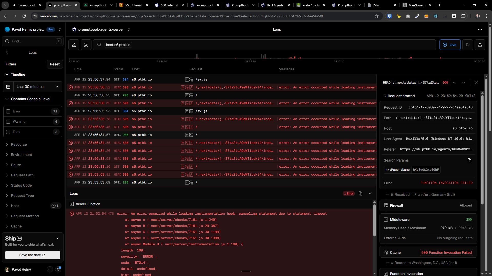
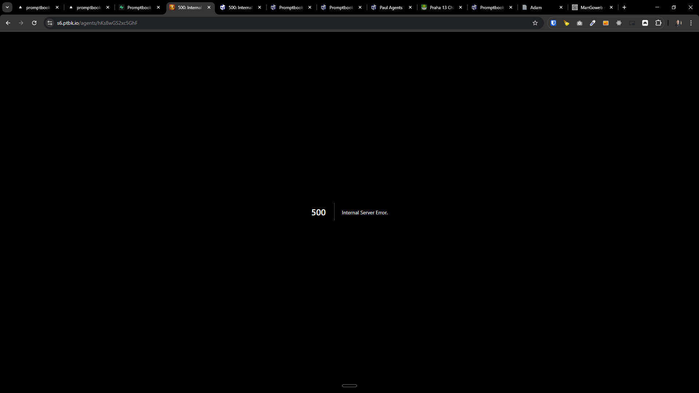
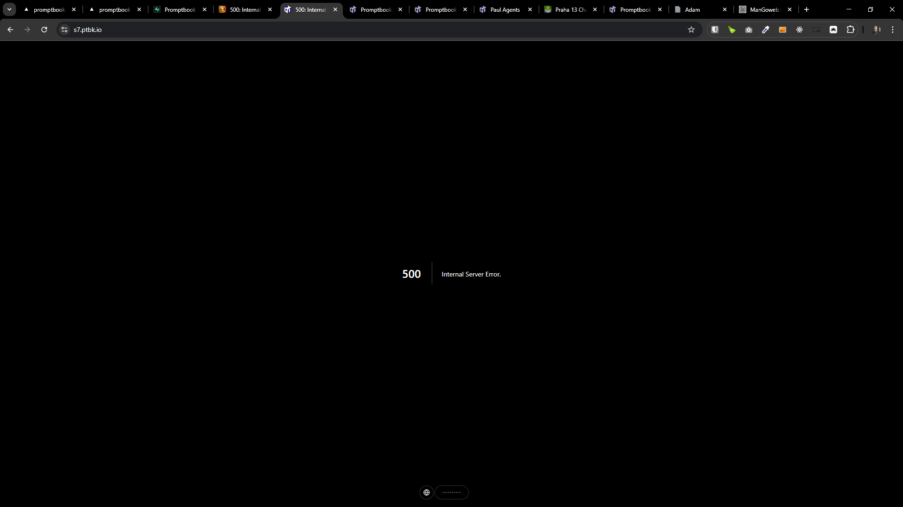
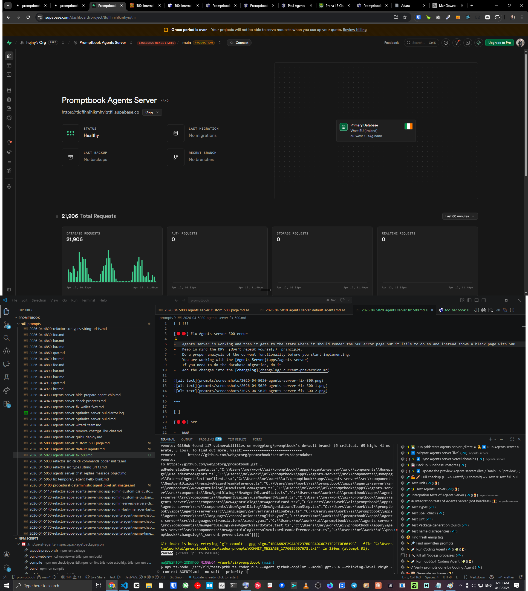
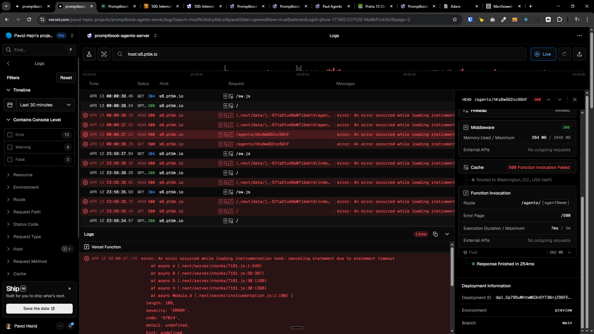

[ ] !!!

[🔴🔴] Fix Agents server 500 error

**Theese are some logs from Vercel:**

```
2026-04-12 21:52:54.478 [error] error: An error occurred while loading instrumentation hook: canceling statement due to statement timeout
    at async e (.next/server/chunks/7161.js:1:249)
    at async B (.next/server/chunks/7161.js:29:387)
    at async G (.next/server/chunks/7161.js:30:1199)
    at async H (.next/server/chunks/7161.js:30:1398)
    at async Module.d (.next/server/instrumentation.js:1:180) {
  length: 109,
  severity: 'ERROR',
  code: '57014',
  detail: undefined,
  hint: undefined,
  position: undefined,
  internalPosition: undefined,
  internalQuery: undefined,
  where: undefined,
  schema: undefined,
  table: undefined,
  column: undefined,
  dataType: undefined,
  constraint: undefined,
  file: 'postgres.c',
  line: '3405',
  routine: 'ProcessInterrupts'
}
```

```
GET

/agents/hKs8wGS2xc5GhF

500
Request started
Apr 13 00:00:36.38GMT+2

Search Params
nxtPagentName
hKs8wGS2xc5GhF
Received in Frankfurt, Germany (fra1)


Middleware

200


External APIs
GET

tlqflhnihlkmhyiqtfii.supabase.co/rest/v1/_Server
200

GET

tlqflhnihlkmhyiqtfii.supabase.co/rest/v1/server_S6_Metadata
200

Cache

500
Function Invocation Failed

Routed to Washington, D.C., USA (iad1)
Function Invocation


External APIs
No outgoing requests


Fluid

262 MB
Response finished in 773ms
Deployment Information
```

```
HEAD

/agents/hKs8wGS2xc5GhF

500
Request started
Apr 13 00:00:37.52GMT+2

Search Params
nxtPagentName
hKs8wGS2xc5GhF
Received in Frankfurt, Germany (fra1)


Middleware

200


External APIs
No outgoing requests

Cache

500
Function Invocation Failed

Routed to Washington, D.C., USA (iad1)
Function Invocation


External APIs
No outgoing requests


Fluid

262 MB
Response finished in 254ms
Deployment Information


```

-   Agents server is working and then it gets to the state where it should render the 500 error page but it fails to do so and instead shows a blank page with 500
-   It also corresponds to the spike of database requests
-   After the redeployment it works again, but then after a short time it gets to the same state where it should render the 500 error page and it does not recover
-   When it starts to failing it fails for all clients and indepedent browsers
-   Fix this and also make better logging and error handling so we can better understand what is going on when it happens again
-   This error started occuring recently, on `main` _(the current branch)_ it is failing, but on `preview` branch it is working, so you can compare the changes between those branches to find out what is causing this error, and fix it
-   Do a proper analysis of the current functionality before you start implementing.
-   You are working with the [Agents Server](apps/agents-server)
-   If you need to do the database migration, do it







---

[-]

[🔴🔴] brr

-   @@@
-   Keep in mind the DRY _(don't repeat yourself)_ principle.
-   Do a proper analysis of the current functionality before you start implementing.
-   You are working with the [Agents Server](apps/agents-server)
-   If you need to do the database migration, do it
-   Add the changes into the [changelog](changelog/_current-preversion.md)

---

[-]

[🔴🔴] brr

-   @@@
-   Keep in mind the DRY _(don't repeat yourself)_ principle.
-   Do a proper analysis of the current functionality before you start implementing.
-   You are working with the [Agents Server](apps/agents-server)
-   If you need to do the database migration, do it
-   Add the changes into the [changelog](changelog/_current-preversion.md)

---

[-]

[🔴🔴] brr

-   @@@
-   Keep in mind the DRY _(don't repeat yourself)_ principle.
-   Do a proper analysis of the current functionality before you start implementing.
-   You are working with the [Agents Server](apps/agents-server)
-   If you need to do the database migration, do it
-   Add the changes into the [changelog](changelog/_current-preversion.md)
