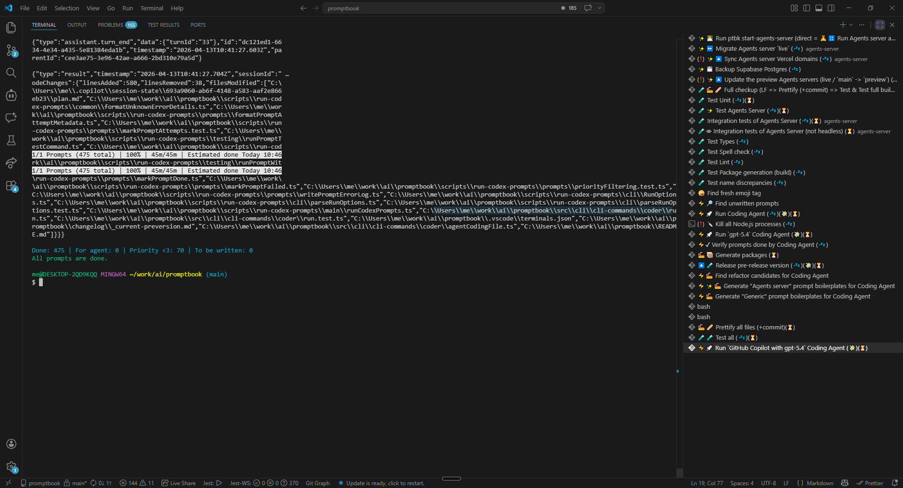

[x] Manually

[✨🌉] `ptbk coder run` should have terminal UI

```bash
ptbk coder run --agent github-copilot --model gpt-5.4 --thinking-level xhigh --context AGENTS.md
```

-   Now it just prints the output of the agent, but it should have a terminal UI using Ink and React
-   It sould work universally for all runners
-   There should be:
    -   Promptbook coder branding in the UI
    -   Which agent is currently running, which model, thinking level, context, priority, etc.
    -   The status (which is already printed) like `1/1 Prompts (475 total) | 100% | 45m/45m | Estimated done Today 10:46`
    -   The loadingbar
    -   The current thinking message of the agent, which is printed in real time as the agent thinks, and it should be updated in real time in the UI
    -   Pause feature
    -   Retryies and errors should be also printed in real time in the UI
-   Do not change behaviour of other commands of `ptbk coder` or `ptbk` in general, just add the terminal UI for `ptbk coder run`
-   Keep in mind the DRY _(don't repeat yourself)_ principle.
-   Do a proper analysis of the current functionality of `ptbk coder` and related functionality before you start implementing.
-   You are working with [`ptbk coder`](src/cli/cli-commands/coder/run.ts)
-   Add the changes into the [changelog](./changelog/_current-preversion.md)



---

[-]

[✨🌉] baz

```bash
@@@

npm install ptbk

ptbk coder init

ptbk coder run --agent github-copilot --model gpt-5.4 --thinking-level xhigh --context AGENTS.md
```

-   @@@
-   Keep in mind the DRY _(don't repeat yourself)_ principle.
-   Do a proper analysis of the current functionality of `ptbk coder` and related functionality before you start implementing.
-   You are working with [`ptbk coder`](src/cli/cli-commands/coder/run.ts)
-   Add the changes into the [changelog](./changelog/_current-preversion.md)

---

[-]

[✨🌉] baz

```bash
@@@

npm install ptbk

ptbk coder init

ptbk coder run --agent github-copilot --model gpt-5.4 --thinking-level xhigh --context AGENTS.md
```

-   @@@
-   Keep in mind the DRY _(don't repeat yourself)_ principle.
-   Do a proper analysis of the current functionality of `ptbk coder` and related functionality before you start implementing.
-   You are working with [`ptbk coder`](src/cli/cli-commands/coder/run.ts)
-   Add the changes into the [changelog](./changelog/_current-preversion.md)

---

[-]

[✨🌉] baz

```bash
@@@

npm install ptbk

ptbk coder init

ptbk coder run --agent github-copilot --model gpt-5.4 --thinking-level xhigh --context AGENTS.md
```

-   @@@
-   Keep in mind the DRY _(don't repeat yourself)_ principle.
-   Do a proper analysis of the current functionality of `ptbk coder` and related functionality before you start implementing.
-   You are working with [`ptbk coder`](src/cli/cli-commands/coder/run.ts)
-   Add the changes into the [changelog](./changelog/_current-preversion.md)
