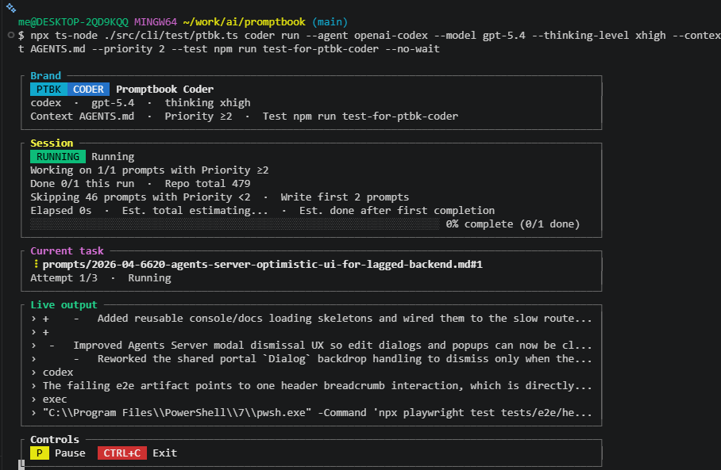
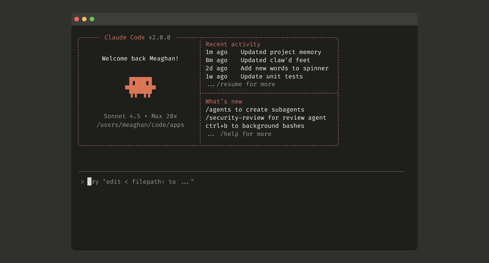

[ ] !!

[✨👾] Make better brainding of `ptbk coder run`

```bash
me@DESKTOP-2QD9KQQ MINGW64 ~/work/ai/promptbook (main)
$ ptbk coder run --agent github-copilot --model gpt-5.4 --thinking-level xhigh --context AGENTS.md --test npm run test-for-ptbk-coder --no-wait --priority 1 && npm version prerelease

┌ Brand ───────────────────────────────────────────────────────────────────────────────────────┐
│  PTBK  CODER  Promptbook Coder                                                               │
│ github-copilot  ·  gpt-5.4  ·  thinking xhigh                                                │
│ Context AGENTS.md  ·  Priority ≥1  ·  Test npm run test-for-ptbk-coder                       │
└──────────────────────────────────────────────────────────────────────────────────────────────┘
┌ Session ─────────────────────────────────────────────────────────────────────────────────────┐
│  RUNNING  Running                                                                            │
│ Working on 1/6 prompts with Priority ≥1                                                      │
│ Done 0/6 this run  ·  Repo total 488                                                         │
│ Skipping 44 prompts with Priority <1  ·  Write first 7 prompts                               │
│ Elapsed 0s  ·  Est. total estimating...  ·  Est. done after first completion                 │
│ ░░░░░░░░░░░░░░░░░░░░░░░░░░░░░░░░░░░░░░░░░░░░░░░░░░░░░░░░░░░░░░░░░░░ 0% complete (0/6 done)   │
└──────────────────────────────────────────────────────────────────────────────────────────────┘
┌ Current task ────────────────────────────────────────────────────────────────────────────────┐
│ ⠹ prompts/2026-04-4830-fix-packages-type-definitions.md#1                                    │
│ Attempt 1/3  ·  Running                                                                      │
└──────────────────────────────────────────────────────────────────────────────────────────────┘
┌ Live output ─────────────────────────────────────────────────────────────────────────────────┐
│ › {"type":"tool.execution_complete","data":{"toolCallId":"call_rkpaSQLCq3OBlfMP3Nnc3zcw",... │
│ › {"type":"tool.execution_complete","data":{"toolCallId":"call_hcGs6UzLhjzQBjOD1Om7nmOM",... │
│ › {"type":"tool.execution_complete","data":{"toolCallId":"call_LM1ducQDX519yYjkUCr7oJ3n",... │
│ › :6:        \"test-build\": \"npm run build\",\nC:\\Users\\me\\work\\ai\\promptbook\\app... │
│ › ages/documents.index.d.ts\",\nC:\\Users\\me\\work\\ai\\promptbook\\packages\\ptbk\\pack... │
│ › {"type":"tool.execution_complete","data":{"toolCallId":"call_XjdJTDKI5xfIKDNNgRWJHueJ",... │
│ › {"type":"assistant.turn_end","data":{"turnId":"0"},"id":"35fe7c4c-75c5-4757-8396-31bce5... │
│ › {"type":"assistant.turn_start","data":{"turnId":"1","interactionId":"f418fcb2-f41b-45fb... │
└──────────────────────────────────────────────────────────────────────────────────────────────┘
┌ Controls ────────────────────────────────────────────────────────────────────────────────────┐
│  P  Pause   CTRL+C  Exit                                                                     │
└──────────────────────────────────────────────────────────────────────────────────────────────┘
```

-   "Brand" should not be in the box but should be some colorfull visualisation of working octopus with tenticles and text "ptbk.io"
-   Move information from "Brand" to "Session"
-   "Session" section should be structured better
-   Keep in mind the DRY _(don't repeat yourself)_ principle.
-   Do a proper analysis of the current functionality of `ptbk coder` and related functionality before you start implementing.
-   You are working with [`ptbk coder`](src/cli/cli-commands/coder/run.ts)
-   Add the changes into the [changelog](./changelog/_current-preversion.md)





---

[-]

[✨👾] brr

```bash
@@@

npm install ptbk

ptbk coder init

ptbk coder run --agent github-copilot --model gpt-5.4 --thinking-level xhigh --context AGENTS.md
```

-   @@@
-   Keep in mind the DRY _(don't repeat yourself)_ principle.
-   Do a proper analysis of the current functionality of `ptbk coder` and related functionality before you start implementing.
-   You are working with [`ptbk coder`](src/cli/cli-commands/coder/run.ts)
-   Add the changes into the [changelog](./changelog/_current-preversion.md)

---

[-]

[✨👾] brr

```bash
@@@

npm install ptbk

ptbk coder init

ptbk coder run --agent github-copilot --model gpt-5.4 --thinking-level xhigh --context AGENTS.md
```

-   @@@
-   Keep in mind the DRY _(don't repeat yourself)_ principle.
-   Do a proper analysis of the current functionality of `ptbk coder` and related functionality before you start implementing.
-   You are working with [`ptbk coder`](src/cli/cli-commands/coder/run.ts)
-   Add the changes into the [changelog](./changelog/_current-preversion.md)

---

[-]

[✨👾] brr

```bash
@@@

npm install ptbk

ptbk coder init

ptbk coder run --agent github-copilot --model gpt-5.4 --thinking-level xhigh --context AGENTS.md
```

-   @@@
-   Keep in mind the DRY _(don't repeat yourself)_ principle.
-   Do a proper analysis of the current functionality of `ptbk coder` and related functionality before you start implementing.
-   You are working with [`ptbk coder`](src/cli/cli-commands/coder/run.ts)
-   Add the changes into the [changelog](./changelog/_current-preversion.md)
