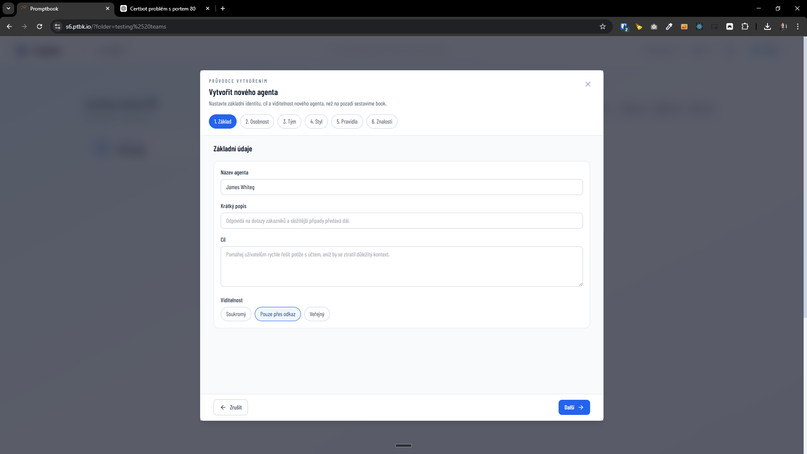
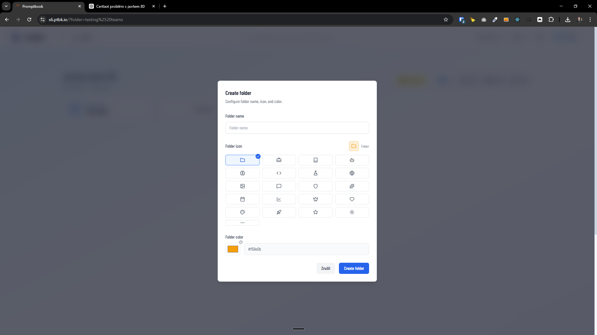

[x] ~$0.00 19 minutes by GitHub Copilot `gpt-5.4`

[✨🔡] Do not allow to close modals and popups with some input fields and editing so easily

-   In the Agents server, there are multiple modals and popups that allow users to edit some content, for example, the agent creation wizard, creating a folder,... which can be accidentally closed by clicking outside of the modal
-   This is in some times prevented by a confirmation popup, but in some cases, there is no confirmation and the progress can be lost by accidentally clicking outside of the modal. This can lead to a bad user experience, especially when users are filling out multiple fields and doing some work in the modal, only to lose it by accidentally clicking outside.
-   Keep in mind the DRY _(don't repeat yourself)_ principle.
-   Do a proper analysis of the current functionality before you start implementing.
-   You are working with the [Agents Server](apps/agents-server)

---

[ ] !!

[✨🔡] Allow to close modals and popups by clicking outside

-   In the Agents server, there are multiple modals and popups that allow users to edit some content, for example, the agent creation wizard, creating a folder,...
-   Allow to close them by clicking outside of the modal, this is a common UX pattern and can be useful for users to quickly close the modal without having to click on the close button, especially when they want to cancel the action they were performing in the modal. It can also improve the overall user experience by making it more intuitive and faster to navigate through the application.
-   If there are some unsaved changes in the modal, show a same confirmation popup as it is now when clicking on the close button, to prevent losing the progress by accident, but if there are no changes or the user confirms that they want to close the modal, allow to close it by clicking outside.
-   It must be intentional click outside of the modal, so it should not be triggered by for example just selecting text in the modal and move cursor outside of the modal and do pointerup there, it should be triggered by a clear click action outside of the modal, for example, by checking that the pointerdown and pointerup events both happen outside of the modal and that there is not much movement between them, to distinguish it from just interacting with the content inside the modal.
-   This is in some times prevented by a confirmation popup, but in some cases, there is no confirmation and the progress can be lost by accidentally clicking outside of the modal. This can lead to a bad user experience, especially when users are filling out multiple fields and doing some work in the modal, only to lose it by accidentally clicking outside.
-   Keep in mind the DRY _(don't repeat yourself)_ principle.
-   Do a proper analysis of the current functionality before you start implementing.
-   You are working with the [Agents Server](apps/agents-server)

---

[-]

[✨🔡] bar

-   @@@
-   Keep in mind the DRY _(don't repeat yourself)_ principle.
-   Do a proper analysis of the current functionality before you start implementing.
-   You are working with the [Agents Server](apps/agents-server)
-   If you need to do the database migration, do it
-   Add the changes into the [changelog](changelog/_current-preversion.md)

---

[-]

[✨🔡] bar

-   @@@
-   Keep in mind the DRY _(don't repeat yourself)_ principle.
-   Do a proper analysis of the current functionality before you start implementing.
-   You are working with the [Agents Server](apps/agents-server)
-   If you need to do the database migration, do it
-   Add the changes into the [changelog](changelog/_current-preversion.md)
