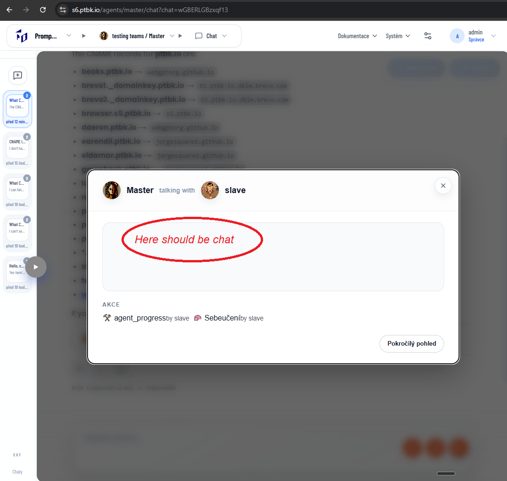

[ ]

[✨🔢] Fix asking a teammate

-   @@@@ probbably working
-   There is a commitment `TEAM` which can speficy a teammates to ask for help
-   But currently it fails
-   Both agents {Master} and {Slave} exists
-   Keep in mind the DRY _(don't repeat yourself)_ principle.
-   Do a deep analysis of the current functionality before you start implementing.
-   When teammate was called, in the popup there must be a mocked chat with this internal conversation
-   You are working with the [Agents Server](apps/agents-server)

**The agent source**

```book
Master

FROM {Void}
TEAM Ask for anything {Slave}
CLOSED
```


