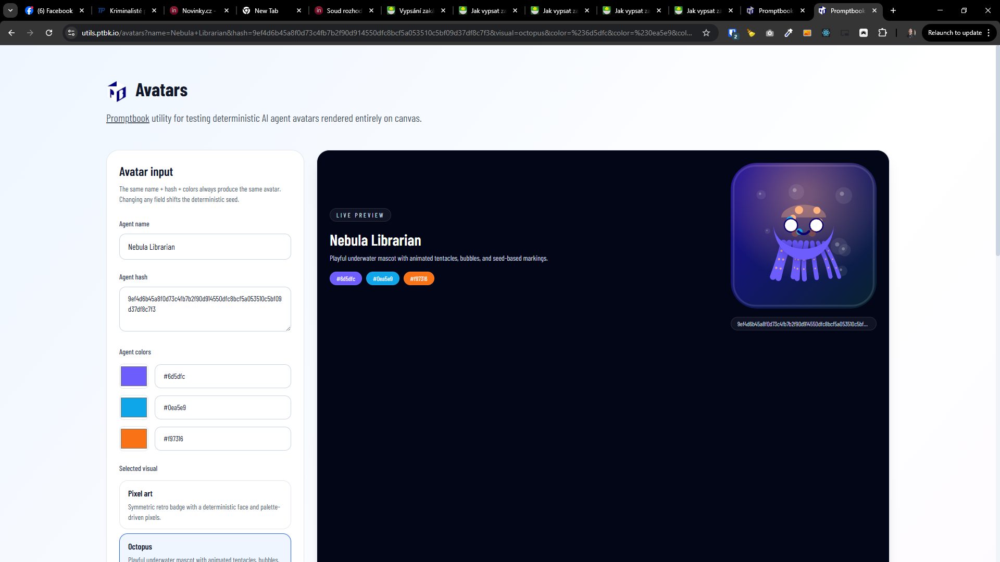
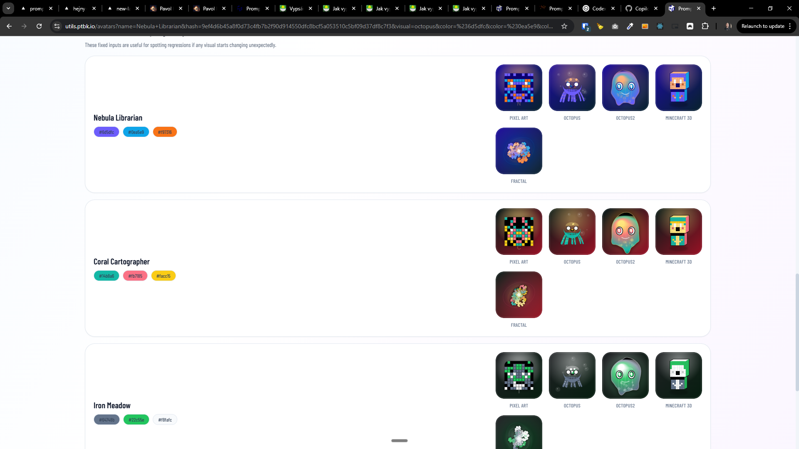
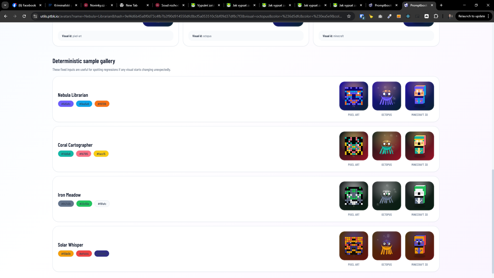

[x] ~$0.00 40 minutes by GitHub Copilot `gpt-5.4`

[✨👝] Create avatars page

-   The avatar should be a visual representation of the AI agent, it should be generated based on the colors of the agent, name of the agent, and hash.
-   Make some system to have more avatar visuals, not just the default one
-   Theese visuals can be either 2D or 3D but all based on canvas
-   The `AvatarVisual` should recieve the agent name, hash and colors as input (in some standard object) and generate a unique avatar for each agent based on that input into the given canvas
-   The avatar should be generated in a deterministic way, so that the same input will always generate the same avatar, and different input will generate different avatars
-   The avatar can be animated or static, but it should be visually appealing and unique for each agent
-   For now, implement 3 different avatar visuals:
    -   A pixel-art avatar
    -   A Octopus avatar
    -   A Minecraft-style avatar in 3D
-   Theese should be implemented in a way that allows us to easily add more avatar visuals in the future, and also to allow users to choose which visual they want to use for their agent
-   Keep in mind the DRY _(don't repeat yourself)_ principle.
-   Do a proper analysis of the current functionality before you start implementing.
-   You are working with the [Utils miniapp](apps/utils) and adding this as a new page there to test it
-   The system for avatars should be in [its folder](src/avatars) the types, implementation of visuals, and the main `Avatar` component that will be used in the app should be there
-   Add the changes into the [changelog](changelog/_current-preversion.md)

---

[x] ~$0.00 an hour by GitHub Copilot `gpt-5.4`

[✨👝] `avatars` page in utils app should persist data in URL get search parameters

-   The avatar page should persist the selected avatar visual and the input parameters (agent name, hash, colors) in the URL search parameters, so that when the page is refreshed or shared, the same avatar will be generated based on the URL parameters
-   Keep in mind the DRY _(don't repeat yourself)_ principle.
-   Do a proper analysis of the current functionality before you start implementing.
-   You are working with the [Utils miniapp](apps/utils) and adding this as a new page there to test it

---

[x] ~$0.00 21 minutes by GitHub Copilot `gpt-5.4`

[✨👝] Add "Octopus2" avatar

-   "Octopus2" will exists alongside the existing "Octopus" avatar, but it will have a different visual style
-   Difference is that it shouldnt be multiple independent meshes but one continuous morphing mesh that changes its shape based on the input parameters (agent name, hash, colors) It should be blobby, organic, alien-looking avatar that morphs and changes its shape in a smooth and visually appealing way based on the input parameters, while still maintaining a recognizable octopus-like form
-   Add it alongside the existing ones, do not replace or change the existing avatar visuals, just add this new one
-   Do not create extra page for this avatar, just add it to the existing `/avatars` utils page
-   Keep in mind the DRY _(don't repeat yourself)_ principle.
-   Do a proper analysis of the current functionality before you start implementing.
-   You are working with the [Utils miniapp](apps/utils) and adding this as a new page there to test it

---

[x] $2.61 an hour by OpenAI Codex `gpt-5.4`

[✨👝] Add "Octopus3" avatar

-   "Octopus3" will exists alongside the existing "Octopus" and "Octopus2" avatar and other avatars, but it will have a different visual style
-   Difference from "Octopus2" is that it should have more visible tentacles
-   Both blobbyness, tenticles and number of tenticles, physiognomy, colors,... should be dynamic and based on the input parameters (agent name, hash, colors) It should be blobby, organic, alien-looking avatar that morphs and changes its shape in a smooth and visually appealing way based on the input parameters, while still maintaining a recognizable octopus-like form
-   Add it alongside the existing ones, do not replace or change the existing avatar visuals, just add this new one
-   Do not create extra page for this avatar, just add it to the existing `/avatars` utils page
-   Keep in mind the DRY _(don't repeat yourself)_ principle.
-   Do a proper analysis of the current functionality before you start implementing.
-   You are working with the [Utils miniapp](apps/utils) and adding this as a new page there to test it

---

[ ] !

[✨👝] Add "AsciiOctopus" avatar

-   "AsciiOctopus" will exists alongside the existing "Octopus", "Octopus2", "Octopus3" and other avatars, but it will have a different visual style
-   Difference from "Octopus3" (which should be the reference point) is that it should have ASCII art style
-   Both blobbyness, tenticles and number of tenticles, physiognomy, colors,... should be dynamic and based on the input parameters (agent name, hash, colors) It should be blobby, organic, alien-looking avatar that morphs and changes its shape in a smooth and visually appealing way based on the input parameters, while still maintaining a recognizable octopus-like form
-   Add it alongside the existing ones, do not replace or change the existing avatar visuals, just add this new one
-   Do not create extra page for this avatar, just add it to the existing `/avatars` utils page
-   Keep in mind the DRY _(don't repeat yourself)_ principle.
-   Do a proper analysis of the current functionality before you start implementing.
-   You are working with the [Utils miniapp](apps/utils) and adding this as a new page there to test it

---

[x] ~$0.00 34 minutes by GitHub Copilot `gpt-5.4`

[✨👝] Add "fractal" avatar

-   `avatars` page in utils app have misc avatar visuals, add new one called "fractal" that generates a fractal-like avatar based on the input parameters (agent name, hash, colors)
-   The fractal should be based on the dragon curve fractal, and it should generate a unique and visually appealing avatar for each agent based on the input parameters
-   Vary shapes and colors of the fractal based on the input parameters to create a wide variety of unique avatars
-   Add it alongside the existing ones, do not replace or change the existing avatar visuals, just add this new one
-   Do not create extra page for this avatar, just add it to the existing `/avatars` utils page
-   Keep in mind the DRY _(don't repeat yourself)_ principle.
-   Do a proper analysis of the current functionality before you start implementing.
-   You are working with the [Utils miniapp](apps/utils) and adding this as a new page there to test it

---

[ ] !

[✨👝] Octopus avatar

-   @@@
-   Keep in mind the DRY _(don't repeat yourself)_ principle.
-   Do a proper analysis of the current functionality before you start implementing.
-   You are working with the [Utils miniapp](apps/utils) and adding this as a new page there to test it

---

[-]

[✨👝] foo

-   @@@
-   Keep in mind the DRY _(don't repeat yourself)_ principle.
-   Do a proper analysis of the current functionality before you start implementing.
-   You are working with the [Utils miniapp](apps/utils) and adding this as a new page there to test it

---

[-]

[✨👝] foo

-   @@@
-   Keep in mind the DRY _(don't repeat yourself)_ principle.
-   Do a proper analysis of the current functionality before you start implementing.
-   You are working with the [Utils miniapp](apps/utils) and adding this as a new page there to test it

