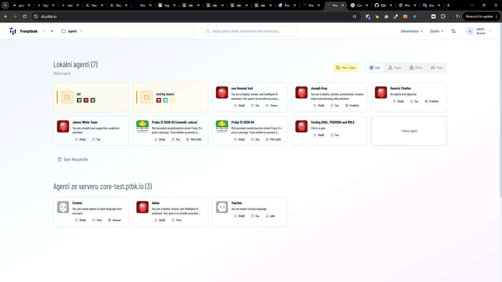
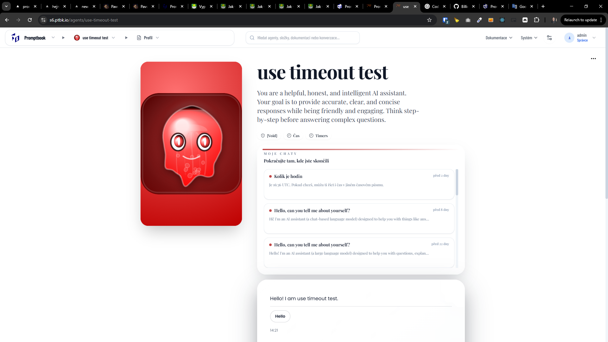
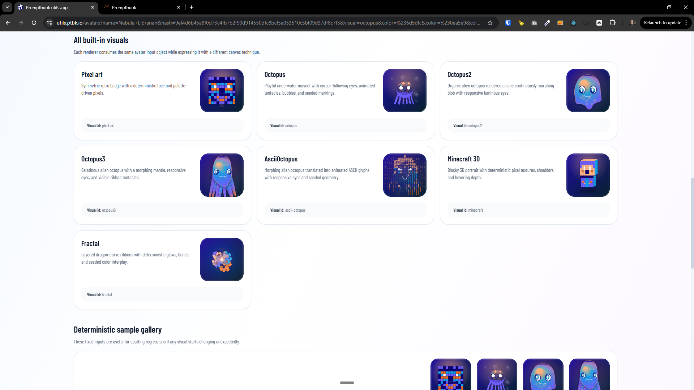

[x] (2 attempts) ~$0.2661 2 hours by OpenAI Codex `gpt-5.4`

[✨👝] Use the "Octopus2" as default agent avatars

-   Instead of AI generated images as default avatars for agents, use the "Octopus2" avatar visual as the default avatar for agents
-   Leverage that the avatars are animated and visually appealing to make the UI more fun and engaging, instead of static images
-   Be aware that this image is used in multiple places across the app, for example in the agent list, in the chat messages of the agents, in the agent profile, in OG and app icons, favicon,... so make sure to change it everywhere and make sure it works well in all those contexts
-   Keep in mind the DRY _(don't repeat yourself)_ principle.
-   Do a proper analysis of the current functionality before you start implementing.
-   The avatar is located in `src/avatars/visuals/octopus2AvatarVisual.ts`
-   The "Octopus2" avatar is used for example in [Utils miniapp](apps/utils)
-   You are working with the [Agents Server](apps/agents-server) with the default avatars of the agents
-   If you need to do the database migration, do it
-   When the agent has set `META IMAGE` use it instead of the default avatar, but if `META IMAGE` is not set, use the "Octopus2" avatar as the default one
-   Respect `META COLOR` with one or multiple colors as input for the avatar visual
-   Implement it in a way that it can be easily extended and changed to different avatar visuals in the future
-   Do not delete the feature of generating images, just change the default avatar to the avatar visuals
-   Add the changes into the [changelog](changelog/_current-preversion.md)

---

[ ] !!

[✨👝] Unique avatar visuals

-   @@@@ Maybe not needed
-   The octopuses avatar visuals should be based on the agent profile and should be unique for each agent, so that its easier to distinguish different agents in the UI and to make it more fun and engaging, instead of having multiple agents with the same avatar visual
-   The octopus color(s) should respect the `META COLOR` (either one or multiple colors) of the agent, and the shape, blobbyness, number of tentacles,... should be based on the agent name and hash, so that we can have a variety of different avatar visuals for different agents, while still maintaining a recognizable octopus-like form
-   Implement it in a way that it can be easily extended and changed to different avatar visuals in the future
-   You are working with the [Agents Server](apps/agents-server) with the default avatars of the agents
-   Keep in mind the DRY _(don't repeat yourself)_ principle.

---

[x] $1.98 2 hours by OpenAI Codex `gpt-5.4`

[✨👝] Avatar visual should look better on profile page of the agent

-   Use "Octopus3" avatar visual instead of "Octopus2" for the agents
-   The octopuses avatar visuals are in the square box inside a card, but they should be only in the card without secondary square box, and they should be bigger and more visible, so that it looks better and more visually appealing on the profile page of the agent
-   Also the background should be only from the vertical card not from the square box
-   Implement it in a way that it can be easily extended and changed to different avatar visuals in the future
-   You are working with the [Agents Server](apps/agents-server) with the default avatars of the agents
-   Keep in mind the DRY _(don't repeat yourself)_ principle.

---

[ ] !!

[✨👝] Animation loop

-   @@@@ Maybe not needed
-   The avatar visuals should infinitely morph and change their shape in a smooth and visually appealing way
-   Now there is a ugly jump in the animation when the avatar reaches the end of the animation loop and starts again from the beginning, but it should be a smooth infinite loop without any jumps or glitches, so that it looks more visually appealing and polished
-   Implement it in a way that it can be easily extended and changed to different avatar visuals in the future
-   You are working with the [Agents Server](apps/agents-server) with the default avatars of the agents
-   Keep in mind the DRY _(don't repeat yourself)_ principle.

---

[ ] !!!

[✨👝] Allow to set default agent avatar visual throught metadata

-   There are multiple avatar visuals but only used is "Octopus3", but it should be possible to set the default avatar visual for the agents without `META IMAGE` globally for the entire agents server through metadata
-   The default option should be `OCTOPUS3`
-   Implement it in a way that it can be easily extended add more avatar visuals in the future
-   You are working with the [Agents Server](apps/agents-server) with the default avatars of the agents
-   Keep in mind the DRY _(don't repeat yourself)_ principle.

