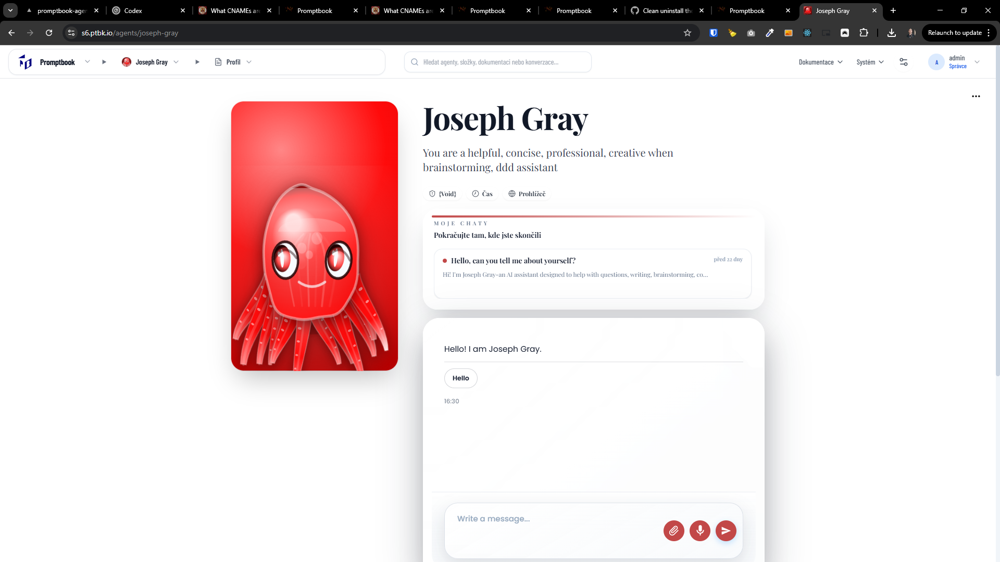
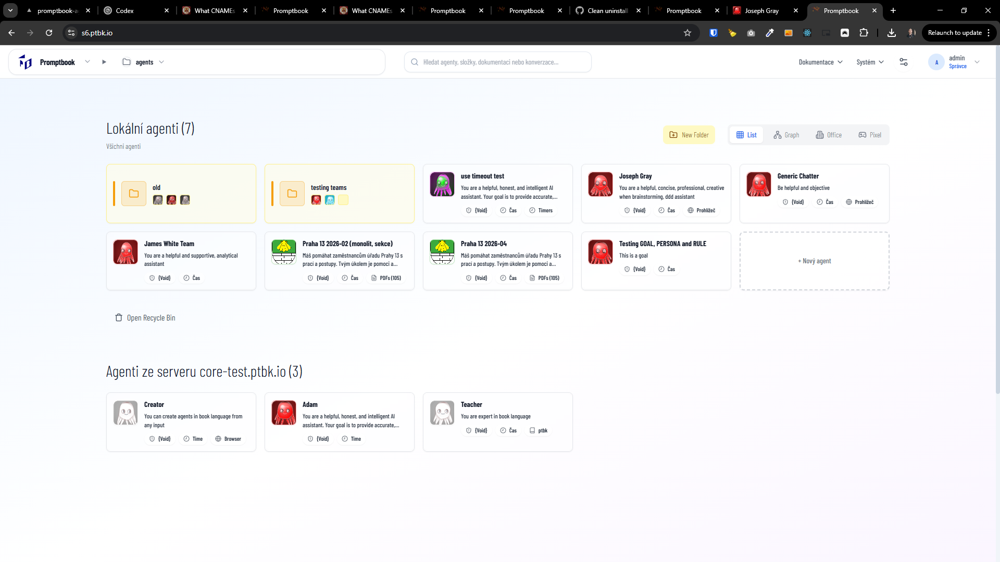

[ ] !!

[✨👝] Center the avatar visual in the agent profile page

-   The avatar visual in the agent profile page is currently at the bottom of the page, it should be centered
-   The octopus avatar visuals are too large and not looking very good in the profile page (looking good as thumbnail), they should be smaller and centered
-   Implement it in a way that its agnostic to the avatar visual and it can work with different types of avatar visuals, not just the octopus ones
-   You are working with the [Agents Server](apps/agents-server) with the default avatars of the agents

---

[ ] !!

[✨👝] Optimize the avatar visual performance

-   The avatar visuals are currently using a lot of CPU and GPU resources, especially the octopus avatars, we should optimize them to be more performant and not cause lag or high resource usage
-   Preserve all the features and visual quality of the avatars, but optimize the implementation
-   Implement it in a way that its agnostic to the avatar visual and it can work with different types of avatar visuals, not just the octopus ones
-   You are working with the [Agents Server](apps/agents-server) with the default avatars of the agents

