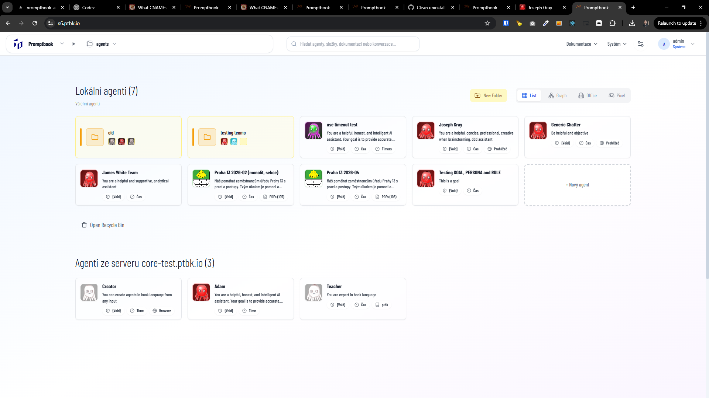

[x] $3.54 an hour by OpenAI Codex `gpt-5.4`

[✨👝] Create a Octopus office maze

-   On the homepage of the agents server create a tab "Maze" alongside "List", "Graph", "Office" and "Pixel"
-   There should be a maze office representing the workplace for AI agents / octopuses, with multiple rooms and corridors, and in each room there should be an octopus avatar representing an AI agent, the octopus should be doing some simple animation like moving its tentacles representing the capabilities and activity of the agent
-   The octopuses shouldnt have square background but they should be integrated into the maze environment, so it looks like they are actually in the maze and not just floating on top of it with a square background
-   The visuals of the maze should be engaging and visually appealing, with attention to detail in the design and animation of the octopuses
-   Its between visualisation and game (maybe bit more visualization), it should be fun and visually appealing, but also it should represent the concept of AI agents working together in a shared environment
-   The environment should be dynamic and lively, with some subtle animations and interactions, like octopuses moving around, interacting with each other, maybe some visual effects representing the communication and collaboration between agents
-   It should be isometric view, so it looks like a 3D environment but it is actually 2D, with a fixed perspective, so it is easier to implement and it can look good without needing complex 3D graphics
-   The octopuses (the default agents without `META IMAGE`) should naturally fit into the maze environment, so it looks like they are part of the maze, the agent with extarnal avatar should be ommited from this visialisation, because it can look weird and not fit into the maze environment, so for the purpose of this visualization we will focus on the default octopus avatars which can be easily integrated into the maze design
-   You are working with the [Agents Server](apps/agents-server) with the default avatars of the agents
-   Implement it in a way that its agnostic to the avatar visual and it can work with different types of avatar visuals, not just the octopus ones
-   Keep in mind the performance, it should not cause lag or high resource usage, so optimize the implementation and visuals to be performant
-   Keep in mind both desktop and mobile experience, it should be responsive and look good on different screen sizes and devices
-   Keep in mind both light and dark mode, it should look good in both modes and adapt to the theme of the app

