[x] ~$2.22 2 hours by OpenAI Codex `gpt-5.4`

[✨🌘] Add dark mode to agents server

-   There should be both dark and light mode
-   User can pick between system / dark / light mode using a toggle in the control panel, save this information in same place as other user preferences
-   By default, the app should follow the system theme
-   Keep in mind the DRY _(don't repeat yourself)_ principle.
-   Do a proper analysis of the current functionality before you start implementing, go through all the pages of the agents server and identify all the components that need to be
    updated to support dark mode, and make sure to implement dark mode in a consistent way across all of them.
    -   Be aware that you need to do a dark mode for entire app and for all the components, for the components used from `src` pass the `theme` prop to the components, for example `<Chat theme="DARK" ... />`
    -   Be also aware that the you need consider app logo
    -   The app should look premium and well designed in both dark and light modes, so make sure to pay attention to the design details and make sure that the colors, contrast, and overall look and feel of the app is good in both modes.
-   You are working with the [Agents Server](apps/agents-server)
-   Add the changes into the [changelog](changelog/_current-preversion.md)

---

[x] ~$0.8738 an hour by OpenAI Codex `gpt-5.4`

[✨🌘] Finish the dark mode

-   In dark mode there are some ungly and unfinished places, look at the screenshots and enhance it and fix it
-   Keep in mind the DRY _(don't repeat yourself)_ principle.
-   Do a proper analysis of the current functionality before you start implementing
-   You are working with the [Agents Server](apps/agents-server)

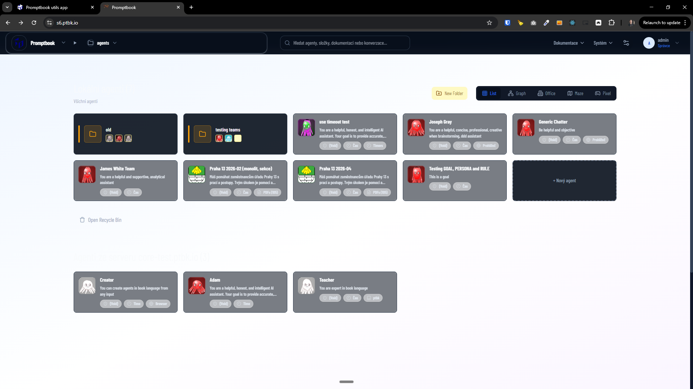
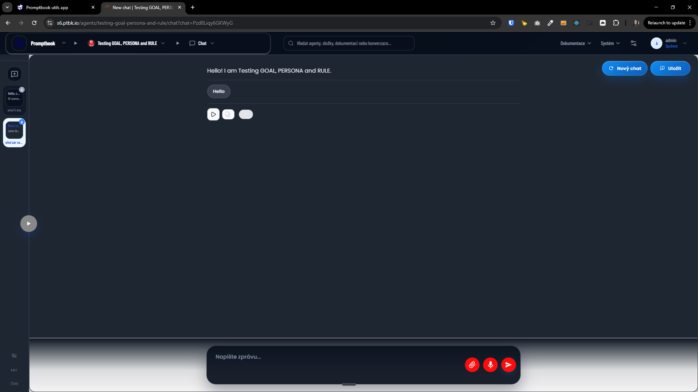
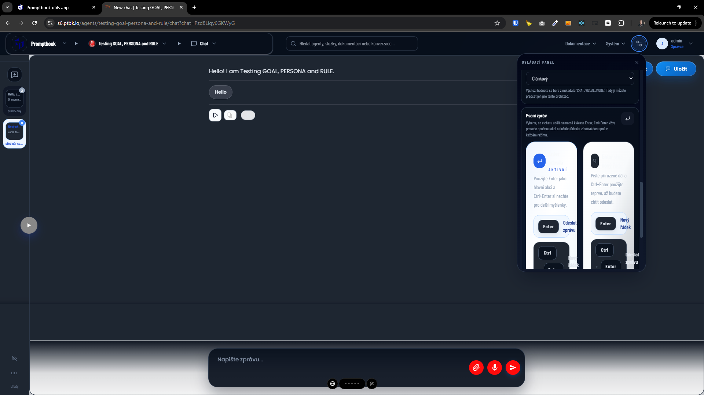
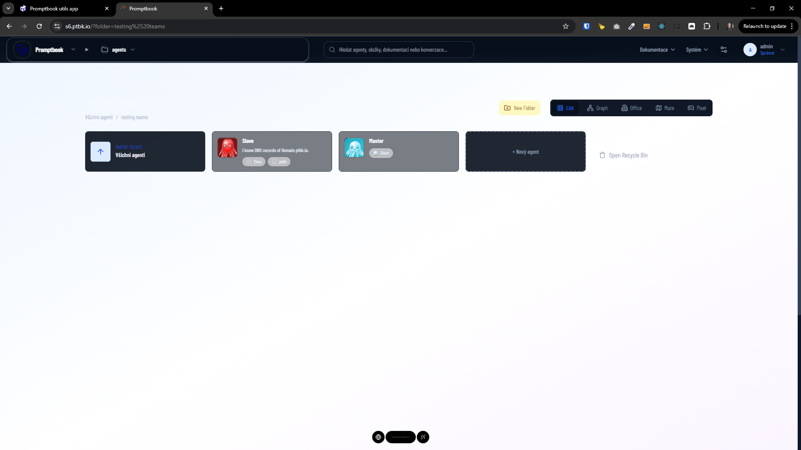
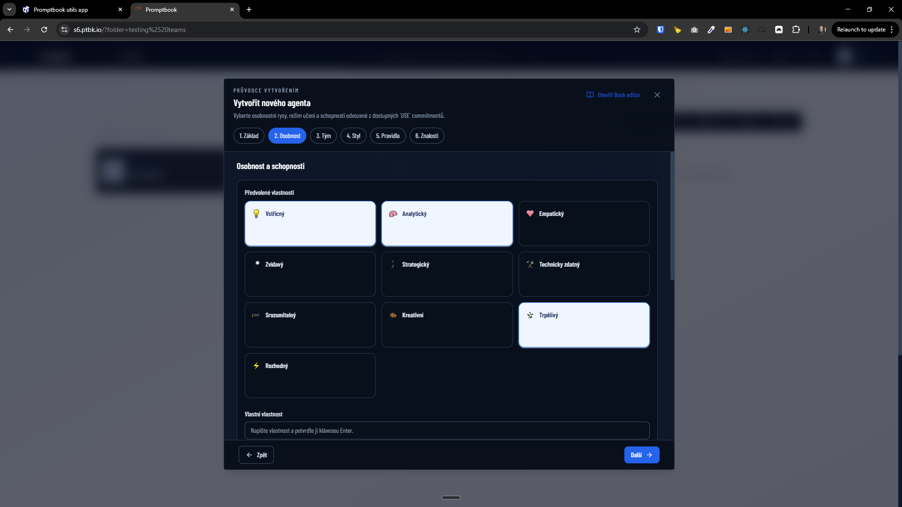
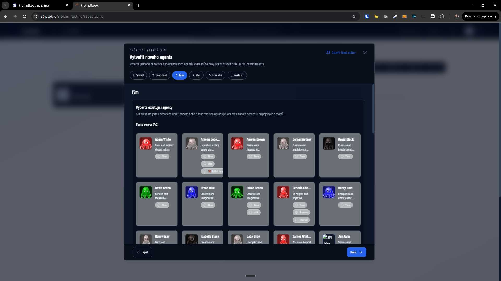
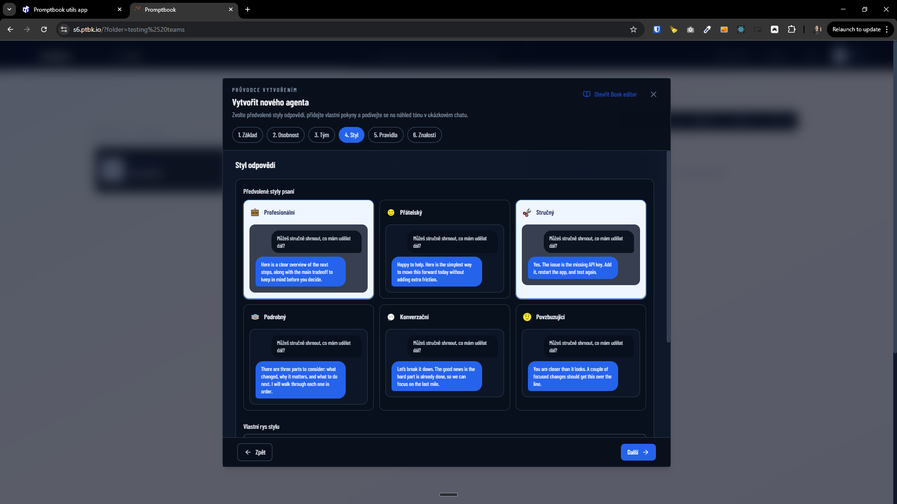
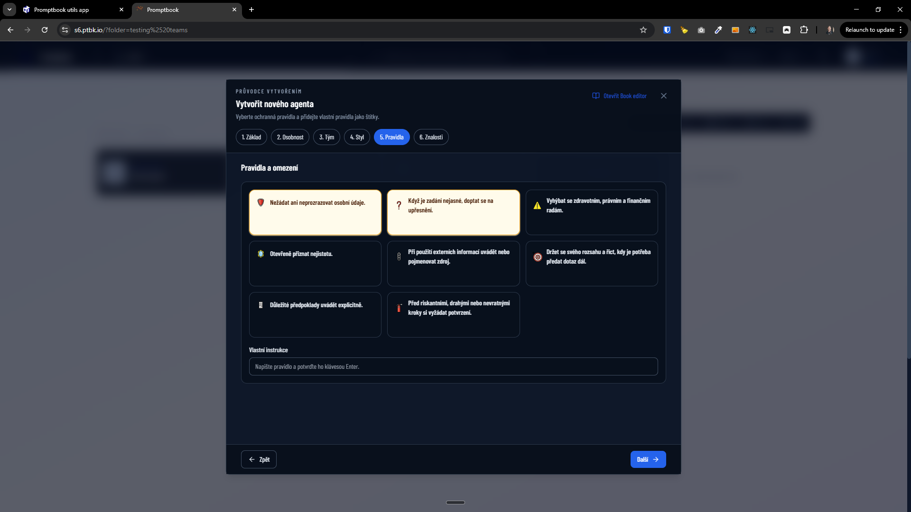
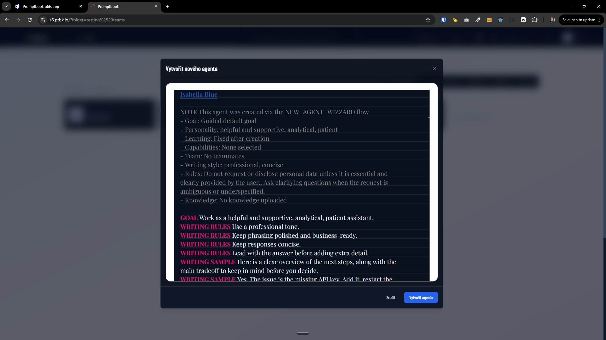

---

[x] $2.61 an hour by OpenAI Codex `gpt-5.4`

[✨🌘] Simplify and enhance UI and UX of control panel

-   Control panel has theese parts:
    1. Overview <- This is redundant, it just sumarize information from (2) and (3), remove it
    2. The square tiles with icons <- This is how the control panel should look like
    3. Rest of the tiles (from "Private mode" and bellow) <- This should be remade as (2) square tiles
-   Keep in mind the DRY _(don't repeat yourself)_ principle.
-   Do a proper analysis of the current functionality before you start implementing
-   You are working with the [Agents Server](apps/agents-server)

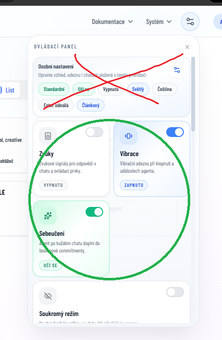
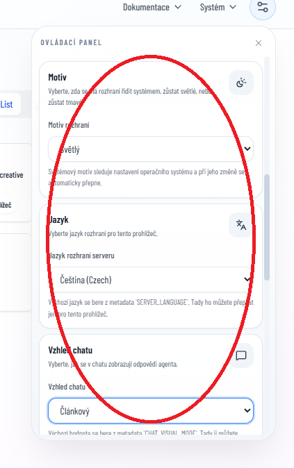

---

[!] (failed after 2 attempts) 41 minutes by OpenAI Codex `gpt-5.5` but seems working

[✨🌘] Finish the dark mode on chat page

-   In dark mode there are some ugly and unfinished places, look at the agent chat page and enhance it and fix it
-   Keep in mind the DRY _(don't repeat yourself)_ principle.
-   Do a proper analysis of the current functionality before you start implementing
-   You are working with the [Agents Server](apps/agents-server)

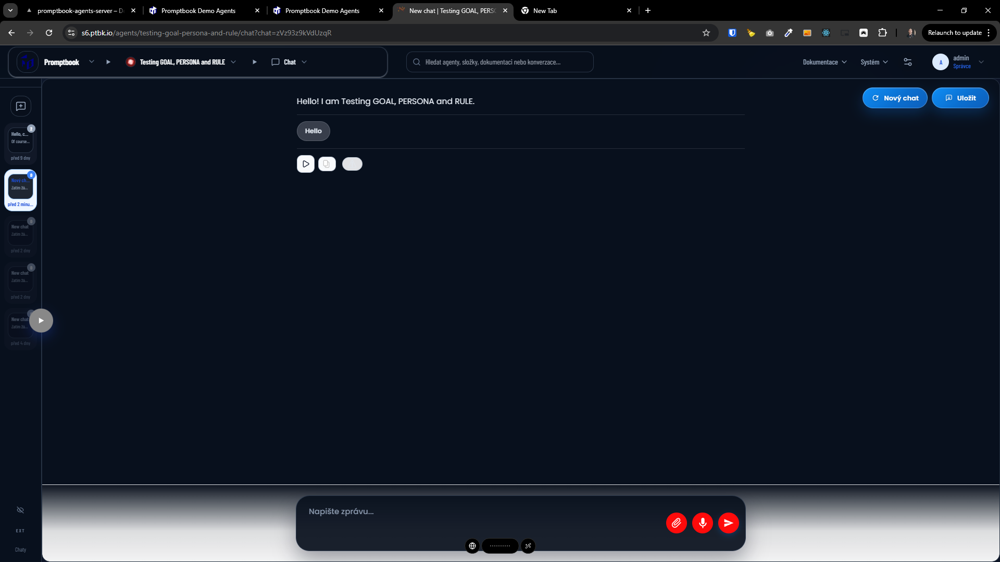
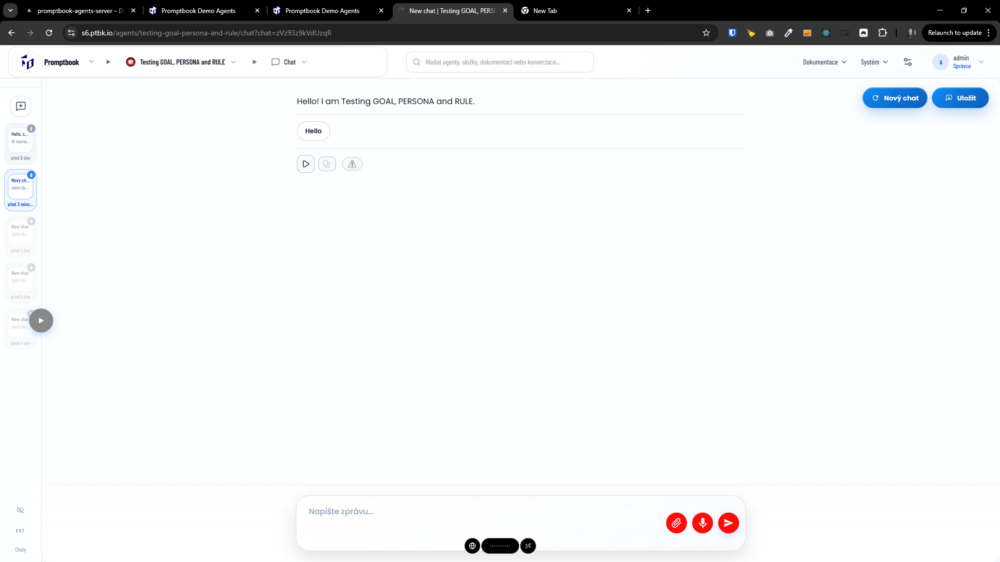
