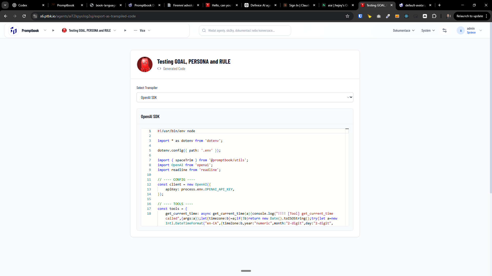
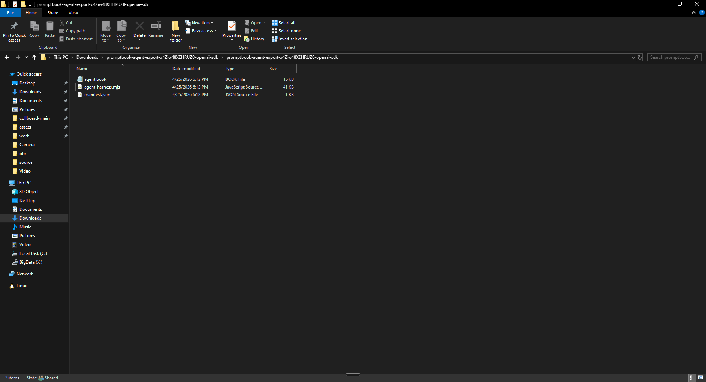

[x] $2.03 an hour by OpenAI Codex `gpt-5.4`

[✨✫] Enhance `export-as-transpiled-code` page

-   In this page you can export the agent as transpiled code / agent harness
-   The page should show the agent source book from which the agent was created, it shouldnt be editable but just button to edit
-   There should be also button to download the transpiled code as a files / zip
-   Keep in mind the DRY _(don't repeat yourself)_ principle.
-   Do a proper analysis of the current functionality before you start implementing.
-   You are working with the [Agents Server](apps/agents-server)



---

[x] $1.42 an hour by OpenAI Codex `gpt-5.4`

[✨✫] The exported transpiled code should be runnable and self-contained

-   Now the exported zip contains the some js file but no `package.json`
-   It should be extremely easy to run the exported transpiled code, ideally just `npm install` and `npm start`
-   Create mocked `.env` file with instructions on how to fill it with the required environment variables to run the agent
-   There should be the `gitignore` file to ignore `node_modules` and `.env` and other unnecessary files
-   This logic - what is in the zip, how to run it,... should be responsibility of the transpiler, so when the user exports the agent as transpiled code, it should be ready to run and self-contained, with clear instructions on how to run it
-   The logic of zipping and downloading should be responsibility of the entire system not implemented in each transpiler, also adding example `.env` and `.gitignore` should be responsibility of the entire system, so when you implement new transpiler you just need to return the transpiled code and the system should take care of the rest, making sure that the exported code is always self-contained and easy to run, regardless of the transpiler used.
-   Keep in mind the DRY _(don't repeat yourself)_ principle.
-   Do a proper analysis of the current functionality before you start implementing.
-   You are working with the [Agents Server](apps/agents-server)



---

[x] by OpenAI Codex `gpt-5.4` commited manually

[✨✫] Add Anthropic Claude SDK transpiler

-   It should be available through `export-as-transpiled-code` page
-   Keep in mind the DRY _(don't repeat yourself)_ principle.
-   Do a proper analysis of the current functionality before you start implementing.
-   You are working with the [Agents Server](apps/agents-server)

---

[x] ~$0.4152 43 minutes by OpenAI Codex `gpt-5.4-mini`

[✨✫] Fix transpiled code export `tools` to be syntactically correct

**Currently in the exported code is:**

```javascript
// ---- TOOLS ----
const toolImplementations = {
    get_current_time: async get_current_time(a){/* ... */},
};
```

**But this is syntactically incorrect, it should be:**

```javascript
// ---- TOOLS ----
const toolImplementations = {
    async get_current_time(a) {
        /* ... */
    },
};
```

-   Keep in mind the DRY _(don't repeat yourself)_ principle.
-   Do a proper analysis of the current functionality before you start implementing.
-   You are working with the [Agents Server](apps/agents-server)

---

[x] ~$3.31 an hour by OpenAI Codex `gpt-5.4-mini`

[✨✫] Add `@openai/agents` transpiler

-   Now there is alreasy OpenAI SDK transpiler, but we should also add the `@openai/agents` transpiler to be able to export the agent as code that can be run with `@openai/agents` package
-   The RAG should be based on native vector store provided by OpenAI
-   It should be available through `export-as-transpiled-code` page
-   Keep in mind the DRY _(don't repeat yourself)_ principle.
-   Do a proper analysis of the current functionality before you start implementing.
-   You are working with the [Agents Server](apps/agents-server)

---

[x] ~$3.25 an hour by OpenAI Codex `gpt-5.4-mini`

[✨✫] Add AgentOS transpiler

-   Read the documentation of https://rivet.dev/agent-os/ and implement the transpiler to export the agent as AgentOS agent
-   It should be available through `export-as-transpiled-code` page
-   Keep in mind the DRY _(don't repeat yourself)_ principle.
-   Do a proper analysis of the current functionality before you start implementing.
-   You are working with the [Agents Server](apps/agents-server)

---

[x] ~$0.7384 42 minutes by OpenAI Codex `gpt-5.4-mini`

[✨✫] There are some commitments which can not be transpiled, warn the user about that on the `export-as-transpiled-code` page

-   Theese commitments can not be transpiled:
    -   `OPEN` - either explicitelly or just by not using `CLOSED`
    -   `MODEL` does not make sense to transpile, because the model is determined by transpiler
    -   `USE LOCATION` is dependent on browser environment and can not be transpiled
    -   `USE PRIVACY` depends more on external factors and can not be transpiled
-   When any of theese commitments is used in the agent warning should be shown on the `export-as-transpiled-code` page, that the agent contains some functionality which can not be transpiled and exported code may not work 1:1 with the agent created in the Agents Server, and user should be informed about which functionality can not be transpiled
-   This is transpiler-agnostic, so it should be implemented in a way that it works for every transpiler, not just for specific one
-   Keep in mind the DRY _(don't repeat yourself)_ principle.
-   Do a proper analysis of the current functionality before you start implementing.
-   You are working with the [Agents Server](apps/agents-server)

---

[x] ~$1.00 an hour by OpenAI Codex `gpt-5.4-mini`

[✨✫] Add E2B transpiler

-   Add transpiler to export the agent as E2B agent, read the documentation of https://e2b.dev/ and implement the transpiler to export the agent as E2B agent
-   It should be available through `export-as-transpiled-code` page
-   Keep in mind the DRY _(don't repeat yourself)_ principle.
-   Do a proper analysis of the current functionality before you start implementing.
-   You are working with the [Agents Server](apps/agents-server)

---

[!] (failed after 2 attempts) 33 minutes by OpenAI Codex `gpt-5.4-mini`

[✨✫] The `TEAM` should be reflected as a part of the transpiled code

-   When exporting agent which has `TEAM` the transpiled code should build-in the team members
-   The exported code should be self-contained and runnable without any additional configuration or running server
-   The team members can have another team members, bring entire team hierarchy into the transpiled code
-   Team members can be on external federated server
-   In the transpiled code there should be some clear way to identify the team members
-   It should be available through `export-as-transpiled-code` page
-   Keep in mind the DRY _(don't repeat yourself)_ principle.
    -   Use the existing mechanisms to resolve the team members and their information, do not implement new logic if it can be reused from the existing codebase
    -   Also in the transpiled code do not duplicate same code for each team member, but export reusable code
-   You are doing this change for every transpiler
-   Do a proper analysis of the current functionality before you start implementing.
-   You are working with the [Agents Server](apps/agents-server)

---

[x] ~$4.82 an hour by OpenAI Codex `gpt-5.4-mini`

[✨✫] Add Anthropic Claude Managed agents transpiler

-   It should be available through `export-as-transpiled-code` page
-   Keep in mind the DRY _(don't repeat yourself)_ principle.
-   Do a proper analysis of the current functionality before you start implementing.
-   You are working with the [Agents Server](apps/agents-server)

---

[ ]

[✨✫] foo

-   @@@
-   Keep in mind the DRY _(don't repeat yourself)_ principle.
-   Do a proper analysis of the current functionality before you start implementing.
-   You are working with the [Agents Server](apps/agents-server)
-   If you need to do the database migration, do it
-   Add the changes into the [changelog](changelog/_current-preversion.md)

---

[-]

[✨✫] foo

-   @@@
-   Keep in mind the DRY _(don't repeat yourself)_ principle.
-   Do a proper analysis of the current functionality before you start implementing.
-   You are working with the [Agents Server](apps/agents-server)
-   If you need to do the database migration, do it
-   Add the changes into the [changelog](changelog/_current-preversion.md)


