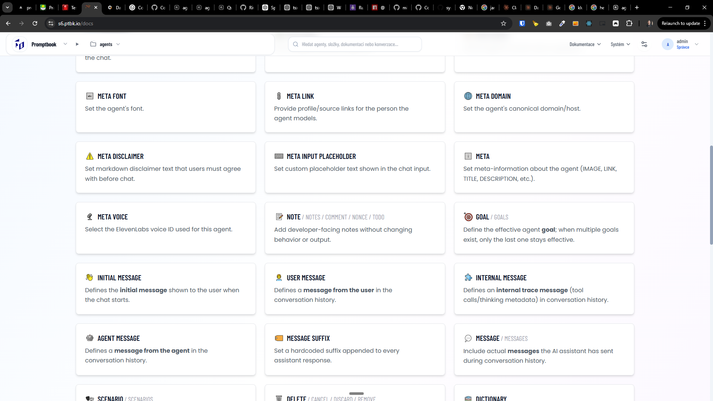

[x] ~$0.9713 34 minutes by OpenAI Codex `gpt-5.4-mini`

[✨♖] Make commitment `GOAL`, `RULE`, `KNOWLEDGE` and `TEAM` more important

-   In the documentation the ``GOAL`, `RULE`, `KNOWLEDGE` and `TEAM` commitments are burried in the middle of the list of commitments, but it is actually the most important commitment as it defines the main goal of the agent, so we should make it more visible and important
-   Make it in some universal way, create a flag `isImportant` for the commitments which will be used to sort the commitments in the menu, documentation and in the intelisense
-   Also order deprecated commitments at the bottom in the documentation
-   Keep in mind the DRY _(don't repeat yourself)_ principle.
-   Do a proper analysis of the current functionality before you start implementing.
-   You are working with the [commitments](src/commitments)
    -   Look at `src/commitments`
    -   Look at menu item documentation in [Agents Server](apps/agents-server)
    -   Look at `/docs` Documentation on [Agents Server](apps/agents-server)
    -   Look at `/api/docs/book-language.md` on [Agents Server](apps/agents-server)
    -   Look at <BookEditor/> intelisense
-   Add the changes into the [changelog](changelog/_current-preversion.md)

---

[x] ~$0.00 25 minutes by OpenAI Codex `gpt-5.4-mini`

[✨♖] Deprecate commitment `ACTION`

-   There are `USE` commitments which are used instead
-   Keep in mind the DRY _(don't repeat yourself)_ principle.
-   Do a proper analysis of the current functionality before you start implementing.
-   You are working with the [commitments](src/commitments)
-   Add the changes into the [changelog](changelog/_current-preversion.md)

---

[x] ~$0.5054 28 minutes by OpenAI Codex `gpt-5.4-mini`

[✨♖] Deprecate commitment `TEMPLATE` and `FORMAT`

-   There are `WRITING SAMPLE` and `WRITING RULES` commitments which are used instead
-   Keep in mind the DRY _(don't repeat yourself)_ principle.
-   Do a proper analysis of the current functionality before you start implementing.
-   You are working with the [commitments](src/commitments)
-   Add the changes into the [changelog](changelog/_current-preversion.md)

---

[x] ~$0.3968 30 minutes by OpenAI Codex `gpt-5.5`

[✨♖] Do not treat `USE` as separate commitment, but rather as group of commitments

-   There are many `USE` commitments like `USE PROJECT`, `USE PRIVACY`, `USE API`, `USE LOCATION`, et. but not such a commitment as `USE`, so it does not make sense to treat `USE` as separate commitment, but rather as group of commitments, so we should remove `USE` commitment from list of commitments
-   Keep in mind the DRY _(don't repeat yourself)_ principle.
-   Do a proper analysis of the current functionality before you start implementing.
-   You are working with the [commitments](src/commitments)
    -   Look at `src/commitments`
    -   Look at menu item documentation in [Agents Server](apps/agents-server)
    -   Look at `/docs` Documentation on [Agents Server](apps/agents-server)
    -   Look at `/api/docs/book-language.md` on [Agents Server](apps/agents-server)
    -   Look at <BookEditor/> intelisense
-   Add the changes into the [changelog](changelog/_current-preversion.md)

---

[ ] !

[✨♖] Flag `DELETE` commitment as unfinished and not ready to use

-   Create a flag `isUnfinished` for the commitments which will be used to mark the commitments which are not finished and not ready to use, and mark `DELETE` commitment with this flag
-   The actual behaviour across the app should be simmilar to deprecated commitments, but with different message, that this commitment is not finished and not ready to use, and user should be careful when using it
-   Also at the documentation it should be lower in the list of commitments, marked as low-level commitment and visually faded
-   Keep in mind the DRY _(don't repeat yourself)_ principle.
-   Do a proper analysis of the current functionality before you start implementing.
-   You are working with the [commitments](src/commitments)
    -   Look at `src/commitments`
    -   Look at menu item documentation in [Agents Server](apps/agents-server)
    -   Look at `/docs` Documentation on [Agents Server](apps/agents-server)
    -   Look at `/api/docs/book-language.md` on [Agents Server](apps/agents-server)
    -   Look at <BookEditor/> intelisense
-   Add the changes into the [changelog](changelog/_current-preversion.md)

---

[ ] !

[✨♖] Group `OPEN` and `CLOSED` commitments together in the documentation

-   Keep in mind the DRY _(don't repeat yourself)_ principle.
-   Do a proper analysis of the current functionality before you start implementing.
-   You are working with the [commitments](src/commitments)
    -   Look at `src/commitments`
    -   Look at menu item documentation in [Agents Server](apps/agents-server)
    -   Look at `/docs` Documentation on [Agents Server](apps/agents-server)
    -   Look at `/api/docs/book-language.md` on [Agents Server](apps/agents-server)
    -   Look at <BookEditor/> intelisense
-   Add the changes into the [changelog](changelog/_current-preversion.md)

---

[ ] !

[✨♖] Commitment `MODEL` is low-level commitment

-   Create a flag `isLowLevel` for the commitments which will be used to mark the commitments which are low-level and not used by most of the users, and mark `MODEL` commitment with this flag
-   The actual behaviour across the app should be simmilar to deprecated and unfinished commitments, but with different message, that this commitment is low-level and not used by most of the users, and user should be careful when using it
-   Also at the documentation it should be lower in the list of commitments, marked as low-level commitment and visually faded
-   Keep in mind the DRY _(don't repeat yourself)_ principle.
-   Do a proper analysis of the current functionality before you start implementing.
-   You are working with the [commitments](src/commitments)
    -   Look at `src/commitments`
    -   Look at menu item documentation in [Agents Server](apps/agents-server)
    -   Look at `/docs` Documentation on [Agents Server](apps/agents-server)
    -   Look at `/api/docs/book-language.md` on [Agents Server](apps/agents-server)
    -   Look at <BookEditor/> intelisense
-   Add the changes into the [changelog](changelog/_current-preversion.md)

---

[ ] !

[✨♖] Prefer singular names for the commitments

-   For example there are commitment aliases `RULE` / `RULES`
-   Now the `RULES` is before `RULE` in the documentation and `RULE` is considered as alias
-   It should be on the opposite, `RULE` should be before `RULES` and `RULES` should be considered as alias
-   Do this for all the commitments with singular and plural names, prefer singular names for the commitments and consider plural names as aliases
-   Keep in mind the DRY _(don't repeat yourself)_ principle.
-   Do a proper analysis of the current functionality before you start implementing.
-   You are working with the [commitments](src/commitments)
    -   Look at `src/commitments`
    -   Look at menu item documentation in [Agents Server](apps/agents-server)
    -   Look at `/docs` Documentation on [Agents Server](apps/agents-server)
    -   Look at `/api/docs/book-language.md` on [Agents Server](apps/agents-server)
    -   Look at <BookEditor/> intelisense
-   Add the changes into the [changelog](changelog/_current-preversion.md)

---

[-] !

[✨♖] bar

-   @@@
-   Keep in mind the DRY _(don't repeat yourself)_ principle.
-   Do a proper analysis of the current functionality before you start implementing.
-   You are working with the [commitments](src/commitments)
-   Add the changes into the [changelog](changelog/_current-preversion.md)

---

[-] !

[✨♖] bar

-   @@@
-   Keep in mind the DRY _(don't repeat yourself)_ principle.
-   Do a proper analysis of the current functionality before you start implementing.
-   You are working with the [commitments](src/commitments)
-   Add the changes into the [changelog](changelog/_current-preversion.md)

