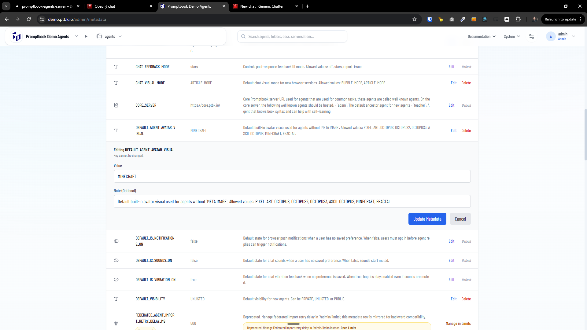

[ ] !!!

[✨▪️] Some metadata items are enums but they are shown as string

-   For example the `DEFAULT_AGENT_AVATAR_VISUAL` metadata item should be enum with options `PIXEL_ART`, `OCTOPUS`, `OCTOPUS2`, `OCTOPUS3`, `ASCII_OCTOPUS`, `MINECRAFT`, `FRACTAL`, `ORB`,...
    But in the `/admin/metadata` you can set it to any string, and it will be accepted, but it should be only possible to select one of the predefined options
-   Go through all the metadata items and check if there are some other items which should be enums but are currently shown as string, and change them to enums with predefined options if needed
-   Do some system for this
-   Keep in mind the DRY _(don't repeat yourself)_ principle.
-   Do a proper analysis of the current functionality before you start implementing.
-   You are working with the [Agents Server](apps/agents-server)

---

[-]

[✨▪️] baz

-   @@@
-   Keep in mind the DRY _(don't repeat yourself)_ principle.
-   Do a proper analysis of the current functionality before you start implementing.
-   You are working with the [Agents Server](apps/agents-server)
-   If you need to do the database migration, do it
-   Add the changes into the [changelog](changelog/_current-preversion.md)

---

[-]

[✨▪️] baz

-   @@@
-   Keep in mind the DRY _(don't repeat yourself)_ principle.
-   Do a proper analysis of the current functionality before you start implementing.
-   You are working with the [Agents Server](apps/agents-server)
-   If you need to do the database migration, do it
-   Add the changes into the [changelog](changelog/_current-preversion.md)

---

[-]

[✨▪️] baz

-   @@@
-   Keep in mind the DRY _(don't repeat yourself)_ principle.
-   Do a proper analysis of the current functionality before you start implementing.
-   You are working with the [Agents Server](apps/agents-server)
-   If you need to do the database migration, do it
-   Add the changes into the [changelog](changelog/_current-preversion.md)
