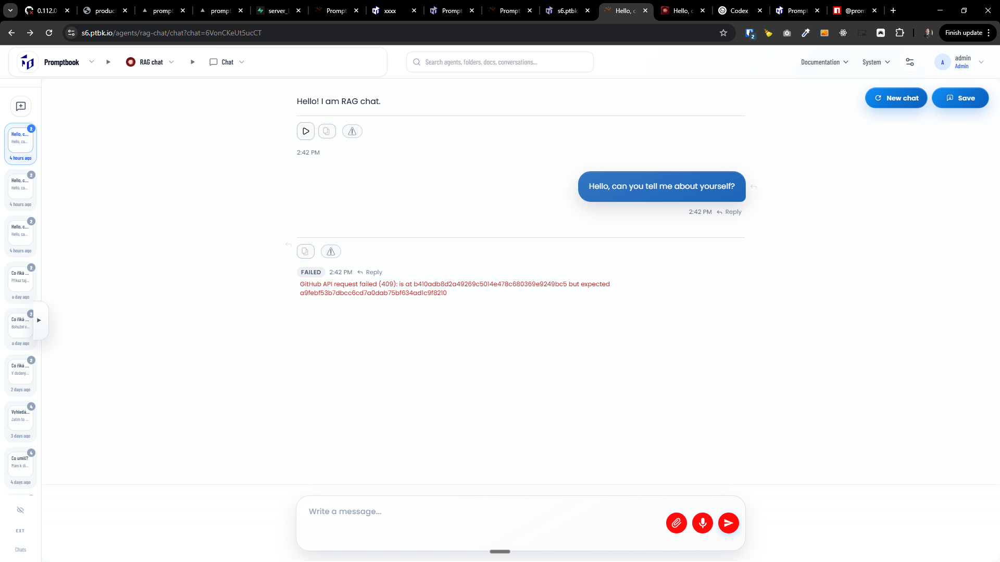
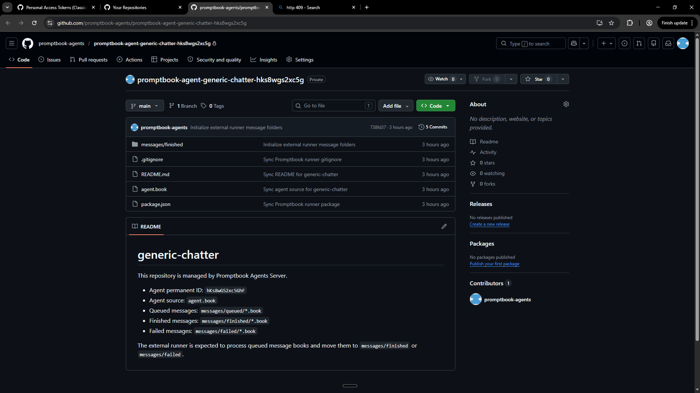

[x] (2 attempts) ~$0.1345 3 hours by OpenAI Codex `gpt-5.5`

[✨🕟] Running of the chats on Agents server should be externalized to external service

-   Now the chats inference are running inside the Agent server, we need to move this running to the external service which will manage the heavy lifting of running the chats and the Agents server will be only responsible for managing the agent source book, and showing the the chats in the UI, but not running the chats itself
-   The Agent server remain as the source of the truth and main UI for managing the agents, but the agents itself will be run on the external service
-   You are now not implementing the external service, you are just connecting the Agents Server to it The Agent server is running on Vercel but the agents `ptbk agent run` will be running on some dedicated server
-   Way how to synchronize the Agents server with the external service is via git repository and pushing/pulling the changes and creating markdown
-   For each agent there will be one git repository with this structure:

```
messages/
    queued/
    finished/
    failed/
agent.book
.gitignore
package.json
README.md
```

The file in `messages/*/` has extension `.book`, it is named as `YYYY-MM-DD-HH-MM-<UUID_OF_CHAT>.book` and looks like:

```book
MESSAGE @User
Můžu odejít kdykoli na oběd během pracovního dne?
```

And the finished file:

```book
MESSAGE @User
Můžu odejít kdykoli na oběd během pracovního dne?

ANSWER @Agent
Ano, ...
```

**agent.book** - the source of the agent
**.gitignore**

```
.env

node_modules
.promptbook

# Promptbook Coder
/.tmp
/.promptbook/ptbk-coder

```

**package.json** - with dynamic promptbook version

```json
{
    "dependencies": {
        "ptbk": "0.112.0-64"
    }
}
```

**README.md** - Some basic README what is the repo about

-   External service would be `ptbk agent run` BUT you are not implementing or doing anything with it, you are connecting the Agents Server to it and using it to run the chats instead of running them inside the Agents Server
-   Agents server responsibility isnt to run the chats but:
    1. Handle the agent source book, the source of the truth is on the agents server
    2. Synchronize this to the external git repository
    3. Create this repository if not existing and link it via `AgentExternals` table
    4. When user writes the message to the chat, create a `.book` file in the repository with that message in `messages/queued`
        - This aint book with the agent but just book with the chat
    5. Manage the filenames (the ids) of theese messages
    6. Look at the status of theese messages, are they still in the `messages/queued`, `messages/finished` or `messages/failed`
    7. Reflect the status of theese messages in the UI of the chat and task manager
-   Keep in mind the DRY _(don't repeat yourself)_ principle.
-   Connection to Github should be configured in env variabiles of the server _(not metadata or wallet)_
-   Manage timeouts and limits, when the message is commited to `messages/queued` it is expected that the answer will be commited to `messages/finished` in 5 minutes, if after 5 minutes the message is still in `messages/queued`, show it as failed BUT do not move it anywhere. It can happen that the external service is not running but will be running later, so do not move the file anywhere, just show it as failed in the UI, and if later it is moved to `messages/finished`, show it as finished in the UI
-   Deprecate and abandon the running of the Agents via OpenAI Agents SDK, You can keep the functions and classes in the repository, but deprecate them and they won't be used anywhere anymore.
-   Do a proper analysis of the current functionality before you start implementing. This is a very big structural change, so do a deep analysis of everything which is related to this change.
-   You are working with the [Agents Server](apps/agents-server)
-   If you need to do the database migration, do it
-   Add the changes into the [changelog](changelog/_current-preversion.md)

---

[x] ~$0.00 an hour by GitHub Copilot `gpt-5.4`

[✨🕟] Fix "GitHub API request failed (409): is at b410adb8d2a49269c5014e478c680369e9249bc5 but expected a9febf53b7dbcc6cd7a0dab75bf634ad1c9f8210"

-   When migrating to the new way of running the chats on the external service, there are some issues with the github integration and syncing the changes
-   The repositories are successfully created and the some files are commited, but there are some issues
-   Do a proper analysis of the current functionality before you start implementing. And also the change which was made:
    -   [File with PRD](prompts/2026-04-6890-agents-server-external-chat-runner.md)
    -   Commit `e7337c3607779880abae0eac06f4da5892ff4d51`
-   You are working with the [Agents Server](apps/agents-server)
-   If you need to do the database migration, do it
-   Add the changes into the [changelog](changelog/_current-preversion.md)





---

[x] ~$0.00 2 hours by GitHub Copilot `gpt-5.4`

[✨🕟] The messages should work in threads and should not be duplicated

-   One file should not correspond to one `.book` file _(now each message is sepated into one file and also there is a bug that theese files are triplicated)_
-   Long threads of messages should be supported, so one file can contain multiple messages in the thread, and also the answer to the message should be in the same file, not in the separate file, both from point of view of the agent server and the `ptbk agent run` utility which is running the chats on the external service
-   The `ptbk agent` should look at `.book` files (not `.md` files)
-   Parse the book files with messages via `src/book-3.0/Book.ts` and finish it
-   Do a proper analysis of the current functionality of chat on agent server and `ptbk agent` before you start implementing. And also the change which was made:
    -   [File with PRD](prompts/2026-04-6890-agents-server-external-chat-runner.md)
-   You are working with the [Agents Server](apps/agents-server)
-   You are working with [`ptbk agent` CLI command](src/cli/cli-commands/agent/run.ts)
-   We don't need to keep backwards compatibility of `ptbk agent` and the created repos. We are in the development of the new feature, which isn't deployed for any real customer yet, so we can change the existing functionality and do breaking changes if needed
-   If you need to do the database migration, do it

-   Add the changes into the [changelog](changelog/_current-preversion.md)

