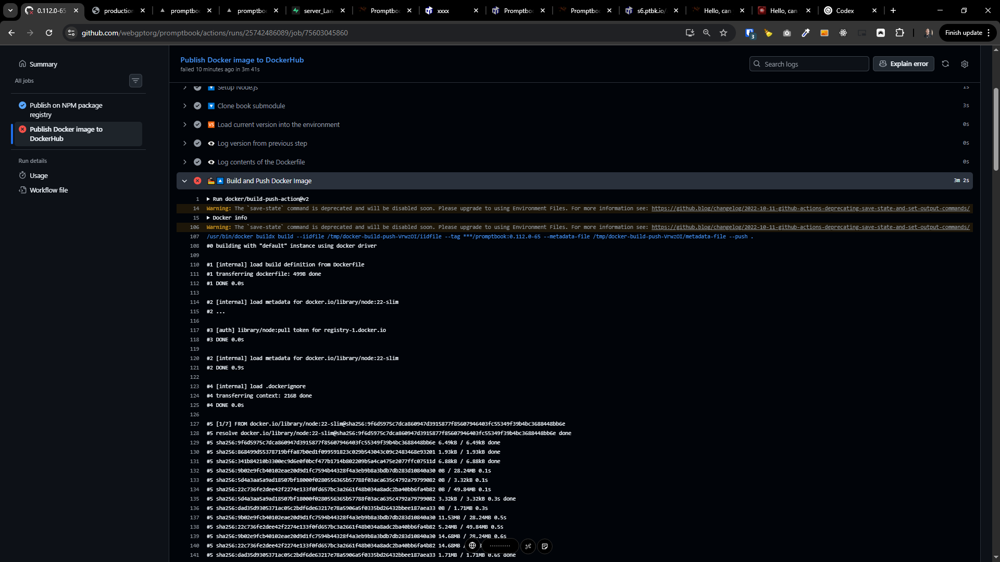
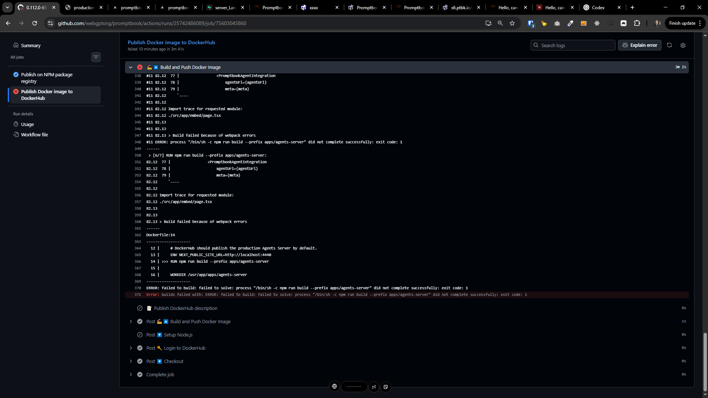

[ ]

[✨✒️] Fix publishing new version of Promptbook to Docker

-   Keep in mind the DRY _(don't repeat yourself)_ principle.
-   Do a proper analysis of the current functionality before you start implementing.

**Log from Github Actions:**

```log
Run docker/build-push-action@v2
Warning: The `save-state` command is deprecated and will be disabled soon. Please upgrade to using Environment Files. For more information see: https://github.blog/changelog/2022-10-11-github-actions-deprecating-save-state-and-set-output-commands/
Docker info
Warning: The `save-state` command is deprecated and will be disabled soon. Please upgrade to using Environment Files. For more information see: https://github.blog/changelog/2022-10-11-github-actions-deprecating-save-state-and-set-output-commands/
/usr/bin/docker buildx build --iidfile /tmp/docker-build-push-VrwzOI/iidfile --tag ***/promptbook:0.112.0-65 --metadata-file /tmp/docker-build-push-VrwzOI/metadata-file --push .
#0 building with "default" instance using docker driver

#1 [internal] load build definition from Dockerfile
#1 transferring dockerfile: 499B done
#1 DONE 0.0s

#2 [internal] load metadata for docker.io/library/node:22-slim
#2 ...

#3 [auth] library/node:pull token for registry-1.docker.io
#3 DONE 0.0s

#2 [internal] load metadata for docker.io/library/node:22-slim
#2 DONE 0.9s

#4 [internal] load .dockerignore
#4 transferring context: 216B done
#4 DONE 0.0s

#5 [1/7] FROM docker.io/library/node:22-slim@sha256:9f6d5975c7dca860947d3915877f85607946403fc55349f39b4bc3688448bb6e
#5 resolve docker.io/library/node:22-slim@sha256:9f6d5975c7dca860947d3915877f85607946403fc55349f39b4bc3688448bb6e done
#5 sha256:9f6d5975c7dca860947d3915877f85607946403fc55349f39b4bc3688448bb6e 6.49kB / 6.49kB done
#5 sha256:868499d55378719bffa87b0ed1f099591823c029b543043c09c2483468e93201 1.93kB / 1.93kB done
#5 sha256:341b84210b3300ec9d6e0f0bcf477b1714b802209b5a4ca475e2077ffc07511d 6.88kB / 6.88kB done
#5 sha256:9b02e9fcb40102eae20d9d1fc7594b44328f4a3eb9b8a3bdb7db283d10840a30 0B / 28.24MB 0.1s
#5 sha256:5d4a3aa5a9ad18507bf18000f0280556365b57788f03aca635c4792a79799082 0B / 3.32kB 0.1s
#5 sha256:22c736fe2dee42f2274e133f0fd657bc3a2661f48b034a8adc2ba40bb6fa4b82 0B / 49.84MB 0.1s
#5 sha256:5d4a3aa5a9ad18507bf18000f0280556365b57788f03aca635c4792a79799082 3.32kB / 3.32kB 0.3s done
#5 sha256:dad35d9305371ac05c2bdf6de63217e78a5906a5f0335bd26432bbee187aea33 0B / 1.71MB 0.3s
#5 sha256:9b02e9fcb40102eae20d9d1fc7594b44328f4a3eb9b8a3bdb7db283d10840a30 11.53MB / 28.24MB 0.5s
#5 sha256:22c736fe2dee42f2274e133f0fd657bc3a2661f48b034a8adc2ba40bb6fa4b82 5.24MB / 49.84MB 0.5s
#5 sha256:9b02e9fcb40102eae20d9d1fc7594b44328f4a3eb9b8a3bdb7db283d10840a30 14.68MB / 28.24MB 0.6s
#5 sha256:22c736fe2dee42f2274e133f0fd657bc3a2661f48b034a8adc2ba40bb6fa4b82 14.68MB / 49.84MB 0.6s
#5 sha256:dad35d9305371ac05c2bdf6de63217e78a5906a5f0335bd26432bbee187aea33 1.71MB / 1.71MB 0.6s done
#5 sha256:079e3008b73419a93cb985863971162eb59bcb78e57f6ef558fc198ad2848d89 0B / 450B 0.6s
#5 sha256:9b02e9fcb40102eae20d9d1fc7594b44328f4a3eb9b8a3bdb7db283d10840a30 17.83MB / 28.24MB 0.7s
#5 sha256:22c736fe2dee42f2274e133f0fd657bc3a2661f48b034a8adc2ba40bb6fa4b82 24.12MB / 49.84MB 0.7s
#5 sha256:9b02e9fcb40102eae20d9d1fc7594b44328f4a3eb9b8a3bdb7db283d10840a30 23.07MB / 28.24MB 0.8s
#5 sha256:22c736fe2dee42f2274e133f0fd657bc3a2661f48b034a8adc2ba40bb6fa4b82 31.46MB / 49.84MB 0.8s
#5 sha256:079e3008b73419a93cb985863971162eb59bcb78e57f6ef558fc198ad2848d89 450B / 450B 0.8s done
#5 sha256:9b02e9fcb40102eae20d9d1fc7594b44328f4a3eb9b8a3bdb7db283d10840a30 28.24MB / 28.24MB 0.9s
#5 sha256:22c736fe2dee42f2274e133f0fd657bc3a2661f48b034a8adc2ba40bb6fa4b82 38.80MB / 49.84MB 0.9s
#5 sha256:9b02e9fcb40102eae20d9d1fc7594b44328f4a3eb9b8a3bdb7db283d10840a30 28.24MB / 28.24MB 0.9s done
#5 sha256:22c736fe2dee42f2274e133f0fd657bc3a2661f48b034a8adc2ba40bb6fa4b82 48.23MB / 49.84MB 1.0s
#5 extracting sha256:9b02e9fcb40102eae20d9d1fc7594b44328f4a3eb9b8a3bdb7db283d10840a30
#5 sha256:22c736fe2dee42f2274e133f0fd657bc3a2661f48b034a8adc2ba40bb6fa4b82 49.84MB / 49.84MB 1.1s done
#5 extracting sha256:9b02e9fcb40102eae20d9d1fc7594b44328f4a3eb9b8a3bdb7db283d10840a30 1.6s done
#5 extracting sha256:5d4a3aa5a9ad18507bf18000f0280556365b57788f03aca635c4792a79799082
#5 extracting sha256:5d4a3aa5a9ad18507bf18000f0280556365b57788f03aca635c4792a79799082 done
#5 ...

#6 [internal] load build context
#6 transferring context: 870.36MB 4.3s done
#6 DONE 4.9s

#5 [1/7] FROM docker.io/library/node:22-slim@sha256:9f6d5975c7dca860947d3915877f85607946403fc55349f39b4bc3688448bb6e
#5 extracting sha256:22c736fe2dee42f2274e133f0fd657bc3a2661f48b034a8adc2ba40bb6fa4b82
#5 extracting sha256:22c736fe2dee42f2274e133f0fd657bc3a2661f48b034a8adc2ba40bb6fa4b82 1.0s done
#5 extracting sha256:dad35d9305371ac05c2bdf6de63217e78a5906a5f0335bd26432bbee187aea33
#5 extracting sha256:dad35d9305371ac05c2bdf6de63217e78a5906a5f0335bd26432bbee187aea33 0.0s done
#5 extracting sha256:079e3008b73419a93cb985863971162eb59bcb78e57f6ef558fc198ad2848d89 done
#5 DONE 8.2s

#7 [2/7] WORKDIR /usr/app
#7 DONE 0.0s

#8 [3/7] COPY package.json package-lock.json ./
#8 DONE 0.0s

#9 [4/7] RUN npm ci
#9 1.698 npm warn ERESOLVE overriding peer dependency
#9 1.698 npm warn While resolving: react-copy-to-clipboard@5.1.0
#9 1.698 npm warn Found: react@19.1.2
#9 1.698 npm warn node_modules/react
#9 1.698 npm warn   dev react@"19.1.2" from the root project
#9 1.698 npm warn   25 more (@dnd-kit/accessibility, @dnd-kit/core, ...)
#9 1.698 npm warn
#9 1.698 npm warn Could not resolve dependency:
#9 1.698 npm warn peer react@"^15.3.0 || 16 || 17 || 18" from react-copy-to-clipboard@5.1.0
#9 1.698 npm warn node_modules/swagger-ui-react/node_modules/react-copy-to-clipboard
#9 1.698 npm warn   react-copy-to-clipboard@"5.1.0" from swagger-ui-react@5.31.2
#9 1.698 npm warn   node_modules/swagger-ui-react
#9 1.698 npm warn
#9 1.698 npm warn Conflicting peer dependency: react@18.3.1
#9 1.698 npm warn node_modules/react
#9 1.698 npm warn   peer react@"^15.3.0 || 16 || 17 || 18" from react-copy-to-clipboard@5.1.0
#9 1.698 npm warn   node_modules/swagger-ui-react/node_modules/react-copy-to-clipboard
#9 1.698 npm warn     react-copy-to-clipboard@"5.1.0" from swagger-ui-react@5.31.2
#9 1.698 npm warn     node_modules/swagger-ui-react
#9 1.703 npm warn ERESOLVE overriding peer dependency
#9 1.704 npm warn While resolving: react-debounce-input@3.3.0
#9 1.704 npm warn Found: react@19.1.2
#9 1.704 npm warn node_modules/react
#9 1.704 npm warn   dev react@"19.1.2" from the root project
#9 1.704 npm warn   25 more (@dnd-kit/accessibility, @dnd-kit/core, ...)
#9 1.704 npm warn
#9 1.704 npm warn Could not resolve dependency:
#9 1.704 npm warn peer react@"^15.3.0 || 16 || 17 || 18" from react-debounce-input@3.3.0
#9 1.704 npm warn node_modules/swagger-ui-react/node_modules/react-debounce-input
#9 1.704 npm warn   react-debounce-input@"=3.3.0" from swagger-ui-react@5.31.2
#9 1.704 npm warn   node_modules/swagger-ui-react
#9 1.704 npm warn
#9 1.704 npm warn Conflicting peer dependency: react@18.3.1
#9 1.704 npm warn node_modules/react
#9 1.704 npm warn   peer react@"^15.3.0 || 16 || 17 || 18" from react-debounce-input@3.3.0
#9 1.704 npm warn   node_modules/swagger-ui-react/node_modules/react-debounce-input
#9 1.704 npm warn     react-debounce-input@"=3.3.0" from swagger-ui-react@5.31.2
#9 1.704 npm warn     node_modules/swagger-ui-react
#9 1.767 npm warn ERESOLVE overriding peer dependency
#9 1.767 npm warn While resolving: react-inspector@6.0.2
#9 1.767 npm warn Found: react@19.1.2
#9 1.767 npm warn node_modules/react
#9 1.767 npm warn   dev react@"19.1.2" from the root project
#9 1.767 npm warn   25 more (@dnd-kit/accessibility, @dnd-kit/core, ...)
#9 1.767 npm warn
#9 1.767 npm warn Could not resolve dependency:
#9 1.767 npm warn peer react@"^16.8.4 || ^17.0.0 || ^18.0.0" from react-inspector@6.0.2
#9 1.767 npm warn node_modules/swagger-ui-react/node_modules/react-inspector
#9 1.767 npm warn   react-inspector@"^6.0.1" from swagger-ui-react@5.31.2
#9 1.767 npm warn   node_modules/swagger-ui-react
#9 1.767 npm warn
#9 1.767 npm warn Conflicting peer dependency: react@18.3.1
#9 1.767 npm warn node_modules/react
#9 1.767 npm warn   peer react@"^16.8.4 || ^17.0.0 || ^18.0.0" from react-inspector@6.0.2
#9 1.767 npm warn   node_modules/swagger-ui-react/node_modules/react-inspector
#9 1.767 npm warn     react-inspector@"^6.0.1" from swagger-ui-react@5.31.2
#9 1.767 npm warn     node_modules/swagger-ui-react
#9 3.581 npm warn deprecated y-websocket-server@1.0.2: Package no longer supported. Contact Support at https://www.npmjs.com/support for more info.
#9 3.750 npm warn deprecated whatwg-encoding@3.1.1: Use @exodus/bytes instead for a more spec-conformant and faster implementation
#9 4.442 npm warn deprecated stable@0.1.8: Modern JS already guarantees Array#sort() is a stable sort, so this library is deprecated. See the compatibility table on MDN: https://developer.mozilla.org/en-US/docs/Web/JavaScript/Reference/Global_Objects/Array/sort#browser_compatibility
#9 5.975 npm warn deprecated multer@1.4.5-lts.2: Multer 1.x is impacted by a number of vulnerabilities, which have been patched in 2.x. You should upgrade to the latest 2.x version.
#9 6.096 npm warn deprecated lodash.get@4.4.2: This package is deprecated. Use the optional chaining (?.) operator instead.
#9 6.976 npm warn deprecated inflight@1.0.6: This module is not supported, and leaks memory. Do not use it. Check out lru-cache if you want a good and tested way to coalesce async requests by a key value, which is much more comprehensive and powerful.
#9 7.278 npm warn deprecated glob@8.1.0: Old versions of glob are not supported, and contain widely publicized security vulnerabilities, which have been fixed in the current version. Please update. Support for old versions may be purchased (at exorbitant rates) by contacting i@izs.me
#9 7.349 npm warn deprecated node-domexception@1.0.0: Use your platform's native DOMException instead
#9 7.495 npm warn deprecated rollup-plugin-visualizer@5.13.1: Contains unintended breaking changes
#9 8.286 npm warn deprecated crypto@1.0.1: This package is no longer supported. It's now a built-in Node module. If you've depended on crypto, you should switch to the one that's built-in.
#9 11.29 npm warn deprecated @humanwhocodes/config-array@0.13.0: Use @eslint/config-array instead
#9 11.41 npm warn deprecated @humanwhocodes/object-schema@2.0.3: Use @eslint/object-schema instead
#9 13.18 npm warn deprecated glob@7.2.3: Old versions of glob are not supported, and contain widely publicized security vulnerabilities, which have been fixed in the current version. Please update. Support for old versions may be purchased (at exorbitant rates) by contacting i@izs.me
#9 13.89 npm warn deprecated glob@7.2.3: Old versions of glob are not supported, and contain widely publicized security vulnerabilities, which have been fixed in the current version. Please update. Support for old versions may be purchased (at exorbitant rates) by contacting i@izs.me
#9 14.14 npm warn deprecated glob@7.2.3: Old versions of glob are not supported, and contain widely publicized security vulnerabilities, which have been fixed in the current version. Please update. Support for old versions may be purchased (at exorbitant rates) by contacting i@izs.me
#9 14.26 npm warn deprecated glob@7.2.3: Old versions of glob are not supported, and contain widely publicized security vulnerabilities, which have been fixed in the current version. Please update. Support for old versions may be purchased (at exorbitant rates) by contacting i@izs.me
#9 14.28 npm warn deprecated rimraf@3.0.2: Rimraf versions prior to v4 are no longer supported
#9 15.29 npm warn deprecated glob@7.2.3: Old versions of glob are not supported, and contain widely publicized security vulnerabilities, which have been fixed in the current version. Please update. Support for old versions may be purchased (at exorbitant rates) by contacting i@izs.me
#9 20.91 npm warn deprecated @azure/openai@1.0.0-beta.13: The Azure OpenAI client library for JavaScript beta has been retired. Please migrate to the stable OpenAI SDK for JavaScript using the migration guide: https://github.com/Azure/azure-sdk-for-js/blob/main/sdk/openai/openai/MIGRATION.md.
#9 21.41 npm warn deprecated @finom/zod-to-json-schema@3.24.11: Use https://www.npmjs.com/package/zod-v3-to-json-schema instead. See issue comment for details: https://github.com/StefanTerdell/zod-to-json-schema/issues/178#issuecomment-3533122539
#9 26.64 npm warn deprecated eslint@8.57.1: This version is no longer supported. Please see https://eslint.org/version-support for other options.
#9 83.66 
#9 83.66 added 2063 packages, and audited 2064 packages in 1m
#9 83.66 
#9 83.66 308 packages are looking for funding
#9 83.66   run `npm fund` for details
#9 83.97 
#9 83.97 72 vulnerabilities (1 low, 40 moderate, 29 high, 2 critical)
#9 83.97 
#9 83.97 To address issues that do not require attention, run:
#9 83.97   npm audit fix
#9 83.97 
#9 83.97 To address all issues possible (including breaking changes), run:
#9 83.97   npm audit fix --force
#9 83.97 
#9 83.97 Some issues need review, and may require choosing
#9 83.97 a different dependency.
#9 83.97 
#9 83.97 Run `npm audit` for details.
#9 83.97 npm notice
#9 83.97 npm notice New major version of npm available! 10.9.7 -> 11.14.1
#9 83.97 npm notice Changelog: https://github.com/npm/cli/releases/tag/v11.14.1
#9 83.97 npm notice To update run: npm install -g npm@11.14.1
#9 83.97 npm notice
#9 DONE 85.2s

#10 [5/7] COPY . .
#10 DONE 2.7s

#11 [6/7] RUN npm run build --prefix apps/agents-server
#11 0.190 
#11 0.190 > prebuild
#11 0.190 > npm run generate-reserved-paths && npx kill-port 4440 ||  exit 0
#11 0.190 
#11 0.282 
#11 0.282 > generate-reserved-paths
#11 0.282 > ts-node ./scripts/generate-reserved-paths/generate-reserved-paths.ts
#11 0.282 
#11 2.658 Generated /usr/app/apps/agents-server/src/generated/reservedPaths.ts with 28 reserved paths:
#11 2.659 _data, _next, admin, agents, api, dashboard, docs, embed, experiments, favicon.ico, fonts, humans.txt, logo-blue-white-256.png, manifest.webmanifest, openapi.json, pixel-agents-assets, recycle-bin, restricted, robots.txt, search, security.txt, sitemap.xml, sounds, story, sw.js, swagger, system, test
#11 3.054 npm warn exec The following package was not found and will be installed: kill-port@2.0.1
#11 3.400 Process on port 4440 killed
#11 3.411 
#11 3.411 > build
#11 3.411 > node -r ./scripts/ignore-kill-eperm.js ../../node_modules/next/dist/bin/next build && node ./scripts/prerender-homepage.js
#11 3.411 
#11 4.111 Attention: Next.js now collects completely anonymous telemetry regarding usage.
#11 4.111 This information is used to shape Next.js' roadmap and prioritize features.
#11 4.111 You can learn more, including how to opt-out if you'd not like to participate in this anonymous program, by visiting the following URL:
#11 4.111 https://nextjs.org/telemetry
#11 4.111 
#11 4.215    ▲ Next.js 15.4.11
#11 4.215    - Experiments (use with caution):
#11 4.215      ✓ externalDir
#11 4.215 
#11 4.251    Creating an optimized production build ...
#11 81.41 <w> [webpack.cache.PackFileCacheStrategy] Serializing big strings (126kiB) impacts deserialization performance (consider using Buffer instead and decode when needed)
#11 82.12 Failed to compile.
#11 82.12 
#11 82.12 ./src/app/embed/page.tsx
#11 82.12 Error:   x Expected a template literal, string or identifier inside the JSXExpressionContainer.
#11 82.12   | Read more: https://nextjs.org/docs/messages/invalid-styled-jsx-children
#11 82.12     ,-[/usr/app/apps/agents-server/src/app/embed/page.tsx:60:1]
#11 82.12  57 |     
#11 82.12  58 |         return (
#11 82.12  59 |             <>
#11 82.12  60 | ,->             <style jsx global>
#11 82.12  61 | |                   {spaceTrim(`
#11 82.12  62 | |                       html,
#11 82.12  63 | |                       body {
#11 82.12  64 | |                           margin: 0;
#11 82.12  65 | |                           width: 100%;
#11 82.12  66 | |                           height: 100%;
#11 82.12  67 | |                           background: transparent !important;
#11 82.12  68 | |                           overflow: hidden;
#11 82.12  69 | |                       }
#11 82.12  70 | |   
#11 82.12  71 | |                       #__next {
#11 82.12  72 | |                           width: 100%;
#11 82.12  73 | |                           height: 100%;
#11 82.12  74 | |                       }
#11 82.12  75 | |                   `)}
#11 82.12  76 | `->             </style>
#11 82.12  77 |                 <PromptbookAgentIntegration
#11 82.12  78 |                     agentUrl={agentUrl}
#11 82.12  79 |                     meta={meta}
#11 82.12     `----
#11 82.12 
#11 82.12 Import trace for requested module:
#11 82.12 ./src/app/embed/page.tsx
#11 82.13 
#11 82.13 
#11 82.13 > Build failed because of webpack errors
#11 ERROR: process "/bin/sh -c npm run build --prefix apps/agents-server" did not complete successfully: exit code: 1
------
 > [6/7] RUN npm run build --prefix apps/agents-server:
82.12  77 |                 <PromptbookAgentIntegration
82.12  78 |                     agentUrl={agentUrl}
82.12  79 |                     meta={meta}
82.12     `----
82.12 
82.12 Import trace for requested module:
82.12 ./src/app/embed/page.tsx
82.13 
82.13 
82.13 > Build failed because of webpack errors
------
Dockerfile:14
--------------------
  12 |     # DockerHub should publish the production Agents Server by default.
  13 |     ENV NEXT_PUBLIC_SITE_URL=http://localhost:4440
  14 | >>> RUN npm run build --prefix apps/agents-server
  15 |     
  16 |     WORKDIR /usr/app/apps/agents-server
--------------------
ERROR: failed to build: failed to solve: process "/bin/sh -c npm run build --prefix apps/agents-server" did not complete successfully: exit code: 1
Error: buildx failed with: ERROR: failed to build: failed to solve: process "/bin/sh -c npm run build --prefix apps/agents-server" did not complete successfully: exit code: 1
```


