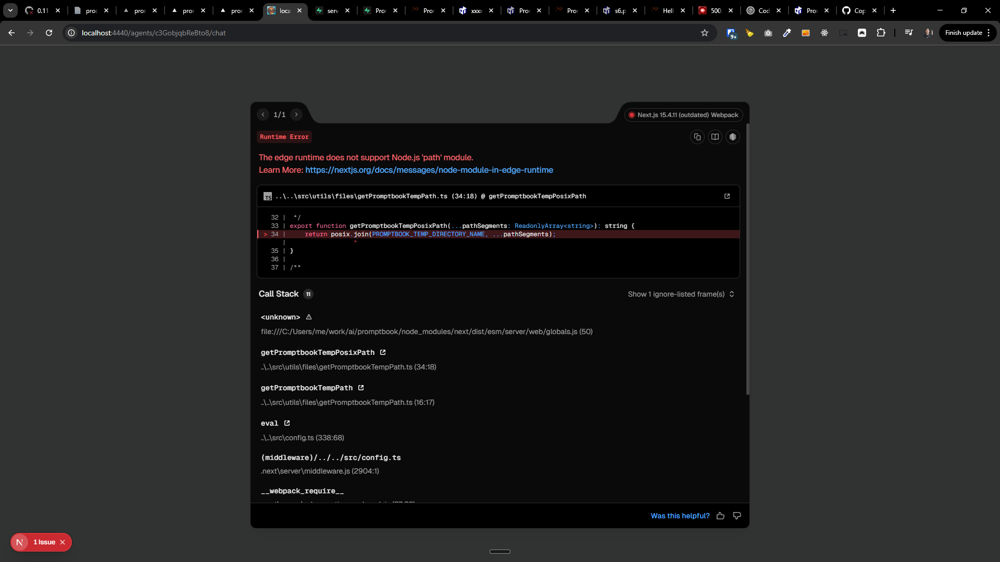

[x] (2 attempts) ~$0.00 2 hours by GitHub Copilot `gpt-5.4`

[✨🥯] Promptbook should use only `.promptbook` as tmp folder

-   Now there are used both `.tmp` and `.promptbook`
-   Only `.promptbook` should be used as tmp folder, Promptbook itself should not create any other tmp folders
-   But it can create as many subfolders in `.promptbook` as it needs, for example `.promptbook/agents-server` for the Agents Server needs, but not `.tmp` or any other folder
-   Do a proper analysis of the current functionality of every place using temporary folders before you start implementing.
-   Keep in mind the DRY _(don't repeat yourself)_ principle, creation and management of the temporary folders should be handled in one place and used across the whole codebase, do not create multiple implementations of temporary folder management
-   Keep in mind for Agents server that the edge runtime does not support Node.js 'path' module.
-   Temporary folders are used for example by [`ptbk` CLI util](src/cli/cli-commands/)
-   Add the changes into the [changelog](changelog/_current-preversion.md)

