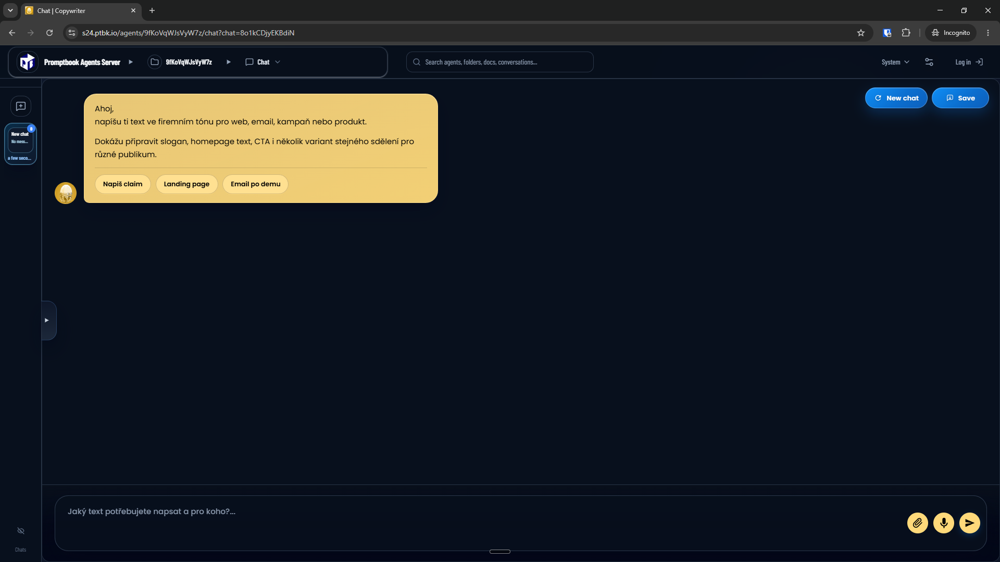

[x] ~$1.70 2 hours by OpenAI Codex `gpt-5.5`

[✨⬛️] Agents should be identified by ID, not their name.

-   Now the agents are identified by their normalized name, but it can happen that there are multiple agents with the same name or agent is renamed, in this case it will cause problems with identifying the agents in the url or api calls, so we need to identify the agents by their ID which is unique and does not change when agent is renamed
-   For example `https://s6.ptbk.io/agents/praha-13-2026-05/chat?chat=aYW5mbBxajbpwb` should became `https://s6.ptbk.io/agents/aYW5mbBxajbpwb/chat?chat=aYW5mbBxajbpwb`
-   Canonical URL of the agent and all its subroutes should be changed to use ID instead of name
-   Keep in mind the DRY _(don't repeat yourself)_ principle.
-   Do a proper analysis of the current functionality before you start implementing. This is a big change that affects many parts of the codebase, so it's important to understand how the agents are currently identified and used in the codebase before making the changes.
-   You are working with the [Agents Server](apps/agents-server)
-   If you need to do the database migration, do it
-   Add the changes into the [changelog](changelog/_current-preversion.md)

---

[x] $8.36 40 minutes by Claude Code

[✨⬛️] It should never happen that Agent id is shown in the UI, it should be only used in the code and urls, but never shown to the user

-   Agents are identified by their ID in the code and urls, but in the UI they should be always shown by their name, so that the user can easily understand which agent is which, and also it will be more user-friendly and easier to use
-   Keep in mind the DRY _(don't repeat yourself)_ principle.
-   Do a proper analysis of the current functionality before you start implementing.
-   You are working with the [Agents Server](apps/agents-server)

---

[-]

[✨⬛️] foo

-   @@@
-   Keep in mind the DRY _(don't repeat yourself)_ principle.
-   Do a proper analysis of the current functionality before you start implementing.
-   You are working with the [Agents Server](apps/agents-server)
-   If you need to do the database migration, do it
-   Add the changes into the [changelog](changelog/_current-preversion.md)

---

[-]

[✨⬛️] foo

-   @@@
-   Keep in mind the DRY _(don't repeat yourself)_ principle.
-   Do a proper analysis of the current functionality before you start implementing.
-   You are working with the [Agents Server](apps/agents-server)
-   If you need to do the database migration, do it
-   Add the changes into the [changelog](changelog/_current-preversion.md)

